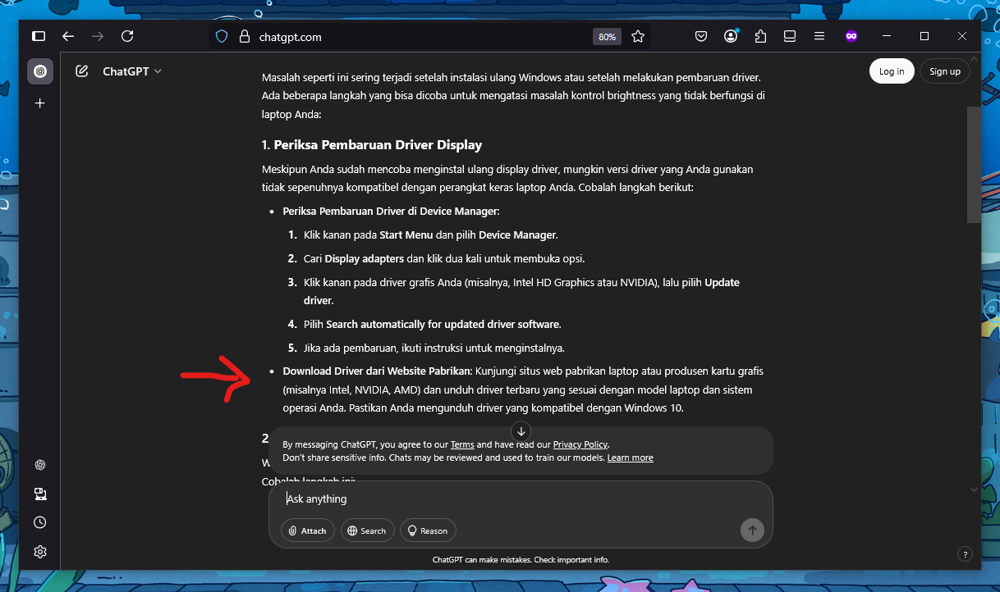
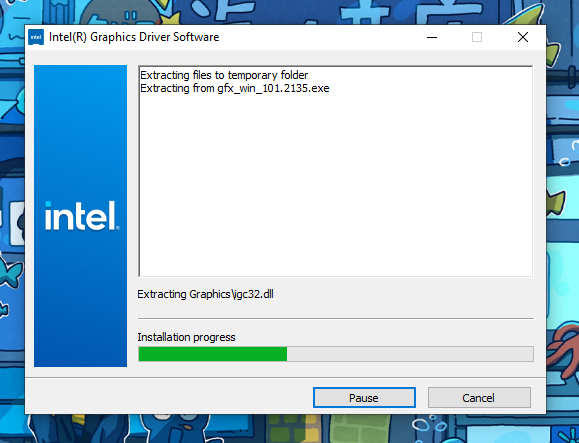
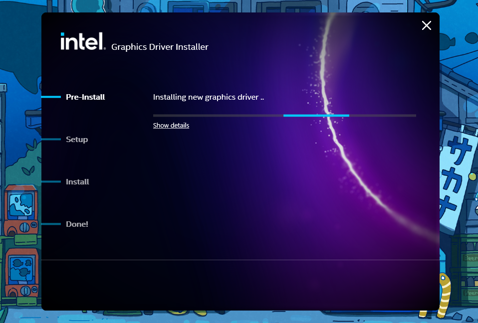
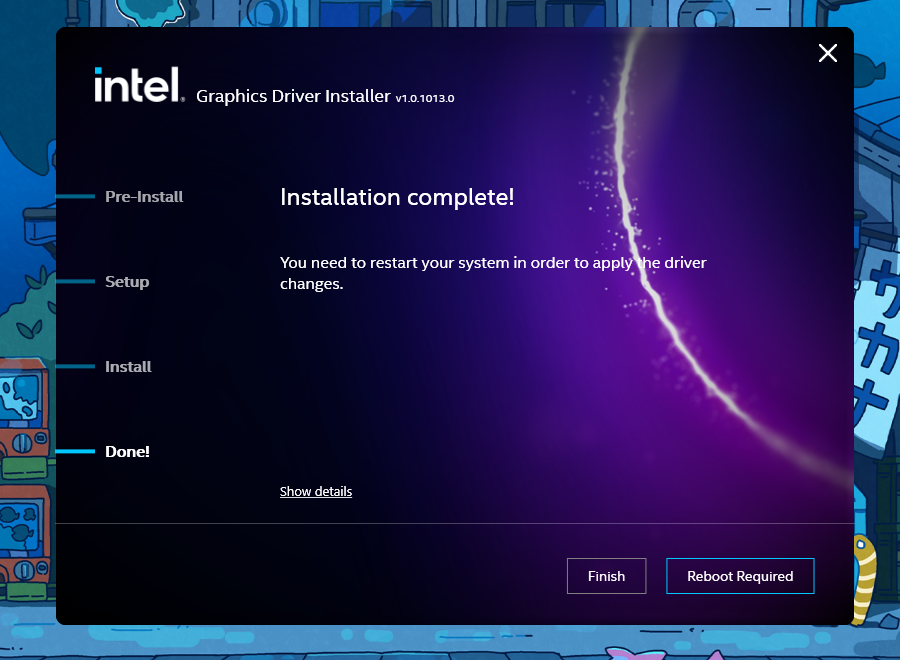

> **Notes:** Artikel ini dibuat masih terkait dengan instalasi Windows. Series-nya bisa dilihat di "drop-down menu" di atas.

:::note[Selayang Pandang (re: Curhat)]

Artikel ini melanjutkan pengalaman saya setelah berhasil _install_ Windows 10. Pengalaman "pertama" saya pasca instalasi Windows 10 sendiri secara _baremetal_[^1] kemudian berlanjut. Saya mengalami kendala karena laptop saya tidak bisa mengatur _brightness_, baik melalui Setting, maupun dengan _shortcut_. Saya juga sudah melakukan salah satu langkah solusi, yaitu meng-_install_ ulang _display driver_-nya di Setting "Display Manager", namun, tak kunjung memperbaiki masalah tersebut. Sejujurnya, saya juga sudah sempat mencari tahu penyebab dan solusi masalah ini ke Google, tapi juga belum menemukan jalan keluar yang tepat.

Akhirnya, kebingungan saya ini terjawab ketika saya bertanya ke ChatGPT (memang kehadiran AI ini sangat membantu kita menyelesaikan masalah, karena dia bisa menjawab dan memberikan alternatif-alternatif solusi yang _to the point_). ChatGPT merekomendasikan beberapa solusi pada masalah _brightness_ pasca instalasi Windows, dimana salah satunya adalah untuk tidak hanya melakukan instalasi _driver_ saja, tetapi juga meng-_install_ _driver_ yang tepat, sesuai dengan _hardware_ atau spesifikasi komputernya. Setelah itu, saya mengunduh _display driver_ dari Intel (karena laptop saya berprosesor Intel) dan Alhamdulillah, _brightness_ dapat berjalan dengan normal.

Berikut adalah Prompt-nya:
> Saya baru saja menginstall windows 10 di komputer, namun, brighteness di laptop saya tidak berfungsi dengan baik. Brightness tidak dapat diatur, baik melalui shortcut maupun melalui Setting di Windows. Saya juga sudah mencoba melakukan instal ulang display driver di Device Manager, tapi tetap tidak menyelesaikan masalah tersebut. Bagaimana solusinya?

:::

Berdasarkan pengalaman saya (yang tercantum pada bagian "Selayang Pandang" di atas), permasalahan _brightness_ tidak berfungsi dengan baik pasca instalasi Windows hampir dapat dipastikan karena kita belum meng-_install_ _display driver_ yang tepat.

Jika kita baru saja meng-_install_ Windows ke komputer kita, hampir dapat dipastikan _driver_ grafis yang terpasang adalah _driver_ grafis _default_ bawaan dari Windows, sehingga kita perlu memasang _driver_ yang lebih sesuai dengan prosesor secara manual. Hal ini dapat dipastikan melalui Setting "Device Manager" pada bagian **"Display adapter"**. 

Cara membuka "Display Manager" ada beberapa, diantaranya:
- Tekan "Windows" + "X" di keyboard, klik "Device Manager".
- Tekan "Windows" di keyboard, ketikkan "Device Manager", Enter.

Di sana, alih-alih melihat _driver_ yang sesuai dengan _hardware_ atau spesifikasi komputer (prosesor atau kartu grafis), seperti misalnya "Intel", "AMD", atau "NVIDIA", kita akan melihat bahwa _driver_ yang terpasang adalah _driver_ default Windows, yaitu "Microsoft Basic Display Adapter". Jadi, solusi untuk masalah ini yaitu: **"Memasang _driver_ yang sesuai dengan spesifikasi komputer"**.

Kebetulan, laptop saya menggunakan prosesor Intel, jadi jika komputer atau laptop kalian menggunakan prosesor yang sama, sila mengikuti langkah-langkah di bawah ini.

## 1. Pilih & unduh _driver_ dari website resminya.  

Intel: https://www.intel.co.id/content/www/id/id/search.html#sort=relevancy&f:@tabfilter=[Downloads]&f:@stm_10385_id=[Graphics]

Pilih _driver_ yang sesuai dengan spesifikasi laptop dan kebutuhan kalian. Kebetulan, karena laptop saya adalah laptop lama, jadi, saya "mentok" hanya dapat menggunakan _driver_ **Intel UHD Graphic 620** berikut ini:  
https://www.intel.co.id/content/www/id/id/download/776137/intel-7th-10th-gen-processor-graphics-windows.html

## 2. Jalankan _installer_-nya.

Setelah proses _download_ selesai, jalankan _driver_. Jika muncul window konfirmasi "User Account Control", pilih "YES". Biarkan proses ekstraksi file berjalan.

Selanjutnya, Intel akan mulai memasang _driver_-nya. Biarkan prosesnya berjalan.

Jika proses instalasi sudah selesai (seperti yang tampak pada tangkapan layar di bawah), kita akan diminta untuk me-_restart_ komputer/laptop-nya agar driver dapat berjalan dan berfungsi dengan baik. Sila _restart_.

[^1]: https://en.wikipedia.org/wiki/Bare-metal_server