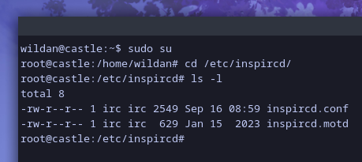
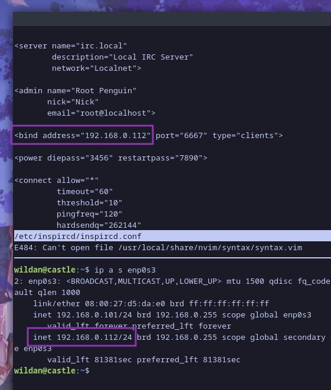
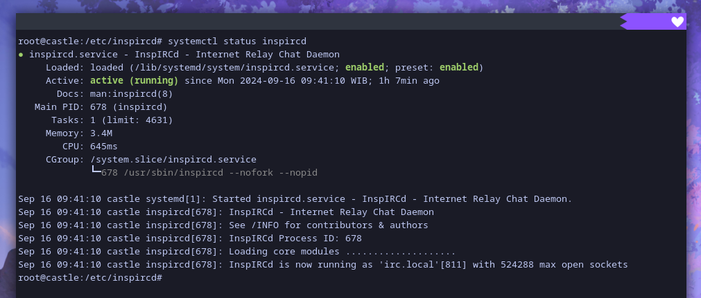
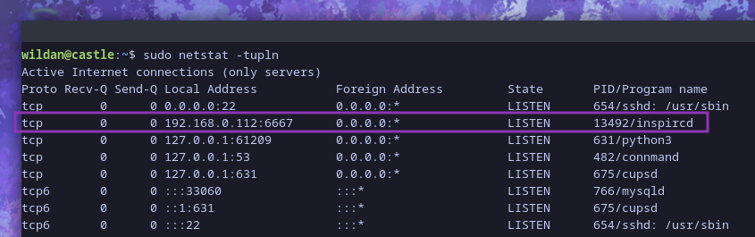
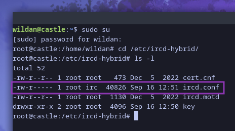
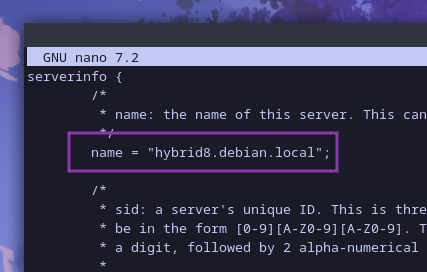
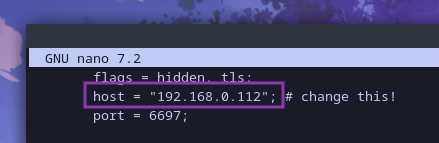
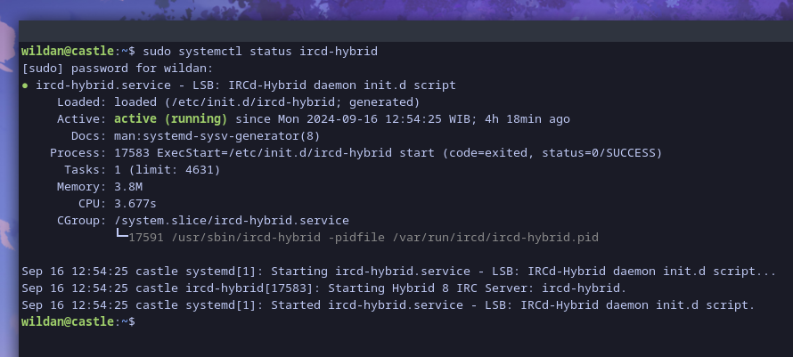
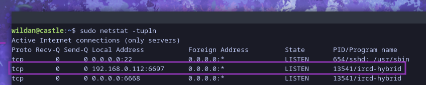

Salah satu aplikasi *chatting* konvensional yang saya sukai adalah IRC (*Internet Relay Chat*). IRC ini suka muncul di film-film yang bertemakan hacker ketika aktor digambarkan sedang berkomunikasi. Ya, seperti namanya, IRC jika boleh saya sandingkan adalah seperti aplikasi-aplikasi pengirim pesan (*chatting*) saat ini, mungkin Discord yang paling dekat. Kenapa Discord? Karena cara kerjanya mirip-mirip menurut saya. Misalnya, kita bisa membuat server dan *chatting* dengan orang lain di server yang sama tersebut. Nah, IRC juga demikian, kita bisa memilih satu server tertentu, kemudian masuk ke *channel* tertentu, dan memulai chat[^1].

Berikut saya lampirkan cuplikan film [Mr Robot](https://www.imdb.com/title/tt4158110/) yang menampilkan Elliot sedang chatting dengan timnya (FSOCIETY) via IRC:

<iframe width="100%" height="468"
  src="https://www.youtube.com/embed/67gYEK4FtzA"
  frameborder="0" allowfullscreen>
</iframe>

Tapi, kabar baiknya, selain bisa masuk dan ber-*chatting* ria di server dan *channel* yang sudah ada, kita juga bisa membuat server IRC kita sendiri! WOW! So, di artikel ini, saya sedikit akan berbagi cara membuat server IRC kita sendiri. Tapi, sebelum itu, mari saya sedikit beri *preface* bahwa artikel ini terdiri dari 2 bagian utama, yaitu:

1. Sekilas tentang IRC   
2. Setup IRC Server

Langsung ke bagian pertama...

## Sekilas Tentang IRC

Sebetulnya, apa itu IRC?

IRC atau *Internet Relay Chat* merupakan sebuah protokol yang dibuat pada tahun 1988 untuk melakukan pengiriman pesan teks secara *realtime* diantara komputer-komputer yang terhubung ke internet. Umumnya, IRC menggunakan sistem *chatting* di sebuah grup (atau diistilahkan sebagai *channel*), meskipun bisa juga digunakan untuk mengirim pesan orang perorang secara langsung. [^2] Ada banyak server IRC public yang bisa kita akses, diantaranya:[^3]

|   No  |           IRC Public Server           |                       URL                             |
|   --- |           ---                         |                       ---                             |
|   1   | DALnet                                | https://www.dal.net/server                            |
|   2   | EFNet                                 | http://www.efnet.org/?module=servers                  |
|   3   | GeekShed                              | http://www.geekshed.net/servers/                      |
|   4   | IRCnet                                | www.ircnet.info/servers                               |
|   5   | Libera.Chat                           | https://libera.chat/                                  |
|   6   | OFTC                                  | https://webchat.oftc.net/                             |
|   7   | QuakeNet                              | https://www.quakenet.org/servers                      |
|   8   | Rizon                                 | https://wiki.rizon.net/index.php?title=Servers        |
|   9   | Undernet                              | https://www.undernet.org/servers.php                  |

Sebagai ilustrasi saja, berikut adalah ketika saya join ke *channel* linux di server Libera:


Untuk terhubung ke sebuah server IRC, kita memerlukan IRC *client*. Ada banyak IRC *client* sebetulnya. IRC *client* yang pernah saya gunakan ada [irssi](https://irssi.org/) dan [weechat](https://weechat.org/). Tapi, kalau kalian mau tau lebih banyak terkait IRC *client*, berikut juga perbandingan-perbandingannya, bisa dibaca-baca di sini: https://en.wikipedia.org/wiki/Comparison_of_IRC_clients


## Setup IRC Server

Nah, sekarang, kita masuk ke inti artikel ini, yaitu membuat sebuah IRC server. Kita bisa menggunakan 2 alternatif cara (yang saya tahu), yaitu dengan *package* IRC Daemon [**inspird**](https://www.inspircd.org/) atau [**ircd-hybrid**](http://www.ircd-hybrid.org/). Kita akan bahas satu persatu...

### inspircd

Pertama-tama, kita perlu meng-*install* paket **`inspircd`** terlebih dahulu...

|       Distro      |                  Command                  |
|       ---         |                   ---                     |
| **Debian/Ubuntu** | **`sudo apt install inspircd`**           |
| **Arch Linux**    | **`sudo yay -Sy inspircd`**               |
| **Opensuse**      | **`sudo zypper install inspircd`**        |

> **Notes:** 
> Perlu dicatat beberapa hal berikut:
> 1. **`inspircd`** tidak ada di repo utama Archlinux, jadi meng-*install*-nya harus dari *Arch User Repository* (AUR).
> 2. Fedora juga tidak menyediakan **`inspircd`** di repo-nya, jadi, kita perlu meng-*compile*-nya langsung dari *source code* di github.

:::tip[Instalasi **`inspircd`** via Github] 

Pertama, kita *clone* dulu repo-nya : [^4]

```shell
wget "https://github.com/inspircd/inspircd/archive/refs/tags/[VERSION].tar.gz"
```

Ganti [VERSION] ke versi terbaru. Bisa dicek ke github-nya langsung: https://github.com/inspircd/inspircd/releases

*Extract*:

```shell
tar -xvf "./inspircd-[VERSION].tar.gz"
```

Masuk ke direktori inspircd.

Execute binary file `configure`:

```shell
./configure
```

Mulai proses *compile*:

```shell
make install
```


Dan tunggu prosesnya hingga selesai...

:::

Setelah instalasi berhasil, berikutnya, kita perlu mengkonfigurasi beberapa hal. Edit file konfigurasinya di **`/etc/inspircd/`**:

```shell
sudo su
cd /etc/inspircd
ls -l
```



Di sana ada 2 file:
1. **inspircd.conf**: file konfigurasi inspircd.
2. **inspircd.mord**: file konfigurasi MOTD (Message of The Day) inspircd yang akan ditampilkan ketika pertama kali masuk ke server.

Kita bebas untuk mengubah file **`inspircd.motd`**, tapi yang akan saya *highlight* di sini adalah file konfigurasi **`inspircd.conf`**. Agar IRC server kita bisa diakses oleh komputer lain, kita perlu mengganti *ip address* di baris *bind address* sesuai dengan *ip address* jaringan lokal / publik kita (dalam hal ini saya gunakan ip lokal):



> **Note:**  
> Perhatikan juga *server name*-nya (dalam hal ini saya biarkan *default*, yaitu **irc.local**, karena akan kita gunakan nanti ketika akan masuk ke server ini.)

Setelah itu, kita bisa memastikan inspircd sudah *running*:

```shell
sudo systemctl status inspircd
```



Kalau belum jalan, tinggal jalankan:

```shell
sudo systemctl start inspircd
```

Kita bisa memastikan juga inspircd sudah berjalan dengan melihat port yang aktif:

```shell
sudo netstat -tupln
```



Kalau inspircd sudah *running*, itu artinya, kita sudah berhasil membuat server IRC kita sendiri. 

Berikut adalah demonstrasi saya masuk ke IRC server yang saya *install* di Debian2 dari Debian1. Dengan kata lain, IRC server saya adalah Debian2, sementara *client*-nya adalah Debian1.


### ircd-hybrid

Mula-mula, kita *install* dulu *package*-nya:

|       Distro      |                  Command                  |
|       ---         |                   ---                     |
| **Debian/Ubuntu** | **`sudo apt install ircd-hybrid`**        |
| **Arch Linux**    | **`sudo yay -Sy ircd-hybrid`**            |

> **Notes:** 
> Perlu dicatat beberapa hal berikut:
> 1. **`ircd-hybrid`** tidak ada di repo utama Archlinux, jadi meng-*install*-nya harus dari *Arch User Repository* (AUR).
> 2. Fedora dan Opensuse juga tidak menyediakan **`ircd-hybrid`** di repo-nya, jadi, kita perlu meng-*compile*-nya langsung dari *source code* di github.

:::tip[Instalasi **`ircd-hybrid`** via Github] 

Sebelum mulai instalasi, pastikan kita sudah memenuhi beberapa persyaratan berikut:[^5]
- Autoconf 2.71 or higher
- Automake 1.16.5 or higher
- C compiler (e.g., GCC)
- Yacc
- Lex with noyywrap support
- Libtool
- GNU make or a compatible make utility

Kemudian unduh *source code*-nya:

```shell
wget https://github.com/ircd-hybrid/ircd-hybrid/archive/8.2.8.tar.gz
```

*Extract*:

```shell
tar xvf 8.2.8.tar.gz
```

*Compile* dan *install*:

```shell
cd ircd-hybrid-8.2.8
./configure
make
make install
```

:::

Setelah proses instalasi selesai, kita perlu mengkonfigurasi ip address di file konfigurasinya yang terletak di **`/etc/ircd-hybrid`**:

```shell
sudo su
cd /etc/ircd-hybrid
ls -l
```



Ada 3 file dan sebuah direktori di sana:
1. **cert.cnf**: file sertifikat.
2. **ircd.conf**: file konfigurasi ircd-hybrid.
3. **ircd.motd**: file konfigurasi MOTD (Message of The Day) ircd-hybrid yang akan ditampilkan ketika pertama kali masuk ke server.
4. **key**: direktori yang berisi beberapa key.

Untuk sekarang, kita bisa mengabaikan `cert.cnf`, `ircd.motd`, dan direktori `key`, karena kita hanya akan mengkonfigurasi file **`ircd.conf`** saja. Seperti sebelumnya ketika mengkonfigurasi IRC Server di inspircd, kita perlu memperhatikan nama server-nya, di sini saya biarkan default:



Dan *ip address*-nya perlu diganti dari 127.0.0.1 ke alamat ip lokal / publik agar dapat diakses oleh komputer lain.



Selanjutnya, kita bisa memastikan ircd-hybrid sudah *running*:

```shell
sudo systemctl status ircd-hybrid
```



Atau kalau belum running, bisa diaktifkan dengan perintah:

```shell
sudo systemctl start ircd-hybrid
```

Kita bisa memastikan juga ircd-hybrid sudah berjalan dengan melihat port yang aktif:

```shell
sudo netstat -tupln
```



Kalau ircd-hybrid sudah *running*, itu artinya kita sudah berhasil membuat IRC Server dengan ircd-hybrid. 

Berikut adalah demonstrasi saya masuk ke IRC server yang saya *install* di Debian2 dari Debian1. Dengan kata lain, IRC server saya adalah Debian2, sementara client-nya adalah Debian1.


[^1]: https://en.wikipedia.org/wiki/IRC
[^2]: https://www.radware.com/security/ddos-knowledge-center/ddospedia/irc-internet-relay-chat/
[^3]: https://www.irchelp.org/networks/popular.html
[^4]: https://docs.inspircd.org/4/installation/source/
[^5]: https://github.com/ircd-hybrid/ircd-hybrid/blob/8.2.x/INSTALL.md
