Artikel ini akan membahas tutorial untuk join ke domain di Windows Server 2022, baik tutorial untuk Windows maupun tutorial untuk Linux. 

Secara umum, langkah-langkah untuk bergabung ke domain dari mesin Windows relatif sama, baik Windows 7, Windows 10, maupun Windows 11. Akan tetapi, untuk contoh tutorial kali ini, saya akan menggunakan **Windows 10** sebagai client yang akan mencoba bergabung ke domain Windows Server 2022.

Begitupula dengan linux, secara umum, langkah-langkah yang dilakukan untuk bergabung ke domain Windows relatif sama dari distro apapun. Tapi, untuk contoh tutorial ini saya akan menggunakan distro **Debian Bookworm** sebagai client yang akan mencoba bergabung ke domain Windows Server 2022.

:::note

1. Pembahasan mengenai Active Directory dan Domain Controller tidak dibahas dalam artikel ini.
2. Untuk join dari distro yang berbeda (terutama berbeda induk alias bukan Debian-based distro), mungkin beberapa paket yang perlu di-*install* nanti juga akan berbeda namanya. Jadi, silakan disesuaikan.

:::

## Prerequisites

Hal-hal yang perlu diperhatikan sebelum join ke Domain:
1. Pastikan user yang akan digunakan untuk login nanti sudah terdaftar di Server. Seperti terlihat di tangkapan layar berikut, saya sudah membuat 2 user di domain controller, yaitu **"wildan"** (yang juga tergabung dalam grup Administrator) & **"alex"** (sebagai user biasa).
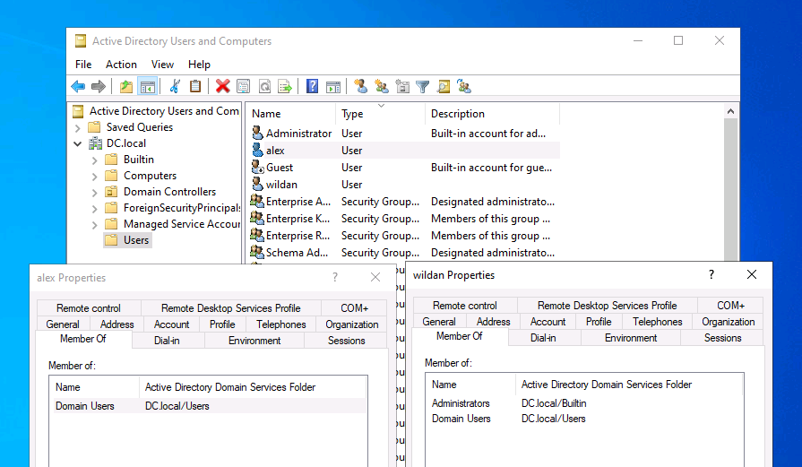

2. Catat ip address, hostname, dan nama domain server-nya[^1].  
Berikut adalah ip windows server saya: `192.168.0.105`

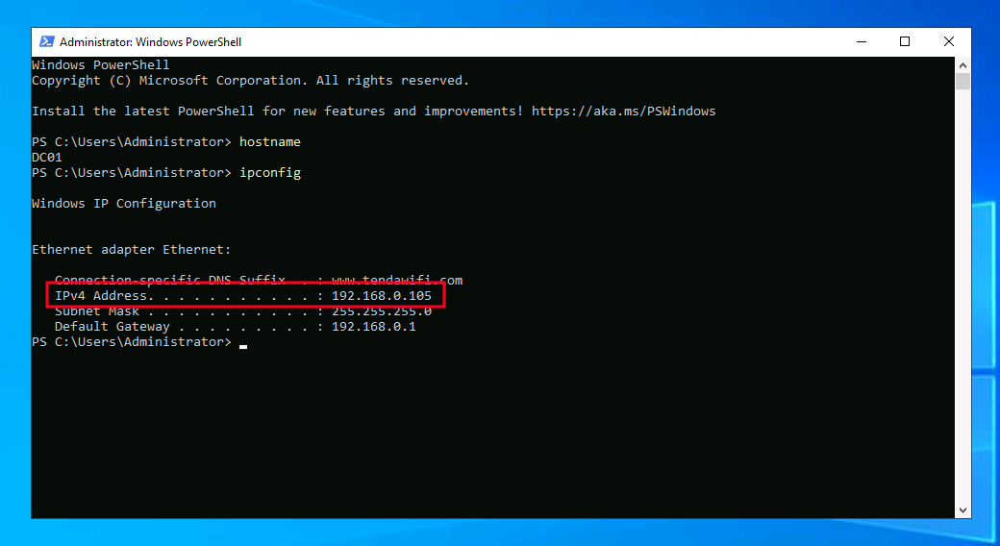

Berikut adalah hostname dan nama domain server saya: `DC01` & `DC.local`

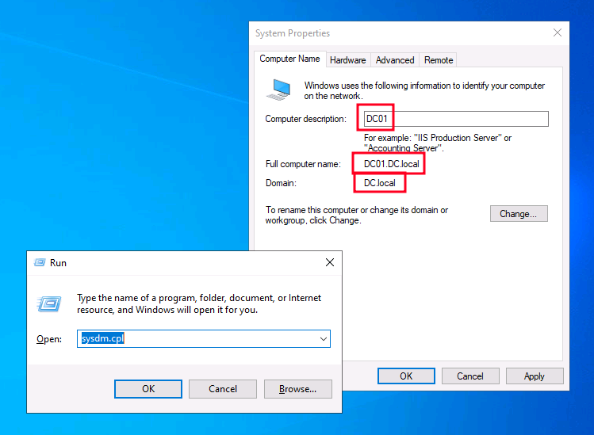

## Windows to Domain 

### 1. Menambahkan DNS

Langkah pertama adalah menambahkan ip domain ke DNS Windows kita.  

1. Pergi ke "Control Panel -> Network and Internet -> Network and Sharing Centre -> Change Adapter Settings".
2. Klik kanan di adapter yang akan digunakan untuk terhubung ke Domain. Di sini saya akan memilih adapter Ethernet (karena Windows ini di-setup sebagai VM di Virtualbox). Pilih "Properties".
3. Klik "Internet Protocol Version 4 (TCP/IPv4)", lalu klik Properties.
4. Pilih "Use the following DNS server address automatically".
5. Inputkan *ip address* dari domain server yang tadi sudah kita catat di kolom "Preferred DNS server".
6. Klik "Ok" untuk menyimpan perubahan.

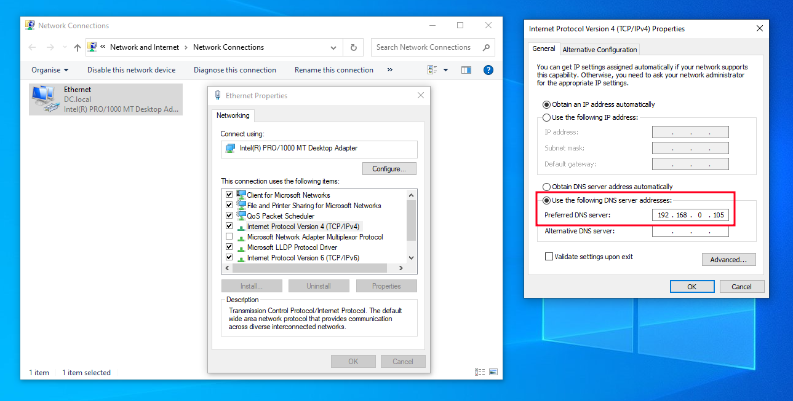

### 2. Menambahkan Domain

Langkah berikutnya adalah menambahkan domain ke Windows kita.

1. Pergi ke "Control Panel -> System and Security -> System".
2. Klik "Rename this PC (advanced)" di paling bawah.
3. Akan muncul jendela System Properties, klik "Change". 
4. Inputkan nama domain yang tadi sudah kita catat di kolom "Domain" pada bagian "Member of".

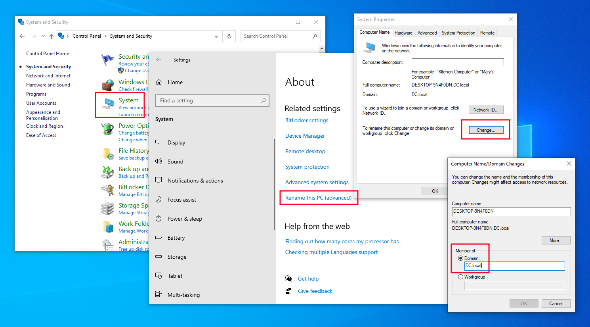

### 3. Login ke Domain

Sebelum login ke domain, kita bisa pastikan bahwa komputer kita sudah terhubung ke domain dengan melakukan `ping` ke server via domain name-nya[^2]:

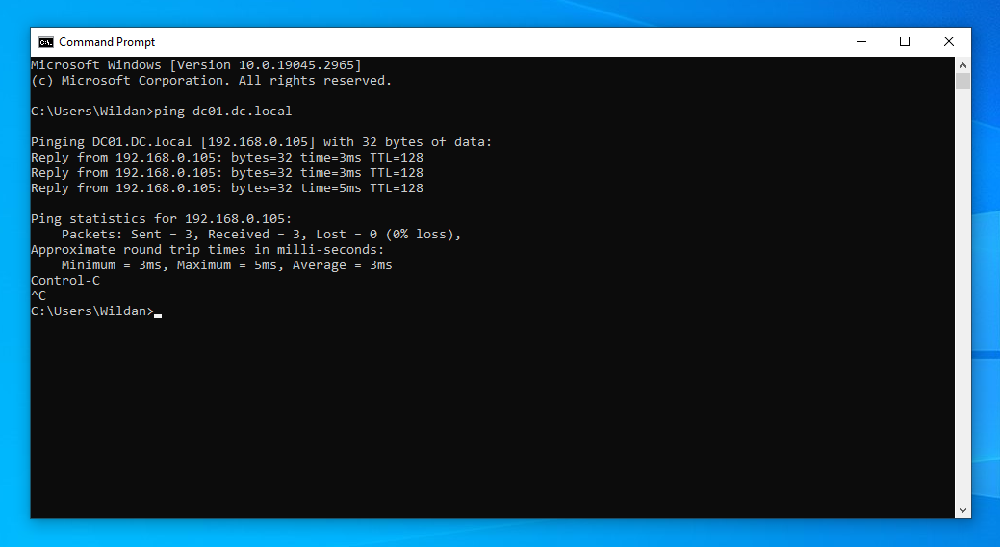

Berhasil ping! Itu artinya komputer kita sudah terhubung ke domain.

Berikut adalah langkah-langkah untuk login ke domain server:
1. Logout.
2. Login dengan akun yang sudah dibuat sebelumnya. Jangan lupa sertakan nama domain pada kolom user. Berikut adalah username yang saya gunakan: `dc.local\wildan`

<script src="https://fast.wistia.com/player.js" async></script><script src="https://fast.wistia.com/embed/vz140vd9de.js" async type="module"></script><style>wistia-player[media-id='vz140vd9de']:not(:defined) { background: center / contain no-repeat url('https://fast.wistia.com/embed/medias/vz140vd9de/swatch'); display: block; filter: blur(5px); padding-top:75.0%; }</style> <wistia-player media-id="vz140vd9de" seo="false" aspect="1.3333333333333333"></wistia-player>

Kita berhasil bergabung ke Windows Domain dari Windows 10!

## Linux (Debian) to Domain

### 1. Meng-_install_ _packages_

Langkah pertama adalah meng-_install_ paket-paket yang diperlukan.[^3]

```bash
sudo apt -y install realmd sssd sssd-tools libnss-sss libpam-sss adcli samba-common-bin oddjob oddjob-mkhomedir packagekit 
```

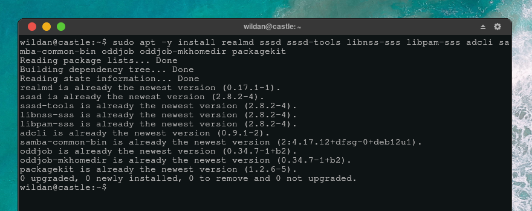

### 2. Mengganti DNS

Langkah kedua, kita perlu mengganti DNS-nya agar merujuk ke Domain. Jadi, kita harus memasukkan nama domain berikut juga _ip address_-nya ke `/etc/resolv.conf`.

```bash
sudo nano /etc/resolv.conf
```

```bash
domain dc.local
search dc.local
nameserver 192.168.0.105
```

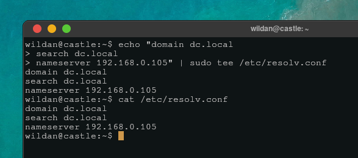

### 3. Mencari Domain

Langkah ketiga, kita perlu mencari domain untuk memastikan DNS kita sudah berfungsi dengan baik.

```bash
sudo realm discover dc.local
```

Jika berhasil, berikut adalah _output_-nya:
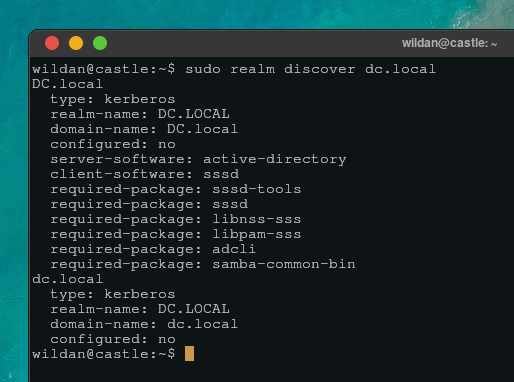

### 4. Bergabung ke Domain

Langkah keempat, kita akan join ke Domain.

```bash
sudo realm join dc.local
```

Kita akan diminta untuk meng-_input_-kan password user "Administrator".

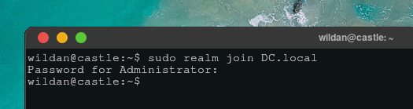

### 5. Login ke Domain

Sebelum login ke domain, kita dapat memastikan bahwa kita sudah bergabung ke Domain dengan melihat apakah kita dapat mengetahui informasi tentang user yang terdapat di Domain tersebut. 

Misalnya, saya akan mencoba mencari tahu info tentang user **"wildan"** dan **"alex"**.

```bash
sudo id
```

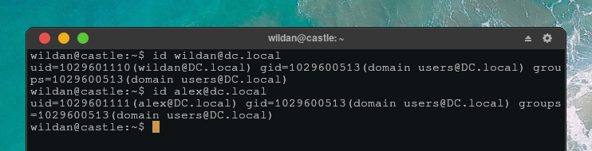

Ya, dan kita berhasil melihat info tentang user wildan dan alex. Artinya, Debian kita sudah bergabung ke Domain dan sudah bisa login via cli (SSH).

Berikut adalah langkah-langkah login ke Domain.

1. Logout.
2. Login dengan akun yang sudah dibuat sebelumnya. Jangan lupa sertakan nama domain pada kolom user. Berikut adalah username yang saya gunakan: `dc.local\wildan`.

Atau bisa juga langsung via terminal tanpa harus logout, dengan perintah:

```bash
su - wildan@dc.local
```

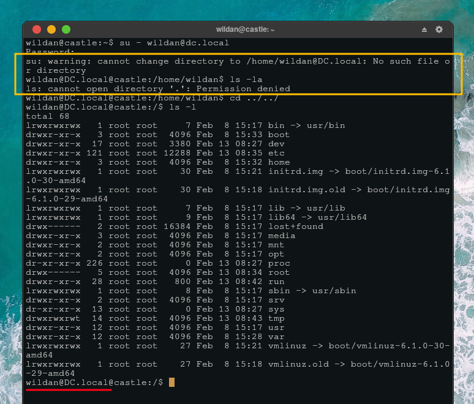

Kita berhasil masuk ke domain, terlihat dari _hostname_ kita yang berubah menjadi _hostname_ dari Domain. Akan tetapi, kita tidak memiliki **user directory**, tampak di dalam kotak berwarna kuning di tangkapan layar. Jadi, kita hanya dapat login saja, tetapi tidak memiliki _user directory_. 

Jadi, kita masih harus membuat pengaturan untuk menambahkan _user directory_ ketika login ke Domain.

### 6. Menambahkan user dir

Agar kita memiliki user directory ketika login ke Domain, kita perlu menambahkan konfigurasi berikut ke `/etc/pam.d/common-session` di Debian kita. 

:::note[Ingat!]

Kita menambahkan pengaturannya di Debian, bukan ketika sudah berada di dalam Domain. Jadi, jika kita sedang berada di Domain, kita perlu _logout_ terlebih dahulu.  

:::

```bash
sudo nano /etc/pam.d/common-session
```

Agar lebih mudah, tambahkan konfigurasi berikut di akhir file.

```
# create Home Dir automatically when initial login
session optional        pam_mkhomedir.so skel=/etc/skel umask=077
```

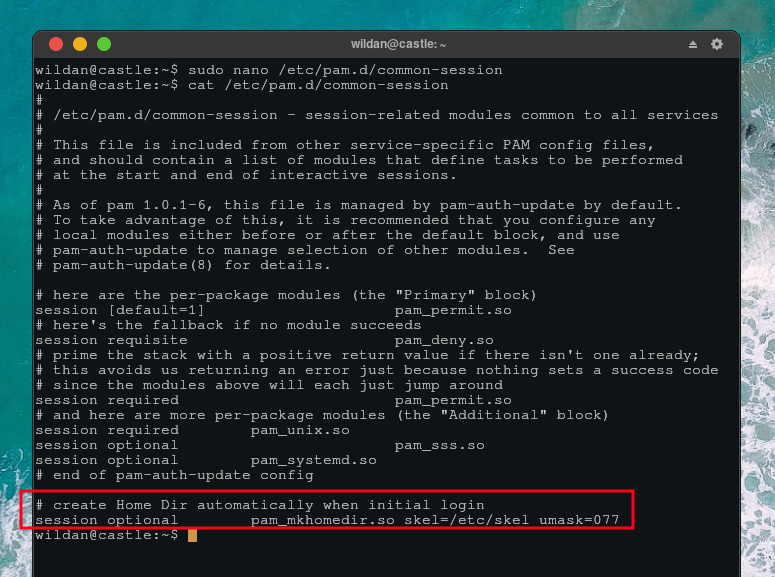

### 7. Login dengan user dir

Sekarang, kita coba lagi login dengan perintah

```bash
su - wildan@dc.local
```

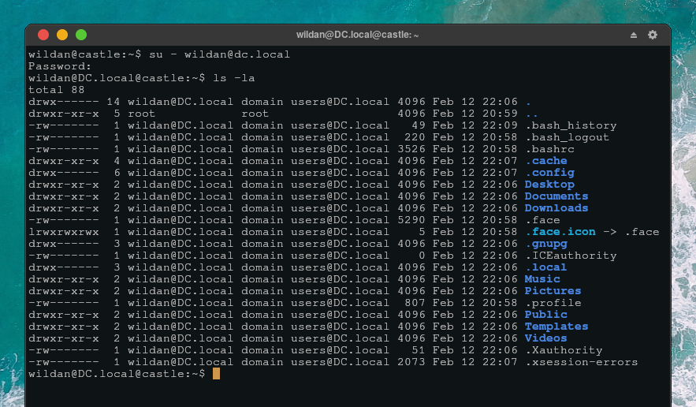

Dan, kita berhasil bergabung dan login ke Domain Controller dengan user directory!

Alhamdulillah!


[^1]: https://learn.microsoft.com/en-us/answers/questions/1741688/how-do-i-find-my-domain-name-in-windows
[^2]: https://learn.microsoft.com/id-id/windows-server/identity/ad-fs/deployment/join-a-computer-to-a-domain
[^3]: https://www.server-world.info/en/note?os=Debian_12&p=realmd#google_vignette