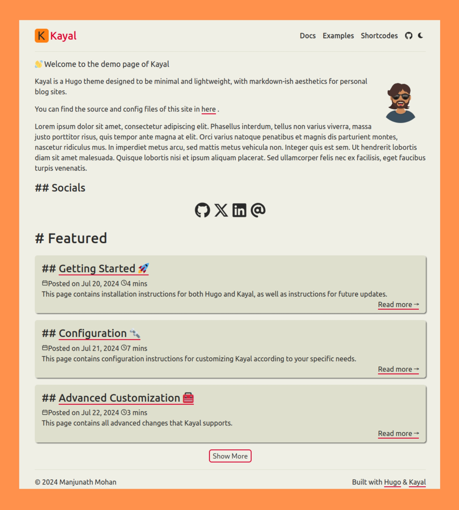
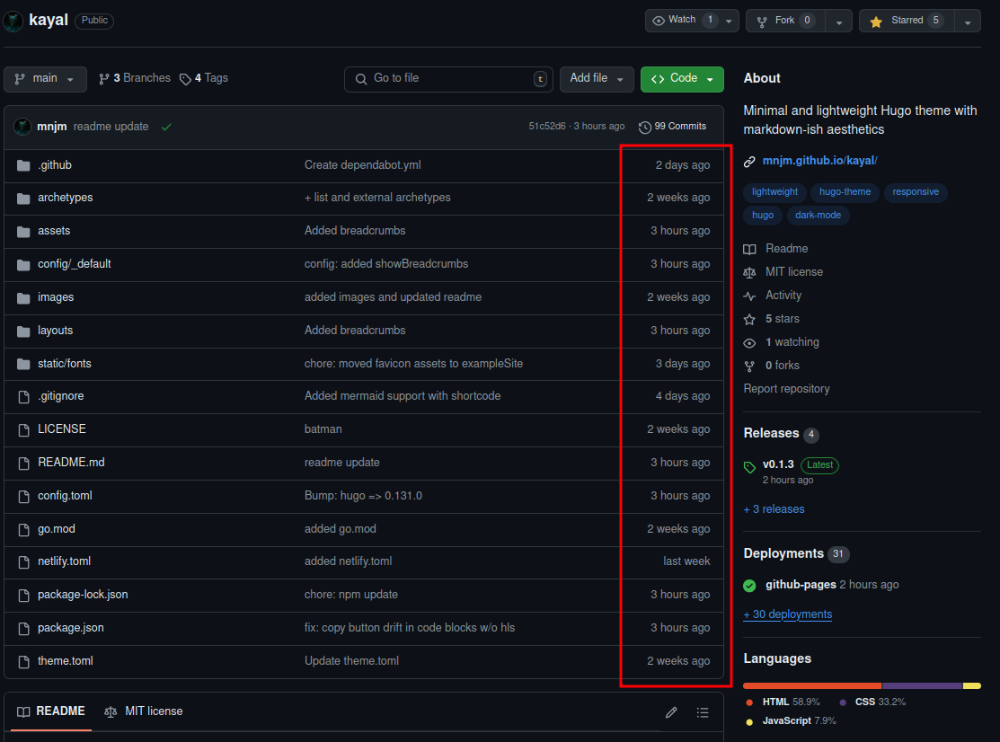
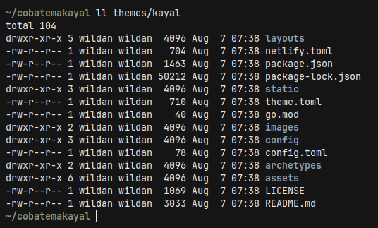
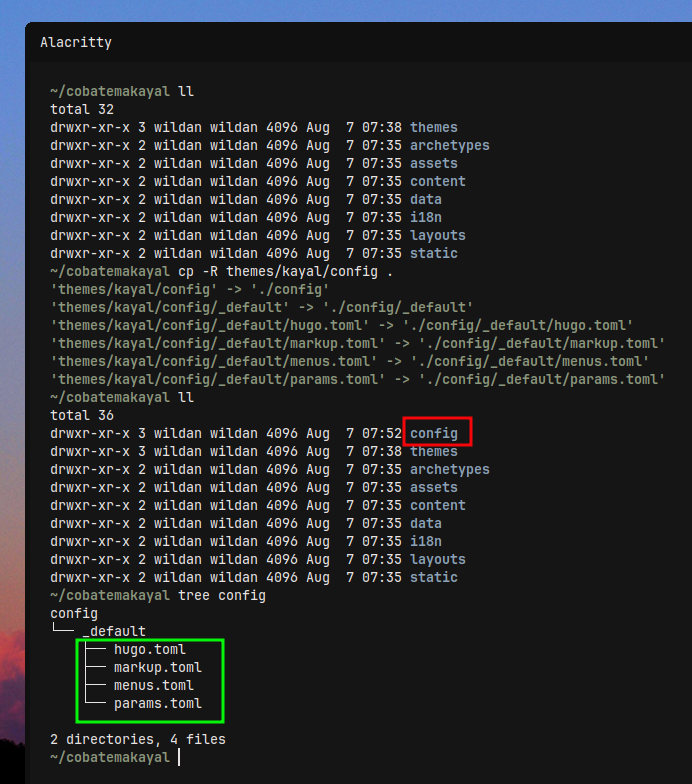
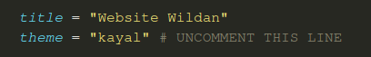
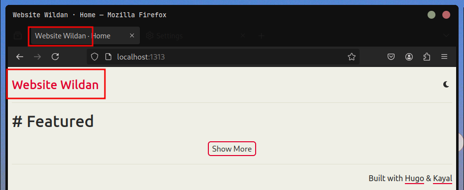
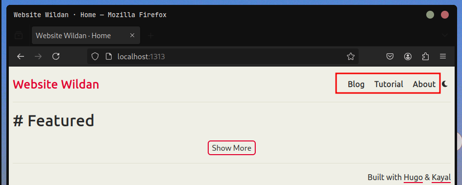
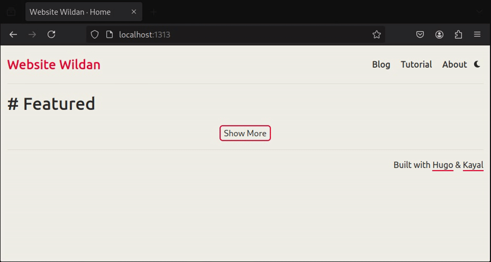
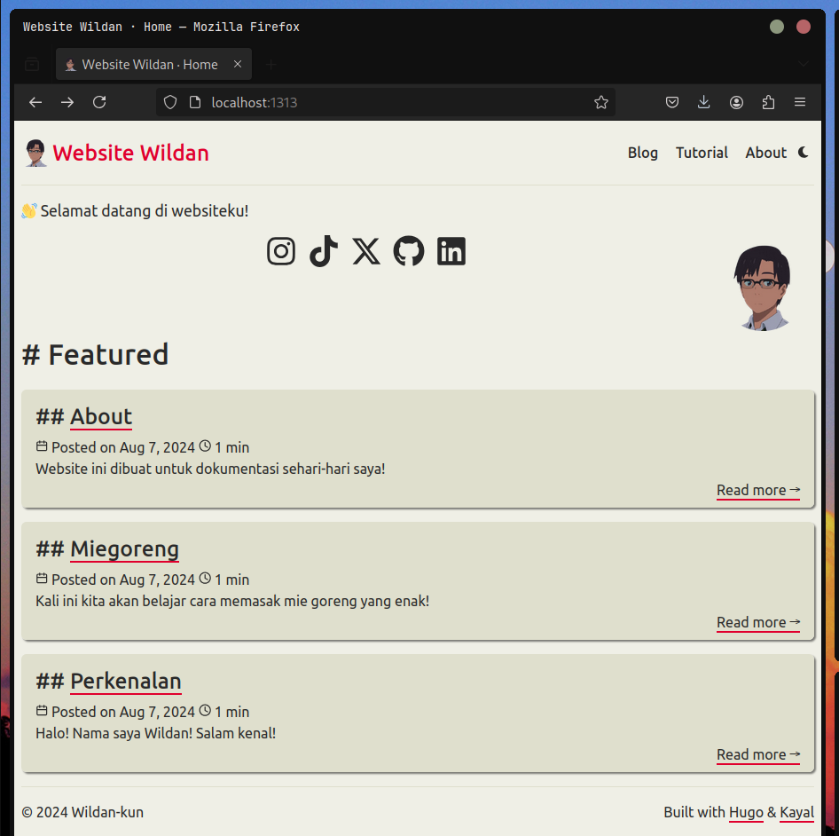
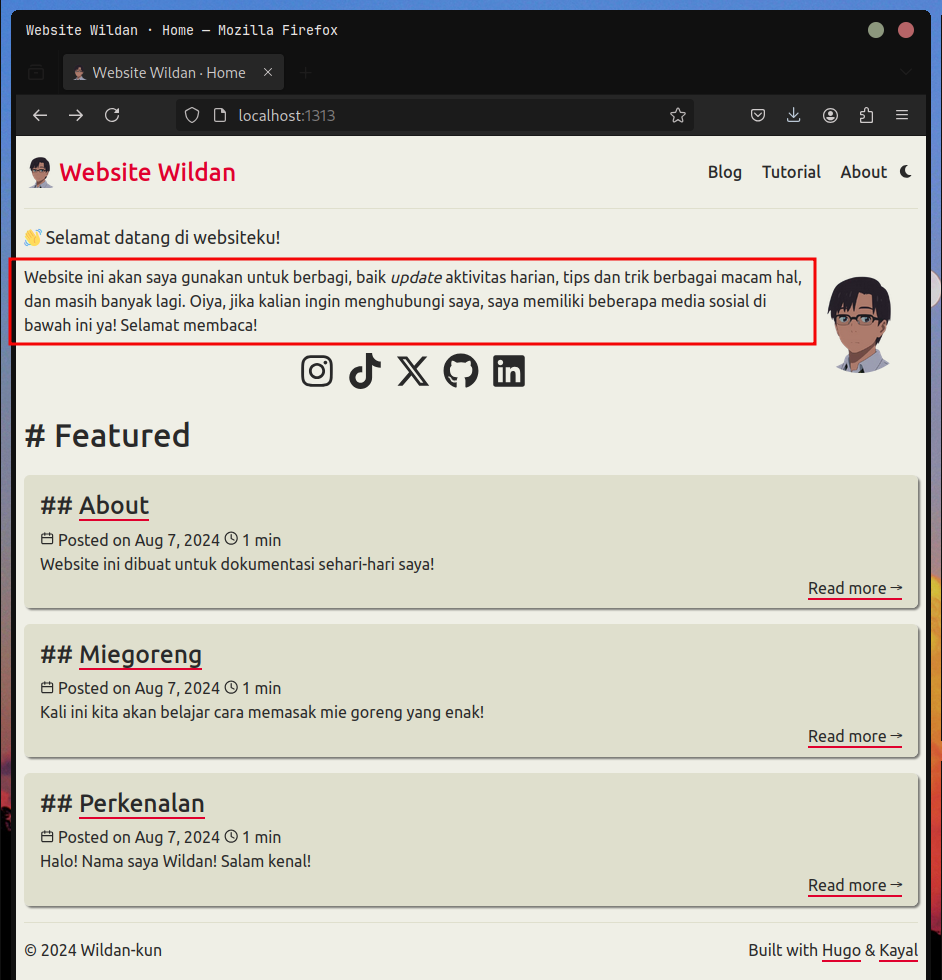

Beberapa hari lalu, saya merasa bosan dan ingin mencarikan suasana baru untuk blog-site saya ini. Lagipula, hampir satu tahun sudah blog-site ini lahir ke internet. Oleh karena itu, saya kira tidak ada salahnya untuk mulai mengganti beberapa pakaiannya dengan yang baru. Jadi, saya putuskan untuk 'berwisata' ke halaman [tema hugo](https://themes.gohugo.io/).

Ketika sedang khusyu' mengamati etalase tema-tema Hugo yang keren di sana, tiba-tiba saja mata saya terpincut dengan sebuah tema yang secara suasana tampak remang-remah namun syahdu, mirip Gruvbox namun tidak bisa dibilang demikian, itulah dia, tema [**Kayal**](https://github.com/mnjm/kayal).



Saya merasa seperti baru pertama kali melihat tema yang satu ini. Namun, ketika saya telaah lebih jauh, ternyata prasangka saya benar. Tema Kayal ini adalah tema yang relatif baru dan *show up* di situs tema Hugo. Berdasarkan catatan *commit*-nya di github, tema yang dibuat oleh [Manjunath Mohan](https://github.com/mnjm) ini baru berumur 2 minggu ketika saya menulis artikel ini:



 ::github{repo="mnjm/kayal"}

Selain desainnya yang menurut saya keren, tema Kayal ini bisa saya bilang juga mudah untuk dipasang untuk keperluan artikel saya. Memang, tidak semudah menggunakan tema saya sebelumnya (Papermod), tapi tidak sesulit yang dibayangkan juga...

Nah, di sini, saya mau coba berbagi langkah-langkah menggunakan tema Kayal ini untuk website kita. Mungkin ada juga nanti sedikit perbandingannya dengan tema Papermod (supaya saya bisa menjustifikasi klaim saya barusan tentang "tidak semudah Papermod", hehe). Oiya, satu hal yang perlu dicatat, saya sudah memiliki artikel khusus yang membahas cara untuk membuat website dengan Hugo. Jadi, di artikel ini, saya hanya akan langsung men-tutor cara memasang dan mengkonfigurasi tema Kayal di website yang sudah kita buat sebelumnya. 

:::info  

Tulisan saya yang membahas langkah-langkah membuat *static-site* dengan Hugo bisa dikunjungi di sini:

[[hugo-ing]]

:::

## Instalasi Tema Kayal

### Mengunduh Tema Kayal dari Github Repo

Langkah pertama, tentu saja adalah mengunduh (meng-*cloning*) github repo tema Kayal ke direktori **"`themes`"** website kita[^1]. Caranya:

:::note[Pastikan di direktori root website kalian sudah terdapat folder/direktori **.git**. Kalau belum, bisa dibuat dengan mengetikkan perintah berikut:]

```shell
git init
```

:::

```shell
git submodule add -b main https://github.com/mnjm/kayal.git themes/kayal
```
Berikut adalah isi dari tema **`themes/kayal`** yang sudah kita *cloning*:


### Menghapus File Config Default Hugo

Selanjutnya, kita perlu menghapus file config default Hugo yang ada di root direktori websitenya. Nama default file config-nya adalah **`hugo.toml`** (kecuali jika kalian sudah mengganti nama atau format filenya, maka disesuaikan):

```shell
rm hugo.toml
```
### Meng-*copy* File Config Kayal

Berikutnya, kita akan meng-*copy* beberapa file config tema kayal yang terdapat dalam direktori **`/themes../images/kayal/config/_default`** ke direktori root website kita di **`config/_default`**. 

```shell
cp -R themes../images/kayal/config .
```



Seperti terlihat di tangkapan layar, folder config sudah berhasil di-*copy* ke root direktori website. Isi dari direktori **`config/_default`** tersebut ada 4, yaitu: 
1. **hugo.toml:** file konfigurasi utama untuk hugo. 
2. **markup.toml:** ...
3. **menus.toml:** file konfigurasi untuk mengatur menu website.
4. **params.toml:** file konfigurasi untuk mengatur beberapa parameter website, seperti parameter untuk homepage, artikel, dan yang lainnya. 

Tapi, kita hanya perlu fokus ke file-file konfigurasi 1, 3, dan 4 saja.

## Konfigurasi Sederhana

Sekarang, kita akan mulai mengkonfigurasi beberapa hal agar website kita dapat berjalan dengan lancar menggunakan tema Kayal. Pada bagian ini, saya akan menunjukkan fungsi-fungsi dari ketiga file konfigurasi tadi.

### hugo.toml
Berikut adalah isi file **`hugo.toml`**:

```toml title="hugo.toml"
# -- Site Configuration --

# URL to the root of your website.
# baseURL = "https://your_domain.com/"

# Site's language code
languageCode = 'en-us'

# title = "Site Title"

# theme = "kayal" # UNCOMMENT THIS LINE

# Number of articles per page in the listing.
paginate = 10

# Enable processing of emojis in markdown.
enableEmoji = true

# Enable creation of robots.txt for search engine crawling.
enableRobotsTXT = true

# Length of default summaries.
summaryLength = 70

# Build drafts during site generation.
buildDrafts = true

[sitemap]
  changefreq = 'daily'
  filename = 'sitemap.xml'
  priority = 0.5

# Google Analytics Configuration
# [services]
#   [services.googleAnalytics]
#     ID = 'G-MEASUREMENT_ID'
```

Pertama, kita perlu meng-uncomment baris ke-9 dan ke-11, yaitu baris <mark> **title** </mark> dan <mark> **theme** </mark> berikut:


info[Keterangan:]

Baris **title** adalah Judul website yang akan ditampilkan di pojok kiri website (nanti akan saya tunjukkan tangkapan layarnya). Sementara, baris **theme** tentu saja adalah untuk mengaktifkan tema Kayalnya.

:::

Jika sekarang kita menjalankan websitenya:

```shell
hugo server
```

maka, berikut adalah penampakan awal websitenya:


:::note[Menambahkan list heading yang tampil di ToC (Table of Content) alias daftar isi] 

Kita hanya perlu menambahan baris berikut di dalam file `config/_default/hugo.toml`:
```toml title="hugo.toml"
[markup]
  [markup.tableOfContents]
    endLevel = 5 # ganti di sini, disesuaikan dengan kebutuhan
    ordered = false
    startLevel = 2


```
:::

### menus.toml

Berikut adalah isi file **`menu.toml`**:

```toml title="menu.toml"
# -- Main Menu --
# The main menu is displayed in the header at the top of the page.
# Acceptable parameters are name, page, url, pre, weight.

# Add a trailing '/' to local URLs.
# For example: /posts/
# NOT: /posts

# `pre` is an icon ID. For a list of all available icons, check [https://github.com/mnjm../images/kayal/tree/main/assets/icons]

# [[main]]
# name = "posts"
# title = "Posts"
# url = "/posts/"
# weight = 1
#
# [[main]]
# name = "tags"
# title = "Tags"
# url = "/tags/"
# weight = 2
#
# [[main]]
# name = "about"
# title = "About"
# url = "/about/"
# weight = 3
#
# [[main]]
# name = "github"
# pre = "github"
# name = ""
# url = "https://github.com/mnjm/kayal"
# weight = 4
```

Kita hanya perlu meng-*uncomment* baris-baris menu apa yang ingin ditampilkan. Misalkan saya ingin menampilkan 3 menu utama, yaitu menu <mark>blog</mark>, <mark>tutorial</mark>, dan <mark>about</mark>. Maka berikut adalah baris-baris yang di-*uncomment*:

```toml 

[[main]]
name = "blog"
title = "Blog" # --> akan ditampilkan di website
url = "/blog/" # --> merujuk ke direktori content/blog
weight = 1 # --> urutan ke-1 tampil di website

[[main]]
name = "tutorial"
title = "Tutorial" # --> akan ditampilkan di website
url = "/tutorial/" # --> merujuk ke direktori content/blog
weight = 2 # --> urutan ke-2 tampil di website

[[main]]
name = "about"
title = "About" # --> akan ditampilkan di website
url = "/about/" # --> merujuk ke direktori content/blog
weight = 3 # --> urutan ke-3 tampil di website

```
Berikut adalah penampakan website-nya setelah konfigurasi menu ditambahkan:


Silakan menambahkan, mengurangi, atau memodifikasi sesuai dengan preferensi kalian. Gunakan format seperti yang saya contohkan tersebut.

### params.toml

Kita bisa mengkonfigurasi beberapa hal di file **`params.toml`** ini. Kita bisa menambahkan pesan *greetings*, menambahkan foto, menambahkan icon di judul website, menunjukkan artikel terbaru, hingga pengaturan terkait artikelnya secara spesifik, misalnya menambahkan fitur *copy code* pada *codeblocks*, memunculkan daftar isi, dan masih banyak lagi. 

Masing-masing parameter jika saya jelaskan satu persatu di artikel ini, saya jamin akan jadi terlalu panjang, (mungkin) intimidatif, dan melelahkan. Padahal, di setiap baris kodenya sudah dijelaskan sebetulnya. Jadi, silakan diamati baris perbaris kode yang akan saya lampirkan. Berikut adalah isi file konfig **`params.toml`** yang saya gunakan:

:::note

Sebelum itu, kita akan buat 3 buah direktori konten dengan nama seperti yang sudah kita tentukan sebelumnya di bagian menu, yaitu direktori <mark>content/blog</mark>, <mark>content/tutorial</mark>, dan <mark>content/about</mark>.

```shell
mkdir -p content/blog content/tutorial content/about
```

Kemudian, mari buat sebuah file baru di masing-masing direktori tersebut.  

```shell
hugo new content content/blog/perkenalan.md # membuat file baru di direktori content/blog
hugo new content content/tutorial/miegoreng.md # membuat file baru di direktori content/tutorial
hugo new content content/about/about.md membuat # file baru di direktori content/about
```

Sekarang, silakan isi masing-masing file tersebut dengan sebuah kalimat.  
Misalnya, kalimat yang saya gunakan untuk file <mark>content/blog/perkenalan.md</mark>:
```shell
Halo! Nama saya Wildan! Salam kenal!
```

Kalimat yang saya gunakan untuk file <mark>content/tutorial/miegoreng.md</mark>:
```shell
Kali ini kita akan belajar cara memasak mie goreng yang enak!
```

Kalimat yang saya gunakan untuk file <mark>content/about/about.md</mark>:
```shell
Website ini dibuat untuk dokumentasi sehari-hari saya!
```

> **Perhatikan!** Pastikan status **draft** setiap file adalah <mark>**false**</mark>

Sehingga, nanti setiap menu sudah memiliki artikelnya masing-masing seperti berikut:


:::

```toml title="params.toml"
# -- Theme Options --
# These options control how the theme functions and allow you to
# customize the display of your website.

# [Optional] Path to the site logo image relative to assets/ folder. Displayed before the Site Title in the header. Minimum size: 64x64px.
logo = "/imgs/tsukasa.png"
# Site description.
description = "A Hugo Theme"
# [Optional] Copyright owner name.
copyright = "Wildan-kun"
# Whether to enable copy button in code blocks.
enableCodeCopy = true
# Show the icon that switches between dark and light themes when clicked.
showThemeSwitcher = true
# Default theme to start from. If "auto", it detects the previous preference/system theme.
defaultTheme = "auto"  # Valid Options: light, dark, auto
# When enabled, highlight the current menu item in the menu bar.
highlightCurrentMenu = true
# The sections to display in the recent articles list. If not provided, the section with the most articles is used.
mainSections = ["blog", "tutorial", "about"]
# Whether to remove Hugo and theme attribution in the footer.
removeAttribution = false
# Whether to show anchor links in headings. Can be overridden by Page-specific `showHeadingAnchors` in its front matter.
showHeadingAnchors = true

# Site search engine verification tags.
# [verification]
# google = ""
# bing = ""
# pinterest = ""
# yandex = ""

# Homepage settings
[homepage]
# [Optional] Displayed at the top of your homepage.
headline = "👋 Selamat datang di websiteku!"
# [Optional] Path to the profile image relative to assets/ folder. Minimum size: 200x200px.
image = "imgs/tsukasa.png"
# Image position.
where = "right"  # Options: right, left, top
# Whether to show recent items on the homepage.
showRecent = true
# Heading label for recent items.
showRecentLabel = "Featured"
# Number of recent items to show.
showRecentItems = 3
# Whether to show "Read more" buttons at the end of each article entry.
showReadMore = true
# Whether to display a "Show more" link at the end of recent section that directs to `showMoreDest`.
showMore = false
showMoreDest = "/posts"

# Article settings
[article]
# Whether to display article dates.
showDate = true
# Whether to display modified dates of articles.
showModDate = true
# Whether to display reading time of articles.
showReadingTime = true
# Whether to display tags mentioned in the front matter.
showTags = true
# Whether to display next/previous article links in the article footer.
showPagination = true
# Whether to reverse the direction of next/previous article links.
invertPagination = true
# Whether to display the table of contents on articles.
showToC = true
# Whether to open the Table of Contents when the page is loaded.
openToC = false
# Check https://mnjm.github.io../images/kayal/docs/advanced-customization/#comments
showComments = false
# Whether to display breadcrumbs
showBreadcrumbs = false

# List template settings
[list]
# Whether to group articles by year.
groupByYear = false
# Whether to show dates with article listings.
showDate = true
# Whether to display breadcrumbs
showBreadcrumbs = false

# Taxonomy settings
[taxonomy]
# Whether to show counts of each taxonomy term.
showCount = true
# Whether to display taxonomies as a grid of cards.
cardView = true

# Term settings
[term]
# Whether to group articles by year.
groupByYear = false
# Whether to show dates with article listings.
showDate = true

# Social links
# [[social]]
# name = "GitHub"
# icon = "github"
# url = "https://github.com/mnjm/kayal"
#
# [[social]]
# name = "Email"
# icon = "email"
# url = "mailto:name@example.com"
#

[[social]]
name = "Instagram"
icon = "instagram"
url = "https://instagram.com/"

[[social]]
name = "Tiktok"
icon = "tiktok"
url = "https://tiktok.com/"

[[social]]
name = "Twitter / X"
icon = "x-twitter"
url = "https://x.com/"

[[social]]
name = "Github"
icon = "github"
url = "https://github.com/"

[[social]]
name = "Linkedin"
icon = "linkedin"
url = "https://linkedin.com/"

```
Berikut adalah penampakan hasil file konfigurasi **`params.toml`** di atas:


> **Catatan!**  
> 1. Gambar atau foto yang ingin ditampilkan di website berlokasi di direktori <mark> assets/imgs </mark>. Perlu dicatat juga bahwa file foto yang akan ditampilkan pada website minimal memiliki ukuran 200px X 200px. Jika belum ada, silakan buat dulu:
> ```shell
> mkdir assets/imgs
> ```
> 2. Jika kalian tidak ingin ada icon media sosial, tinggal *uncomment* bagian social di file konfigurasi **`params.toml`** di atas.
> 3. Urutan artikel di bagian <mark> **Featured**</mark> muncul berdasarkan waktu dibuatnya artikel tersebut. Yang paling atas adalah yang paling baru ditulis atau dibuat.  

Sebetulnya, kita masih bisa menambahkan semacam pesan pengantar di bawah *greetings* pada tampilan utama website kita. Kita hanya perlu membuat file **`_index.md`** di direktori **`content`**:
```shell
touch content/_index.md
echo "Website ini akan saya gunakan untuk berbagi, baik *update* aktivitas harian, tips dan trik berbagai macam hal, dan masih banyak lagi. Oiya, jika kalian ingin menghubungi saya, saya memiliki beberapa media sosial di bawah ini ya! Selamat membaca!"
```
Berikut hasilnya:


## Beberapa Perbandingan dengan Tema Papermod

Supaya lebih fair, perbandingan ini akan saya buat dengan 2 mode, yaitu mode kelebihan tema Kayal dibandingkan dengan tema Papermod dan mode kekurangan tema Kayal dibandingkan dengan tema Papermod.

### Kelebihan Kayal dari Papermod

Berikut adalah beberapa kelebihan tema Kayal dari tema Papermod, menurut saya:
1. Punya desain dan warna yang lebih fresh.
2. Bisa menambahkan favicon lebih mudah.

### Kekurangan Kayal dari Papermod

Sedangkan, kekurangannya yaitu:
1. File konfigurasinya lebih kompleks.

Yakkkk, itu saja. Wkwkwk.  
Karena kekurangannya yang tidak signifikan dibandingkan dengan kelebihannya, akhirnya saya memutuskan untuk mengganti tema.  
Xixixixi.

Okedeh, sekian dulu review singkat saya mengenai tema Kayal ini.  
Sampai ketemu lagi di artikel saya yang lain!  
See ya! 😎

[^1]: https://github.com/mnjm/kayal
