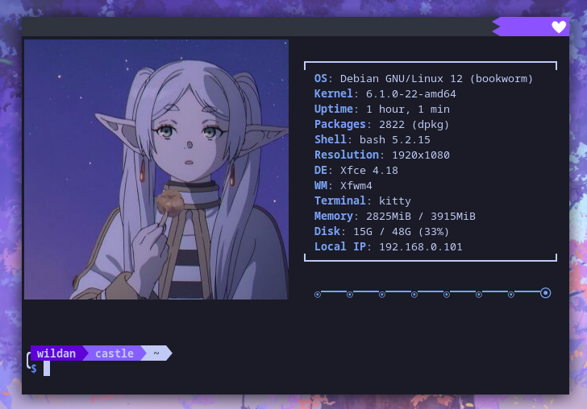
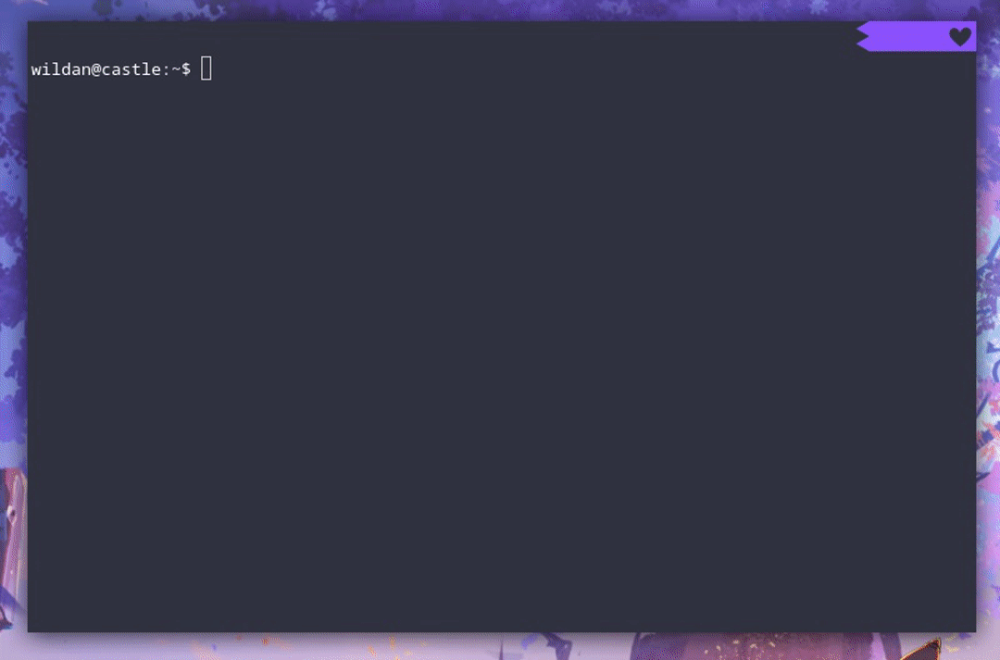
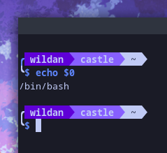
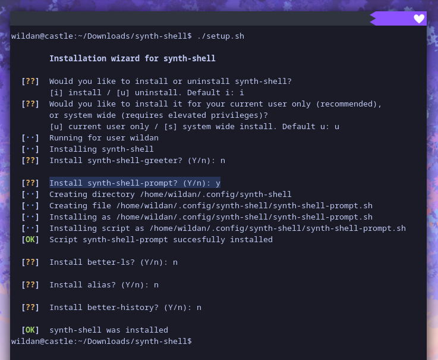
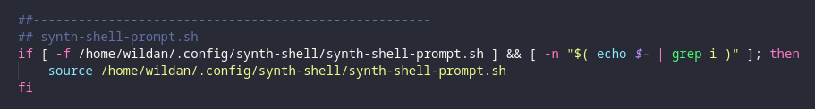
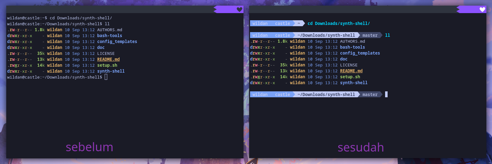
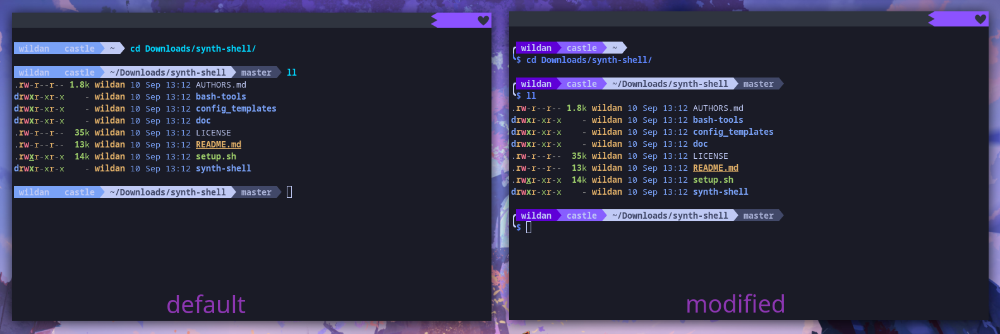
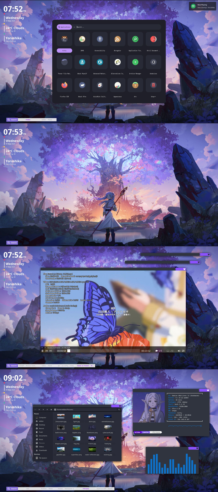

Yup, seperti judul artikel ini, saya akan mengabadikan cara saya mengkonfigurasi salah satu terminal (yang saat ini menjadi) favorit saya, yaitu [Kitty](https://github.com/kovidgoyal/kitty). Selain itu, artikel ini juga akan menyertakan cara mengkonfigurasi salah satu *shell prompt* yang secara *default* menjadi shell dari kitty, yaitu [Bash](https://www.gnu.org/software/bash/).

Pada akhirnya, output dari artikel ini adalah sebuah terminal dengan tampilan seperti berikut:



# Kitty

Kitty adalah sebuah terminal emulator yang *cross-platform*, *feature-rich*, dan *GPU-based*. Jadi, kitty bisa digunakan di semua sistem operasi, terutama sistem operasi desktop seperti MacOS, Windows, dan tentu saja Linux. Selain itu, kitty juga memiliki banyak fitur, misalnya seperti mouse feature, themes, dan masih banyak lagi. Kitty juga adalah terminal emulator berbasis GPU menggunakan OpenGL untuk melakukan *rendering*. Terakhir, secara desain, Kitty juga diciptakan dengan tujuan untuk memaksimalkan kebutuhan pengguna terminal yang sangat bergantung pada keyboard. Artinya, meskipun kitty juga *mouse-interaction-friendly*, tapi kitty dapat dikontrol dengan keyboard. [^1]

## Kitty Installation

Pertama, kita akan melakukan instalasi kitty...

|       Distro      |                  Command                  |
|       ---         |                   ---                     |
| **Debian**        | **`sudo apt install kitty`**              |
| **Arch Linux**    | **`sudo pacman -Sy kitty`**               |
| **Fedora**        | **`sudo dnf install kitty`**              |
| **Opensuse**      | **`sudo zypper install chafa`**           |

Atau kita bisa meng-*compile*-nya langsung dari repo resminya di github:

::github{repo="kovidgoyal/kitty"}

## Kitty Configuration

File konfiguasi kitty tersimpan di **`~/.config/kitty/kitty.conf`**. Atau kalau tidak ada, kita bisa membuatnya sendiri dengan mengetikkan perintah:
```shell
mkdir ~/.config/kitty && touch ~/.config/kitty/kitty.conf
```

Berikut adalah isi file konfigurasi kitty saya:
```shell title="kitty.conf"
# APPEARANCE
# font
font_family FiraCode
font_size 10.0

# colors
# background #000000
background #2f343f
foreground #ffffff

# opacity
background_opacity 1

# KEYBINDS
map ctrl+shift+c copy_to_clipboard
map ctrl+shift+v paste_from_clipboard

# SCROLLING
scrollback_lines 10000

# TABS AND WINDOWS
tab_bar_edge top
active_tab_foreground #ff5555

# CURSOR
shell_integration no-cursor
cursor_shape block
cursor_beam_thickness 2.0
cursor_blink always

# MOUSE INTERACTIONS
enable_mouse yes

# STARTUP OPTIONS
initial_window_width 800
initial_window_height 600

# WINDOW TITLE BAR
window_title_format current_directory

include ./tokyo_night.conf
```

> **Note:**  
> Konfigurasi Kitty lebih lanjut dapat dijumpai di dokumentasi resminya: https://sw.kovidgoyal.net/kitty/

Di baris paling bawah, saya meng-*input*-kan konfigurasi warna atau tema **Tokyo Night**. Nah, bagaimana caranya?

### Kitty Themes

1. Ketikkan perintah berikut di terminal:

```shell
kitty +kitten themes
```

2. Cari **Tokyo Night**, atau tema apapun yang kalian inginkan.

3. Tekan Enter dan pilih ***"Place the theme file in /home/wildan/.config/kitty but do not modify kitty.conf"*** dengan menekan P di keyboard.

4. Masukkan file konfigurasi tema tersebut ke dalam file konfigurasi kitty dengan perintah:

```shell
include "nama-file-konfigurasi-tema.conf"
```

Berikut rangkuman konfigurasi tema kitty:



Oke, sejauh ini kita sudah berhasil mengkonfigurasi Kitty.


# Bash

BASH (*Born Again SHell*) adalah salah satu *shell prompt* yang populer dan melegenda. Disebut populer karena beberapa distro terkenal seperti Debian, Ubuntu, Arch, Fedora, dan banyak yang lainnya secara *default* menggunakan bash sebagai *shell prompt* di terminalnya. Sebetulnya, ada beberapa shell prompt lain yang juga dapat digunakan sebagai alternatif, misalnya seperti [zsh, fish, dan kawan-kawannya](https://wiki.archlinux.org/title/Command-line_shell).

## Bash Installation

Sebetulnya, karena saya menggunakan Debian, maka *shell prompt* default yang saya gunakan adalah bash. Tapi, jika kalian tidak menggunakan bash dan ingin meng-*install*-nya, maka perintahnya cukup mudah:

|       Distro      |                  Command                  |
|       ---         |                   ---                     |
| **Debian**        | **`sudo apt install bash`**              |
| **Arch Linux**    | **`sudo pacman -Sy bash`**               |
| **Fedora**        | **`sudo dnf install bash`**              |
| **Opensuse**      | **`sudo zypper install bash`**           |

Cara untuk mengetahui *shell prompt* yang sedang kita gunakan:

```shell
echo $0
```



## Bash Configuration 

### Installing synth-shell

Kita akan melakukan konfigurasi bash shell agar tampak seperti pada tangkapan layar pertama artikel ini di atas tadi. Untuk itu, kita akan menggunakan sebuah script, [**synth-shell**](https://github.com/andresgongora/synth-shell):

```shell
git clone --recursive https://github.com/andresgongora/synth-shell.git
cd synth-shell
./setup.sh
```

Akan muncul beberapa pertanyaan, silakan sesuaikan dengan preferensi masing-masing. Berikut adalah preferensi saya:



Instalasi selesai.

Kalau diperhatikan di **`.bashrc`**, di bagian akhir file, ada tambahan config untuk memulai synth-shell:



Berikut adalah perbandingan bash prompt sebelum & sesudah menggunakan synth-shell:



### Configuring synth-shell

Target konfigurasi synth-shell kali ini ada 2:
1. Mengganti warnanya menjadi ungu (baik warna status maupun warna *input command*-nya)
2. Membuat prompt-nya menjadi 2 baris; baris pertama untuk status dan baris kedua untuk *input command*.

Adapun file konfigurasi yang akan kita ubah/sesuaikan adalah **`~/.config/synth-shell/synth-shell-prompt.config`**.

#### Mengganti warna

Untuk mengganti warna *background* untuk **username**, ubah nilai `background_user=` di bagian USER menjadi **56** seperti ini:

```shell title="synth-shell-prompt.config"
##==============================================================================
## USER
##==============================================================================
font_color_user="white"
background_user="56"
texteffect_user="bold"
```

Untuk mengganti warna *background* untuk **hostname**, ubah nilai `background_host=` di bagian HOST menjadi **99** seperti ini:

```shell
##==============================================================================
## HOST
##==============================================================================
font_color_host="white"
background_host="99"
texteffect_host="bold"
```

Untuk mengganti warna teks untuk *input* *command* kita, ubah nilai `font_color_input=` di bagian INPUT menjadi **69** seperti ini:

```shell
##==============================================================================
## INPUT (user typed command)
##==============================================================================
font_color_input="69"
background_input="none"
texteffect_input="bold"
```

> **Note:**  
> Kode warna lainnya dapat dijumpai di website berikut: https://www.ditig.com/publications/256-colors-cheat-sheet

#### Membuat baris untuk input command

Sekarang, kita akan membuat baris baru untuk *input* *command*-nya. Caranya, kita ubah nilai `enable_command_on_new_line=` di bagian MAIN FORMAT menjadi **true** seperti ini:

```shell
##==============================================================================
## MAIN FORMAT
##==============================================================================
format="USER HOST PWD GIT PYENV TF KUBE"

separator_char='\uE0B0'           # Separation character, '\uE0B0'=triangle
separator_padding_left=''         # Add char or string to the left of the separator
separator_padding_right=''        # Add char or string to the right of the separator
segment_padding=' '               # Add char or string around segment text
enable_vertical_padding=true      # Add extra new line over prompt
enable_command_on_new_line=true  # Add new line between prompt and command
```

SELESAI !!!

Berikut adalah perbandingan synth-shell default dan synth-shell yang sudah kita konfigurasi:



Yap, kita berhasil meng-*install* kitty sebagai terminal emulator dan menggunakan synth-shell *script* untuk mempercantik bash *shell prompt*-nya.

Btw, saya menggunakan synth-shell karena terinspirasi dari salah satu video Youtube TechHut berikut:

<iframe width="100%" height="468"
  src="https://www.youtube.com/embed/jS-QZKjAd-U"
  frameborder="0" allowfullscreen>
</iframe>

Sampai jumpa di artikel saya yang lain yaa..

Bye~

---

BTW, tema linux saya kali ini adalah **"Debian Frieren~"**




[^1]: https://sw.kovidgoyal.net/kitty/overview/#design-philosophy