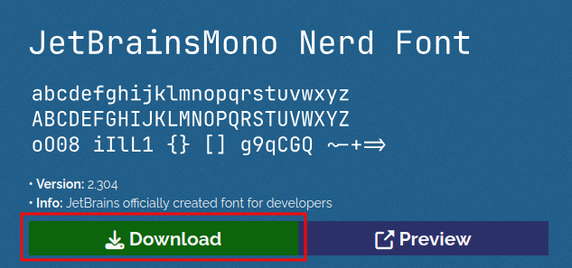
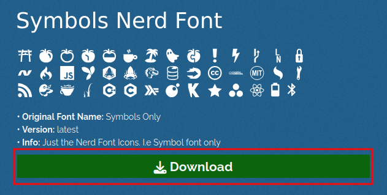
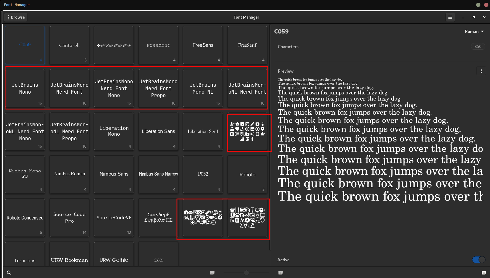
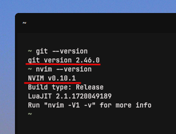
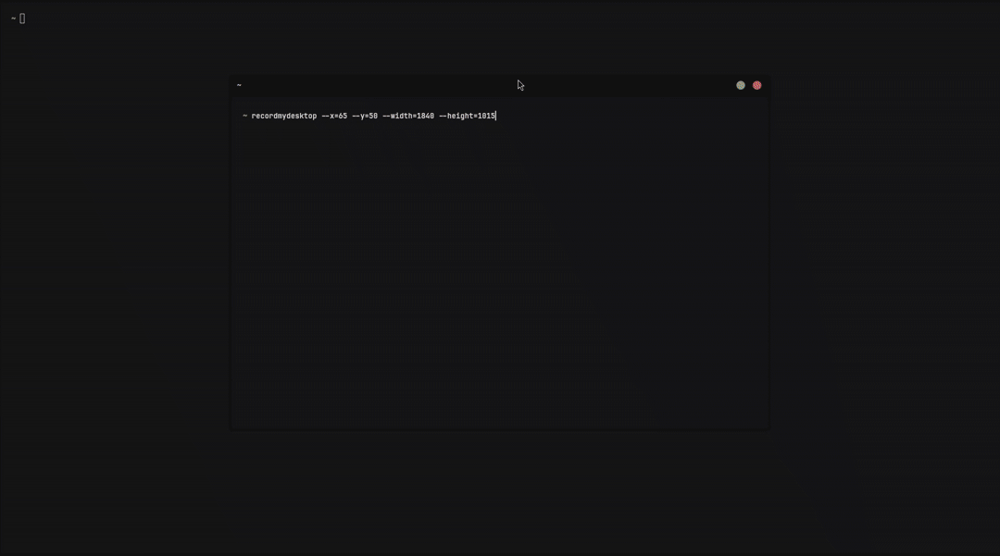
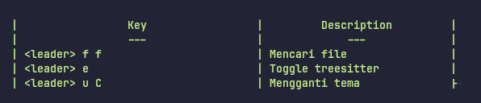

Yoo!!

Di artikel ini, saya akan membuat dokumentasi cara meng-*install* dan menggunakan lazyvim. 

> **Note:**  
> Dokumentasi ini bukan dokumentasi lengkap tentang lazyvim, tapi dokumentasi pribadi yang saya gunakan untuk keperluan saya sebagai blogger, terutama untuk menulis artikel untuk website hugo saya ini.

Sebetulnya, proses instalasi lazyvim di website maupun di *repository* github-nya sudah sangat jelas dan mudah dipahami. Akan tetapi, di sini, saya akan membuat beberapa tambahan atau *requirements* yang perlu dilakukan sebelum instalasi agar proses instalasinya lebih detail. Sebagai catatan, instalasi lazyvim ini saya tujuan untuk pemasangan di *environment* linux ya~

Ngomong-ngomong, apasih lazyvim itu?

Penjelasan dari repo githubnya sangat sederhana, yaitu "*Neovim config for the lazy*", *that's it*.[^1] Nah, kalau saya boleh jelaskan lebih lanjut, sebetulnya, lazyvim adalah sebuah konfigurasi untuk program neovim (yang mana adalah program teks editor seperti nano dan vim -btw, neovim adalah versi baru dari vim- yang berbasis *command line interface* atau CLI). Jadi, dengan hadirnya lazyvim, kita dapat menulis teks atau baris-baris kode program dengan lebih mudah, lebih efisien, dan tentu saja lebih estetik (dibandingkan dengan menggunakan file konfigurasi default-nya). 

So, artikel ini akan terbagi ke dalam 2 bagian:
1. Pre-instalasi lazyvim
2. Instalasi lazyvim

## Pre-Instalasi Lazyvim

Sebelum meng-*install* lazyvim, saya perlu terlebih dahulu meng-*install* font yang diperlukan, 2 font yang diperlukan, yaitu **jetbrains nerd font** dan **symbol nerd font**. Setelah itu, kita juga perlu meng-*install* **** untuk memastikan bahwa font yang sudah di-*install* benar-benar terpasang dan sudah bisa digunakan. 

### Instalasi Jetbrains Nerd font

Kita perlu mengunjungi website nerd fonts, kemudian unduh **"JetBrainsMono Nerd Font"**.

> Link website nerd font: https://www.nerdfonts.com/font-downloads



Tunggu beberapa saat karena ukuran file zip-nya relatif besar, sekitar 100 MB.

Kemudian ketikkan perintah berikut[^2]:
```shell
cd ~/.local/share/fonts \
&& unzip ~/Downloads/JetBrainsMono.zip . \
&& fc-cache -fv
```

:::info

Jika belum memasang program unzip, silakan pasang dengan perintah `sudo pacman -Sy unzip` (Archlinux) atau `sudo apt install unzip` (Debian/Ubuntu) 

:::

### Instalasi Symbol Nerd Font

Lakukan hal yang sama untuk memasang symbol nerd font. Kunjungi website nerd fonts, kemudian unduh **"Symbols Nerd Font"**.

> Link website nerd font: https://www.nerdfonts.com/font-downloads



Kemudian, ketikkan perintah berikut:
```shell
cd ~/.local/share/fonts/ \
&& unzip ~/Downloads/NerdFontsSymbolsOnly.zip . \
&& fc-cache -fv
```

### Instalasi Font Manager

Sekarang, kita akan meng-*install* font manager. Ketikkan perintah berikut:
(Archlinux)
```shell
sudo pacman -Sy font-manager
```

(Debian/Ubuntu)
```shell
sudo apt install font-manager
```

Sekarang, kita bisa membuka font manager untuk memastikan **Jetbrains Nerd Font** dan **Symbols Nerd Font** sudah terpasang.




## Instalasi Lazyvim 

:::note   

Proses instalasi ini merujuk pada pentunjuk resmi lazyvim di repo github-nya:

::github{repo="lazyvim/LazyVim"}

:::

Oke, ketika font sudah terpasang, sekarang saatnya meng-*install* lazyvim. Namun, sebelum lanjut, pastikan beberapa persyaratan berikut ini sudah terpenuhi terlebih dahulu:
- Neovim >= 0.9.0 (needs to be built with LuaJIT)
- Git >= 2.19.0 (for partial clones support)

Kalau belum di-*install*, silakan ketikkan perintah berikut & pastikan versinya sudah memenuhi persyaratan minimal:
(Archlinux)
```shell
sudo pacman -Sy neovim git
git --version
```

(Debian)
```shell
sudo apt install neovim git
nvim --version
```



### Buat Backup Config Neovim

Ini diperlukan jika kalian sebelumnya sudah memiliki file konfigurasi neovim sehingga perlu di-*backup* agar nanti jika ingin kembali menggunakan file konfigurasi yang lama, tinggal mengambalikan *backup*-nya saja.
```shell
mv ~/.config/nvim ~/.config/nvim.bak
mv ~/.local/share/nvim ~/.local/share/nvim.bak
```

### Cloning File Starter-nya

Kita akan meng-*cloning* file konfigurasi lazyvim untuk neovim-nya.
```shell
git clone https://github.com../images/lazyvim/starter ~/.config/nvim/
rm -rf ~/.config/nvim/.git
```

### Start Neovim!

Sekarang, kita bisa mencoba menjalankan neovim dengan konfigurasi lazyvim, mudah, dengan mengetikkan perintah:
```shell
nvim
```

Berikut ini kira-kira adalah penampakannya ketika pertama kali menjalakan neovim dengan setup lazyvim:



Beberapa *keymaps* yang dapat digunakan dapat dicontek di sini:  
http://www.lazyvim.org/keymaps

Tapi, beberapa yang biasa saya gunakan dan keren misalnya:



Beberapa tutorial neovim maupun lazyvim juga dapat ditonton di Youtube, salah satunya sebagai berikut:

<iframe width="100%" height="468"
  src="https://www.youtube.com/embed/N93cTbtLCIM"
  frameborder="0" allowfullscreen>
</iframe>


[^1]: https://github.com../images/lazyvim/LazyVim
[^2]: https://medium.com/@almatins/install-nerdfont-or-any-fonts-using-the-command-line-in-debian-or-other-linux-f3067918a88c
