Kali ini kita akan belajar cara meng-_encypt_ disk/drive di linux menggunakan **LUKS (Linux Unified Key Format)**. LUKS adalah format enkripsi yang umum digunakan di linux. Salah satu tool yang dapat digunakan untuk mengenkripsi disk/drive adalah [**`cryptsetup`**](https://www.google.com/search?q=cryptsetup)[^1]. 

## Installation

Karena merupakan _tool_ standard, **`cryptsetup`** biasanya sudah terpasang ketika melakukan instalasi linux, sebab cryptsetup memang langsung menggunakan modul default bawaan kernel Linux, yaitu [**dm-crypt**](https://docs.kernel.org/admin-guide/device-mapper/dm-crypt.html)[^3]. Kita bisa memeriksa modul tersebut dengan perintah berikut:

```shell
lsmod | grep crypt
```

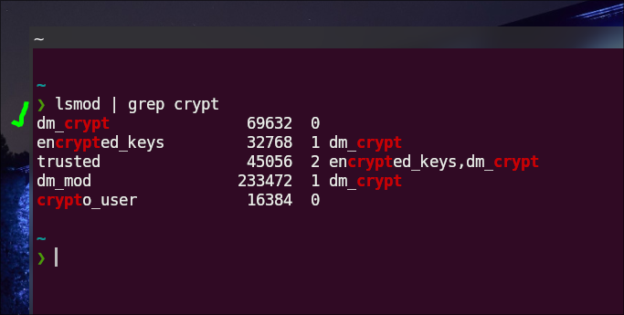


Tapi, jika ternyata belum terpasang, silakan _install_ terlebih dahulu:

|       Distro      |                  Command                      |
|       ---         |                   ---                         |
| **Debian/Ubuntu** | **`sudo apt install cryptsetup`**             |
| **Arch Linux**    | **`sudo pacman -Sy cryptsetup`**              |
| **Opensuse**      | **`sudo zypper install cryptsetup`**          |
| **Fedora**        | **`sudo dnf install cryptsetup`**             |

## The Initial Setup

Sebelum melakukan proses enkripsi, beberapa hal berikut perlu diperhatikan:

:::danger

- **_Back up_** data-data penting terlebih dahulu!
- Catat **_passphrase_** yang digunakan agar tidak lupa!

:::

Berikut adalah langkah-langkah enkripsi dengan **`cryptsetup`**:

### 1. Mengengkripsi partisi

Pertama, kita perlu mengenkripsi partisi yang terdapat di sebuah disk/drive terlebih dahulu. Artinya, sebuah disk/drive mungkin punya lebih dari satu partisi dan kita tidak harus mengenkripsi semua partisinya. 

Berikut perintahnya:

```shell
sudo cryptsetup luksFormat /dev/sda3
```

:::info

**Keterangan:** 
- `/dev/sda3` adalah partisi yang akan saya _encrypt_. Silakan disesuaikan.
- Partisi yang ada dapat dilihat dengan perintah `lsblk`.

:::

Setelah itu, akan muncul 2 prompt:
1. Konfirmasi untuk mengenkripsi partisi, kita bisa ketik **YES** jika ingin melanjutkan.
2. _Passphrase_ atau _password_ yang digunakan untuk meng-_encrypt_ dan men-_decrypt_. Gunakan passphrase yang tidak mudah ditebak tapi tidak mudah dilupakan.

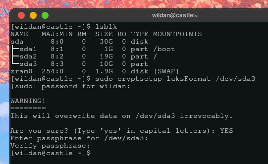

### 2. Membuka partisi 🔑

Sekarang, kita akan membuka partisi sebelumnya yang sudah diformat dengan LUKS:

```shell
sudo cryptsetup open /dev/sda3 test
```

:::info

**Keterangan:** 
- `test` adalah nama partisi yang terenkripsi tadi. Nama ini hanya sementara. Jadi, bisa diganti ketika kita membuka partisi ini lagi nanti.

:::

Sekarang, bandingkan partisi yang belum dibuka dengan yang sudah dibuka dengan `lsblk`. Sekarang, kita memiliki sebuah partisi baru yang ter-_decrypt_ yang bernama **"test"** di `/dev/sda3`. :

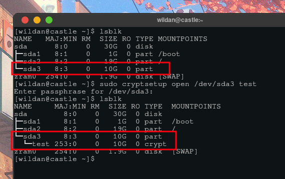

Hal penting lainnya yang perlu dicatat juga di tahap ini adalah bahwa partisi yang sudah didekripsi akan muncul di **`/dev/mapper`**.

### 3. Memformat filesystem 

Berikutnya, kita perlu membuat format _filesystem_ baru ke partisi ini.[^2] Kita hanya perlu melakukan ini di awal saja:

```shell
sudo mkfs.ext4 /dev/mapper/test
```

:::info

**Keterangan:** 
- `mkfs.ext4` adalah nama filesystem standard untuk linux. Silakan disesuaikan dengan kebutuhan.
- `/dev/mapper/test` adalah nama partisi terdekripsi yang sudah saya buat sebelunnya.  

:::

Perhatikan bahwa _formatting_ filesystem ini kita lakukan ke `/dev/mapper/test`, bukan lagi ke `/dev/sda3`!

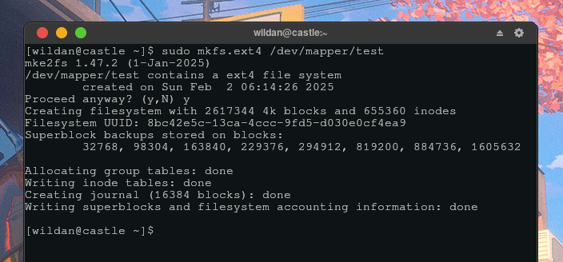

### 4. Mounting partisi 🛄

Langkah terakhir sebelum partisi ini dapat digunakan adalah me-_mounting_-nya ke direktori tertentu.

```shell
sudo mount /dev/mapper/test /mnt
```

:::info

**Keterangan:** 
- `/dev/mapper/test` adalah nama partisi yang sudah dibuat sebelumnya.
- `/mnt` adalah lokasi yang saya inginkan sebagai tempat partisi `/dev/mapper/test` dipasang. 

:::

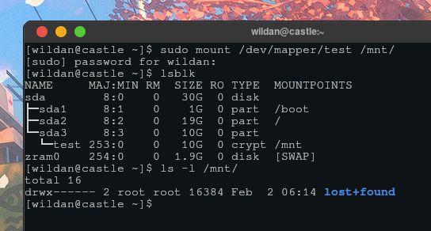

Seperti terlihat pada tangkapan layar, partisi `/dev/mapper/test` sudah terpasang ke `/mnt`.

Sekarang, kita sudah bisa menggunakan (mengisinya dengan file & folder) partisi tersebut. Misalnya, saya akan mengisinya dengan sebuah direktori/folder bernama **"secret-dir"** dan sebuah file teks bernama **"secret-file.txt"** di dalamnya:

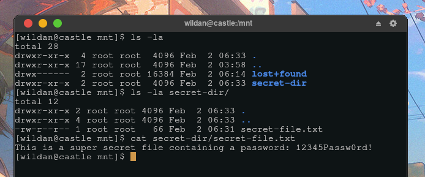

### 5. Unmount partisi 🛅

Setelah selesai menggunakan partisi tersebut, kita bisa meng-unmount-nya:

```shell
sudo umount /mnt
```

:::info

**Keterangan:** 
- `/mnt` adalah tempat dimana partisi tadi terpasang.  

:::

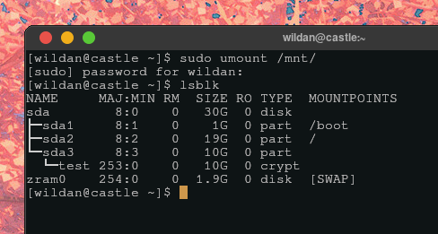

Seperti terlihat, partisi `/dev/mapper/test` sudah terlepas dari `/mnt`.

### 6. Menutup partisi 🔐

Ketika sudah tidak digunakan lagi, pastikan kita menutup partisi tersebut agar ketika misalnya komputer atau disk/drive kita di-_hack_, data-data dalam partisi kita akan tetap aman karena kita sudah kembali mengenkripsinya kembali.

```shell
sudo cryptsetup close test
```

Dan partisi tadi `/dev/sda3` sudah ter-_encrypt_ kembali.

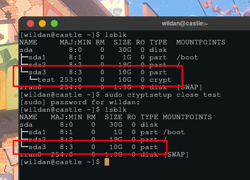

SELESAI!!!

## The End

Sampai di tahap ini, kita telah berhasil membuat enkripsi pada sebuah partisi di disk/drive. Jika kita ingin menggunakan partisi tersebut lagi, kita hanya perlu men-_decrypt_ partisinya dan me-_mounting_-nya ke suatu direktori **(langkah 2 & 4)**, dan jika sudah selesai, kita bisa kembali meng-_unmount_ dan meng-_encrypt_-nya lagi **(langkah 5 & 6)**.

Misalnya, sekarang saya ingin menghapus file **"secret-file.txt"** yang sudah dibuat sebelumnya dan menggantinya dengan file baru bernama **"secrets.txt"**. Berikut adalah langkah-langkahnya:

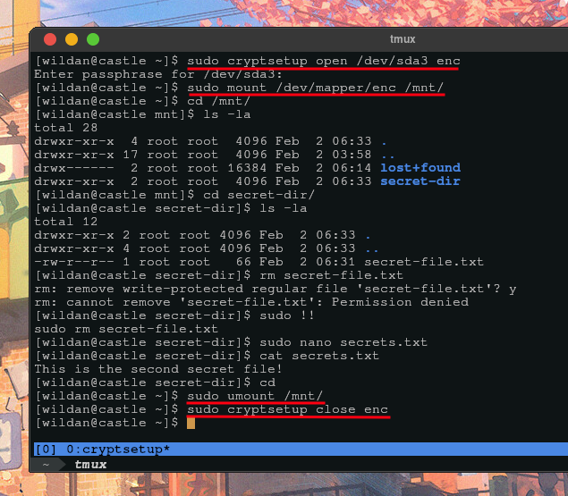

## Additional Info: POC

Kalau kita mencoba untuk me-_mounting_ partisi `/dev/sda3` secara manual seperti biasa, tentu saja tidak akan berhasil karena kita sudah mengubah filesystem partisi tersebut ke format **LUKS** dan tentu saja karena sudah di-_encrypt_:

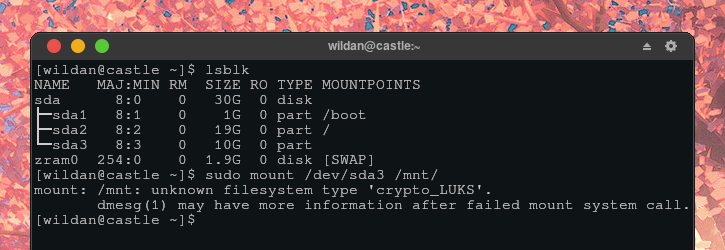

Jadi, kalau kita ingin menggunakan partisi tersebut, kita harus melakukan 4 prosedur yang sudah dijelaskan sebelumnya.

## Advanced Use

Beberapa tambahan yang menurut saya penting (terutama karena saya sudah mengalaminya):

### Mengubah ukuran partisi

Jika kita ingin mengubah partisi yang terenkripsi tersebut (memperbesar/mengecilkan kapasitasnya), berikut adalah langkah-langkahnya:

**1. Edit partisi**
- Menghapus partisi terenkripsi (saya menggunakan `cfdisk`).  
- Menambah partisi baru dengan ukuran yang lebih sesuai.
- Otomatis, format LUKS-nya akan terbawa, jadi kita tidak perlu format ulang.  

**2. Resize container LUKS**
- Buka partisi terenkripsi (lihat [Cara membuka partisi](https://abwildan.github.io/tech/luks/#2-membuka-partisi-)).  
- Pastikan sudah terdaftar di "mapper" (`/dev/mapper/<nama>`).    
- _Resize_ container LUKS tersebut dengan perintah

```shell
sudo cryptsetup resize <nama_mapper>
```

**3. Resize filesystem**
- _Resize_ filesystem-nya (kalau **ext4**):

```shell
sudo resize2fs /dev/mapper/<nama_mapper>
```

> **Notes:**
>
> ```shell
> Physical partition (/dev/nvme0n1p3)   → 20 GB 
> └── LUKS container (/dev/mapper/secret) → 20 GB # sudo cryptsetup resize <nama_mapper>
>     └── ext4 filesystem                  → 5 GB # sudo resize2fs /dev/mapper/cryptdata
> ``` 

Untuk memastikan sudah berubah, bisa gunakan salah satu dari perintah ini:

```shell
lsblk -f
df -h
```

### Menghapus partisi

Jika seandainya (suatu hari nanti), Anda sudah tidak memerlukan partisi LUKS itu lagi, Anda mungkin akan menghapus partisi tersebut. Tapi masalahnya, secara default, format file system-nya LUKS tidak otomatis terhapus jika partisinya dihapus. Artinya, meskipun partisi tersebut terhapus, tapi ketika Anda akan menggunakan "blok" partisi yang dulu terdapat format LUKS di dalamnya ketika membuat partisi baru, otomatis file system-nya akan langsung menjadi LUKS lagi.

Oleh karena itu, sebelum menghapus partisi, alangkah baiknya menghapus format file system-nya terlebih dahulu:

```shell
sudo wipefs -a /dev/<nama_partisi>
```

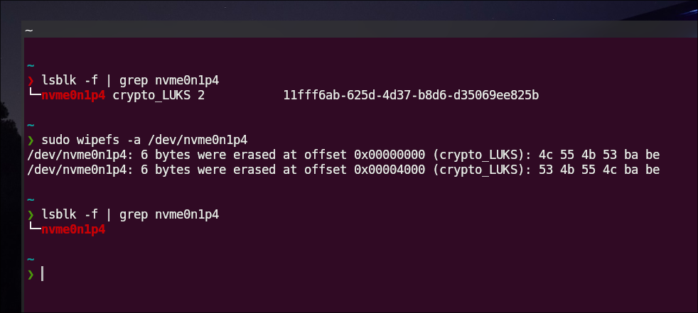

Baru kemudian boleh dihapus, bisa dengan `cfdisk` atau _tools_ partisi lainnya.


---

Artikel ini di-inspirasi oleh video Youtube berikut:

<iframe width="100%" height="468"
  src="https://www.youtube.com/embed/ZNaT03-xamE"
  frameborder="0" allowfullscreen>
</iframe>


[^1]: https://wiki.archlinux.org/title/Dm-crypt/Device_encryption
[^2]: https://wiki.archlinux.org/title/File_systems
[^3]: https://docs.kernel.org/admin-guide/device-mapper/dm-crypt.html
