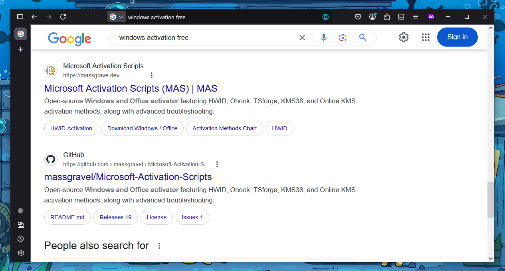
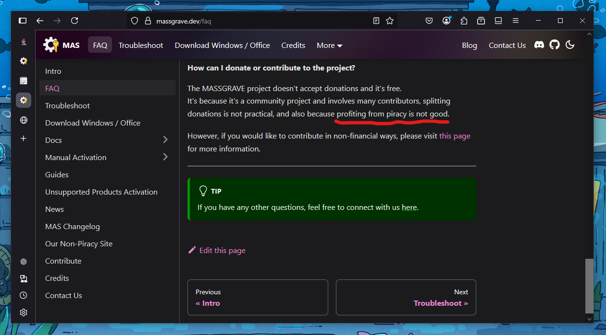
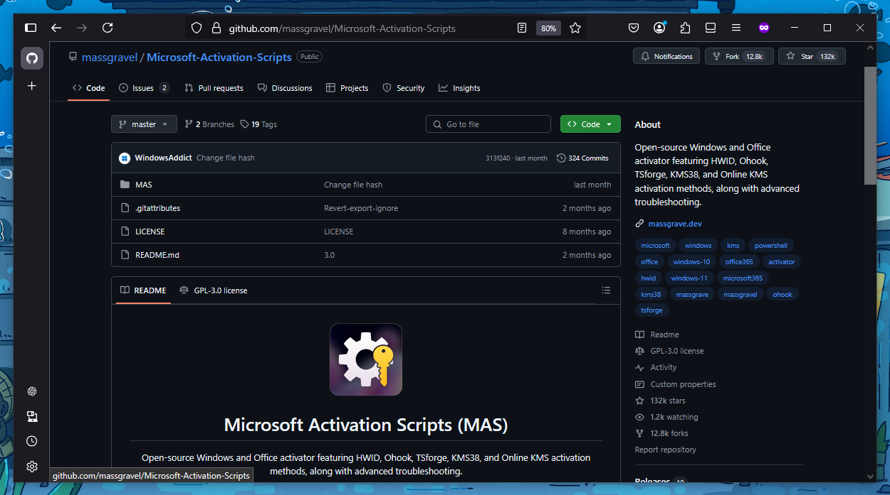
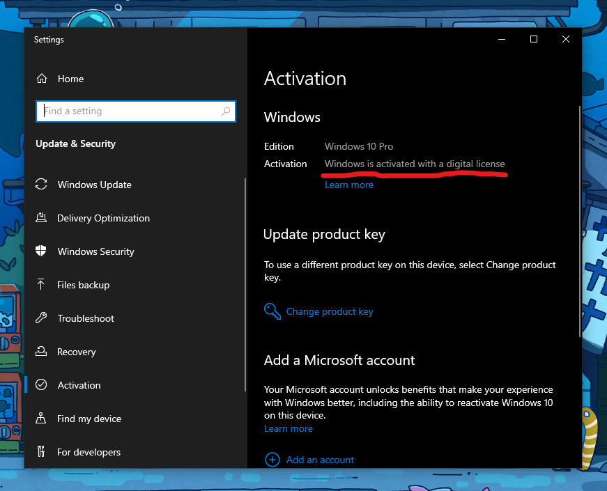

:::info

Beberapa waktu lalu, saya akan mengikuti salah tes daring (_online_) yang mengharuskan pesertanya meng-_install_ dan menggunakan **Safe Exam Browser (SEB)** versi 3.7 di Windows atau MAC (btw, per artikel ini ditulis, versi terbaru SEB adalah 3.9). Setelah berhasil melakukan instalasi, monitor laptop saya mengalami _stuttering_ dan pada akhirnya berujung pada _blue screen_ di tengah-tengah pemakaian. Sebetulnya, gejala awalnya sudah terjadi beberapa hari sebelumnya. 

Awalnya, saya mengira "kerusakan" ini bersumber dari monitor laptopnya saja. Mungkin laptop saya pernah jatuh, terinjak, atau bagaimana sehingga monitor akhirnya terdampak. Saya belum tahu pasti masalahnya ada di mana. Walaupun sebetulnya _blue screen_ memiliki _error message_, tapi, setiap kali _blue screen_, biasanya _error message_-nya bisa saja berbeda, jadi hampir tidak membantu banyak.

Parahnya, pada akhirnya laptop saya bukan lagi tidak bersahabat di tengah-tengah pemakaian, tapi tidak bisa _booting_ ke Windows. Setiap kali mau _booting_, akan selalu muncur _blue screen_. Alhamdulillahnya, di detik-detik terakhir sebelum laptop saya mengalami hal tersebut, saya sempat melihat kejanggalan informasi yang dilaporkan oleh **Hard Disk Sentinel** mengenai SSD 256 GB dari V-Gen yang saya gunakan untuk menyimpan sistem operasi. Dengan demikian, kecurigaan saya terhadap penyebab kerusakan ini tidak hanya di layar atau monitor, tapi sedikit bergeser ke SSD.

Seingat saya, SSD tersebut memang sudah cukup lama digunakan, seingat saya sejak pandemi Covid-19, dan saya sudah sering kali melakukan instalasi Arch linux juga sebagai _dual boot_, sehingga mungkin **Tera Byte Written (TBW)**-nya atau batas maksimal untuk menulisnya sudah tercapai (atau mungkin sudah dilampaui). Apalagi, setelah melihat spesifikasinya di _marketplace_, rupanya memang TBW SSD-ini relatif rendah (setidaknya sepenglihatan dan sepengetahuan saya pada saat itu). Ini jugalah sebetulnya kelemahan dibalik kelebihan SSD dibanding Hard Disk, meskipun memiliki kecepatan yang jauh lebih tinggi dan durabilitas pada guncangan, SSD lemah di waktu penggunaan yang relatif lebih cepat "aus" dibandingkan Hard Disk.

Untuk meyakinkan diri saya bahwa penyebab _blue screen_-nya ada di SSD, saya pergi ke toko _service_ komputer terdekat dari kos saya di Bandung. Hasil konsultasinya memvonis benar bahwa SSD saya sudah habis masa bakti-nya sehingga perlu diganti agar sistem operasi dapat berjalan dengan baik kembali. Dengan demikian, saya putuskan untuk membeli SSD baru berkapasitas 256 GB dengan merk Adata Legend 710 Gen3 dari marketplace yang tokonya juga berada di Bandung (karena waktu tes sudah H-2) dan mencoba melakukan _install_ ulang Windows 10 sendiri. Sejujurnya, ini adalah kali pertama saya melakukan instalasi Windows secara _baremetal_ di laptop, jadi tetap ada "ndredeg"-nya. 😅

Setelah instalasi berhasil, saya menemukan masalah baru: Lisensi Windows tidak ada. Artinya, beberapa fitur tidak dapat digunakan. Dari sinilah saya kemudian mencari akal. Beberapa alternatif muncul di benak saya, seperti "Membeli lisensi Windows resmi", "Meminta tukang _service_ untuk mengaktivasi Windows", hingga "Mencari Windows bajakan di internet". Namun, saya pikir, itu semua adalah pilihan terakhir jika saya benar-benar tidak menemukan solusi yang lebih sederhana di internet. Maka, mulailah saya berselancar di Google dengan satu senjata, yaitu _keyword_ **"windows activation free"**. Setelah membongkar beberapa artikel dan video Youtube, akhirnya, muncullah website berikut:



:::

> Bagian **Selayang Pandang** ini berisi latar belakang saya menemukan dan menggunakan MAS (Microsoft Activation Script). Sesuai judulnya, 99% isinya curhat. Jadi, bila berkenan bisa dibaca, jika tidak, di-_skip_ pun tidak mengapa. 

## Legalitas, Urgensi, dan Kompensasi

Sebelum masuk ke teknis, tentu saja kita perlu membahas tentang legalitas dan urgensi. Sebab, untuk melakukan aktivasi Windows secara resmi, kita harus membeli lisensinya langsung ke pihak pengembang Windows, yaitu Microsoft.

Tapi, pertanyaannya kan selalu tentang **"Bagaimana kalau tidak punya dana untuk membeli lisensi Windows?"** dan **"Apa alternatif pembelian lisensi Windows?"** 

### Legalitas 

Apakah Microsoft Activation Script (MAS) legal dan resmi?  
Jawaban singkatnya: **TIDAK LEGAL & TIDAK RESMI**.

Meskipun MAS merupakan _software_ yang [_open source_](https://opensource.org/) dan gratis, dimana bahkan _source code_-nya disimpan dan dikelola di [Github](https://github.com/massgravel/Microsoft-Activation-Scripts) yang "notabene"-nya adalah [milik Microsoft](https://news.microsoft.com/2018/06/04/microsoft-to-acquire-github-for-7-5-billion/) juga, tidak menjadikannya legal dan resmi. Sebab, MAS dikembangkan oleh pihak lain (bukan Microsoft)  dan tentu saja tidak atas izin Microsoft. Dengan demikian, sekali lagi, meskipun ada di Github dan bersifat _open source_, Microsoft Activation Script (MAS) bukanlah produk resmi dan legal.

Hal tersebut juga sudah dinyatakan langsung oleh pihak pengembang MAS di websitenya.[^1]


### Urgensi

Kenapa harus memilih MAS (Microsoft Activation Script) sebagai alternatif?
Jawaban singkatnya: **OPEN SOURCE & FREE**.[^2]



> **DISCLAIMER!** Saya bukan _sales_ atau bagian _marketing_-nya MAS. Artikel ini tidak disponsori sepeser pun. 

Kehadiran _script_ ini dalam lisensi _open source_, memberi kita ketenangan batin. Sebab, kita sendiri bisa memastikan bahwa script ini bukan atau tidak menyisipkan _malware_ atau virus di dalamnya. Bahkan, kalau tidak percaya tentang keamanan _script_ ini, kita dapat memastikannya sendiri dengan membukanya dengan editor sederhana (seperti Notepad) atau bahkan menggunakan bantuan AI (Artificial Intelligence). Jadi, alih-alih menggunakan atau membeli Windows bajakan yang kita tidak tahu keamanannya, MAS dapat menjadi alternatif yang terbaik.

Selain itu, *software* atau _script_ ini juga gratis. Artinya, kita sama sekali tidak perlu merogoh kocek untuk mendapatkan lisensi Windows (yang bahkan permanen)! Luar biasa, bukan? Bahkan, beberapa Windows bajakan saja terkadang masih ada yang mengharuskan kita untuk mengeluarkan duit. 🤣

### Kompensasi

Kompensasi atau "efek samping" adalah hal yang lumrah dipertanyakan ketika mendapat barang secara cuma-cuma. Sebab, seperti kata pepatah, _There is no such thing as a free lunch_, bukan begitu? 😏

Namun, sejauh saya menggunakan lisensi Windows dari MAS ini (sudah 5 hari sejak aktivasi hingga artikel ini ditulis), belum ada "efek samping" yang saya rasakan. Pun tidak ada tanda-tanda _script_ MAS tersebut melakukan aktivitas ilegal pada komputer saya (re: hacking atau mencuri informasi). Singkat kata, penggunaan _script_ MAS untuk aktivasi lisensi Windows 

## Cara Aktivasi Windows dengan MAS

> **Notes:** Microsoft Acvivation Script (MAS) tidak hanya dapat digunakan untuk melakukan aktivasi Windows, tetapi juga aktivasi Microsoft Office. 

Ada dua cara untuk melakukan aktivasi lisensi dengan Windows dengan Microsoft Activation Script (MAS), yaitu cara otomatis & cara manual. Kita hanya perlu mengetikkan 2 baris perintah saja di Powershell jika memilih cara otomatis. Namun, jika kita ingin yang lebih "aman", kita dapat menggunakan cara manual. Kita dapat memilihnya sendiri berdasarkan preferensi.

### Cara Otomatis

1. Buka Powershell atau Terminal Windows.  
Caranya beragam:
- Tekan tombol "Windows" di keyboard, dan ketikkan Powershell atau Terminal.
- Tekan tombol "Windows" + "X" di keyboard secara bersamaan, klik Windows Powershell.
- Tekan tombol "Windows" + "R" di keyboard secara bersamaa, ketikkan wt, Enter.

2. _Copy-Paste_ baris kode berikut, kemudian tekan Enter.

```powershell
irm https://get.activated.win | iex
```

Atau bisa juga dengan kode berikut, sama saja:

```powershell
irm https://massgrave.dev/get | iex
```

3. Kita akan melihat pilihan aktivasi berikut:

Press [1] HWID for Windows activation.  
Press [2] Ohook for Office activation.  

4. Selesai.

### Cara Manual

1. Unduh file-nya pada tautan berikut:

https://github.com/massgravel/Microsoft-Activation-Scripts/archive/refs/heads/master.zip

atau di sini, sama saja:

https://git.activated.win/massgrave/Microsoft-Activation-Scripts/archive/master.zip

2. Klik kanan pada file **`.zip`** yang sudah diunduh. Pilih ekstrak.
3. Di folder yang sudah ter-ekstrak, masuk ke folder **All-In-One-Version**.
4. Jalankan file _script_ **MAS_AIO.cmd**.
5. Akan muncul beberapa pilihan aktivasi. Silakan dipilih dan ikuti instruksi.
6. Selesai.

Selanjutnya, kita dapat memverifikasi lisensi Windows-nya dengan melihatnya di **Activation Settings**.

Caranya beragam:
- Tekan tombol "Windows" di keyboard. Ketikkan "Activation Settings". Enter.
- Tekan tombol "Windows" + "I" di keyboard secara bersamaan. Ketikkan "Activation Settings". Klik "Activation Settings".

Jika sudah teraktivasi, akan muncul keterangan **Windows is activated with a digital license**, seperti terlihat pada tangkapan layar di bawah ini:



Demikian. Semoga bermanfaat.

## Credits

> Untuk informasi lebih lanjut, sila kunjungi website / Github repo MAS.  
**Website: https://massgrave.dev/**  
**Github: https://github.com/massgravel/Microsoft-Activation-Scripts**


[^1]: https://massgrave.dev/faq
[^2]: https://github.com/massgravel/Microsoft-Activation-Scripts