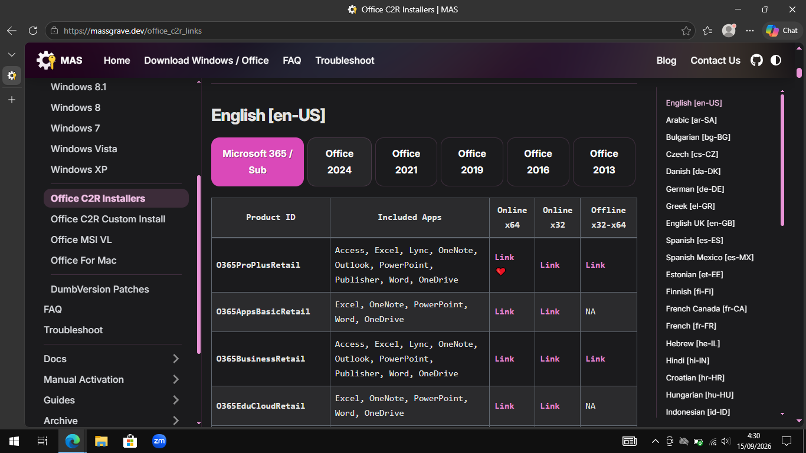
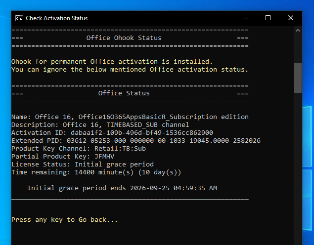
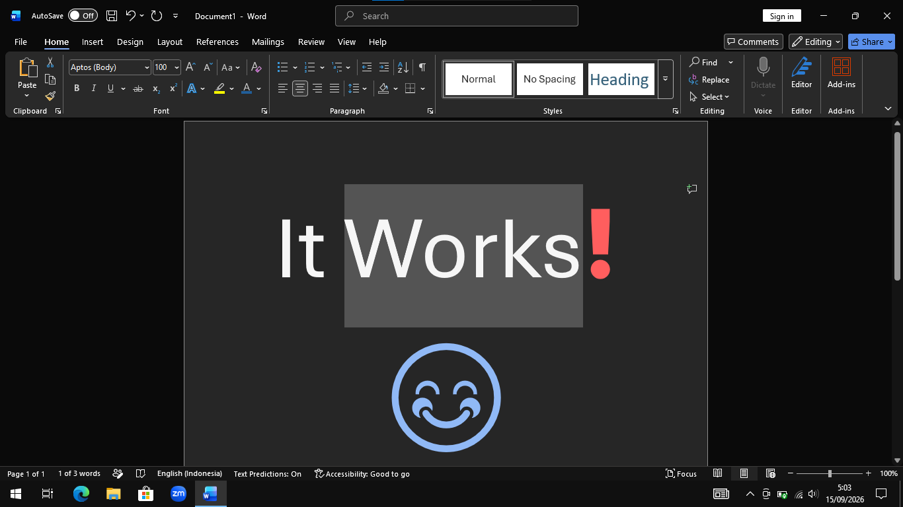

Di artikel MAS yang lalu, saya sempat membahas cara mengaktivasi lisensi Windows menggunakan _"script"_ [massgrave](https://massgrave.dev/). Jadi, pertanyaan terkait **"legalitas"**, **"urgensi"**, dan **"kompensasi"** sila baca-baca di artikel tersebut:

[[/tech/mas/]]

Saya akan membahas cara aktivasi Microsoft Office di artikel ini, langkah demi langkah.

Secara umum, pembahasan akan dibagi ke dalam 2 garis besar:
1. Mengunduh & memasang MS. Office (365)
2. Mengaktivasi MS. Office.

## 1. Mengunduh & Memasang Microsoft Office

:::info

Bagian ini dibuat agar memudahkan pembaca yang belum memiliki / meng-_install_ Office. Jika pembaca sudah memiliki Office, bisa men-_skip_ bagian ini dan langsung ke bagian kedua (Mengaktivasi MS. Office).

:::

Ada 2 cara untuk men-_download_ Office:
1. Langsung dari website [Microsoft](https://www.microsoft.com/en-us/microsoft-365/download-office).
2. Via website [Masgrave](https://massgrave.dev/office_c2r_links).

Kali ini, saya hanya akan mendemonstrasikan pengunduhan Office via website Massgrave.  



Perlu diketahui juga, jenis Office yang akan saya _download_ adalah Office 365.  
Pilihan Office 365 saya pilih karena dua alasan utama:
- Fiturnya relatif lebih kaya dibanding Office versi "tahun", seperti Office 2024, dst.
- Bisa dapat _update_, tidak seperti Office versi "tahun" yang tidak ada update (kalaupun ada, berarti kita "pindah versi", bukan update saja).

Berikut langkah-langkahnya:
1. Pergi ke website [Massgrave](https://massgrave.dev/office_c2r_links) tersebut.[^1]
2. Silakan pilih versi Office yang diinginkan.
- Saya pilih **Microsoft 365**, **English**, **O365AppsBasicRetail**, **Online x64**.
3. Akan terunduh file "OfficeSetup.exe", kira-kira sebesar 7 MB.
4. Klik dua kali untuk melakukan instalasi.
5. Tunggu proses instalasi berjalan (kecepatan instalasi bergantung kecepatan internet dan kualitas disk).
6. Selesai.

Karena saya memilih Office 365 dengan "Product ID" **O365AppsBasicRetail**, maka, Word, Excel, PowerPoint, OneDrive, dan OneNote berhasil ter-_install_. Namun, kita masih belum bisa menggunakannya karena Office mengharuskan kita memasukkan lisensi sebelum dapat menggunakannya. 

Di sinilah kita memerlukan _script_ aktivasi Masgrave.

## 2. Aktivasi Microsoft Office

Berikut adalah langkah-langkah aktivasi lisensi Office 365 dengan _script_ Masgrave.

1. Buka Powershell atau Terminal Windows.  
Caranya beragam:
- Tekan tombol "Windows" di keyboard, dan ketikkan Powershell atau Terminal.
- Tekan tombol "Windows" + "X" di keyboard secara bersamaan, klik Windows Powershell.
- Tekan tombol "Windows" + "R" di keyboard secara bersamaa, ketikkan wt, Enter.

2. _Copy-Paste_ baris kode berikut, kemudian tekan Enter.

```powershell
irm https://massgrave.dev/get | iex
```

3. Kita akan melihat pilihan aktivasi berikut:

- Press **[2] Ohook**.  
- Press **[1] Install Ohook Office Activation**.  

4. Selesai.

Kita bisa memastikan aktivasinya sudah berhasil dengan:
1. Mengeceknya via _script_ MAS:


2. Membuka langsung salah satu produk Office 365, misalnya MS. Word:


## Credits

> Untuk informasi lebih lanjut, sila kunjungi website / Github repo MAS.  
**Website: https://massgrave.dev/**  
>
> ::github{repo="massgravel/Microsoft-Activation-Scripts"}


[^1]: https://massgrave.dev/office_c2r_links


