## Metadata: What Are You?

Mungkin kita tidak asing dengan istilah data. Data atau yang biasa disinonimkan dengan informasi secara umum adalah keterangan atau bahan nyata yang dapat dijadikan dasar kajian (analisis atau kesimpulan). Dalam konteks digital, data merupakan informasi dalam bentuk yang dapat diproses oleh komputer, seperti representasi digital dari teks, angka, gambar grafis, atau suara.[^1]

Itu data. Bagaimana dengan metadata? Apa itu metadata? Apakah metadata berbeda dengan data? Mengapa ada metadata?

### Defining Metadata

Menurut KBBI, metadata adalah informasi tentang asal data, struktur, karakteristik, dan sebagainya dari seperangkat data.[^2] Menurut IBM, metadata adalah data tentang data.[^3]

:::info

Singkatnya, **metadata** adalah **data tentang data**.

:::

Sebagai ilustrasi, jika saya memiliki sebuah file video, maka file video itu adalah data. Sementara informasi tentang jenis file (mp4, mkv, etc), ukuran file, resolusi video, durasi videonya, kapan dibuat & dimodifikasi, nama pembuat file, software/device yang digunakan untuk membuat file, adalah metadata.

Berikut adalah contoh metadata dari sebuah video rekaman yang saya buat:

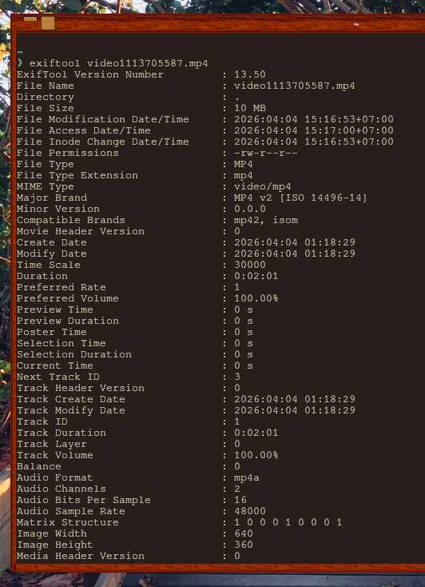

Dari gambar tersebut, kita tahu ada beberapa metadata yang penting:
- **File Size:** 10 MB
- **File Type:** MP4
- **Create Date:** 2026:04:04 01:18:29
- **Modify Date:** 2026:04:04 01:18:29
- **Duration:** 00:02:01

:::note

Metadata setiap file bisa saja berbeda. Artinya, tidak semua file memiliki informasi tentang siapa pembuat filenya, software/device yang digunakan, atau informasi metadata lainnya. 

:::

## Editing Metadata

Kita sudah mengetahui apa itu data dan metadata, berikut dengan perbedaan keduanya. 

### Is it possible?

Sekarang, pertanyaannya adalah, jika data bisa dimanipulasi atau diubah (ditambahkan, diganti, dihapus), apakah metadata juga dapat dimanipulasi?

Jawaban singkatnya: **Tergantung**.

Tergantung apakah kita diizinkan untuk meng-_edit_ metadatanya atau tidak. Sebab, beberapa file (setidaknya yang pernah saya jumpai) ada yang dapat dimanipulasi, namun ada juga yang tidak bisa. Kalaupun saya bisa meng-_edit_ metadata suatu file, saya juga belum tentu bisa meng-_edit_ semua metadatanya. Ada juga file yang hanya mengizinkan metadata tertentu saja yang dapat di-_edit_.

### What for?

Untuk apa memanipulasi metadata?  
Bukankah itu sama dengan penipuan?  

Jawaban singkatnya: **Belum tentu**.

Baik/buruknya manipulasi data tergantung dari niat _editor_-nya. Hehe. Seperti yang saya sampaikan sebelumnya, tidak semua file menyertakan metadata yang lengkap. Bisa saja seseorang ingin menambahkan namanya sebagai pembuat file di metadata, dan itu sah-sah saja selama filenya memang dia yang buat. Tapi, tentu saja akan selalu ada niat-niat buruknya, yang tentu saja tidak saya rekomendasikan melalui artikel ini.

### The Tools

Berikut adalah daftar _tools/software_ yang dapat digunakan untuk melakukan manipulasi metadata:

| No  | Software Name   | Linux Distribution    | Installation                              |   
|:---:| :---            | :---                  | :---                                      |
|     |                 | **General-Purpose**   |                                           |
|  1  | Exiftool (CLI)  | Debian/Ubuntu         | sudo apt install libimage-exiftool-perl   |
|     |                 | Archlinux             | sudo pacman -Sy perl-image-exiftool       |
|     |                 | Fedora                | sudo dnf install perl-Image-ExifTool      |
|     |                 | OpenSUSE              | sudo zypper install exiftool              |
|     |                 | NixOS                 | nix-shell -p exiftool                     |
|  2  | jExifToolGUI    | Debian/Ubuntu         | [Github Repo](https://github.com/hvdwolf/jExifToolGUI) |
|     |                 | Archlinux             | yay -Sy jexiftoolgui                      |
|     |                 | Fedora                | [Github Repo](https://github.com/hvdwolf/jExifToolGUI) |
|     |                 | OpenSUSE              | [Github Repo](https://github.com/hvdwolf/jExifToolGUI) |
|     |                 | NixOS                 | [Github Repo](https://github.com/hvdwolf/jExifToolGUI) |
|     |                 | **Image-Spesific Editor**  |                                      |
|  3  | digiKam (GUI)   | Debian/Ubuntu         | sudo apt install digikam                  |
|     |                 | Archlinux             | sudo pacman -Sy digikam                   |
|     |                 | Fedora                | sudo dnf install digikam                  |
|     |                 | OpenSUSE              | sudo zypper install digiKam               |
|     |                 | NixOS                 | nix-shell -p digikam                      |
|  4  | xnviewmp (GUI)  | Debian/Ubuntu         | [Official Website](https://www.xnview.com/en/xnview-mp/) |
|     |                 | Archlinux             | yay -Sy xnviewmp                          |
|     |                 | Fedora                | [Official Website](https://www.xnview.com/en/xnview-mp/) |
|     |                 | OpenSUSE              | sudo zypper install xnviewmp              |
|     |                 | NixOS                 | nix-shell -p xnviewmp                     |
|  5  | GIMP (GUI)      | Debian/Ubuntu         | sudo apt install gimp                     |
|     |                 | Archlinux             | sudo pacman -Sy gimp                      |
|     |                 | Fedora                | sudo dnf install gimp                     |
|     |                 | OpenSUSE              | [GIMP - Snap](https://snapcraft.io/gimp)  |
|     |                 | NixOS                 | nix-shell -p gimp                         |
|  6  | exiv2 (CLI)     | Debian/Ubuntu         | sudo apt install exiv2                    |
|     |                 | Archlinux             | sudo pacman -Sy exiv2                     |
|     |                 | Fedora                | sudo dnf install libkexiv2-qt6            |
|     |                 | OpenSUSE              | sudo zypper install exiv2                 |
|     |                 | NixOS                 | nix-shell -p exiv2                        |
|     |                 | **Audio & Music Tagging**  |                                      |
|  7  | picard (GUI)    | Debian/Ubuntu         | sudo apt install picard                   |
|     |                 | Archlinux             | sudo pacman -Sy picard                    |
|     |                 | Fedora                | sudo dnf install picard                   |
|     |                 | OpenSUSE              | sudo zypper install picard                |
|     |                 | NixOS                 | nix-shell -p picard                       |
|  8  | kid3 (GUI)      | Debian/Ubuntu         | sudo apt install kid3                     |
|     |                 | Archlinux             | sudo pacman -Sy kid3                      |
|     |                 | Fedora                | sudo dnf install kid3                     |
|     |                 | OpenSUSE              | sudo zypper install kid3                  |
|     |                 | NixOS                 | nix-shell -p kid3                         |
|  9  | easyTAG (GUI)   | Debian/Ubuntu         | sudo apt install easytag                  |
|     |                 | Archlinux             | sudo pacman -Sy easyta                    |
|     |                 | Fedora                | sudo dnf install easytag                  |
|     |                 | OpenSUSE              | sudo zypper install easytag               |
|     |                 | NixOS                 | nix-shell -p easytag                      |
|     |                 | **Video Tagging**     |                                           |
| 10  | VLC (GUI)       | Debian/Ubuntu         | sudo apt install vlc                      |
|     |                 | Archlinux             | sudo pacman -Sy vlc                       |
|     |                 | Fedora                | sudo dnf install vlc                      |
|     |                 | OpenSUSE              | sudo zypper install vlc                   |
|     |                 | NixOS                 | nix-shell -p vlc                          |
|     |                 | **Document Tagging**  |                                           |
| 11  | pdftk (CLI)     | Debian/Ubuntu         | sudo apt install pdftk                    |
|     |                 | Archlinux             | sudo pacman -Sy pdftk                     |
|     |                 | Fedora                | sudo dnf install pdftk                    |
|     |                 | OpenSUSE              | sudo zypper install pdftk                 |
|     |                 | NixOS                 | nix-shell -p pdftk                        |

### The Method

Sekarang, waktunya demonstrasi.

Saya tidak akan mendemonstrasikan penggunaan seluruh _tools_ yang sudah saya paparkan sebelumnya. Jadi, saya hanya akan mendemonstrasikan penggunaan 4 _tools_ saja: 
1. `exiftool`
2. `xnviewmp`
3. `picard`
4. `vlc` 

Sebelum mulai membahas satu persatu `tools` tersebut, saya sudah siapkan 5 jenis file yang nanti akan kita coba analisis dan manipulasi metadatanya: 

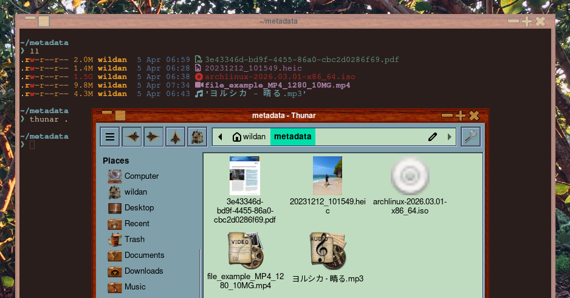

1. sebuah file dokumen (pdf)
2. sebuah file gambar (heic)
3. sebuah file image (iso)
4. sebuah file video (mp4)
5. sebuah file audio (mp3)

Satu informasi lagi, setiap "_review_" software di bawah ini, saya akan lihat 4 kemampuannya terkait metadata:
1. **melihat**: menampilkan metadata.
2. **mengubah**: mengedit informasi yang sudah ada di metadata.
3. **menambahkan**: menambahkan metadata baru yang belum ada sebelumnya.
4. **menghapus**: menghapus metadata yang sudah ada sebelumnya.

#### 1. `exiftool`

Sekarang, saya akan demonstrasikan penggunaan `exiftool` sebagai _tools_ untuk mengintip dan memanipulasi metadata:

1. **Melihat metadata**

Karena `exiftool` adalah _software_ berbasis CLI (_Command Line Interface_), jadi, berikut adalah perintah yang digunakan untuk melihat metadata suatu file:

```shell
exiftool nama_file.pdf
```

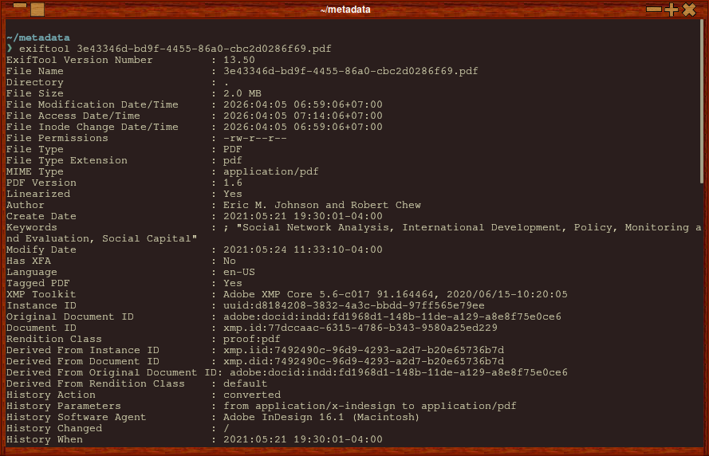

2. **Mengubah metadata**

Mengubah metadata yang saya maksud adalah mengganti informasi yang terdapat di metadata. Misalnya, dari file pdf di atas, saya ingin mengganti nama "Author"-nya dari "Eric M. Johnson and Robert Chew" menjadi nama saya: "Wildan".

Berikut adalah perintahnya:

```shell
exiftool -Author="Wildan" nama_file.pdf
```

:::note

Bagian **-Author** bisa disesuaikan (diganti) dengan metadata yang ingin kalian ubah.

:::

Berikut hasilnya:

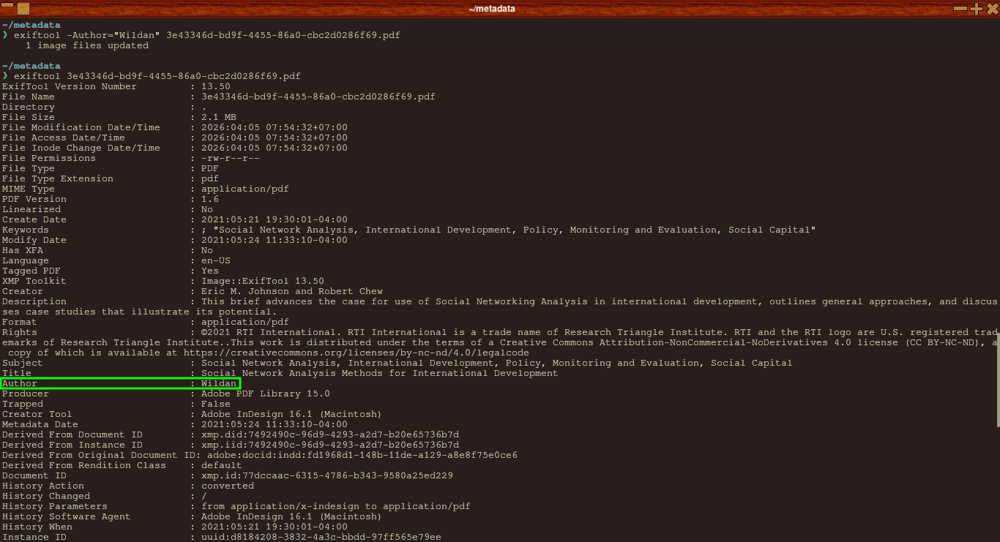

Seperti terlihat, jika metadata berhasil diubah, maka akan ada keterangan "_**1 images file updated**_". Selain itu, terlihat juga bahwa metadata "Author"-nya sudah berubah menjadi "Wildan". 

3. **Menambahkan metadata**

Perintah untuk menambahkan metadata mirip dengan perintah untuk mengganti metadata. Hanya saja, di sini kita akan menyisipkan metadata baru yang belum ada sebelumnya. Di sini, saya akan menambahkan metadata "Copyright" dengan parameter / informasi "WildanARCH".

Berikut perintahnya:

```shell
exiftool -Copyright="WildanARCH" nama_file.pdf
```

Berikut _output_-nya:

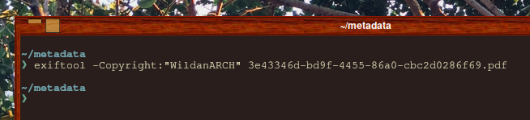

Sayang sekali, sepertinya `exiftool` belum bisa menambahkan metadata baru untuk file pdf.

:::note

Setelah melihat halaman **man pages** `exiftool`, ternyata memang file pdf tidak (atau belum) punya dukungan untuk dibuatkan metadata baru dari `exiftool`. Jadi, metadata file pdf hanya bisa dibaca (_read_) dan diganti (_write_) saja.

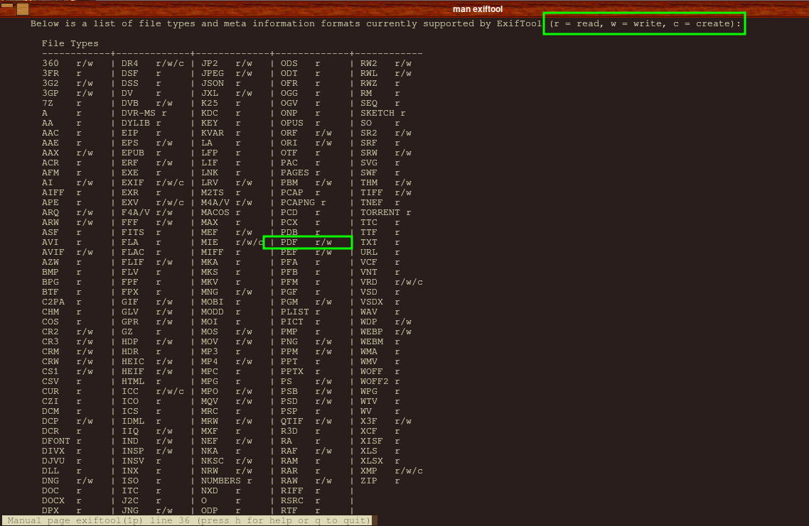

:::

4. **Menghapus metadata**

exiftool dapat digunakan untuk menghapus satu, beberapa, atau semua metadata suatu file. Dalam contoh di bawah ini, saya akan menghapus metadata "Author".

Perintahnya:

```shell
exiftool -Auhtor= nama_file.pdf
```

_Output_-nya:

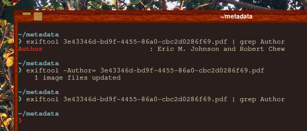

Berhasil! Metadata "Author" sudah terhapus. 

Jika kita ingin menghapus semua metadata yang ada tanpa harus memasukkan satu persatu metadata yang ada ke dalam opsi `exiftool`, kita bisa gunakan perintah:

```shell
exiftool -all= nama_file.pdf
```

Hasilnya:

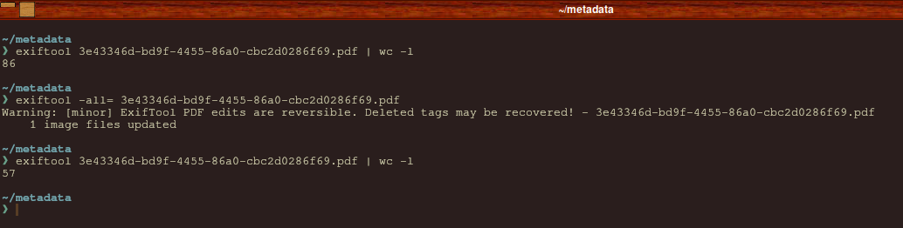

Seperti terlihat, memang tidak semua metadata dapat terhapus. Salah satu alasan yang paling masuk akal adalah karena memang kita (atau _exiftool_) tidak diberi izin oleh dokumen atau file tersebut untuk menghapus semua metadata.

Tapi, berdasarkan tangkapan layar di atas, terlihat bahwa dari 86 metadata awal yang ada, dengan perintah tersebut, `exiftool` sudah menghapus sekitar 29 metadata sehingga hanya tersisa 57 metadata saja yang tidak dapat terhapus.

#### 2. `xnviewmp`

Sekarang, saya akan demonstrasikan penggunaan `xnviewmp` sebagai _tools_ untuk mengintip dan memanipulasi metadata. Berbeda dengan `exiftool`, `xnviewmp` adalah _software_ berbasis GUI (_Graphical User Interface_). File yang akan saya gunakan untuk demonstrasi `xnviewmp` ini adalah file gambar.

1. **Melihat metadata**

Setelah membuka _software_ `xnviewmp`, kita hanya perlu mengklik file yang ingin kita lihat metadatanya: 

<script src="https://fast.wistia.com/player.js" async></script><script src="https://fast.wistia.com/embed/rsg8udg9mc.js" async type="module"></script><style>wistia-player[media-id='rsg8udg9mc']:not(:defined) { background: center / contain no-repeat url('https://fast.wistia.com/embed/medias/rsg8udg9mc/swatch'); display: block; filter: blur(5px); padding-top:54.17%; }</style> <wistia-player media-id="rsg8udg9mc" seo="false" aspect="1.8461538461538463"></wistia-player>

Seperti terlihat, dengan meng-klik file-nya saja, semua metadata yang tersedia di file tersebut akan ditampilkan di bagian bawah aplikasi `xnviewmp`. Bahkan, jika terdapat metadata terkait GPS (_Global Positioning System_), `xnviewmp` akan menampilkannya langsung dalam bentuk map. Canggih bukan?

2. **Mengubah metadata**

Untuk mengubah metadata, caranya:
1. Klik kanan pada file yang ingin diubah metadatanya.
2. Pilih menu "**metadata**".
3. Pilih sub-menu metadata yang ingin diubah (ada EXIF, IPTC, XMP, GPS, dan Add/Replace metadata) 

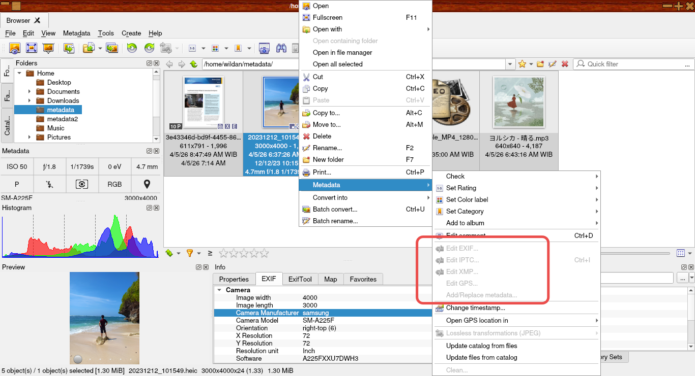

Seperti terlihat pada tangkapan layar di atas, saya ingin mengganti metadata "Camera Manufacturer" dari "samsung", tapi, sub-menu metadatanya _inactive_. Artinya, kita tidak dapat mengganti metadata di `xnviewmp` ini. 

3. **Menambahkan metadata**

Karena tidak bisa mengganti atau mengubah metadata sebuah file gambar, maka saya mencoba cara lain: mengganti filenya. Ternyata, memang masih tidak bisa mengubah metadata yang sudah ada sebelumnya, tapi, kita bisa menambahkan metadatanya di bagian sub-menu "IPTC" dan "XMP".

Di sini, saya akan menambahkan "Caption" yang berisi informasi "Edited by Wildan on Archlinux".

Caranya sama seperti sebelumnya:
1. Buka menu metadata, pilih IPTC/XMP.

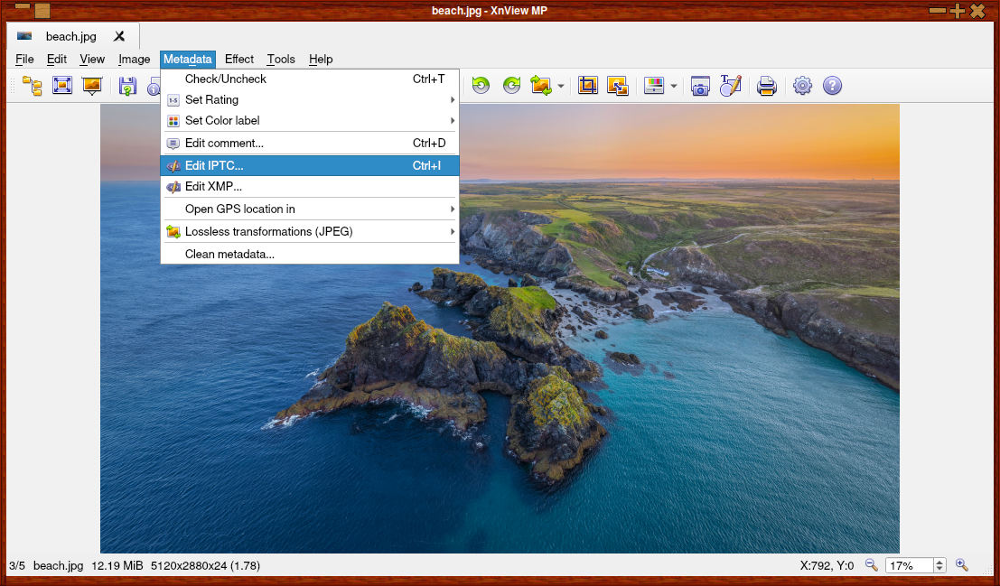

2. Di bagian "Caption", tambahkan teks, kemudian klik "Write".

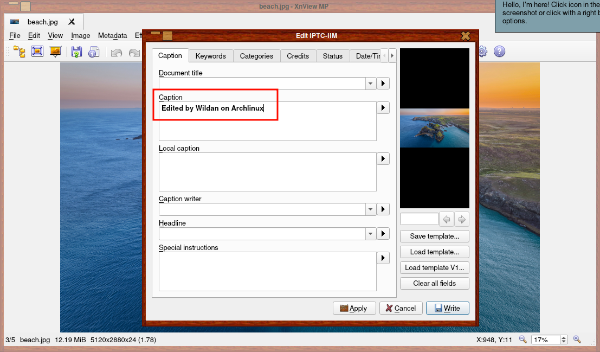

3. Cek di icon info, kemudian ke menu "Exiftool", caption berhasil ditambahkan.


Kita baru saja berhasil menambakan _caption_ di file gambar dengan `xnviewmp`!

4. **Menghapus metadata**

Untuk menghapus metadata di `xnviewmp`, ada 2 cara:

1. Masuk ke menu untuk menambahkan metadata seperti sebelumnya, kemudian kita hapus metadata yang sudah kita tambahkan.
2. Ke menu metadata, lalu pilih "Clean metadata" untuk menghapus semua metadata.

Saya akan demonstrasikan cara yang ke-2, sebab cara yang pertama memang persis seperti menambahkan metadata, hanya saja di situ kita menghapus informasi atau metadata yang sudah kita tambahkan sebelumnya.

Berikut adalah cara menghapus semua metadata:

1. Buka menu metadata -> Clean metadata.

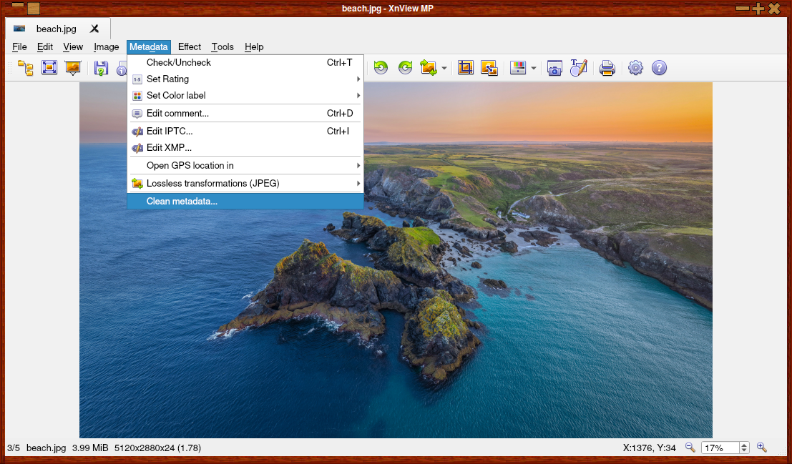

2. Pilih jenis metadata yang ingin dihapus (ceklis semua untuk menghapus semua), simpan perubahan.

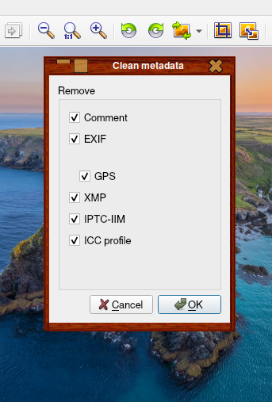

3. Lihat metadata terbaru.

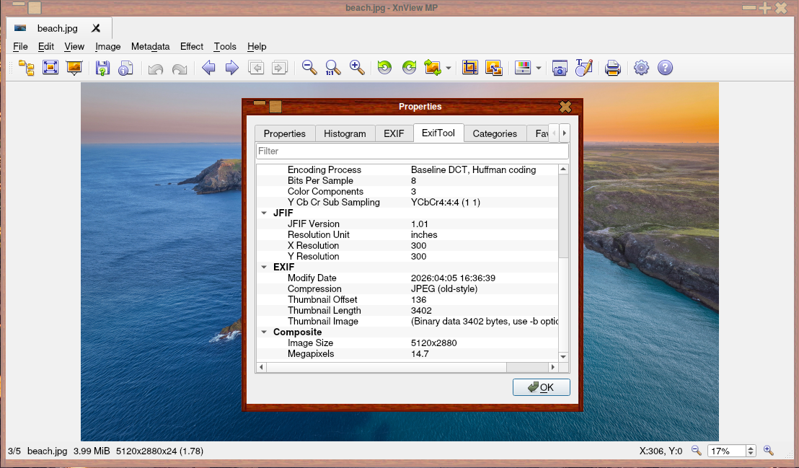

Seperti terlihat, metadatanya tidak semua terhapus, meskipun kita sudah pilih untuk menghapus seluruh metadata. Yang terhapus adalah metadata "Caption" yang tadi sudah kita tambahkan. Artinya, memang hanya metadata itulah yang diizinkan oleh file tersebut untuk bisa dihapus.

#### 3. `picard`

Sekarang, saya akan demonstrasikan penggunaan `picard` sebagai _tools_ untuk mengintip dan memanipulasi metadata. `picard` juga merupakan aplikasi berbasis GUI. File yang akan saya gunakan untuk demonstrasi ini adalah file suara (mp3).

1. **Melihat metadata**

Untuk melihat metadata, kita hanya perlu meng-klik file yang ingin kita lihat metadatanya di `picard`.

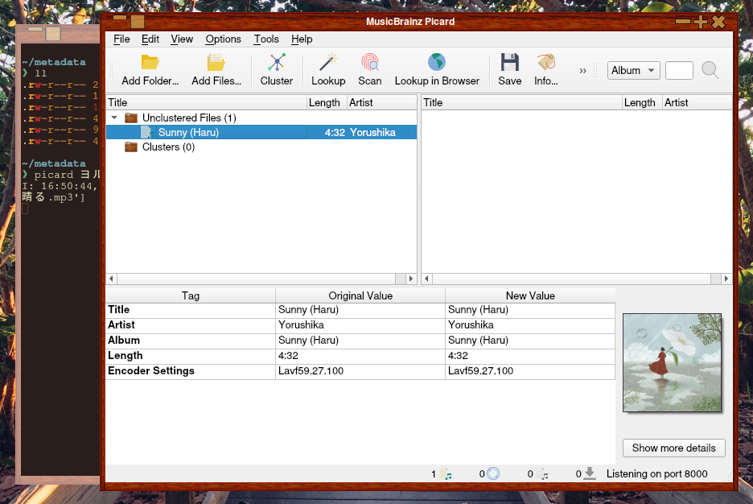

2. **Mengubah metadata**

Misalnya, saya ingin mengubah metadata "title"-nya menjadi "Cerah".

Untuk mengubah metadata,caranya:

1. Klik kanan pada metadata yang ingin diubah, pilih "Edit"

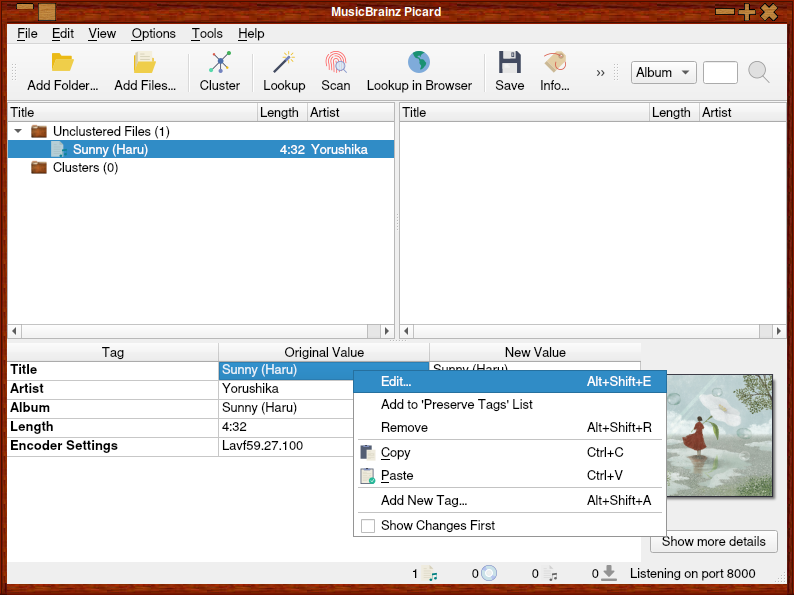

2. Pada window "Edit Tag", klik "Edit Value", ganti, dan klik "Ok".

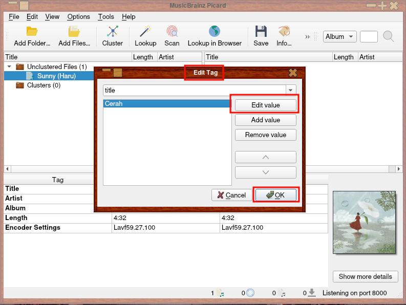

3. Seperti terlihat, metadata sudah berhasil kita ubah.

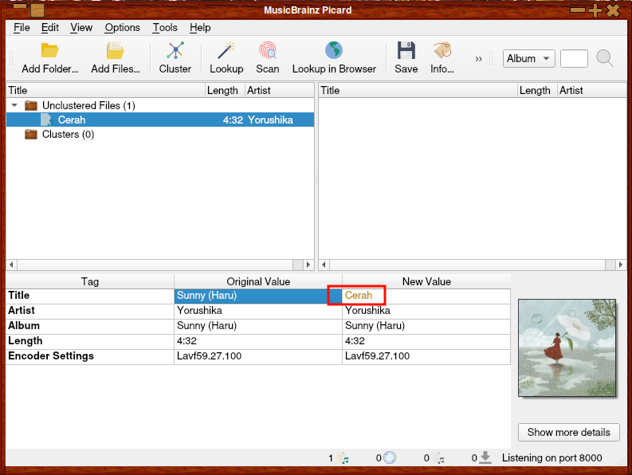

3. **Menambahkan metadata**

Misalnya, saya ingin menambahkan metadata "Editor" dengan parameter/informasi "Wildan".

Caranya:

1. Klik kanan di bagian metadata, pilih "Add New Tag".

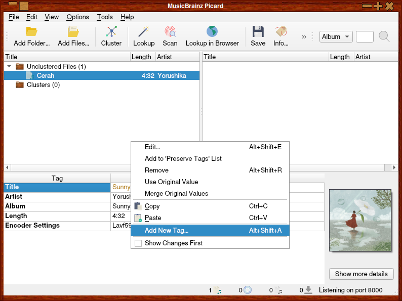

2. Isi kolom di atas dengan metadata baru yang ingin ditambahkan ("Editor), kemudian klik "Edit Value" untuk mengisi kolom di bawahnya dengan parameternya ("Wildan"), klik "Ok".

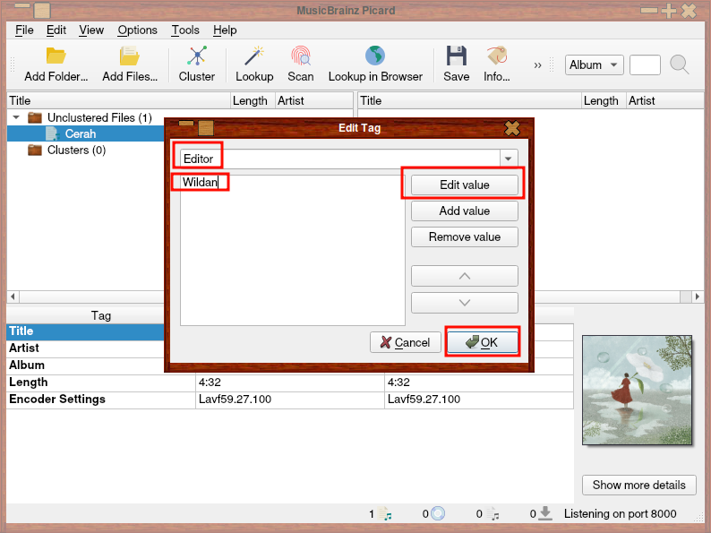

3. Metadata baru berhasil ditambahkan!

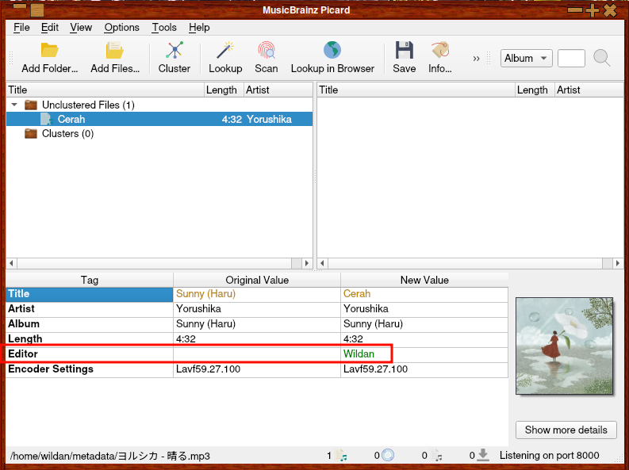

4. **Menghapus metadata**

Misalnya, saya ingin menghapus metadata "Album".

Caranya:

1. Klik kanan pada metadata yang ingin dihapus ("Album"), pilih "Remove".

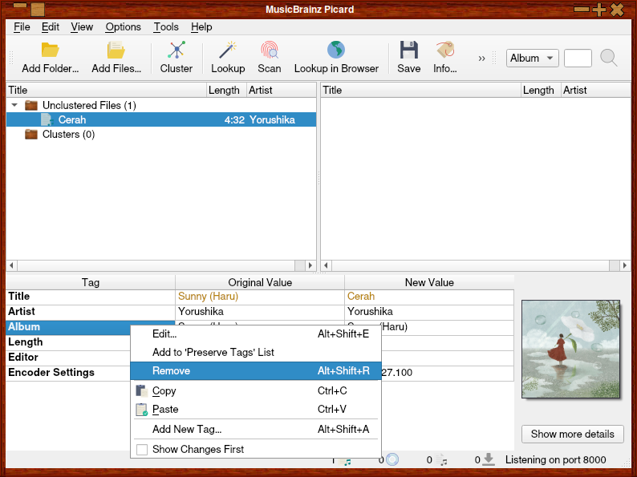

2. Terhapus!

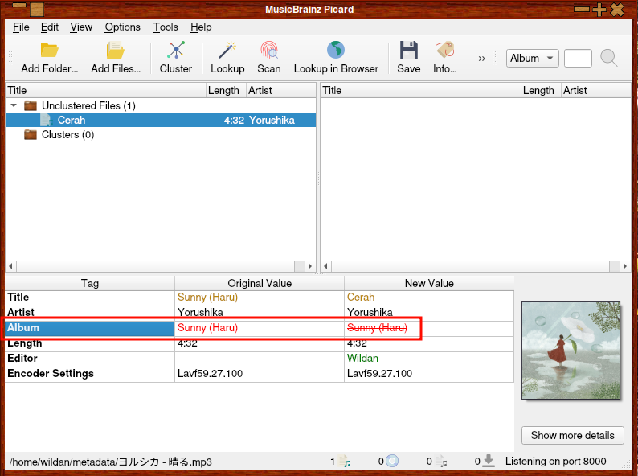

Seperti terlihat, kita berhasil menghapus metadata "Album". 

#### 3. `vlc`

Sekarang, saya akan demonstrasikan penggunaan `vlc` sebagai _tools_ untuk mengintip dan memanipulasi metadata. `vlc` seperti kita ketahui bersama juga merupakan aplikasi berbasis GUI. File yang akan saya gunakan untuk demonstrasi ini adalah file video (mp4).

Meskipun kita dapat melakukan manipulasi metadata di `vlc`, tapi, `vlc` sangat membatasi metadata yang dapat dimanipulasi (diubah, ditambahkan, dan dihapus):
1. Kita tidak dapat mengubah metadata yang sudah ada.
2. Kita hanya dapat menambahkan metadata terkait 6 hal saja: (***Track Number***, ***Artist***, ***Album***, ***Comment***, ***Content Create Date***, dan ***Genre***.)
3. Kita tidak dapat menghapus metadata yang sudah ada sebelumnya, kecuali ke-6 metadata yang dapat ditambahkan di atas.

Oleh karena itu, untuk simplifikasi, berikut saya demonstrasikan penggunaan `vlc` untuk memanipulasi ke-6 metadata tersebut. 

1. **Melihat, mengubah, menambahkan, dan menghapus** metadata

<script src="https://fast.wistia.com/player.js" async></script><script src="https://fast.wistia.com/embed/ujxwmvdq68.js" async type="module"></script><style>wistia-player[media-id='ujxwmvdq68']:not(:defined) { background: center / contain no-repeat url('https://fast.wistia.com/embed/medias/ujxwmvdq68/swatch'); display: block; filter: blur(5px); padding-top:59.17%; }</style> <wistia-player media-id="ujxwmvdq68" seo="false" aspect="1.6901408450704225"></wistia-player>

Caranya:

1. Buka file video yang ingin diganti metadatanya dengan `vlc`.
2. Klik menu "Tools" -> "Media Information" atau Ctrl+I.
3. Isi/hapus metadata yang ingin diganti.
4. Klik "Save metadata"

Selesai!

Beberapa kesimpulan yang bisa diambil dari mempelajari metadata (_at least for me_):

1. Metadata adalah data tentang data.
2. Metadata dapat dimanipulasi, meskipun belum tentu semua.

---

Artikel ini ditulis di Archlinux: (_click to enlarge_)

[grid]
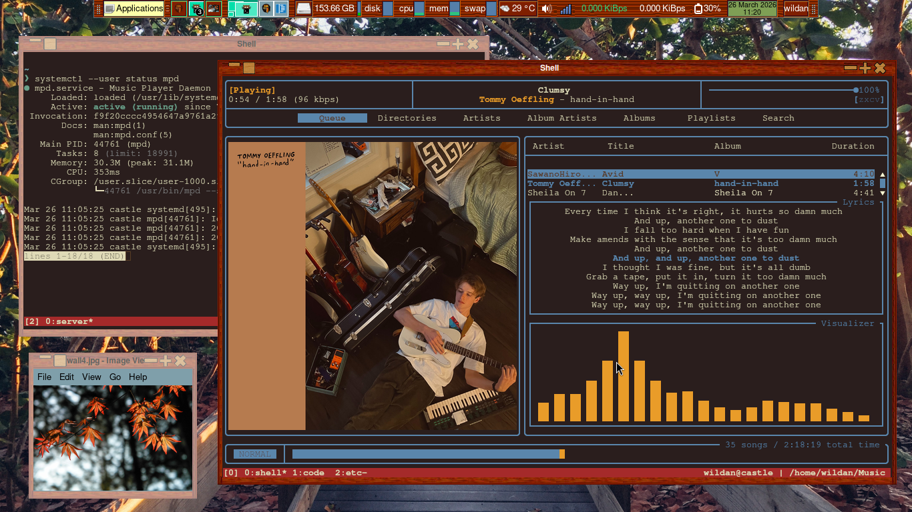
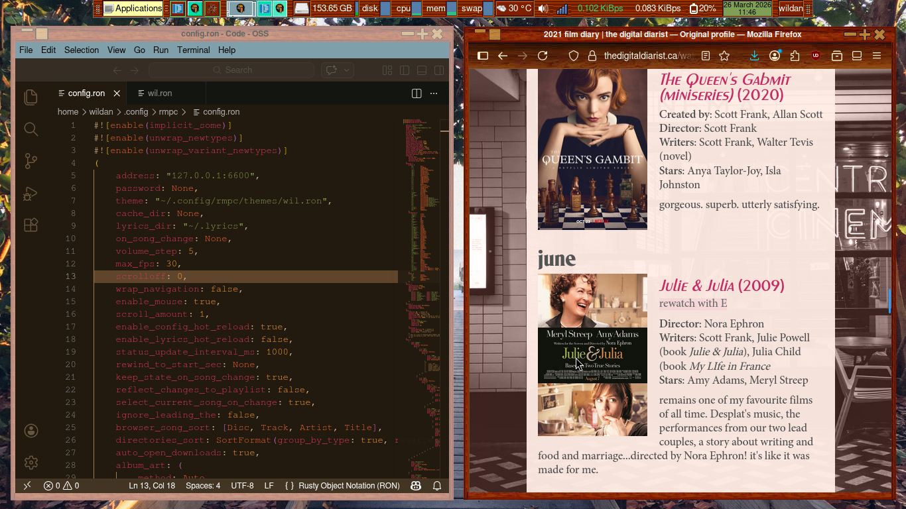
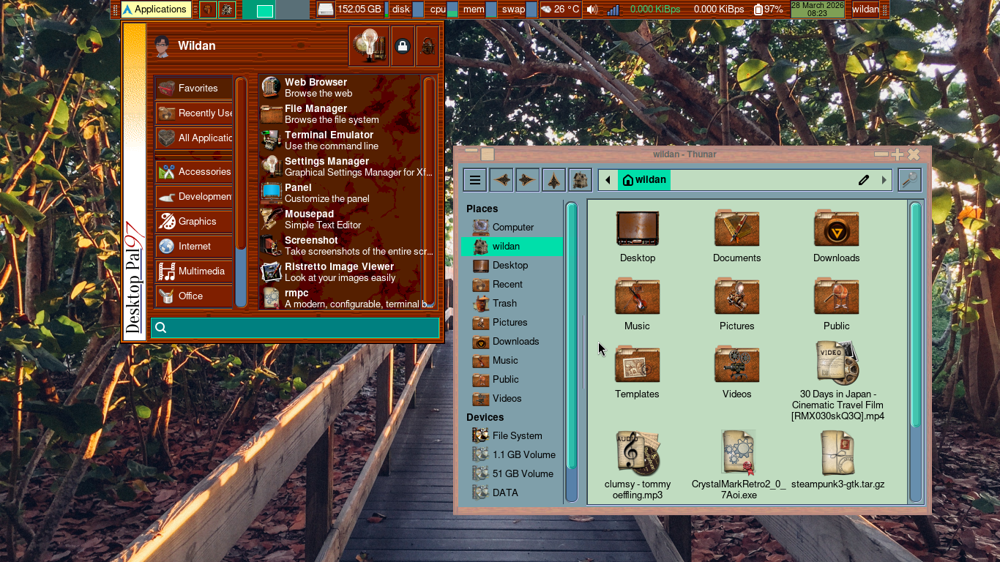
[/grid]


[^1]: https://kbbi.kemendikdasmen.go.id/entri/preambul
[^2]: https://kbbi.kemendikdasmen.go.id/entri/metadata
[^3]: https://www.ibm.com/think/topics/metadata