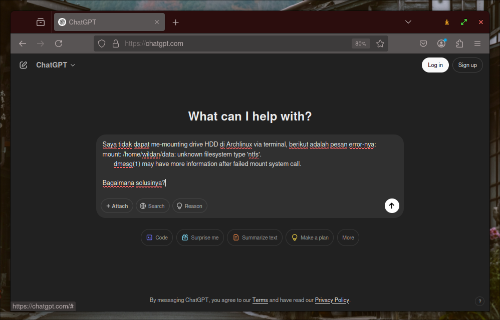
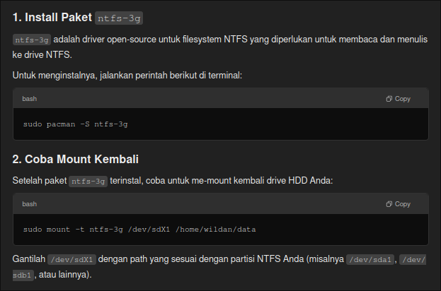
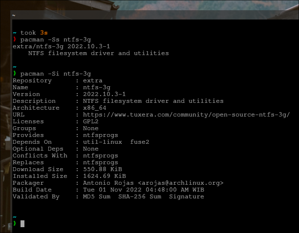
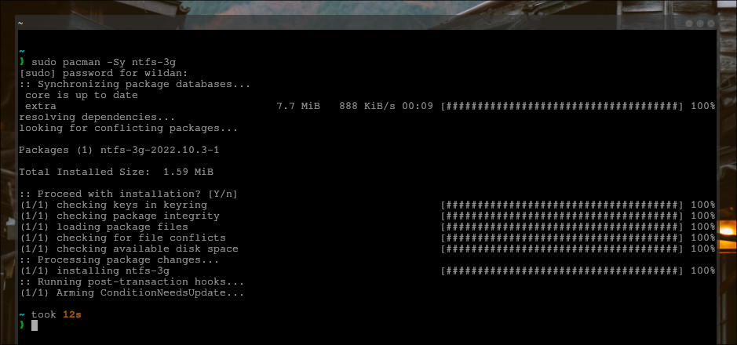
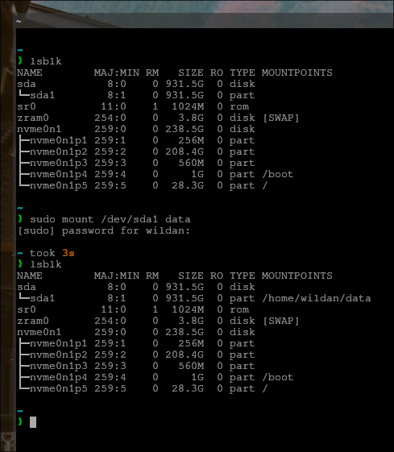

## Introduction

Beberapa hari lalu, saya meng-*install* [**Archlinux**](https://archlinux.org/) sebagai *dual boot* dengan Windows di laptop saya. Sebagai informasi, saya memiliki 2 drive utama dalam laptop, yaitu drive 1 (SSD) yang digunakan sebagai tempat menyimpan sistem operasi (Windows & Archlinux) dan drive 2 (HDD) yang digunakan untuk menyimpan data-data lain, seperti dokumen, foto, video, dan lain sebagainya.

Nah, setelah selesai meng-*install* Archlinux, saya ingin mengakses drive 2 (HDD), di sini saya punya 2 opsi cara untuk mengaksesnya, yaitu melalui:
1. File Manager (Thunar).
2. Terminal (Kitty).

Masalahnya adalah, saya tidak dapat mengakses drive 2 (HDD) tersebut, baik via Thunar maupun via Kitty. Berikut buktinya beserta keterangan gagal *mounting*-nya:

**File Manager**: *Not authorized to perform operation.* 

<script src="https://fast.wistia.com/player.js" async></script><script src="https://fast.wistia.com/embed/vsmwelhvam.js" async type="module"></script><style>wistia-player[media-id='vsmwelhvam']:not(:defined) { background: center / contain no-repeat url('https://fast.wistia.com/embed/medias/vsmwelhvam/swatch'); display: block; filter: blur(5px); padding-top:68.44%; }</style> <wistia-player media-id="vsmwelhvam" seo="false" aspect="1.461187214611872"></wistia-player>

**Terminal**: *unknown filesystem type 'ntfs'.*

<script src="https://fast.wistia.com/player.js" async></script><script src="https://fast.wistia.com/embed/puixjhn78r.js" async type="module"></script><style>wistia-player[media-id='puixjhn78r']:not(:defined) { background: center / contain no-repeat url('https://fast.wistia.com/embed/medias/puixjhn78r/swatch'); display: block; filter: blur(5px); padding-top:66.04%; }</style> <wistia-player media-id="puixjhn78r" seo="false" aspect="1.5141955835962144"></wistia-player>

Tentu saja ini menjadi masalah (besar), karena sangat disayangkan, sudah memasang linux sekeren Archlinux, tapi tidak dapat mengakses drive yang berisi data-data penting. Di sinilah saya mulai mengeksplor solusinya...

## Method

Bagaimana cara menyelesaikannya?

Mudah saja, kita ambil cara yang paling sederhana: **"tanya [ChatGPT](https://chatgpt.com/)"**. Berbekel *prompt* yang benar, kita akan mendapatkan jawaban yang relevan dan *to the point*. Berikut adalah *prompt* yang saya gunakan:

```
Saya tidak dapat me-mounting drive HDD di Archlinux via terminal, berikut adalah pesan error-nya:
mount: /home/wildan/data: unknown filesystem type 'ntfs'.
       dmesg(1) may have more information after failed mount system call.

Bagaimana solusinya?
```



Berikut adalah solusi yang ditawarkan oleh ChatGPT[^1]:



## Result and Discussion

Sekarang, mari kita aplikasikan saran dari ChatGPT:   
"meng-*install* paket **`ntfs-3g`**".	

```shell
pacman -Ss ntfs-3g
pacman -Si ntfs-3g
```



Yap, paketnya ada di repo. Mari kita *install*.

```shell
sudo pacman -Sy ntfs-3g
```



Sudah terpasang. 

Sekarang, mari kita coba untuk me-*mounting* kembali drive 2 (HDD)-nya, via Thunar & Terminal.

**Terminal**:

```shell
sudo mount -t ntfs-3g /dev/sda1 /data
```

<script src="https://fast.wistia.com/player.js" async></script><script src="https://fast.wistia.com/embed/g2zwfhopoq.js" async type="module"></script><style>wistia-player[media-id='g2zwfhopoq']:not(:defined) { background: center / contain no-repeat url('https://fast.wistia.com/embed/medias/g2zwfhopoq/swatch'); display: block; filter: blur(5px); padding-top:66.25%; }</style> <wistia-player media-id="g2zwfhopoq" seo="false" aspect="1.509433962264151"></wistia-player>

BERHASIL!

Bahkan, kita tidak perlu menambahkan opsi `-t ntfs-3g`, jadi jika ingin *mounting* drive/partisi NTFS, kita dapat langsung menuliskan perintah langsungnya saja:

```shell
sudo mount /dev/sda1 data
```



**File Manager**:

:::note

**Masih terkendala**.  
Masih dalam perlu peninjauan kembali.  
Beberapa opsi percobaan lain yang dapat dilakukan:
- Mencoba mengakses drive/partisi dari file manager yang lain.
- Membuat entri di /etc/fstab.
- Mencari keterkaitannya dengan pengaturan Thunar.
- Mencari keterkaitannya dengan paket `gvfs`.

:::

Yang jelas, kita sudah dapat mengakses drive 2 (HDD) dengan normal.

## Conclusion

Berikut adalah beberapa kesimpulan artikel ini:
1. Kegagalan *mounting* NTFS di terminal Archlinux disebabkan karena kita belum memiliki paket **`ntfs-3g`** sehingga perlu di-*install* terlebih dahulu.
2. Setelah meng-*install* paket `ntfs-3g`, *mounting* drive / partisi NTFS dapat dilakukan baik dengan menambahkn opsi `-t ntfs-3g` ataupun tidak.

Beberapa catatan artikel ini:
1. Meskipun paket `ntfs-3g` sudah ter-*install*, masih ada kendala tidak dapat mengakses eksternal drive / partisi NTFS via Thunar sehigga masih perlu dilakukan experimen lebih lanjut.


[^1]: https://chatgpt.com/

