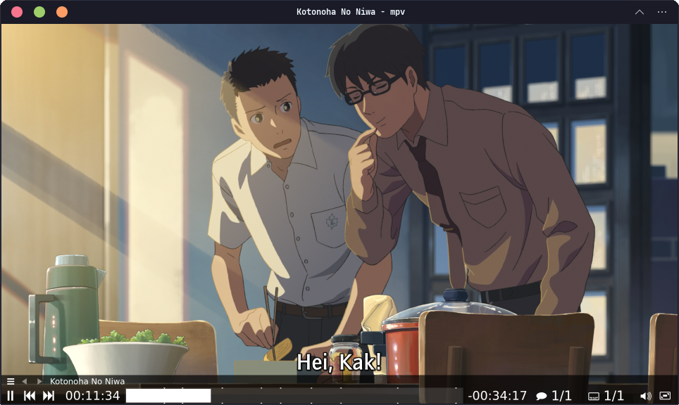

## A Glimpse of MPV



Kita mungkin tidak asing dengan beberapa video player desktop seperti VLC dan GOM Player. Tapi, pernahkah kalian mendengar [**"mpv"**](https://mpv.io/)? Media player ini sudah sejak lama menjadi media player favorit saya, karena beberapa alasan pribadi, misalnya:

1. _**Open source & Free**_. Siapa yang tidak suka dengan produk yang gratis, bukan? 
2. _**Cross-platform**_. MPV dapat diunduh dan digunakan di banyak sistem operasi, seperti Linux, Windows, dan Mac, bahkan Android.
3. _**CLI-based**_. Karena berbasis _command-line_, kita dapat menggunakannya di mode server (alias di [tty](http://localhost:1313/tech/tty/)). 

Selain itu, `mpv` juga _support_ banyak file format, seperti mp4, mkv, mp3, dan masih yang lainnya.

> Jadi, jelas, meskipun terdapat media player lain yang juga open source, seperti VLC misalnya, tapi, `mpv` tetap menjadi MVP bagi saya, karena unggul di poin ketiga di atas, hehe.

Merujuk pada definisi official di website-nya, `mpv` dijelaskan sebagai berikut:[^1]

:::info

"`mpv` is a free (as in freedom) media player for the command line. It supports a wide variety of media file formats, audio and video codecs, and subtitle types."

:::

## Installation

Berikut adalah cara meng-_install_ `mpv` di beberapa sistem operasi Linux:

|       Distro      |                  Command                           |
|       ---         |                   ---                              |
| **Debian/Ubuntu** | **`sudo apt install mpv`**                         |
| **Arch Linux**    | **`sudo pacman -Sy mpv`**                          |
| **Fedora**        | **`sudo dnf install mpv`**                         |
| **Opensuse**      | **`sudo zypper install mpv`**                      |

:::note

**NixOS:**  
Masukkan baris berikut di file konfigurasi (`/etc/nixos/configuration.nix`):

```nix title="nix"
  environment.systemPackages = [
    pkgs.mpv
  ];
```

Atau jika menggunakan `nix-shell`:

```shell
nix-shell -p mpv
```

:::

Repo Github resmi `mpv` dapat dikunjungi di sini:

::github{repo="mpv-player/mpv"}

## Configuration

Lokasi file konfigurasi `mpv` ada di: `~/.config/mpv/mpv.conf`.

Sebetulnya, ada banyak hal yang dapat kita konfigurasi, tentu disesuaikan dengan preferensi masing-masing. Misalnya, kita dapat mengatur OSC (On Screen Controller), _subtitle_, font, window size, bahkan pengaturan untuk menggunakan `yt-dlp` juga, dan masih banyak lagi. Dokumentasi ini dapat ditemukan di internet, tentu saja di website resmi `mpv`: 

> **"https://mpv.io/manual/master/"**

[[/tech/yt-dlp]]

Saya sendiri hanya sedikit menggunakan konfigurasi untuk `mpv`:

```shell
script-opts-append=osc-visibility=always
autofit-larger=70%x70%
border=yes

loop-file = inf
# loop-playlist = inf

keep-open
save-position-on-quit=yes
```

:::info

Keterangan:

- `script-opts-append=osc-visibility=always`: memastikan agar OSC selalu tampak.
- `autofit-larger=70%x70%`: membuka jendela `mpv` pertama kali dengan ukuran 70%.
- `border=yes`: mengaktifkan border jendela.
- `loop-file = inf`: kembali memutar file jika sudah selesai.
- `loop-playlist = inf`: kembali ke file awal jika playlist selesai diputar.
- `keep-open`: jendela `mpv` tidak tertutup jika file selesai diputar.
- `save-position-on-quit=yes`: mengingat posisi terakhir video ketika file ditutup.

:::

## Keybinding

_Keybinding_ adalah _shortcut_ yang dapat kita gunakan hanya melalui keyboard di komputer untuk `mpv`. Beberapa _keybinding_ yang biasa saya gunakan adalah sebagai berikut:[^2]

|  No   |   Keybinding    |   Keterangan                  |
| :---: | :---:           | :---                          |
|   1   | p / Space       | Pause/Start                   |              
|   2   | q               | Quit                          |
|   3   | s               | Screenshot                    |
|   4   | Del             | Toggle OSC                    |
|   5   | 9               | Volume Down                   |
|   6   | 0               | Volume Up                     |
|   7   | m               | Mute                          | 
|   8   | f               | Fullscreen                    |
|   9   | i               | Show Info                     |
|  10   | j               | Choose Subtitle               |
|  11   | v               | Toggle Show/Hide Subtitle     |
|  12   | r               | Subtitle Up                   |
|  13   | R               | Subtitle Down                 |
|  14   | o               | Show Progress                 |
|  15   | {               | Speed -1                      |
|  16   | }               | Speed +1                      |
|  17   | →               | Seek 5                        |
|  18   | ←               | Seek -5                       |
|  19   | ↑               | Seek 60                       |
|  20   | ↓               | Seek -60                      |
|  21   | g-m             | Show menu                     |
|  22   | Alt++           | Zoom In                       |
|  23   | Alt+-           | Zoom Out                      |
|  24   | Alt+0           | Set Window Scale 0.5          |
|  25   | Alt+1           | Set Window Scale 1            |
|  26   | Alt+2           | Set Window Scale 2            |

Berikut contoh penggunaan `keybind`-nya:

<script src="https://fast.wistia.com/player.js" async></script><script src="https://fast.wistia.com/embed/9g8p4zqt8i.js" async type="module"></script><style>wistia-player[media-id='9g8p4zqt8i']:not(:defined) { background: center / contain no-repeat url('https://fast.wistia.com/embed/medias/9g8p4zqt8i/swatch'); display: block; filter: blur(5px); padding-top:69.69%; }</style> <wistia-player media-id="9g8p4zqt8i" seo="false" aspect="1.4349775784753362"></wistia-player>

> Untuk menampilkan keyboard keystroke, saya menggunakan `screenkey`.

## Usage

Berikut adalah beberapa contoh cara menggunakan `mpv`:[^3]

1. Memutar video / audio

Normalnya, penggunaan `mpv` dari terminal sangat sederhana, yaitu dengan perintah:

```shell
mpv video.mp4
```

2. Memutar video Youtube

Jika ingin, kita juga dapat menonton video Youtube dengan `mpv`:

```shell
mpv https://www.youtube.com/watch?v=udDIkl6z8X0
```

3. Memutar video dengan _subtitle_

Jika kita ingin memutar video dengan subtitle terpisah, maka gunakan perintah:

```shell
mpv video.mp4 --sub-file=subtitle.srt
```


[^1]: https://mpv.io/
[^2]: https://mpv.io/manual/master/ 
[^3]: https://bandithijo.dev/blog/mpv-bukan-video-player-biasa