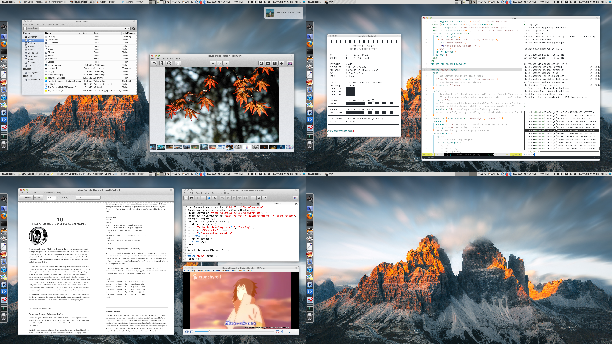

Merujuk ke _repository official_-nya gi [Github](https://github.com/bluesabre/mugshot), **Mugshot** adalah sebuah program linux yang didesain untuk meng-_update_ user personal profile di sistem linux kita, salah satunya yang juga akan saya demonstrasikan di artikel ini adalah meng-_update_ foto profil. 

Fyi, saya men-demonstrasikan tutorial ini di **Arch linux** dengan Desktop Environment XFCE.

## Instalasi

Untuk meng-_install_ mugshot cukup standar, kita dapat menggunakan _package manager_ yang ada di masing-masing distro:

|       Distro      |                  Command                      |
|       ---         |                   ---                         |
| **Debian/Ubuntu** | **`sudo apt install mugshot`**                |
| **Arch Linux**    | **`sudo yay -Sy mugshot`**                    |
| **Opensuse**      | **`sudo zypper install mugshot`**             |

Catatan:
1. _Package_ mugshot di Archlinux tidak tersedia di repositori utama, jadi harus di-install dari AUR.
2. _Package_ mugshot di Fedora juga tidak tersedia di repositori utama, jadi salah satu cara instalasinya melalui flatpak.

## Penggunaan

1. Buka program mugshot, bisa dari _application launcher_, atau via terminal.
2. Klik bagian foto, klik **Browse**.
3. Pilih file gambar yang ingin dijadikan foto profil.
4. Pilih Apply untuk menyelesaikan.

 <wistia-player media-id="wsdl9jwkdp" seo="false" aspect="1.791044776119403"></wistia-player>

Sekian.  
Sampai jumpa di artikel saya yang lain!

---

Btw, artikel ini dibuat via **Archlinux** XFCE dengan tema OSX.

