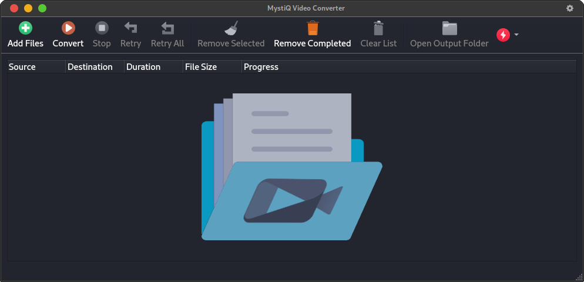
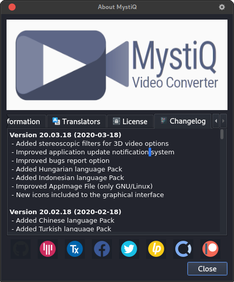
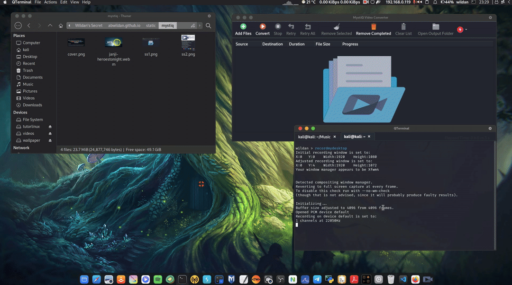

Hola! 

Kali ini saya akan berbagi satu *tools* yang secara fungsi mungkin 11-12 dengan FFmpeg, tapi dia punya tampilan yang lebih *user-friendly*, nama *tools*-nya adalah **Mystiq**. Secara sederhana, Mystiq adalah *media converter* yang juga merupakan GUI (*Graphical User Interface*) dari FFmpeg[^1].

Kurang lebih, berikut adalah tampilan atau interface dari Mystiq.

Versi mystiq yang saya install adalah versi 20.03.18 karena dirilis pada tahun, bulan, dan tanggal 2020-03-18.

Kehadiran aplikasi ini juga memudahkan kita untuk melakukan konversi file. Beberapa file yang dapat kita konversi melalui *tools* mystiq ini antara lain ada

(1) 3G2, (2) 3GP, (3) AC3, (4) AIFF, (5) ASF, (6) AU, (7) AVI, (8) DC, (9) VALC, (10) FLV, (11) M4A, (12) MKV, (13) MOV, (14) MP2, (15) MP3, (16) MP4, (17) MPG, (18) OGG, (19) OGV, (20) RM, (21) WAV, (22) WEBM, (23) WMA, (24) WMV.

Tapi, sayangnya, dari 24 jenis file tersebut, belum ada GIF. Padahal, sebagai alasan personal, saya lebih banyak membutuhkan format file GIF, terutama untuk kepentingan membuat konten di personal blog saya di HUGO ini. 

Mengapa demikian? Karena sepanjang yang saya ketahui, memang, di *static-site* seperti Hugo ini, kita terbatas hanya dapat melampirkan file dengan format gambar saja. Jika kita ingin melampirkan file video, kita perlu mengunggahnya terlebih dahulu ke server lain, misalnya Google Drive atau Youtube, untuk kemudian baru *link* atau tautannya dilampirkan menggunakan *shortcode*. Selain itu, saya juga biasa melakukan konversi file video ke GIF menggunakan FFmpeg. Jadi, jika Mystiq adalah aplikasi berbasis grafis dari  FFmpeg, harusnya format GIF juga di-*cover* oleh aplikasi ini...

*But, anyway*, itu saja menurut saya kekurangan dari aplikasi Mystiq ini sudah cukup untuk membantu *daily activity* kita yang lain, misalnya mengkonversi file video musik dari Youtube ke file audio.

# Instalasi
Untuk instalasi Mystiq, dapat dilakukan di banyak distro, seperti

|   **Distro**  |   **Instalasi**               |   **Repo**    |
|       ---     |       ---                     |      ---      | 
|   Debian*     |   `sudo apt install mystiq`   |   https://packages.debian.org/search?searchon=contents&keywords=mystiq&mode=path&suite=stable&arch=any       |
|   Arch*       |   `sudo yay -S mystiq`        |   https://aur.archlinux.org/packages/mystiq   |
|   OpenSUSE    |   `sudo zypper in Mystiq`     |   https://software.opensuse.org/package/MystiQ?search_term=mystiq     |

Keterangan:

[*] Debian dan turunannya (termasuk Ubuntu, dkk) 

[*] Archlinux tidak menyediakan Mystiq dalam repo utamanya, jadi kita perlu menggunakan AUR *herlper*, seperti yay, paru, pakku, dkk[^2].

# Demo Konversi File Video (webm) ke Audio (mp3)
Instalasi selesai, sekarang, saya akan mendemokan proses konversi file video dengan format webm ke file audio dengan format mp3 menggunakan Mystiq.

Langkah-langkahnya, setidaknya secara umum ada 3:
1. Memilih file yang akan dikonversi
2. Memilih jenis atau tipe file akhir
3. Melakukan proses konversi

Berikut adalah rekaman saya melakukan konversi file video (webm) ke file audio (mp3) dalam bentuk GIF (yang tidak saya lakukan dengan Mystiq, tapi dengan FFmpeg, hehe)...

Oke, sekian dulu tutorial Mystiq kali ini.

Terima kasih sudah membaca, semoga membantu!

Sampai jumpa di tutorial yang lain :)

[^1]: https://github.com/swl-x/MystiQ
[^2]: https://wiki.archlinux.org/title/AUR_helpers