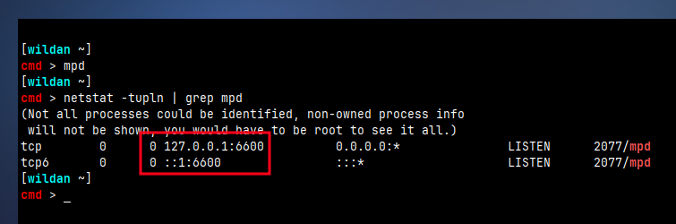
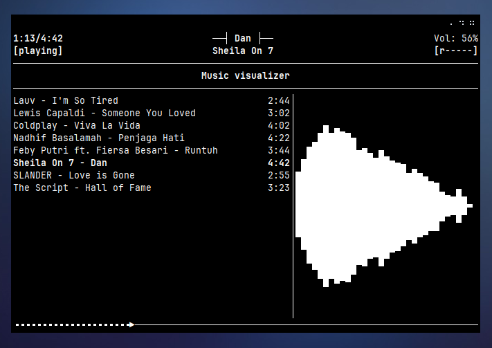
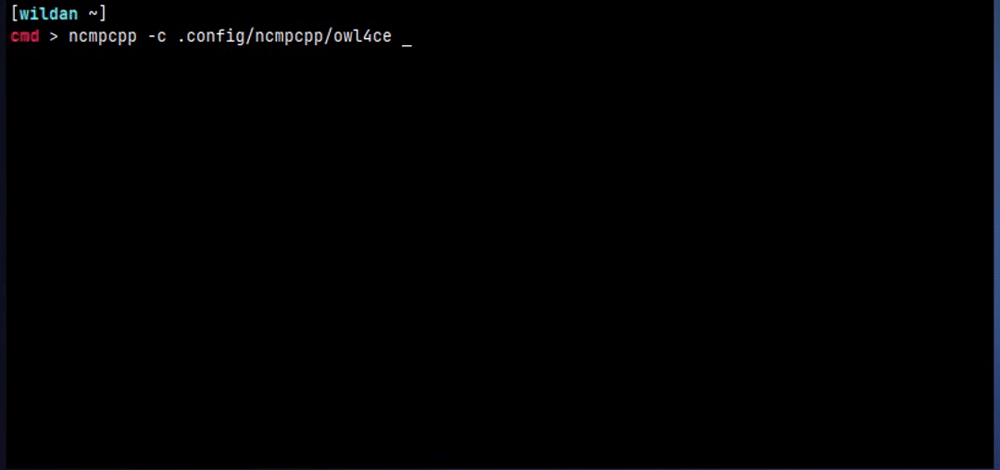

## Intro

***[NCurses Music Player Client Plus Plus](https://github.com../images/ncmpcpp/ncmpcpp)*** adalah nama panjang dari NCMPCPP. Ya, seperti namanya, ncmpcpp adalah *music player* berbasis mpd. MPD? Iya, Music Player Daemon alias MPD adalah pemutar musik. Dengan kata lain, mpd adalah server *music player* dan ncmpcpp adalah salah satu *music player* client-nya.  

Sengaja saya beri judul "Classic" dan "Nostalgic" untuk ncmpcpp karena memang, ncmpcpp tidak bisa dibandingkan dengan aplikasi atau software-software pemutar musik yang ada saat ini, seperti Spotify. Tidak bisa dibandingkan karena ncmpcpp adalah *music player offline* berbasis cli yang artinya berjalan di terminal dan tidak memiliki tampilan grafis sementara music player seperti Spotify sudah jelas bahkan bukan hanya sekadar *music player*, tapi platform musik dan podcast dalam jaringan (*online*).

Tapi, tidak bisa dibandingkan bukan berarti lebih buruk. Justru, sifat "Classic" dan "Nostalgic"-nya itulah yang memberikan nilai tambah untuk ncmpcpp (walaupun sebetulnya, Spotify juga punya software berbasis cli-nya sendiri (spotify-tui) sehingga bisa menghapus seluruh claim saya untuk ncmpcpp barusan :v). So, di artikel ini, saya akan berbagi cara memasang, mengkonfigurasi, dan menjalankan mpd + ncmpcpp sebagai *music player*.

## Install

Instalasinya:
| No  |           Distro                                                                  |             Install                       |
|----:|:----------------------------------------------------------------------------------|:-----------------------------------------:|
|  1  |   [**Debian/Ubuntu**](https://packages.debian.org/bookworm/ncmpcpp)               |  `sudo apt install ncmpcpp mpd mpc`       |
|  2  |   [**Arch**](https://archlinux.org/packages/extra/x86_64../images/ncmpcpp/)                |  `sudo pacman -S ncmpcpp mpd mpc`         |
|  3  |   [**OpenSuse**](https://software.opensuse.org/package/ncmpcpp)                   |  `sudo zypper in ncmpcpp mpd mpc`         |
|  4  |   [**Fedora**](https://packages.fedoraproject.org/pkgs../images/ncmpcpp/ncmpcpp/)          |  `sudo dnf install ncmpcpp mpd mpc`       |

> **Note:** `mpc` adalah command line client untuk MPD, jadi kita perlu meng-install-nya karena nanti juga akan digunakan untuk menampilkan notifikasi.

## Configuration

Pertama, kita buat dua direktori untuk `mpd` dan `ncmpcpp`:
```shell
mkdir -p ~/.config/{mpd,ncmpcpp}
```

### MPD Config

Setelah itu, kita isikan beberapa file dan folder yang dibutuhkan oleh mpd, termasuk juga file konfigurasinya: `mpd.conf`:
```shell
cd ~/.config/mpd
touch database log pid state sticker.sql mpd.conf && mkdir lyrics playlists
```

Berikut adalah isi file `mpd.conf` milik saya[^1]:
```shell
bind_to_address     "localhost"
port                "6600"
log_level           "default"
input {
  plugin            "curl"
}
audio_output {
  type              "pulse"
  name              "My Pulse Output"
  options           "dev=dmixer"
}
audio_output {
  type              "fifo"
  name              "My fifo output"
  path              "/tmp/mpd.fifo"
  format            "44100:16:2"
}
db_file             "~/.config/mpd/database"
log_file            "~/.config/mpd/log"
music_directory     "~/Music"
playlist_directory  "~/.config/mpd/playlists"
pid_file            "~/.config/mpd/pid"
state_file          "~/.config/mpd/state"
sticker_file        "~/.config/mpd/sticker.sql"
```

Untuk memastikan file konfigurasi kita sudah sesuai, kita bisa jalankan `mpd`:
```shell
mpd 
```

Kalau muncul pesan berikut:
```log
decoder: Decoder plugin 'wildmidi' is unavailable: configuration file does not exist: /etc/timidity/timidity.cfg
```
Kita hanya perlu membuat file `timidity.cfg` tersebut:
```shell
sudo mkdir /etc/timidity
sudo touch /etc/timidity/timidity.cfg
```
Kalau sudah, kita bisa menjalankan ulang mpd dan harusnya tidak ada pesan apapun jika mpd sudah berjalan dengan baik.
```shell
pkill mpd
mpd
```

Kita juga bisa memastikan mpd sudah berjalan di port 6600 dengan mengetikkan perintah berikut:
```shell
netstat -tupln | grep mpd
```


### NCMPCPP Config

Beralih ke direktori `~/.config/ncmpcpp`, kita akan membuat file konfigurasi ncmpcpp, yaitu file `config`. 
```shell
cd ~/.config/ncmpcpp
touch config
```

Berikut adalah isi file konfigurasi ncmpcpp yang saya miliki[^2]:
```shell
ncmpcpp_directory = ~/.config/ncmpcpp
lyrics_directory = ~/.config/mpd/lyrics
mpd_music_dir = ~/Music

screen_switcher_mode = playlist, visualizer
startup_slave_screen = visualizer
startup_slave_screen_focus = yes
locked_screen_width_part = 60
user_interface = alternative

visualizer_data_source = /tmp/mpd.fifo
visualizer_in_stereo = yes
visualizer_type = spectrum
visualizer_look = "▋▋"
visualizer_spectrum_smooth_look = yes

progressbar_look = "╺▶"

enable_window_title = yes
song_status_format = {{`%a{ "%b"{ (%y)}}` - }{%t}}|{%f}
playlist_display_mode = "classic"
playlist_editor_display_mode = classic
colors_enabled = no

execute_on_song_change = notify-send "Now Playing" "$(mpc --format '%title% \n%artist%' current)" --icon="/home/wildan/.icons/buuf-nestort/apps/spotify.png"

## For a song format you can use:
## %l - length
## %f - filename
## %D - directory
## %a - artist
## %A - album artist
## %t - title
## %b - album
## %y - date
## %n - track number (01/12 -> 01)
## %N - full track info (01/12 -> 01/12)
## %g - genre
## %c - composer
## %p - performer
## %d - disc
## %C - comment
## %P - priority
## $R - begin right alignment
```

> **Note:** `notify-send` adalah sebuah program mengirimkan notifikasi ke desktop. Supaya bisa menggunakan `notify-send`, kita perlu menginstallnya terlebih dahulu:
>```shell
>sudo pacman -Sy libnotify
>```

Atau kalian juga bisa menggunakan file konfigurasi default dari ncmpcpp, jadi bisa custom sendiri interface ncmpcpp-nya:
```shell 
cp /usr/share/doc../images/ncmpcpp/config ~/.config/ncmpcpp
```
Berikut adalah tampilan ncmpcpp saya menggunakan config di atas:


Kalian juga bisa menggunakan konfigurasi ncmpcpp milik owl4ce: https://github.com/owl4ce/dotfiles/blob/ng/.config../images/ncmpcpp/main.config
```shell
# User's ncmpcpp main configuration.
# https://github.com/owl4ce/dotfiles

# MPD
# ---
mpd_host = "127.0.0.1"
mpd_port = "6600"
mpd_crossfade_time = "2"

# VISUALIZER
# ---
visualizer_data_source = "/tmp/mpd.fifo"
visualizer_output_name = "Visualizer"
visualizer_in_stereo = "no"
visualizer_fps = "60"
visualizer_type = "wave"
visualizer_look = "∗▐"
visualizer_color = "199,200,201,202,166,130,94,58,22"
visualizer_spectrum_smooth_look = "yes"

# GENERAL
# ---
lyrics_directory = "~/.config../images/ncmpcpp/lyrics"
connected_message_on_startup = "yes"
cyclic_scrolling = "yes"
mouse_support = "yes"
mouse_list_scroll_whole_page = "yes"
lines_scrolled = "1"
message_delay_time = "1"
playlist_shorten_total_times = "yes"
playlist_display_mode = "columns"
browser_display_mode = "columns"
search_engine_display_mode = "columns"
playlist_editor_display_mode = "columns"
autocenter_mode = "yes"
centered_cursor = "yes"
user_interface = "classic"
follow_now_playing_lyrics = "yes"
locked_screen_width_part = "50"
ask_for_locked_screen_width_part = "yes"
display_bitrate = "no"
external_editor = "nano"
main_window_color = "default"
startup_screen = "playlist"

# PROGRESS BAR
# ---
progressbar_look = "━━━"
#progressbar_look = "▃▃▃"
progressbar_elapsed_color = "5"
progressbar_color = "black"

# UI VISIBILITY
# ---
header_visibility = "no"
statusbar_visibility = "yes"
titles_visibility = "yes"
enable_window_title = "yes"

# COLORS
# ---
statusbar_color = "white"
color1 = "white"
color2 = "blue"

# UI APPEARANCE
# ---
now_playing_prefix = "$b$2$7 "
now_playing_suffix = "  $/b$8"
current_item_prefix = "$b$7$/b$3 "
current_item_suffix = "  $8"

song_columns_list_format = "(50)[]{t|fr:Title} (0)[magenta]{a}"

song_list_format = " {%t $R   $8%a$8}|{%f $R   $8%l$8} $8"

song_status_format = "$b$6$7[$8      $7]$6 $2 $7{$8 %b }|{$8 %t }|{$8 %f }$7 $8"

song_window_title_format = "Now Playing .."
```

Kurang lebih nanti hasilnya akan seperti ini:


## NCMPCPP Keybindings

Beberapa *shortcut* yang bisa kalian gunakan untuk menampilkan playlist, music visualizer, jam, dan yang lainnya adalah sebagai berikut[^1]:

| Keybind       | Function                       |
|---------------|--------------------------------|
| **`1`**       | Menampilkan playlist saat ini  |
| **`2`**       | Filesystem browser             |
| **`3`**       | Pencarian dalam databases      |
| **`4`**       | Pustaka musik                  |
| **`5`**       | Playlist editor                |
| **`6`**       | Tag editor                     |
| **`7`**       | Output selector                |
| **`8`**       | Music visualizer               |
| **`=`**       | Jam dinding                    |
| **`F1`**      | Help                           |

Beberapa **shortcut** lainnya[^1]:

| Keybind | Function                                               |
|---------|--------------------------------------------------------|
| **q**   | Keluar                                                 |
| **f**   | Seek forward                                           |
| **b**   | Seek backward                                          |
| **\**   | Mengganti tampilan klasik/alternatif                   |
| **#**   | Menampilkan bitrate pada lagu                          |
| **i**   | Menampilkan info lagu                                  |
| **I**   | Menampilkan info artis (tersimpan pada file ~/.ncmpcpp/artists/ARTIST.txt) |
| **l**   | Menampilkan lirik untuk lagu yang sedang diputar       |
| **L**   | Mencari lirik lagi yang terdapat di database           |
| **>**   | Lagu selanjutnya                                       |
| **<**   | Lagu sebelumnya                                        |
| **p**   | Play/Pause                                             |
| **+**   | Menambahkan volume                                     |
| **-**   | Mengurangi volume                                      | 
| **F1**  | Menampilkan keybinding ncmpcpp                         |

Cheatsheet ncmpcpp bisa dilihat di sini: [ncmpcpp cheatsheet](https://pkgbuild.com/~jelle../images/ncmpcpp/)[^3].


[^1]: https://imam.digmi.id/post/pemutar-musik-dengan-ncmpcpp/
[^2]: http://dotshare.it/category/mpd../images/ncmpcpp/
[^3]: https://pkgbuild.com/~jelle../images/ncmpcpp/