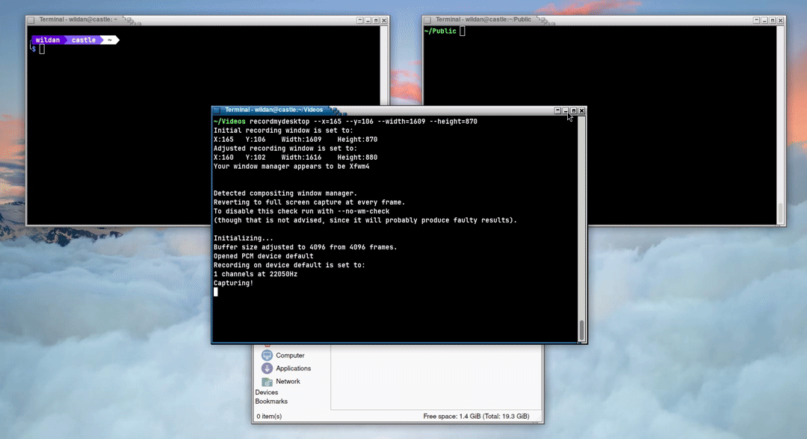

Saya biasa menggunakan **scp** dan *simple webserver* seperti yang disediakan oleh python jika ingin memindahkan satu atau lebih file dari sebuah mesin linux ke mesin linux lainnya (atau windows). Tapi, baru-baru ini saya lihat tutorial singkat di Youtube untuk men-*transfer* file dengan cara yang lebih efektif, yaitu menggunakan **netcat**. Saya sebut sebagai cara tersimpel setidaknya karena 3 alasan:
- Paketnya tersedia di semua distro linux
- Instalasinya mudah, dan
- Penggunaannya relatif lebih mudah dan lebih praktis dibanding cara lainnya.

## Instalasi

|       Distro      |                  Command                      |
|       ---         |                   ---                         |
| **Debian/Ubuntu** | **`sudo apt install netcat-traditional`**     |
| **Arch Linux**    | **`sudo pacman -Sy gnu-netcat`**              |
| **Opensuse**      | **`sudo zypper install gnu-netcat`**          |
| **Fedora**        | **`sudo dnf install netcat-gnu`**             |

Untuk Windows, *binary* netcat dapat diunduh di url berikut:  
https://nmap.org/download.html#windows.

Berikut ini adalah artikel relevan terkait instalasi netcat di Windows: [How to Install on Windows 10/11](https://medium.com/@bonguides25/how-to-install-netcat-on-windows-10-11-f5be1a185611).

## Demonstrasi

Misalnya, saya ingin men-*transfer* sebuah file gambar bernama **skynight.jpg** dari Debian ke Archlinux, maka, langkah-langkahnya:
1. Siapkan *listener* di Arch dengan perintah

```shell
nc -lvnp 1234 > skynight.jpg
```

:::info

1. Perintah **nc -lvnp 1234** artinya komputer melakukan *listening* koneksi di port 1234.
2. **> skynight.jpg** artinya, koneksi dan paket yang masuk nanti akan disimpan ke dalam file bernama skynight.jpg.

:::


2. Transfer file dari Debian ke Arch dengan perintah

```shell
nc $IP 1234 -w 1 < skynight.jpg
```

:::info

1. Perintah **nc $IP 1234** artinya komputer melakukan koneksi ke *ip address* yang ditentukan di port 1234.
2. **-w 1** memberikan *timeout* 1 detik, artinya koneksi akan ditutup setelah terhubung selama 1 detik.
3. **< skynight.jpg** artinya, paket yang dikirim adalah file bernama skynight.jpg.

:::

Kemudian, kita bisa memastikan file yang di-*transfer* tersebut (skynight.jpg) sudah terkirim dengan baik dengan mengecek *integrity file*-nya melalui perintah berikut:
```shell
sha256sum skynight.jpg
```

Berikut adalah demonstrasinya:



Sangat mudah, kita hanya perlu tahu *ip address* mesin yang akan kita kirimkan filenya. Itu saja, tidak perlu mengkonfigurasi macam-macam seperti bikin *key pairs* (*private* & *public key*) seperti di ssh / scp misalnya.

Sebetulnya, video Youtube yang menginspirasi artikel ini adalah video short Youtube, tapi karena saya belum tahu cara menginputkan short tersebut di Hugo/HTML, berikut saya lampirkan video tutorial penggantinya:

<iframe width="100%" height="468"
  src="https://www.youtube.com/embed/VK_TiHyX_hY"
  title="netcat tutorial"
  frameborder="0" allowfullscreen>
</iframe>