# Ngrok? 
Ngrok bagi sebagian orang mungkin sudah faniliar karena sering digunakan untuk berbagai kebutuhan. Tapi, bagi yang belum tahu, ngrok secara sederhana dapat 
didefinisikan sebagai aplikasi yang memungkinkan kita untuk mem-*publish* server lokal kita di localhost ke publik dengan aman. Artinya, *service* seperti
misalnya web di localhost (**http**) atau bahkan **SSH** dan **RDP** dapat diakses di luar jaringan secara aman melalui bantuan dari Ngrok ini. Untuk detail teknisnya
sebentar lagi kita akan lihat demonya.

Oiya, untuk *spelling* atau cara baca nama aplikasi ini saya juga tidak terlalu yakin, tapi saya menyebutnya dengan `en-ji-rok`, bukan en-grok apalagi nge-rok.

# Instalasi
Merujuk pada halaman _official_ Ngrok, kita dapat menginstall Ngrok di 
1. Windows
2. Mac OS
3. Linux
4. Docker, dan
5. FreeBSD

Namun, di blog ini, saya hanya akan melampirkan detail instalasi di linux saja karena setidaknya 2 alasan:
- blog ini tidak menjadi terlalu panjang di bagian instalasi, dan
- alasan relevansi, karena saya menginstall dan menjalankan ngrok di (kali) linux.

Jadi, untuk kalian yang menggunakan sistem operasi selain linux (khususnya debian-based distro), silakan merujuk ke halaman official Ngrok di sini:

https://ngrok.com/download

Di halaman official-nya tersebut, dijelaskan secara detail cara melakukan instalasi Ngrok di setiap sistem operasi.

## Instalasi Ngrok di Linux
Kita dapat menginstall Ngrok dengan 3 cara:
1. Via zip file
2. Via apt (*debian-based only*)
3. Via snap

### Via Zip File
Jika ingin menginstall via zip file, kita perlu memilih dan mengunduh file zip-nya terlebih dahulu sesuai dengan arsitektur sistem operasi linux yang kita gunakan.
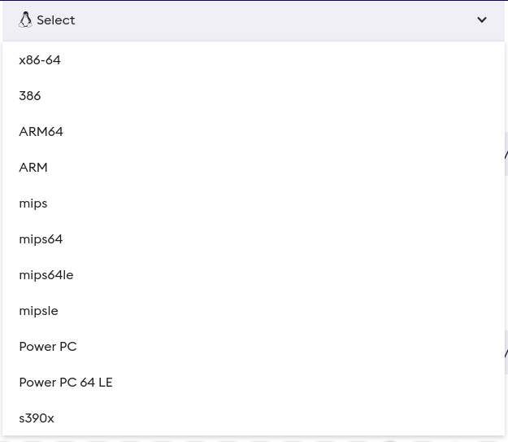

Saya akan mengunduh file **x86-64** karena arsitektur OS saya memang x86_64. 

Untuk mengecek arsitektur komputernya, kita dapat mengetikkan perintah berikut di terminal:
```bash
arch
```
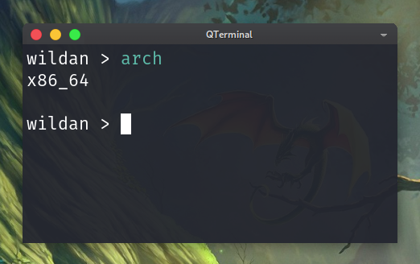

Setelah selesai mengunduh file zip-nya, kita dapat mengetikkan perintah berikut di terminal untuk menginstallnya"
```bash
 sudo tar xvzf ~/Downloads/ngrok-v3-stable-linux-amd64.tgz -C /usr/local/bin
```
Pada dasarnya, perintah tersebut akan mengekstrak file ***binary*** dari file zip tersebut untuk kemudian disimpan di *PATH* `/usr/local/bin`.

Atau kalau kita mau melakukannya secara manual, kira-kira bentuknya sama dengan perintah berikut:
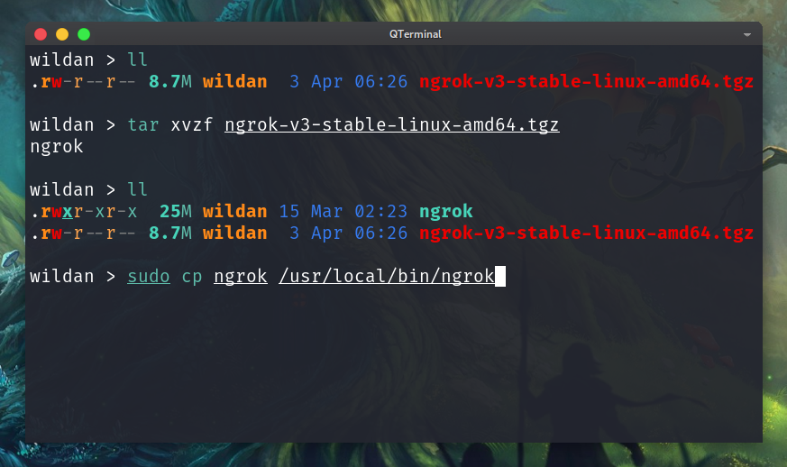

Dengan demikian, Ngrok sudah berhasil kita install di komputer kita via zip file.

### Via apt
Untuk melakukan instalasi via *package manager* (apt), kita dapat mengetikkan perintah berikut di terminal:
```bash
 curl -s https://ngrok-agent.s3.amazonaws.com/ngrok.asc | sudo tee /etc/apt/trusted.gpg.d/ngrok.asc >/dev/null && echo "deb https://ngrok-agent.s3.amazonaws.com buster main" | sudo tee /etc/apt/sources.list.d/ngrok.list && sudo apt update && sudo apt install ngrok
```
Apa yang dilakukan oleh perintah tersebut? Mari kita bedah...
- Perintah `curl -s https://ngrok-agent.s3.amazonaws.com/ngrok.asc | sudo tee /etc/apt/trusted.gpg.d/ngrok.asc >/dev/null` akan 
mengunduh *public key* dari *repository* Ngrok ke /etc/apt/trusted.gpg.d.
- Perintah `echo "deb https://ngrok-agent.s3.amazonaws.com buster main" | sudo tee /etc/apt/sources.list.d/ngrok.list` akan 
menyimpan *repository* Ngrok ke /etc/apt/sources.list.d.
- Perintah `sudo apt update && sudo apt install ngrok` akan mengupdate *repository* aktif di komputer kita dan menginstall Ngrok.

Sampai sini, kita sudah berhasil menginstall Ngrok via apt. 

### Via Snap
Untuk menginstall via snap, kita cukup mengetikkan perintah berikut di terminal:
```bash
snap install ngrok
```
Perlu diketahui, snap juga berfungsi seperti *package manager*, jadi, sebelum dapat menginstall Ngrok via snap, kita terlebih dahulu 
juga perlu menginstall snap.
```bash
sudo apt install snap
```
Ngrok berhasil diinstall via snap.

# Demo
Kita masuk ke bagian inti sekarang, yaitu demonstrasi penggunaan Ngrok untuk keperluan *publish* layanan di localhost ke publik.

Tapi, sebelum kita masuk ke detail demo, kita perlu memastikan bahwa kita sudah menginputkan **token** ke konfigurasi Ngrok, yaitu dengan mengetikkan perintah:
```bash
ngrok config add-authtoken <token>
```
Token tersebut hanya bisa didapatkan jika kita sudan membuat akun di website Ngrok[^1]. Jadi, jika kalian belum punya akun
di Ngrok, silakan buat akun terlebih dahulu. 

Jika sudah membuat akun, token Ngrok dapat ditemukan di menu **Your Authtoken**.
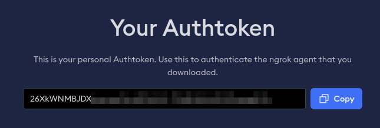

Di sini, saya akan mendemokan penggunaan Ngrok untuk mengekspos 3 *services*, yaitu 
- Web Server 
- SSH, dan
- RDP

## Web Server
Saya akan menggunakan salah satu layanan web server dari Python, yaitu [updog](https://github.com/sc0tfree/updog) di port 8000:
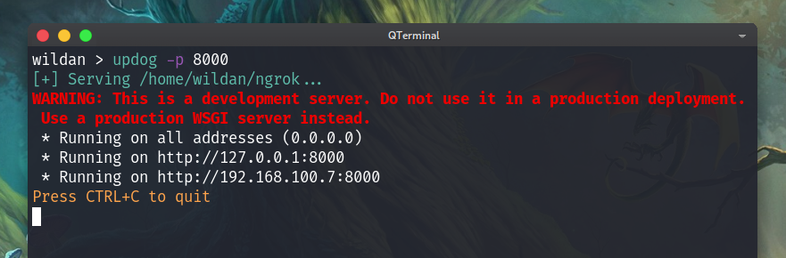

Oke, web server sudah berjalan di localhost:8000 yang menyediakan akses untuk semua file di komputer lokal 
saya, secara spesifik di direktori /home/wildan/ngrok. 
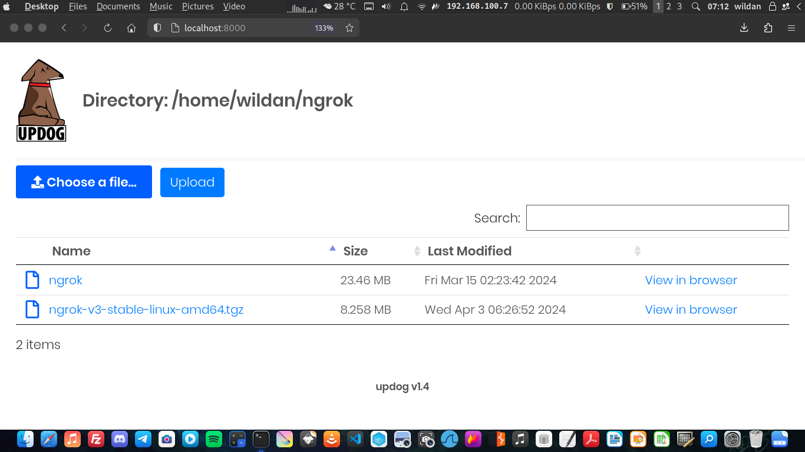

Sekarang, kita akan mengekspos web saya di localhost tersebut dengan ngrok.

Caranya, saya akan mengetikkan perintah berikut di terminal:
```bash
ngrok http 8000
```
Perintah tersebut berarti memintah ngrok untuk menyediakan URL untuk web server di port 8000 di komputer kita.

Setelah mengetikkan perintah tersebut, maka ngrok akan menyediakan URL yang sudah kita minta sebagai berikut:
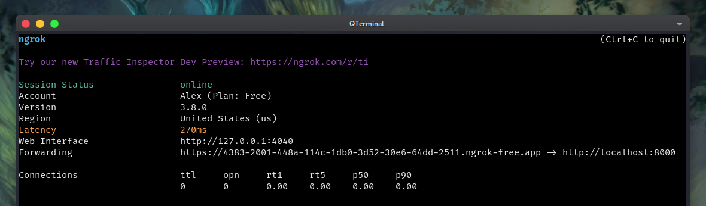

Kalau saya membuka link yang terdapat di bagian ***Forwarding*** tersebut, kita akan menjumpai web server updog
saya sama persis yang berjalan di localhost:

`https://4383-2001-448a-114c-1db0-3d52-30e6-64dd-2511.ngrok-free.app`
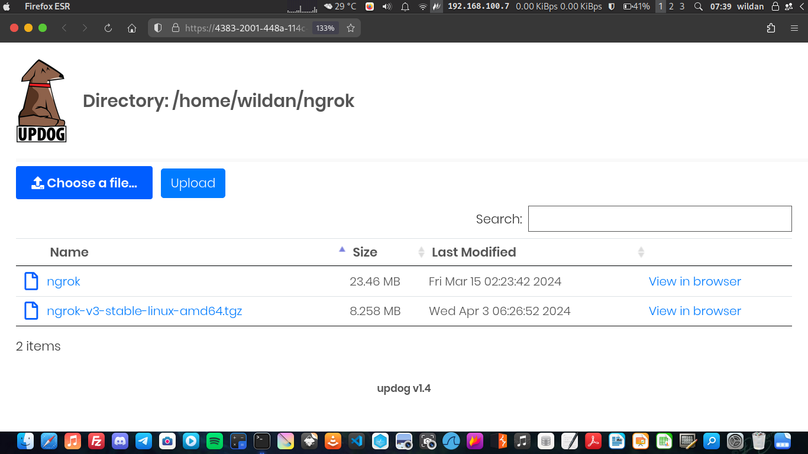

> **Note:** Link tersebut hanya aktif selagi saya masih menjalankan ngrok 

## SSH
Pada skema SSH ini, saya akan menggunakan laptop saya ini sebagai server yang menjalankan SSH (*Secure Shell*) server. 
Kemudian, saya akan mencoba melakukan *remote login* dari URL Ngrok via android (aplikasi [Termius](https://play.google.com/store/apps/details?id=com.server.auditor.ssh.client&hl=en_US&pli=1)).
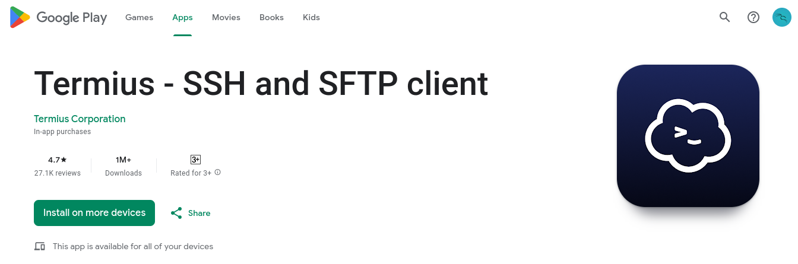

Pertama-tama, saya akan jalankan SSH server terlebih dahulu.
```bash
sudo systemctl start ssh
```
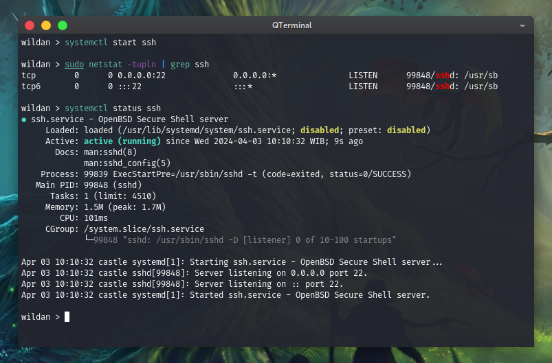

Oke, terpantau SSH server sudah *ready* di port 22.

Sekarang, saya akan buat *tunnel*-nya dengan Ngrok.
```bash
ngrok tcp 22
```
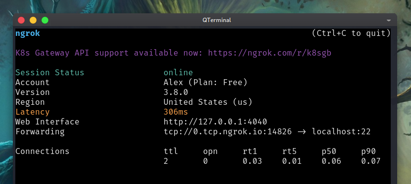

Oke, Ngrok sudah *running* tanpa kendala.

Kemudian, di Termius, saya mengetikkan perintah berikut:

```bash
ssh wildan@0.tcp.ngrok.io:14826
```
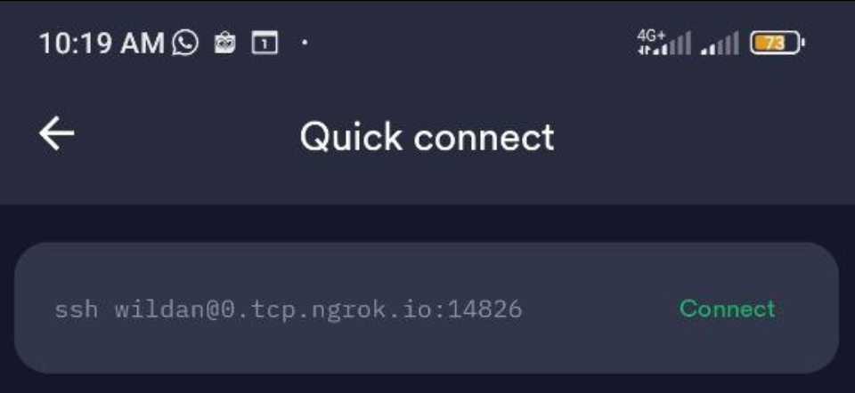
Login via SSH di Termius.

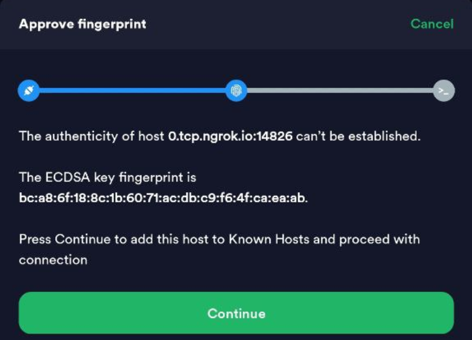
Acc *fingerprint*, kemudian input password, dan ...

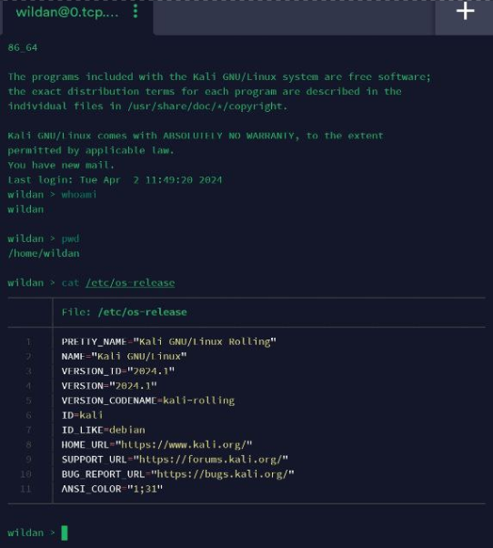
Boom! Berhasil login!

## Via RDP
Di skema RDP (*Remote Desktop Protocol*) ini, saya juga akan menggunakan laptop saya ini sebagai server dan kemudian
client-nya akan menggunakan android (via aplikasi [Remote Desktop](https://play.google.com/store/apps/details?id=com.microsoft.rdc.androidx&hl=en_US).
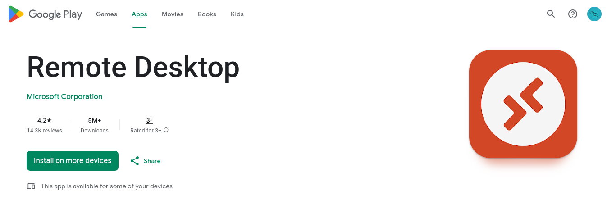

Pertama-tama, saya akan jalankan server RDP-nya terlebih dahulu...
```bash
sudo systemctl start xrdp
```
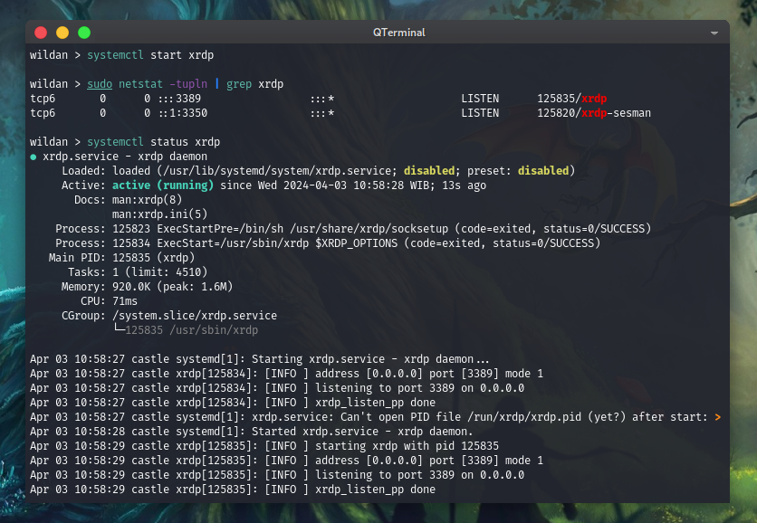

Server RDP sudah berjalan di port 3389.

Sekarang, kita akan jalankan ngrok.

```bash
ngrok tcp 3389
```
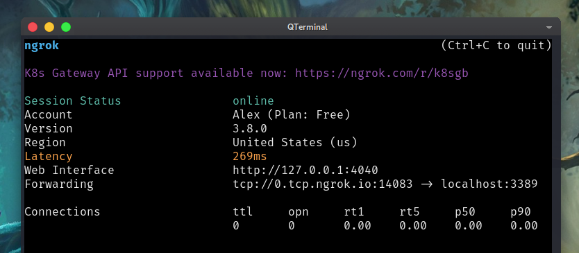
Sip, Ngrok juga sudah *running* dengan baik...

Sekarang, saya akan coba me-*remote* laptop saya ini via RDP di android.
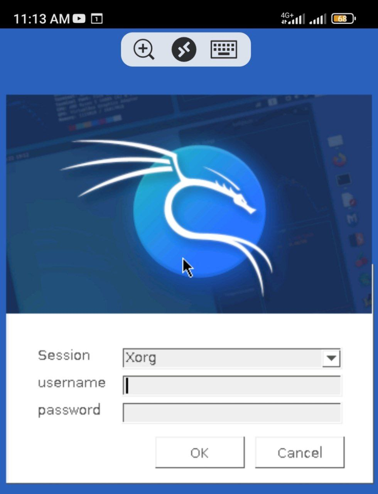

Berhasil RDP! 

> Walaupun belum bisa login (karena entah kenapa saya juga gak paham), tapi setidaknya sudah terbukti bahwa kita 
bisa melakukan akses jarak jauh via RDP menggunakan bantuan Ngrok.

# Poin minus Ngrok
Tentu, Ngrok sebagai aplikasi biasa juga memiliki kekurangan. Beberapa kekurangan Ngrok menurut saya adalah 
- Sangat lamban, sehingga rawan kehilangan koneksi. Tapi, hal ini dapat dipahami karena server Ngrok sendiri memang 
tidak ada di Indonesia. Bisa dilihat di *screenshot* Ngrok pada bagian ***Latency***, ping server-nya berkisar di 200-300 ms.
Sangat lamban! 
- Versi gratisnya terbatas hanya dapat digunakan di 1 service saja. Artinya, jika kita sudah menjalankan Ngrok untuk
menyediakan layanan web, maka kita tidak bisa menggunakannya juga untuk menyediakan layanan di SSH, misalnya, atau di RDP.
Jadi, kalau kita mau mengganti layanan ke SSH, kita perlu mematikan Ngrok yang berjalan di web terlebih dahulu. Atau opsi 
lainnya adalah 

**`upgrade Ngrok ke versi berbayar`**.

Okey, okey, sekian dulu tutorial tentang Ngrok kali ini. 

Sebelum ditutup, satu lagi catatan saya ketika kalian mau menggunakan
Ngrok untuk mengekspos server lokal kalian ke publik adalah mempertimbangkan juga mengenai isu keamanan (*security*). 
Jangan sembarangan mengekspos layanan penting seperti SSH ke sembarang jaringan kecuali 3 hal:
1. kalian sudah mengkonfigurasi *service* tersebut dengan aman (misalnya passwordnya susah dan panjang).
2. kalian sudah memahami resiko mengekspos layanan penting ke publik (misalnya jadi bahan *bruteforce* para ***hacker***.
3. kalian siap menerima konsekuensi atau akibat dari kecerobohan kalian (misalnya laptop kalian kena *hack*.

Demikian, semoga bisa jadi pertimbangan...

Sampai jumpa lagi di blog saya selanjutnya!!!

See you!	


[^1]: https://dashboard.ngrok.com/login
