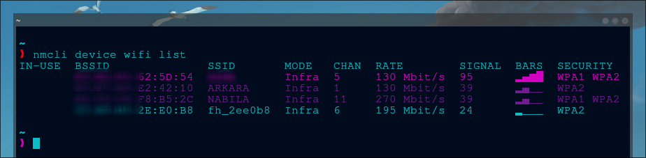
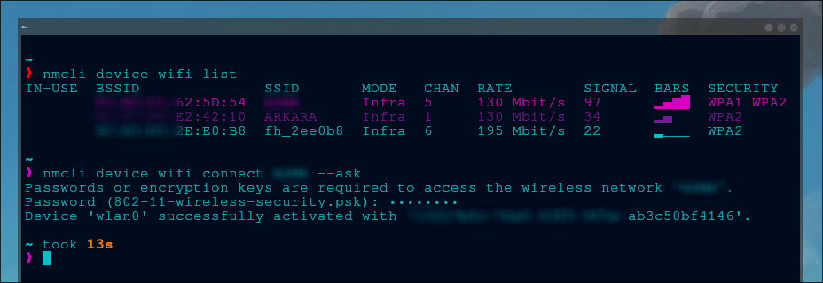
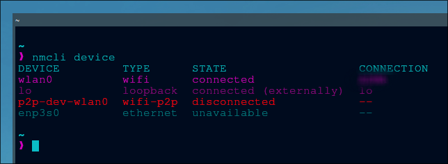
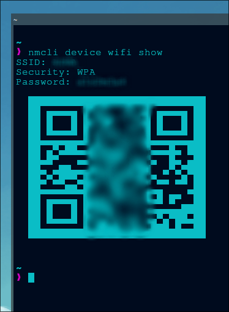
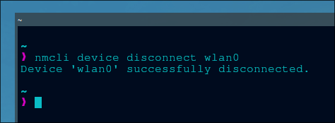

Sebagai pengguna linux, terkadang, ada banyak alasan yang dapat kita sampaikan untuk tidak menggunakan GUI, mulai dari alasan yang paling logis seperti **"pasang GUI di server akan memakan banyak _resource_"** sampai alasan yang paling pragmatis seperti **"malas"**. Hal tersebut memang tidak dapat dipungkiri, sebab linux pada dasarnya sudah sangat _useful_ (dan _powerfull_) bahkan tanpa GUI sekalipun sehingga terkadang, beberapa pekerjaan dapat diselesaikan hanya melalui CLI saja.

Salah satunya yaitu menghubungkan atau mengkoneksikan sistem kita ke jaringan internet, dalam hal ini adalah WiFi (_Wireless Fidelity_). Kita dapat menghubungkan linux ke wifi tanpa perlu GUI karena kita dapat mengkoneksikannya via terminal atau CLI melalui program **`iwctl`** atau **`nmcli`**. Tapi, dalam artikel ini, saya hanya akan mengulas cara menggunakan **`nmcli`** saja.

## Instalasi

Sebetulnya, **`nmcli`** akan sudah ter-_include_ di dalam linux sejak proses instalasi linux itu sendiri di awal. Jadi, kita tidak perlu meng-_install_-nya lagi. Namun, berikut saya lampirkan sebuah paket yang terdapat _nmcli_ di dalamnya:

|       Distro      |                  Command                      |
|       ---         |                   ---                         |
| **Debian/Ubuntu** | **`sudo apt install network-manager`**        |
| **Arch Linux**    | **`sudo pacman -Sy networkmanager`**          |
| **Opensuse**      | **`sudo zypper install networkmanager`**      |
| **Fedora**        | **`sudo dnf install networkmanager`**			|

## Penggunaan

Berikut adalah cara menggunakannya:[^1]

### - Mendaftar wifi yang tersedia

```shell
nmcli device wifi list
```

### - Menghubungkan linux ke jaringan wifi

```shell
nmcli device wifi connect SSID_or_BSSID password 12345
```

### - Menghubungkan jaringan wifi (tanpa memperlihatkan password)

```shell
nmcli device wifi connect SSID_or_BSSID --ask
```

### - Men-_disconnect_ jaringan wifi

```shell
nmcli device disconnect wlan0
```

### - Melihat daftar wifi yang pernah terhubung

```shell
nmcli connection show
```

### - Menampilkan SSID & password (+ barcode) wifi

```shell
nmcli device wifi show
```

### - Menghapus wifi yang pernah terhubung

```shell
nmcli connection delete NAME_OR_UUID
```

### - Melihat daftar dan status _interface_

```shell
nmcli device
```

### - Mematikan wifi

```shell
nmcli radio wifi off
```

## Contoh

Berikut adalah contoh penggunaannya:

1. Mendaftar wifi yang tersedia



2. Menghubungkan wifi 



3. Melihat status wifi



4. Menampilkan SSID, password, dan barcode wifi



5. Men-_disconnect_ wifi




[^1]: https://wiki.archlinux.org/title/NetworkManager
