Halo!
Beberapa pekan lalu, saya sempat memberikan tutorial untuk mendapatkan e-book gratis dengan bot Telegram yang berasal dari situs z-library. Saat tulisan tersebut dibuat, situs utama z-lib di-*banned* oleh FBI karena dianggap menyebarkan buku-buku berbayar tanpa hak izin dari penulisnya. Maka, agar dapat mengakses situs z-lib, kita memerlukan TOR Browser.


Nah, pernahkah kalian penasaran, bagaimana cara meng-*hosting* file yang hanya dapat diakses dengan TOR Browserdan jaringan TOR saja? 

Kali ini, kita akan belajar bagaimana cara meng-*hosting* atau membagikan file yang hanya dapat diakses oleh TOR Browser. Kenapa hanya dapat diakses di TOR Browser saja? Tentu saja karena *url*-nya berakhiran ".onion", jadi kita tidak dapat membukanya di browser default seperti chrome, firefox, safari, dan yang semisal itu.

## Perkenalan Onionshare
Sebenarnya, apa sih onionshare itu?

Onionshare adalah *tools* *open-source* yang dapat membantu kita untuk membagikan file, meng-*hosting* website, dan (bahkan) melakukan *chatting* secara aman dan anonim melalui jaringan TOR.[^1]

Nah, jadi, dengan *tools* atau aplikasi Onionshare ini, kita dapat *sharing & receiving* file, meng-*hosting* website, dan bahkan bisa *chatting* secara anonim juga!

## Instalasi
Nah, sekarang kita akan melakukan instalasi. Saya akan menunjukkan proses install di Linux saja. Jika kalianingin menginstallnya di sistem operasi yang lain (Windows, Mac, atau iOS/Android), silakan baca-baca dan ikuti langkah-langkah yang sudah disediakan secara resmi oleh Onionshare di [sini](https://docs.onionshare.org/2.6/en/install.html). 
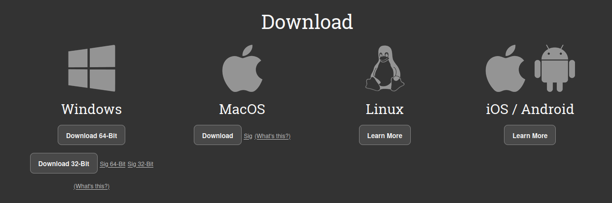

### Langkah 1: Menginstall flatpak (Debian-based Linux)
Flatpak adalah *package manager* untuk menginstall aplikasi dari flathub. Flathub sendiri merupakan wadah untuk mendapatkan aplikasi-aplikasi untuk desktop linux. Jadi, aplikasi-aplikasi yang tidak tersedia di repositori resmi distro linux, kita dapat menginstallnya dari flathub/flatpak. 

Kita akan menginstall flatpak via CLI (*command line interface*)

```bash
sudo apt install flatpak
```

### Langkah 2: Mengunduh paket installer Onionshare 
Setelah selesai menginstall flatpak, kita harus mengunduh paket/installer Onionshare yang tersedia di Flathub. Kunjungi alamat berikut [Onionshare Flathub](https://flathub.org/apps/org.onionshare.OnionShare), kemudian klik install.
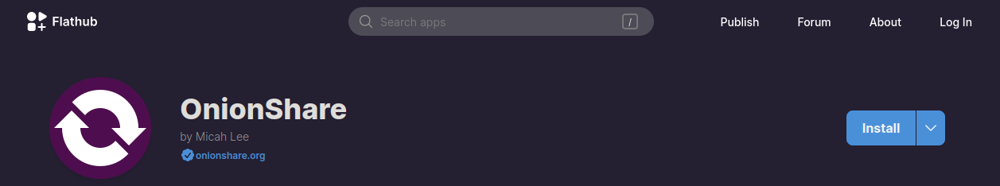

Setelah terunduh, filenya akan nampak dengan ekstensi "flatpakref" seperti berikut:
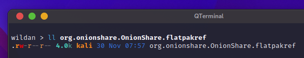

### Langkah 3: Install
Berikutnya, kita tinggal menginstall Onionshare dengan mengetikkan perintah berikut di terminal:

```bash
flatpak install org.onionshare.OnionShare.flatpakref
```
Jika ada pertanyaan-pertanyaan, "Yes"-kan saja, dan kita tinggal menunggu proses instalasinya selesai.
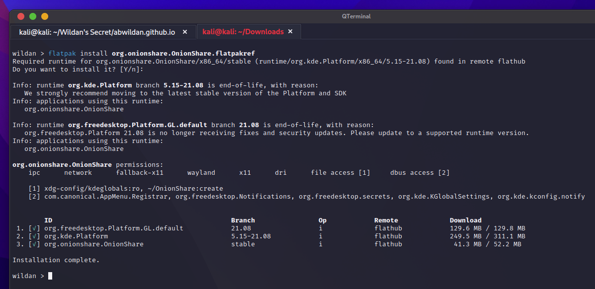

## Penggunaan
Selesai menginstall, saatnya kita mencoba fitur-fitur dari onionshare!

Pertama-tama, kita harus menyambungkan koneksi ke jaringan TOR terlebih dahulu. Jadi, silakan sambungkan koneksi dengan meng-klik tombol "**Connect to Tor**" yang berwarna hijau. Tunggu beberapa saat hingga tersambung.
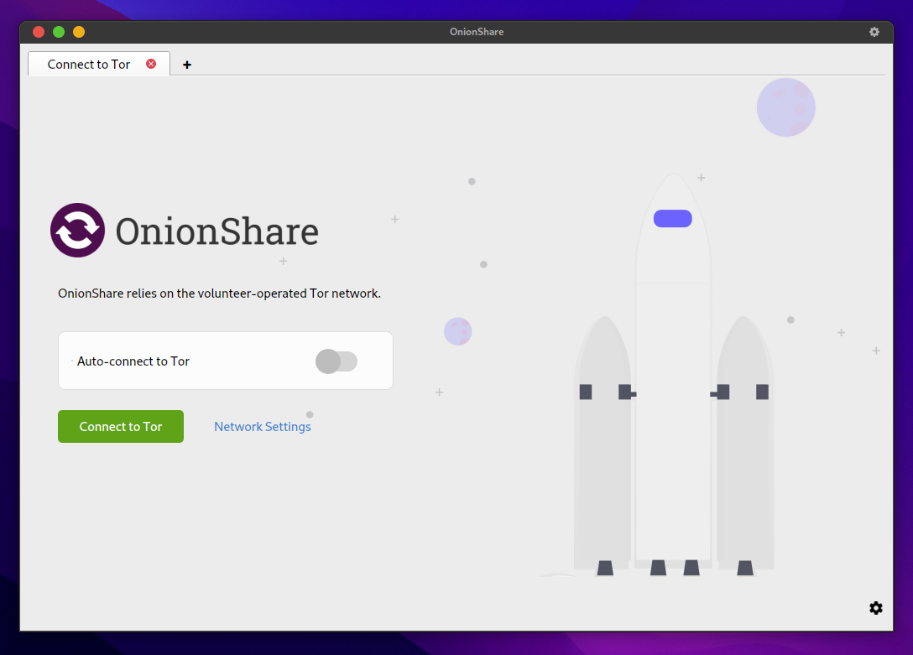

### Fitur 1: Share Files 
Fitur pertama yang akan kita coba adalah fitur *sharing files*. Mula-mula, klik **Start Sharing**
untuk memulai. Kemudian, di sini, saya akan mencoba membagikan dua buah file (file gambar dan video) dan satu folder.
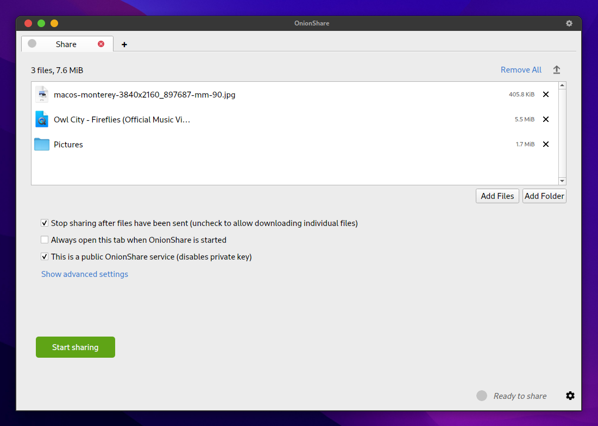

Di bagian bawah, ada 3 checkbox yang dapat kita set untuk mengatur beberapa hal, salah satunya (yang
paling bawah) adalah untuk mengatur mode *sharing* yang kita gunakan (*private/public*). Kalau *public*, berarti nanti penerima *link*-nya tidak memerlukan kunci (*private key*) untuk mengakses ketiga item yang saya bagikan tersebut. Sebaliknya, kalau mode *sharing*-nya *private*, berarti penerima *link*-nya memerlukan *private key* tersebut.

Saya akan set di mode *public*. Selanjutnya, klik **Start Sharing**.

Nanti akan muncul *link* TOR-nya:
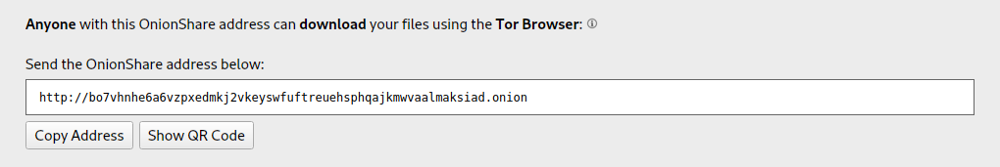
Kita dapat membukanya di TOR Browser. Kalau kalian belum menginstall TOR Browser, kalian bisa menginstall-nya terlebih dahulu. 
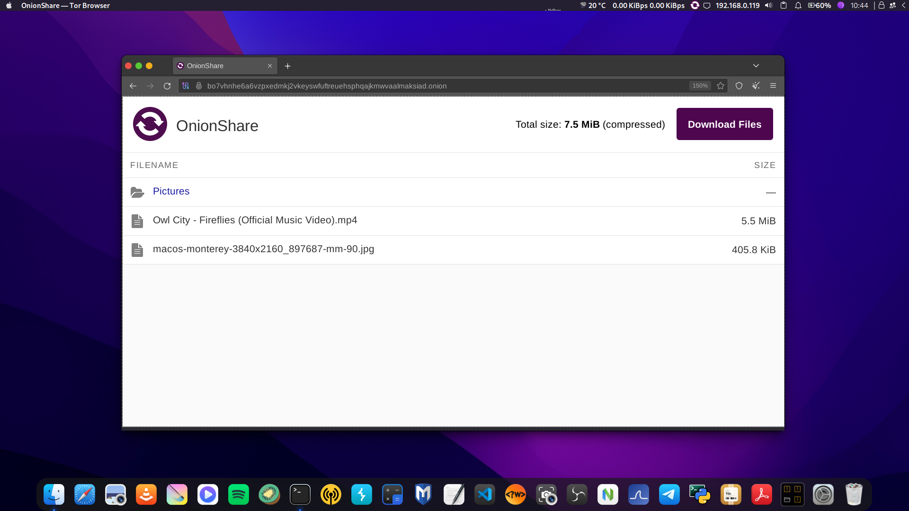

### Fitur 2: Recieve Files
Fitur kedua, selain untuk berbagi file dan folder secara anonim, kita juga dapat menggunakan fitur *Revieve files* ini jika kita ingin menerima *sharing file* dari orang lain.

Beberapa *check box* juga ada di awal jika kita ingin mengatur beberapa hal. Di sini, lagi-lagi saya men-set ke mode *public* ya.
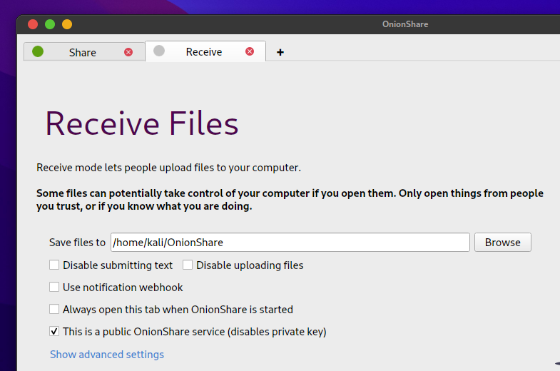
Lalu, klik **Start Revieve Mode**.

Dan kita akan disuguhkan *link* yang memungkinkan orang lain untuk mengupload file/folder-nya ke kita.
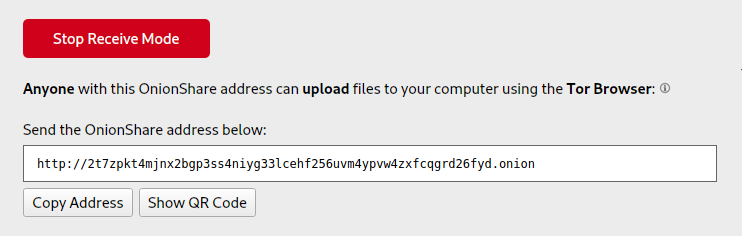
Jadi, *link* tersebut dapat kita berikan kepada orang lain yang ingin membagikan file/folder ke kita secara anonim.
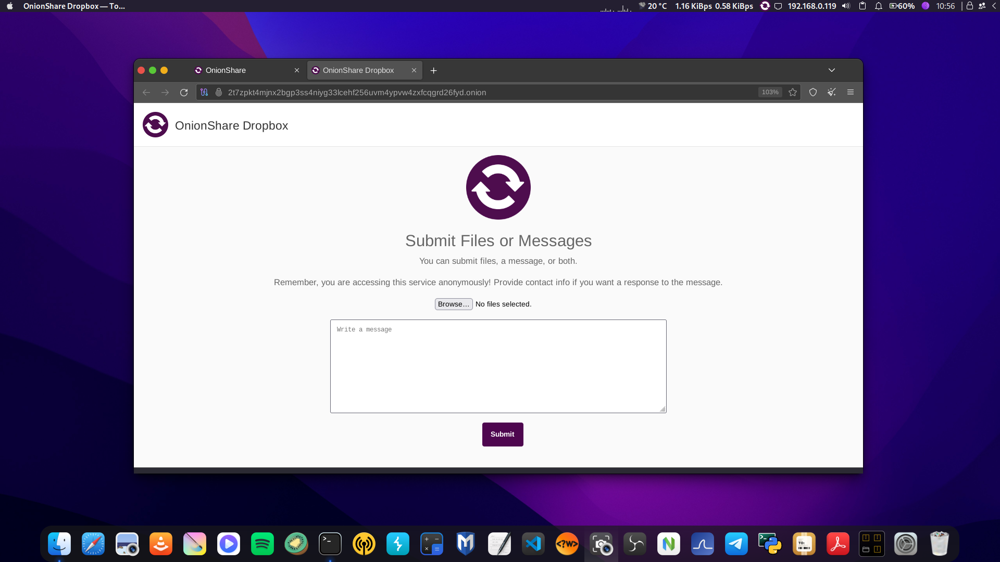

### Fitur 3: Host a Website
Fitur ketiga ini cukup unik karena kita juga bisa meng-hosting website di Onionshare. Setelah meng-klik **Start Hosting**, kita tinggal memilih file/folder yang akan ditampilkan sebagai website. Idealnya, folder/file yang di-share di fitur ini adalah folder/file yang mengandung kode html/css. Untuk itu, sebagai contoh sederhana, saya akan minta 
[**Google Bard**](https://bard.google.com/?utm_source=sem&utm_medium=paid-media&utm_campaign=q4idID_sem7&gclid=EAIaIQobChMIi-3PypHsggMVhKRmAh1Q2AAOEAAYASAAEgJZDPD_BwE&hl=en)
untuk men-generate halaman html sederhana.
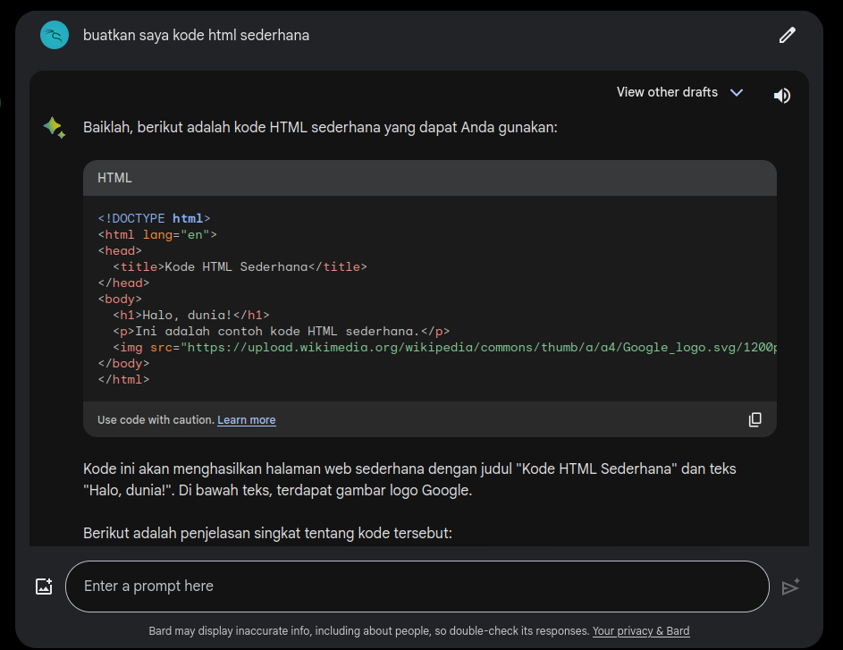

Kemudian, kode tersebut saya copy-paste ke file random yang saya beri nama **index.html**. Selanjutnya, file **index.html** tersebut yang akan saya masukkan dalam fitur Host a Website di Onionshare ini.
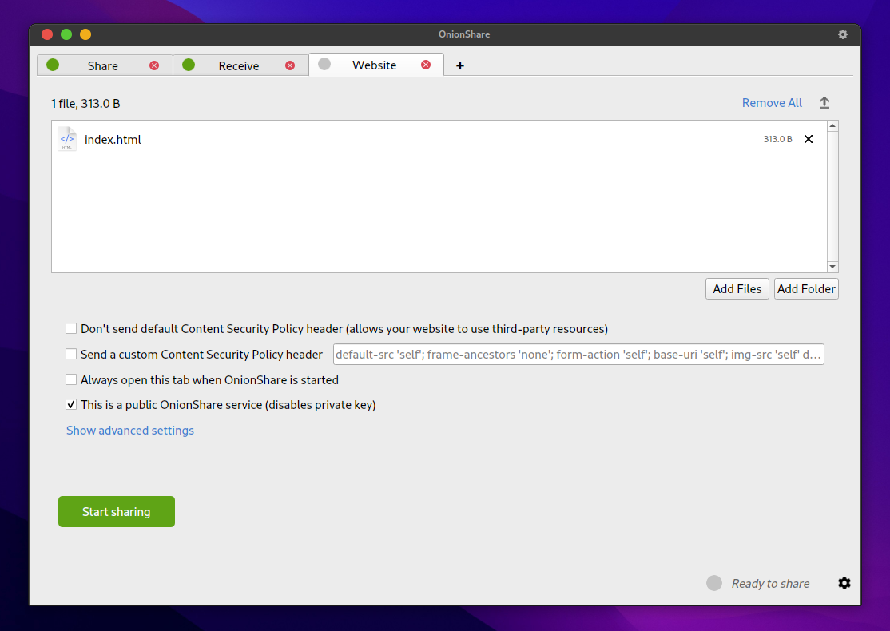
Saya set ke mode *Public*.

Kemudian klik **Start Sharing**.

Seperti biasa, kita akan disuguhi *link* untuk mengakses website tersebut dari TOR Browser.
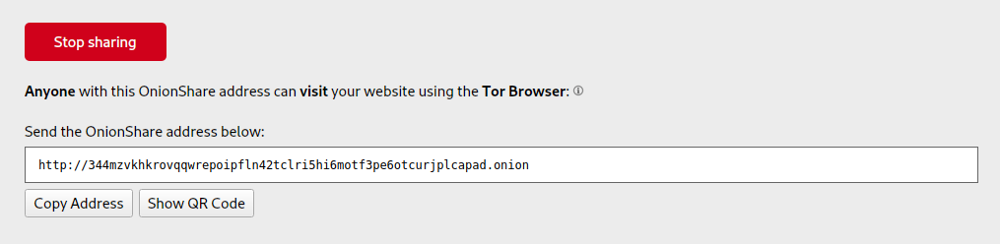

Berikut hasil websitenya...
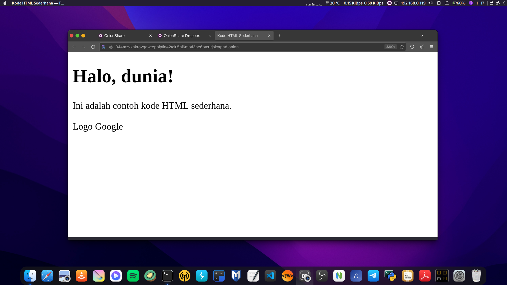

### Fitur 4: Chat Anonymously
Fitur terakhir, yang menurut saya paling unik, kita dapat menggunakan Onionshare untuk *chatting* secara anonim. Keren! Langsung aja klik **Start Chatting** dan lagi, sebagai contoh, saya buat di mode *public*. Lalu klik **Start Chat server**.
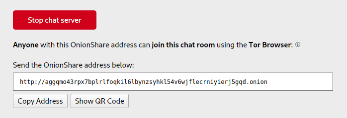

Berikutnya, url tersebut boleh kita bagikan ke orang yang ingin kita ajak *chatting* via jaringan TOR. Oiya, di fitur Chat ini, link tersebut hanya berfungsi sebagai server *chatting* saja ya. Artinya, kalau kita juga ingin ikut berdiskusi dengan teman kita, kita juga perlu membuka *link* tersebut di TOR Browser kita sendiri. Dan karena *link* tersebut berfungsi sebagai server *chat room*, itu juga berarti bahwa kita dapat menyebar *link* itu ke lebih dari satu orang kalau kita ingin chat tersebut ramai orang berdiskusi.
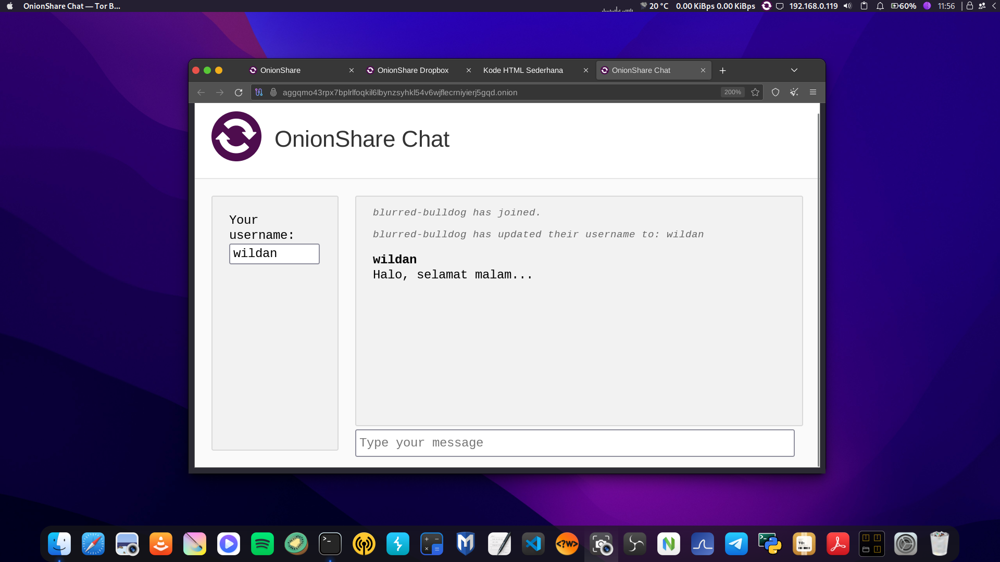

Okeyy, sekian dulu tutorial Onionshare hari ini. Good night!~

[^1]: https://onionshare.org/#
