Dari 1-10 (dengan skala 1: paling tidak cantik dan 10: paling cantik), seberapa cantik tampilan tangkapan layar pada cover artikel ini? *Screenshot* tersebut saya "curi" dari sebuah akun github bernama [addy-dclxvi](https://github.com/addy-dclxvi) pada reponya, [openbox-theme-collection](https://github.com/addy-dclxvi/openbox-theme-collections).

Kalau kalian mengunjungi repo tersebut, kalian akan menemukan keindahan-keindahan sebuah *window manager* bernama openbox di sana. Keindahan yang saya maksud di sini bukan keindahan biasa, tapi **keindahan** yang muncul dari **kesederhanaan** namun mampu memberikan kesan **elegan** dan **nostalgic** (oke, setidaknya ini menurut saya pribadi, hehe). Kita bahas...

1. **Mengapa indah?** Karena openbox adalah salah satu *window manager* di linux yang (sangat) mudah di-kustomisasi sesuka hati penggunanya.
2. **Mengapa sederhana?** Karena openbox adalah salah satu *window manager* yang bisa digunakan oleh "siapapun - pemula maupun sesepuh" dan "dimanapun - di laptop jadul, laptop *high end*, atau *virtual machine* (VM)".
3. **Mengapa elegan dan nostalgic?** Karena openbox memang memungkinkan penggunanya untuk tetap elegan meski sedang bernostalgia, misalnya.

Tiga alasan tersebut menjadi alasan utama openbox sebagai window manager alternatif desktop environment, khususnya bagi pemula di linux yang kebetulan mempunyai *resource* (**re:** cpu & ram) terbatas. 

> **Note:**
> Untuk penjelasan lebih jauh tentang openbox, sila baca-baca [di sini](https://en.wikipedia.org/wiki/Openbox)

Beberapa distro linux ada yang secara default memang menggunakan *window manager* openbox ini tanpa *desktop environment* (DE), diantaranya adalah[^1]:

[grid]
[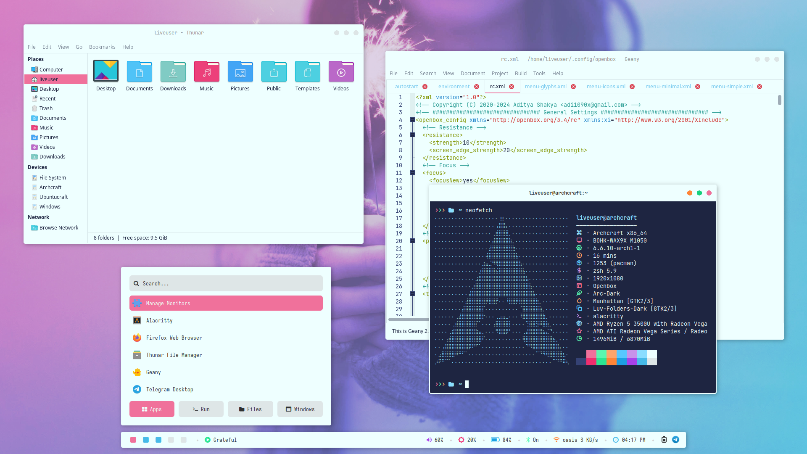](https://archcraft.io/)
[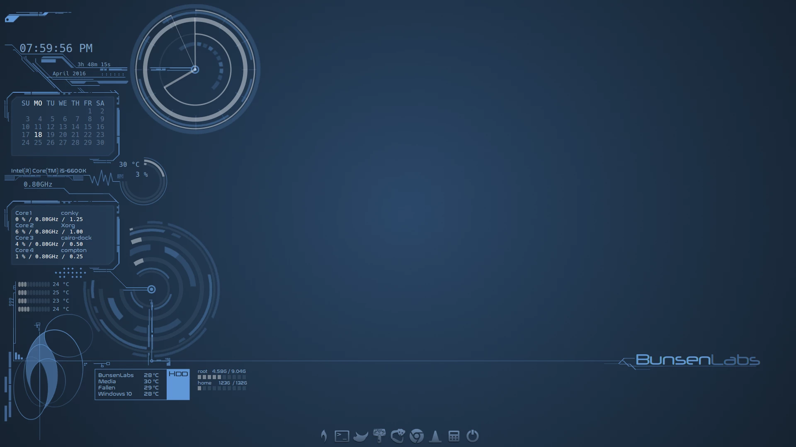](https://www.bunsenlabs.org/)
[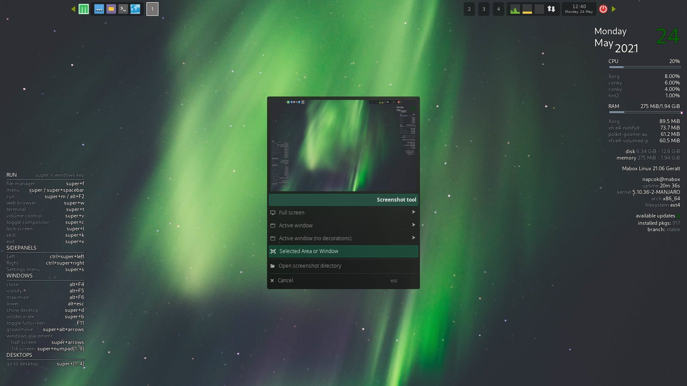](https://maboxlinux.org/)
[/grid]

Karena ketiga tersebut secara default sudah menggunakan openbox, kalian bisa langsung menggunakannya begitu selesai menginstall distro-distro tersebut untuk merasakan sensasi indah, sederhana, elegan dan nostalgic-nya openbox ✌️.

# Instalasi Openbox

Tapi, jika kalian ingin tau bagaimana openbox '*fresh from the oven*' alias openbox versi murni, kita akan coba install bersama. Sebelumnya, sebagai informasi saja, di sini saya akan menunjukkan demo instalasi openbox via archinstall *script* di distro Archlinux karena **I use Arch BTW!**. Panduan instalasinya akan persis sama seperti yang ada di artikel saya berjudul "[Instalasi Archlinux KDE via archinstall](https://abwildan.github.io/post/archinstall/)", kecuali pada bagian ***profile***.

### Profile
Pada bagian ***profile***, kita tidak memilih desktop, tapi xorg.
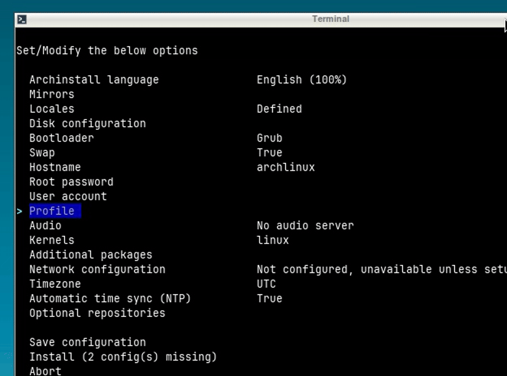

Kemudian pilin **`install`**, biarkan proses instalasi Archlinux berjalan dan *reboot* jika sudah selesai.

Setelah login, kita akan menginstall beberapa paket untuk kebutuhan openbox[^2].

> **NOTICE ME**
> 
> Jangan lupa mengganti DNS ke DNS google supaya tidak ada hambatan jaringan ketika meng-*install* atau meng-*update* *software*, di `/etc/resolv.conf`

```bash
sudo pacman -S openbox tint2 feh obconf lxappearance xorg-xrandr xfce4-terminal firefox thunar sxiv mpv nano wget 
```
**Keterangan:**

| No  |       Package Name    |           Description           |
| --- |           -----       |              -----              |
|  1  |   **openbox**         |        openbox                  |
|  2  |   **tint2**           |        panel                    |
|  3  |   **feh**             |        background               |
|  4  |   **obconf**          |        GTK tools                |
|  5  |   **lxappearance**    |        cust. look and feel      |
|  6  |   **xorg-xrandr**     |        resolution tool          |
|  7  |   **xfce4-terminal**  |        terminal emulator        |
|  8  |   **firefox**         |        web browser              |
|  9  |   **thunar**          |        file manager             |
| 10  |   **sxiv**            |        image viewer             |
| 11  |   **mpv**             |        audio/video player       |
| 12  |   **nano**            |        text editor (CLI)        |
| 13  |   **wget**            |        web retriever            |


Selanjutnya, *copy-paste* xinitrc dari /etc/X11/xinit/xinitrc ke .xinitrc dan folder /etc/xdg/openbox ke .config:
```bash
cp /etc/X11/xinit/xinitrc .xinitrc
cp -R /etc/xdg/openbox .config
```
Kita edit file **`.xinitrc`** dengan nano, hapus atau *comment* lima baris terakhir berikut & tambahkan baris perintah untuk memulai openbox via startx:
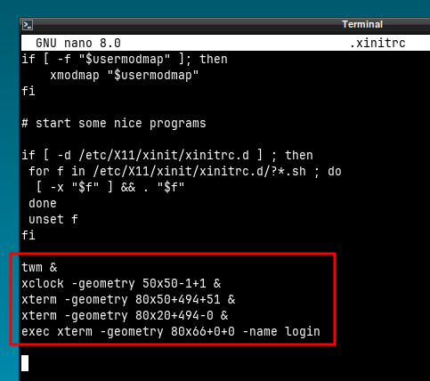
```bash
# twm &
# xclock -geometry 50x50-1+1 &
# xterm -geometry 80x50+494+51 &
# xterm -geometry 80x20+494-0 &
# exec xterm -geometry 80x66+0+0 -name login

exec openbox-session # start openbox via startx
```

Berikutnya, kita edit file **`.config../images/openbox/autostart`**, tambahkan baris berikut di baris paling akhir untuk me-*launch* program-program berikut ketika selesai login:
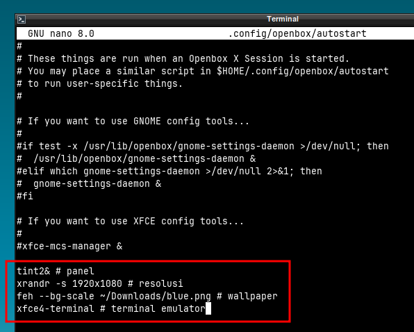
```bash
tint2& # panel
xrandr -s 1920x1080 # resolusi
feh --bg-scale ~/Downloads/blue.png # wallpaper
xfce4-terminal # terminal emulator
```
> **Note:** 
> - sesuaikan konfigurasi resolusinya dengan layar komputer/laptop kalian. 
> - kita harus mengunduh gambar agar bisa tampil sebagai wallpaper, jadi, untuk sementara, gunakan wallpaper berikut terlebih dahulu

Ketikkan perintah
```bash
cd Downloads
wget https://w.wallhaven.cc/full/5g/wallhaven-5gqrp3.jpg -O blue.png
```

Untuk memulai openbox, ketikkan perintah
```bash
startx
```

Kalau tampilan openbox kalian seperti ini:
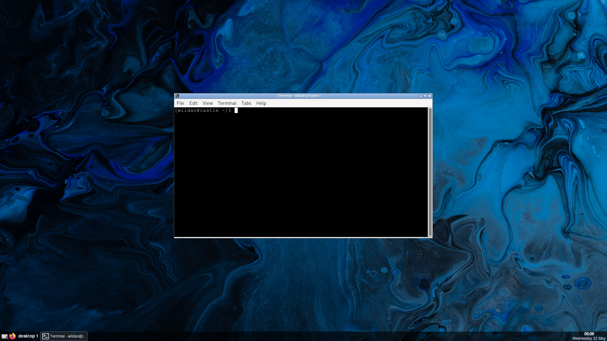

itu pertanda bahwa kalian **berhasil menginstall openbox**! YEY! 

Congrattzz!! 🥳 🥳 🥳

Dan kalau kita perhatikan, openbox merupakan salah satu window manager yang ringan karena menggunakan resource yang rendah. Berikut penggunaan RAM (*random access memory*)-nya yang hanya memakan 160-an MB:
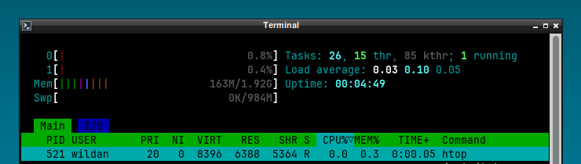

# Kustomisasi Sederhana

Sekarang, kita akan mengkonfigurasi beberapa hal yang menurut saya cukup penting karena terkait dengan kenyamanan dan estetika. Beberapa hal yang akan kita konfigurasi pada bagian "Konfigurasi Sederhana" ini setidaknya ada 7 hal:

*So, let's get into it!*

## 1. Yay
Yay adalah salah *package manager* untuk [AUR (Arch User Repository)](https://aur.archlinux.org/). Beberapa *package manager* yang tidak terdapat di *database repository* archlinux biasanya tersedia di aur. Jadi, kalau kita ingin meng-*install packages* dari aur, kita membutuhkan *package manager* khusus karena tidak bisa menggunakan **`pacman`**. Nah, sebetulnya, ada beberapa *package manager* (atau yang biasa disebut juga sebagai **AUR helpers**), seperti **yay**, **paru**, **pacaur**, **pamac**, dan **trizen**[^3]. Tapi, saya akan gunakan **`yay`** karena alasan kebiasaan saja.

Sebelum menginstall **`yay`**, kita perlu meng-*install* **`git`** terlebih dahulu.
```bash
pacman -S git
```
Baru sekarang kita bisa meng-*install* **`yay`** dengan perintah berikut:
```bash
git clone https://aur.archlinux.org/yay.git
cd yay
makepkg -si
```
Untuk memastikan **`yay`** sudah ter-*install*, ketikkan perintah berikut:
```bash
yay --version
```
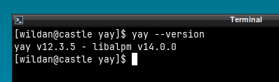

Jika instalasi berhasil, maka perintah tersebut mengeluarkan output berupa versi **`yay`** yang sudah ter-*install*.

Setelah itu, jangan lupa untuk *update* repo aur via **`yay`**:
```bash
yay -Syu # update repository
```

Untuk menginstall *package* atau *software* via **`yay`**, hampir mirip dengan **`pacman`**, ketikkan perintah berikut (tanpa **sudo**) - misalnya saya ingin menginstall **`xrdp`**:
```bash
yay -S xrdp # install xrdp
```
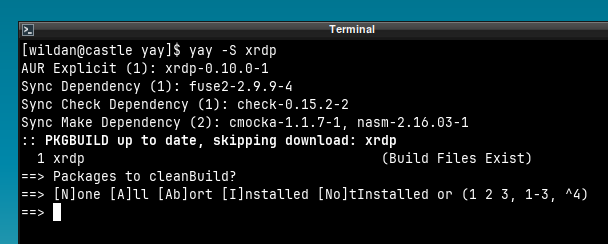

Akan muncul daftar rekomendasi *package* yang kita *request* untuk di-*install* (kebetulan **`xrdp`** hanya ada satu kandidat saja). Tekan **[Enter]** - **[Enter]** saja untuk langsung memasang **`xrdp`**.

## 2. Tint2
Seperti deskripsi yang sudah saya lampirkan sebelumnya di bagian instalasi, `tint2` adalah program untuk menampilkan panel. Sebetulnya, `tint2` yang tampil sekarang sudah cukup sebagai tampilan panel. Hanya saja, menurut saya masih belum fungsional. Jadi, nanti saya akan konfigurasi sesuai dengan kebutuhan dan preferensi saya. 

Kita akan mengkonfigurasi `tint2` sehingga akan tampak sebagai berikut:
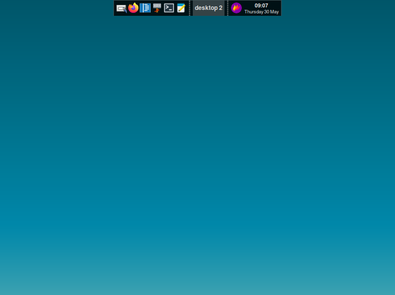 

Seperti terlihat, `tint2` akan saya "tempel" di atas, dengan shortcut icon aplikasi seperti **firefox**, **code**, **thunar**, **xfce4-terminal**, dan **mousepad**. Kemudian, di sebelahnya menampilkan lokasi *current workspace*, di sebelahnya ada tanggal dan jam.

Pertama, buka `tint2` settings atau kalian bisa klik pada icon kotak putih dengan pensil di `tint2` yang tampil. Kemudian, pilih config file yang **horizontal-icon-only.tint2rc**, klik **ceklis** di pojok kiri atas.
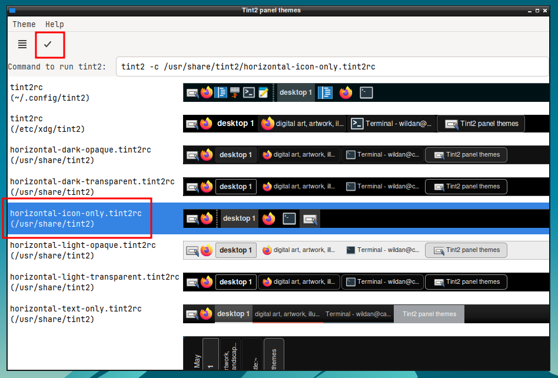 

Untuk menambahkan icon aplikasi untuk *shortcut*, klik **Theme** (di pojok kiri atas) -> **Edit Theme**.

Di bagian **Launcher**, tinggal pilih aplikasi-aplikasi yang ingin ditampilkan, kemudian klik **Apply**.
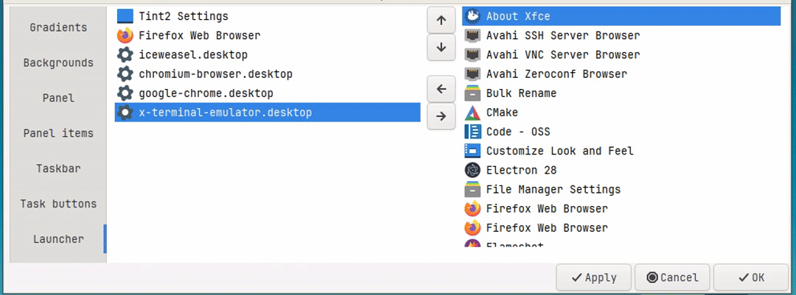 

Di bagian **Taskbar**, pastikan tidak ada yang terceklis. Klik **Apply**.
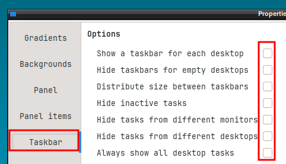 

Di bagian **Panel**, klik pada posisi **atas tengah**.
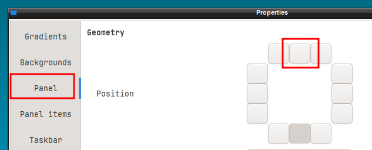 

## 3. Thunar

Ketika pertama kali membuka `thunar`, akan melihat tampilannya sebagai berikut:
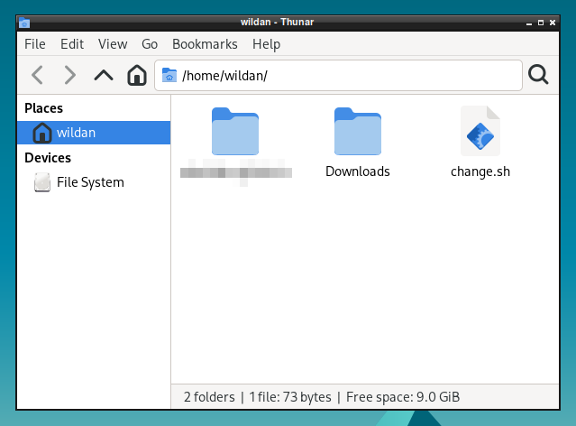

Tampak bahwa saya hanya memiliki satu default folder, yaitu folder atau direktori **Downloads** saja. Nah, untuk menampilkan semua *default* folder pada home *directory*, kita bisa menggunakan [`xdg-user-dirs`](https://archlinux.org/packages/extra/x86_64/xdg-user-dirs/).

Install dulu,...
```shell
sudo pacman -S xdg-user-dirs
```
Kemudian, untuk men-generate folder-folder default di home directory, ketikkan perintah berikut:
```shell
xdg-user-dirs-update
```
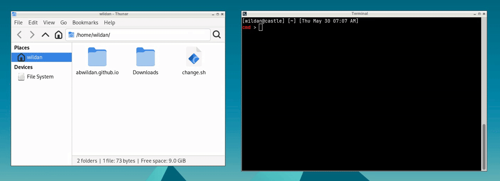

Untuk menampilkannya di sidebar sebagai *shortcut*, tinggal *drag and drop* seperti berikut:
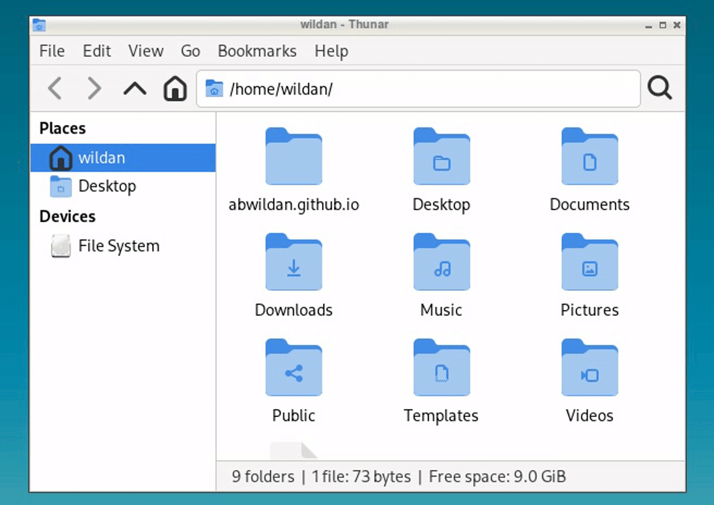


## 4. Obconf
Pada bagian ini, saya akan menggunakan `obconf` (*Openbox Configuration Manager*) sebagai GTK *tools* untuk mengganti tema window dan juga menghapus animasi-nya (dengan alasan kecepatan dan efisiensi). Untuk mengampilkan `obconf`, ketikkan obconf di terminal.

- **Mengganti Tema Window**

```bash
obconf
```
Kemudian, di bagian ***Themes***, kita pilih **"Onyx"**.
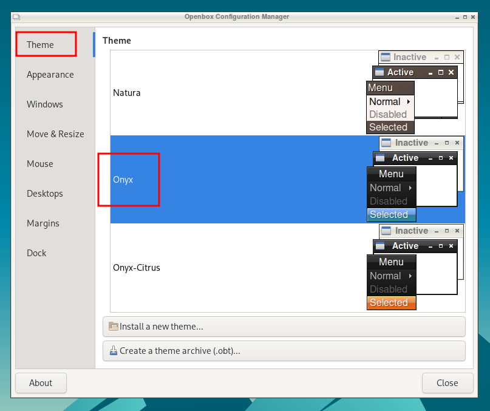

- **Menghapus Animasi Window**

Di bagian ***Appearance***, *un-check* **Animate iconify and restore**.
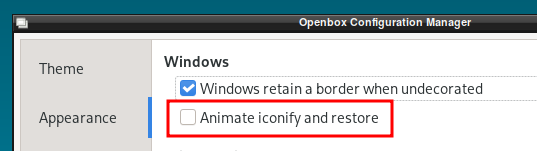

## 5. Icons

Saya akan mengganti icon default ke papirus. 
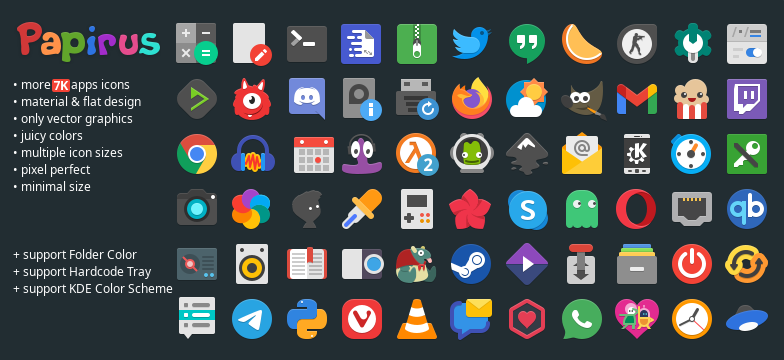

Pertama, kita download dulu icon-nya di sini:

**Papirus Icons**: https://www.xfce-look.org/p/1166289

Pada bagian **Files**, pilih file yang paling atas.
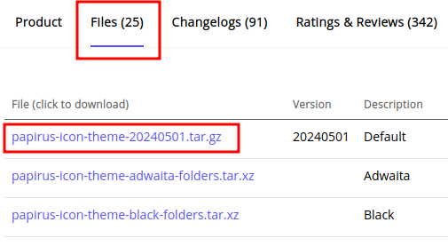

Kita unzip filenya
```shell
gunzip gunzip papirus-icon-theme-20240501.tar.gz 
tar xf papirus-icon-theme-20240501.tar
```

> **Note:**
>
> Kalau belum punya `gunzip` dan `tar`, tinggal install:
>
> ```shell
> sudo pacman -S gzip tar
> ```

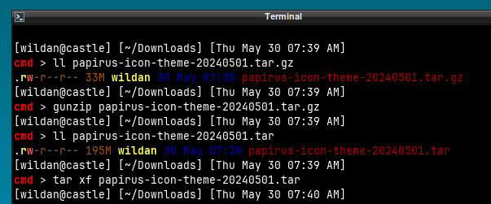

Sekarang, kita punya 5 direktori icon Papirus dengan variasinya:
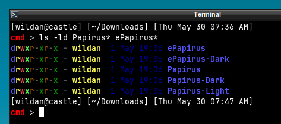

Pindahkan ke direktori `~/.icons`:
```shell
cd ~
mkdir .icons # buat direktori .icons jika belum ada
cd .icons
cp -r ~/Downloads/Papirus* ~/Downloads/ePapirus* .
```
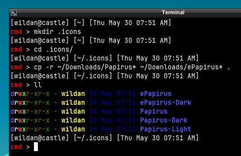

Buka `lxappearance`, pada bagian **Icon Theme**, pilih **Papirus**, klik **Apply**.
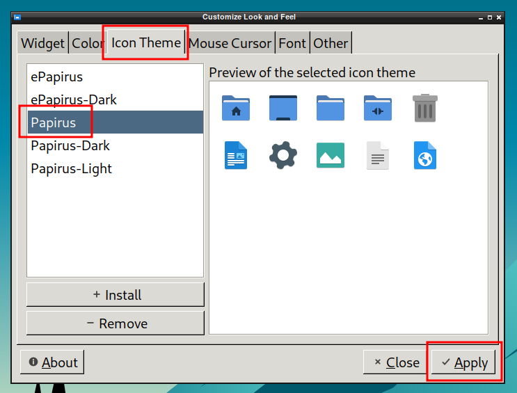

Dan icon theme Papirus berhasil diinstall.
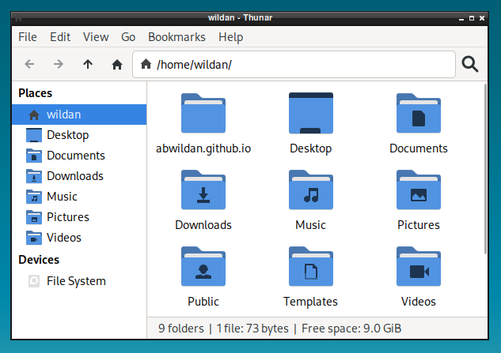

## 6. Font

Font yang akan saya pasang adalah Jetbrains. So, kita install:
```bash
sudo pacman -S ttf-jetbrains-mono ttf-jetbrains-mono-nerd
```
Buka `lxappearance`, di bagian **Widget**, ubah Default font dari Cantarel ke **Jetbrains Mono 10**, klik **Apply**.
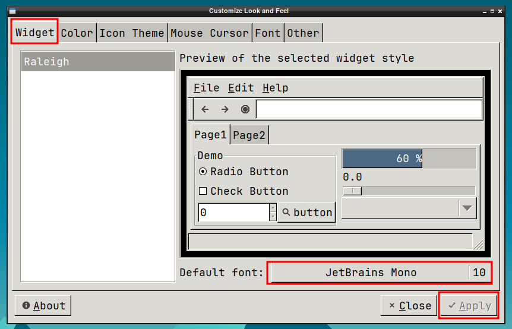

## 7. Bash 
 
Di *section* ini, kita akan menginstall beberapa *tools* dan mengkonfigurasi *shell prompt* di `.bashrc`. *Tools* yang akan diinstall yaitu

| No  |       Package Name    |           Description           |
| --- |           -----       |              -----              |
|  1  |   **eza**             |        `ls` *alternative*       |
|  2  |   **bat**             |        `cat` *alternative*      |

```shell
sudo pacman -S bat eza
```
Kemudian, buka file konfigurasi bash (`.bashrc`) untuk mengganti `ls` dengan `eza` dan `cat` dengan `bat`:
```shell
cd ~
nano .bashrc

alias ls='eza'
alias cat='bat'
```

Sekarang, kita akan mengganti *shell prompt* supaya terlihat lebih keren dan informatif seperti berikut:
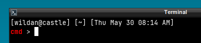

Caranya, kita perlu menambahkan baris berikut di `.bashrc`:
```shell
#PS1='[\u@\h \W]\$ ' # default shell prompt

PS1='[\u@\H] [\w] [\d \@]\n\[\e[38;5;196;1m\]cmd\[\e[0m\] > '
```
Saya men-*desain shell prompt* tersebut melalui website berikut:

**Bash Prompt Generator**: https://bash-prompt-generator.org/

Saya cukupkan dulu...

Sekian untuk tutorial singkat Openbox kali ini, semoga bermanfaat...

Sampai jumpa lagi di artikel-artikel saya yang lain...

[^1]: https://distrowatch.com/search.php?desktop=Openbox
[^2]: https://wiki.archlinux.org/title/openbox
[^3]: https://wiki.archlinux.org/title/AUR_helpers