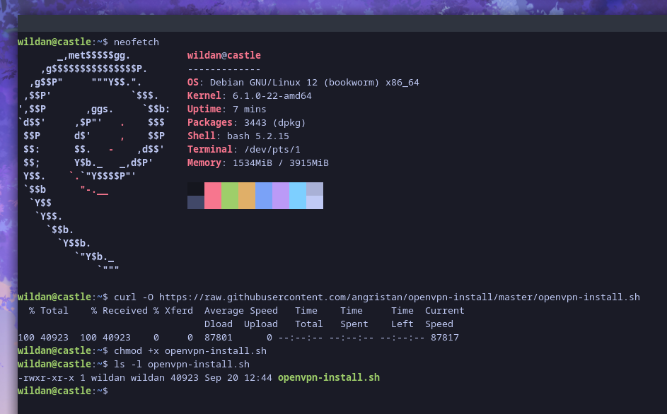
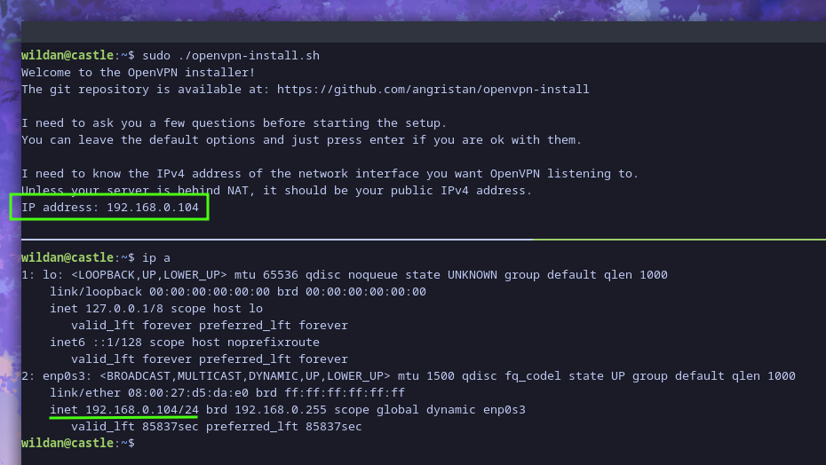
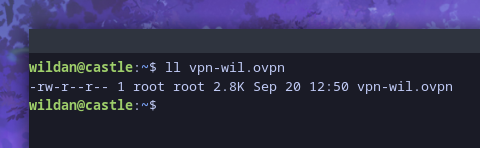
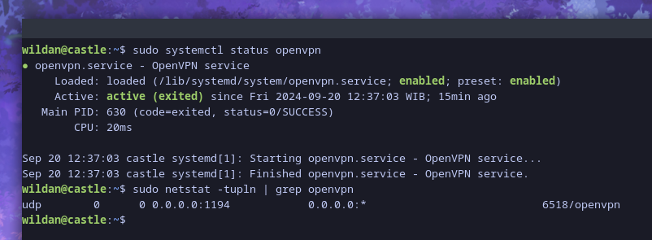
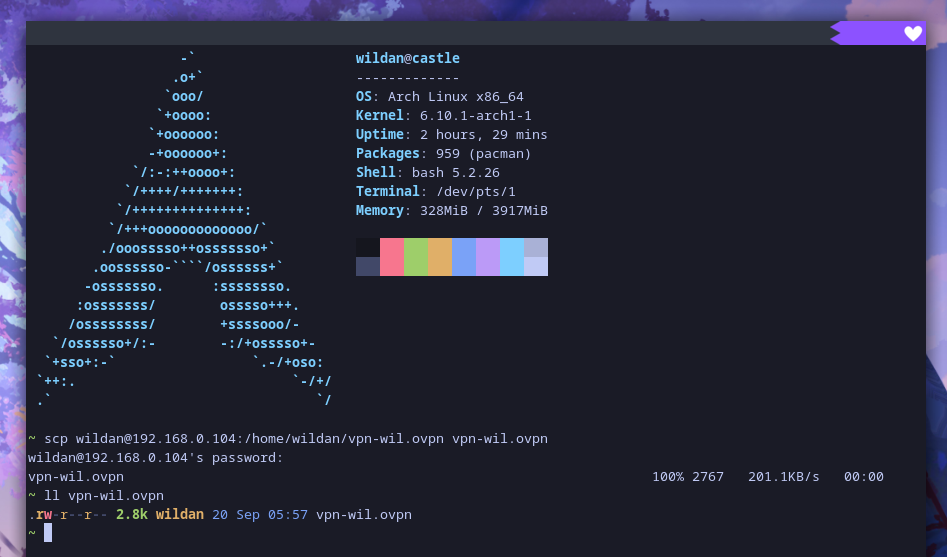
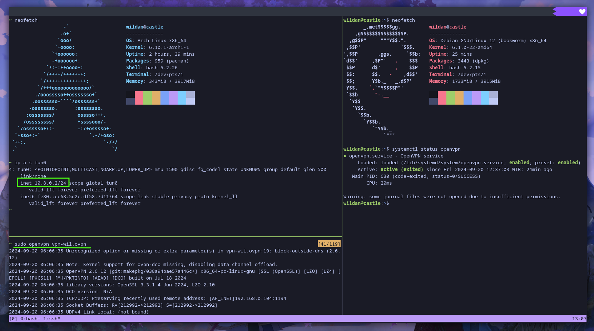

## Intro

Openvpn adalah sebuah VPN daemon *open source* yang dibuat oleh James Yoman.[^1] Kita mungkin sudah terbiasa menggunakan VPN untuk mengakses situs atau website yang di-*block* oleh pemerintah. Itu artinya kita sudah terbiasa menggunakan VPN sebagai client untuk terhubung ke sebuah VPN server sehingga nanti *ip address* kita akan berubah menjadi *ip address* server VPN tersebut. Nah, di artikel ini, saya mau berbagi cara membuat VPN server kita sendiri menggunakan Openvpn.

Tutorial ini akan sangat mudah karena saya akan menggunakan sebuah *script* instalasi yang dibuat oleh [**angristan**](https://github.com/angristan) di Github yang sebetulnya cara instalasinya sudah dijelaskan juga di sana:  

::github{repo="angristan/openvpn-install"}

Karena saya tidak menggunakan server atau *virtual machine* (VM) eksternal seperti yang disediakan oleh Google Cloud Platform, Oracle, dan lainnya, jadi saya hanya akan mendemokannya dari VM saya sendiri. Artinya, nanti saya tidak akan menggunakan *ip public*, tapi *ip private* saja.

## Demo

Jadi, skenario demo kali ini, yaitu sebagai berikut:
- **Debian** sebagai Openvpn Server.
- **Archlinux** sebagai Openvpn Client.

So, langkah-langkah di bawah ini tentu saja saya lakukan di dalam VM Debian.

### Downloading the script

Oke, pertama, kita bisa men-*download* *script*-nya terlebih dahulu:

```shell
curl -O https://raw.githubusercontent.com/angristan/openvpn-install/master/openvpn-install.sh
chmod +x openvpn-install.sh
```



### Running the script

Kemudian, jalankan *script*-nya:

```shell
sudo ./openvpn-install.sh
```

Kita akan diminta memasukkan *ip address*:  

> **Note:**  
> Seharusnya, kita mengisikan *ip public* dari server / *virtual machine* yang akan kita *install*-kan openvpn server ini, tapi seperti saya mention di awal, saya hanya akan menggunakan *ip private*.



Karena *script* mendeteksi *ip address* kita adalah *ip private*, jadi, sekali lagi dia akan meminta ip public kita. Tapi, saya akan tetap mengisikan *ip private*.


Kemudian, ada beberapa pertanyaan yang dapat kita biarkan sebagaimana jawaban *default*-nya, yaitu:

- Do you want to enable IPv6 support (NAT)? [y/n]: n
- What port do you want OpenVPN to listen to?
   1) Default: 1194
   2) Custom
   3) Random [49152-65535]
Port choice [1-3]: 1
- What protocol do you want OpenVPN to use?
UDP is faster. Unless it is not available, you shouldn't use TCP.
   1) UDP
   2) TCP
Protocol [1-2]: 1
- What DNS resolvers do you want to use with the VPN?
   1) Current system resolvers (from /etc/resolv.conf)
   2) Self-hosted DNS Resolver (Unbound)
   3) Cloudflare (Anycast: worldwide)
   4) Quad9 (Anycast: worldwide)
   5) Quad9 uncensored (Anycast: worldwide)
   6) FDN (France)
   7) DNS.WATCH (Germany)
   8) OpenDNS (Anycast: worldwide)
   9) Google (Anycast: worldwide)
   10) Yandex Basic (Russia)
   11) AdGuard DNS (Anycast: worldwide)
   12) NextDNS (Anycast: worldwide)
   13) Custom
DNS [1-12]: 11
- Do you want to use compression? It is not recommended since the VORACLE attack makes use of it.
Enable compression? [y/n]: n
- Do you want to customize encryption settings?
Unless you know what you're doing, you should stick with the default parameters provided by the script.
Note that whatever you choose, all the choices presented in the script are safe. (Unlike OpenVPN's defaults)
See https://github.com/angristan/openvpn-install#security-and-encryption to learn more.

Customize encryption settings? [y/n]: n

Berikutnya, kita bisa memulai proses instalasi dengan menekan Enter di keyboard dan biarkan proses update sistem dan instalasi berjalan hingga ada pertanyaan untuk meng-input-kan nama file *client*-nya:


- Do you want to protect the configuration file with a password?
(e.g. encrypt the private key with a password)
   1) Add a passwordless client
   2) Use a password for the client
Select an option [1-2]: 1

Dan saya sudah memiliki sebuah file client openvpn:



Saya juga bisa memastikan openvpn sudah berjalan di server dengan perintah:

```shell
sudo systemctl status openvpn
```

atau 

```shell
sudo netstat -tupln | grep openvpn
```



### Downloading client file config

Berikutnya, saya akan men-*download* file konfigurasi client yang tadi sudah dibuat. File ini akan saya unduh ke Archlinux.



### Connecting

Untuk tersambung ke openvpn server menggunakan file konfigurasi client tersebut, saya mengetikkan perintah berikut:

```shell
sudo openvpn vpn-wil.ovpn
```

Sekarang, VM Archlinux saya sebagai client bisa terkoneksi ke VPN server yang berjalan di VM Debian, dapat terlihat dari *ip address* dengan *interface* tun0 berikut:



<iframe width="100%" height="468"
  src="https://www.youtube.com/embed/SHSqFAdd41A"
  frameborder="0" allowfullscreen>
</iframe>


[^1]: https://openvpn.net