## Introduction

**`pass`** adalah _tool_ _password manager_ di Linux yang dikembangkan menggunakan GPG (_GNU Privacy Guard_).[^1] GPG sendiri merupakan _utility_ di Linux yang biasa digunakan oleh sistem operasi dalam melakukan proses enkripsi dan menandatangani data dan komunikasi yang terjadi, seperti misalnya ketika pengguna Linux sedang meng-_install_ paket tertentu.[^2] Oleh karena itu, biasanya, paket GPG (**`gnupg`**) sudah tersedia secara default di sistem operasi.

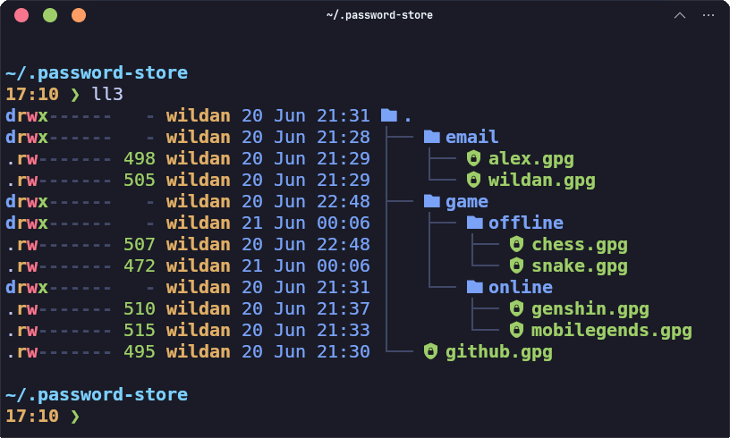

**`pass`** menyimpan file _password_ yang terenskripsi di direktori home (`~/.password-store`) seperti yang terlihat pada gambar di atas. Jika kita pergi ke direktori tersebut, tentu saja kita bisa melihat nama sub-direktori berikut dengan nama file-nya juga. Akan tetapi, isi dari file tersebutlah yang tidak dapat dibaca karena sudah terenkripsi. Perhatikan juga bahwa file yang tersimpan di direktori tersebut memiliki ekstensi `.gpg`. Itu artinya, seperti yang baru saja saya sampaikan, file-file tersebut dienkripsi menggunakan GPG.

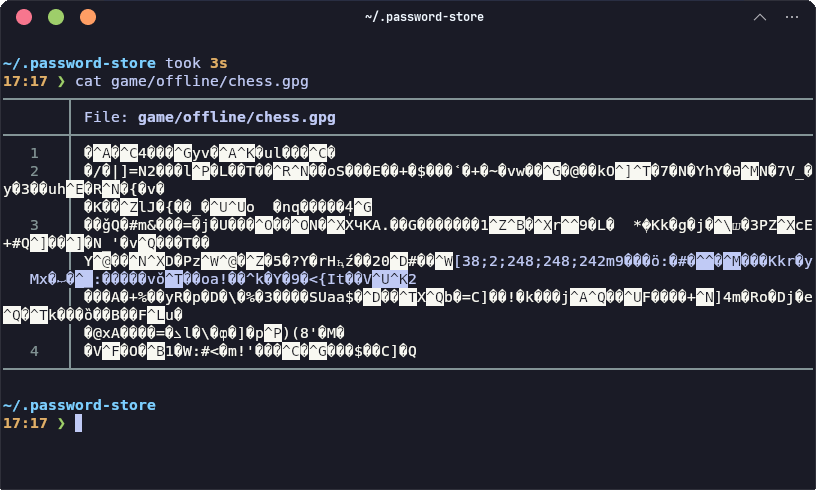

**`pass`** sendiri adalah _software_ yang dikembangkan dengan lisensi _open source_ dan gratis. Bahkan, kita dapat menemukan _project repository official_-nya di tautan di bawah ini.  

::github{repo="zx2c4/password-store"}

Nah, di artikel ini, kita akan belajar cara mengelola _password_ dengan salah satu _password manager_ terbaik di Linux, yaitu **`pass`**.

## Installation

Berikut adalah cara meng-_install_ **`pass`** di beberapa Linux populer:

|       Distro      |                  Command                           |
|       ---         |                   ---                              |
| **Debian/Ubuntu** | **`sudo apt install pass`**                        |
| **Arch Linux**    | **`sudo pacman -Sy pass`**                         |
| **Fedora**        | **`sudo dnf install pass`**     			             |

> **Opensuse** tidak menyediakan paket `pass` sehingga untuk meng-install-nya kita dapat merujuk pada repository Github-nya untuk meng-compile-nya sendiri.

:::note

**NixOS:**  
Masukkan baris berikut di file konfigurasi (`/etc/nixos/configuration.nix`):

```nix
  environment.systemPackages = [
    pkgs.pass
  ];
```

Atau jika menggunakan `nix-shell`:

```shell
nix-shell -p pass
```

:::

## Managing Passwords

Berikut adalah langkah-langkah mengelola _password_ menggunakan **`pass`**:

### 1. Master Key

Sebelum melakukan enkripsi, kita perlu membuat **master key** terlebih dahulu. Master key ini terdiri dari 2 kunci, yaitu **private key** dan **public key**. 

Private key adalah kunci yang nanti akan digunakan untuk mengunci atau mengenkripsi file _password_, sementara public key adalah kunci yang nanti akan digunakan untuk membuka atau mendekripsi file _password_. Oleh karena itu, private key harus kita jaga dan tidak boleh diberikan kepada orang lain.

#### 1.1 Creating Master Key

Berikut adalah cara membuat master key dengan GPG:

```shell
gpg --full-generate-key
```

1. Kemudian, pilih opsi **(1) RSA and RSA** untuk algoritma yang digunakan (demi alasan keamanan).
2. Selanjutnya, ketikkan **4096** untuk _keysize_-nya (lagi-lagi, demi alasan keamanan).
3. Berikutnya, kita dapat memilih waktu _expire_ untuk master key ini. Tapi, jika kita ingin agar master key  tersebut tidak pernah _expire_, pilih opsi pertama, **0 = key does not expire**.
4. Konfirmasi dengan tekan **y** di _keyboard_.
5. Akan muncul prompt **Real name:**, isikan dengan nama yang diinginkan.
6. Juga akan muncul prompt **Email address:**, isikan dengan email yang diinginkan.
7. Bagian **comment** dapat dilewati (dibiarkan kosong).
8. Terakhir, tekan **O** di keyboard jika sudah selesai.
9. Sebelum ditutup, kita akan diminta memasukkan **passphrase** yang nanti akan sering digunakan untuk mengelola **`pass`**.

Berikut adalah video tutorialnya:

<iframe
  src="https://player.cloudinary.com/embed/?cloud_name=dpvtbnqf7&public_id=pass1_ta0g6f"
  width="640"
  height="360" 
  style="height: auto; width: 100%; aspect-ratio: 640 / 360;"
  allow="autoplay; fullscreen; encrypted-media; picture-in-picture"
  allowfullscreen
  frameborder="0"
></iframe>

> Kita dapat membuat lebih dari satu master key. 

:::note

Mungkin, beberapa distro (seperti yang sama alami di **NixOS**) tidak dapat menyelesaikan proses pembuatan master key karena _prompt_ "paraphrase" di akhir tidak muncul. Itu disebabkan belum terpasangnya satu _package_ terkait, yaitu **`pinentry`**. 

Berikut adalah cara _install_ dan konfigurasinya:

|       Distro      |                  Command                           |
|       ---         |                   ---                              |
| **Debian/Ubuntu** | **`sudo apt install pinentry-curses`**             |
| **Arch Linux**    | **`sudo pacman -Sy pinetry`**                      |
| **Opensuse**      | **`sudo zypper install pinentry`**                 |
| **Fedora**        | **`sudo dnf install pinentry`**  			             |

**NixOS:**

Masukkan baris berikut di file konfigurasi (`/etc/nixos/configuration.nix`):

```nix
  environment.systemPackages = [
    pkgs.pinentry-curses
  ];
```

Atau jika menggunakan `nix-shell`:

```shell
nix-shell -p pinentry-curses
```

Untuk mengaktifkan **`pinentry`**, masukkan perintah berikut di  
**`~/.gnupg/gpg-agent.conf`**:

```shell
pinentry-program /usr/bin/pinentry-curses
```

:::

#### 1.2 Listing Master Key

Kita juga dapat melihat daftar master key yang kita miliki dengan perintah:

```shell
gpg --list-keys
```

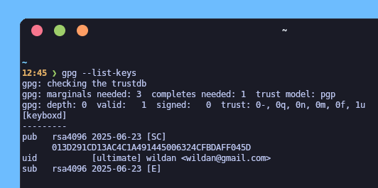

#### 1.3 Removing Master Key

Kita juga dapat menghapus master key:

```shell
gpg --delete-secret-and-public-keys <name_or_email>
```

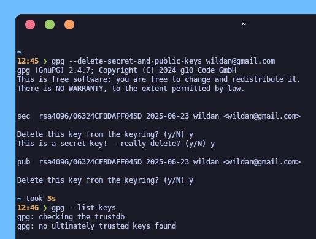

Dengan perintah tersebut, kita menghapus ***secret key*** dan ***public key*** yang terasosiasi oleh username atau email tersebut.

#### 1.4 Editing Master Key

Selain itu, kita juga dapat meng-_edit_ master key:

```shell
gpg --edit-key <name_or_email>
```

Dalam mode _edit_ ini, kita dapat melakukan banyak hal, seperti mengganti _expire_ key-nya dan mengganti _passphrase_. 

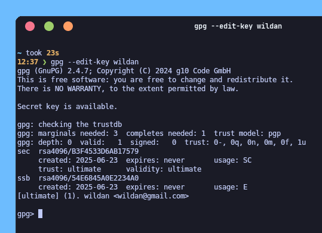

### 2. Passwords Store

Sekarang, kita akan mulai menggunakan **`pass`** untuk mengelola _password_.

#### 2.1 Initializing `pass`

Mula-mula, sebelum membuat _password_ di **`pass`**, kita perlu menginisialisasikannya terlebih dahulu menggunakan master key yang sudah dibuat sebelumnya dengan perintah berikut:

```shell
pass init <key>
```

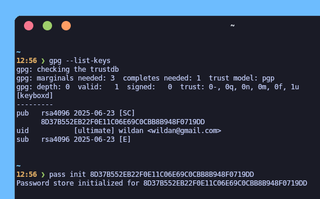

#### 2.2 Creating Pass

Cara membuat _password_ baru:

```shell
pass insert <filename>
```

Dengan perintah tersebut, kita berarti membuat _password_ yang akan disimpan dalam nama file yang langsung berada di bawah direktori `~/.password-store`.

Atau jika kita ingin menyimpan _password_ kita di dalam bentuk struktur sub-direktori juga bisa:

```shell
pass insert <sub-dir>/<filename>
```

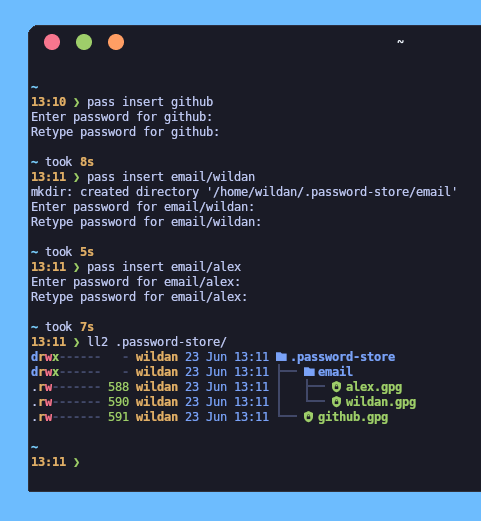 

Perhatikan bahwa file "github" berada langsung di bawah direktori `~/.password-store`, sementara, file "email" untuk wildan & alex berada di sub-direktori `~/.password-store/email`. Jika kita pertama kali membuat sebuah sub-direktori, perintah di atas secara otomatis juga akan membuatkan sebuah folder baru.

#### 2.3 Generating Pass

**`pass`** juga menyediakan fitur _generate password_. Artinya, **`pass`** akan membuatkan password dengan kombinasi acak antara abjad, angka, dan simbol untuk kita.

Cara men-_generate_ _password_:

```shell
pass generate <filename>
# atau
pass generate <sub-dir>/<filename>
```

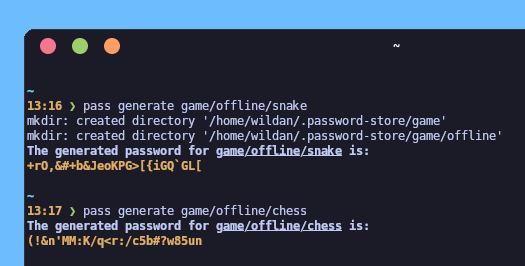

Perhatikan bahwa saya men-_generate_ 2 file _password_ baru, yaitu "snake" & "chess" yang sama-sama berada di sub-direktori  `~/.password-store/game/offline`. Seperti terlihat juga pada gambar bahwa _password_ yang dibuat oleh **`pass`** untuk "snake" & "chess" adalah kombinasi abjad (kapital maupun huruf kecil), angka, dan simbol dengan panjang 25 karakter. 

#### 2.4 Listing Pass

Selain dengan melihat langsung ke direktori `~/.password-store`, **`pass`** juga memungkinkan kita untuk melihat daftar file _password_ yang sudah kita buat dengan perintah:

```shell
pass ls
# atau sesederhana
pass
```

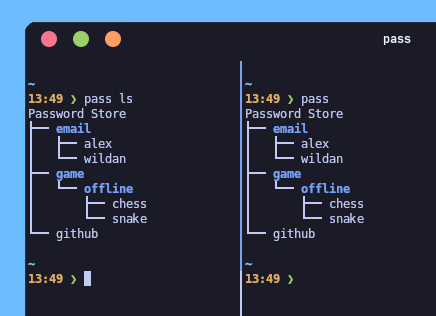

#### 2.5 Showing Pass

Untuk melihat konten dari file _password_, gunakan perintah:

```shell
pass show <filename>
# atau
pass show <sub-dir>/<filename>
```

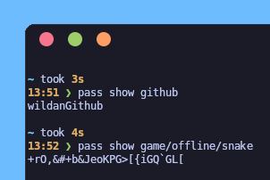

#### 2.6 Editing Pass

Kita juga bisa secara langsung meng-_edit_ konten dari file-file _password_ kita, misalnya dengan tujuan untuk menambahkan detail metadata lain, seperti email, catatan, dan lain sebagainya:

```shell
pass edit <filename>
# atau
pass edit <sub-dir>/<filename>
```

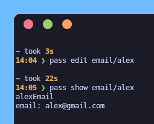

#### 2.7 Copying Pass

Kita juga dapat meng-_copy_ password tertentu ke _clipboard_ tanpa menampilkannya di terminal:

```shell
pass -c <filename>
# atau
pass -c <sub-dir>/<filename>
``` 

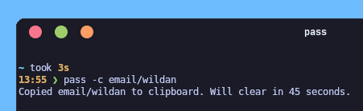

Perhatikan bahwa password yang di-_copy_ ke _clipboard_ juga diberi batasan waktu (default-nya 45 detik). Artinya, kalau kita tidak segera mem-_paste_-kan _password_ tersebut ke suatu tempat, _password_ akan hilang dari _clipboard_ dan kita perlu mengulang perintah di atas kembali jika ingin menggunakannya lagi.

:::note

Jika kita sudah meng-_edit_ atau menambahkan metadata atau informasi tambahan sebelumnya ke dalam file _password_ tertentu, perintah di atas hanya akan meng-_copy_ informasi _password_ kita saja yang berada di baris paling atas. Artinya, informasi lain di baris bawahnya tidak akan ikut ter-_copy_.  

:::

#### 2.8 Finding Pass File

Jika kita memiliki banyak file (apalagi ditambah juga dengan banyak sub-direktori/sub-folder), maka mencari satu file _password_ tertentu akan terasa sulit. Kita dapat mencari file _password_ dengan mudah melalui perintah berikut:

```shell
pass find <filename>
pass find <dir-name>
# atau 
pass search <filename>
pass search <dir-name>
```

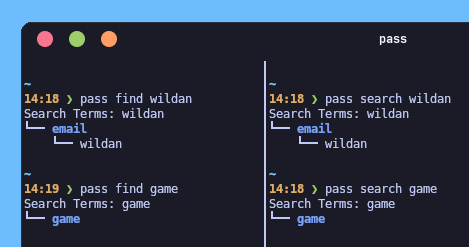

#### 2.9 Grepping Metadata

Jika kita misalnya ingin mengetahui informasi spesifik mengenai metadata yang tersimpan dalam file-file _password_ tersebut (termasuk informasi tentang _password_ itu sendiri tentunya), kita dapat menggunakan perintah:

```shell
pass grep <string>
```

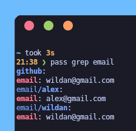

Seperti terlihat, kita bisa mendapatkan _string_ "email" yang terdapat di file 
- `~/.password-store/github`  
- `~/.password-store/email/alex`  
- `~/.password-store/email/wildan`  

#### 2.9 Deleting Pass

Kita pun dapat menghapus _password_ yang sudah dibuat dengan perintah:

```shell
pass rm <filename>
# atau
pass rm <dir-name>/<filename>
```

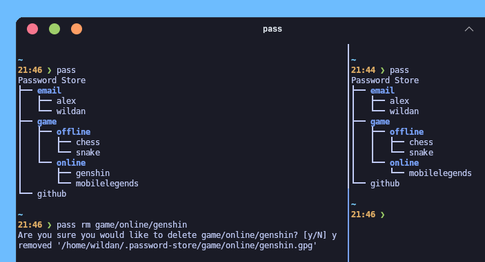


#### Notes

1. Ketika berinteraksi "pertama kali" dengan hal yang berkaitan langsung dengan konten file _password_, misalnya seperti menampilkan _password_, meng-_copy_ _password_ ke _clipboard_, meng-_edit_ konten file _password_, dan lain sebagainya, **`pass`** akan meminta _passphrase_. 
2. Pengaturan _passphrase_ yang muncul tersebut juga dapat diatur, agar misalnya _passphrase_ tersebut tidak hanya akan diminta pertama kali saja, tetapi, jika sudah lewat 5 detik dari permintaan pertama. Inilah yang disebut dengan pengaturan _**caching time**_. Caranya, kita menambahkan baris berikut di **`~/.gnupg/gpg-agent.conf`**:   

```shell
default-cache-ttl 5
```

### 3. Pass x Git

Semua pengelolaan _password_ di atas tentu saja hanya terjadi di komputer lokal kita. Sekarang, bagaimana jika kita ingin agar _password-password_ tersebut dapat dikelola juga di komputer yang lain? Solusinya adalah dengan menggunakan fitur "`git`" yang disediakan oleh **`pass`**.

#### 3.1 Initializing `git`

Untuk meng-inisialisasikan `git`, (dan ini adalah hal pertama yang mesti dilakukan), caranya:

```shell
pass git init
```

#### 3.2 Adding repo

Sebelum menambahkan repository, kita perlu memperhatikan beberapa hal berikut ini terlebih dahulu:
1. Sudah memiliki akun di **Github** (atau "Gitlab").
2. Sudah membuat repositori di akun **Github** tersebut.

:::warning

Saran saya, untuk alasan keamanan, repositori Github yang digunakan untuk "menyimpan" _password-password_ kita tersebut dibuat **"private"** saja  (jangan "public"). Dengan demikian, repositori tersebut tidak dapat dilihat oleh orang lain alias hanya kita sebagai pemilik akun Github tersebut sajalah yang dapat melihatnya.

:::

Untuk menambahkan _remote_ repositori ke `git`:

```shell
# menambahkan _remote_ repositori di Github via SSH
pass git remote add origin git@github.com:<username>/<repo-name>.git
```

> Kita dapat mengetahui tautan SSH untuk repo Github dengan melihat menu **SSH** pada bagian **Code**:
> 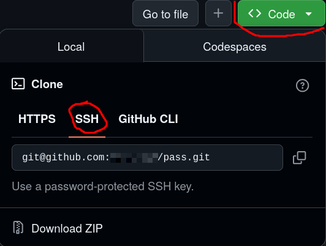

#### 3.3 Pushing

Untuk mem-_push_ repositori git yang ada di komputer lokal kita ke Github:

```shell
pass git push -u --all
```

Maka seluruh direktori/folder berikut dengan file-file _password_ di dalamnya akan "tersimpan" di Github.

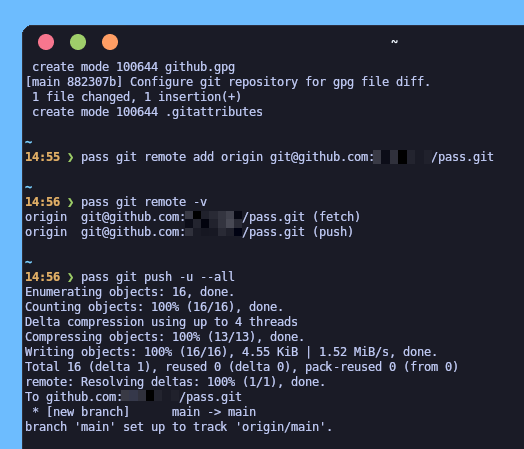

#### 3.4 Cloning

Nah, sekarang, agar _password-password_ tersebut dapat digunakan di komputer yang lain, berikut adalah syarat minimalnya:
1. Komputer tersebut sudah memiliki `git`.
2. Komputer tersebut juga sudah memiliki **`pass`**.

> Kalau belum, berarti harus install terlebih dahulu.

Agar _password-password_ yang sudah ter-"_upload_" (_push_) ke Github tadi dapat digunakan kembali di komputer kita yang lain, kita perlu men-"_download_"-nya (_clone_) terlebih dahulu:

```shell
# clone the Github repo and save it to "~/.password-store" directory
pass git clone git@github.com:<username>/<repo-name>.git .password-store
```

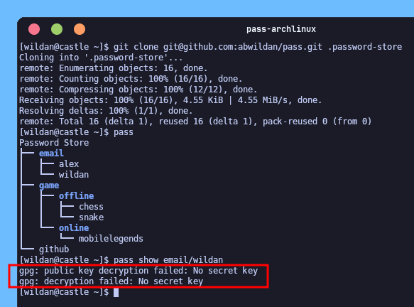

Seperti terlihat pada gambar di atas, kita berhasil meng-_clone_ repositori Github-nya. Kita pun berhasil melihat daftar _password_ yang ada. Masalahnya adalah, kita masih belum memiliki akses untuk berinteraksi (melihat, memodifikasi, mengedit, menghapus, dll) dengan _password-password_ tersebut karena kita belum memiliki ***private key*** & ***public key*** yang diperlukan (lihat bagian kotak berwarna merah di bagian bawah gambar tersebut). 

Oleh karena itu, tugas kita sekarang adalah meng-_import_ kedua _key_ tersebut.

#### 3.5 Importing Keys

Kita harus meng-_export_ ***private key*** & ***public key*** terlebih dahulu, baru meng-_import_-nya. 

1. Export Keys

Lakukan tahap _export_ di komputer tempat membuat _password_ dengan **`pass`** (bukan komputer lain).

```shell
mkdir keys && cd keys # creating new dir to save exported private & public key
gpg --output private.pgp --armor --export-secret-key <email@domain.com> # export private key
gpg --output public.pgp --armor --export <email@domain.com> # export public key
```

Setelah itu, kita boleh men-"transfer" direktori tersebut ke komputer tujuan (dengan `scp`, misalnya).

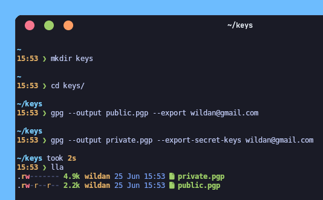

2. Import Keys

Lakukan tahap _import_ di komputer tujuan (tempat kita meng-_clone_ repositori Github _password_).

```shell
gpg --import private.pgp # import private key
gpg --import public.pgp # import public key
```

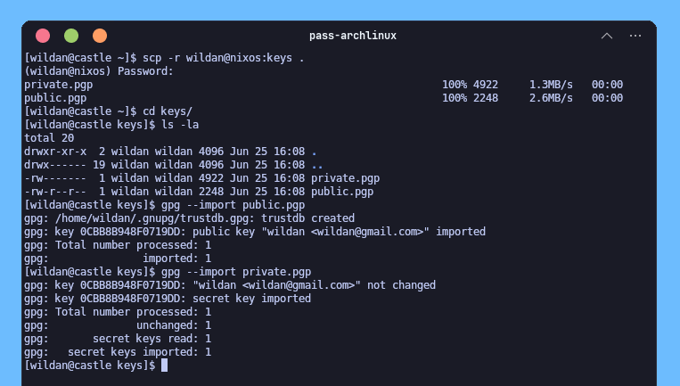

Dan sekarang kita sudah bisa "berinteraksi" dengan password-password di komputer lain:

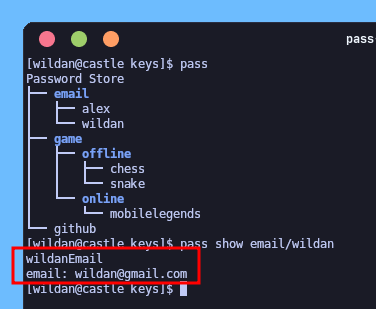

---

<iframe width="100%" height="468"
  src="https://www.youtube.com/embed/FhwsfH2TpFA"
  title="Pass tutorial"
  frameborder="0" allowfullscreen>
</iframe>


[^1]: https://www.passwordstore.org/
[^2]: https://www.gnupg.org/


