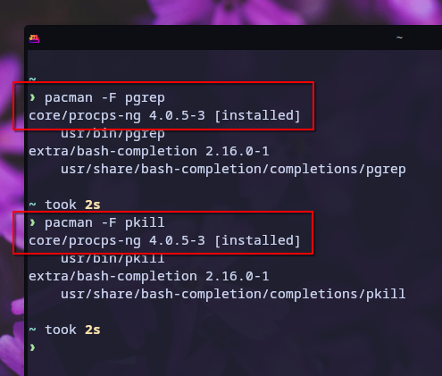

**`pgrep`** & **`pkill`** adalah dua perintah yang sangat bermanfaat. Keduanya adalah _tools_ CLI (_Command Line Interface_) yang hanya dapat dijalankan via terminal. Mungkin tidak semua orang menggunakan, atau bahkan tau, kedua perintah ini. Padahal, menurut saya, kedua perintah ini sangat bermanfaat untuk membantu kita secara efektif untuk menemukan dan menghentikan sebuah proses. Setidaknya, ada 2 manfaatnya:

1. `pgrep` & `pkill` adalah _utilities_ bawaan sistem Linux (dari paket `procps-ng` di Archlinux). Artinya, kita tidak perlu meng-_install_ paket baru untuk menggunakannya. 
2. `pgrep` & `pkill` sangat cepat dalam mencari dan menghentikan sebuah proses.



> Yang saya maksud dengan **proses** adalah aplikasi atau software apapun yang sedang berjalan, baik yang memiliki GUI seperti Browser, File Manager, dll, maupun yang tidak, seperti Music Daemon, SSH Server, dll.

Sebetulnya, cara kerja `pgrep` dan `pkill` ini mirip dengan cara kita ketika ingin menghentikan, men-stop, atau menutup browser, misalnya Firefox. Langkah yang kita lakukan adalah mencari jendela / _window_ Firefox-nya, lalu klik pada tombol _close_ yang umumnya ada di pojok kanan atas (Windows & Linux) atau di pojok kiri atas (Mac). 


Namun, cara tersebut terbatas karena hanya dapat dilakukan pada aplikasi yang memiliki GUI. Sementara, terkadang, kita perlu untuk mematikan sebuah proses yang tidak memiliki GUI dan menggunakan banyak _resource_ komputer, misalnya. Oleh karena itu, dengan _tools_ `pgrep` dan `pkill` ini, kita tidak akan khawatir dan bingung lagi untuk menemukan dan mematikan proses yang ingin dihentikan.

Untuk mencari proses yang ingin dihentikan, gunakan _command_ **`pgrep`** dan diikuti oleh nama proses/aplikasi yang ingin dicari:

```shell
pgrep firefox
pgrep mpd
```

Jika _output_-nya menunjukkan beberapa angka tertentu, itu artinya, proses yang dicari memang sedang berjalan. Sebaliknya, jika _output_-nya tidak menampilkan apapun, artinya proses yang dicari memang sedang tidak berjalan. Angka-angka yang muncul tersebut adalah [PID (_Process ID_)](https://www.baeldung.com/linux/pid-tid-ppid). 

Kemudian, untuk menghentikan prosesnya, gunakan _command_ **`pkill`** dan diikuti oleh nama proses/aplikasi yang ingin dihentikan:

```shell
pkill firefox
pkill mpd
```

Berikut adalah cara mematikan Firefox (GUI _Process_) & MPD (non-GUI _Process_) dengan **`pgrep`** dan **`pkill`**:


Atau jika ingin mematikan 2 atau lebih proses sekaligus, juga bisa:
```shell
pkill '(firefox|mpd|dolphin)'
```

Berikut praktiknya:

<iframe
  src="https://player.cloudinary.com/embed/?cloud_name=dpvtbnqf7&public_id=pgrepkill2_r615oz"
  width="640"
  height="360" 
  style="height: auto; width: 100%; aspect-ratio: 640 / 360;"
  allow="autoplay; fullscreen; encrypted-media; picture-in-picture"
  allowfullscreen
  frameborder="0"
></iframe>

Sebagai tambahan informasi, proses-proses yang sedang berjalan sebetulnya dapat dipantau melalui beberapa _tools_ lain, diantaranya seperti htop, btop, dll yang pernah saya bahas juga di artikel berikut:

[[/tech/resmon/]]

___

Artikel ini ditulis menggunakan KDE Archlinux dengan kustomisasi:


