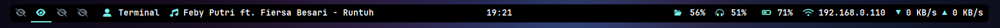
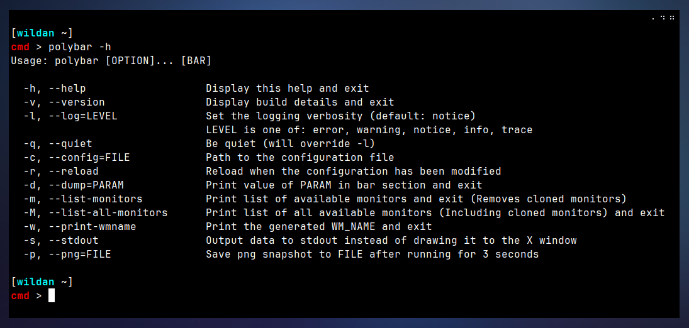
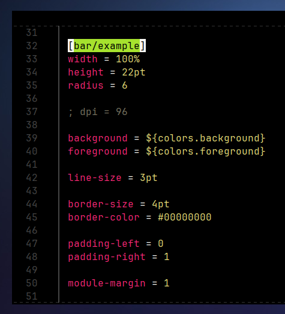
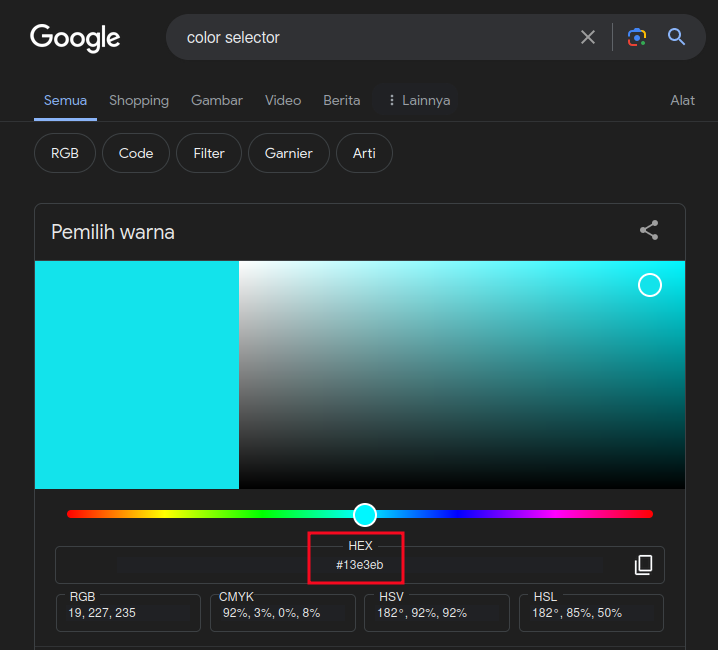
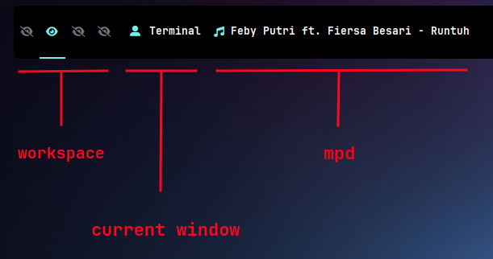
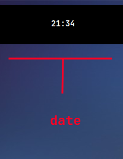
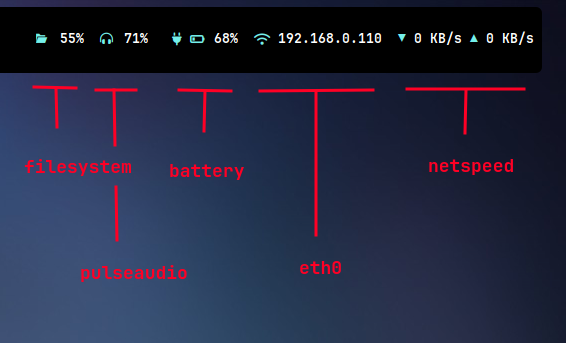
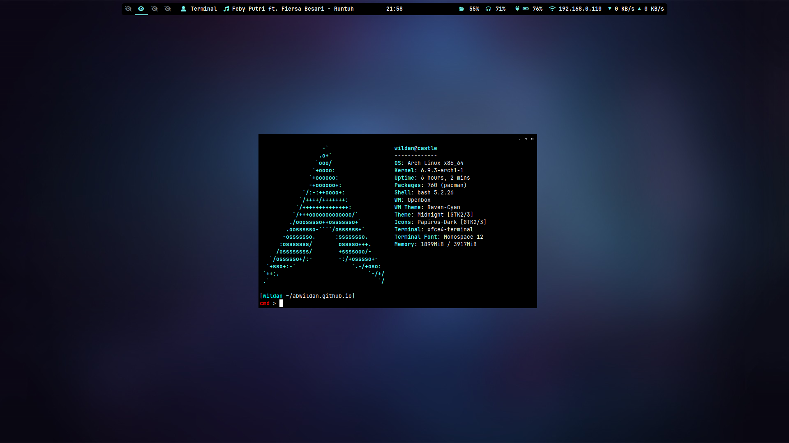

> **Polybar** adalah *tool* yang cepat mudah digunakan untuk membuat status bar[^1], seperti:
> 

Secara umum, artikel ini akan membahas 3 proses: **Memasang Polybar**, **Menjalankan Polybar**, dan **Mengkustom Polybar**.

## Memasang Polybar

*Project* polybar dapat ditemukan di internet, di repo github *official*-nya: 

::github{repo="polybar/polybar"}

Di linux, polybar dapat dipasang dengan mengetikkan perintah berikut:

| No  |           Distro                                                                  |             Install               |
| --- |           -----                                                                   |              -----                |
|  1  |   [**Debian/Ubuntu**](https://packages.debian.org/bookworm/polybar)               |  `sudo apt install polybar`       |
|  2  |   [**Arch**](https://archlinux.org/packages/extra/x86_64../images/polybar/)                |  `sudo pacman -S polybar`         |
|  3  |   [**OpenSuse**](https://software.opensuse.org/package/polybar)                   |  `sudo zypper in polybar`         |
|  4  |   [**Fedora**](https://packages.fedoraproject.org/pkgs../images/polybar/polybar/)          |  `sudo dnf install polybar`       |

Untuk memastikan polybar sudah terpasang, ketikkan perintah berikut di terminal:
```shell
polybar -h
```



## Menjalankan Polybar

Polybar dapat dijalankan sesederhana mengetikkan perintah berikut di terminal:
```shell
polybar
```
Ketika perintah tersebut dijalankan, maka polybar akan mengambil konfigurasi default dari **`/etc../images/polybar/config.ini`**.

Atau dengan perintah:
```shell
polybar example -r
```
Perintah tersebut berarti secara spesifik meminta agar polybar menjalankan bar **`example`** dari file konfigurasinya dan me-reload-nya (artinya, tampilan polybar akan langsung berubah jika ada konfigurasi yang diubah tanpa harus menjalankan polybar lagi di terminal).


Untuk menjalankan polybar langsung setelah login ke komputer (khususnya openbox, karena saya menjalankan openbox saat artikel ini dibuat), masukkan perintah tersebut ke file **`.config/openbox/autostart`**.

## Mengkustom Polybar

*Copy* file config polybar dari `/etc../images/polybar/config.ini` dan *paste*-kan ke `.config../images/polybar/config.ini`. 
```shell
mkdir ~/.config/polybar
cp /etc../images/polybar/config.ini ~/.config/polybar
```
Saya akan mengkustom polybar melalui file **`.config../images/polybar/config.ini`**. 

Secara umum, saya akan membuat status bar dengan 3 bagian, yaitu bagian kiri, bagian tengah, dan bagian kanan. Setiap bagian akan membawa module-nya masing-masing. Berikut adalah pembagian module pada konfigurasi polybar saya:
- **Bagian kiri** = workspace, current window, mpd 
- **Bagian tengah** = time / date
- **Bagian kanan** = filesystem, pulseaudio, battery, eth0, netspeed

### Instalasi Font (JetBrains Mono)

Sebelum masuk ke tahap-tahap kustomisasi, kita perlu meng-*install* font JetBrains terlebih dahulu. Font JetBrains di Archlinux dapat langsung dipasang via *package manager*:
```shell
sudo pacman -Sy ttf-jetbrains-mono ttf-jetbrains-mono-nerd
```
### [colors]

Sekarang, kita akan mulai memasukkan baris-baris konfigurasi di file `.config../images/polybar/config.ini`. 

Pertama-tama, saya akan mendefinisikan warna-warna yang akan digunakan pada polybar nanti.
```ini title="config.ini"
; Warna
[colors]
; referensi warna bisa search di google "color selector"
background = #000000 
background-alt = #000000
foreground = #ffffff
primary = #74f0eb
secondary = #8ABEB7
alert = #A54242	
disabled = #707880
```
Jika ingin konfigurasi warna yang berbeda, kalian bisa bereksperimen mencari warna-warna yang keren dari google, tinggal *search* dengan *keyword* "[***color selector***](https://www.google.com/search?client=firefox-b-d&q=color+selector)", dimana kalian hanya perlu HEX dari warna yang kalian inginkan untuk kemudian di-*copy-paste*-kan ke dalam variabel-variabel pada blok **[colors]** tersebut.


### [bar/nama-bar]

Blok bar ini digunakan untuk membuat nama barnya. Saya akan biarkan namanya default, yaitu **[bar/example]**, kalian boleh menggantinya sesuai selera, misalnya [bar/bar1], [bar/bar-percobaan], atau [bar/bar gue][^2].
```ini title="config.ini"
; Bar
[bar/example]
width = 80% ; it's X
offset-x = 10% ; it's Y, so that X + 2 * Y = 100
height = 22pt
radius = 6

background = ${colors.background}
foreground = ${colors.foreground}

line-size = 2pt

border-size = 6pt
border-color = #00000000

padding-left = 0
padding-right = 1

module-margin = 1

separator = ""
separator-foreground = ${colors.disabled}

font-0 = JetBrains Mono:weight=Bold:pixelsize=10;1
font-1 = Font Awesome 6 Free:weight=Bold:pixelsize=10;1
font-2 = JetBrainsMono Nerd Font:weight=Bold:pixelsize=10;1

modules-left = xworkspaces xwindow mpd
modules-center = date 
modules-right = filesystem pulseaudio battery eth netspeed

cursor-click = pointer
cursor-scroll = ns-resize

enable-ipc = true
```
Terlihat bahwa pada blok **[bar]** ini, kita mendefinisikan beberapa hal penting, misalnya mengatur ukuran, posisi, warna, dan font bar serta mengatur module-module apa saja yang akan terletak di sebelah kiri, tengah, maupun di kanan. 

Sekarang, kita akan mengkonfigurasi modul-modul yang sebelumnya sudah saya tentukan.

### Module di bagian kiri 

#### [module/xworspaces]

Module ini akan mengkonfigurasi workspace yang muncul di polybar.
```ini title="config.ini"
; Workspaces
[module/xworkspaces]
type = internal/xworkspaces

label-active = 
label-active-font = font-1	
label-active-foreground = ${colors.primary}
label-active-background = ${colors.background-alt}
label-active-underline= ${colors.primary}
label-active-padding = 1

label-occupied =  
label-occupied-font = font-1
label-occupied-foreground = ${colors.disabled}
label-occupied-padding = 1

label-urgent = %name%
label-urgent-background = ${colors.alert}
label-urgent-padding = 1

label-empty = 
label-empty-font = font-1
label-empty-foreground = ${colors.disabled}
label-empty-padding = 1
```

#### [module/xwindow]
Module xwindow ini mengkonfigurasi nama window aktif yang sedang tampil.
```ini title="config.ini"
; Current Window
[module/xwindow]
type = internal/xwindow
label = %{F#74F0EB}%{F-}  %title:0:10:...%
```
#### [module/mpd]
Module mpd ini akan menampilkan output audio yang sedang berjalan yang di-*handle* oleh mpd server.
```ini title="config.ini"
; MPD
[module/mpd]
type = internal/mpd
host = 127.0.0.1
port = 6600
interval = 2

format-online = <label-song>
label-song = %{F#74F0EB}%{F-} %artist% - %title%
label-offline = 🎜 mpd is offline
```
Ketiga konfigurasi module tersebut akan menampilkan workspace, current window, dan mpd di polybar sebelah kiri:


> **Note:**  
>
> Status dari module **xwindow** & **mpd** tidak akan muncul jika memang tidak ada window aktif yang sedang berjalan atau mpd tidak sedang berjalan.

### Module di tengah 

#### [module/date]
Module ini akan mengatur status jam dan tanggal yang akan muncul.
```ini
; Date
[module/date]
type = internal/date
interval = 1

date = %H:%M
date-alt = %Y-%m-%d %H:%M:%S

label = %date%
label-foreground = ${colors.foreground}
```
Status dari module date ini akan muncul di bagian tengah polybar.


### Module di bagian kanan

#### [module/filesystem]
Module ini akan menampilkan status kuantitas diska komputer kita yang sudah terisi (dengan format persentase tentu saja).
```ini title="config.ini"
; File System
[module/filesystem]
type = internal/fs
interval = 25
mount-0 = /
label-mounted = %{F#74F0EB}%{F-}  %percentage_used%%
```

#### [module/pulseaudio]
Module ini bertanggung jawab untuk mengatur besar-kecil-nya volume audio komputer kita. Jadi, nanti melalui status pulseaudio ini, saya bisa mengecilkan atau membesarkan audio hanya dengan *scrolling* via mouse di status pulseaudio tersebut.
```ini title="config.ini"
; Pulseaudio
[module/pulseaudio]
type = internal/pulseaudio

format-volume-prefix = "  " 
format-volume-prefix-foreground = ${colors.primary}
format-volume = <label-volume>

label-volume = %percentage%%

label-muted = muted
label-muted-foreground = ${colors.disabled}
```

#### [module/battery]
Sesuai namanya, modul ini akan menampilkan status battery laptop atau komputer kita.
```ini title="config.ini"
; Battery 
[module/battery]
type = internal/battery
battery = BAT0
adapter = AC
full-at = 90

format-charging = "<animation-charging><label-charging>"
label-charging-foreground = ${colors.foreground}
label-charging-background = ${colors.background}

format-discharging = "<ramp-capacity><label-discharging>"
label-discharging-foreground = ${colors.foreground}
label-discharging-background = ${colors.background}

format-full-prefix = "  "
format-full-prefix-foreground = ${colors.foreground}
format-full-prefix-background = ${colors.background}

ramp-capacity-0 = "  "
ramp-capacity-0-foreground = ${colors.alert}
ramp-capacity-1 = "  "
ramp-capacity-2 = "  "
ramp-capacity-3 = "  "
ramp-capacity-foreground = ${colors.primary}
ramp-capacity-background = ${colors.background}

animation-charging-0 = "   "
animation-charging-1 = "   "
animation-charging-2 = "   "
animation-charging-3 = "   "
animation-charging-foreground = ${colors.primary}
animation-charging-background = ${colors.background}
animation-charging-framerate = 750
```

#### [network-base] & [module/eth]
Blok **[network-base]** adalah konfigurasi untuk membuat inisiasi pada jaringan internet di laptop atau komputer kita.
```ini title="config.ini"
; Network Base
[network-base]
type = internal/network
interval = 5
format-connected = <label-connected>
format-disconnected = <label-disconnected>
label-disconnected = %{F#F0C674}%ifname%%{F#707880} disconnected
```

Adapun module [module/eth0] digunakan untuk menampilkan status di polybar berupa alamat ip private yang tersambung ke jaringan internet (kebetulan saya menggunakan *virtual machine*, jadi koneksinya ke interface VLAN alias eth0, bukan wi-fi).
```ini title="config.ini"
; Network (eth)
[module/eth]
inherit = network-base
interface-type = wired
label-connected = %{F#74F0EB}%{F-} %local_ip%
```

#### [module/netspeed]
Module ini nanti akan menampilkan status *upload* dan *download* koneksi jaringan internet saya.[^3]
```ini title="config.ini"
; NetSpeed
[module/netspeed]
type = internal/network
interface = enp0s3
interval = 0.1
format-connected = "<label-connected>"
label-connected = "%{F#74F0EB}▼%{F-} %downspeed:3% %{F#74F0EB}▲%{F-} %upspeed:3%"
label-connected-foreground = ${colors.foreground}
label-connected-background = ${colors.background}
```
Kelima module tersebut akan menampilkan status dari, secara berurutan, filesystem, pulseaudio, battery, eth0, dan netspeed di polybar bagian kanan:


Oke, sekian dulu tutorial menginstall dan mengonkigurasi polybar.

Sampai jumpa lagi di kesempatan yang lain! ⋆.˚🦋⋆ 🫶🏻🥹❤️‍🩹

---

Btw, openbox + polybar = awesome!



[^1]: https://github.com../images/polybar/polybar
[^2]: https://www.reddit.com/r../images/polybar/comments/c2gkmp/how_to_align_polybar_to_center/
[^3]: https://bandithijo.dev/blog/polybar-mudah-dikonfig-dan-praktis


