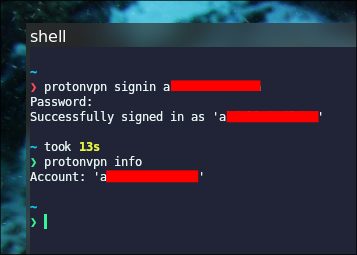
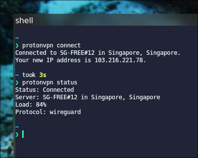
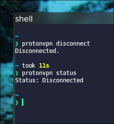
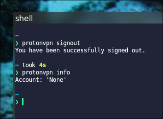
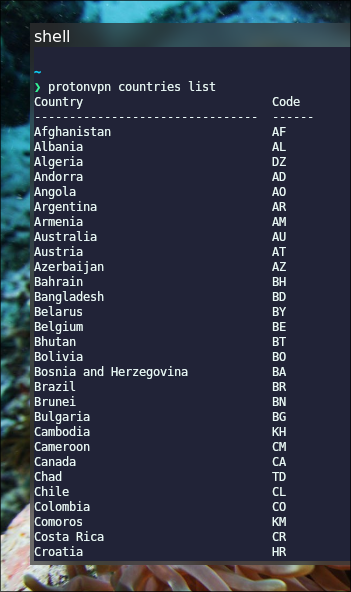
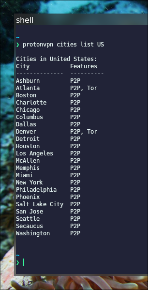
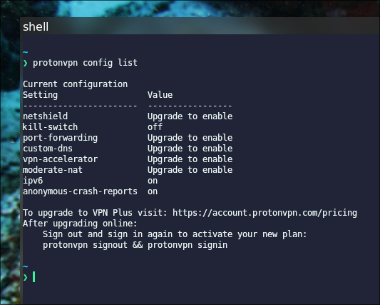

## Introduction to Proton

Proton (atau Proton AG) adalah perusahaan teknologi asal Swiss yang menawarkan berbagai layanan online yang berorientasi pada privasi. Perusahaan ini didirikan pada tahun 2014 oleh sekelompok ilmuan yang bertemu di CERN (_Conseil Européen pour la Recherche Nucléaire_ / Organisasi Eropa untuk Riset Nuklir) dan meluncurkan Proton Mail.[^1] Selain Proton Mail, Proton juga telah berkembang sejak dan memiliki beberapa layanan lainnya, seperti _Cloud Storate_, _Password Manager_, _VPN_, dan beberapa layanan lainnya.[^2] Saya akan membahas VPN dari Proton di artikel ini.

## What On Earth is VPN?

VPN atau _Virtual Private Network_ adalah sebuah teknologi yang dibuat dengan tujuan untuk melindungi privasi penggunanya ketika berselancar di internet. Dua ide utama VPN untuk mengamankan penggunanya adalah dengan:
1. Menyembunyikan _IP Address_.
2. Mengenkripsi jaringan internet.
Dengan demikian, kita dapat berselancar di internet secara _private_ tanpa perlu khawatir dilacak oleh orang lain dan diambil data _browsing_ kita untuk dijual ke pengiklan.[^3]

### How VPN Works?

Cara kerja VPN sebetulnya sangat sederhana: ketika kita menghubungkan perangkat kita ke server VPN dengan VPN client, otomatis kita akan membangun sebuah _tunnel_ yang terkenkripsi ke server VPN tersebut. Sehingga ketika kita berselancar di internet, perangkat kita akan menggunakan IP Address server VPN tersebut alih-alih _IP Address_ asli kita. 

Berikut ilustrasi cara kerja VPN:

[](https://bytebytego.com/guides/how-does-a-vpn-work/)

Berikut adalah 4 tahapan kerja VPN:[^4]
1. Kita (_client_) membuat tunnel yang aman antara perangkat yang kita gunakan dengan server VPN.
2. Data yang ditransmisikan dienkripsi.
3. _IP Address_ asli kita disembunyikan sehingga seolah-olah aktivitas internetnya berasal dari server VPN.
4. Lalu lintas internet kita dialihkan melalui server VPN.

### The Benefits

Dengan menggunakan VPN:
- **Encryption**: Transmisi data kita akan terenkripsi.
- **Privacy**: ISP (_Internet Service Provider_) tidak bisa melihat aktivitas kita.
- **Security**: Hacker tidak dapat membajak komputer kita.

### The Shortcomings

Beberapa kelemahannya:
- **Blockage**: VPN kita bisa saja di-_block_ oleh ISP atau DNS tertentu. 
- **Speed**: Koneksi yang lamban, karena server VPN yang jauh.
- **Trust**: Harus memastikan VPN _provider_-nya tidak jahat (mengambil data kita). 

## Installation

:::warning[Disclaimer!]

Artikel ini tidak disponsori oleh Proton!

:::

Pada artikel ini, saya akan memberikan tutorial untuk menggunakan Proton VPN yang berbasis **CLI (_Command Line Interface_)** saja. Oleh karena itu, penggunaan VPN berbasis GUI (_Graphical User Interface_) tidak di-cover pada artikel ini.

Selain itu, artikel ini juga mengasumsikan pembacanya sudah membuat akun di website proton. 

Berikut adalah cara meng-_install_ `proton-vpn-cli` di beberapa sistem operasi Linux:[^5]

|       Distro      |                  Command                                  |
|       ---         |                   ---                                     |
| **Debian/Ubuntu** | **`sudo apt install -y proton-vpn-cli`**                  |
| **Arch Linux**    | **`sudo pacman -Sy proton-vpn-cli`**                      |
| **Fedora**        | **`sudo dnf install proton-vpn-cli`**                     |
| **Opensuse**      | **`sudo zypper install proton-vpn protonvpn-cli`**        |

:::note

**NixOS:**  
Masukkan baris berikut di file konfigurasi (`/etc/nixos/configuration.nix`):

```nix
  environment.systemPackages = [
    pkgs.proton-vpn-cli
  ];
```

Atau jika menggunakan `nix-shell`:

```shell
nix-shell -p proton-vpn-cli
```

:::

Selain itu, `proton-vpn-cli` juga secara resmi dapat dijumpai di _repository_ Github:

::github{repo="ProtonVPN/proton-vpn-cli"}

Lebih lanjut tentang instalasi `proton-vpn-cli`, dapat dilihat di website resminya:

https://protonvpn.com/support/linux-cli


## Usage

Berikut adalah langkah-langkah penggunaan `proton-vpn-cli`:

### 1. Sign in

Kita perlu masuk ke akun kita terlebih dahulu, melalui CLI tentu saja.  
Perintahnya:

```shell
protonvpn signin <username/email>
```

Masukkan password pada _prompt_ _input_ password.

Untuk memastikan kita sudah _sign-in_:

```shell
protonvpn info
```



### 2. Connect

Untuk terhubung ke server VPN secara _random_, perintah sederhananya:

```shell
protonvpn connect
```

Untuk melihat status koneksi:

```shell
protonvpn status
```



### 3. Disconnect

Untuk memutuskan hubungan dengan server VPN:

```shell
protonvpn disconnect    
```

Kita bisa pastikan lagi status koneksinya dengan perintah:

```shell
protonvpn status
```



### 4. Sign out

Untuk keluar dari akun:

```shell
protonvpn signout
```

Untuk memastikannya kita sudah keluar:

```shell
protonvpn info
```



### Miscelleanous

#### Registered Countries

Kita dapat melihat daftar negara yang terdapat server VPN milik Proton:

```shell
protonvpn countries list
```



#### Connect to A Country

Untuk terhubung ke server di negara tertentu:

```shell
protonvpn connect --country <Country>
```

#### Registered Cities

Kita juga dapat melihat daftar kota di suatu negara yang terdapat server VPN Proton:

```shell
protonvpn cities list <Country Name/Country ID>
```



#### Connect to A City

Untuk terhubung ke server di negara tertentu:

```shell
protonvpn connect --city <City>
```

#### Config

Untuk menampilkan konfigurasinya:

```shell
protonvpn config list
```



> Tidak banyak yang dapat dilakukan di bagian konfigurasi ini kecuali kita sudah berlangganan.

Untuk mengeksplor lebih jauh fitur-fitur `proton-vpn-cli` ini:

```shell
protonvpn --help
```


[^1]: https://proton.me/about
[^2]: https://proton.me
[^3]: https://protonvpn.com/what-is-a-vpn
[^4]: https://bytebytego.com/guides/how-does-a-vpn-work/
[^5]: https://protonvpn.com/support/linux-cli

