## Introduction

Merujuk ke website resminya, `rclone` adalah sebuah _software_ (_open source_) yang digunakan untuk me-_manage_ penyimpanan di cloud melalui terminal (CLI / _command line interface_).[^1] Singkatnya, dengan menggunakan `rclone`, kita dapat mengakses, mengedit, menambahkan, dan menghapus file dan folder yang ada di berbagai cloud storage yang kita miliki, seperti Google Drive, OneDrive, Dropbox, Mega, dan masih banyak lagi, hanya dengan perintah-perintah "sederhana" di terminal.

Selain yang baru saja saya _mention_, masih ada banyak cloud storage lain yang di-_support_ oleh `rclone`. Totalnya lebih dari 70 platform cloud storage yang sudah di-_support_ oleh `rclone`. Untuk daftarnya, silakan merujuk pada halaman website official `rclone` berikut:

https://rclone.org/

Atau bisa juga dilihat di repository Github-nya:

::github{repo="rclone/rclone"}

:::info

Yang masih jadi perhatian saya hingga saat ini (minimal sampai artikel ini terakhir dimodifikasi), `rclone` masih belum _support_ [Terabox](https://www.terabox.com/). Padahal itu adalah cloud storage paling "dermawan" karena memberikan penggunanya akses ke penyimpanan sebesar 1 TB secara cuma-cuma alias gratis, di saat platform lain hanya berani memberi 1-20 GB untuk versi gratisnya.  

:::

## Installation 

Berikut adalah cara instalasinya di beberapa distro linux/UNIX:

|       Distro      |                  Command                    |
|       ---         |                   ---                       |
| **Debian/Ubuntu** | **`sudo apt install -y rclone`**            |
| **Arch Linux**    | **`sudo pacman -Sy rclone`**                |
| **Fedora**        | **`sudo dnf install rclone`**               |
| **Opensuse**      | **`sudo zypper install rclone`**            |
| **FreeBSD**       | **`sudo pkg install rclone`**               |

:::note

**NixOS:**  
Masukkan baris berikut di file konfigurasi (`/etc/nixos/configuration.nix`):

```nix
  environment.systemPackages = [
    pkgs.rclone
  ];
```

Atau jika menggunakan `nix-shell`:

```shell
nix-shell -p rclone
```

:::

Atau jika ingin melakukan instalasi menggunakan _binary_ dari source code-nya langsung atau via script, bisa merujuk ke website `rclone` untuk lebih detailnya:

https://rclone.org/install/

Untuk memastikan `rclone` sudah ter-_install_ di sistem kita:

```shell
rclone --version
```

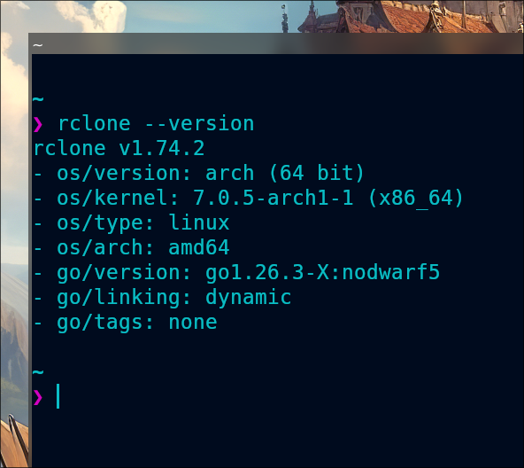

## Usage

Berikut adalah cara menggunakan `rclone`, mulai dari mengkonfigurasi hingga mengakses file. Sebagai catatan saja, semua proses ini hanya dapat dilakukan jika kita sudah memiliki akun di cloud storage tersebut. 

### Configuration

Karena ada lebih dari 70 cloud storage yang di-_support_ oleh `rclone`, jadi saya hanya akan mencontohkan 6 diantaranya saja. Btw, semua konfigurasi cloud storage kita akan disimpan di `~/.config../images/rclone/rclone.conf`.

Untuk memastikan lokasi file konfigurasinya, kita bisa periksa dengan perintah:

```shell
rclone config file
```

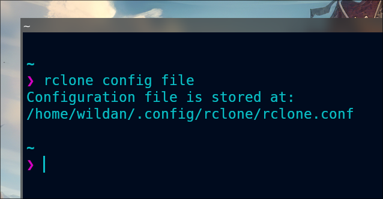

#### 1. Google Drive

> [Google Drive](https://drive.google.com/) menyediakan [**15 GB**] penyimpanan gratis kepada penggunanya. 

Persyaratan yang perlu dipenuhi:
- token

Berikut adalah langkah-langkah (yang paling sederhana) untuk mengkonfigurasi Google Drive.[^2]  

```shell
rclone config
```

Selanjutnya, kita akan diarahkan pada proses interaktif:

```shell
No remotes found, make a new one?
n) New remote
r) Rename remote
c) Copy remote
s) Set configuration password
q) Quit config
n/r/c/s/q> n
name> gdrive # ini boleh diisi sesuai nama yang ingin kalian buat.
Type of storage to configure.
Choose a number from below, or type in your own value
[snip]
XX / Google Drive
   \ "drive"
[snip]
Storage> drive
Google Application Client Id - leave blank normally.
client_id>
Google Application Client Secret - leave blank normally.
client_secret>
Scope that rclone should use when requesting access from drive.
Choose a number from below, or type in your own value
 1 / Full access all files, excluding Application Data Folder.
   \ "drive"
 2 / Read-only access to file metadata and file contents.
   \ "drive.readonly"
   / Access to files created by rclone only.
 3 | These are visible in the drive website.
   | File authorization is revoked when the user deauthorizes the app.
   \ "drive.file"
   / Allows read and write access to the Application Data folder.
 4 | This is not visible in the drive website.
   \ "drive.appfolder"
   / Allows read-only access to file metadata but
 5 | does not allow any access to read or download file content.
   \ "drive.metadata.readonly"
scope> 1
Service Account Credentials JSON file path - needed only if you want use SA instead of interactive login.
service_account_file>
Remote config
Use web browser to automatically authenticate rclone with remote?
 * Say Y if the machine running rclone has a web browser you can use
 * Say N if running rclone on a (remote) machine without web browser access
If not sure try Y. If Y failed, try N.
y) Yes
n) No
y/n> y
If your browser doesn't open automatically go to the following link: http://127.0.0.1:53682/auth
Log in and authorize rclone for access
Waiting for code...
Got code
Configure this as a Shared Drive (Team Drive)?
y) Yes
n) No
y/n> n
Configuration complete.
Options:
type: drive
- client_id:
- client_secret:
- scope: drive
- root_folder_id:
- service_account_file:
- token: {"access_token":"XXX","token_type":"Bearer","refresh_token":"XXX","expiry":"2014-03-16T13:57:58.955387075Z"}
Keep this "remote" remote?
y) Yes this is OK
e) Edit this remote
d) Delete this remote
y/e/d> y
```

Kita bisa melihat konfigurasi Google Drive:

```shell
rclone config show <nama_drive>
```

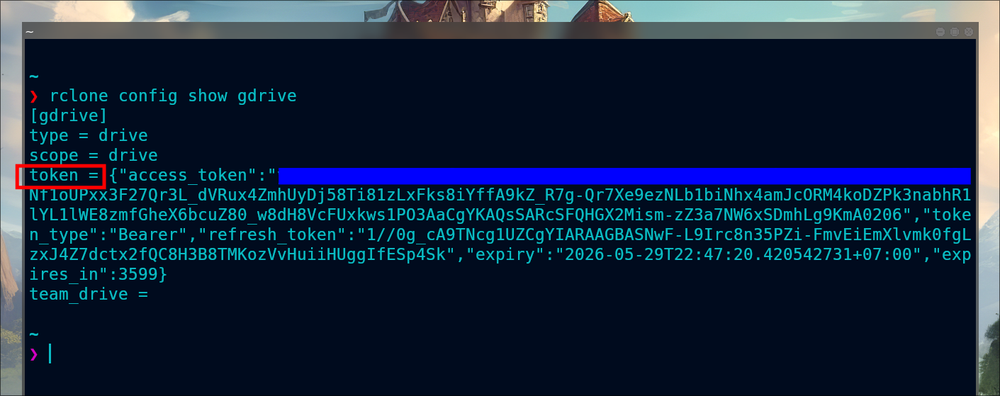

#### 2. Mega

> [Mega](https://mega.io/) menyediakan [**20 GB**] penyimpanan gratis kepada penggunanya. 

Persyaratan yang perlu dipenuhi:
- username (email)
- password

Berikut adalah langkah-langkah (yang paling sederhana) untuk mengkonfigurasi Mega.[^3]  

```shell
rclone config
```

Selanjutnya, kita akan diarahkan pada proses interaktif:

```shell
No remotes found, make a new one?
n) New remote
s) Set configuration password
q) Quit config
n/s/q> n
name> mega # ini boleh diisi sesuai nama yang ingin kalian buat.
Type of storage to configure.
Choose a number from below, or type in your own value
[snip]
XX / Mega
   \ "mega"
[snip]
Storage> mega
User name
user> you@example.com
Password.
y) Yes type in my own password
g) Generate random password
n) No leave this optional password blank
y/g/n> y
Enter the password:
password:
Confirm the password:
password:
Remote config
Configuration complete.
Options:
- type: mega
- user: you@example.com
- pass: *** ENCRYPTED ***
Keep this "remote" remote?
y) Yes this is OK
e) Edit this remote
d) Delete this remote
y/e/d> y
```

Kita bisa melihat konfigurasi Mega:

```shell
rclone config show <nama_drive>
```

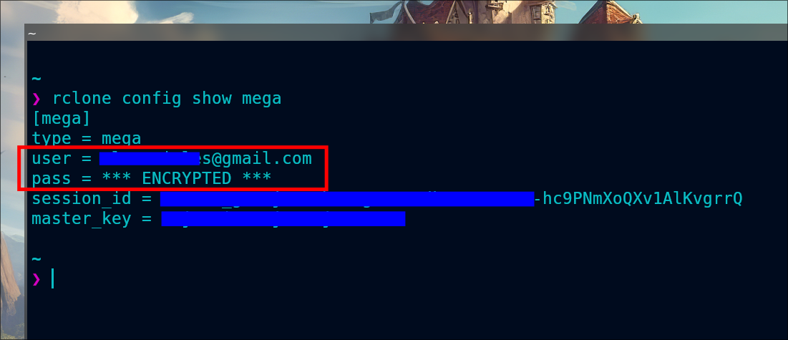

#### 3. Proton Drive

> [Proton Drive](https://proton.me/drive) menyediakan [**2 GB**] penyimpanan gratis kepada penggunanya. 

Persyaratan yang perlu dipenuhi:
- username (email)
- password

Berikut adalah langkah-langkah (yang paling sederhana) untuk mengkonfigurasi Proton Drive.[^4]  

```shell
rclone config
```

Selanjutnya, kita akan diarahkan pada proses interaktif:

```shell
No remotes found, make a new one?
n) New remote
s) Set configuration password
q) Quit config
n/s/q> n
name> protondrive # ini boleh diisi sesuai nama yang ingin kalian buat.
Type of storage to configure.
Choose a number from below, or type in your own value
[snip]
XX / Proton Drive
   \ "protondrive"
[snip]
Storage> protondrive
User name
user> you@protonmail.com
Password.
y) Yes type in my own password
g) Generate random password
n) No leave this optional password blank
y/g/n> y
Enter the password:
password:
Confirm the password:
password:
Option 2fa.
2FA code (if the account requires one)
Enter a value. Press Enter to leave empty.
2fa> 123456
Remote config
Configuration complete.
Options:
- type: protondrive
- user: you@protonmail.com
- pass: *** ENCRYPTED ***
Keep this "remote" remote?
y) Yes this is OK
e) Edit this remote
d) Delete this remote
y/e/d> y
```

Kita bisa melihat konfigurasi Proton Drive:

```shell
rclone config show <nama_drive>
```

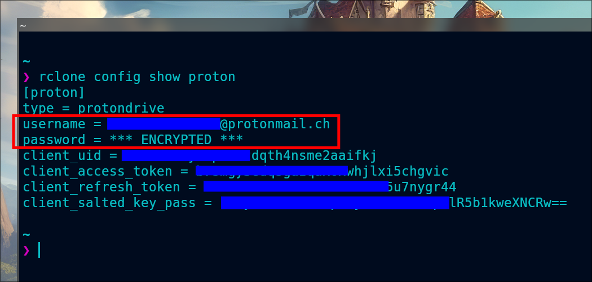

#### 4. One Drive

> [One Drive](https://onedrive.live.com/) menyediakan [**5 GB**] penyimpanan gratis kepada penggunanya. 

Persyaratan yang perlu dipenuhi:
- token

Berikut adalah langkah-langkah (yang paling sederhana) untuk mengkonfigurasi One Drive.[^5]  

```shell
rclone config
```

Selanjutnya, kita akan diarahkan pada proses interaktif:

```shell
e) Edit existing remote
n) New remote
d) Delete remote
r) Rename remote
c) Copy remote
s) Set configuration password
q) Quit config
e/n/d/r/c/s/q> n
name> onedrive # ini boleh diisi sesuai nama yang ingin kalian buat.
Type of storage to configure.
Enter a string value. Press Enter for the default ("").
Choose a number from below, or type in your own value
[snip]
XX / Microsoft OneDrive
   \ "onedrive"
[snip]
Storage> onedrive
Microsoft App Client Id
Leave blank normally.
Enter a string value. Press Enter for the default ("").
client_id>
Microsoft App Client Secret
Leave blank normally.
Enter a string value. Press Enter for the default ("").
client_secret>
Edit advanced config? (y/n)
y) Yes
n) No
y/n> n
Remote config
Use web browser to automatically authenticate rclone with remote?
 * Say Y if the machine running rclone has a web browser you can use
 * Say N if running rclone on a (remote) machine without web browser access
If not sure try Y. If Y failed, try N.
y) Yes
n) No
y/n> y
If your browser doesn't open automatically go to the following link: http://127.0.0.1:53682/auth
Log in and authorize rclone for access
Waiting for code...
Got code
Choose a number from below, or type in an existing value
 1 / OneDrive Personal or Business
   \ "onedrive"
 2 / Sharepoint site
   \ "sharepoint"
 3 / Type in driveID
   \ "driveid"
 4 / Type in SiteID
   \ "siteid"
 5 / Search a Sharepoint site
   \ "search"
Your choice> 1
Found 1 drives, please select the one you want to use:
0: OneDrive (business) id=b!Eqwertyuiopasdfghjklzxcvbnm-7mnbvcxzlkjhgfdsapoiuytrewqk
Chose drive to use:> 0
Found drive 'root' of type 'business', URL: https://org-my.sharepoint.com/personal/you/Documents
Is that okay?
y) Yes
n) No
y/n> y
Configuration complete.
Options:
- type: onedrive
- token: {"access_token":"youraccesstoken","token_type":"Bearer","refresh_token":"yourrefreshtoken","expiry":"2018-08-26T22:39:52.486512262+08:00"}
- drive_id: b!Eqwertyuiopasdfghjklzxcvbnm-7mnbvcxzlkjhgfdsapoiuytrewqk
- drive_type: business
Keep this "remote" remote?
y) Yes this is OK
e) Edit this remote
d) Delete this remote
y/e/d> y
```

Kita bisa melihat konfigurasi One Drive:

```shell
rclone config show <nama_drive>
```

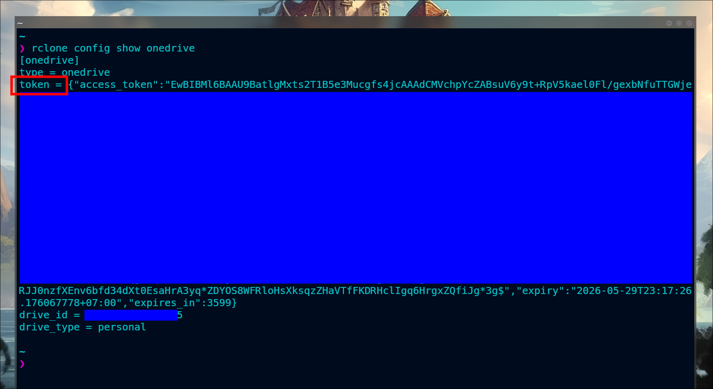

#### 5. Backblaze B2

> [Backblaze B2](https://www.backblaze.com/cloud-storage) menyediakan [**10 GB**] penyimpanan gratis kepada penggunanya. 

Persyaratan yang perlu dipenuhi:
- account (application key ID)
- key (application key)

Berikut adalah langkah-langkah (yang paling sederhana) untuk mengkonfigurasi Backblaze.[^6]  

```shell
rclone config
```

Selanjutnya, kita akan diarahkan pada proses interaktif:

```shell
No remotes found, make a new one\?
n) New remote
q) Quit config
n/q> n
name> backblaze # ini boleh diisi sesuai nama yang ingin kalian buat.
Type of storage to configure.
Choose a number from below, or type in your own value
[snip]
XX / Backblaze B2
   \ "b2"
[snip]
Storage> b2
Account ID or Application Key ID
account> 123456789abc
Application Key
key> 0123456789abcdef0123456789abcdef0123456789
Endpoint for the service - leave blank normally.
endpoint>
Remote config
Configuration complete.
Options:
- type: b2
- account: 123456789abc
- key: 0123456789abcdef0123456789abcdef0123456789
- endpoint:
Keep this "remote" remote?
y) Yes this is OK
e) Edit this remote
d) Delete this remote
y/e/d> y
```

Kita bisa melihat konfigurasi Backblaze:

```shell
rclone config show <nama_drive>
```

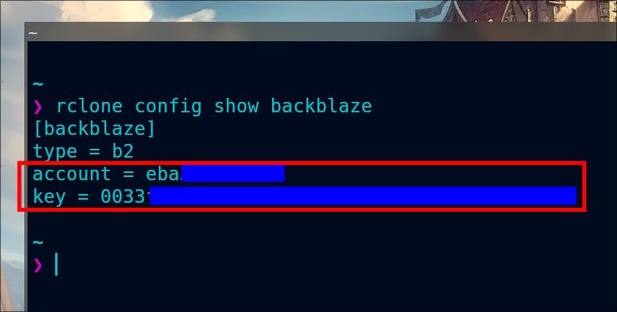

#### 6. Koofr

> [Koofr](https://koofr.eu/) menyediakan [**10 GB**] penyimpanan gratis kepada penggunanya. 

Persyaratan yang perlu dipenuhi:
- username (email)
- password

Berikut adalah langkah-langkah (yang paling sederhana) untuk mengkonfigurasi Koofr.[^7]  

```shell
rclone config
```

Selanjutnya, kita akan diarahkan pada proses interaktif:

```shell
No remotes found, make a new one?
n) New remote
s) Set configuration password
q) Quit config
n/s/q> n
name> koofr # ini boleh diisi sesuai nama yang ingin kalian buat.
Option Storage.
Type of storage to configure.
Choose a number from below, or type in your own value.
[snip]
22 / Koofr, Digi Storage and other Koofr-compatible storage providers
   \ (koofr)
[snip]
Storage> koofr
Option provider.
Choose your storage provider.
Choose a number from below, or type in your own value.
Press Enter to leave empty.
 1 / Koofr, https://app.koofr.net/
   \ (koofr)
 2 / Digi Storage, https://storage.rcs-rds.ro/
   \ (digistorage)
 3 / Any other Koofr API compatible storage service
   \ (other)
provider> 1    
Option user.
Your user name.
Enter a value.
user> USERNAME
Option password.
Your password for rclone (generate one at https://app.koofr.net/app/admin/preferences/password).
Choose an alternative below.
y) Yes, type in my own password
g) Generate random password
y/g> y
Enter the password:
password:
Confirm the password:
password:
Edit advanced config?
y) Yes
n) No (default)
y/n> n
Remote config
--------------------
[koofr]
type = koofr
provider = koofr
user = USERNAME
password = *** ENCRYPTED ***
--------------------
y) Yes this is OK (default)
e) Edit this remote
d) Delete this remote
y/e/d> y
```

Kita bisa melihat konfigurasi Koofr:

```shell
rclone config show <nama_drive>
```

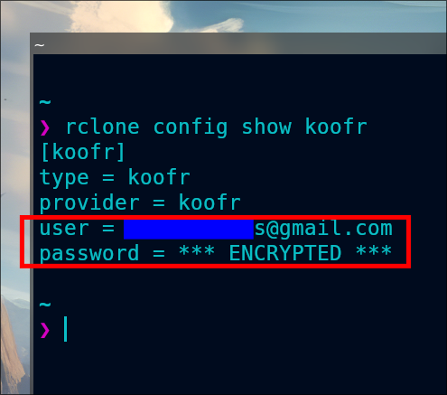

#### Listing remotes

Sekarang, kita dapat melihat daftar cloud storage yang sudah terkonfigurasi:

```shell
rclone listremotes
```

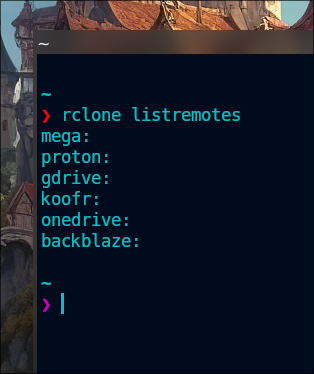

#### Set Config Password

Kita bisa menambahkan password untuk konfigurasi `rclone` kita, sehingga tidak sembarangan orang dapat mengaksesnya.

```shell
rclone config
```

Kemudian, kita tinggal mengikuti alur pembuatan passwordnya:

```shell
Current remotes:

Name                 Type
====                 ====
backblaze            b2
gdrive               drive
koofr                koofr
mega                 mega
onedrive             onedrive
proton               protondrive

e) Edit existing remote
n) New remote
d) Delete remote
r) Rename remote
c) Copy remote
s) Set configuration password
q) Quit config
e/n/d/r/c/s/q> s

Your configuration is not encrypted.
If you add a password, you will protect your login information to cloud services.
a) Add Password
q) Quit to main menu
a/q> a
Enter NEW configuration password:
password:
Confirm NEW configuration password:
password:
Password set
Your configuration is encrypted.
c) Change Password
u) Unencrypt configuration
q) Quit to main menu
c/u/q>
```

Sekarang, tidak semua orang dapat mengakses configurasi rclone kita, pun juga tidak sembarang orang dapat menggunakan rclone untuk terhubung ke cloud storage yang kita punya, karena mereka perlu meng-_input_-kan password terlebih dahulu.

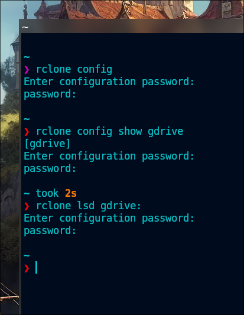

Kalau kita ingin membatalkan password konfigurasi `rclone`-nya, juga bisa:

```shell
rclone config
```

Tinggal ikuti alur untuk menghapus password konfigurasinya:

```shell
Enter configuration password:
password:
Current remotes:

Name                 Type
====                 ====
backblaze            b2
gdrive               drive
koofr                koofr
mega                 mega
onedrive             onedrive
proton               protondrive

e) Edit existing remote
n) New remote
d) Delete remote
r) Rename remote
c) Copy remote
s) Set configuration password
q) Quit config
e/n/d/r/c/s/q> s

Your configuration is encrypted.
c) Change Password
u) Unencrypt configuration
q) Quit to main menu
c/u/q> u
Your configuration is not encrypted.
If you add a password, you will protect your login information to cloud services.
a) Add Password
q) Quit to main menu
a/q>
```

### Access

Setelah konfigurasi terpasang, kita sebetulnya sudah dapat mengakses cloud storage kita via terminal, mulai dari mendaftar isi file dan folder, membuat/mengedit/menambahkan/menghapus file dan folder, dan masih banyak lagi.

#### Mounting

Cara paling praktis adalah me-_mounting_ cloud storage kita terlebih dahulu.

```shell
rclone mount <nama>: <mount_point>
```

Untuk melihat apakah sudah ter-_mounting_:

```shell
df -h
```

Contohnya, saya akan me-_mounting_ Google Drive saya:
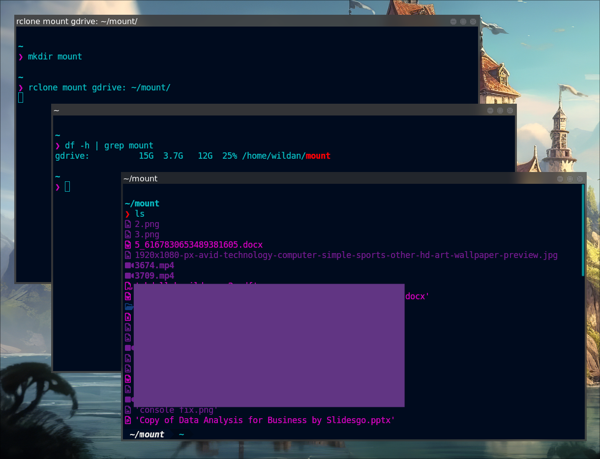

Jika sudah ter-_mounting_, praktis kita sudah dapat memperlakukan cloud storage tersebut seperti folder atau direktori pada umumnya di komputer kita. 
 
> Untuk lebih tau cara menggunakan perintahnya secara detail:
> ```shell
> rclone mount --help
> ```

:::note

Jika sudah tidak perlu lagi, kita bisa meng-_unmout_ dengan perintah:

```shell
fusermount -u <mount_point>
```

:::

#### Listing

Tapi, tanpa me-_mounting_ pun, kita masih dapat melakukan beberapa operasi yang spesifik, salah satunya adalah mendaftar file atau direktori/folder (_listing_). Berikut adalah beberapa perintahnya:

1. Mendaftar semua file dan direktori.

```shell
rclone ls <nama>:
```

> Untuk lebih tau cara menggunakan perintahnya secara detail:
> ```shell
> rclone ls --help
> ```

2. Mendaftar direktori/container/bucket saja.

```shell
rclone lsd <nama>:
```

> Untuk lebih tau cara menggunakan perintahnya secara detail:
> ```shell
> rclone lsd --help
> ```

3. Mendaftar semua file dan direktori, berikut dengan modification time, size, dan path.

```shell
rclone lsl <nama>:
```

> Untuk lebih tau cara menggunakan perintahnya secara detail:
> ```shell
> rclone lsl --help
> ```

4. Mendaftar file dan direktori dengan struktur.

```shell
rclone tree <nama>:
```

> Untuk lebih tau cara menggunakan perintahnya secara detail:
> ```shell
> rclone tree --help
> ```

#### Creating

Kita juga bisa membuat direktori dan file baru.

1. Membuat direktori baru.

```shell
rlcone mkdir <nama>:/<direktori_baru>
```

> Untuk lebih tau cara menggunakan perintahnya secara detail:
> ```shell
> rclone mkdir --help
> ```

2. Membuat file baru.

```shell
rclone touch <nama>:/<file_baru>
```

> Untuk lebih tau cara menggunakan perintahnya secara detail:
> ```shell
> rclone touch --help
> ```

#### Uploading & Downloading

Kita juga bisa menambahkan (meng-_upload_ dan men-_download_) file dan direktori/folder.

Untuk meng-_upload_/men-_download_ file dan direktori/folder, kita dapat menggunakan salah satu diantara dua opsi berikut:
- `rclone copy`: untuk meng-_copy_/meng-_upload_/men-_download_ file & direktory.
- `rclone move`: untuk memindahkan/meng-_upload_/men-_download_ file & direktory.

```shell
rclone copy -P source:path destination:path
```

:::info

Jika ingin meng-_copy_ direktori, jangan lupa menambahkan path/direktori yang ingin di-_copy_ di _destination_.
Contoh:

```shell
rclone copy test/ gdrive:/direktori_baru/test
```

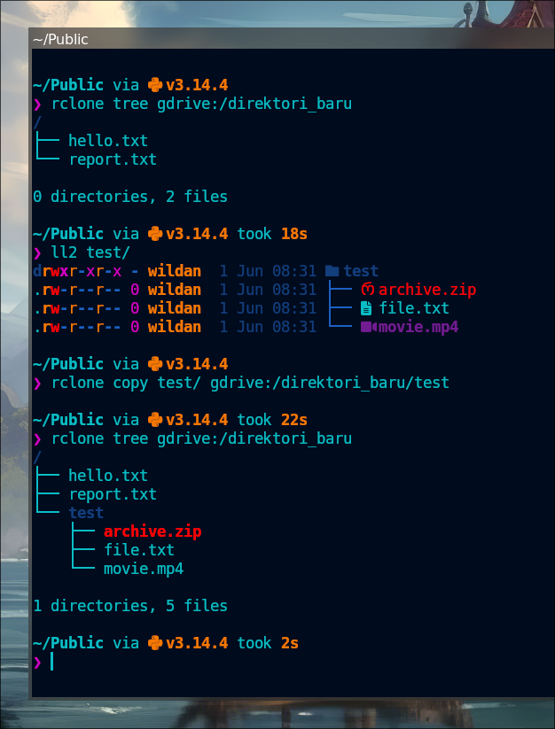

:::

> Untuk lebih tau cara menggunakan perintahnya secara detail:
> ```shell
> rclone copy --help
> ```

```shell
rclone move -P source:path destination:path
```

:::info

Jika ingin meng-_copy_ direktori, jangan lupa menambahkan path/direktori yang ingin di-_copy_ di _destination_.
Contoh:

```shell
rclone move coba/ gdrive:/direktori_baru/coba
```

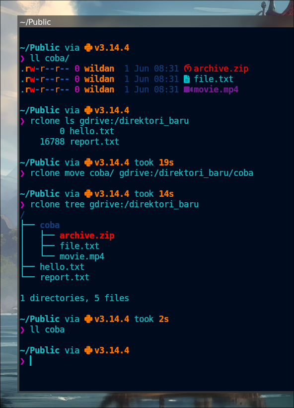

:::

> Untuk lebih tau cara menggunakan perintahnya secara detail:
> ```shell
> rclone move --help
> ```

#### Deleting

Kita bisa menghapus file dan direktori.

Untuk menghapus direktori dan seluruh isinya:

```shell
rclone purge remote:path
```

> Untuk lebih tau cara menggunakan perintahnya secara detail:
> ```shell
> rclone purge --help
> ```

Untuk menghapus file, kita punya 2 cara:

1. Menghapus file secara individual.

```shell
rclone deletefile remote:path/<file_name>
```

> Untuk lebih tau cara menggunakan perintahnya secara detail:
> ```shell
> rclone deletefile --help
> ```

2. Menghapus file dengan kriteria tertentu.

Misalnya, saya ingin menghapus file yang ukurannya 0 KB.

```shell
rclone delete remote:path --max-size 1K
```

:::info

Perintah di atas berarti, rclone akan menghapus semua file yang berukuran kurang dari 1 KB di direktori (dan sub-direktori) yang di-_input_-kan.

:::

> Untuk lebih tau cara menggunakan perintahnya secara detail:
> ```shell
> rclone delete --help
> ```

#### Providing link

Kita juga bisa membuat link untuk file atau direktori yang ingin kita bagikan:

1. Membuat like untuk file.

```shell
rclone link remote:path/to/file 
```

2. Membuat link untuk direktori/folder.

```shell
rclone link remote:path/to/folder
```

> Untuk lebih tau cara menggunakan perintahnya secara detail:
> ```shell
> rclone link --help
> ```

#### GUI

Jika kita ingin proses manajemen cloud storage-nya lebih interaktif, kita bisa menfaatkan fitur GUI `rclone` yang akan ditampilkan melaui interface web:

```shell
rclone gui --rc-web-gui-no-open-browser 
```

Nanti, akan muncul alamat url untuk membuka web-nya. Pastikan kita meng-_copy-paste_ semua url yang muncul (termasuk creds-nya).

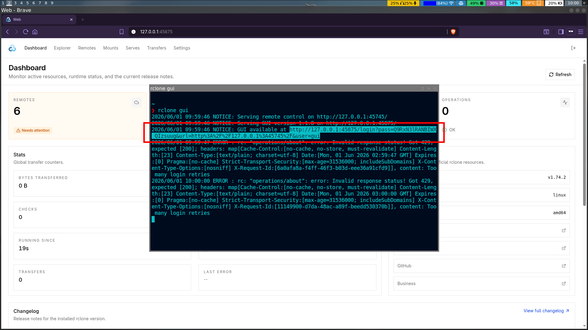

> Untuk lebih tau cara menggunakan perintahnya secara detail:
> ```shell
> rclone gui --help
> ```

Untuk mengeksplorasi perintah-perintah dan kemampuan dari rclone yang belum dibahas di sini, silakan cari tahu sendiri dengan perintah:

```shell
rclone help
```

Oke, sekian dulu tutorial `rclone`.
Terima kasih sudah mampir.


[^1]: https://rclone.org/
[^2]: https://rclone.org/drive/
[^3]: https://rclone.org/mega/
[^4]: https://rclone.org/protondrive/
[^5]: https://rclone.org/onedrive/
[^6]: https://rclone.org/b2/
[^7]: https://koofr.eu/