Holaa!!

Saya akan berbagi beberapa RDP client yang biasa saya gunakan untuk melakukan remote desktop. BTW, RDP atau *Remote Desktop Protocol* adalah salah satu protokol komunikasi dalam jaringan komputer yang dikembangkan awalnya oleh **Microsoft** untuk melakukan remote akses berbasis GUI (*Graphical User Interface*)[^1]. Kemudian, protokol ini juga dibawa ke *environment* linux sehingga RDP tidak hanya dapat digunakan di Windows (as a microsoft product obviously) saja, tetapi juga di linux.

> **Note:**
>
> Sederhananya, RDP memungkinkan kita mengakses komputer dari jarak jauh.

Berikut adalah 3 RDP client yang biasa saya gunakan untuk melakukan remote desktop (khususnya di linux - **[Archlinux](https://archlinux.org/)**, hehe):

## 1. xfreerdp
Tools yang satu ini adalah tools yang paling saya sukai, setidaknya karena 2 hal:

**[+]** Xfreerdp adalah rdp client yang berbasis cli (*command line interface*), yang berarti bahwa software ini relatif ringan karena memang tidak memerlukan gui sebagai *interface*-nya.

**[+]** Meskipun demikian, xfreerdp juga kaya akan fitur-fiturnya, salah satunya adalah fitur ***"dynamic resolution"***-nya (kita lihat nanti).

**[-]** Kekurangannya (walaupun sangat minor - menurut saya) adalah perintah-perintahnya yang tidak familiar, sehingga kalau saya sudah lama tidak menggunakan xfreerdp, saya perlu melihat ulang cara memakainya (re: sulit diingat).

### Install
Instalasinya:
| No  |           Distro                                                                  |             Install               |
| --- |           -----                                                                   |              -----                |
|  1  |   [**Debian/Ubuntu**](https://packages.debian.org/bookworm/freerdp2-x11)          |  `sudo apt install freerdp2-x11`  |
|  2  |   [**Arch**](https://archlinux.org/packages/extra/x86_64/freerdp2/)               |  `sudo pacman -S freerdp2`        |
|  3  |   [**OpenSuse**](https://software.opensuse.org/package/xfreerdp)                  |  `sudo zypper in xfreerdp`        |
|  4  |   [**Fedora**](https://packages.fedoraproject.org/pkgs/freerdp/freerdp/)          |  `sudo dnf install freerdp`       |
|  5  |   [**Windows**](https://cloudbase.it/freerdp-for-windows-nightly-builds/)         |                -                  |

### How to Use

Perintah dasar untuk menggunakan xfreerdp:
```shell
xfreerdp /v:{IP} /u:{username} /p:{password}
```
untuk mengakses domain tertentu, tinggal ditambahkan `/d:`:
```shell
xfreerdp /v:{IP} /u:{username} /p:{password} /d:{domain}
```
kalau ingin meng-*ignore certificate* juga bisa dengan menambahkan flag `/cert-ignore:`:
```shell
xfreerdp /v:{IP} /u:{username} /p:{password} /cert-ignore
``` 
khusus ke windows (di tutorial ini saya hanya mencoba ke windows 7 saja), kita perlu menambahkan flag `/tls-seclevel:0` karena jika tidak diset, maka tidak bisa terhubung karena secara default xfreerdp men-setting `tls-seclevel`-nya ke 1.
```shell
xfreerdp /v:{IP} /u:{username} /p:{password} /tls-seclevel:0
```
Nah, kalau mau mengaktifkan fitur *dynamic resolution*-nya, kita bisa menambahkan `/dynamic-resolution`. 
```shell
xfreerdp /v:{IP} /u:{username} /p:{password} /dynamic-resolution
```

Dengan menambahkan flag tersebut, artinya nanti resolusi desktop yang kita remote bisa menyesuaikan dengan ukuran window atau jendela-nya. Untuk buktinya akan saya tunjukkan di bagian demo di bawah.

Untuk mengaktifkan fitur *sound*-nya, kita bisa menambahkan `/sound`.
```shell
xfreerdp /v:{IP} /u:{username} /p:{password} /sound
```

Mau tau lebih banyak apa saja yang bisa dilakukan xfreerdp untuk remote desktop? Tinggal baca-baca dokumentasi `help`-nya:
```shell
xfreerdp /?
```

:::info

**Wayland**

Untuk menjalankan freerdp di wayland, gunakan perintah `wlfreerdp`.

:::

### Demo

#### Linux to Linux
Kita coba remote ke linux (Debian):
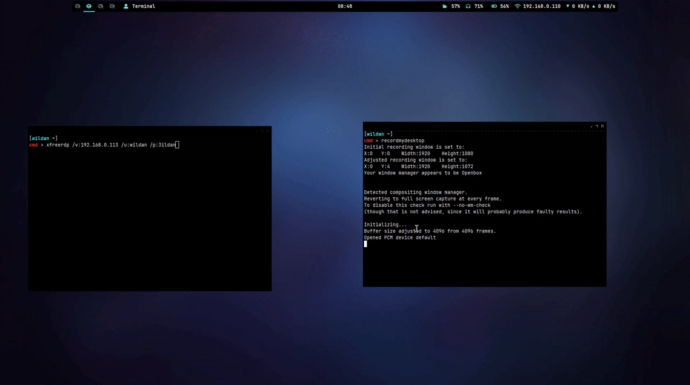

Berhasil.

#### Linux to Windows (Windows 7)
Sekarang, kita coba remote ke windows (Windows 7):
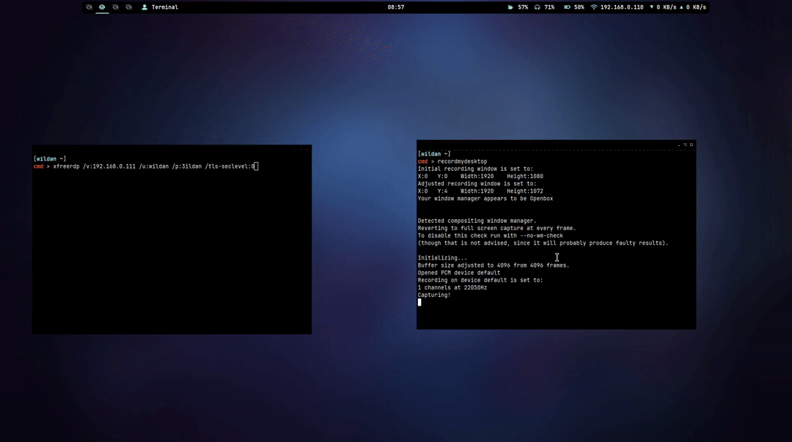

Berhasil.

#### Dynamic Resolution
Kita coba fitur *dynamic resolution*-nya:
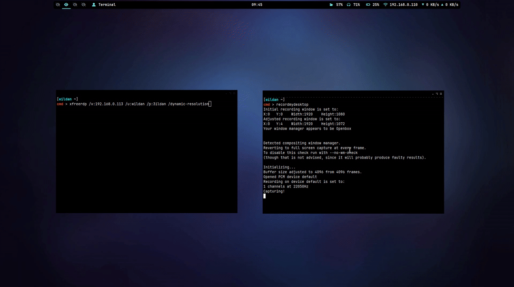

Berhasil.

## 2. rdesktop 
Rdesktop menurut saya adalah alternatif dari xfreerdp yang juga tidak boleh dianggap sepele karena sama-sama spesies rdp client yang berbasis cli.

**[+]** Keunggulan dari rdesktop dibanding xfreerdp menurut saya adalah *command*-nya yang relatif mudah diingat. 

**[-]** Tapi, kekurangannya (yang menurut saya fatal) jika dibandingkan dengan xfreerdp adalah rdesktop tidak mempunyai fitur "***dynamic resolution***" (koreksi jika saya salah :v). 

### Install
Instalasinya:
| No  |           Distro                                                                  |             Install               |
| --- |           -----                                                                   |              -----                |
|  1  |   [**Debian/Ubuntu**](https://packages.debian.org/bookworm/rdesktop)              |  `sudo apt install rdesktop`      |
|  2  |   [**Arch**](https://archlinux.org/packages/extra/x86_64/rdesktop/)               |  `sudo pacman -S rdesktop`        |
|  3  |   [**OpenSuse**](https://software.opensuse.org/package/rdesktop)                  |  `sudo zypper in rdesktop`        |
|  4  |   [**Fedora**](https://packages.fedoraproject.org/pkgs/rdesktop/rdesktop/)        |  `sudo dnf install rdesktop`      |

### How to Use

Perintah dasar untuk menggunakan rdesktop sesimpel:
```shell
rdesktop -u {username} -p {password} {IP}
```
untuk mengakses domain tertentu, tinggal ditambahkan `-d`:
```shell
rdesktop -u {username} -p {password} {IP} -d {domain} 
```
kalau ingin meng-*ignore certificate* juga bisa dengan menambahkan flag `-0`:
```shell
rdesktop -u {username} -p {password} {IP} -O
```
Mau tau lebih banyak apa saja yang bisa dilakukan rdesktop untuk remote desktop? Tinggal baca-baca dokumentasi `help`-nya:
```shell
rdekstop -h
```

### Demo
#### Linux to Linux
Kita coba remote ke linux (Debian):


Berhasil.

#### Linux to Windows (Windows 7)
Sekarang, kita coba remote ke windows (Windows 7):
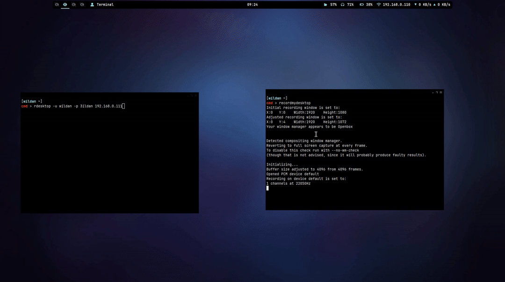

Berhasil.

## 3. remmina
Nah, ini adalah tools yang *beginner-friendly* karena interface-nya menggunakan gui. Jadi, bagi kalian yang tidak biasa menggunakan tools cli-based, remmina adalah jalan ~~satu-satunya~~ salah satu opsi. Meskipun demikian, remmina juga tetap bisa dijalankan via cli.

**[+]** Tentu saja berbasis GUI adalah poin positif karena memudahkan kita yang malas (atau tidak terbiasa) menggunakan command line.

**[+]** Remmina juga kaya akan fitur-fitur penting. Bahkan ada juga fitur yang saya sukai di remmina (seperti yang juga ada di xfreerdp), yaitu fitur ***dynamic resolution***.

**[+]** Tapi, kehadiran remmina menggunakan GUI juga justru menjadi kekurangannya juga karena pasti software ini menjadi rakus *resource* sehingga bisa saja menjadikan komputer kalian menjadi lemot (apalagi yang *resource*-nya memang "seadanya").

### Install
Instalasinya:
| No  |           Distro                                                                  |             Install               |
| --- |           -----                                                                   |              -----                |
|  1  |   [**Debian/Ubuntu**](https://packages.debian.org/bookworm/remmina)               |  `sudo apt install remmina`       |
|  2  |   [**Arch**](https://archlinux.org/packages/extra/x86_64/remmina/)                |  `sudo pacman -S remmina`         |
|  3  |   [**OpenSuse**](https://software.opensuse.org/package/remmina)                   |  `sudo zypper in remmina`         |
|  4  |   [**Fedora**](https://packages.fedoraproject.org/pkgs/remmina/remmina/)          |  `sudo dnf install remmina`       |


### How to Use

Untuk menjalankan remmina, kita bisa mengetikkan `remmina` di terminal atau mencari dan membukanya via app launcher.
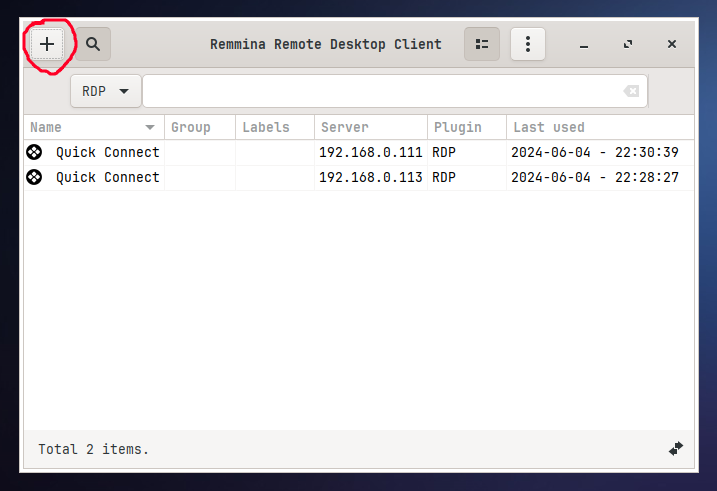

Kemudian, kita klik icon plus atau tanda tambah di pojok kiri atas.

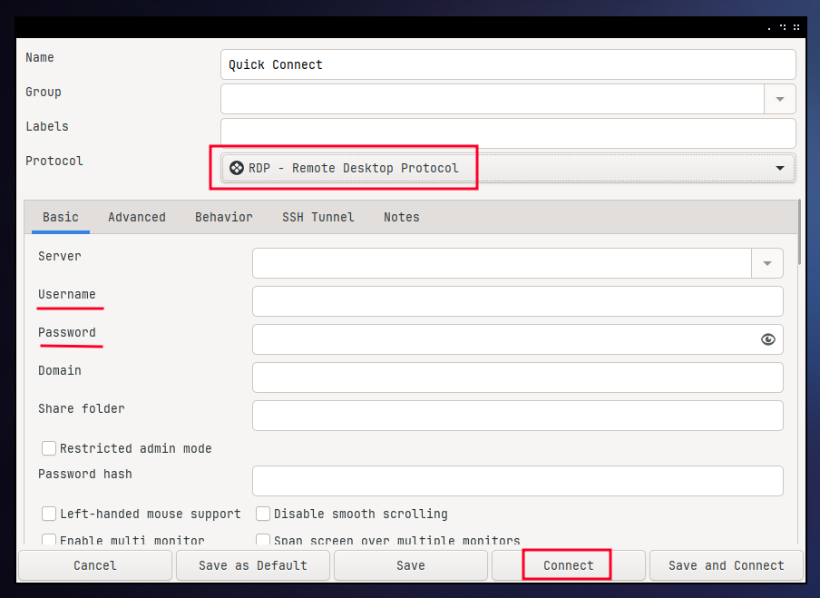
Kita hanya perlu memilih RDP, kemudian memasukkan ***username*** dan ***password*** dan klik ***Connect***.

Atau jika kita ingin me-*launch* remmina dari terminal via *command line*, kita bisa menggunakan perintah berikut:
```shell
remmina -c rdp://{username}:{password}@{IP}
``` 
Yang perlu diketahui jika ingin melakukan remote desktop ke windows (dalam konteks ini Windows 7), jangan lupa mengganti **TLS Security Level**-nya ke **0**.
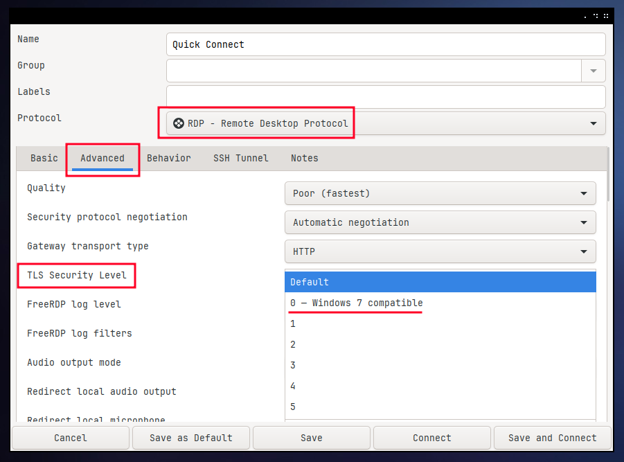

Bagaimana cara mengaktifkan fitur ***dynamic resolution***-nya? Kita bisa mengaturnya langsung dari window remmina yang sedang aktif dengan meng-klik icon di bagian sebelah kiri: ***"Toogle dynamic resolution update"***. Kita akan lihat fiturnya di bagian demonstrasi di bawah.
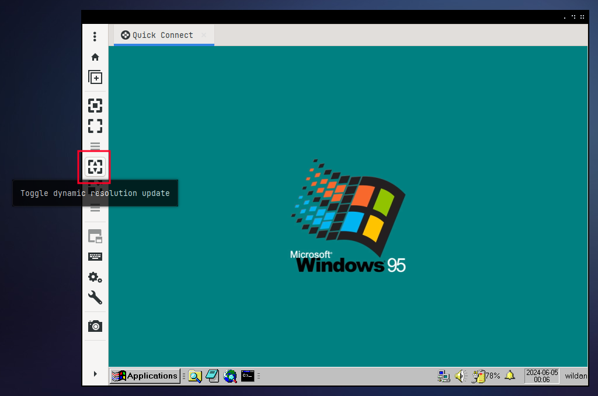

Mau tau lebih banyak apa saja yang bisa dilakukan rdesktop untuk remote desktop? Kalian bisa mengeksplorasi *software* GUI remmina atau baca-baca dokumentasi `help`-nya:
```shell
remmina -h
```

### Demo
#### Linux to Linux
Kita coba remote ke linux (Debian):
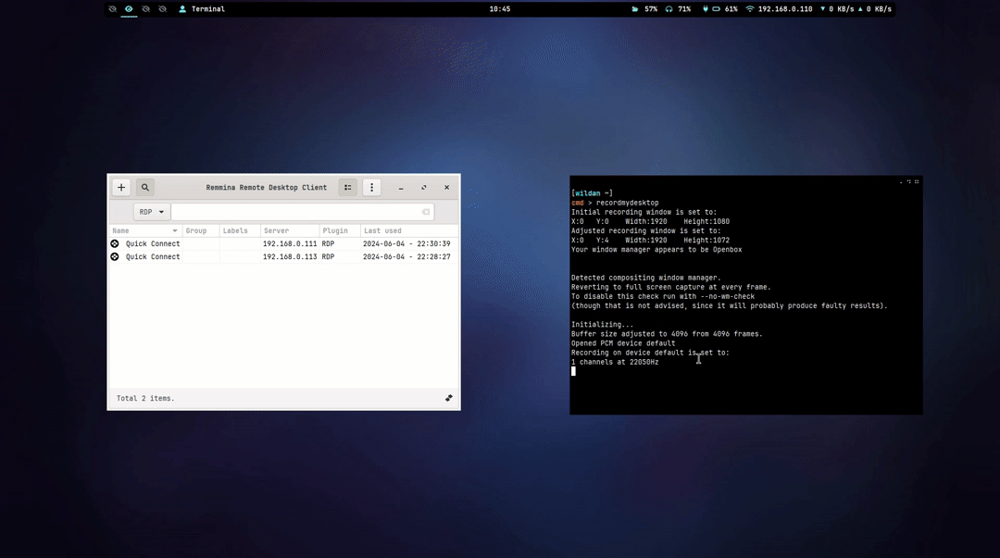

Berhasil.

#### Linux to Windows (Windows 7)
Kita coba remote ke windows (Windows 7):
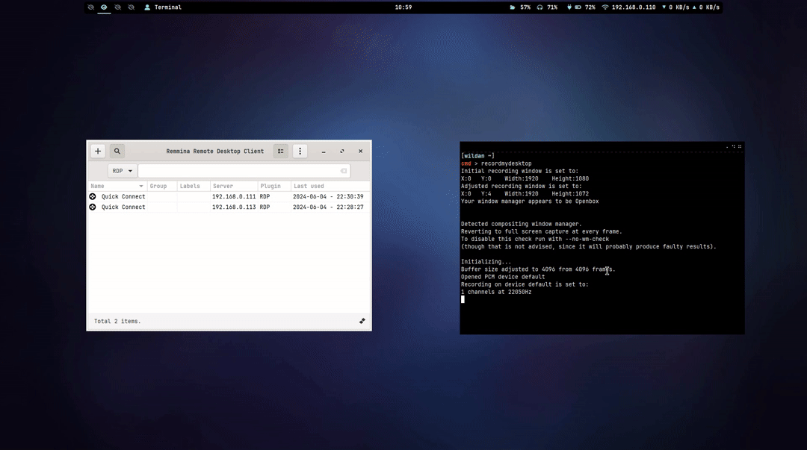

Berhasil.

#### Dynamic Resolution
Sekarang, kita coba untuk mengaktifkan fitur ***dynamic resolution***-nya.
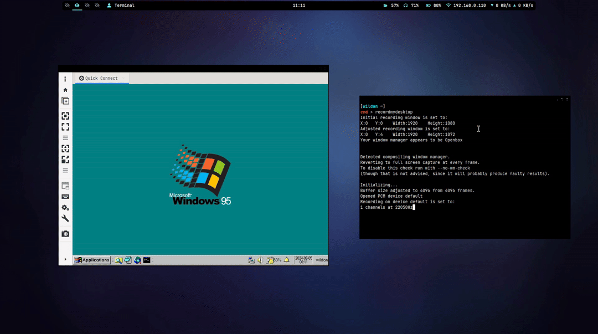

Berhasil. Di demo ***dynamic resolution*** tersebut juga bisa kita lihat, kalau fiturnya di-non-aktifkan, maka otomatis resolusinya juga tidak akan mengikuti ukuran window remmina.

## Notes
> Jika kalian memperhatikan, saya sangat "nge-fans" dengan fitur ***dynamic resolution*** yang ada di RDP client. Makanya tidak heran saya "men-dewa-kan" RDP client yang menyediakan fitur ini (~~dan menganggap sepele RDP client yang tidak memiliki fitur ini seperti rdesktop~~). Tapi, yang perlu menjadi perhatian adalah bahwa fitur ini hanya berjalan baik di linux (setidaknya sejauh eksperimen yang sudah saya lakukan :v). Adapun di Windows 7, fitur ***dynamic resolution*** ini, baik yang ada di xfreerdp maupun di remmina, tidak bisa digunakan. 

[^1]: https://en.wikipedia.org/wiki/Remote_Desktop_Protocol