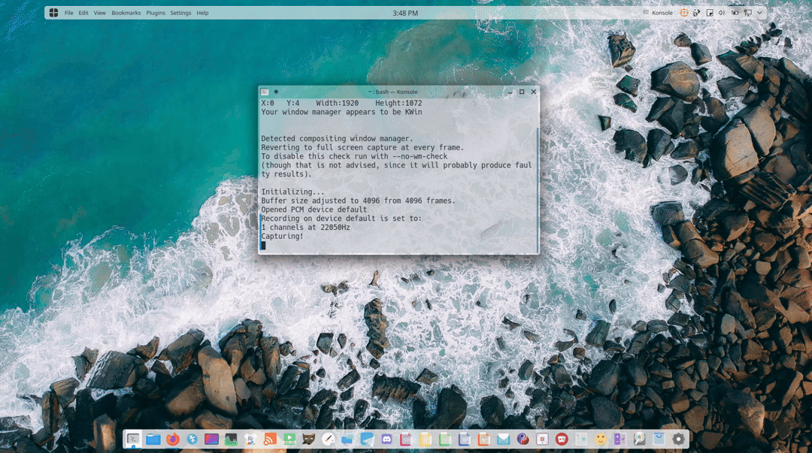
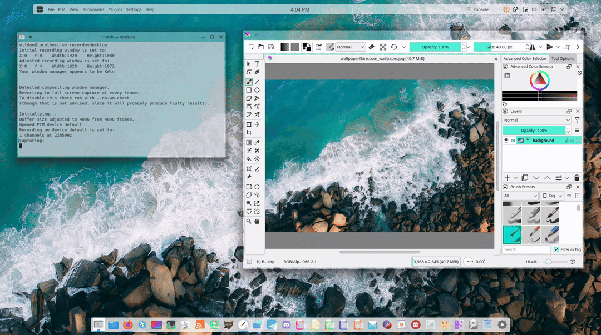
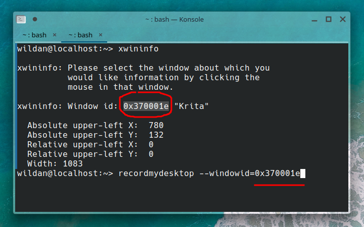
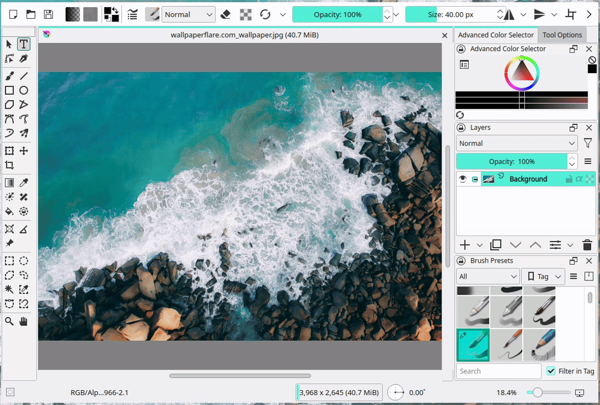
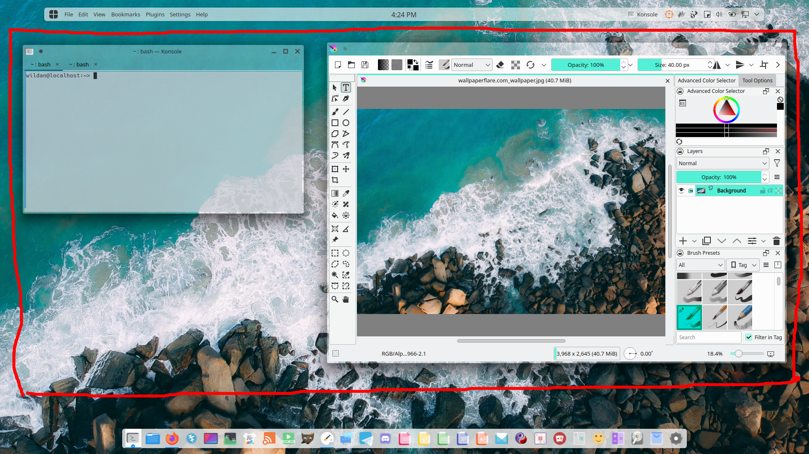
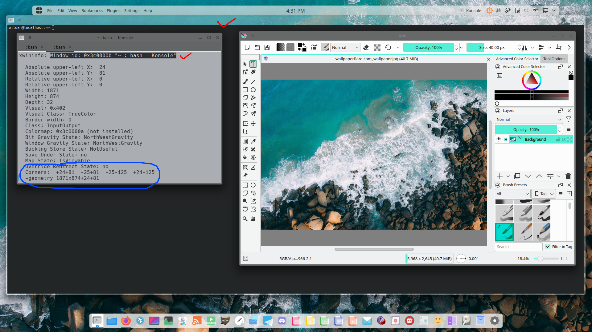
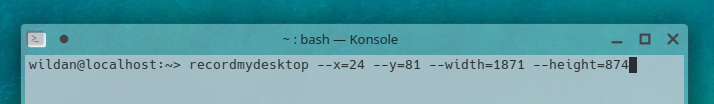
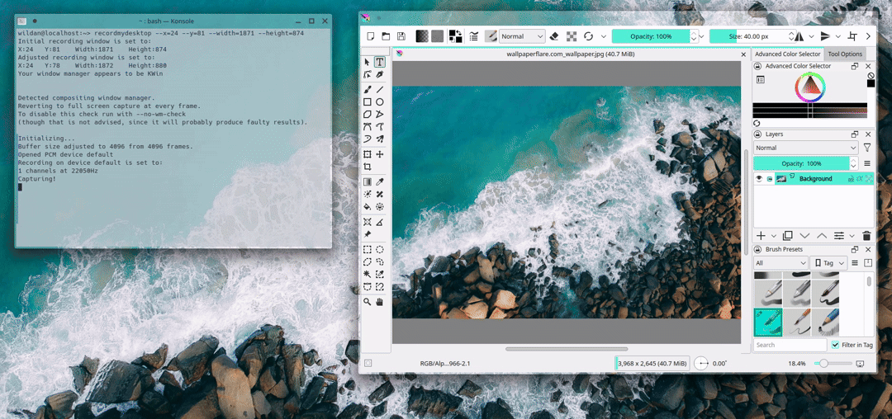
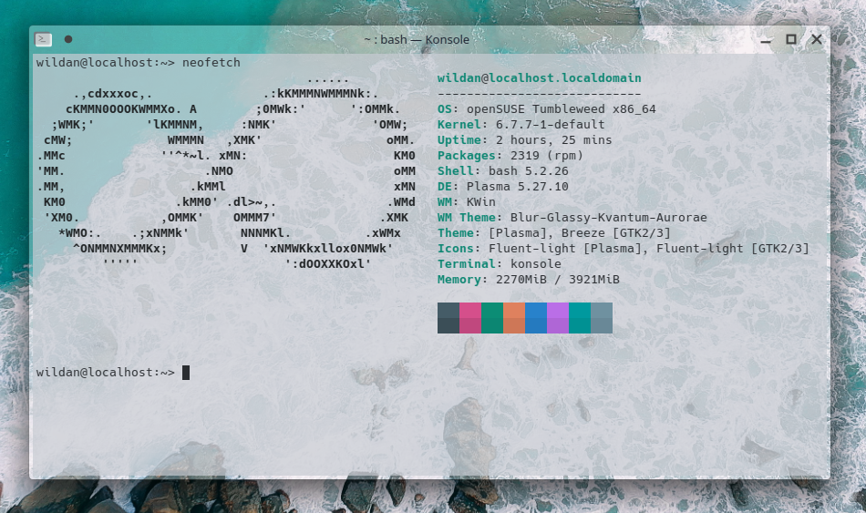

Tepat pada tanggal 10 Oktober 2023 lalu, saya membuat tutorial merekam layar (*screen recorder*) desktop menggunakan program ffmpeg.
Hanya saja, hingga saat ini, ada dua kelemahan ffmpeg yang belum dapat saya temukan solusinya ketika berbicara tentang dekstop screen recorder.
- FFmpeg belum bisa merekam satu window spesifik
- FFmpeg belum bisa merekam area layar tertentu


Nah, beberapa pekan lalu, saya menemukan program sederhana yang dapat men-*cover* kelemahan ffmpeg ini, yaitu **recordmydesktop**. Sebetulnya, saya menemukan program ini di Kali Linux, ketika saya
juga sedang ingin melakukan rekaman layar, dan ketika saya ketikkan 'record' di menu, tampillah program ini. Ketika saya coba, ternyata program kecil ini dapat membantu dan memudahkan saya membuat
*screen recorder* ketika sedang membuat tutorial atau *walkthrough* seperti ini.

Program **recordmydesktop** ini ada di beberapa *repository*, yang sudah saya cek di:
### 1. Debian
[recordmydesktop](https://packages.debian.org/search?keywords=recordmydesktop&searchon=names&suite=stable&section=all)

Instalasinya,
```bash
sudo apt install recordmydesktop
```

### 2. Archlinux
[recordmydesktop](https://archlinux.org/packages/?sort=&q=recordmydesktop&maintainer=&flagged=)

Instalasinya,
```bash
sudo pacman -S recordmydesktop
```

### 3. OpenSUSE
[recordmydesktop](https://software.opensuse.org/package/recordmydesktop?search_term=recordmydesktop)

Instalasinya,
```bash
sudo zypper in recordmydesktop
```

### 4. Fedora
[recordmydesktop](https://packages.fedoraproject.org/pkgs../images/recordmydesktop/recordmydesktop/)

Instalasinya,
```bash
sudo dnf install recordmydesktop
```

Oke, sebelum kita masuk ke tutorial penggunaannya, kita cari tahu dulu, apa sih program **recordmydesktop** itu?

Merujuk ke halaman web officialnya, **recordmydesktop** adalah *desktop session recorder* GNU/Linux untuk melakukan penangkapan layar dan juga perekaman audio via audio server seperti
ALSA, OSS, atau JACK.[^1] Pada intinya, program ini dapat membantu kita untuk melakukan rekaman layar secara sederhana karena tentu saja jika dibandingkan dengan perekam layar professional lainnya 
seperti OBS Studio jelas kalah :v.

Kita lanjut ke bagian tutorial. Di sini, saya akan bagi tutorialnya menjadi 3 bagian, yaitu:
1. Merekam layar **full**

2. Merekam **sebuah window**

3. Merekam **daerah layar tertentu**

Kita masuk ke bagian pertama...

## 1. Merekam Layar Full
Untuk merekam layar penuh, kita hanya perlu menjalankan program **recordmydesktop** via CLI di terminal

```bash
recordmydesktop
```


## 2. Merekam Sebuah Window
Untuk merekam sebuah window, kita terlebih dahulu perlu mengetahui **window id**-nya terlebih dahulu. Untuk mengetahui window id, kita bisa menggunakan program xwininfo.

```bash
xwininfo
```

Kemudian, klik window yang ingin direkam. Maka, kita akan mendapatkan id window tersebut.
Sebagai contoh, di sini saya akan merekam window dari aplikasi Krita.


Setelah mendapatkan window id-nya, sekarang, kita dapat memasukkannya sebagai parameter di **recordmydesktop**:

```bash
recordmydesktop 
```


Hasilnya adalah sebagai berikut:


## 3. Merekam Daerah Layar Tertentu
Misalnya, saya ingin merekam daerah ini saja...


Untuk itu, saya akan menggunakan trik, yaitu dengan membuka aplikasi random (dalam case ini Konsole) seukuran dengan daerah yang ingin saya rekam. 
Kemudian, nanti kita akan menggunakan ukuran window tersebut untuk diinputkan sebagai parameter pada **recordmydesktop**.


Seperti yang tampak pada *screenshot* di atas, window id tersebut adalah window id dari Konsole yang ada di belakang (yang *background*-nya berwarna hitam dan saya beri tanda ceklis).
Sementara itu, kita tidak akan fokus pada window id-nya, kita akan fokus pada ukuran ***corners*** dan ***geometry*** yang saya beri garis warna biru.

Ukuran yang terdapat pada ***corners*** akan kita inputkan pada parameter x & y, sedangkan ukuran pada ***geometry*** akan kita inputkan pada parameter width & height.


```bash
recordmydesktop --x= --y= --width= --height=
```

Hasilnya adalah sebagai berikut:


Begitulah triknya, hihihi :)

Jadi, di tutorial kali ini, kita sudah belajar cara menggunakan program **recordmydesktop** untuk melakukan rekaman layar sederhana namun sangat efektif dengan tiga mode, 
yaitu mode full layar, sebuah window, dan area tertentu saja...

Semoga bermanfaat ya~

Sampai jumpa lagi!

🤗 😇 ☺️


> Sebagai catatan, kali ini, saya menggunakan *workspace* baru, yaitu openSUSE Tumbleweed versi KDE untuk membuat tulisan ini, ternyata lebih stabil dibandingkan dengan KDE Kali Linux 😝



[^1]: https://enselic.github.io../images/recordmydesktop/
