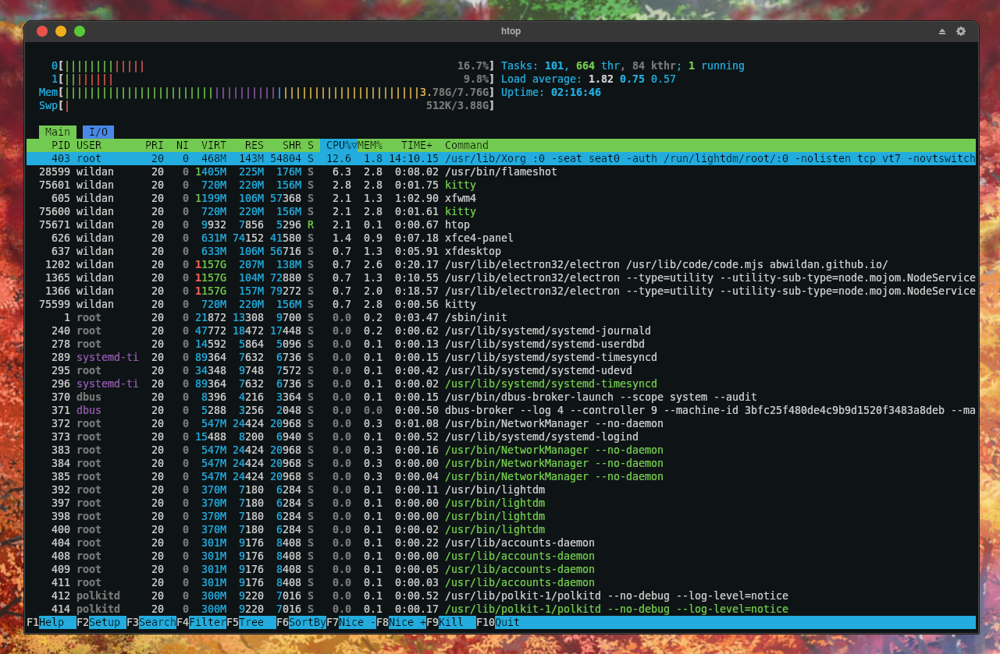
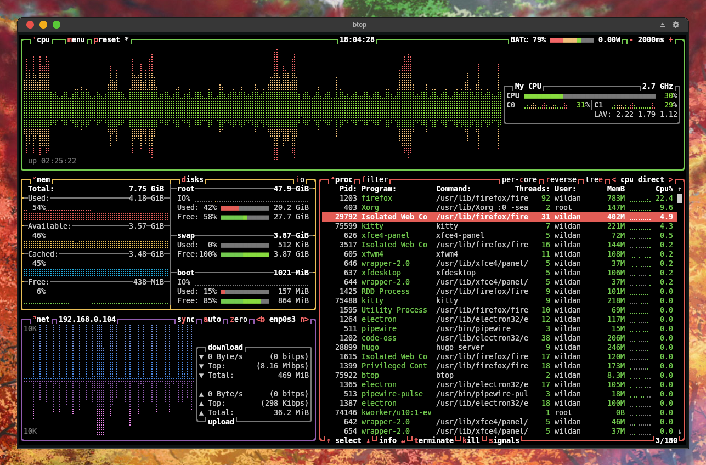
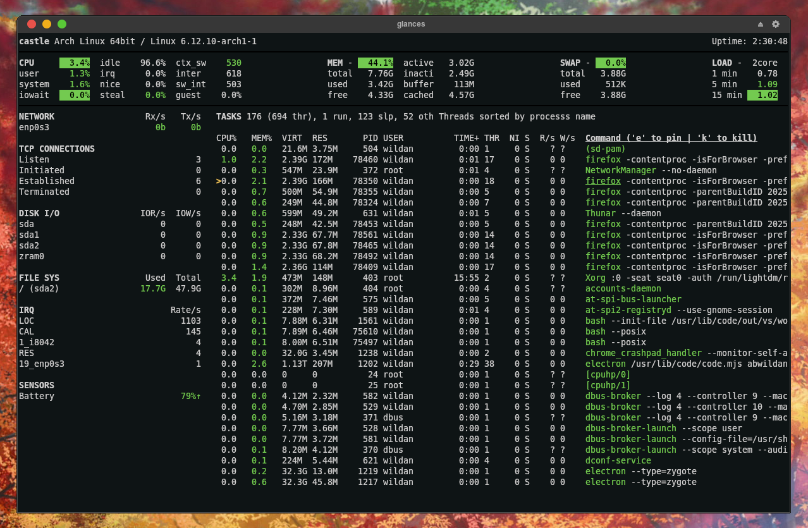
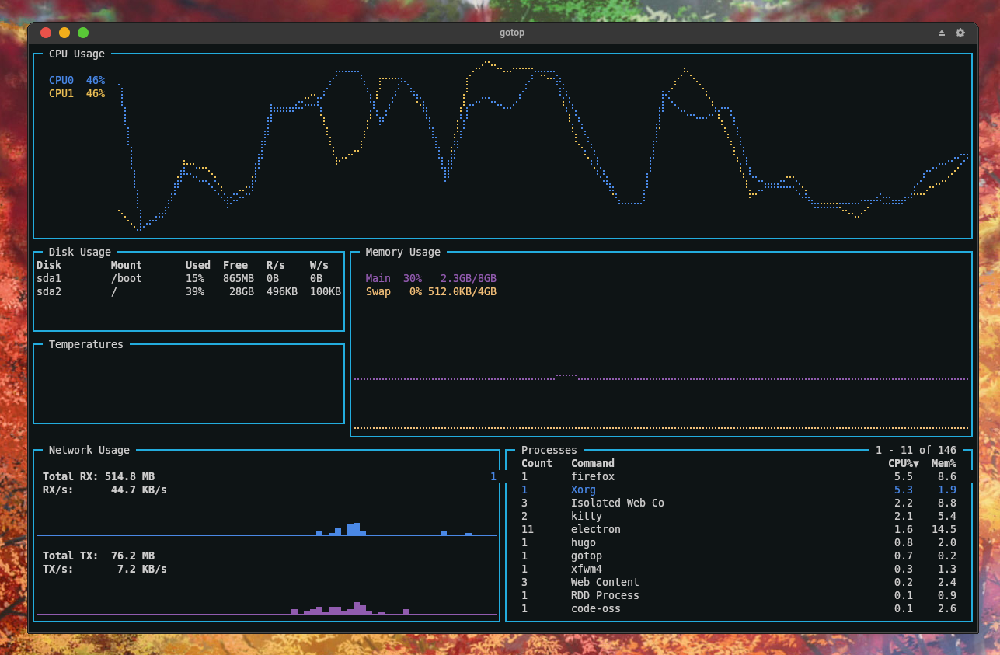
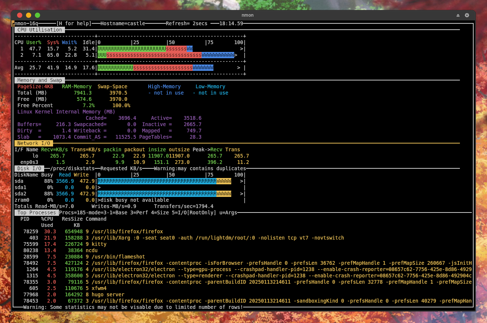

Linux memiliki beberapa _utility_ yang secara spesifik ditujukan untuk memudahkan kita sebagai penggunanya untuk memantau kondisi _resource_ komputer kita. _Reource_ yang saya maksud di sini sekurang-kurangnya mencakup **CPU** & **RAM**. 

Berikut adalah daftarnya:

## 1. htop

**`htop`** adalah _resource monitoring tools_ yang akan menampilkan informasi terkait:
- CPU
- RAM
- SWAP
- Process 

Selain itu, **`htop`** juga memiliki fitur untuk mencari proses yang sedang berjalan dan memberhentikannya secara paksa (jika memang diperlukan), sama seperti yang dapat kita lakukan di Task Manager kalau di Windows.

### Instalasi

|       Distro      |                  Command                      |
|       ---         |                   ---                         |
| **Debian/Ubuntu** | **`sudo apt install htop`**                   |
| **Arch Linux**    | **`sudo pacman -Sy htop`**                    |
| **Opensuse**      | **`sudo zypper install htop`**                |
| **Fedora**        | **`sudo dnf install htop`**                   |

::github{repo="htop-dev/htop"}

## 2. btop

**`btop`** adalah _resource monitoring tools_ yang akan menampilkan informasi terkait:
- CPU
- RAM
- SWAP
- Disk
- Process
- Network 
- Battery

**`btop`** juga kaya akan _customization_. Diantaranya, kita dapat mengganti tema, memilih informasi spesifik yang ingin ditampilkan (misalnya kita hanya ingin informasi tentang process saja yang tampil, atau internet saja), dan kustomisasi-kustomisasi lainnya.

### Instalasi

|       Distro      |                  Command                      |
|       ---         |                   ---                         |
| **Debian/Ubuntu** | **`sudo apt install btop`**                   |
| **Arch Linux**    | **`sudo pacman -Sy btop`**                    |
| **Opensuse**      | **`sudo zypper install btop`**                |
| **Fedora**        | **`sudo dnf install btop`**                   |

::github{repo="aristocratos/btop"}

## 3. glances

**`glances`** adalah _resource monitoring tools_ yang akan menampilkan informasi terkait:
- CPU
- RAM
- SWAP
- Disk
- Process
- Network 
- Battery

**`glances`** secara UI (_user interface_) sedikit lebih mirip dengan **`htop`**. Terdapat beberapa kustomisasi, seperti memilih informasi apa yang ingin ditampilkan. Namun, glances tidak memiliki kustomisasi tema.  

### Instalasi

|       Distro      |                  Command                      |
|       ---         |                   ---                         |
| **Debian/Ubuntu** | **`sudo apt install glances`**                |
| **Arch Linux**    | **`sudo pacman -Sy glances`**                 |
| **Opensuse**      | **`sudo zypper install python-glances`**      |
| **Fedora**        | **`sudo dnf install htop`**                   |

::github{repo="nicolargo/glances"}

## 4. gotop

**`gotop`** adalah _resource monitoring tools_ yang akan menampilkan informasi terkait:
- CPU
- RAM
- SWAP
- Disk
- Process
- Network 

**`gotop`** secara UI (_user interface_) sedikit lebih mirip dengan **`htop`**. Terdapat beberapa kustomisasi, seperti memilih informasi apa yang ingin ditampilkan. Namun, glances tidak memiliki kustomisasi tema. Sayangnya, gotop tidak tersedia di beberapa repo distro sehingga kita harus meng-_compile_ dan meng-_install_-nya secara manual dari repo-nya di github.

### Instalasi

|       Distro      |                  Command                      |
|       ---         |                   ---                         |
| **Arch Linux**    | **`sudo yay -Sy gotop`**                      |

::github{repo="cjbassi/gotop"}

## 5. nmon

**`nmon`** adalah _resource monitoring tools_ yang akan menampilkan informasi terkait:
- CPU
- RAM
- SWAP
- Network
- Disk 
- Process

**`nmon`** merupakan _resource monitoring tool_ yang unik dan keren dari segi UI menurut saya. Kita juga dapat mengatur informasi yang ingin ditampilkan. Meskipun demikian, **`nmon`** tidak memiliki kustomisasi tema seperti yang terdapat di **`btop`**. 

### Instalasi

|       Distro      |                  Command                      |
|       ---         |                   ---                         |
| **Debian/Ubuntu** | **`sudo apt install nmon`**                   |
| **Arch Linux**    | **`sudo pacman -Sy nmon`**                    |
| **Opensuse**      | **`sudo zypper install nmon`**                |
| **Fedora**        | **`sudo dnf install nmon`**                   |

https://nmon.sourceforge.io/pmwiki.php