Hola!

Teman-teman familiar dengan istilah *rice* atau *Linux ricing*?

Tidak seperti makna dari terjemah harfiahnya yang berarti **nasi** atau *menasikan Linux*, istilah *rice* atau *Linux Ricing* punya makna yang boleh dibilang eksklusif dan kontekstual.
Gimana tu maksudnya? Mari saya jelaskan...

>Secara sederhana, istilah *rice* yang digunakan dalam dunia Linux dicomot dari istilah yang biasa digunakan di dunia otomotif (mobil), dimana **RICE** adalah singkatan dari
***Race Inspired Cosmetic Enhancement***. Istilah **RICE** dalam dunia mobil tersebut digunakan untuk menjelaskan modifikasi pada mobil.[^1] Jadi, ketika istilah **RICE** tadi masuk ke dunia
Linux, itu berarti modifikasi (secara kosmetis / tampilan) pada Desktop Linux atau dengan kata lain **kustomisasi Desktop Linux**. Sesederhana itu.

Nah, di postingan ini, saya akan berbagi tutorial *ricing* Linux. Adapun Linux yang saya gunakan adalah Debian dengan *Desktop Environment (DE)* **XFCE** yang pada postingan sebelumnya, saya
juga sudah menjelaskan tutorial instalasi Debian dengan XFCE [di sini](https://abwildan.github.io/post/debian-installation/). Lebih jelasnya, saya akan merubah tampilan XFCE Debian 
yang default seperti ini:
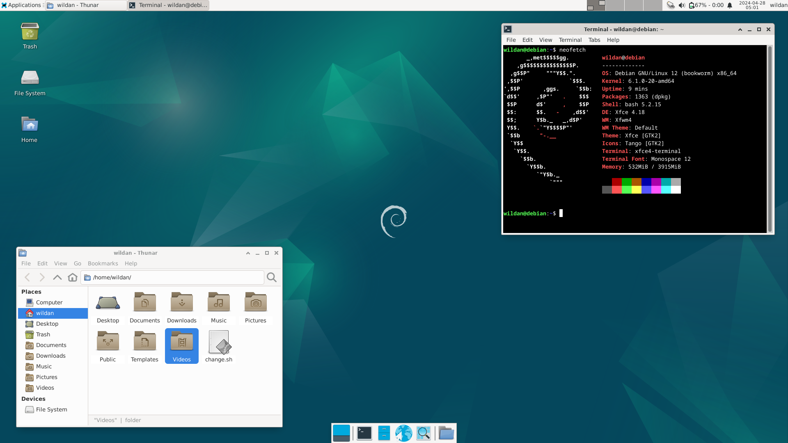

menjadi Debian XFCE dengan tampilan atau tema Windows95, seperti ini:
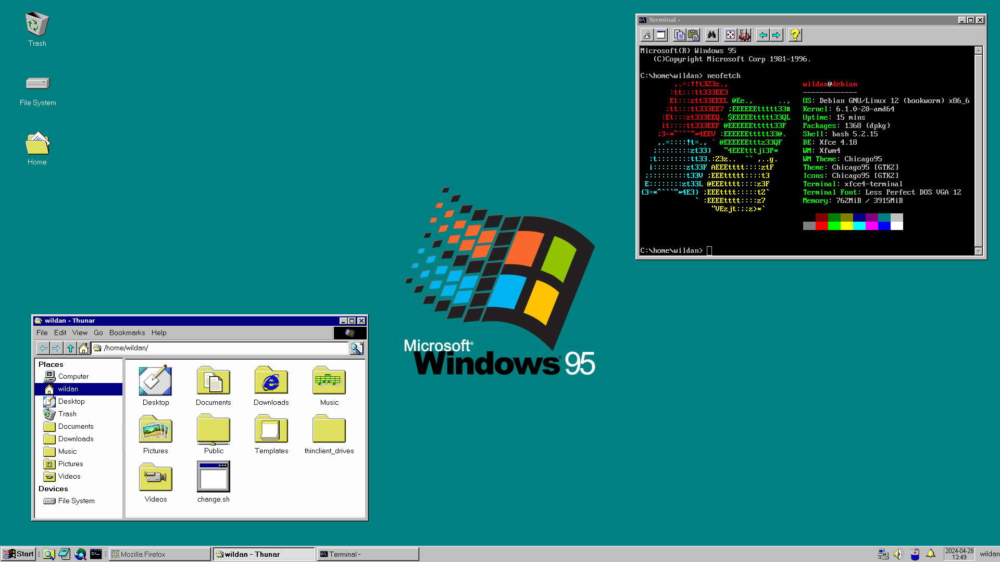 

Saya akan membagi tutorial ini ke dalam 2 bagian utama, yaitu:
1. Bagian Pertama: Persiapan
2. Bagian Kedua: *Ricing Moment* 

Tapi, sebelum masuk ke bagian pertama, saya akan membeberkan alasan saya memilih tema Win95 ini dibandingkan opsi-opsi tema lainnya. Setidaknya, saya memilih tema ini sebagai bahan
belajar *ricing* karena 2 hal:
1. Tema ini lebih mudah diaplikasikan (karena menggunakan script). Jadi, bagi yang awam pun tidak perlu terlalu pusing.
2. Tema ini relatif solid. Artinya, kustomisasi yang dilakukan script ini nanti tidak akan merusak komponen-komponen yang ada pada DE XFCE.
3. Tema ini (tentu saja) sangat keren menurut saya, karena bisa membawa kita melintasi ruang dan waktu ke beberapa tahun ke belakang (*re: **nostalgia***)

# Bagian Pertama: Persiapan

Oh iya, saya beranggapan, kalian yang membaca dan mau mengikuti tutorial *ricing* Linux ini adalah kalian yang terlebih dahulu mengikuti instalasi Linux Debian di artikel saya sebelumnya. 
Jadi, beberapa hal harus kita konfigurasi terlebih dahulu karena instalasi kemarin adalah Debian yang masih ~~polos~~, *fresh*.

So, hal-hal yang perlu kita lakukan adalah sebagai berikut:

## 1. Menambahkan User ke Grup `sudoers`
Instalasi Linux Debian kemarin masih belum memberikan user kita (dalam konteks saya namanya **wildan**) akses ke sudo. Sehingga, menurut saya cukup merepotkan kalau kita perlu 
berhubungan dengan akses `root` via sudo (misalnya menginstall paket), tapi harus menggunakan user root alih-alih user saya sendiri (**wildan**). Misalnya, seperti gambar berikut:
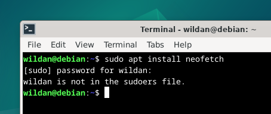

Nah, supaya user kita punya akses ke `root` via sudo, kita perlu memasukkan user kita tersebut ke grup ***sudoers***.

Pertama, kita masuk dulu ke user `root`:
```bash
su - root
```

Kemudian, kita masukkan user kita ke grup sudoers:
```bash
usermod -aG sudo wildan
```
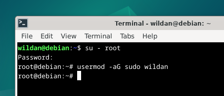

Kalau tidak ada indikasi *error*, berarti kita sudah berhasil menambahkan user kita ke grup sudoers.

Untuk membuktikannya, silakan *logout* dan *log in* kembali. Kemudian, ketikkan perintah berikut di terminal:
```bash
sudo su
```
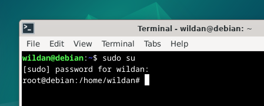

Dan sekarang, kita bisa menggunakan user kita langsung untuk menginstall paket (neofetch):
```bash
sudo apt install neofetch
```
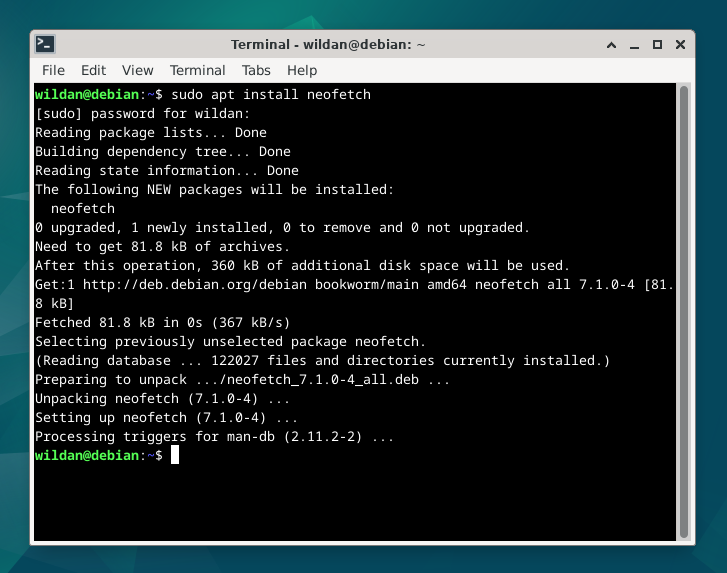

## 2. Mengganti DNS Lokal ke DNS Google
DNS (*Domain Name System*) secara singkat adalah sebuah sistem yang berfungsi untuk memberi referensi sebuah url (*uniform resource locator*) ke alamat ip (*ip address*). 

Misalnya, kalau saya ketik sebuah url, `google.com` atau `https://www.google.com/`, maka DNS akan mengarahkan saya ke *ip address* dari url tersebut, yaitu 216.239.38.120. Jadi, DNS Server 
boleh diibaratkan seperti buku telefon atau kalau zaman sekarang seperti kontak, yang menghubungkan nama seseorang dengan nomor hp-nya.

Nah, berhubung DNS lokal biasanya merujuk pada DNS Server yang tersimpan di router, kadang-kadang, saya mengalami masalah tidak bisa *update / install software* karena *repository* 
distro Linux yang saya gunakan (dalam konteks ini Debian) tidak terdaftar di DNS Server di router tersebut. Untuk mengantisipasi hal itu, kita akan gunakan DNS Server dari Google.

Ketikkan perintah berikut di terminal
```bash
echo "nameserver 8.8.8.8
nameserver 8.8.4.4" | sudo tee /etc/resolv.conf
```
Penjelasan (singkat):
- Perintah `echo "nameserver 8.8.8.8 nameserver 8.8.4.4"` adalah perintah untuk menuliskan nameserver 8.8.8.8 dan 8.8.4.4, dimana 8.8.8.8 dan 8.8.4.4 adalah DNS Server Google.
- Perintah `sudo tee /etc/resolv.conf` adalah perintah untuk memasukkan (*overwrite*) tulisan tadi ke file /etc/resolv.conf, dimana file tersebut adalah file konfigurasi untuk DNS di Linux.
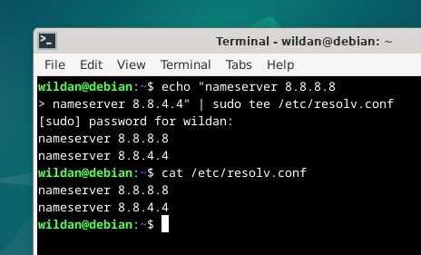

Nah, agar kalian tidak perlu mengulang perintah tersebut setiap kali login, kalian bisa menyimpan perintah tersebut ke sebuah *script file*. Misalnya, saya menyimpan perintah tersebut ke file
yang saya beri nama `change.sh`:
```bash
touch change.sh

echo 'echo "nameserver 8.8.8.8
nameserver 8.8.4.4" | sudo tee /etc/resolv.conf' >> change.sh

chmod 777 change.sh
```
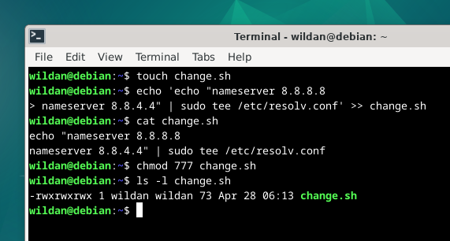

Jadi, kalian hanya perlu menjalankan *script* tersebut ketika login, tanpa harus menuliskan seluruh perintah sebelumnya di terminal.

Cara menjalankannya:
```bash
./change.sh
```
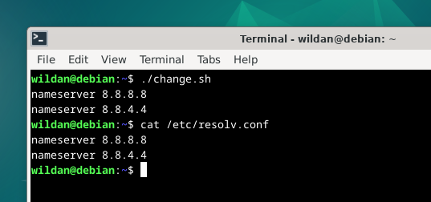

## 3. Menginstall git & Meng-*clone* Repo 
Git perlu diinstall untuk mengunduh script yang ada di Github repo berikut:

[Chicago95 by Grassmunk](https://github.com/grassmunk/Chicago95)

```bash
sudo apt install git
```
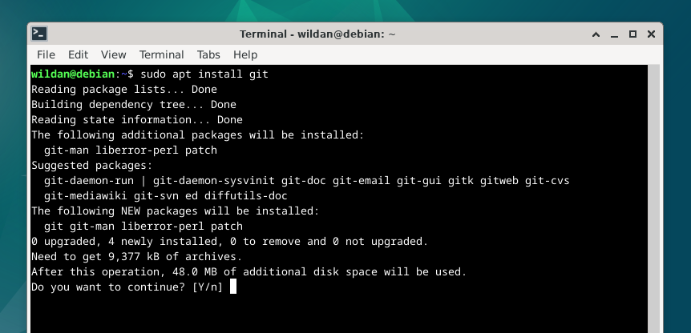

Setelah itu, kita *clone* repo-nya
```bash
git clone https://github.com/grassmunk/Chicago95.git
```
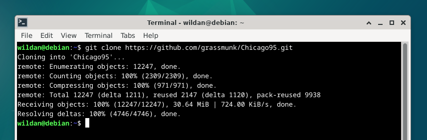

Oke, persiapan selesai.

# Bagian Kedua: *Ricing Moment*

Kita akan segera melakukan *ricing* di tahap ini. Tapi, demi alasan kemudahan, saya akan bagi tahap ini ke dalam 2 bagian:
1. Menjalankan *script*
2. (Beberapa) konfigurasi manual sebagai *finishing*

## 1. Menjalankan *script*

Masuk ke direktori / folder `Chicago95` yang tadi sudah di-*clone*.
```bash 
cd Chicago95
```

Di sana, kita akan melihat ada file bernama `install.py` yang berwarna hijau. 
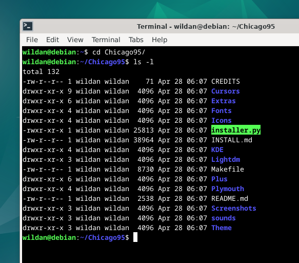

Jalankan *script* tersebut.

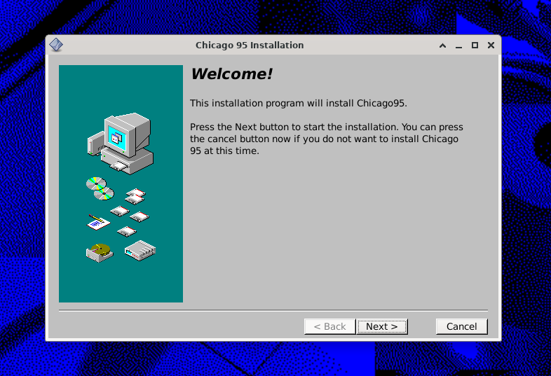

Next...

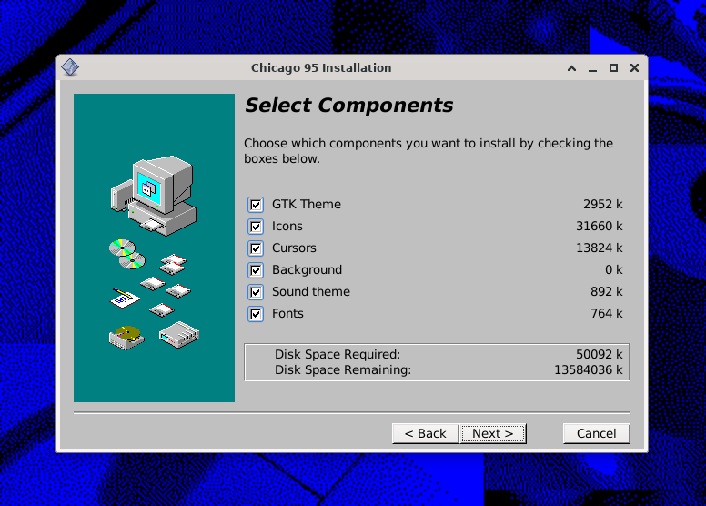

Next...

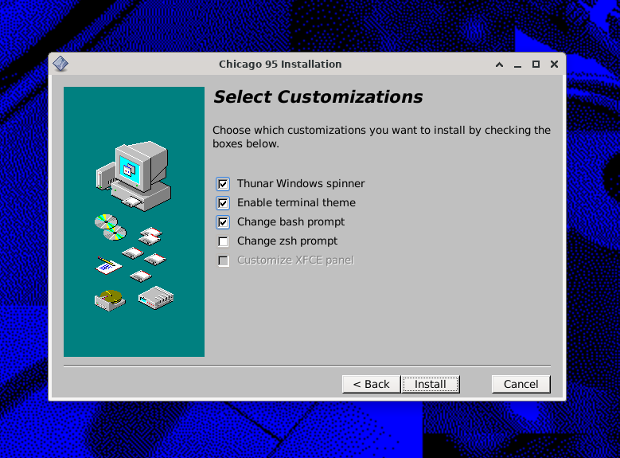

Install, dan tunggu prosesnya hingga selesai...
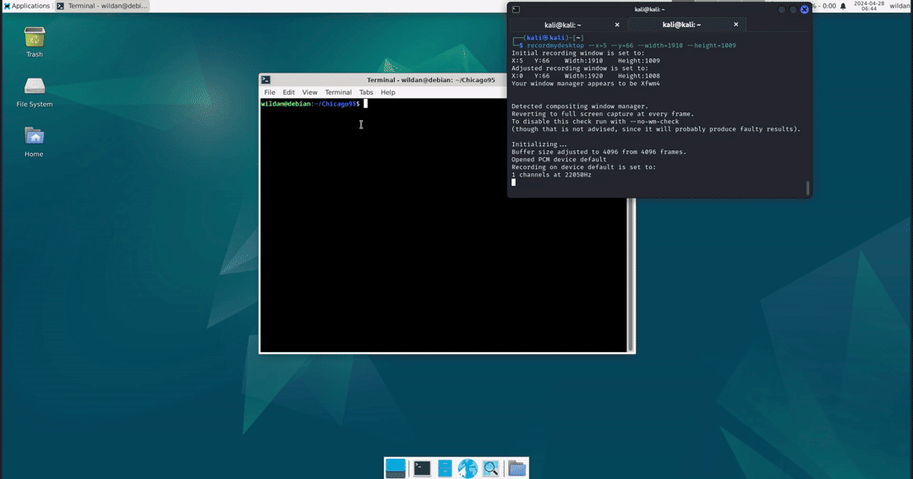

## 2. (Beberapa) Konfigurasi Manual sebagai *Finishing*

Di fase ini, kita akan "rapih-rapih" hal-hal yang masih belum terlihat seperti seharusnya secara manual. Beberapa hal yang saya maksud tersebut, sebetulnya terlampir pada file 
`post-install.txt` yang muncul tepat setelah *script* tadi selesai berjalan.
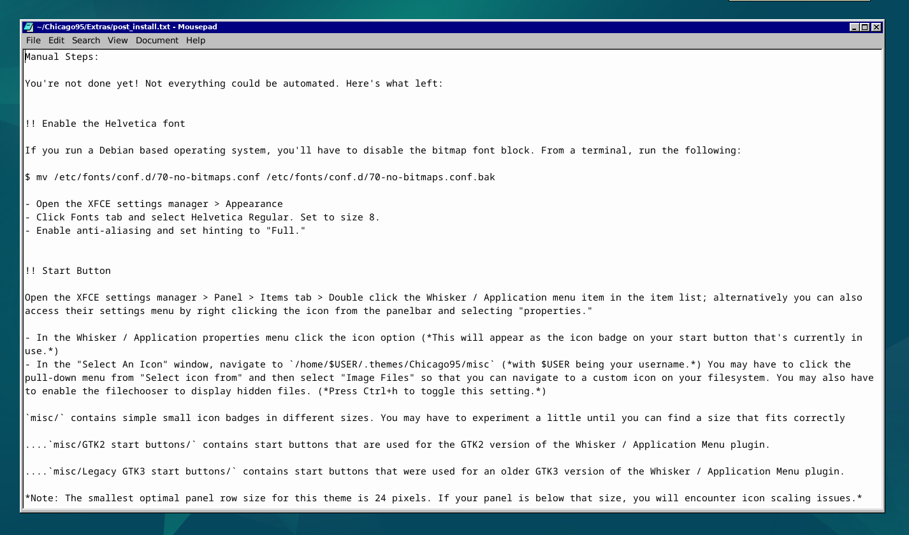

Tapi, biarkan saya membagi (lagi) tahap ini menjadi beberapa 4 bagian, yaitu:
1. Font
2. Panel
3. Wallpaper
4. Terminal & Neofetch

### a. Font
Kita akan men-*setting* font **Helvetica** sebagai *font* default. Sayangnya, hal tersebut tidak bisa dilakukan sebelum kita men-*disable* "*bitmap font block*"-nya terlebih dahulu.

Jadi, kita dapat melakukannya dengan mengetikkan perintah berikut di terminal:
```bash
sudo mv /etc/fonts/conf.d/70-no-bitmaps.conf /etc/fonts/conf.d/70-no-bitmaps.conf.bak
```

Setelahnya, kita bisa membuka **Setting** -> **Appearance** -> **Font** 
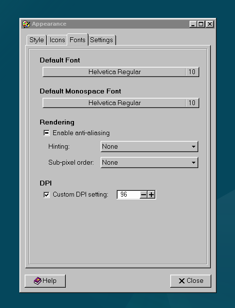

dan ganti bagian ***Default Font*** dan ***Default Monospace Font***-nya menjadi **Helvetica Regular**.
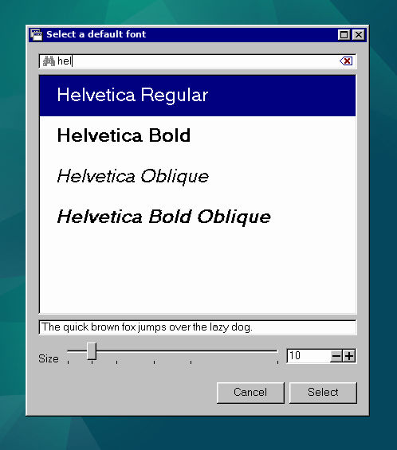

Di sub **Rendering**, ceklis **enable anti-aliasing** dan set opsi **Hinting** ke **Full**.
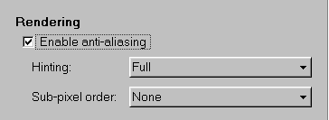

Selesai.

### b. Panel

#### Menghapus Panel

Kalau diperhatikan, kita punya 2 panel, yaitu panel bagian atas dan panel di bagian bawah yang juga berfungsi sebagai *dock*. So, di sini, kita akan memindahkan panel di atas ke bagian 
bawah, dan menghapus panel kedua tersebut.

Berikut langkah-langkah untuk menghapus panel kedua:
1. Klik kanan di salah satu panel, kemudian pilih **Panel** -> **Panel Preferences**.
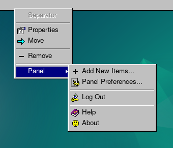

2. Pilih **Panel 2** dan klik pada icon minus **[ - ]**
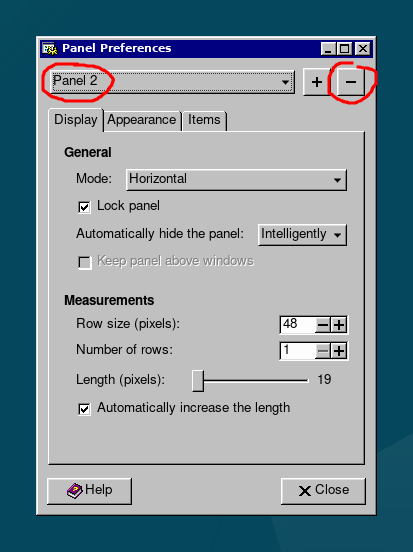

3. Pilih **Remove** pada jendela konfirmasi yang muncul
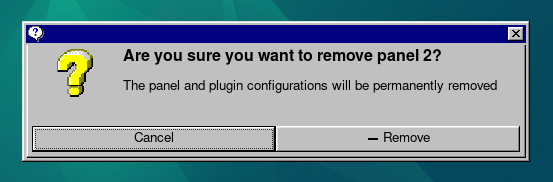

#### Memindahkan Panel

Untuk memindahkan panel dari bagian atas ke bagian bawah:
1. Masih di jendela **Panel Preferences**, *Un-ceklis* pada **Lock Panel**
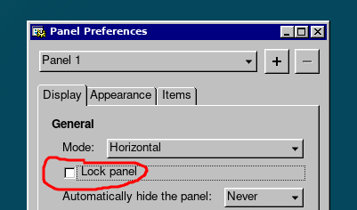

2. Kemudian, kita bisa menggeser panel tersebut dengan meng-klik terlebih dahulu pada bagian pojok kanan atau pojok kiri panel tersebut.
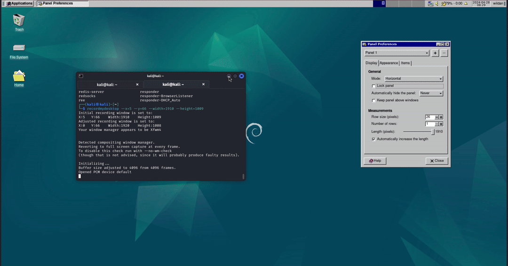 

Setelah selesai, jangan lupa diceklis kembali **Lock Panel**-nya.

#### Membesarkan Ukuran Panel 

Masih di menu **Display** pada window **Panel Preferences**, untuk membesarkan panel:
1. Ubah opsi **Row size (pixels)** ke **30**
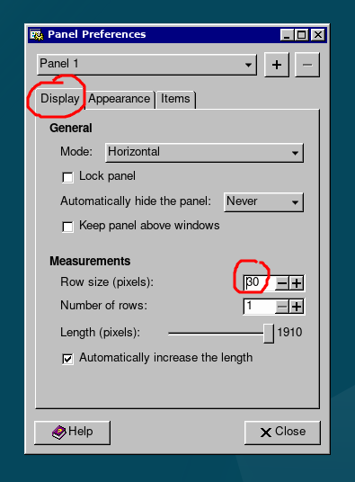 

#### Membesarkan Ukuran Icon-icon di Panel

Pindah ke menu **Appearance**, untuk membesarkan ukuran icon-icon di panel:
1. Ubah ukuran pada opsi **Fixed icon size (pixels)** ke **24**
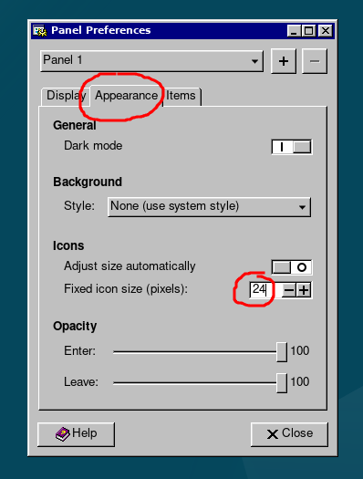

#### Menambahkan Launcher(s)

Di sini, kita akan menambahkan 4 launcher utama, yaitu
- File Manager (Thunar)
- Text Editor (Mousepad)
- Web Browser (Firefox)
- Terminal Emulator (XFCE Terminal)

Caranya:
1. Pindah ke menu **Items** dan klik **Add**
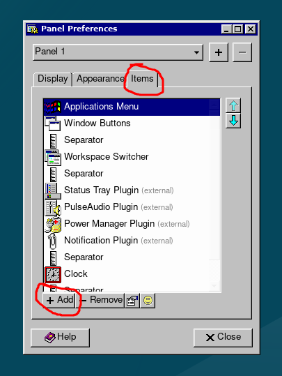

2. Pilih **Launcher** dan klik **Add** sebanyak 4 kali, sehingga di bagian bawah window **Items**, kita bisa melihat ada 4 launcher telah ditambahkan
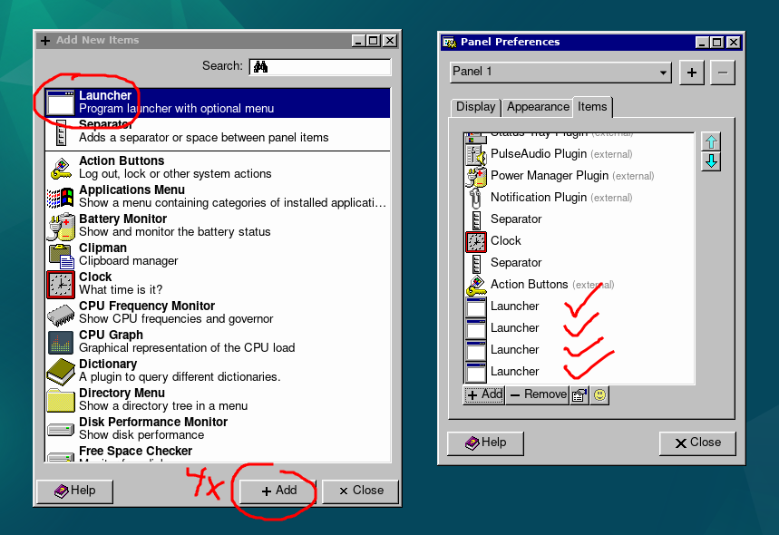

3. Pilih launcher yang pertama, lalu klik pada **icon edit** berikut
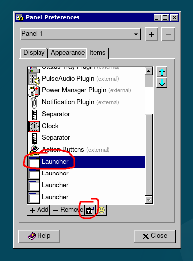

4. Tambahkan **File Manager (Thunar)** sebagai program yang akan dijalankan pada launcher tersebut.
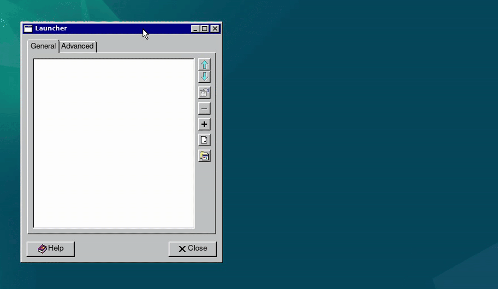

5. Lakukan hal yang sama di launcher 2, 3, dan 4 untuk menambahkan **Text Editor**, **Web Browser**, dan **Terminal Emulator**.
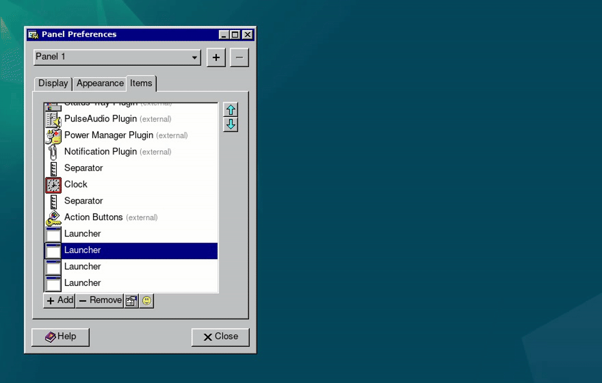

Sekarang, penampakan panel kita seharusnya akan seperti ini:
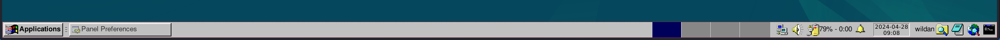

Terlihat, keempat launcher yang sudah ditambahkan tadi terletak di bagian pojok kanan. Kita akan memindahkannya ke sebelah Start Menu.

Caranya:
1. Masih di menu **Items**, kita pilih launcher yang akan kita pindahkan, dan klik pada icon **Tanda Panah ke atas** yang berwarna biru muda sampai launcher tersebut tepat berada di bawah Start Menu.
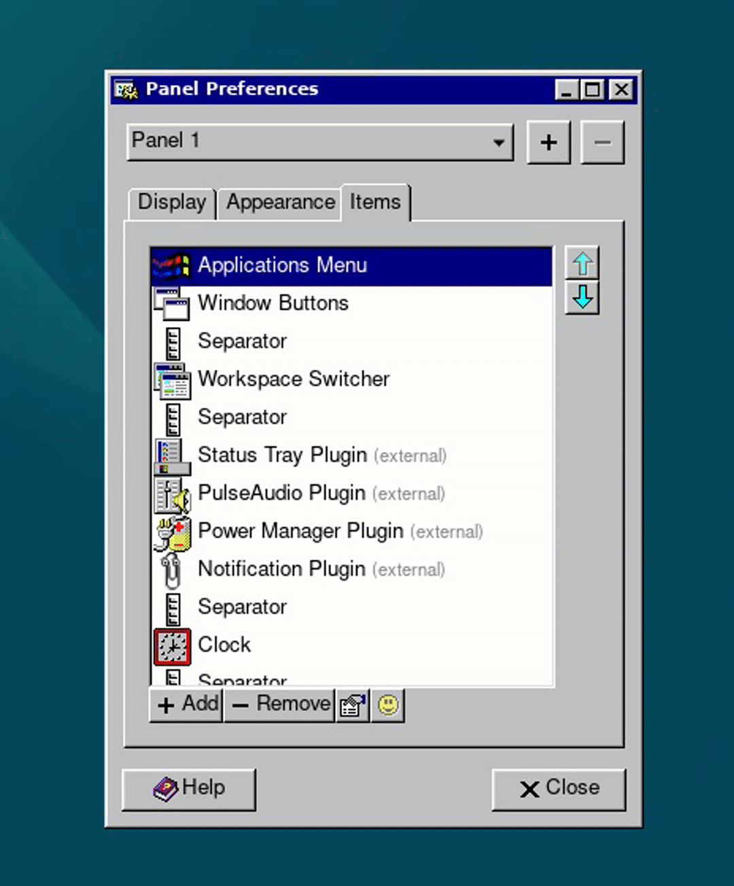

#### Mengedit Icon Start Menu

Berikut adalah langkah-langkah mengedit Start Menu:
1. Pada menu **Items** di window **Panel Preferences**, pilih **Application Menu**
2. Klik icon edit di bagian bawah
3. Ganti **Button Title** dari *Applications* -> **Start**
4. Klik pada logo di bagian **Icon**
5. Pilih icon **start-here**

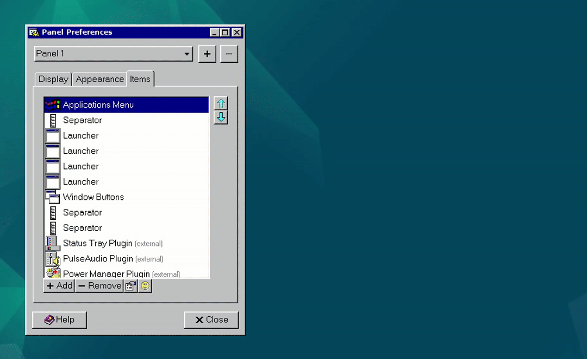

#### Etc

Di Etc ini, saya akan merangkum beberapa *setting* "perintilan" pada Panel yang menurut saya perlu dilakukan demi alasan kesempurnaan tampilan, yaitu
- Menambahkan separator
- Menghapus workspace
- Mengubah timezone ke Jakarta
- Mengubah font clock
- Menghilangkan caption power (battery)

Saya sebut ini "rangkuman" karena kelima "perintilan" itu akan saya sajikan hanya dalam satu gif berikut:
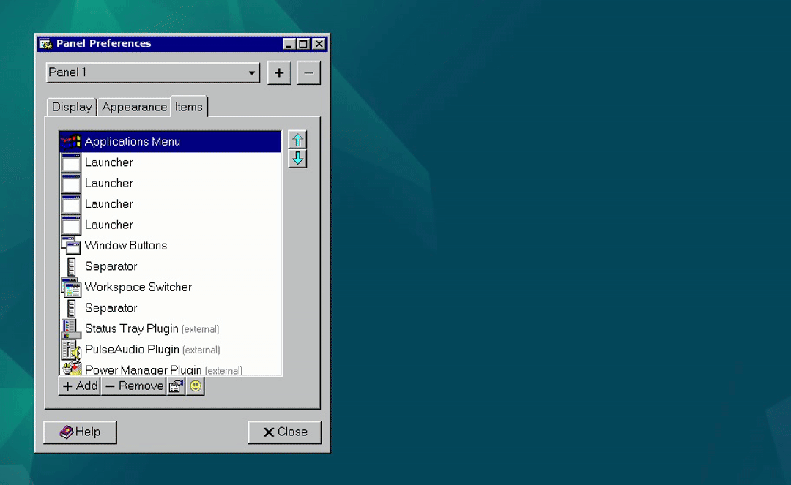

Sekarang, penampakan panel kita sudah lebih baik dari sebelumnya:
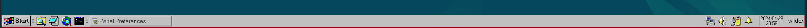

### c. Wallpaper

Wallpaper Windows 95 dapat diunduh dari wallpaperflace [di sini](https://www.wallpaperflare.com/microsoft-windows-95-logo-digital-art-copy-space-no-people-wallpaper-pmwwg/download).

Dan kita bisa pasang wallpapernya dengan cara:
1. Buka **File Manager (Thunar)**
2. Masuk ke direktori tempat mengunduh file wallpaper tadi (saya di direktori **Downloads**)
3. Klik kanan di file wallpaper-nya, dan pilih **Set as wallpaper**


### d. Terminal & Neofetch

Kalau kita buka terminal, maka tampilan terminal, berikut juga prompt-nya akan seperti ini:
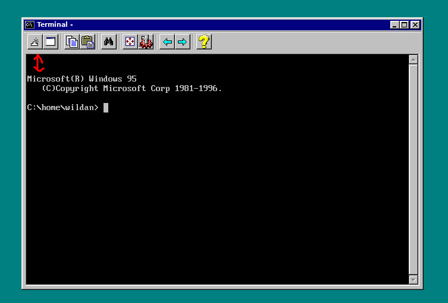

Terlihat ada jarak dari keterangan prompt yang ada di paling atas dengan window bagian dalam terminalnya. Menurut saya ini kurang nyaman dipandang sehingga saya ingin agar prompt tersebut
dapat berada tepat di bawah window bagian dalam terminal. Kita bisa mengubahnya dengan menghapus 2 baris **echo** yang terdapat di file `.bashrc`.

```bash
nano .bashrc
```
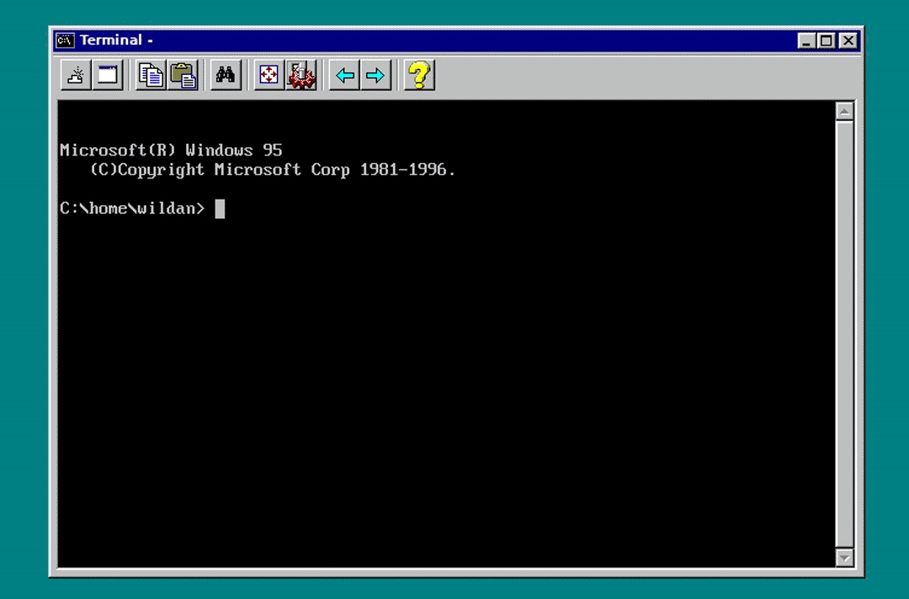

Sekarang, tampilan terminal kita jadi sudah terlihat lebih ideal.
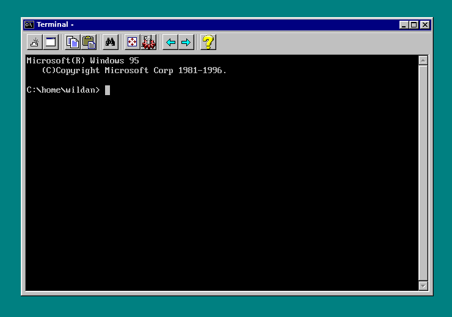

Untuk **Neofetch**, kita bisa menambahkan baris berikut ke file `.bashrc` tadi:
```bash
alias neofetch='neofetch --ascii_distro windows --disable model resolution cpu gpu'
```
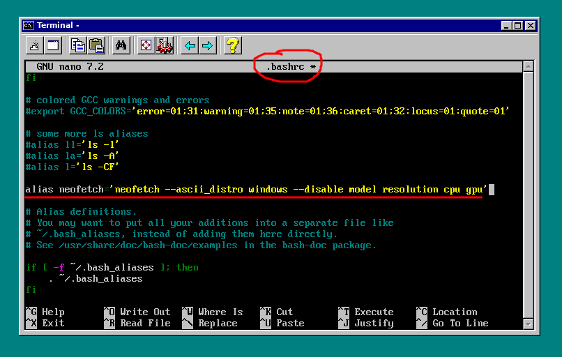

Dengan konfigurasi neofetch tersebut, neofetch kita akan tampil sebagai berikut:
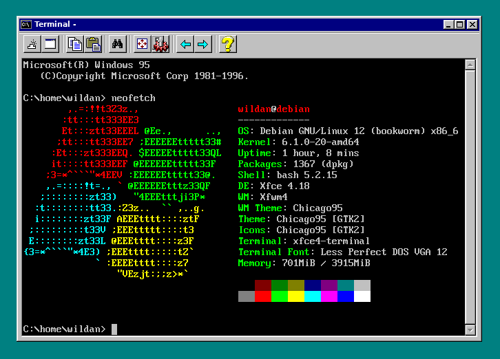

Sangat cantik!! :)

Sekian tutorial *Linux Ricing* kali ini. Kira-kira Desktop XFCE Debian kalian sekarang akan memiliki penampilan yang (sangat) berbeda dari aslinya.

Berikut adalah Desktop XFCE Debian kalian sekarang setelah dipoles ~~skin care~~ kustomisasi tema [Chicago95 by Grassmunk](https://github.com/grassmunk/Chicago95):
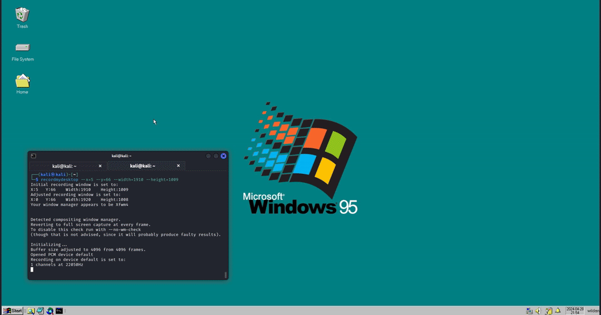

Saya juga menonton video Youtube ini[^2] sebagai referensi untuk membuat *rice* ini!

<iframe width="100%" height="468"
  src="https://www.youtube.com/embed/g-1B2QRtoxM"
  frameborder="0" allowfullscreen>
</iframe>

Sampai jumpa lagi! :)

[^1]: https://init.web.id/membahas-linux-ricing/
[^2]: https://www.youtube.com/watch?v=g-1B2QRtoxM
