*What is **Rofi**?*

# Kenalan dengan Rofi

Teman kalian mungkin ada yang namanya Rofi. Tapi, tentu saja artikel ini tidak sedang menggosipkan Rofi sebagai manusia, tapi Rofi sebagai sebuah program, xixi.

Merujuk pada definisi *official*-nya, secara singkat, Rofi yang dimaksud dalam artikel ini adalah

> *window switcher, run dialog and dmenu replacement
 rofi can act as an application launcher, window switcher, ssh launcher and
 dmenu replacement.*

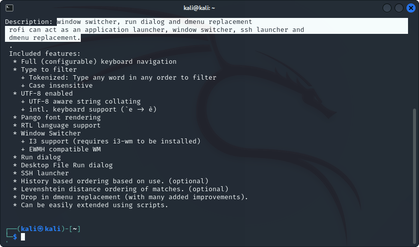

Atau definisi dengan versi yang lebih komplit:

> rofi  is *an X11 pop-up window switcher, run dialog, dmenu replacement, and more. It focuses on being fast to use and have minimal distraction. It supports keyboard and  mouse  navigation, type to filter, tokenized search and more.*

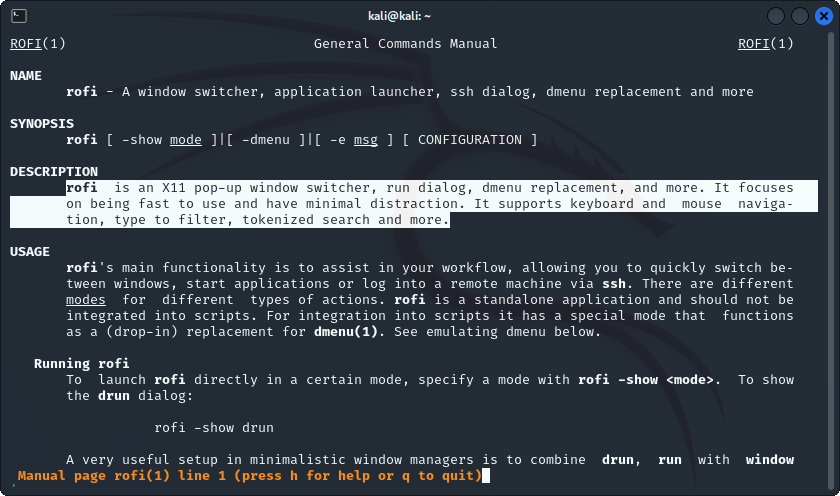

Nah, berdasarkan deskripsi di atas, bisa disimpulkan bahwa Rofi adalah sebuah program di ada di linux (dan sebetulnya bisa juga digunakan di Windows) yang dapat berfungsi sebagai:
1. Application Launcher
2. Window Switcher. SSH launcher, dan
3. *dmenu replacement*

Masih bingung?

Supaya lebih jelas, mari kita lihat langsung apa itu Rofi dengan langsung mempraktikkannya.

# Instalasi Rofi + Review Singkat 

Untuk menginstall rofi di distro linux:

|   **Distro**    |            **Install**             |
|     ---         |                 ---                |
|   Debian[^1]    |       `sudo apt install rofi`      |
|   Arch[^2]      |       `sudo pacman -S rofi`        |
|   Opensuse[^3]  |       `sudo zypper in rofi`        |
|   Fedora[^4]    |       `sudo dnf install rofi`      |

Atau kalian bisa meng-*compile source code*-nya langsung dari official repo Rofi di github[^5].

Dalam artikel ini, saya akan menggunakan Rofi di [Debian (dengan tema Chicago95 / Windows95)](https://abwildan.github.io/post/rice/) yang sudah saya install sebelumnya.

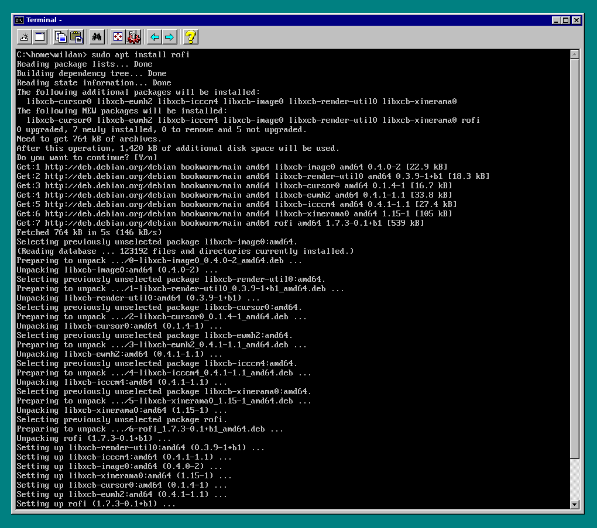

Setelah proses instalasi selesai, kita sudah dapat langsung menggunakan Rofi dengan mengetikkan perintah simpel berikut di terminal:

```bash
rofi
```
Maka, akan muncul tampilan berikut:
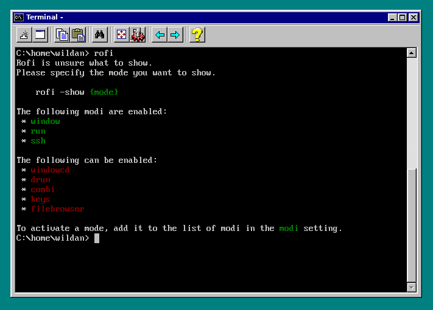

Tampilan tersebut menunjukkan cara menggunakan atau menampilkan window Rofi, yaitu dengan mengetikkan perintah

```bash
rofi -show {mode}
```

dimana mode-nya dapat dipilih:
   - **window**: untuk beralih window yang terbuka di setiap *workspace*
   - **run**: untuk menjalankan semua program yang terinstall di OS linux (baik CLI maupun GUI) 
   - **ssh**: untuk melakukan *remote access*
   - **windowcd**: untuk beralih window yang terbuka di *workspace* aktif
   - **drun**: untuk menjalankan program GUI yang terinstall di OS linux
   - **combi**: kombinasi dari ***[window] + [run] + [drun]***
   - **keys**: untuk menampilkan *shortcut*
   - **filebrowser**: sebagai *filebrowser* :)

Berikut contoh penggunaan setiap mode-nya:
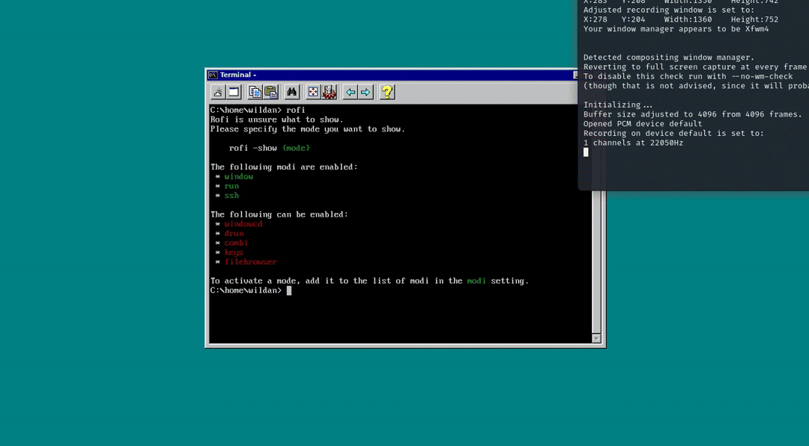

Selain itu, kita juga dapat mengganti tema Rofi. File tema-nya dapat kita temukan di `/usr/share../images/rofi/themes`. 
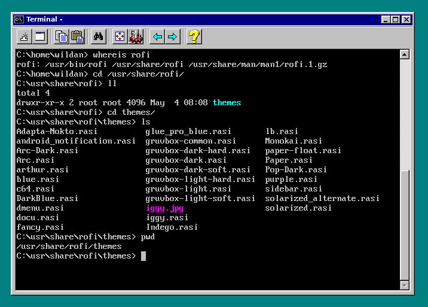

Perintah berikut dapat digunakan untuk mengganti tema Rofi:

```bash
rofi -show {mode} -theme {themes}
```
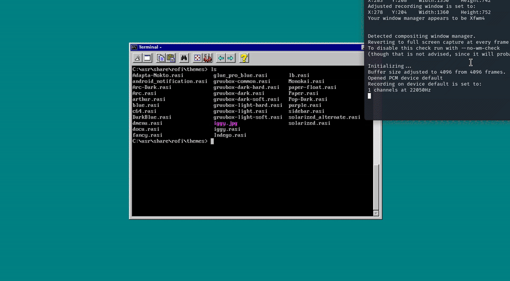

File konfigurasinya dapat di-*dump* dengan perintah
```bash
rofi -dump-config > config.rasi
```
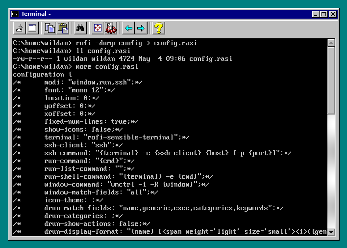

Selebihnya, kalian dapat mengulik sendiri. Kalau bingung, tinggal buka help atau manualnya saja.
```bash
rofi --help
man rofi
```

# Mempercantik Rofi

Setelah mengetahui *basic-basic* penggunaan Rofi, kali ini kita akan mempercantiknya. Saya akan menggunakan tema Rofi yang sudah disediakan oleh [adi1090x](https://github.com/adi1090x) yang bisa kalian temukan reponya di [link Github ini](https://github.com/adi1090x/rofi).

Repo Github tersebut menyediakan koleksi tema Rofi yang menurut saya keren-keren. Beberapa diantaranya misalnya:

[grid]
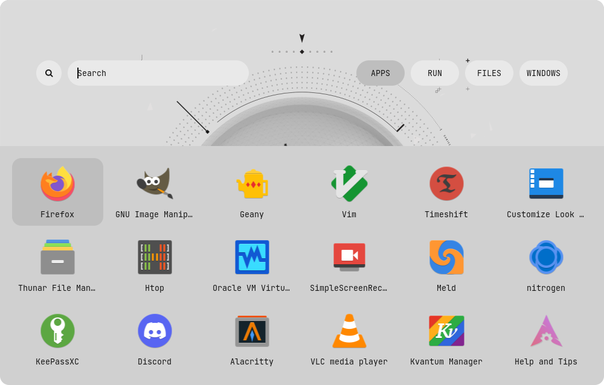
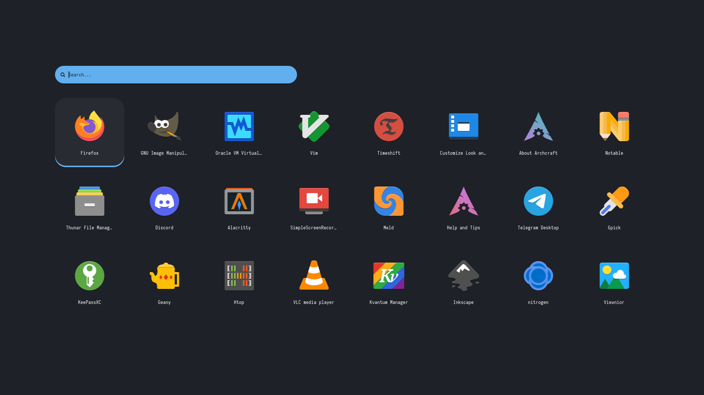
[/grid]

[grid]
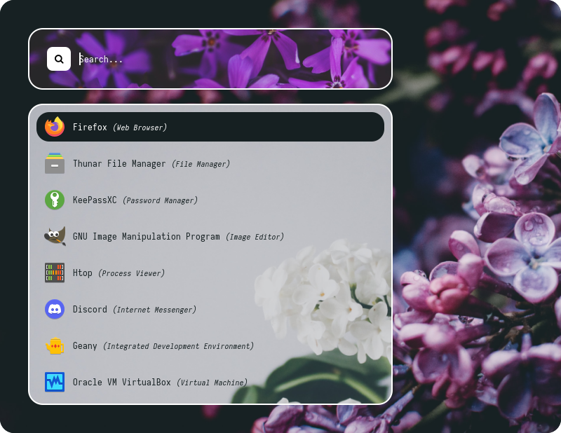
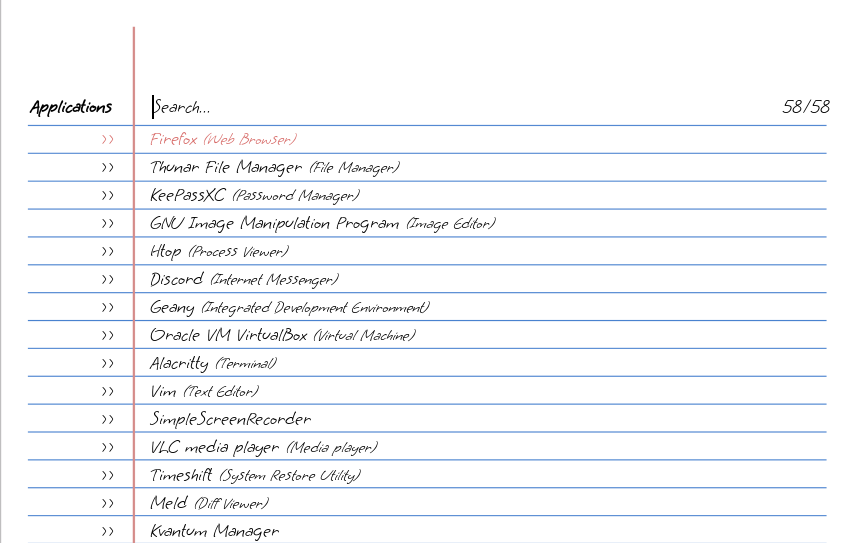
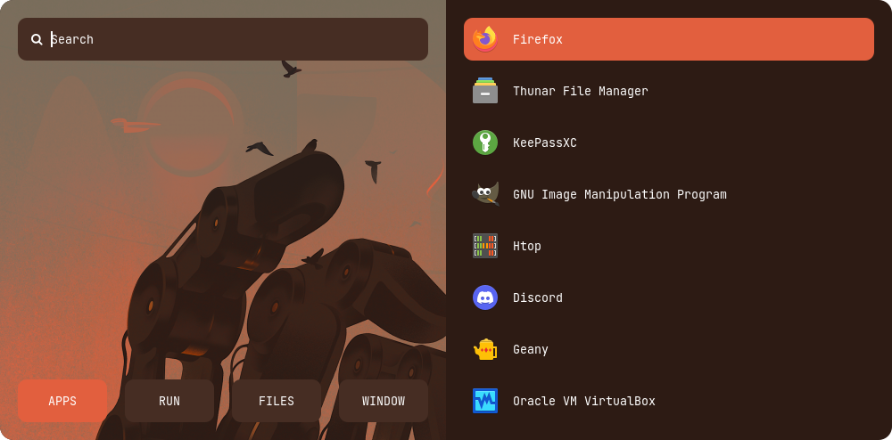
[/grid]

## Memasang Tema Rofi

1. Clone Github repo
```bash
git clone https://github.com/adi1090x/rofi.git
cd rofi
./setup.sh
```
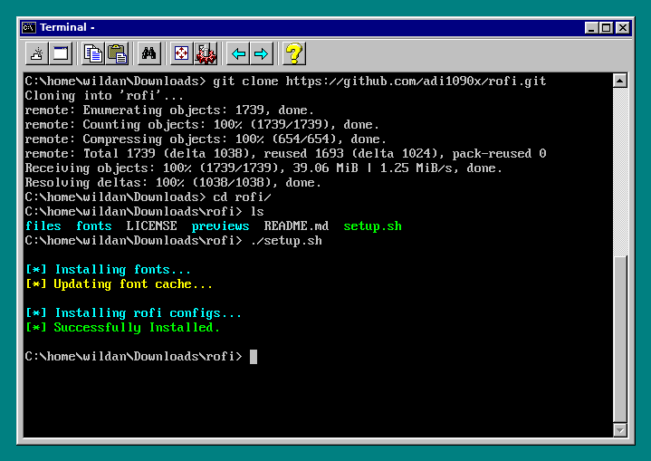

Sekarang, kita punya file konfigurasi Rofi yang baru di `/home/$USER/.config/config.rasi`:
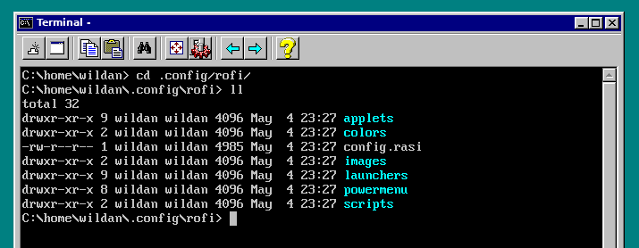

```bash title="config.rasi"
/**
 *
 * Author : Aditya Shakya (adi1090x)
 * Github : @adi1090x
 * 
 * Configuration For Rofi Version: 1.7.3
 **/

configuration {
	/*---------- General setting ----------*/
	modi: "drun,run,filebrowser,window";
	case-sensitive: false;
	cycle: true;
	filter: "";
	scroll-method: 0;
	normalize-match: true;
	show-icons: true;
	icon-theme: "Papirus";
/*	cache-dir: ;*/
	steal-focus: false;
/*	dpi: -1;*/

	/*---------- Matching setting ----------*/
	matching: "normal";
	tokenize: true;

	/*---------- SSH settings ----------*/
	ssh-client: "ssh";
	ssh-command: "{terminal} -e {ssh-client} {host} [-p {port}]";
	parse-hosts: true;
	parse-known-hosts: true;

	/*---------- Drun settings ----------*/
	drun-categories: "";
	drun-match-fields: "name,generic,exec,categories,keywords";
	drun-display-format: "{name} [<span weight='light' size='small'><i>({generic})</i></span>]";
	drun-show-actions: false;
	drun-url-launcher: "xdg-open";
	drun-use-desktop-cache: false;
	drun-reload-desktop-cache: false;
	drun {
		/** Parse user desktop files. */
		parse-user:   true;
		/** Parse system desktop files. */
		parse-system: true;
    }

	/*---------- Run settings ----------*/
	run-command: "{cmd}";
	run-list-command: "";
	run-shell-command: "{terminal} -e {cmd}";

	/*---------- Fallback Icon ----------*/
	run,drun {
		fallback-icon: "application-x-addon";
	}

	/*---------- Window switcher settings ----------*/
	window-match-fields: "title,class,role,name,desktop";
	window-command: "wmctrl -i -R {window}";
	window-format: "{w} - {c} - {t:0}";
	window-thumbnail: false;

	/*---------- Combi settings ----------*/
/*	combi-modi: "window,run";*/
/*	combi-hide-mode-prefix: false;*/
/*	combi-display-format: "{mode} {text}";*/

	/*---------- History and Sorting ----------*/
	disable-history: false;
	sorting-method: "normal";
	max-history-size: 25;

	/*---------- Display setting ----------*/
	display-window: "Windows";
	display-windowcd: "Window CD";
	display-run: "Run";
	display-ssh: "SSH";
	display-drun: "Apps";
	display-combi: "Combi";
	display-keys: "Keys";
	display-filebrowser: "Files";

	/*---------- Misc setting ----------*/
	terminal: "rofi-sensible-terminal";
	font: "Mono 12";
	sort: false;
	threads: 0;
	click-to-exit: true;
/*	ignored-prefixes: "";*/
/*	pid: "/run/user/1000/rofi.pid";*/

	/*---------- File browser settings ----------*/
    filebrowser {
/*	  directory: "/home";*/
      directories-first: true;
      sorting-method:    "name";
    }

	/*---------- Other settings ----------*/
    timeout {
      action: "kb-cancel";
      delay:  0;
    }

	/*---------- Keybindings ----------*/
/*
	kb-primary-paste: "Control+V,Shift+Insert";
	kb-secondary-paste: "Control+v,Insert";
	kb-clear-line: "Control+w";
	kb-move-front: "Control+a";
	kb-move-end: "Control+e";
	kb-move-word-back: "Alt+b,Control+Left";
	kb-move-word-forward: "Alt+f,Control+Right";
	kb-move-char-back: "Left,Control+b";
	kb-move-char-forward: "Right,Control+f";
	kb-remove-word-back: "Control+Alt+h,Control+BackSpace";
	kb-remove-word-forward: "Control+Alt+d";
	kb-remove-char-forward: "Delete,Control+d";
	kb-remove-char-back: "BackSpace,Shift+BackSpace,Control+h";
	kb-remove-to-eol: "Control+k";
	kb-remove-to-sol: "Control+u";
	kb-accept-entry: "Control+j,Control+m,Return,KP_Enter";
	kb-accept-custom: "Control+Return";
	kb-accept-custom-alt: "Control+Shift+Return";
	kb-accept-alt: "Shift+Return";
	kb-delete-entry: "Shift+Delete";
	kb-mode-next: "Shift+Right,Control+Tab";
	kb-mode-previous: "Shift+Left,Control+ISO_Left_Tab";
	kb-mode-complete: "Control+l";
	kb-row-left: "Control+Page_Up";
	kb-row-right: "Control+Page_Down";
	kb-row-down: "Down,Control+n";
	kb-page-prev: "Page_Up";
	kb-page-next: "Page_Down";
	kb-row-first: "Home,KP_Home";
	kb-row-last: "End,KP_End";
	kb-row-select: "Control+space";
	kb-screenshot: "Alt+S";
	kb-ellipsize: "Alt+period";
	kb-toggle-case-sensitivity: "grave,dead_grave";
	kb-toggle-sort: "Alt+grave";
	kb-cancel: "Escape,Control+g,Control+bracketleft";
	kb-custom-1: "Alt+1";
	kb-custom-2: "Alt+2";
	kb-custom-3: "Alt+3";
	kb-custom-4: "Alt+4";
	kb-custom-5: "Alt+5";
	kb-custom-6: "Alt+6";
	kb-custom-7: "Alt+7";
	kb-custom-8: "Alt+8";
	kb-custom-9: "Alt+9";
	kb-custom-10: "Alt+0";
	kb-custom-11: "Alt+exclam";
	kb-custom-12: "Alt+at";
	kb-custom-13: "Alt+numbersign";
	kb-custom-14: "Alt+dollar";
	kb-custom-15: "Alt+percent";
	kb-custom-16: "Alt+dead_circumflex";
	kb-custom-17: "Alt+ampersand";
	kb-custom-18: "Alt+asterisk";
	kb-custom-19: "Alt+parenleft";
	kb-select-1: "Super+1";
	kb-select-2: "Super+2";
	kb-select-3: "Super+3";
	kb-select-4: "Super+4";
	kb-select-5: "Super+5";
	kb-select-6: "Super+6";
	kb-select-7: "Super+7";
	kb-select-8: "Super+8";
	kb-select-9: "Super+9";
	kb-select-10: "Super+0";
	ml-row-left: "ScrollLeft";
	ml-row-right: "ScrollRight";
	ml-row-up: "ScrollUp";
	ml-row-down: "ScrollDown";
	me-select-entry: "MousePrimary";
	me-accept-entry: "MouseDPrimary";
	me-accept-custom: "Control+MouseDPrimary";
*/
}
```

Sebelum mulai mengkonfigurasi temanya, kita perlu memperbaiki ***sesuatu*** di file konfigurasinya terlebih dahulu karena menyebabkan Rofi tidak bisa berjalan dengan
semestina (***re**:error*).
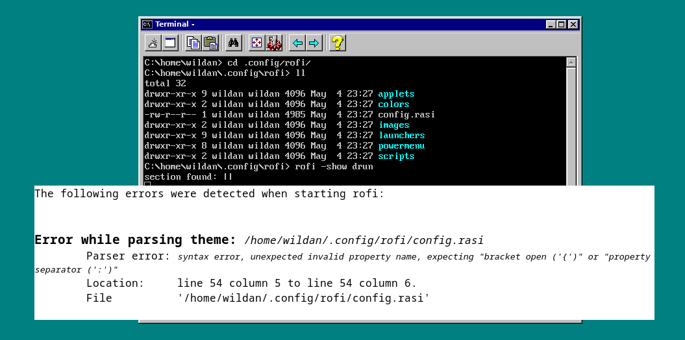

Menurut keterangan *error* di atas, kita perlu mengecek file konfigurasi di line 54...
 

Ada dua perintah di bawah bagian **Fallback Icon**, yaitu `run,drun`, mungkin itu yang membuat Rofi jadi bingung. So, kita hapus `run`.

## Konfigurasi Tema Baru

Sekarang, kita akan mulai mencoba tema baru. Tema-tema yang tadi sudah di-clone bisa dicoba di direktori `launchers`. Nanti kita bisa menemukan ada 7 *type* tema dimana di setiap *type*-nya ada file **`launcher.sh`** yang kita eksekusi untuk menampilkan tema-nya. Setiap *type* juga punya file konfigurasi tema yang beragam. Jadi, kita bisa mengganti opsi tema-nya berdasarkan file konfigurasi yang tersedia di setiap direktori *type*. 

Tapi, kita hanya perlu fokus di file **`launcher.sh`**-nya saja. Kira-kira nanti bagan direktori di `/home/$USER/.config../images/rofi/launchers/` akan seperti ini:
```bash
.
├── type-1
│    ├── launcher.sh      <--- Fokus ke sini
│    ├── style-1.rasi
│    ├── style-2.rasi
│    └── style-3.rasi   
├── type-2
│    ├── launcher.sh      <--- Fokus ke sini
│    ├── style-1.rasi
│    ├── style-2.rasi
│    └── style-3.rasi
├── type-3
│    ├── launcher.sh      <--- Fokus ke sini
│    ├── style-1.rasi
│    ├── style-2.rasi
│    └── style-3.rasi
├── type-4
│    ├── launcher.sh      <--- Fokus ke sini
│    ├── style-1.rasi
│    ├── style-2.rasi
│    └── style-3.rasi
├── type-5
│    ├── launcher.sh      <--- Fokus ke sini
│    ├── style-1.rasi
│    ├── style-2.rasi
│    └── style-3.rasi
├── type-6
│    ├── launcher.sh      <--- Fokus ke sini
│    ├── style-1.rasi
│    ├── style-2.rasi
│    └── style-3.rasi
└── type-7
     ├── launcher.sh      <--- Fokus ke sini
     ├── style-1.rasi
     ├── style-2.rasi
     └── style-3.rasi
```
> **Keterangan:**
>
> - File **launcher.sh** adalah *script* untuk menampilkan tema
> - File **style-1/2/3.rasi** adalah file konfigurasi tema 

Isi dari setiap file **launcher.sh**-nya kurang lebih seperti ini (saya ambil dari direktori **type-1**):
```bash
#!/usr/bin/env bash

## Author : Aditya Shakya (adi1090x)
## Github : @adi1090x
#
## Rofi   : Launcher (Modi Drun, Run, File Browser, Window)
#
## Available Styles
#
## style-1     style-2     style-3     style-4     style-5
## style-6     style-7     style-8     style-9     style-10
## style-11    style-12    style-13    style-14    style-15

dir="$HOME/.config../images/rofi/launchers/type-1"
theme='style-1'

## Run
rofi \
    -show drun \
    -theme ${dir}/${theme}.rasi
```

Jadi, untuk mengganti *style* tema-nya, kita hanya perlu mengganti baris 

`theme='style-1'`

ke *style* yang tersedia **Available Styles**. Tidak semua *type* menyediakan jumlah *style* yang sama. Kalian bisa melihatnya langsung di setiap direktori *type*.

Sebagai contoh, saya akan menggunakan config **style-6** di **type-1**:
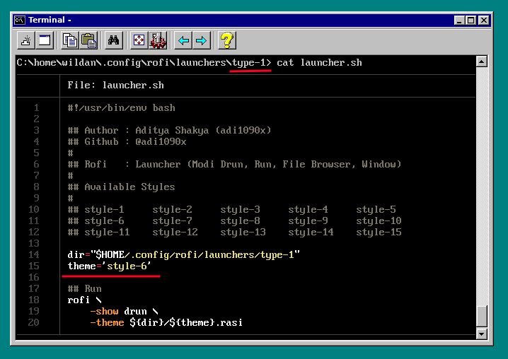

Jalankan *script* **launcher.sh**-nya...
```bash
./launcher.sh
```
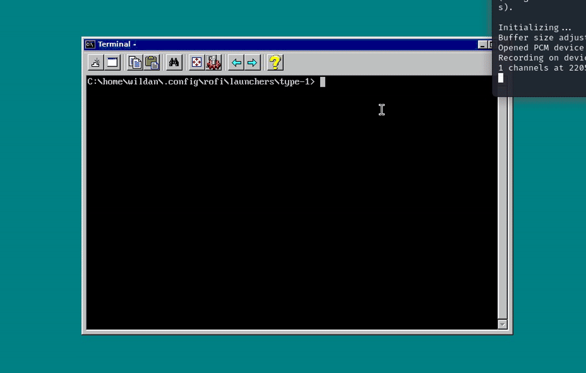

Berhasil!!

Tapi, kalau dilihat-lihat, icon-icon aplikasi yang muncul belum sesuai dengan tema distro-nya, *which is* Windows95 a.k.a **Chicago95**. Jadi, kita perlu menyesuaikan icon-nya juga. Gampang, kita tinggal ganti di file config rofi-nya saja. 
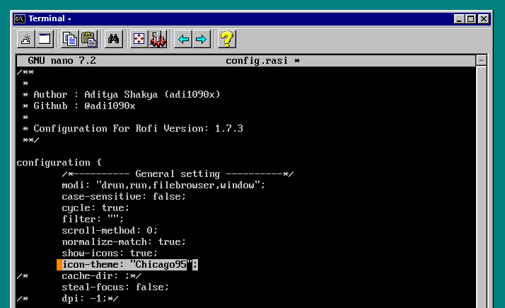

Sekarang, icon-nya sudah berubah ke Chicago95 :)
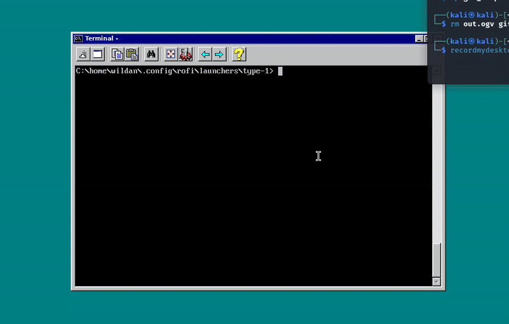

Tapi, warna tema-nya masih biru, belum sesuai juga dengan tema distro-nya, Chicago95. Nah, berhubung warna tema yang ada di cover artikel ini sama dengan warna tema Chicago95, yaitu abu-abu, kita akan gunakan tema tersebut. Tema itu ada di **type-7** dengan file config **style-6**. 

So, kita akan mengeksekusi *script* **launcher.sh** di direktori **type-7**. Jangan lupa untuk mengganti tema ke style-6 di **launcher.sh**.
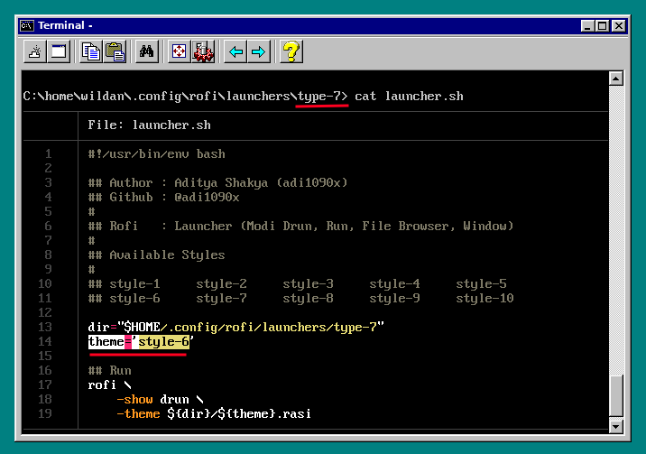

Eksekusi...
```bash
./launcher.sh
```
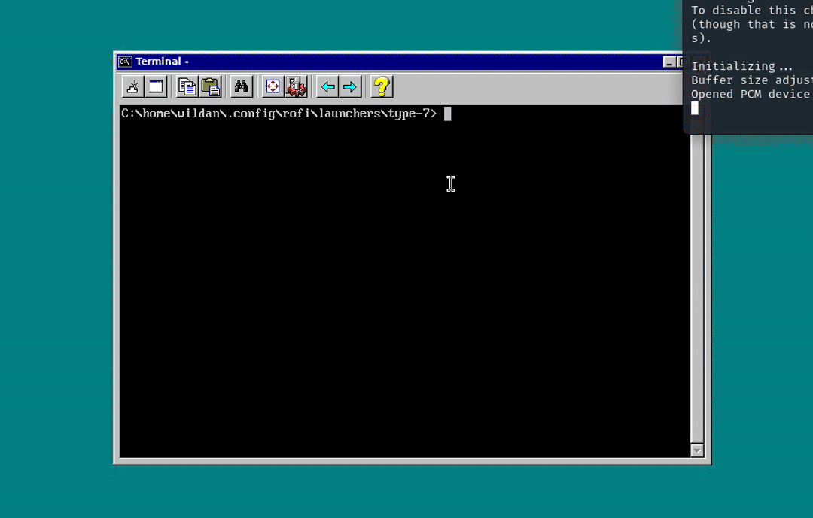

Yooo!!

Dan kita bisa mengedit size window-nya, size icon-nya, gambar background-nya, dan lain-lain di file konfigurasi tema-nya (dalam konteks tema ini di `/home/$USER/.config../images/rofi/launcher/type-7/style-6.rasi`).

Sekarang, supaya Rofi kita bisa muncul ketika kita menekan tombol Windows atau **[`Super Key`]**, kita bisa menambahkannya ke ***Application Shortcuts*** di pengaturan Keyboard.
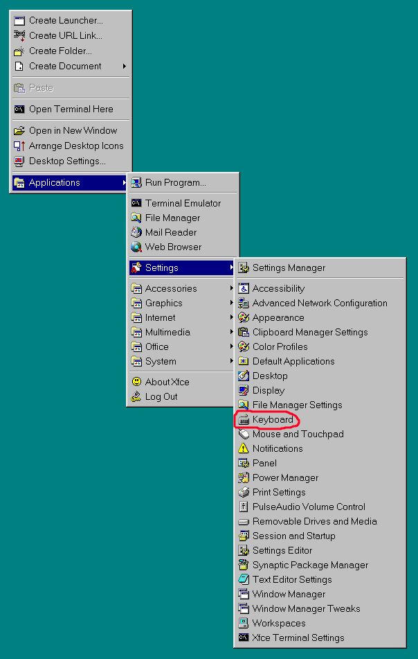

Berikutnya, pada menu ***Application Shortcuts***, klik ***Add***.
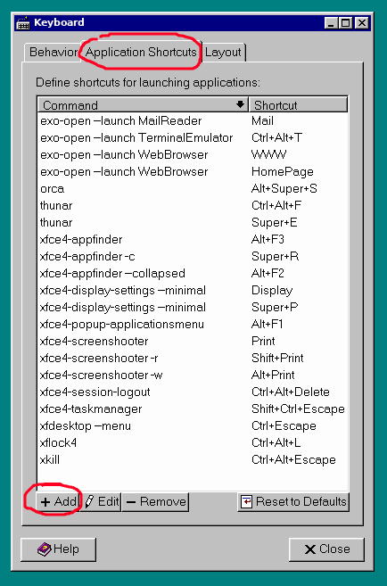

Kemudian, nanti akan muncul window ***Shortcut Command***, klik ***icon* folder** kuning di sebelah kanan, dan pilih file **launcher.sh** di direktori **type-7** tadi.
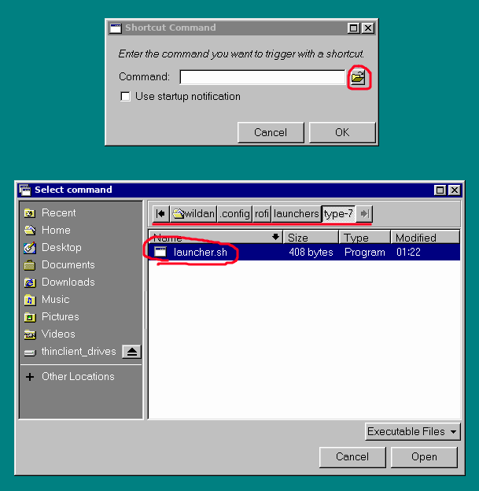

Dan akan muncul window untuk men-set *shortcut* yang diinginkan. Silakan tekan tombol Windows atau **[`Super Key`]**.
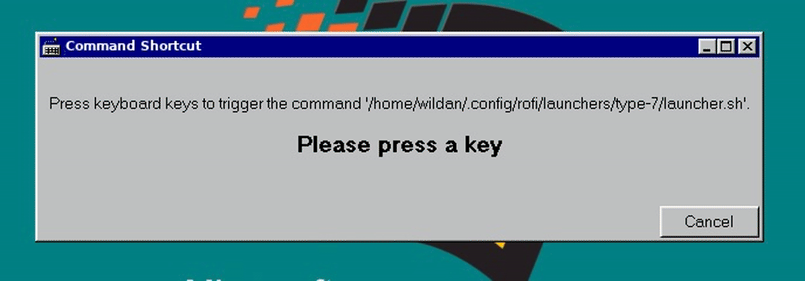

Setelah itu, kita bisa melihat di menu ***Application Shortcuts***, aplikasi Rofi kita baru saja diberi *shortcut* baru. Yeeay!!
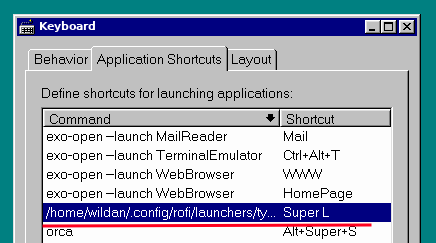

Dengan begitu, setiap kali kita menekan tombol **[`Super Key`]**, Rofi dengan tema baru akan tampak!
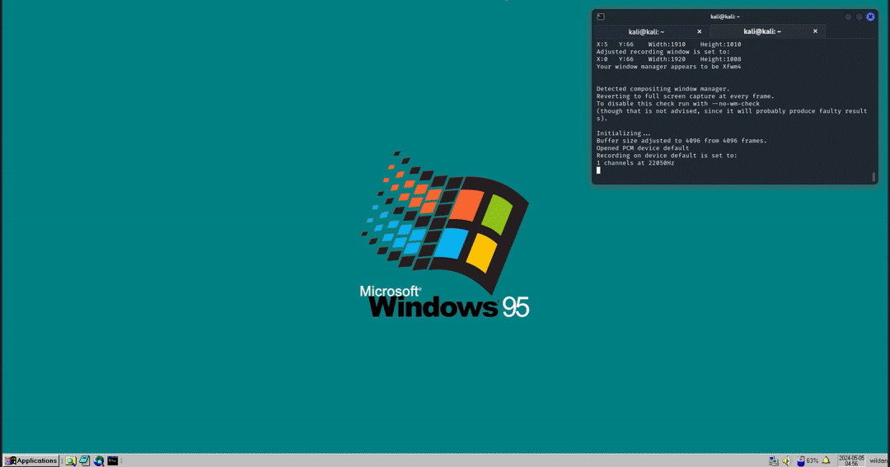

Mantavvv!!

Sekian dulu sharing tentang Rofi di artikel ini...

Sampai jumpa lagi di artikel saya yang lain.

[^1]: https://packages.debian.org/search?searchon=contents&keywords=rofi&mode=path&suite=stable&arch=any
[^2]: https://archlinux.org/packages/?sort=&q=rofi&maintainer=&flagged=
[^3]: https://software.opensuse.org/package/rofi
[^4]: https://packages.fedoraproject.org/pkgs/rofi/
[^5]: https://github.com/davatorium/rofi
