Hola!

RStudio menurut saya adalah *software* keren untuk mengolah data menggunakan bahasa R. Jadi, saya memutuskan untuk membahasnya di artikel ini. Tapi, sebagaimana judulnya, saya hanya akan memberikan *overview* tentang RStudio secara singkat.

Beberapa hal yang akan saya bahas dari Rstudio di artikel ini terbagi ke dalam 6 bagian:
1. What is R & RStudio?
2. Why R & RStudio[^1] 
3. R & RStudio Installation 
4. RStudio Interface Introduction
5. Installing Packages (tidyverse & palmerpenguins)
6. Playing with Data 

## 1. What is R & RStudio?

Pertanyaan pertama yang paling penting karena bersifat ontologis: **"Apa itu R?"**  
Secara sederhana, R adalah sebuah bahasa pemrograman yang digunakan untuk mengolah dan memvisualisasikan data[^1]. R juga bisa didefinisikan secara rinci sebagai software dan juga bahasa pemrograman yang digunakan untuk melakukan analisis data statistik[^2]. R diciptakan oleh Robert Gentleman dan kawan-kawannya di Universitas Auckland, Selandia baru[^3]. R juga merupakan *project* GNU yang berbasis *open source* alias gratis.

RStudio atau RStudio Desktop adalah *software* yang berfungsi sebagai *interface* atau antarmuka grafis untuk bahasa R. Kita bisa menyebut RStudio sebagai IDE atau  *Integrated Development Environment* untuk bahasa R, sehingga memudahkan kita untuk membuat program berbasis R. RStudio dibuat oleh Posit (dulu namanya RStudio juga, sekarang sudah berganti nama menjadi Posit), sebuah perusahaan pengembang *software data science open source* yang sudah berdiri sejak tahun 2009[^4].

## 2. Why R & RStudio?

Sekarang, kita masuk ke pertanyaan yang bersifat aksiologis, yang juga penting, yaitu **"Mengapa harus bahasa R dan RStudio?"**  
Beberapa alasan yang bisa menjustifikasi keunggulan bahasa R[^2]:
1. R adalah bahasa pemrograman yang gratis dan *open source*. *Open source* artinya kita bisa memodifikasi bahasa R itu sendiri sesuai kebutuhan dan juga boleh dan sah untuk didistribusikan kembali karena *source code*-nya memang "*open*".
2. R tersedia dan dapat di-*instal* di berbagai sistem operasi populer saat ini, seperti Linux, Windows, dan MacOS.
3. R juga memungkinkan kita untuk membuat graph atau grafik yang berkualitas untuk dipublikasikan.
4. R juga menyediakan metode dan algoritma statistik yang dibuat oleh penggunanya sendiri (nama repositorinya - semacam playstore atau apple store - yaitu CRAN, singkatan dari *Comprehensive R Archive Network*).

RStudio juga menjadi IDE favorit bagi para R data programmer karena[^9]:
1. RStudio sebagai IDE (*Integrated Development Environment*) menyediakan fitur-fitur *user-friendly* yang memang khusus diperuntukkan untuk pemrograman R, misalnya fitur seperti *syntax higlighting*, *code completion*, dan lain sebagainya.
2. RStuio juga mendukung para pemrogram bahasa R untuk membuat *project management* yang baik sehingga memudahkan mereka untuk mengatur banyak data, *script* pemrograman, dan yang lainnya.
3. RStudio juga *support* untuk membuat visualisasi data dengan berbagai grafik, khususnya menggunakan *library* populer seperti `ggplot2`. Pada bagian "RStudio Interface Introduction" di artikel ini, saya akan menunjukkan bagaimana RStudio meng-*handle* visualisasi data.
4. Melalui RStudio, kita juga bisa melakukan *package management* dengan mudah karena sudah terintegrasi dengan *package manager* dan CRAN sebagai *repository*. Artinya, kita dapat meng-*install*, meng-*update*, dan meng-*uninstall* *packages* serta *libraries* yang tersedia.  
5. RStudio juga *support* Markdown Syntax sehingga memudahkan kita (sebagai R progammer) untuk membuat _report_, presentasi, ataupun dokumentasi hasil olah data (baik kode yang kita gunakan, visualisasinya, berikut juga dengan narasinya) dengan rapih.

Berikut adalah *cheatsheet* Markdown Syntax untuk R & RStudio:  

<iframe 
  src="../../../../public/assets/pdf/rstudio-basic/rmarkdowncheatsheet.pdf" 
  width="100%" 
  height="600px"
  style="border: none;">
</iframe>

sumber: https://www.rstudio.com/wp-content/uploads/2015/02/rmarkdown-cheatsheet.pdf

## 3. R & Rstudio Installation

Sekarang, kita akan mulai menjawab pertanyaan epistemologis-nya, dimulai dari cara meng-*install*-nya.  
Disclaimer dulu, di artikel ini, saya hanya akan membahas cara meng-*install* R dan RStudio di *environment* linux saja, khususnya linux berbasis debian/ubuntu.

1. Langkah pertama, kita perlu memasang R.
```shell
sudo apt update && sudo apt upgrade # untuk meng-update dan meng-upgrade paket-paket

sudo apt install -y r-base r-base-dev
```

2. Kemudian, kita bisa mengunduh package file-nya yang berekstensi `.deb` di [RStudio Download di sini](https://posit.co/download/rstudio-desktop/).  

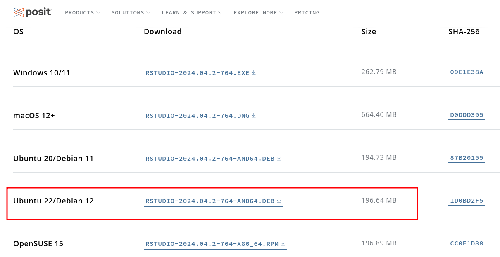
Karena saya menggunakan Debian 12 (bookworm), maka saya memilih yang Ubuntu 22/Debian 12. Silakan disesuaikan dengan distribusi linux kalian.  
> **Note:** Sependek pengetahuan saya, RStudio di Archlinux hanya dapat di-*install* via repositori komunitasnya alias AUR (*Arch User Repository*). 

3. Kita tinggal menginstallnya via terminal dengan perintah:
```shell
sudo apt update # untuk memperbaharui paket-paket di repository

sudo dpkg -i ./rstudio-2024.04.2-764-amd64.deb
```

atau
```shell
sudo apt update # untuk memperbaharui paket-paket di repositor

sudo apt -y install ./rstudio-2024.04.2-764-amd64.deb
```

Tunggu beberapa saat hingga proses instalasinya selesai berjalan.

Jika sudah selesai, kita juga perlu memasang beberapa paket R yang dibutuhkan:
```shell
sudo apt install -y r-cran-curl r-cran-xml2 r-cran-httr r-cran-gargle r-cran-systemfonts r-cran-rvest
```

Proses instalasi-nya akan memakan sekitar 1 GB penyimpanan, jadi harap bersabar menunggu...

## 4. Rstudio Interface Introduction

Setelah terpasang, kita bisa membuka RStudio yang kira-kira tampilan awalnya seperti ini:
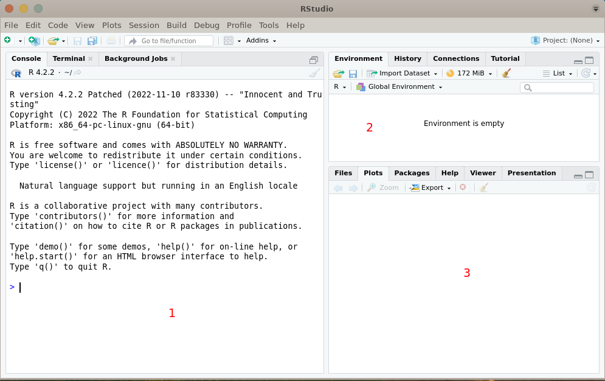

Di bagian pertama, ada 3 sub-window, yaitu[^5]:
- **Console:** Ini adalah tempat utama di mana kita dapat mengetik dan mengeksekusi perintah R secara langsung. Hasil dari perintah yang dieksekusi akan ditampilkan di sini.
- **Terminal:** Terminal memberikan akses langsung ke sistem operasi yang mendukung perintah shell. Ini memungkinkan kita untuk menjalankan perintah shell (seperti bash) dan perintah sistem lainnya dari dalam RStudio.
- **Background Jobs:** Tab ini menunjukkan daftar pekerjaan yang sedang berjalan di *background*. Ini termasuk proses R yang sedang berjalan atau pekerjaan lain yang Anda mulai dari sesi RStudio kita.

Di bagian kedua, ada 4 sub-window, yaitu:
- **Environment:** Ini menampilkan daftar objek (seperti vektor, data frame, dll.) yang sudah kita buat dalam sesi R. Kita juga dapat melihat nilai-nilai objek dan propertinya di sini.
- **History:** Tab ini berisi riwayat perintah yang telah kita jalankan di Console. Ini membantu kita untuk mengakses kembali perintah-perintah sebelumnya dan menjalankannya kembali jika diperlukan (tapi lupa - atau malas mengetikkan ulang).
- **Connections:** Menampilkan daftar koneksi yang terbuka ke server atau database eksternal. Kita dapat mengelola koneksi, menjalankan query, dan lainnya dari sini.
- **Tutorial:** Ini adalah area di mana RStudio dapat menampilkan tutorial atau dokumen bantuan yang terkait dengan alat, paket, atau konsep R tertentu. Ini bisa sangat bermanfaat untuk pembelajaran dan referensi.

Di bagian ketiga, ada 6 sub-window, yaitu:
- **Files:** Menampilkan struktur direktori dan file dari sistem file komputer. Kita dapat menjelajahi file, membuka skrip R, atau mengimpor dataset langsung dari sini.
- **Plots:** Ini adalah tempat di mana plot grafik yang dihasilkan dari perintah R akan ditampilkan secara langsung. Kita dapat melihat, menyimpan, dan menyesuaikan plot dari sini.
- **Packages:** Menyediakan daftar paket-paket R yang telah diinstal. Kita dapat melihat paket yang sedang dimuat, menginstal paket baru, mengelola versi paket, dan lainnya.
- **Help:** Ini adalah tempat untuk mencari bantuan dan dokumentasi terkait fungsi-fungsi R dan paket-paketnya. Kita dapat mencari bantuan untuk fungsi tertentu, membaca dokumentasi paket, dan lainnya.
- **Viewer:** Menampilkan konten yang dihasilkan oleh aplikasi R yang menjalankan aplikasi web internal. Misalnya, kalau kita menjalankan aplikasi Shiny, tampilan aplikasi akan ditampilkan di sini.
- **Presentation:** Menyediakan alat untuk membuat presentasi di RMarkdown atau memvisualisasikan presentasi yang sudah ada. Kita dapat membuat, menyunting, dan menjalankan presentasi langsung dari RStudio.

Ketika kita ingin menampilkan dataframe, maka dataframe tersebut juga akan muncul di bagian kiri seperti berikut:
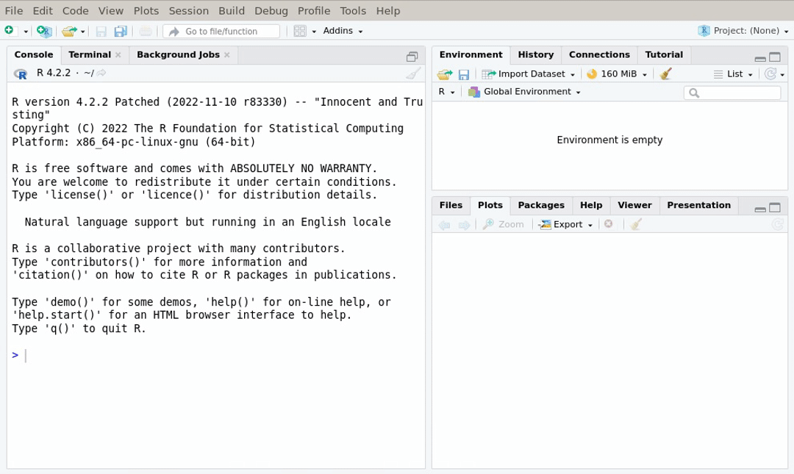

## 5. Installing Packages (tidyverse & palmerpenguins)

> **Notes:** *Packages* adalah sekumpulan kode yang ditulis, diuji, dan kemudian dirilis dengan tujuan untuk menyelesaikan permasalahan tertentu[^10]. Sebetulnya, kita bisa mengambil *packages* dari sumber manapun, tapi sebagai pemula, ada baiknya memulai untuk mengambil atau meng-*install* *package* dari [CRAN](https://cran.r-project.org/).

Untuk kebutuhan demonstrasi, kita memerlukan dua library utama, yaitu tidyverse dan palmerpenguins.  
Kita bisa melihat informasi atau deskripsi dari sebuah paket atau library dengan mengetikkan perintah berikut di console`packageDescription("nama_library")`. Misalnya, saya ingin melihat informasi tentang paket/library **`tidyverse`**:
```R
packageDescription("tidyverse")
```
Outputnya:
```R
Package: tidyverse
Title: Easily Install and Load the 'Tidyverse'
Version: 2.0.0
Authors@R: c( person("Hadley", "Wickham", , "hadley@rstudio.com", role = c("aut", "cre")),
            person("RStudio", role = c("cph", "fnd")) )
Description: The 'tidyverse' is a set of packages that work in harmony because they share common data
            representations and 'API' design. This package is designed to make it easy to install and load
            multiple 'tidyverse' packages in a single step. Learn more about the 'tidyverse' at
            <https://www.tidyverse.org>.
License: MIT + file LICENSE
URL: https://tidyverse.tidyverse.org, https://github.com/tidyverse/tidyverse
BugReports: https://github.com/tidyverse/tidyverse/issues
Depends: R (>= 3.3)
Imports: broom (>= 1.0.3), conflicted (>= 1.2.0), cli (>= 3.6.0), dbplyr (>= 2.3.0), dplyr (>= 1.1.0),
            dtplyr (>= 1.2.2), forcats (>= 1.0.0), ggplot2 (>= 3.4.1), googledrive (>= 2.0.0),
            googlesheets4 (>= 1.0.1), haven (>= 2.5.1), hms (>= 1.1.2), httr (>= 1.4.4), jsonlite (>=
            1.8.4), lubridate (>= 1.9.2), magrittr (>= 2.0.3), modelr (>= 0.1.10), pillar (>= 1.8.1), purrr
            (>= 1.0.1), ragg (>= 1.2.5), readr (>= 2.1.4), readxl (>= 1.4.2), reprex (>= 2.0.2), rlang (>=
            1.0.6), rstudioapi (>= 0.14), rvest (>= 1.0.3), stringr (>= 1.5.0), tibble (>= 3.1.8), tidyr
            (>= 1.3.0), xml2 (>= 1.3.3)
Suggests: covr (>= 3.6.1), feather (>= 0.3.5), glue (>= 1.6.2), mockr (>= 0.2.0), knitr (>= 1.41),
            rmarkdown (>= 2.20), testthat (>= 3.1.6)
VignetteBuilder: knitr
Config/Needs/website: tidyverse/tidytemplate
Config/testthat/edition: 3
Encoding: UTF-8
RoxygenNote: 7.2.3
NeedsCompilation: no
Packaged: 2023-02-21 13:20:46 UTC; hadleywickham
Author: Hadley Wickham [aut, cre], RStudio [cph, fnd]
Maintainer: Hadley Wickham <hadley@rstudio.com>
Repository: CRAN
Date/Publication: 2023-02-22 09:20:06 UTC
Built: R 4.2.2; ; 2024-06-13 14:52:25 UTC; unix

-- File: /home/wildan/R/x86_64-pc-linux-gnu-library/4.2/tidyverse/Meta/package.rds 
```

Saya juga ingin tahu tentang package/library **`palmerpenguins`**:
```R
packageDescription("palmerpenguins")
```
Outputnya:
```R
Package: palmerpenguins
Title: Palmer Archipelago (Antarctica) Penguin Data
Version: 0.1.1
Date: 2022-08-12
Authors@R: c( person(given = "Allison", family = "Horst", role = c("aut", "cre"), email =
            "ahorst@ucsb.edu", comment = c(ORCID = "0000-0002-6047-5564")), person(given = "Alison", family
            = "Hill", role = c("aut"), email = "apresstats@gmail.com", comment = c(ORCID =
            "0000-0002-8082-1890")), person(given = "Kristen", family = "Gorman", role = c("aut"), email =
            "kbgorman@alaska.edu", comment = c(ORCID = "0000-0002-0258-9264")) )
Description: Size measurements, clutch observations, and blood isotope ratios for adult foraging Adélie,
            Chinstrap, and Gentoo penguins observed on islands in the Palmer Archipelago near Palmer
            Station, Antarctica. Data were collected and made available by Dr. Kristen Gorman and the
            Palmer Station Long Term Ecological Research (LTER) Program.
License: CC0
Encoding: UTF-8
LazyData: true
RoxygenNote: 7.2.1.9000
Depends: R (>= 2.10)
Suggests: knitr, rmarkdown, tibble, ggplot2, dplyr, tidyr, recipes
URL: https://allisonhorst.github.io/palmerpenguins/, https://github.com/allisonhorst/palmerpenguins
BugReports: https://github.com/allisonhorst/palmerpenguins/issues
NeedsCompilation: no
Packaged: 2022-08-13 17:49:08 UTC; allison
Author: Allison Horst [aut, cre] (<https://orcid.org/0000-0002-6047-5564>), Alison Hill [aut]
            (<https://orcid.org/0000-0002-8082-1890>), Kristen Gorman [aut]
            (<https://orcid.org/0000-0002-0258-9264>)
Maintainer: Allison Horst <ahorst@ucsb.edu>
Repository: CRAN
Date/Publication: 2022-08-15 07:40:07 UTC
Built: R 4.2.2; ; 2024-06-13 15:10:25 UTC; unix

-- File: /home/wildan/R/x86_64-pc-linux-gnu-library/4.2/palmerpenguins/Meta/package.rds
```

Mengapa saya membutuhkan dua *library* (`tidyverse` & `palmerpenguins`) untuk membahas tutorial basic R dan RStudio kali ini? Sederhananya, karena kedua library tersebut akan saya gunakan untuk praktik visualisasi data.

Library `tidyverse` menyediakan 8 *packages* untuk proses analisis data, terutama *package* **`ggplot2`** yang akan kita gunakan untuk membuat visualisasi data[^6].    

Sedangkan, salah satu *packages* dari *library* `palmerpenguins`, yaitu *package* **`penguins`** adalah dataset yang akan kita gunakan sebagai sumber olah datanya[^7].

Adapun perintah untuk meng-*install* kedua paket tersebut yaitu sebagai berikut:
```R
install.packages("tidyverse")
install.packages("palmerpenguins")
```

Atau dalam satu baris, kita dapat memasang kedua *packages* atau *library* tersebut seperti berikut[^7]:
```R
install.packages(c("tidyverse", "palmerpenguins"))
```

## 6. Playing with Data

Setelah ter-*install*, agar dapat digunakan, kita perlu memanggil kedua *packages* atau *libraries* tersebut dengan perintah:
```R
library("tidyverse")
library("palmerpenguins")
```

### Viewing Dataset

Kemudian, kita bisa melihat dataset **penguins** menggunakan fungsi `View()`:
```R
View(penguins)
```
> **Note:** R adalah bahasa yang *case-sensitive*. Artinya, akan berbeda hasilnya jika kita menggunakan fungsi `view()` dan fungsi `View()`. Jadi, perhatikan penulisannya!

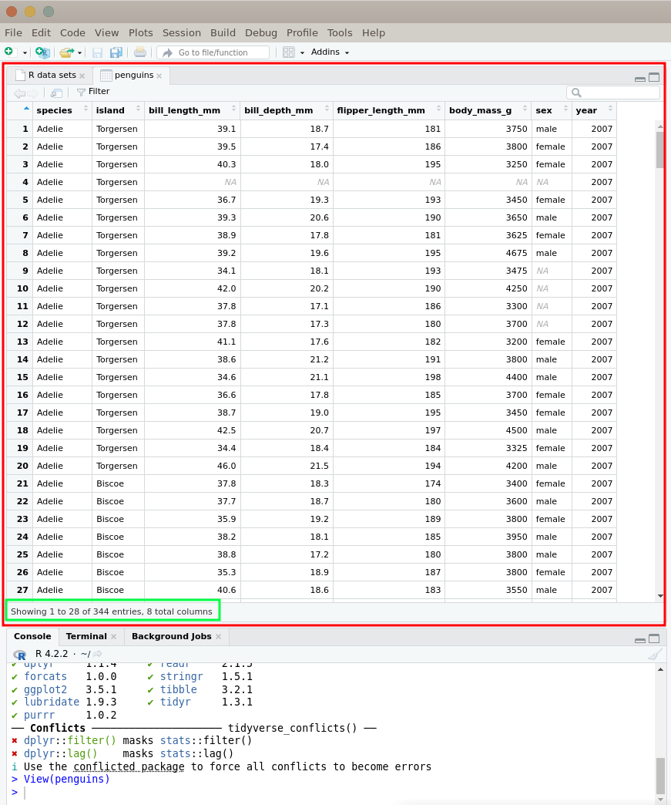

Seperti terlihat pada tangkapan layar di atas, dataset **penguins** berhasil ditampilkan. Pada bagian pojok kiri bawah, kita juga dapat melihat informasi mengenai jumlah data yang terdapat dalam dataset tersebut (baris dan kolom). 

Atau kalau kita ingin melihat informasi sebuah dataset tanpa harus menampilkan isinya, kita bisa menggunakan fungsi `glimpse()` di console:
```R
glimpse(penguins)
```
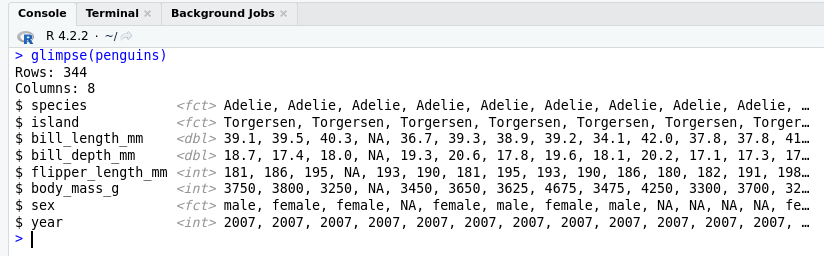

Informasi yang ditampilkan juga merupakan informasi yang sama, yaitu tentang jumlah baris dan kolom, berikut juga nama dari masing-masing kolom yang terdapat pada tabel dataset yang kita ingin ketahui (dalam hal ini adalah dataset **penguins**). Berdasarkan informasi tersebut, kita dapat mengetahui bahwa dataset **penguins** memiliki 344 baris atau bisa kita asumsikan juga bahwa terdapat ***344 penguin*** yang tercatat dan 8 kolom berupa informasi mengenai penguin-penguin tersebut yang terdiri dari ***species***, ***island***, ***bill_length_mm***, ***bill_depth_mm***, ***flipper_length_mm***, ***body_mass_g***, ***sex***, dan ***year***.

### Visualizing Data

Kita bisa membuat grafik dari dataset **penguins** tersebut menggunakan `ggplot2`. Beberapa jenis grafik yang dapat dibuat berikut dengan fungsinya masing-masing adalah sebagai berikut:

#### 1. Scatter Plot 

**Scatter Plot** atau **Grafik Pencar** digunakan untuk menampilkan hubungan antara dua variabel numerik.  
Misalnya: Hubungan antara panjang paruh dan panjang sirip penguin.

```R
ggplot(data = penguins, aes(x = bill_length_mm, y = flipper_length_mm, color=species)) +
  geom_point()
```

Hasilnya:
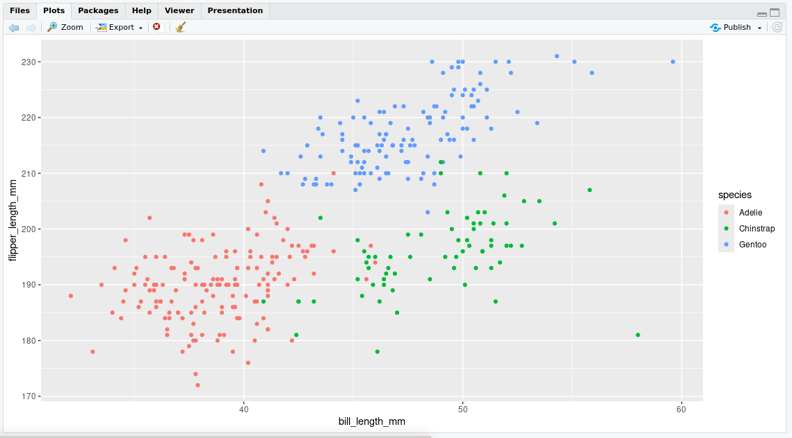

#### 2. Histogram

**Histogram** digunakan untuk menampilkan distribusi frekuensi dari suatu variabel numerik.  
Misalnya: Distribusi panjang paruh penguin.

```R
ggplot(data = penguins, aes(x = bill_length_mm)) +
  geom_histogram(binwidth = 2, fill = "skyblue", color = "black")
```

Hasilnya:
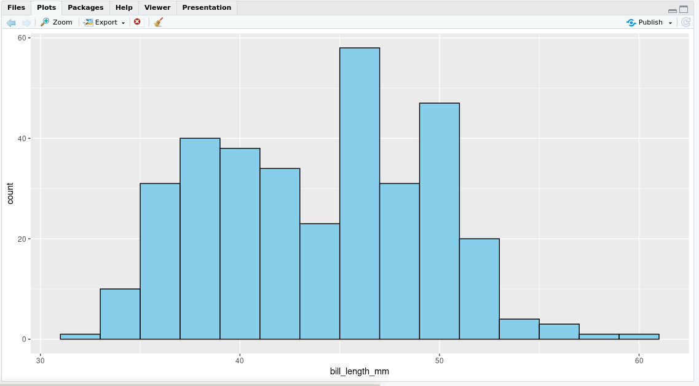

#### 3. Bar Plot

**Bar Plot** digunakan untuk menampilkan perbandingan antara kategori atau faktor dengan nilai-nilai numerik.  
Misalnya: Jumlah penguin berdasarkan spesiesnya.

```R
ggplot(data = penguins, aes(x = species, fill = species)) +
  geom_bar()
```

Hasilnya:
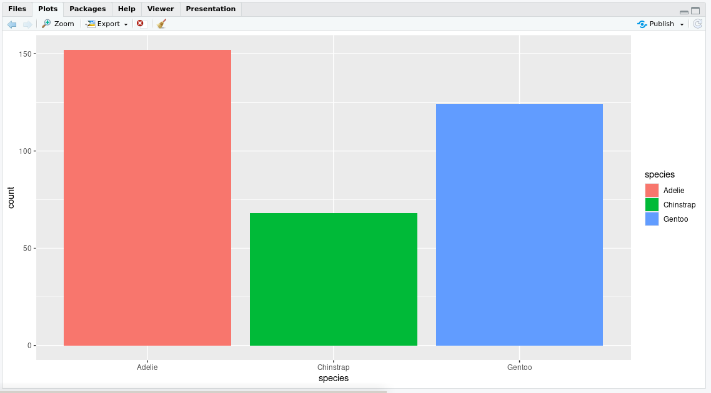

#### 4. Box Plot

**Box Plot** digunakan untuk menampilkan distribusi variabel numerik dalam beberapa kelompok kategori.  
Misalnya: Distribusi panjang paruh penguin berdasarkan spesiesnya.

```R
ggplot(data = penguins, aes(x = species, y = bill_length_mm, fill = species)) +
  geom_boxplot()
```

Hasilnya:
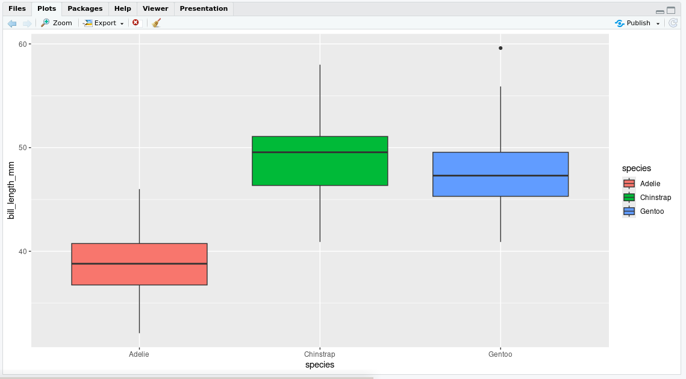

#### 5. Line Plot

**Line Plot** digunakan untuk menampilkan tren atau perubahan nilai variabel numerik secara berurutan.  
Misalnya: Perubahan berat badan penguin dari waktu ke waktu.

```R
# Hitung rata-rata berat badan per tahun untuk setiap spesies
avg_weight <- penguins %>%
  group_by(year, species) %>%
  summarise(avg_weight = mean(body_mass_g))

# Buat line plot
ggplot(data = avg_weight, aes(x = year, y = avg_weight, group = species, color = species)) +
  geom_line() +
  labs(x = "Tahun", y = "Rata-Rata Berat Badan (g)", title = "Perubahan Rata-Rata Berat Badan Penguin per Tahun") +
  theme_minimal()
```

Hasilnya:
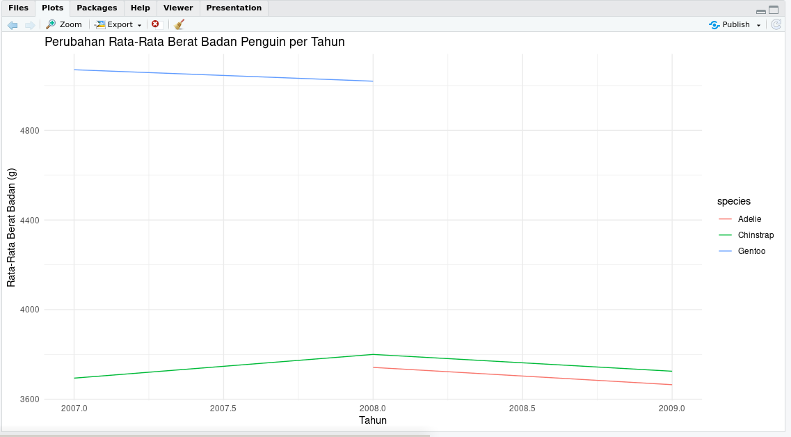


#### 6. Pie Chart

**Pie Chart** digunakan untuk menunjukkan atau membandingkan proporsi atau persentase dari beberapa kategori dalam suatu dataset[^11].  
Misalnya: Perbandingan jumlah spesies penguin.

```R
# Menghitung jumlah observasi per spesies
penguins_count <- penguins %>%
  count(species) %>%
  mutate(percent = n / sum(n) * 100)  # Menambahkan kolom percent

# Buat pie chart menggunakan ggplot2
pie <- ggplot(data = penguins_count, aes(x = "", y = n, fill = species)) +
  geom_bar(stat = "identity", width = 1) +
  coord_polar(theta = "y") +
  labs(fill = "Spesies", x = NULL, y = NULL, title = "Pie Chart Jumlah Observasi per Spesies") +
  theme_void() +
  theme(legend.position = "right")

# Tambahkan label persentase
pie +
  geom_text(aes(label = paste0(round(percent), "%")), position = position_stack(vjust = 0.5))
```

Hasilnya:
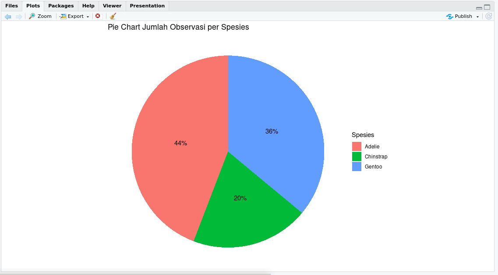

Sekian dulu untuk pembahasan RStudio Basic-nya. Kalau kalian ingin tahu lebih jauh tentang visualisasi di R dan RStudio, saya sarankan untuk membaca-baca lebih banyak, seperti misalnya pada artikel berikut: https://rpubs.com/alfanugraha/r-graph. Artikel tersebut membahas lebih dalam mengenai visualisasi dan grafik di R, mulai dari grafik dasar dengan fungsi `plot()`, `ggplot2()`, dan `ggplot()`, bahkan penerapan visualisasi spasial seperti peta.

Sampai jumpa lagi di artikel saya yang lain.  
See ya!

---
_By the way_, artikel ini saya buat dengan tampilan **Debian Desktop XFCE**:  
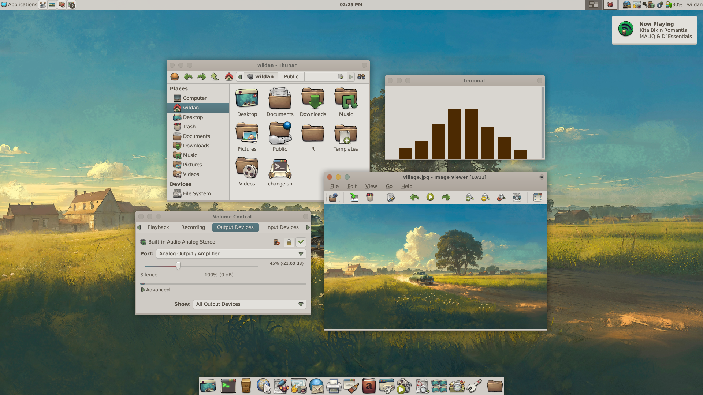


[^1]: https://www.r-project.org/about.html
[^2]: https://libguides.library.kent.edu/statconsulting/r
[^3]: https://id.wikipedia.org/wiki/R_(bahasa_pemrograman)
[^4]: https://posit.co/about/
[^5]: https://www.datacamp.com/tutorial/r-studio-tutorial
[^6]: https://www.tidyverse.org/packages/
[^7]: https://allisonhorst.github.io/palmerpenguins/
[^8]: https://chatgpt.com/
[^9]: https://www.geeksforgeeks.org/how-to-install-r-studio-on-windows-and-linux/
[^10]: https://rladiessydney.org/courses/ryouwithme/01-basicbasics-2/
[^11]: https://rpubs.com/alfanugraha/r-graph
