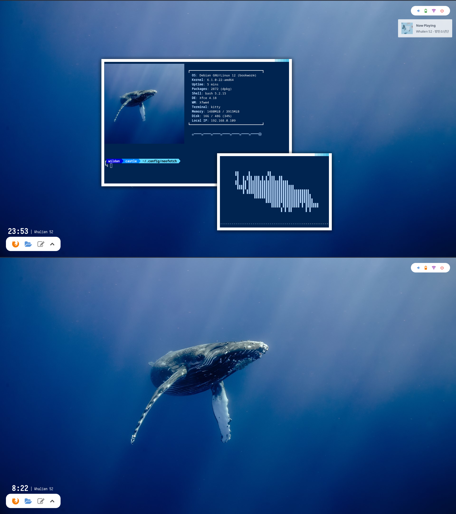

**`rsync`** adalah *utility* atau *tools* atau aplikasi berbasis terminal (*CLI-based*) yang digunakan untuk melakukan *back up* data. Kalau merujuk pada definisi resmi dari halaman manual (***man page***)-nya, <mark> **`rsync`** *is a fast, versatile, remote (and local) file-copying tool* </mark>. Yap, sebetulnya, **rsync** pada dasarnya memang mirip seperti **cp** yang digunakan untuk meng-*copy* file, tapi **rsync** tidak sama dengan **cp**. Berikut adalah perbandingan **rsync** dan **cp** <u> (menurut ChatGPT) </u> sehingga **rsync** bisa dibilang sebagai *tools* yang lebih fleksibel dan lebih canggih dibandingkan **cp**:

|     **Fitur**             | **`cp`**                                  | **`rsync`**                                       |
|   ---                     | ---                                       | ---                                               |
| **Sinkronisasi**          | Tidak ada sinkronisasi                    | Sinkronisasi hanya file yang berubah / belum ada  |
| **Jaringan**              | Tidak mendukung koneksi ke jaringan       | Mendukung jaringan melalui SSH                    |
| **Kecepatan**             | Menyalin semua file                       | Lebih cepat karena hanya menyalin perubahan saja  |
| **Melanjutkan Proses**    | Tidak                                     | Bisa melanjutkan transfer yang terputus           |
| **Fitur Tambahan**        | Sederhana, sedikit opsi                   | Banyak opsi (*compress*, *progress*, *delete*)    |

Karena rsync hanya meng-*copy* file atau data yang belum ada atau berubah saja, maka proses *copy* data via *rsync* menjadi relatif lebih cepat dibandingkan dengan *copy* data via **cp**. Intinya, **rsync** dapat bekerja lebih efektif ada efisien dalam hal *copy* data dibandingkan **cp**. Oleh karena itu, **rsync** sangat cocok digunakan untuk melakukan *backup* data.

## Instalasi `rsync`

Cara instalasi **rsync** di masing-masing distro:

|       Distro      |                  Command                  |
|       ---         |                   ---                     |
| **Debian/Ubuntu** | **`sudo apt install rsync`**              |
| **Arch Linux**    | **`sudo pacman -Sy rsync`**               |
| **Fedora**        | **`sudo dnf install rsync`**              |
| **Opensuse**      | **`sudo zypper install rsync`**           |

## Demonstrasi

Pola dasar perintah **rsync** sangat sederhana, sebagai berikut:

```shell
rsync [options] [source] [destination] 
```

Misalnya, saya ingin mem-*backup* seluruh file yang ada di folder/direktori **~/Templates** ke direktori **~/backup**, maka perintahnya:

```shell
rsync -arzv ~/Templates/ ~/backup/
```

:::info

**Penting!**  Pastikan kita menambahkan tanda garis miring atau *slash* **[ / ]** di akhir nama direktori jika kita hanya ingin meng-*copy* isi file yang terdapat di dalam direktori tersebut. Dengan kata lain, kita tidak ingin direktori **~/Templates** tersebut juga ikut ter-*copy*.

:::

**Keterangan:**
1. **-a : *archive mode***, menyalin data dengan tetap mempertahankan atribut-atributnya (*timestamps, permissions, owner,* etc)
2. **-r : *recursive***, mengambil semua file yang ada di dalam direktori
3. **-z : *compress***, mengkompres data selama proses transfer
4. **-v : *verbose***, meningkatkan *verbosity* 

Berikut demo-nya:

<script src="https://fast.wistia.com/player.js" async></script><script src="https://fast.wistia.com/embed/dyqc3qpwsu.js" async type="module"></script><style>wistia-player[media-id='dyqc3qpwsu']:not(:defined) { background: center / contain no-repeat url('https://fast.wistia.com/embed/medias/dyqc3qpwsu/swatch'); display: block; filter: blur(5px); padding-top:63.96%; }</style> <wistia-player media-id="dyqc3qpwsu" seo="false" aspect="1.5635179153094463"></wistia-player>

> Tentang **`watch`**:  
> Saya menggunakan perintah **watch** berikut untuk memantau aktivitas di dalam direktori ~/backup:  
> ```shell
> watch -n 2 ls -l
>```  
> Artinya, saya akan menginputkan perintah ls -l setiap 2 detik.

Selain digunakan untuk melakukan *backup* pada komputer lokal, **rsync** juga dapat digunakan untuk melakukan *backup* secara *remote* pada komputer server. Pola perintahnya juga masih sama seperti yang saya sampaikan di awal bagian demonstrasi ini. Hanya saja, kita perlu mengganti bagian *source* atau *destination*-nya dengan *remote* server yang ingin di-*backup* atau mem-*backup*. Sehingga kira-kira pola perintahnya akan seperti ini jika kita ingin melakukan *backup* dari sebuah server:

```shell
rsync [options] [username@ip-or-hostname:/source/path] [destination] 
```

Atau jika ingin melakukan *backup* ke sebuah server:

```shell
rsync [options] [source] [username@ip-or-hostname:/dest/path] 
```

Misalnya, saya ingin mem-*backup* file-file dari direktori **~/Templates** yang ada di komputer saya ke direktori **~/backup** di server Ubuntu 20.04, maka perintahnya adalah sebagai berikut:

```shell
rsync -arzv ~/Templates/ wildan@192.168.0.114:~/backup/
```

Berikut demonya:

Kiri adalah komputer lokal saya:Debian, kanan adalah komputer server:Ubuntu

<script src="https://fast.wistia.com/player.js" async></script><script src="https://fast.wistia.com/embed/7oabpwycf1.js" async type="module"></script><style>wistia-player[media-id='7oabpwycf1']:not(:defined) { background: center / contain no-repeat url('https://fast.wistia.com/embed/medias/7oabpwycf1/swatch'); display: block; filter: blur(5px); padding-top:63.96%; }</style> <wistia-player media-id="7oabpwycf1" seo="false" aspect="1.5635179153094463"></wistia-player>

> **Notes:**  
> Ketika akan melakukan *backup* ke atau dari server, kita akan diminta untuk memasukkan password, karena memang **rsync** menggunakan SSH sebagai protokol komunikasinya.

Berikutnya, saya juga akan menunjukkan bagaimana **`rsync`** meng-*handle* hanya file yang belum ada atau berubah saja, artinya, tidak semua file yang akan ter-*copy*, tapi hanya file-file yang berubah atau belum ada saja yang akan ditambahkan dan atau diperbarui (di-*update*) sehingga lebih efisien dalam melakukan *backup* data.

Perhatikan, saya akan melakukan *backup* data dari direktori **`~/Templates`** (di sebelah kiri) ke direktori **`~/backup`** (di sebelah kanan). Secara rinci, saya akan memindahkan / meng-*copy* 3 file baru, yaitu **baloon.jpg**, **ipaddr.sh**, dan **sample.pdf** dari **`~/Templates`** ke **`~/backup`** serta memperbarui / meng-*update* isi konten pada file **greetings.txt**.  

<script src="https://fast.wistia.com/player.js" async></script><script src="https://fast.wistia.com/embed/p6bw0ihpof.js" async type="module"></script><style>wistia-player[media-id='p6bw0ihpof']:not(:defined) { background: center / contain no-repeat url('https://fast.wistia.com/embed/medias/p6bw0ihpof/swatch'); display: block; filter: blur(5px); padding-top:64.38%; }</style> <wistia-player media-id="p6bw0ihpof" seo="false" aspect="1.5533980582524272"></wistia-player>

Untuk menampilkan progres, kita bisa gunakan perintah:

```shell
rsync -arzv --progress ~/source/ ~/destination/ # menampilkan progress
rsync -arzv -P ~/source/ ~/destination/ # sama dengan --progress --partial
```

Gimana? Mudah bukan?  
Kalau masih bingung atau mau *explore* lebih jauh tentang **`rsync`**, jangan sungkan-sungkan untuk baca-baca *manual page*-nya dengan perintah **`man rsync`** atau berselancar dan bertanya ke mbah Google atau mas ChatGPT ya. Berikut saya coba lampirkan *cheatsheet* **rsync** yang barangkali bisa sedikit membantu :)

**rsync** *cheatsheet*: https://devhints.io/rsync 

---

Artikel ini ditulis menggunakan distro linux Debian dengan Tema: [52 Hz](https://www.youtube.com/watch?v=PPcU3NN61rQ&pp=ygUId2hhbGUgNTI%3D)

