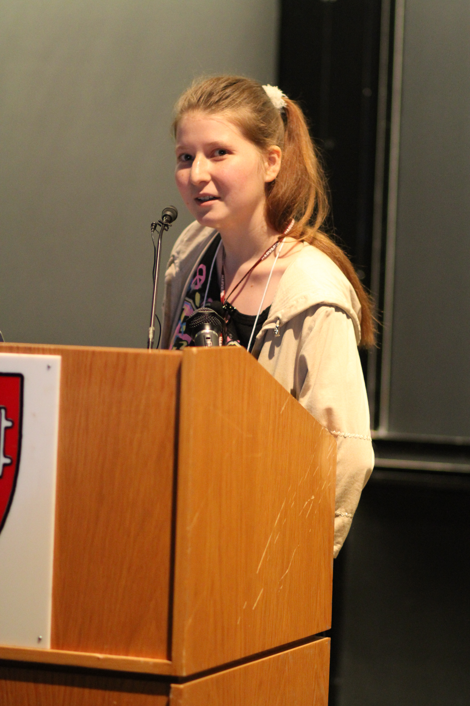
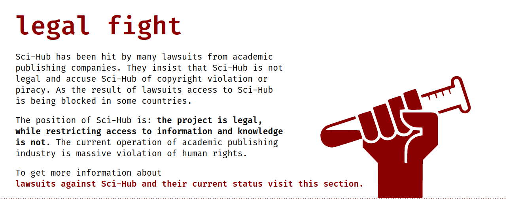
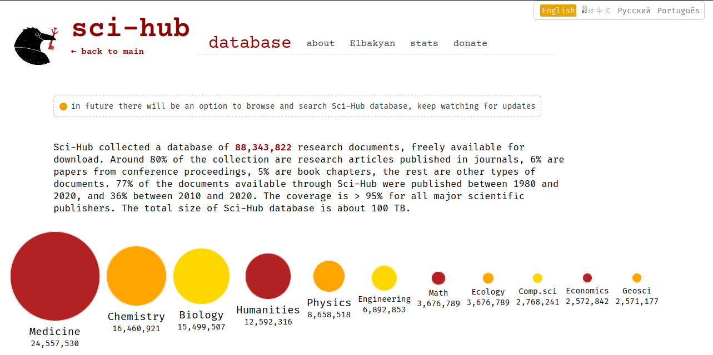
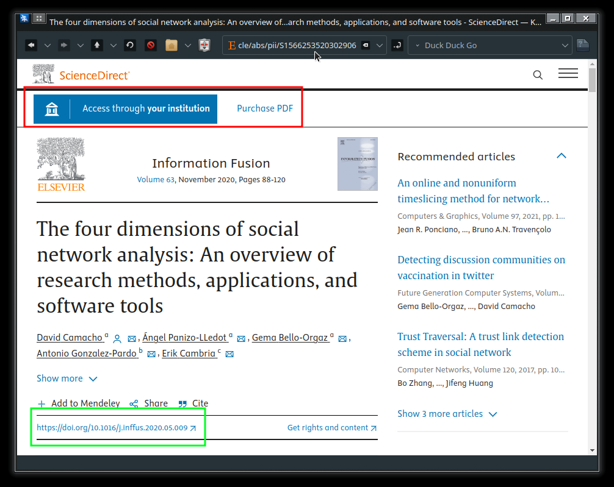
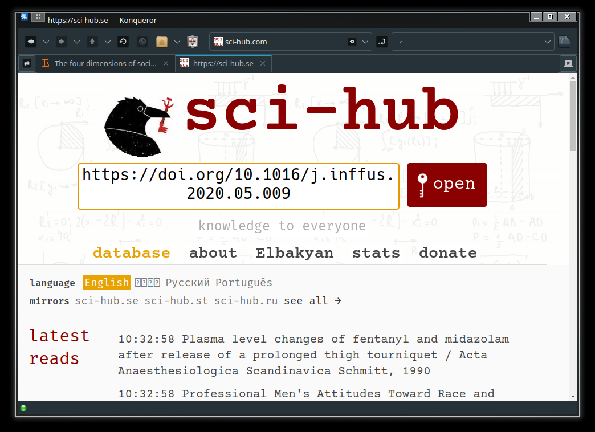
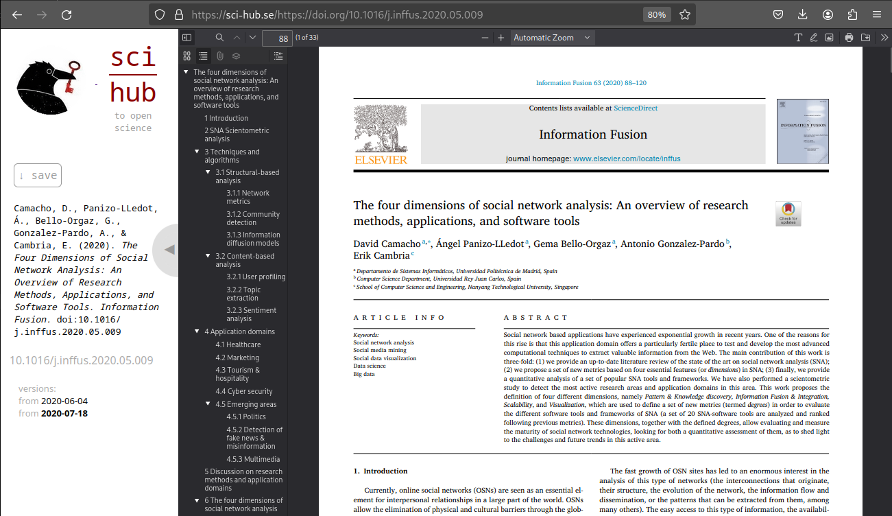
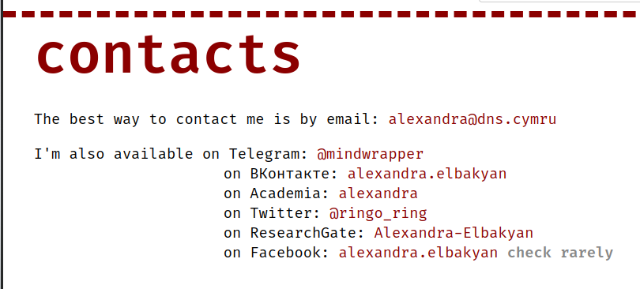
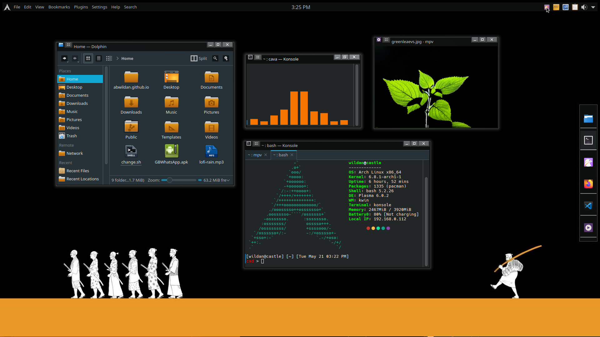

Kalian adalah seorang peneliti yang membutuhkan jurnal yang berstandar internasional tapi terkendala karena tidak bisa mengaksesnya? Solusinya adalah Scihub!

# About Sci-hub

[Sci-hub](https://sci-hub.se/) adalah situs web "perpustakaan bayangan" yang didirkan oleh seorang perempuan asal Kazakhstan yang lahir pada tahun 1988 bernama [Alexandra Elbakyan](https://sci-hub.se/alexandra#). Disebut "perpustakaan bayangan" karena sci-hub memberikan akses ke jutaan artikel penelitian berbayar secara gratis hanya dengan meng-_input_-kan tautan DOI (_Digital Object Identifier_) sebuah artikel ke situs sci-hub.[^1] 

Situs ini didirikan pada tahun 2011 oleh perempuan lulusan jurusan Teknologi Informasi dari Kazakh National Technical University juga karena alasan mahalnya biaya makalah atau artikel penelitian yang tersedia di internet. Sejak kemunculannya pertama kali, sci-hub sudah berkali-kali diblokir karena digugat oleh pihak-pihak yang terkait, seperti [Elsevier](https://www.elsevier.com/), [Springer](https://www.springer.com/gp), [Wiley](https://onlinelibrary.wiley.com/), [Cambrige University Press](https://www.cambridge.org/universitypress), [American Chemical Society](https://www.acs.org/), dan pihak-pihak lainnya yang merasa dirugikan sebagai situs ilegal yang melanggar hak cipta. 

Namun, per hari ini, sci-hub masih tetap aktif dengan berbagai alternatif domain dengan browser pada umumnya seperti chrome, firefox, safari, dan browser lainnya. Sci-hub hadir dengan filosofi bahwa mereka bukanlah pembajak (_pirate_) dan _project_ sci-hub bukan _project_ ilegal karena yang membatasi akses kepada informasi dan pengetahuanlah yang justru ilegal.[^2] Sci-hub mengklaim bahwa mereka sudah memiliki lebih dari 88,343,822 _database_ artikel penelitian dan buku yang dapat diunduh secara gratis.[^3] 

> # **KNOWLEDGE MUST BE FREE** 

# Sci-hub Domain

Berikut adalah beberapa domain yang aktif dan official milik sci-hub yang dapat diakses gratis via internet[^4]:
1. https://sci-hub.se/
2. https://sci-hub.st/
3. https://sci-hub.ru/

# Downloading Article via Sci-hub

Seperti yang saya sampaikan sebelumnya di bagian About Sci-hub, paper atau artikel jurnal yang berbayar - yang tidak bisa diakses tanpa harus membayar langganan - bisa di-_bypass_ hanya dengan memasukkan _link_ atau tautan DOI artikel yang ingin dibaca atau diunduh ke halaman situs sci-hub. 

Memang, tidak semua jurnal mengharuskan pembacanya untuk membayar terlebih dahulu agar bisa mendapatkan artikel yang diinginkan alias [_open access_](https://en.wikipedia.org/wiki/Open_access), tapi memang ada juga beberapa artikel atau jurnal yang mengharuskan kita untuk membayar atau berlangganan terlebih dahulu. Jadi, di sini, saya akan men-demonstrasikan cara mengunduh jurnal berbayar dengan sci-hub.

Berikut adalah target jurnal yang akan kita unduh:

[The four dimensions of social network analysis: An overview of research methods, applications, and software tools](https://www.sciencedirect.com/science/article/abs/pii/S1566253520302906)

Seperti terlihat pada tangkapan layar di atas, artikel tersebut tidak bisa kita buka karena memerlukan akses langgangan alias berbayar. Agar bisa mengakses artikel tersebut tanpa harus berbayar, kita hanya perlu men-_copy_ DOI dari artikel tersebut (kotak berwarna hijau),

lalu paste-kan ke halaman web sci-hub. Klik Open.

Boom! Kita berhasil membuka akses artikel tersebut!

# Troubleshooting 

Beberapa kendala tetap bisa saja terjadi, misalnya, ternyata DOI yang di-_copy-paste_-kan tidak bisa terbuka di sci-hub. Penyebabnya yang paling mungkin adalah karena artikel tersebut **tidak terindeks di database sci-hub**. Semakin baru artikelnya, semakin besar kemungkinan artikel tersebut belum terindeks di database.

Punya kendala lain? Atau mungkin ingin supaya artikel yang kalian incar segera bisa diakses di sci-hub? Jangan minta tolong ke saya karena saya bukan siapa-siapanya mba Alexandra, tapi langsung aja kontak orang yang bersangkutan di[^5]:

- Email: alexandra@dns.cymru
- Twitter: [@ringo_ring](https://x.com/ringo_ring)
- Telegram: [@mindwrapper](https://t.me/mindwrapper)
- Facebook: [alexandra.elbakyan](https://www.facebook.com/alexandra.elbakyan)

Sekian, selamat bereksperimen, dan...

Sampai jumpa di artikel saya yang lain!!

> Btw, saya mencoba suasana baru, kali ini saya membuat tulisan ini di Arch Linux KDE Plasma 6:

[^1]: https://id.wikipedia.org/wiki/Sci-Hub
[^2]: https://sci-hub.se/about
[^3]: https://sci-hub.se/database
[^4]: https://sci-hub.se/mirrors
[^5]: https://sci-hub.se/alexandra#contact

