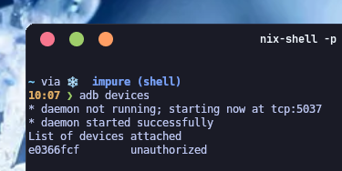
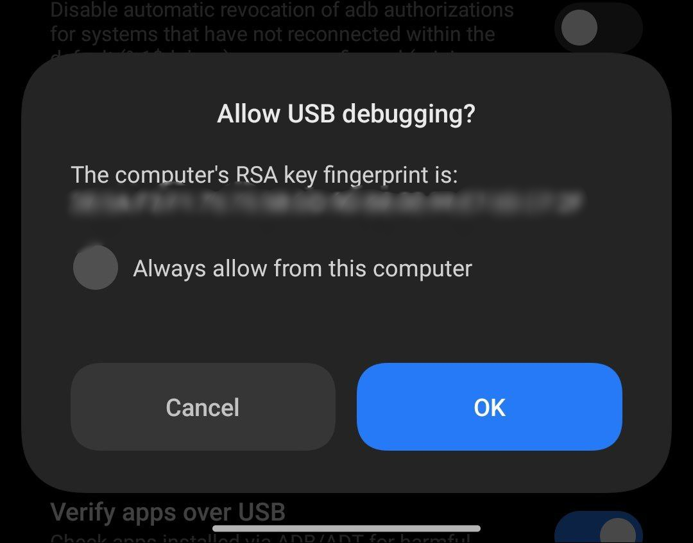
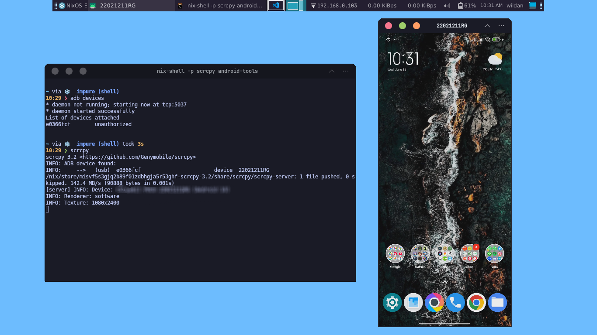
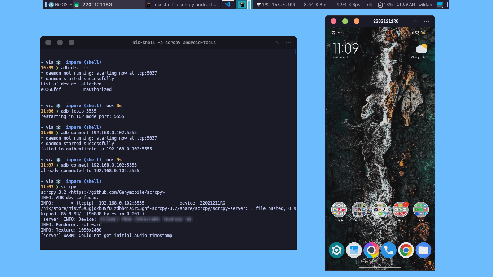

Pernahkah kalian melihat youtuber game online android di Youtube, tapi menggunakan kursor seperti sedang berada di komputer atau laptop? Misalnya, seperti salah satu game dari Moonton, ["Magic Chess Go Go (MCGG)"](https://play.mc-gogo.com/) yang dimainkan oleh salah satu youtuber, [Bass Klemens](https://www.youtube.com/@bassklemens)?

Kemungkinan besar, _streamer_ atau youtuber game online android tersebut menggunakan teknologi _screen mirroring_, agar perangkat androidnya dapat tampil dan dikontrol melalui PC (_Personal Computer_). Sebetulnya, ada banyak aplikasi yang dapat digunakan untuk melakukan _screen mirroring_, salah satunya adalah [**Scrcpy**](https://github.com/Genymobile/scrcpy). 

::github{repo="Genymobile/scrcpy"}

**Scrcpy** adalah salah satu aplikasi _mirroring_ perangkat android (baik video maupun audio) melalui USB atau bahkan _wireless_ (TCP/IP) dan memungkinkan kita mengontrolnya melalui _mouse_ dan _keyboard_ di komputer. Uniknya, _software_ ini tidak memerlukan akses root atau instalasi aplikasi lagi pada perangkat androidnya. Scrcpy juga dapat digunakan di 3 sistem operasi desktop populer, seperti Linux, Windows, dan Mac.[^1]  

:::warning[Disclaimer!]

Satu-satunya sumber resmi Scrcpy adalah repository Github yang tertera di atas. Jangan men-_download_ Scrcpy dari website apapun, meskipun mengandung kata "scrcpy" pada _domain_-nya!

:::

## Installation

Berikut adalah instalasi Scrcpy di sistem operasi desktop kita:

|       Distro      |                  Command                                   |
|       ---         |                   ---                                      |
| **Debian/Ubuntu** | **`sudo apt install scrcpy android-tools`**                |
| **Arch Linux**    | **`sudo pacman -Sy scrcpy android-tools`**                 |
| **Opensuse**      | **`sudo zypper install scrcpy android-tools`**             |

Untuk distro **Fedora**, kita dapat meng-_install_ Scrcpy dari [Snap Store](https://snapcraft.io/scrcpy).

:::note

**NixOS:**  
Masukkan baris berikut di file konfigurasi (`/etc/nixos/configuration.nix`):

```nix
  environment.systemPackages = [
    pkgs.scrcpy
    pkgs.android-tools
  ];
```

Atau jika menggunakan `nix-shell`:

```shell
nix-shell -p scrcpy android-tools
```

:::

## Features

Berikut adalah beberapa keunggulan dari Scrcpy:

**1. lightness:** bawaan, hanya menampilkan perangkat.  
**2. performance:** 30-120 fps, tergatung perangkatnya.  
**3. quality:** resolusi 1920x1080 atau lebih tinggi.  
**4. low latency:** 35-70 ms  
**5. low startup time:** ~1 detik untuk menampilkan gambar pertama.  
**6. non-intrusiveness:** tidak ada yang ter-_install_ pada perangkat android.  
**7. user benefits:** tanpa harus buat akun, tanpa iklan, tanpa internet.  
**8. freedom:** gratis dan _open source_.  

Adapun fitur-fiturnya:

1. Audio forwarding (Android 11+)
2. Recording
3. Virtual display
4. Mirroring with android device screen off
5. Copy-paste in both direction
6. Configurable quality
7. Camera mirroring (Android 12+)
8. Mirroring as a webcam (Linux-only)
9. Physical keyboard and mouse simulation (HID)
10. Gamepad support
11. OTG mode
12. etc...

## Usage

Sebelum menggunakan Scrcpy, ada 2 hal utama yang perlu dilakukan terlebih dahulu di bagian "Settings" pada perangkat android kita, yaitu:
- Mengaktifkan "USB Debugging" & "USB Debugging (Security settings)" (jika ada).
- Mengaktifkan "Wireless Debugging" (Opsional)

Caranya tentu berbeda-beda bergantung dari merk _smartphone_ & versi androidnya. Tapi, secara umum, berikut adalah langkah-langkahnya di android:[^2]

1. Buka "Settings".
2. Pilih "About phone".
3. Klik beberapa kali pada "Build number" atau "OS version".
4. Jika berhasil, kita dapat mengakses "Developer mode".
5. Kembali ke menu utama di "Settings".
6. Masuk ke menu "Developer options".
7. Aktifkan "USB Debugging" & "USB Debugging (Security settings)".
8. Aktifkan juga "Wireless debugging", jika kita ingin android kita dapat dikontrol tanpa kabel USB (via Wi-Fi).

:::danger[Perhatian!]

Ketika mengaktifkan **"USB Debugging"**, **"USB Debugging (Security settings)"**, dan **"Wireless debugging"**, adalah hal yang wajar jika mendapat peringatan dari android. Peringatan tersebut dapat diabaikan jika kalian yang sedang menggunakannya, bukan orang lain.

:::

Setelah itu, colokkan kabel USB dari perangkat android ke PC kita. Ganti mode USB-nya ke "File Transfer/Android Auto".

### USB Connection

#### 1. Detecting Connected Device

Untuk menginisasi sekaligus mengetahui perangkat android yang terhubung ke PC:

```shell
adb devices
```



Ketika menjalankan perintah tersebut di komputer, kita akan mendapatkan _pop-up window_ konfirmasi persetujuan "USB Debugging" di android seperti berikut:



Saran saya, untuk alasan keamanan, tidak perlu menceklis **"Always allow from this computer"** kecuali kalian memang sering menggunakan Scrcpy.

#### 2. Displaying Android Device

Untuk menampilkan layar android kita ke PC, kita hanya perlu menjalankan perintah:

```shell
scrcpy
```



### Wireless Connection

#### 1. Detecting Connected Device

Colokkan kabel USB dari perangkat android ke PC, lalu deteksi dengan perintah:

```shell
adb devices
```

#### 2. Creating ADB Server

Untuk mengaktifkan server "Wireless Debugging", gunakan perintah:

```shell
adb tcpip 5555
```

#### 3. Connecting Android Device

- Cabut kabel USB dari PC.  
- Cari _IP Address_ perangkat android ("Settings" > "About phone" > "Status" > "IP address").

Jalankan perintah berikut untuk menghubungkan perangkat android ke PC kita:

```shell
adb connect <android ip address>:5555
```

#### 4. Displaying Android Device

Untuk menampilkan layar android di PC:

```shell
scrcpy
```




[^1]: https://github.com/Genymobile/scrcpy
[^2]: https://adithyana.hashnode.dev/connecting-your-phone-wirelessly-with-adb-and-scrcpy-in-linux