## Sepintas SQL, Database, dan Database Relational

### Tentang SQL dan MySQL

Pernah dengan SQL?  

Yap, SQL atau *Structured Query Language* adalah bahasa yang digunakan untuk membuat, mengakses, dan memodifikasi data dalam sebuah *database*, khususnya pada *relational database*.[^1] Apa itu *relational database*?. Perlu diketahui terlebih dahulu bahwa *database* atau basis data adalah sebuah sistem untuk menyimpan data dengan rapih. Database dapat diibaratkan sebagai lemari yang menyimpan berbagai macam pakaian.[^2] Dengan adanya lemari, pakaian kita tersusun, tersimpan, dan tertata dengan rapih sehingga mudah untuk dicari nanti ketika dibutuhkan. Begitupula dengan data, data yang disimpan dalam sebuah *database* akan memudahkan pengguna data untuk mengaksesnya nanti ketika diperlukan. Data dalam database disimpan dalam bentuk tabel yang memiliki baris dan kolom.

> **Ilustrasi:** Database dan tabel dapat diibaratkan juga seperti menyimpan file-file di dalam folder, dimana database adalah foldernya dan tabel-tabelnya adalah file-filenya.

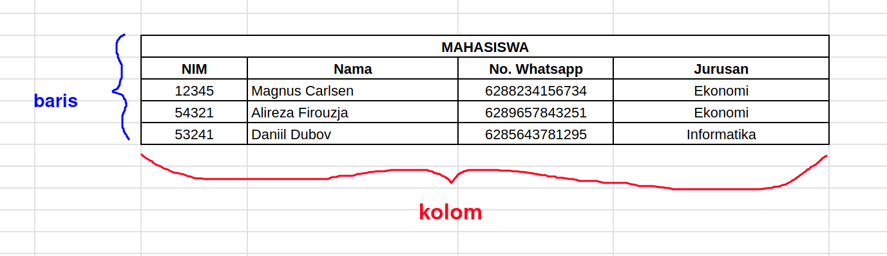

Nah, sekarang, kita kembali lagi, apa itu *relational database*? Sebetulnya, *relational database* adalah kumpulan tabel yang dapat saling terhubung satu sama lain melalui kunci (*keys*), yaitu *primary key* dan *foreign key*. Primary key adalah nilai unik yang dimiliki suatu data. Contoh *primary key* adalah nomor KTP karena nomor KTP setiap orang tidak akan sama, meskipun diantara dua anak kembar sekalipun. Atau pada contoh gambar tabel saya di atas adalah NIM (Nomor Induk Mahasiswa). Sedangkan *foreign key* adalah adalah nilai yang mereferensikan data dari tabel lain. 

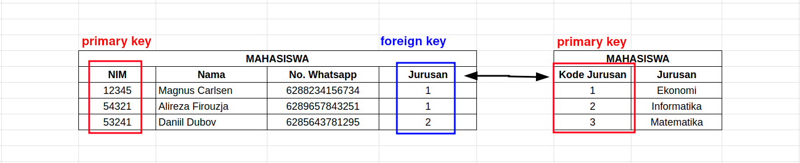

Referensi bacaan lanjut tentang *database relational*: https://www.dicoding.com/blog/mengenal-apa-itu-relational-database/

### Mengapa SQL & MySQL itu penting?

Mungkin kita bisa beranggapan bahwa jika database hanya terdiri dari kumpulan tabel-tabel saja, mengapa tidak menggunakan aplikasi yang lebih familiar seperti Excel saja? Betul, aplikasi seperti excel selain lebih familiar juga lebih user-friendly jika digunakan untuk mengelola data-data berskala kecil. Jika database yang dikelola berjumlah puluhan-ratusan ribu atau bahkan hingga jutaan, maka aplikasi berbasis GUI (*Grapical User Interface*) akan kewalahan jika diminta untuk mengelola data-data tersebut. Oleh karena itu, SQL yang berbasis CLI (*Command Line Interface*) diciptakan untuk meng-*handle* data-data yang lebih besar. Salah satu aplikasi berbasis SQL yang populer adalah MySQL, yang perintah-perintah dasarnya akan kita pelajari pada artikel ini.

Selain alasan di atas, SQL dan MySQL menjadi populer karena beberapa alasan lain, misalnya alasan keamanan data, bersifat *open source* (gratis), dan memiliki performa yang relatif cukup baik[^3]. Alasan keamanan data artinya, MySQL memberikan sistem manajemen database yang paling aman dan andal sehingga banyak digunakan oleh perusahaan-perusahaan ternama seperti Wordpress, Facebook, Twitter alias X, dan Joomla. MySQL juga bersifat *open source* karena memiliki lisensi [Free Software](https://en.wikipedia.org/wiki/Free-software_license) dan [Shareware](https://en.wikipedia.org/wiki/Shareware) serta memiliki banyak komunitas dan dokumentasinya. Terkait performa, MySQL memang dirancang untuk aplikasi yang butuh kecepatan sangat tinggi dan memanfaatkan penyimpanan data di memori agar performa aplikasi semakin baik.

### Fungsi-fungsi Dasar MySQL

Setidaknya, terdapat 3 fungsi dasar MySQL sebagai aplikasi pengelola database. Ketiga fungsi tersebut terkait dengan membuat, memanipulasi, dan mengontrol database. Berikut adalah 3 fungsi MySQL[^3]:

**1. DDL (*Data Definition Language*)**
   
DDL adalah metode query yang digunakan untuk <mark> mendefinisikan objek-objek database </mark> seperti:
- **CREATE DATABASE**: membuat database baru.
- **CREATE TABLE:** membuat tabel baru dalam database.
- **ALTER TABLE:** mengubah struktur tabel yang sudah ada, misalnya menambah atau menghapus kolom.
- **DROP DATABASE:** menghapus seluruh database beserta seluruh isinya.
- **DROP TABLE:** menghapus tabel beserta data yang ada di dalamnya.
- **CREATE INDEX:** membuat indeks untuk meningkatkan kecepatan pencarian data.
- **DROP INDEX:** menghapus indeks yang sudah ada.

**2. DML (*Data Manipulation Language*)**

DML adalah metode query yang digunakan untuk <mark> memanipulasi (menambah, mengubah, dan menghapus) data di dalam tabel </mark>, seperti:
- **SELECT:** mengambil data dari satu atau lebih tabel. 
- **INSERT INTO:** menambahkan data baru ke dalam tabel.
- **UPDATE:** mengubah data yang sudah ada dalam tabel.
- **DELETE:** menghapus data dari tabel.

**3. DCL (*Data Control Language*)**

DCL adalah metode query yang digunakan untuk <mark> mengatur hak akses dan kontrol terhadap data dalam database </mark>, seperti :
- **GRANT:** memberikan hak akses tertentu kepada pengguna atau grup pengguna.
- **REVOKE:** mencabut hak akses yang sudah diberikan kepada pengguna.

### Tipe Data MySQL

Sebelum mulai instalasi, perlu diketahui beberapa tipe data di MySQL. Secara garis besar, tipe data di MySQL dapat dibagi menjadi 4 kategori, yaitu teks & karakter, angka, tanggal & jam/waktu, serta jenis data khusus[^4]:

**1. Teks & Karakter (*String*)**

Tipe data paling umum digunakan yang terkait dengan teks & karakter (*string*) adalah:
- **VAR:** menyimpan teks atau karakter dengan panjang tetap (0-255).
- **VARCHAR:** menyimpan teks atau karakter yang lebih panjang (0-65535).
- **TEXT:** menyimpan string dengan maksimum panjang 65535 bytes.
- **LONGTEXT:** menyimpan string dengan maksium panjang 4,294,967,295 karakter.
  
**2. Angka (*Numeric*)**

Tipe data *numeric* yang biasa digunakan antara lain:
- **SMALLINT:** menyimpan / mendefinisikan bilangan bulat kecil, berkisar dari -32768 hingga 32767
- **INT:** menyimpan / mendefinisikan data berupa bilangan bulat, antara -2147483648 hingga 2147483647.
- **BIGINT:** menyimpan / mendefinisikan bilangan bulat yang lebih besar, antara -9223372036854775808 hingga 9223372036854775807. 
- **FLOAT:** menyimpan / mendefinisikan data berupa angka desimal dengan presisi rendah.
- **DOUBLE:** menyimpan / mendefinisikan data berupa angka desimal dengan presisi tinggi.

**3. Tanggal & Jam (*Date and Time*)**

Tipe data tanggal & jam diantaranya yaitu:
- **DATE:** untuk tanggal.
- **TIME:** untuk jam / waktu.
- **DATETIME:** untuk kombinasi tanggal dan jam / waktu.
- **YEAR:** untuk tahun dalam format 4 digit.

**4. Jenis Data Khusus**

Jenis data khusus ini terbagi menjadi 2, yaitu:
- **BOOL:** untuk menyimpan / mendefinisikan data boolean, 0 dianggap sebagai ***false*** dan selain 0 dianggap ***true***. 
- **ENUM:** untuk menyimpan / mendefinisikan data berupa nilai yang sudah ditentukan sebelumnya.

:::info

Sebetulnya, masih banyak lagi tipe data yang dapat digunakan di MySQL, namun semuanya mengacu pada 3 kategori besar, yaitu tipe data string, numeric, dan time & date. Selengkapnya mengenai tipe data MySQL dapat dibaca di tautan berikut: [w3schools](https://www.w3schools.com/mysql/mysql_datatypes.asp)

:::


## Instalasi MySQL

Oke, sekarang saya akan menginstall mysql di linux:

### Instalasi via Repository

Archlinux (via AUR - *Arch User Repository*):

```shell
sudo yay -Sy mssql-server
```

Debian:

```shell
sudo apt install mysql-server
```

### Instalasi via .deb File (Debian)

> **Catatan:**  
> Instalasi SQL di Debian via repository official hanya dapat dilakukan di Debian sid (*unstable*). Jadi, kita akan melakukan instalasi SQL manual menggunakan file `.deb` resmi dari SQL-nya.
> 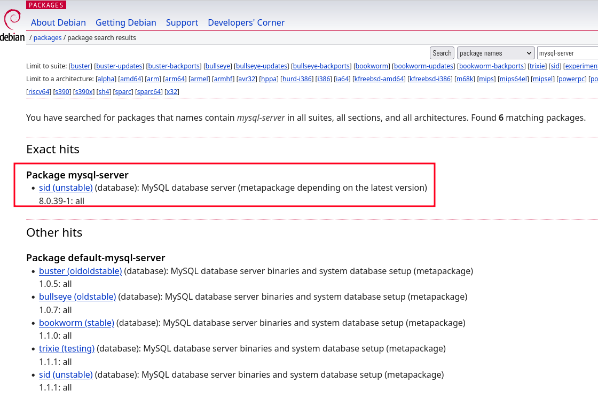  

1. Pertama, kita unduh terlebih dahulu file-nya dari website MySQL (https://dev.mysql.com/downloads/repo/apt/). Kita juga bisa mengunduh filenya via terminal dengan mengetikkan perintah berikut:

```shell
wget https://dev.mysql.com/get/mysql-apt-config_0.8.32-1_all.deb
```

2. Kemudian, kita akan melakukan instalasi repo MySQL dengan mengetikkan perintah berikut:
```shell
sudo dpkg -i mysql-apt-config_0.8.32-1_all.deb
```

Nanti akan muncul *interface* berwarna biru (seperti gambar di bawah ini), dimana kita bisa memilih versi SQL yang ingin di-*install* dan statu *connector*-nya. Saya biarkan *default* seperti ini:
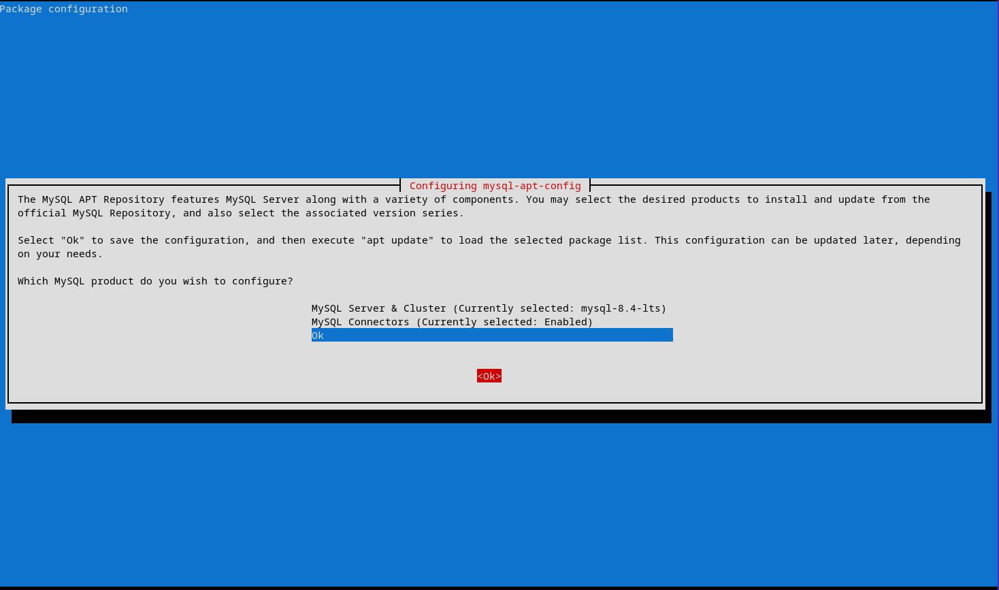

Klik **`Tab`** di keyboard untuk memindahkan kursor ke **Ok** di bawah, lalu tekan Enter.

3. Berikutnya, kita perlu melakukan update repository dan melakukan instalasi mysql server:
```shell
sudo apt update 
sudo apt install mysql-server
```

Jika diminta password, silakan buat password untuk root akses ke server MySQL nanti:
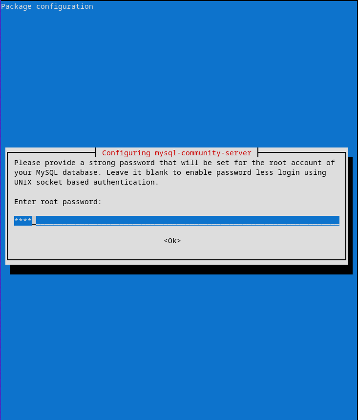

Biarkan proses instalasinya berjalan hingga selesai.

Untuk memastikan mysql sudah ter-*install*, gunakan perintah:
```shell
mysql --version
```
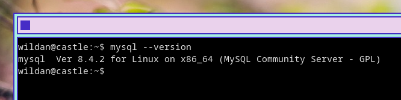

Untuk memastikan mysql sudah berjalan, jalankan perintah:
```shell
systemctl status mysql
```
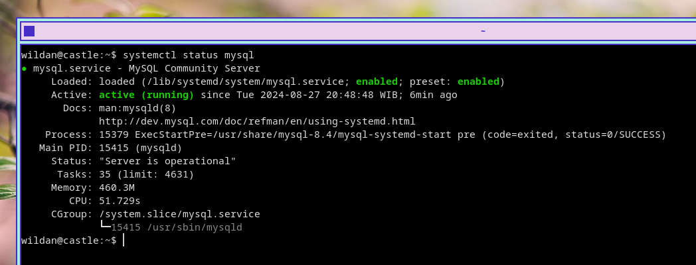

## Syntax / Query Dasar MySQL

*Syntax* dan *query* yang akan saya bahas di artikel ini adalah *syntax* dan *query* yang terkait dengan ketiga fungsi MySQL, yaitu DDL (*Data Definition Language*), DML (*Data Manipulation Language*), dan DCL (*Data Control Language*): 

### Membuat Database Baru

Kita perlu masuk ke server SQL terlebih dahulu:
```sql
mysql -u root -p 
```

Kemudian masukkan password root yang sudah kita buat ketika instalasi tadi.


Kita bisa melihat database default yang sudah ada dengan perintah:
```sql
show databases;
```
 **Penting!** Pastikan setiap perintah atau *command* diakhiri dengan tanda titik koma **(;)**  

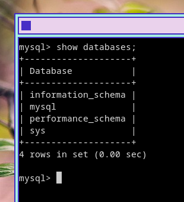

Sekarang, saya akan membuat sebuah database baru bernama **"chessgm"**:
```sql
create database chessgm;
```

Sekarang, kalau dicek kembali database yang ada dengan perintah `show databases;`, maka **chessgm** ada di sana:
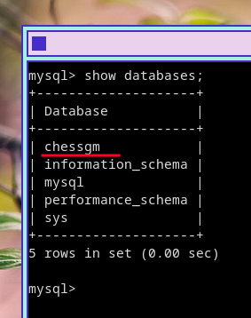

### Membuat Tabel Baru

Selanjutnya, saya akan membuat tabel baru di dalam database chessgm. Oleh karena itu, saya perlu mengetikkan perintah berikut terlebih dahulu:
```sql
use chessgm;
```

Berikut adalah spesifikasi tabel yang ingin saya buat:
- nama tabel: "Chess Grandmaster",
- kolom id: mengidentifikasi setiap grandmaster catur, tipe data *numeric* (INT) dan berperan sebagai primary key,
- kolom nama: berisi nama-nama grandmaster catur, tipe data *string* (VARCHAR),
- kolom elo: berisi elo rating dari masing-masing grandmater, tipe data *numeric* (INT),
- kolom birth: berisi tanggal lahir masing-masing grandmaster, tipe data *date & time* (DATE),
- kolom fed: berisi federasi caturnya, tipe data string (VARCHAR).

Berikut adalah syntax-nya:

```sql
CREATE TABLE `Chess Grandmaster` (
    id INT AUTO_INCREMENT PRIMARY KEY,
    nama VARCHAR(100) NOT NULL,
    elo INT NOT NULL,
    birth DATE NOT NULL,
    fed VARCHAR(100) NOT NULL
);
```


1. Kita perlu menambahkan *backticks* atau tanda petik miring **( `` )** di nama database karena memiliki spasi.
2. INT, VARCHAR, dan DATE adalah tipe data yang kita definisikan pada variabel-variabel di depannya.
3. Argumen "NOT NULL" artinya kolom tersebut tidak boleh kosong.
4. Argumen 100 pada parameter VARCHAR(100) adalah jumlah karakter maksimal.


Berikutnya, kita bisa memastikan tabel "Chess Grandmaster" tersebut sudah berhasil dibuat dengan mengetikkan perintah:
```sql
show tables;
describe `Chess Grandmaster`;
```

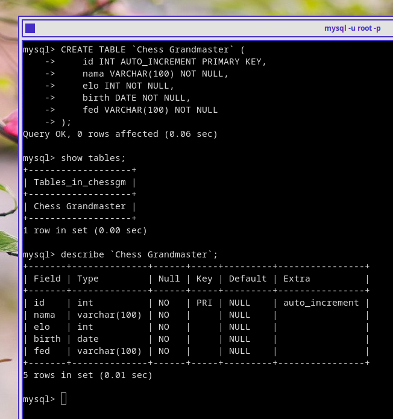

### Mengubah, Menghapus, dan Menambah Kolom Baru

Misalnya, saya akan mengganti nama kolom **"fed"** menjadi **"federation"**, perintahnya:
```sql
ALTER TABLE `Chess Grandmaster` CHANGE COLUMN fed federation VARCHAR(100);
```

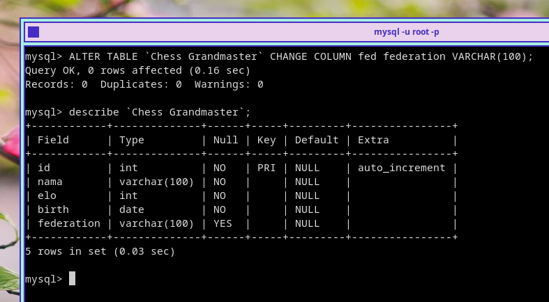

Saya kemudian akan menghapus kolom **"birth"**, perintahnya:
```sql
ALTER TABLE `Chess Grandmaster` DROP COLUMN birth;
```

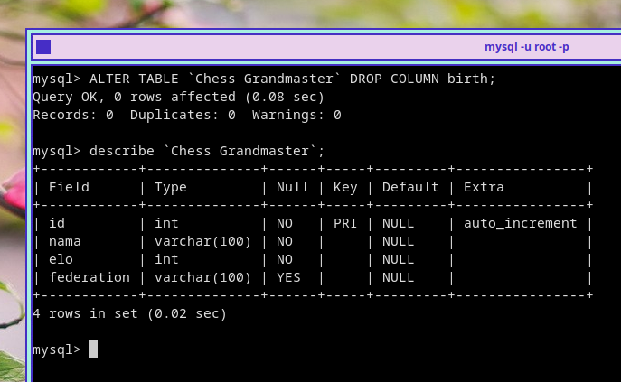

Saya kemudian akan membuat kolom baru, yaitu **"birthday"**, perintahnya:
```sql
ALTER TABLE `Chess Grandmaster` ADD COLUMN birthday DATE;
```

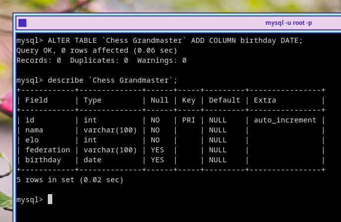

Kita berhasil mengubah nama kolom fed menjadi federation, menghapus kolom birth, dan menambahkan kolom baru yaitu kolom birthday. Namun, seperti terlihat, kedua kolom **"federation"** dan **"birthday"** status NULL-nya adalah "YES", padahal, seharusnya kedua kolom tersebut status NULL-nya **"NO"** sehingga artinya kolom tersebut tidak boleh kosong. Jadi, mari kita ubah status NULL kedua kolom tersebut. 

Kita bisa mengubahnya satu persatu dengan perintah berikut:

```sql
ALTER TABLE `Chess Grandmaster` MODIFY COLUMN federation VARCHAR(100) NOT NULL;
ALTER TABLE `Chess Grandmaster` MODIFY COLUMN birthday DATE NOT NULL;
```

Atau dengan satu baris perintah:
```sql
ALTER TABLE `Chess Grandmaster`
MODIFY COLUMN federation VARCHAR(100) NOT NULL, 
MODIFY COLUMN birthday DATE NOT NULL;
```

Hasilnya sama saja:

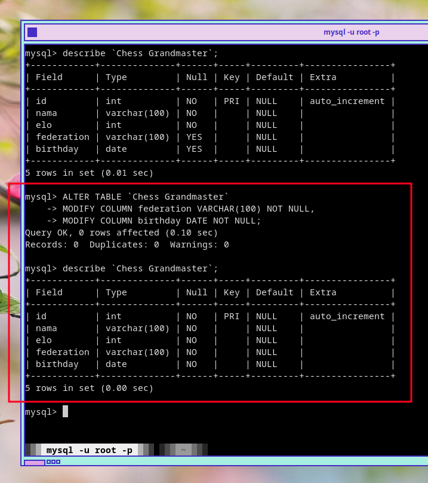

### Menghapus Tabel

Saya memiliki satu database lain, yaitu database **"cobachess"** yang memiliki tabel **"chess grandmaster"**. Misalnya, saya ingin menghapus tabel "chess grandmaster" tersebut, maka perintahnya adalah:
```sql
DROP table `chess grandmaster`;
```

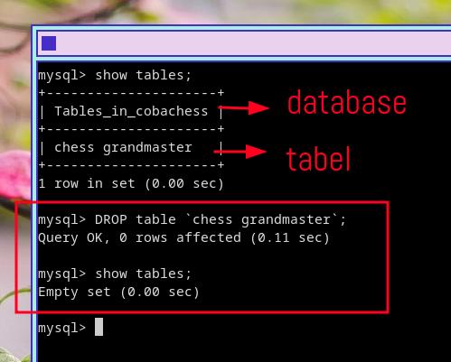

### Menghapus Database

Sekarang, saya ingin menghapus database **"cobachess"** tadi, perintahnya:
```sql
DROP database cobachess;
```

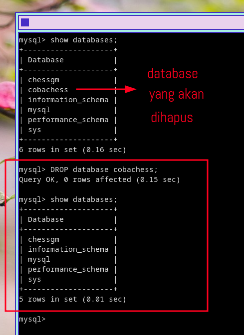

### Mengubah Nama Tabel

Kita juga bisa mengganti nama tabelnya dengan syntax berikut:

```sql
RENAME TABLE nama_tabel_lama TO nama_tabel_baru;
```

Misalnya, saya ingin mengubah tabel **Chess Grandmaster** ke **chessgrandmaster**, maka perintahnya adalah sebagai berikut:

```sql
RENAME TABLE `Chess Grandmaster` TO chessgrandmaster;
```

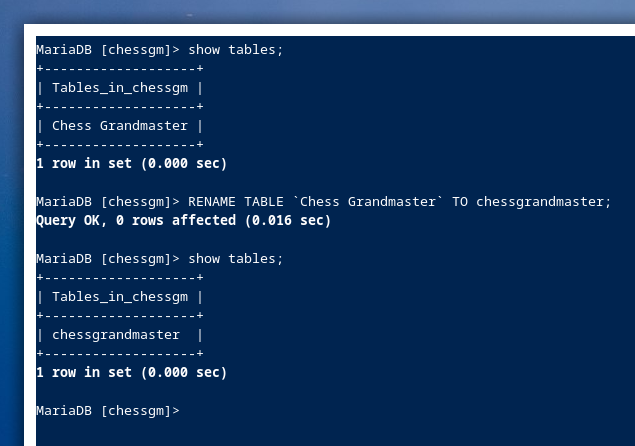

> **Notes:**  
> Jangan lupa untuk mengambahkan *backticks* ( **`** ) jika nama tabelnya memiliki spasi. 


### Menambahkan Data Ke Dalam Tabel

Sekarang, kita akan memasukkan data-data Grandmaster Catur ke dalam tabel **"Chess Grandmaster"** yang ada di dalam database **"chessgm"**. Misalnya, saya hanya akan memasukkan top 10 elo rating GM berdasarkan rangking [FIDE](https://ratings.fide.com/) per artikel ini dibuat. 

Kita bisa memasukkan data setiap Grandmaster tersebut satu persatu ke dalam tabel dengan perintah:
```sql
INSERT INTO `Chess Grandmaster` (nama, elo, birthday, federation) 
VALUES ('Magnus Carlsen', 2832, '1990-11-30', 'Norway');

INSERT INTO `Chess Grandmaster` (nama, elo, birthday, federation) 
VALUES ('Hikaru Nakamura', 2802, '1987-12-09', 'USA');

INSERT INTO `Chess Grandmaster` (nama, elo, birthday, federation) 
VALUES ('Fabiano Caruana', 2793, '1990-11-30', 'USA');

.
.
.
```

Atau dengan satu perintah:
```sql
INSERT INTO `Chess Grandmaster` (nama, elo, birthday, federation) 
VALUES 
    ('Magnus Carlsen', 2832, '1990-11-30', 'Norway'),
    ('Hikaru Nakamura', 2802, '1987-12-09', 'USA'),
    ('Fabiano Caruana', 2793, '1990-11-30', 'USA'),
    ('Arjun Erigaisi', 2778, '1992-07-30', 'IND'),
    ('Ian Nepomniachtchi', 2767, '1990-07-14', 'RUS'),
    ('Gukesh Dommaraju', 2766, '2006-05-29', 'IND'),
    ('Nodirbek Abdusattorov', 2762, '2004-09-18', 'UZB'),
    ('Wei Yi', 2762, '1999-06-02', 'CHN'),
    ('Alireza Firouzja', 2751, '2003-06-18', 'FRA'),
    ('Wesley So', 2751, '1993-10-9', 'USA');
```

Hasilnya sama saja. Kita bisa melihat data-data yang baru saja di-*input*-kan ke dalam tabel **"Chess Grandmaster"** tersebut dengan perintah:
```sql
SELECT * FROM `Chess Grandmaster`;
```

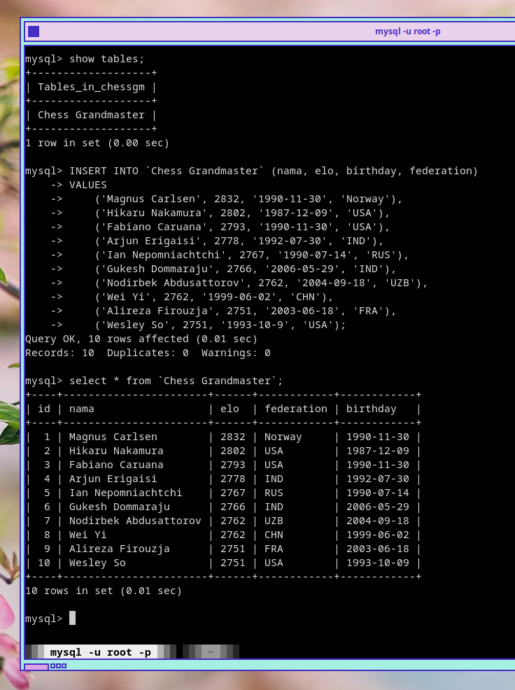

> **Notes:**  
> Perhatikan bahwa saya tidak memasukkan nomor urut di kolom id, tapi nomor langsung di-*generate* karena di awal pembuatan tabel, kita sudah mendefinisikan kolom id sebagai data *integer* yang "AUTO INCREMENT" dan juga berfungsi sebagai PRIMARY KEY. 

### Mengubah Data Dalam Tabel

Misalnya, saya akan mengubah data Wesley So, dimana 
- namanya akan saya ubah menjadi "Wesley Jo",
- elo rating-nya akan saya ubah menjadi "2750", dan
- federasinya akan ubah ke "PHI".
  
Perintahnya:
```sql
UPDATE `Chess Grandmaster`
SET nama = 'Wesley Jo', elo = 2750, federation = 'PHI'
WHERE nama = 'Wesley So';
```

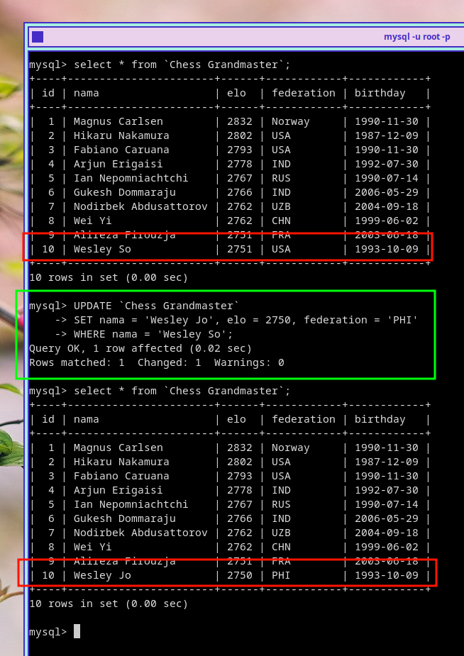

### Menghapus Data Dalam Tabel

Sekarang, saya ingin menghapus data **"Wesley Jo"** dalam tabel "Chess Grandmaster", perintahnya:
```sql
DELETE FROM `Chess Grandmaster`
WHERE nama = 'Wesley Jo';
```

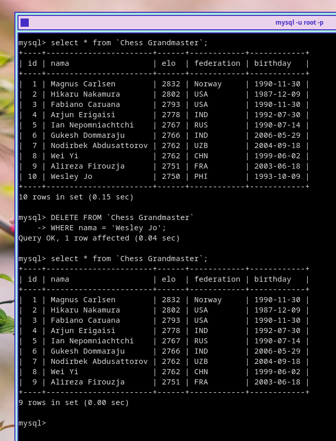

### Mengambil / Menampilkan Data dari Tabel

Pengambilan data dari tabel dapat dilakukan dengan berbagai cara, menyesuaikan dengan kebutuhan data yang ingin kita ambil. Beberapa cara pengambilan data dari tabel yang akan saya bahas di artikel ini dapat dilakukan dengan 5 cara:               |

1. Menampilkan seluruh data

Untuk menampilkan seluruh data pada kolom yang terdapat di dalam tabel, perintahnya:
```sql
SELECT * FROM `Chess Grandmaster`;
```

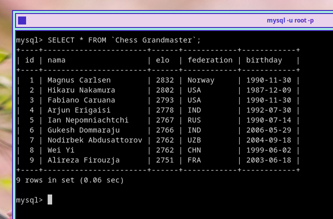

2. Menampilkan kolom tertentu

Jika misalnya saya hanya ingin menampilkan kolom "nama" dan "elo" saja, maka perintahnya:
```sql 
SELECT nama, elo FROM `Chess Grandmaster`;
```

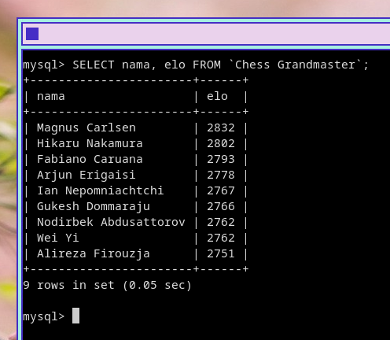

3. Menggunakan kondisi untuk memfilter data

Misalnya, saya hanya ingin menampilkan Grandmaster yang memiliki elo di atas 2770 saja, perintahnya:
```sql
SELECT * FROM `Chess Grandmaster`
WHERE elo > 2770;
```

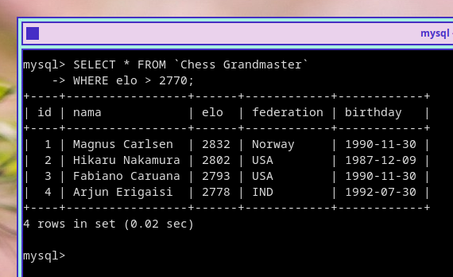

4. Mengurutkan hasil Query

Kita bisa mengurutkan data yang akan ditampilkan, baik mengurutkan secara ASC (*ascending* / rendah ke tinggi) maupun DESC (*descending* / tinggi ke rendah). Misalnya saya ingin mengurutkan data Grandmaster dari elo terendah, perintahnya:
```sql
SELECT * FROM `Chess Grandmaster`
ORDER BY elo ASC;
```

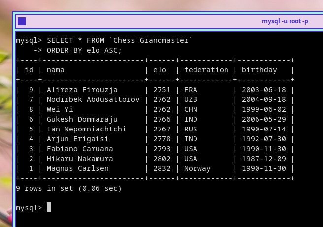

5. Membatasi data yang tampil

Jika kita hanya ingin menampilkan beberapa data, kita bisa melakukannya dengan menggunakan perintah:
```sql
SELECT * FROM `Chess Grandmaster`
ORDER BY elo ASC
LIMIT 3;
```

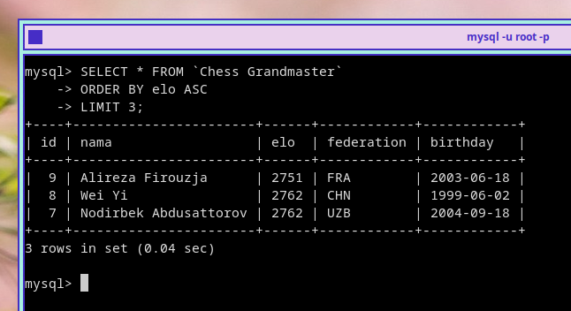

## Menjawab Soal-soal Database

Kita sudah membuat database **chessgm** yang memiliki sebuah tabel, **Chess Grandmaster**.

Sekarang, kita akan menjawab beberapa pertanyaan menggunakan perintah-perintah SQL yang sudah dibahas sebelumnya. Pertanyaan atau soal-soal yang akan dijawab akan merujuk pada tabel dan database yang sudah kita dibuat tersebut. Berikut adalah pertanyaan-pertanyaan yang perlu dijawab:

1. Siapakah GM yang ***paling tinggi*** & ***paling rendah*** ELO rating-nya?
2. Siapakah GM yang ***paling tua*** dan ***paling muda*** umurnya?
3. Berapakah jumlah GM yang berasal dari (federasi) Amerika dan China?

Mari kita jawab...

### 1. Siapakah GM yang ***paling tinggi*** & ***paling rendah*** ELO rating-nya?

Untuk mencari GM dengan ELO rating paling tinggi, kita bisa menggunakan query berikut:
```sql
SELECT * 
FROM `Chess Grandmaster`
ORDER BY elo DESC 
LIMIT 1;
```

Outputnya akan menunjukkan **Magnus Carlsen** sebagai GM dengan ELO rating tertinggi:

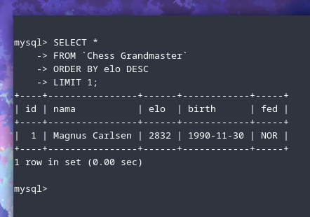

Untuk mencari GM dengan ELO rating paling rendah, kita bisa menggunakan query berikut:
```sql
SELECT * 
FROM `Chess Grandmaster`
ORDER BY elo ASC
LIMIT 1;
```

Outputnya akan menunjukkan **Wesley So** sebagai GM dengan ELO rating terendah:

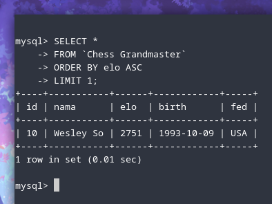

:::note

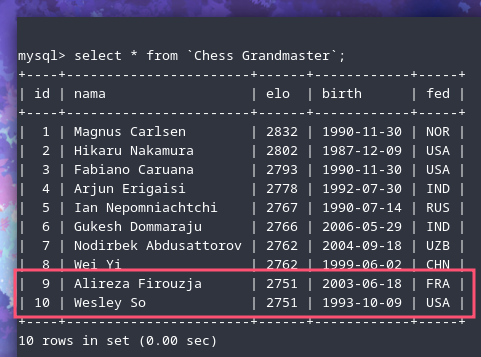

Query tersebut tentu memiliki batasan, yaitu kita hanya bisa mendapatkan satu nama saja, meskipun misalnya GM di dalam database yang memiliki ELO terendah ada lebih dari 1 orang. Tapi, tujuan dari soal-soal ini adalah untuk mempraktikkan kembali pelajaran-pelajaran tentang query dasar SQL yang sudah saya jelaskan sebelumnya. Jadi, untuk hasil yang lebih presisi, tentu ada perintah atau query SQL yang lebih sesuai yang akan kita pelajar next time ...

:::

### 2. Siapakah GM yang ***paling tua*** dan ***paling muda*** umurnya?

Untuk mencari GM yang paling senior, kita bisa menggunakan perintah berikut:
```sql
SELECT * 
FROM `Chess Grandmaster`
ORDER BY birth ASC
LIMIT 1;
```

Outputnya akan menunjukkan **Hikaru Nakamura** sebagai GM yang paling senior:

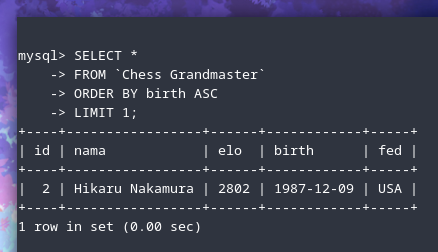

Begitu juga dengan GM yang paling junior, kita bisa menggunakan perintah berikut:
```sql
SELECT * 
FROM `Chess Grandmaster`
ORDER BY birth DESC
LIMIT 1;
```

Outputnya akan menunjukkan Gukesh Dommaraju sebagai GM yang paling junior:

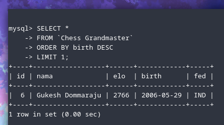

### Berapakah jumlah GM yang berasal dari (federasi) Amerika dan China?

Untuk mencari GM yang berasal dari federasi Amerika, kita bisa menggunakan perintah:
```sql
SELECT * 
FROM `Chess Grandmaster`
WHERE fed = 'USA';
```

Outpunya akan menunjukkan 3 GM, yaitu **Hikaru Nakamura**, **Fabiano Caruana**, dan **Wesley So**:

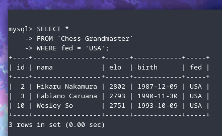

Untuk mencari GM yang berasal dari federasi China, kita hanya perlu mengganti kode federasinya saja:
```sql
SELECT * 
FROM `Chess Grandmaster`
WHERE fed = 'CHN';
```

Outpunya akan menunjukkan **Wei Yi**:

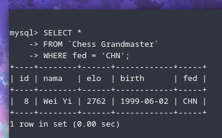


[^1]: https://id.wikipedia.org/wiki/SQL
[^2]: https://www.dicoding.com/blog/mengenal-apa-itu-relational-database/
[^3]: https://dqlab.id/belajar-mysql-secara-mendalam-pemula-wajib-tahu
[^4]: https://blog.unmaha.ac.id/memahami-tipe-data-pada-mysql/