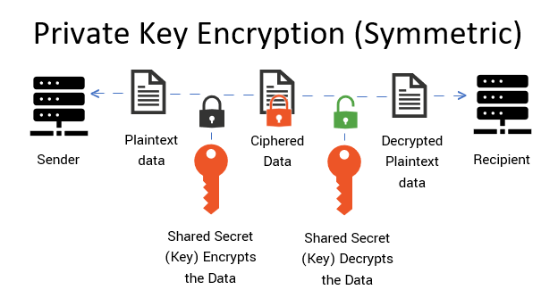
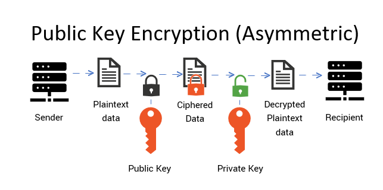

Hola!

Terkadang, kalau kita terlalu sering menggunakan SSH (Secure Shell) untuk me-*remote* server dengan terus menerus harus meng-*input*-kan password, bisa saja kita menjadi <s> frustasi</s> capek, bukan? Kita menghendaki agar kebutuhan *login* ke server via SSH bisa dilakukan se-*simple* mungkin. Nah, ternyata, kita bisa melakukan hal tersebut kok, dan kabar baiknya, cara agar bisa login ke SSH server tanpa password ini mudah untuk dipelajari. *So*, langsung kita ke tutorial...

:::info

Tutor ini berasumsi bahwa kalian sudah memiliki / meng-*install* paket ssh ya di sistem linux kalian. Kalau ternyata kalian belum meng-*install*-nya tapi juga ingin ikutan bereksperimen, maka SSH di linux host kalian dan tentu saja di server bisa di-*install* dengan perintah berikut:

|       Distro      |                  Command                                  |
|       ---         |                   ---                                     |
| **Debian/Ubuntu** | **`sudo apt install openssh-client openssh-server`**      |
| **Arch Linux**    | **`sudo pacman -Sy openssh`**                             |
| **Fedora**        | **`sudo dnf install openssh`**                            |
| **Opensuse**      | **`sudo zypper install openssh`**                         |

:::

1. *Generate* SSH *keys* (*private* & *public key*)

:::info[Sekilas tentang *Private* & *Public Key*]

Ilmu kriptografi diperlukan untuk mengamankan pesan atau data yang "terbang" di lalu lintas internet. Kriptografi digunakan untuk menyandikan pesan dan data sebelum dikirim untuk memastikan pesan tersebut aman (tidak bisa dibaca oleh orang lain) ketika di perjalanan dan membuka sandi tersebut ketika sudah terkirim kepada penerima. Untuk keperluan tersebut, mula-mula lahirlah metode kriptografi pertama yang bernama ***Private Key Encryption***. Kemudian, seiring perkembangan zaman, lahirlah metode kedua yang dinilai lebih aman dari metode pertama, yaitu metode ***Public Key Encryption***.

Metode ***Private Key Encryption*** adalah metode kriptografi pertama dan bersifat simetris. Disebut simetris karena metode ini hanya mengandalkan 1 buah kunci untuk meng-*encrypt* dan juga sekaligus men-*decrypt* data / pesan, yaitu *private key* saja. Jadi, dalam metode ***Private Key Encryption*** ini, hanya diperlukan 1 kunci saja untuk mengenkrip dan mendekrip data / pesan. Artinya, baik pengirim maupun penerima pesan harus memiliki *private key* yang sama untuk bisa saling berkomunikasi dengan aman. Namun itu juga berarti, jika orang lain berhasil mencuri *private key* tersebut, itu artinya tidak ada lagi rahasia di antara pengirim dan penerima pesan. 

[](www.cheapsslsecurity.com)

Berdasarkan kekhawatiran tersebut, maka lahirlah metode kedua, yaitu metode ***Public Key Encryption*** yang bersifat asimetris. Disebut asimetris karena metode ***Public Key Ecryption*** menggunakan 2 buah kunci yang memiliki fungsinya masing-masing, yaitu sebuah kunci untuk meng-*encrypt* data / pesan (*public key*) dan sebuah kunci lainnya yang digunakan untuk men-*decrypt* data / pesan (*private key*). Jadi, metode enkripsi ini disebut asimetris karena memerlukan 2 kunci berbeda untuk mengenkrip dan mendekrip data / pesan. Artinya, seorang pengirim pesan memerlukan *public key* untuk mengenkrip pesan yang akan dikirim dan seorang penerima pesan memerlukan *private key* untuk mendekrip pesan yang terkirim padanya.

[](www.cheapsslsecurity.com)

:::

```shell
ssh-keygen -t rsa -b 4096 -C "yourname/hostname/email"
```

> Keterangan:  
> 1. <mark> -t rsa</mark> : Tipe *key*-nya, karena RSA, berarti kita memilih menggunakan algoritma RSA untuk membuat *key* tersebut.
> 2. <mark> -b 4096</mark> : Jumlah bit dalam *key*-nya, semakin panjang, semakin aman. Default-nya adalah 2048.
> 3. <mark> -C "yourname/hostname/email"</mark> : komentar di akhir, bisa diisi nama user, nama host, atau email sebagai pengenal.

Nanti, kita akan memiliki 2 buah *key pair* yang tersimpan (secara *default*) di direktori **`~/.ssh`**: sebuah *private key* (**`~/.ssh/id_rsa`**) dan sebuah *public key* (**`~/.ssh/id_rsa.pub`**). 

2. Berikutnya, kita perlu meng-*copy-paste*-kan <mark> public key</mark> tersebut ke file **`~/.ssh/authorized_key`** di server (bisa manual atau) dengan perintah berikut:

```shell
cat ~/.ssh/id_rsa.pub | ssh username@remote_host "mkdir -p ~/.ssh && cat >> ~/.ssh/authorized_keys"
```

Berikut adalah demonstrasinya, mulai dari pembuatan *key pair* hingga login ke server via SSH tanpa password:

<iframe
  src="https://player.cloudinary.com/embed/?cloud_name=dpvtbnqf7&public_id=sshnopass_oiso0d"
  width="640"
  height="360" 
  style="height: auto; width: 100%; aspect-ratio: 640 / 360;"
  allow="autoplay; fullscreen; encrypted-media; picture-in-picture"
  allowfullscreen
  frameborder="0"
></iframe>

Tada! Kita sudah bisa login ke server via SSH tanpa memerlukan password!

Btw, artikel ini selain diinspirasi oleh rasa malas saya mengetikkan password berulang-ulang tiap login ke server via SSH, juga diinspirasikan oleh sebuah video Youtube dari channel [Tony Teach Tech](https://www.youtube.com/@TonyTeachesTech) berikut ini:

<iframe width="100%" height="468"
  src="https://www.youtube.com/embed/j2vBT3T79Pg"
  title="How to Install Windows Vista + Aero on VMWare"
  frameborder="0" allowfullscreen>
</iframe>


[^1]: https://cheapsslsecurity.com/p/what-is-public-key-and-private-key-cryptography-and-how-does-it-work/