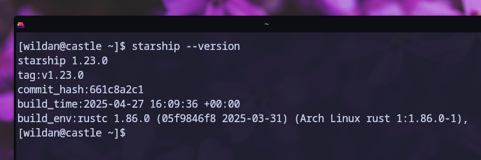
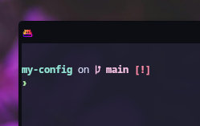

## Starship Overview

**Starship** adalah _script_ yang dibuat dalam bahasa pemrograman [Rust](https://www.rust-lang.org/) untuk mempercantik shell prompt dari terminal kita.
Jadi, **starship** dapat digunakan di semua jenis shell (bash, zsh, fish, etc) di sistem operasi apapun (linux, bsd, mac, android, windows).[^1]
Jika shell prompt default hanya akan menampilkan informasi tentang "user", "hostname", serta "current directory" saja, **starship** dapat memberikan informasi tambahan lain (git version, os, time, etc) berikut dengan kustomisasi warna jika diinginkan.

## The Objective

Nah, di artikel ini, saya akan menunjukkan cara mengkonfigurasi "bash" shell di (Arch) Linux menggunakan **starship** dengan preset "catputccin powerline".

## The Tutorial

:::info

Website resmi **starship**: https://starship.rs/  
Panduan penggunaan **starship**: https://starship.rs/guide/  
Daftar preset **starship**: https://starship.rs/presets/  
Konfigurasi **starship**: https://starship.rs/config/

:::

::github{repo="starship/starship"}

### Installation

Pertama, kita _install_ **starship** terlebih dahulu:

```shell
sudo pacman -S starship
```

Atau via _script_ dari website-nya langsung juga bisa:

```shell
curl -sS https://starship.rs/install.sh | sh
```

Pastikan **starship** sudah terpasang dengan mengecek versinya:

```shell
starship --version
```



### Setup The Shell 

Saya menggunaan shell bash, jadi untuk men-_setup_ **starship** di bash adalah dengan menambahkan baris berikut ke `~/bashrc`:

```bash
eval "$(starship init bash)"
```

Setelah itu, kita bisa me-_restart_ terminal atau _shell session_ kita untuk melihat perubahannya.
Perhatikan, sekarang, shell-nya sudah berubah, bukan?



Sampai di sini, jika kalian sudah merasa cukup dengan tampilan shell yang baru, maka tidak perlu ke bagian berikutnya (kustomisasi).
Dengan kata lain, bagian _customization_ di bawah ini bersifat opsional.

### Configuration

Fyi, sebelumnya, saya juga sudah pernah menulis artikel yang membahas cara mengkonfigurasi bash shell, tapi menggunakan **"[synth-shell](https://github.com/andresgongora/synth-shell)"**:

[[/tech/kittyconfig/]]

Sekarang, kita akan melakukan beberapa konfigurasi. Kita tentu saja dapat mengkonfigurasi **starship** seperti apa yang kita inginkan.
Namun, pada bagian ini, saya hanya akan mengkonfigurasi preset-nya saja ke "catputccin-powerline".
Berikut langkah-langkahnya:

1. _Install_ Nerd Font

Via package manager: 

```shell
sudo pacman ttf-jetbrains-mono-nerd ttf-nerd-fonts-symbols
```

Atau langsung dari website-nya: https://www.nerdfonts.com/font-downloads

- Download **"JetBrainsMono Nerd Font"** & **"Symbols Nerd Font"**.
- Extract dan masukkan semua file ***.ttf** ke direktori `~/.fonts` (buat terlebih dahulu jika belum ada). 
 
2. _Install_ preset catputccin-powerline

```shell
starship preset catppuccin-powerline -o ~/.config/starship.toml
```

_By default_, preset yang ter-_install_ nanti adalah **catputccin mocha**. Per artikel ini ditulis, ada 4 preset catputccin:

- **catputccin_mocha** 



- **catputccin_frappe**



- **catputccin_macchiato**



- **catputccin_latte**



Kita dapat mengubahnya dengan mengganti _value_ "pallete = " ke **catputccin_mocha/frappe/macchiato/latte** di `~/.config/starship.toml`.

Berikut adalah isi file `starship.toml`:

```toml title="starship.toml"
"$schema" = 'https://starship.rs/config-schema.json'

format = """
[](red)\
$os\
$username\
[](bg:peach fg:red)\
$directory\
[](bg:yellow fg:peach)\
$git_branch\
$git_status\
[](fg:yellow bg:green)\
$c\
$rust\
$golang\
$nodejs\
$php\
$java\
$kotlin\
$haskell\
$python\
[](fg:green bg:sapphire)\
$conda\
[](fg:sapphire bg:lavender)\
$time\
[ ](fg:lavender)\
$cmd_duration\
$line_break\
$character"""

palette = 'catppuccin_mocha'

[os]
disabled = false
style = "bg:red fg:crust"

[os.symbols]
Windows = ""
Ubuntu = "󰕈"
SUSE = ""
Raspbian = "󰐿"
Mint = "󰣭"
Macos = "󰀵"
Manjaro = ""
Linux = "󰌽"
Gentoo = "󰣨"
Fedora = "󰣛"
Alpine = ""
Amazon = ""
Android = ""
Arch = "󰣇"
Artix = "󰣇"
CentOS = ""
Debian = "󰣚"
Redhat = "󱄛"
RedHatEnterprise = "󱄛"

[username]
show_always = true
style_user = "bg:red fg:crust"
style_root = "bg:red fg:crust"
format = '[ $user]($style)'

[directory]
style = "bg:peach fg:crust"
format = "[ $path ]($style)"
truncation_length = 3
truncation_symbol = "…/"

[directory.substitutions]
"Documents" = "󰈙 "
"Downloads" = " "
"Music" = "󰝚 "
"Pictures" = " "
"Developer" = "󰲋 "

[git_branch]
symbol = ""
style = "bg:yellow"
format = '[[ $symbol $branch ](fg:crust bg:yellow)]($style)'

[git_status]
style = "bg:yellow"
format = '[[($all_status$ahead_behind )](fg:crust bg:yellow)]($style)'

[nodejs]
symbol = ""
style = "bg:green"
format = '[[ $symbol( $version) ](fg:crust bg:green)]($style)'

[c]
symbol = " "
style = "bg:green"
format = '[[ $symbol( $version) ](fg:crust bg:green)]($style)'

[rust]
symbol = ""
style = "bg:green"
format = '[[ $symbol( $version) ](fg:crust bg:green)]($style)'

[golang]
symbol = ""
style = "bg:green"
format = '[[ $symbol( $version) ](fg:crust bg:green)]($style)'

[php]
symbol = ""
style = "bg:green"
format = '[[ $symbol( $version) ](fg:crust bg:green)]($style)'

[java]
symbol = " "
style = "bg:green"
format = '[[ $symbol( $version) ](fg:crust bg:green)]($style)'

[kotlin]
symbol = ""
style = "bg:green"
format = '[[ $symbol( $version) ](fg:crust bg:green)]($style)'

[haskell]
symbol = ""
style = "bg:green"
format = '[[ $symbol( $version) ](fg:crust bg:green)]($style)'

[python]
symbol = ""
style = "bg:green"
format = '[[ $symbol( $version)(\(#$virtualenv\)) ](fg:crust bg:green)]($style)'

[docker_context]
symbol = ""
style = "bg:sapphire"
format = '[[ $symbol( $context) ](fg:crust bg:sapphire)]($style)'

[conda]
symbol = "  "
style = "fg:crust bg:sapphire"
format = '[$symbol$environment ]($style)'
ignore_base = false

[time]
disabled = false
time_format = "%R"
style = "bg:lavender"
format = '[[  $time ](fg:crust bg:lavender)]($style)'

[line_break]
disabled = true

[character]
disabled = false
success_symbol = '[❯](bold fg:green)'
error_symbol = '[❯](bold fg:red)'
vimcmd_symbol = '[❮](bold fg:green)'
vimcmd_replace_one_symbol = '[❮](bold fg:lavender)'
vimcmd_replace_symbol = '[❮](bold fg:lavender)'
vimcmd_visual_symbol = '[❮](bold fg:yellow)'

[cmd_duration]
show_milliseconds = true
format = " in $duration "
style = "bg:lavender"
disabled = false
show_notifications = true
min_time_to_notify = 45000

[palettes.catppuccin_mocha]
rosewater = "#f5e0dc"
flamingo = "#f2cdcd"
pink = "#f5c2e7"
mauve = "#cba6f7"
red = "#f38ba8"
maroon = "#eba0ac"
peach = "#fab387"
yellow = "#f9e2af"
green = "#a6e3a1"
teal = "#94e2d5"
sky = "#89dceb"
sapphire = "#74c7ec"
blue = "#89b4fa"
lavender = "#b4befe"
text = "#cdd6f4"
subtext1 = "#bac2de"
subtext0 = "#a6adc8"
overlay2 = "#9399b2"
overlay1 = "#7f849c"
overlay0 = "#6c7086"
surface2 = "#585b70"
surface1 = "#45475a"
surface0 = "#313244"
base = "#1e1e2e"
mantle = "#181825"
crust = "#11111b"

[palettes.catppuccin_frappe]
rosewater = "#f2d5cf"
flamingo = "#eebebe"
pink = "#f4b8e4"
mauve = "#ca9ee6"
red = "#e78284"
maroon = "#ea999c"
peach = "#ef9f76"
yellow = "#e5c890"
green = "#a6d189"
teal = "#81c8be"
sky = "#99d1db"
sapphire = "#85c1dc"
blue = "#8caaee"
lavender = "#babbf1"
text = "#c6d0f5"
subtext1 = "#b5bfe2"
subtext0 = "#a5adce"
overlay2 = "#949cbb"
overlay1 = "#838ba7"
overlay0 = "#737994"
surface2 = "#626880"
surface1 = "#51576d"
surface0 = "#414559"
base = "#303446"
mantle = "#292c3c"
crust = "#232634"

[palettes.catppuccin_latte]
rosewater = "#dc8a78"
flamingo = "#dd7878"
pink = "#ea76cb"
mauve = "#8839ef"
red = "#d20f39"
maroon = "#e64553"
peach = "#fe640b"
yellow = "#df8e1d"
green = "#40a02b"
teal = "#179299"
sky = "#04a5e5"
sapphire = "#209fb5"
blue = "#1e66f5"
lavender = "#7287fd"
text = "#4c4f69"
subtext1 = "#5c5f77"
subtext0 = "#6c6f85"
overlay2 = "#7c7f93"
overlay1 = "#8c8fa1"
overlay0 = "#9ca0b0"
surface2 = "#acb0be"
surface1 = "#bcc0cc"
surface0 = "#ccd0da"
base = "#eff1f5"
mantle = "#e6e9ef"
crust = "#dce0e8"

[palettes.catppuccin_macchiato]
rosewater = "#f4dbd6"
flamingo = "#f0c6c6"
pink = "#f5bde6"
mauve = "#c6a0f6"
red = "#ed8796"
maroon = "#ee99a0"
peach = "#f5a97f"
yellow = "#eed49f"
green = "#a6da95"
teal = "#8bd5ca"
sky = "#91d7e3"
sapphire = "#7dc4e4"
blue = "#8aadf4"
lavender = "#b7bdf8"
text = "#cad3f5"
subtext1 = "#b8c0e0"
subtext0 = "#a5adcb"
overlay2 = "#939ab7"
overlay1 = "#8087a2"
overlay0 = "#6e738d"
surface2 = "#5b6078"
surface1 = "#494d64"
surface0 = "#363a4f"
base = "#24273a"
mantle = "#1e2030"
crust = "#181926"
```


[^1]: https://starship.rs/


