>  ***Steganography*** *is the practice of representing information within another message or physical object*.[^1]

# Pengertian & Sejarah Steganography 

Pengertian *steganography* [selanjutnya saya singkat dengan **stego**] memang sesederhana "ilmu dan seni menyembunyikan pesan atau informasi rahasia di dalam pesan lain".

Tapi sebetulnya, jauh sebelum komputer ditemukan, proses stego ini sudah dilakukan sejak zaman Yunani Kuno. Sebuah kisah dari penguasa Yunani saat itu, Herodotus pada tahun 440 BC (**re**: *Before Christ / Sebelum Masehi*) yang terdapat dalam buku ***Histories of Herodotus***, menceritakan tentang bagaimana kepala budak digunakan sebagai media *steganography*. Caranya, kepala budak digundul, kemudian ditulisi pesan, selanjutnya rambut budak tersebut dibiarkan tumbuh untuk kemudian dikirim. Nanti, penerima budak tersebut akan menggunduli kembali kepala budak tersebut agar pesannya dapat terbaca.[^2]  

Sekarang, dengan keberadaan komputer, perkembangan stego tentu sudah jauh berkembang. Salah satu teknik yang paling banyak digunakan yaitu **LSB** (*Least Significant Bit*) dengan menyisipkan bit ke dalam file digital (teks / gambar / audio / video). Melalui teknik ini, informasi rahasia disisipkan ke dalam file digital dengan cara mengganti bit-bit paling tidak signifikan dalam file digital dengan bit-bit pesan rahasia. Bit-bit yang diganti tidak akan mempengaruhi kualitas file digital dan tidak akan terlihat oleh mata manusia.[^3] Kurang lebih, berikut adalah ilustrasi dari proses LSB:[^4]

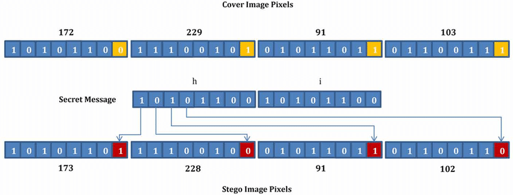

Contohnya seperti gambar berikut ini:
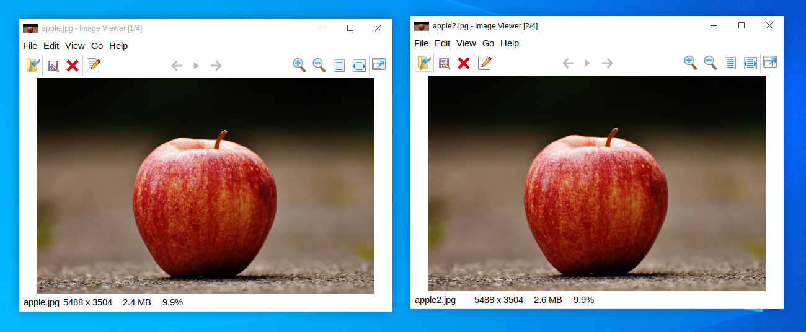

Salah satu dari dua gambar apel di atas sudah saya sisipi sebuah file bernama "secrets.txt" dengan isi file *This is an Apple*.
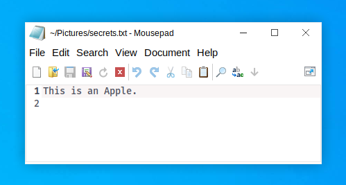

Pertanyaannya... 
- Bisakah kalian melihat perbedaan kedua gambar tersebut?
- Bisakah kalian menebak mana file gambar apel yang sudah disisipi file "secrets.txt"?

Kalau dilihat gambarnya seklias, hampir tidak terlihat perbedaan antara file gambar apel di sebelah kiri (apple.jpg) dan file gambar apel di sebelah kanan (apple2.jpg), bukan? Tapi, kalau diperhatikan dengan seksama, bahkan dari ukuran file-nya saja sudah berbeda. File gambar apel di sebelah kiri berukuran 2.4 MB, sementara file gambar apel di sebelah kanan berukuran 2.6 MB. Artinya, file gambar apel di sebelah kanan (apple2.jpg) adalah gambar yang sudah disisipi file "secrets.txt" tadi, sehingga ukuran file-nya jadi lebih besar.

# Pemanfaatan Steganography dalam Cyber Security

Stego sebagai teknik dapat digunakan oleh pakar siber untuk menyembunyikan pesan atau informasi rahasia. Sebelumnya, kita sudah melihat, stego sudah digunakan sejak zaman Yunani Kuno untuk mengirim pesan. Di zaman modern, ketika Perang Dunia 1, Kedutaan Jerman di Amerika (Washington D.C.) mengirimkan pesan ke kantor pusat di Berlin via Telegram (bukan telegram aplikasi seperti sekarang tentu saja). Pesan yang dikirim adalah seperti ini[^5]:
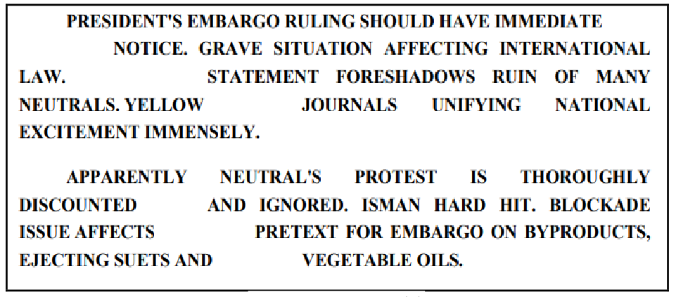

Membaca huruf pertama dari setiap kata pada pesan pertama atau huruf kedua dari setiap kata pada pesan kedua akan menghasilkan informasi tersembunyi berikut ini:

*Pershing Sails From N.Y. June 1*

Namun, stego juga dapat disalahgunakan oleh para *hacker* untuk menyerang target serangannya. Misalnya, pada tahun 2022, sebuah perusahaan keamanan siber [Proofpoint](https://www.proofpoint.com/us) merilis laporan mengenai aktivitas mencurigakan (*malicious activity*) yang membahayakan Perancis. Penyerang menggunakan teknis stego untuk menyembunyikan *malicious script* pada sebuah gambar di dalam dokumen MS. Word yang menyamar sebagai informasi yang terkait dengan aturan [GDPR](https://learn.microsoft.com/en-us/compliance/regulatory/gdpr). Padahal, *script* tersebut ternyata men-*trigger* atau memicu pengunduhan *backdoor* yang langsung menginstall sendiri ke perangkat korban[^6].
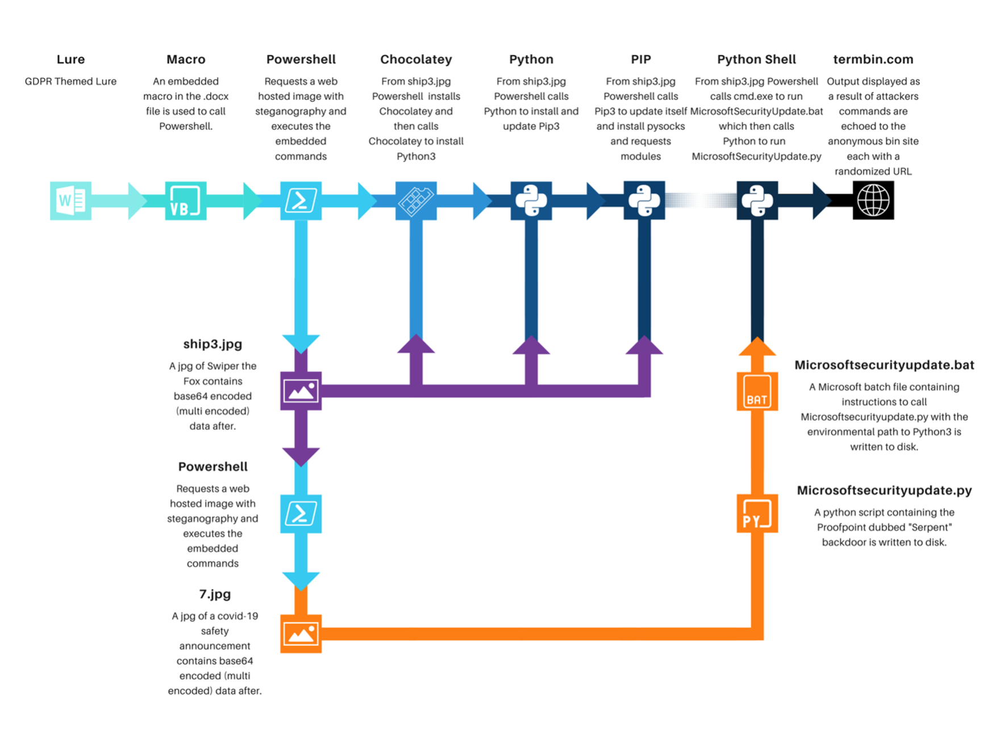  

# Jenis - jenis Steganography 

Berikut adalah 5 jenis stego yang umum dijumpai di era digial saat ini. Sebab, sebetulnya pesan dapat disembunyikan dengan berbagai cara dan kita hanya dibatasi oleh imajinasi dan teknologi yang ada saat ini.[^7]:

## Image Steganography
Image stego berarti menyisipkan pesan rahasia ke dalam file gambar. Teknik yang populer digunakan adalah LSB (*Least Significant Bit*) seperti yang sudah dijelaskan sebelumnya. Jadi, secara teknis, kita hanya perlu mengganti bit-bit yang paling tidak signifikan dalam sebuah file gmabar untuk diganti dengan bit informasi yang ingin kita sisipkan[^8]. 
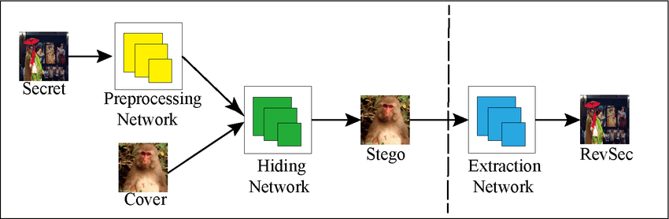

Beberapa *tools* yang dapat kita gunakan untuk melakukan *image* stego adalah sebagai berikut:
1. OpenStego: https://www.openstego.com/
2. QuickStego: https://download.cnet.com/quickstego/3000-2092_4-75593140.html
3. Steghide: https://steghide.sourceforge.net/
4. Zsteg: https://github.com/zed-0xff/zsteg

## Audio Steganography
Audio stego berarti menyisipkan pesan rahasia ke dalam file audio. Prinsip teknisnya sama dengan *image* stego, yaitu menggunakan metode LSB dengan mengganti bit paling tidak signifikan dalam audio file untuk diganti dengan bit pesan atau informasi rahasia yang ingin disisipkan. Namun, jika ditelaah lebih dalam, sebetulnya ada beberapa teknik audio stego yang dapat dilakukan[^9]. 
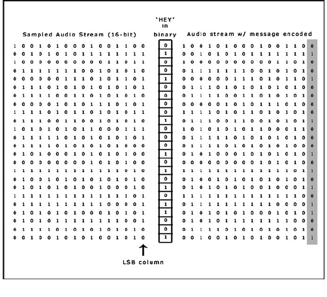

Beberapa *tools* yang dapat kita gunakan untuk melakukan audio stego adalah sebagai berikut:
1. DeepSound: https://github.com/Jpinsoft/DeepSound
2. https://github.com/fabienpe/MP3Stego
3. SilentEye: https://sourceforge.net/projects/silenteye/
4. OpenPuff: https://embeddedsw.net/OpenPuff_download.html
5. Coagula: https://www.abc.se/~re/Coagula/Coagula.html
6. Invisible Ink: https://sourceforge.net/projects/diit/

## Video Steganography

Video stego berarti menyisipkan pesan rahasia ke dalam file video. Prinsipnya tetap sama seperti image stego, namun video stego memungkinkan kita untuk menyimpan lebih banyak data ke dalam file video. Karena, setiap frame adalah sebuah gambar sehingga kita bisa menyisipkan banyak data ke dalam file video tersebut[^10]. 
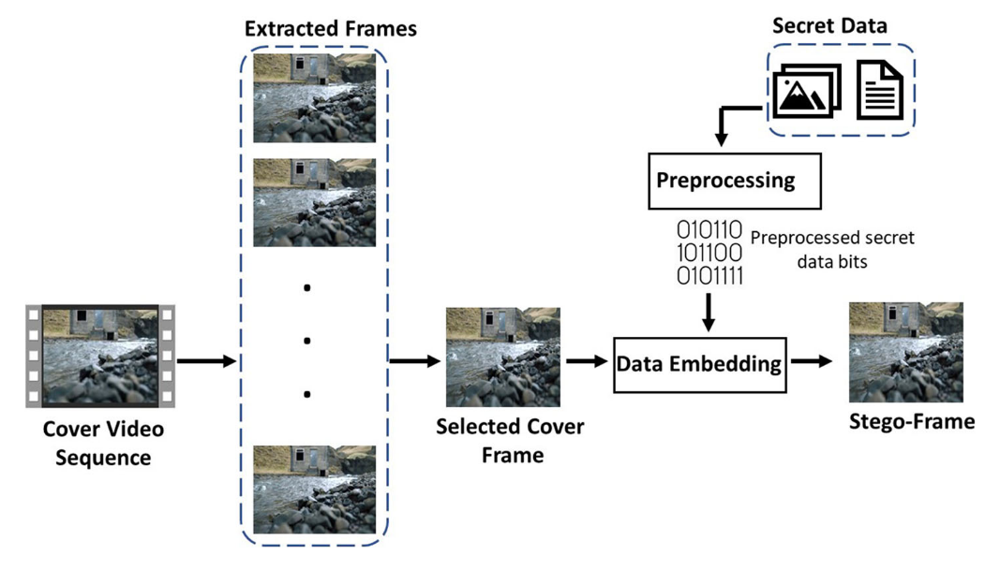


*Tools* yang dapat digunakan untuk video stego adalah sebagai berikut:
1. Steganosaurus: https://steganosaur.us/
2. StegoStick: https://sourceforge.net/projects/stegostick/

## Text Steganography

Teks stego adalah stego paling tua yang pernah ada. Salah satu contoh penerapan teks stego adalah dengan metode substitusi huruf. Pesan dapat disembunyikan di dalam teks melalui ukuran huruf, spasi, atau karakteristik lain yang sulit dilihat sehingga hanya orang yang tahu yang dapat membacanya[^11].
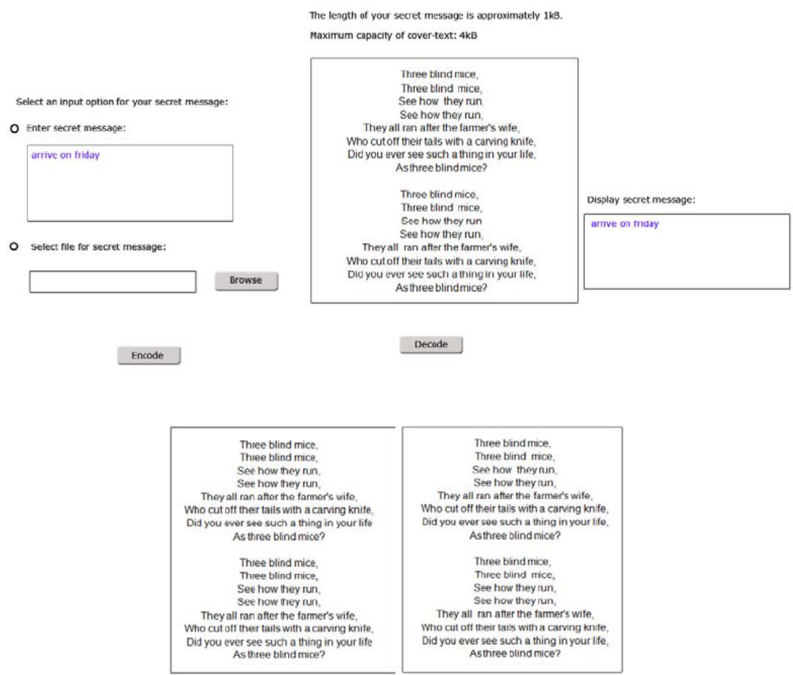


# Steganography in (Hacker) Movie

Berikut adalah secuplik potongan video dari serial *hacker* terbaik sepanjang masa, yaitu **Mr. Robot** yang sedang mendemonstrasikan Elliot mempraktikkan stego:

<iframe width="100%" height="468"
  src="https://www.youtube.com/embed/t4HuZiUXBMA"
  title="Elliot doing Steganography"
  frameborder="0" allowfullscreen>
</iframe>

# Demonstrasi

Sekarang, saya akan mendemonstrasikan atau mempraktikkan proses stego menggunakan beberapa *tools* atau *software* yang beberapa diantaranya bersifat *open source* dan bahkan tersedia di repo Kali Linux. Beberapa tools yang saya gunakan dalam demo ini adalah sebagai berikut:

| No  |       Tools       |       Distribusi        |           Instalasi           |
| --- |       -----       |         -----           |             -----             |
|  1  |    **Steghide**   |         Debian          |  `sudo apt install steghide`  |
|     |                   |         Arch            |  `sudo pacman -S steghide`    |
|     |                   |         OpenSUSE        |  `sudo zypper in steghide`    |
|     |                   |         Fedora          |  `sudo dnf install steghide`  |
|  2  |    **Exiftool**   |         Debian          |  `sudo apt install exiftool`  |
|     |                   |         Arch            |  `sudo pacman -S exiftool`    |
|     |                   |         OpenSUSE        |  `sudo zypper in exiftool`    |
|     |                   |         Fedora          |  `sudo dnf install exiftool`  |
|  3  |     **Zsteg**     |           All           |  `gem install zsteg`          | 
|  4  | **Stegoveritas**  |           All           |  `pip install stegoveritas`   |
|  5  |**Sonic Visualiser**|           All           |  https://www.sonicvisualiser.org/download.html | 

> **Keterangan**
>
> [x] Zsteg diinstall via ruby
> 
> [x] Stegoveritas diinstall via python

Untuk demonstasi ini, saya mengunakan 3 file dari *room* **CC: Steganography** milik [Tryhackme](https://tryhackme.com/r/room/ccstego). Ketiga file tersebut bisa kalian download di sini:

|                  File1                     |                  File2                   |                  File3                   |
|                 -----                      |                 -----                    |                 -----                    |
|   [exam1.jpeg](/assets/files/steganography/exam1.jpeg)     |   [exam2.wav](/assets/files/steganography/exam2.wav)    |   [qrcode.png](/assets/files/steganography/qrcode.png)   |

## Soal

Tugas kita sederhana, kita hanya perlu mencari ***key*** yang tersimpan dalam masing-masing file tersebut.
1. Key File1: ...?
2. Key File2: ...?
3. Key File3: ...?

## Jawab

### 1. Key File1: ...?

Kita pastikan dulu jenis dan hash value dari filenya:
```bash
md5sum exam1.jpeg
ll exam1.jpeg
file exam1.jpeg
```
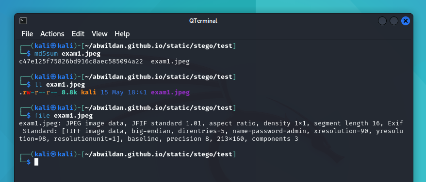

Sebuah file JPEG biasa, kalau kita buka dengan image viewer:
```bash
ristretto exam1.jpeg
```
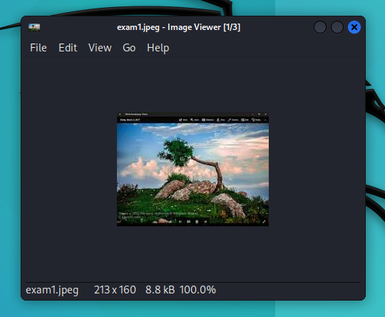

Hanya sebuah gambar pohon dan pemandangan langit berukuran 213xx160 px.

Sekarang, kita akan mencari ***key*** yang disembunyikan pada file exam1.jpeg ini. Berhubung file-nya adalah file gambar (JPEG), jadi saya berasumsi kita bisa mencari ***key*** tersebut dengan steghide:
```bash
steghide extract -sf exam1.jpeg
```
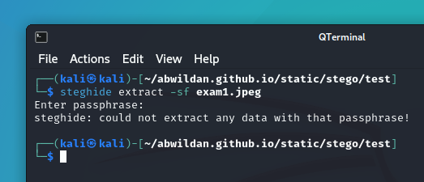

Ternyata minta parafrase. Kalau dikosongkan, kita tidak akan mendapatkan file ***key*** yang dimaksud tadi. Jadi, sebelum bisa mendapatkan ***key***-nya, kita harus tau terlebih dahulu parafrase untuk extract file berisi ***key*** tersebut. Di sini, saya akan menggunakan exiftool:
```bash
exiftool exam1.jpeg
```
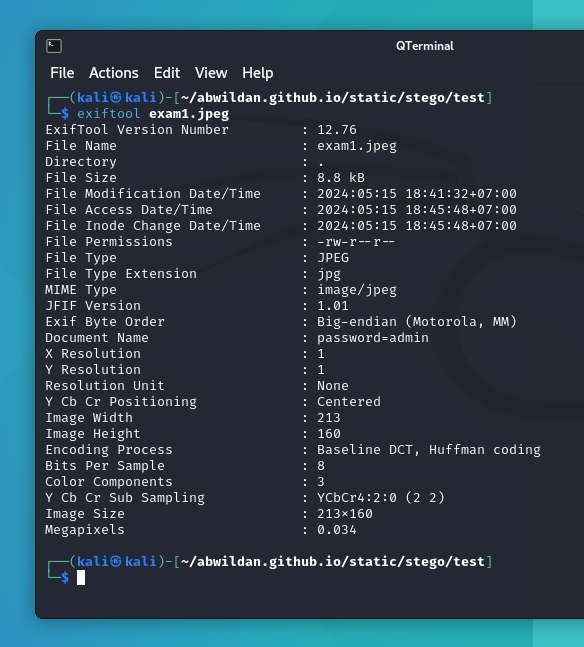

Berdasarkan *screenshot* di atas, kita bisa lihat, exiftool memberikan kita info penting tentang parafrasenya. Pada bagian "Document Name", di sana tertulis password=admin. Artinya, kita bisa menebak, "admin" adalah parafrase untuk mendapatkan ***key*** tadi. Kita coba:
```bash
 steghide extract -sf exam1.jpeg
 admin
```
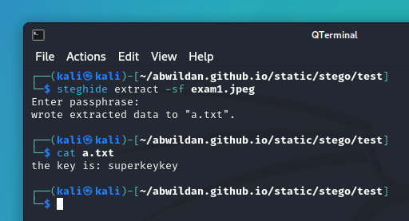

Berhasil!!

Berarti Key File1: **superkeykey**

> **Catatan:**
>
> Dengan **steghide**, selain kita dapat mengekstrak file teks dari sebuah gambar (JPG/JPEG), kita juga bisa menyisipkan file teks ke sebuah gambar, seperti dua buah gambar apel yang di awal artikel ini saya tampilkan, itu saya membuatkan dengan steghide. Perintahnya juga sederhana dan dapat ditemukan di dokumentasi *help*-nya.
> ```bash
> steghide embed -cf cvr.jpg -ef emb.txt
> ```

### 2. Key File2: ...?

Seperti soal sebelumnya, kita pastikan dulu hash value dan jenis filenya:
```bash
md5sum exam1.wav
ll exam2.wav
file exam1.wav
```
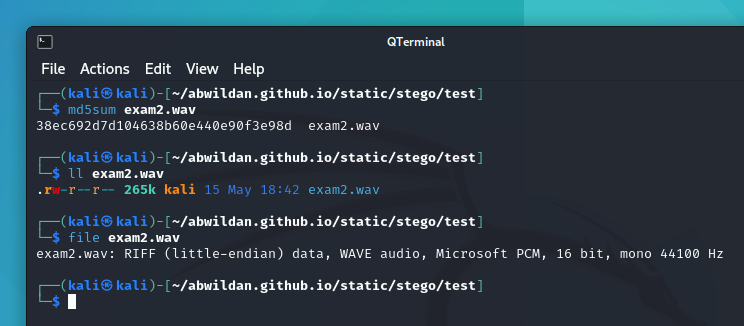

Sebuah file WAVE audio. Kalau kita buka filenya dengan mpv misalnya:
```bash
mpv exam2.wav
```
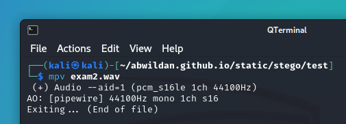

Karena ini file audio, kita bisa gunakan Sonic Visualiser untuk mencari ***key***-nya. 
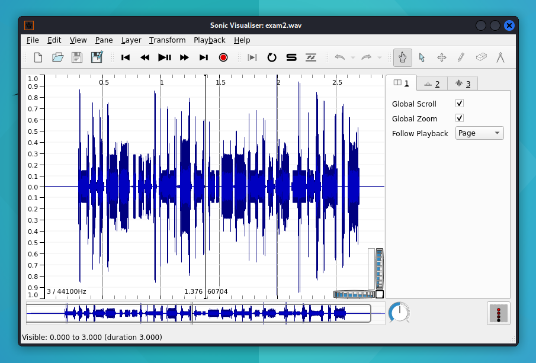

Tidak terlihat ada apa-apa bukan? Karena biasanya informasi rahasianya disimpan di spektogram. Jadi, kita buka spektogramnya di **Layer** -> **Add Spectogram**.
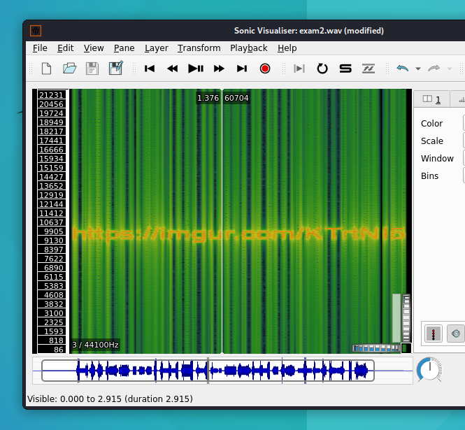

Terlihat informasi rahasia yang disembunyikan adalah sebuah url berikut: https://imgur.com/KTrtNI5. Link tersebut mengarahkan kita ke suatu file gambar pensil yang harus kita unduh, KTrtNI5.png, sebagai berikut:
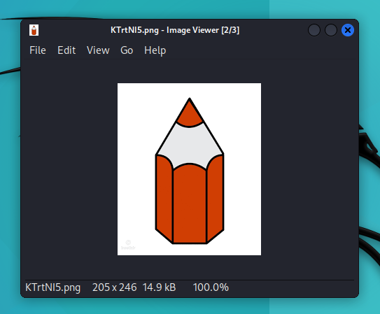

Cek hash dan jenis filenya:
```bash
md5sum exam1.wav
ll exam2.wav
file exam1.wav
```
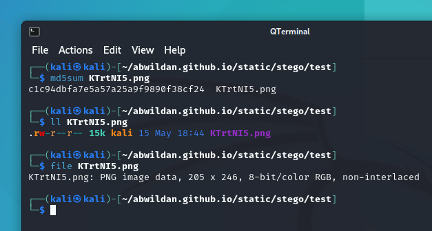

Karena file-nya adalah PNG, saya akan gunakan zsteg untuk mendapatkan ***key***-nya (karena kita masih belum dapat dari tadi...):
```bash
zsteg KTrtNI5.png
```
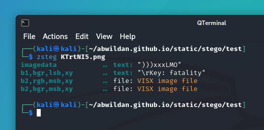

Berhasil! Kita mendapatkan ***key***-nya!!!

Berarti Key File2: **fatality**

### 3. Key File3: ...?

Seperti biasa, kita identifikasi hash dan jenis filenya terlebih dahulu:
```bash
md5sum qrcode.png
ll qrcode.png
file qrcode.png
```
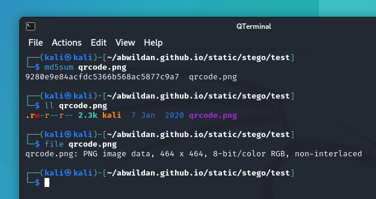

Kalau dibuka:
```bash
ristretto qrcode.png
```
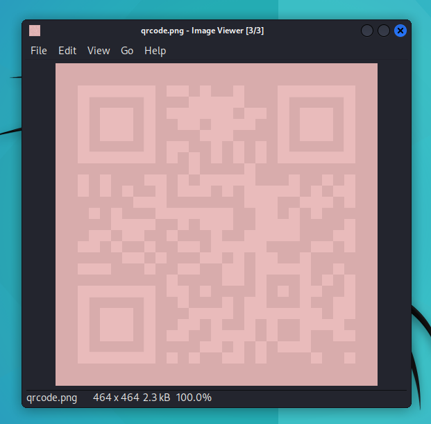

... adalah sebuah QR Code biasa. Tapi, kita tidak bisa men-*scan* QR Code tersebut karena warnanya yang "tidak bagus". Jadi, kita perlu mencari versi warna yang paling tepat dari QR Code ini supaya bisa di-*scan*. Saya akan gunakan stegoveritas:
```bash
stegoveritas qrcode.png
```
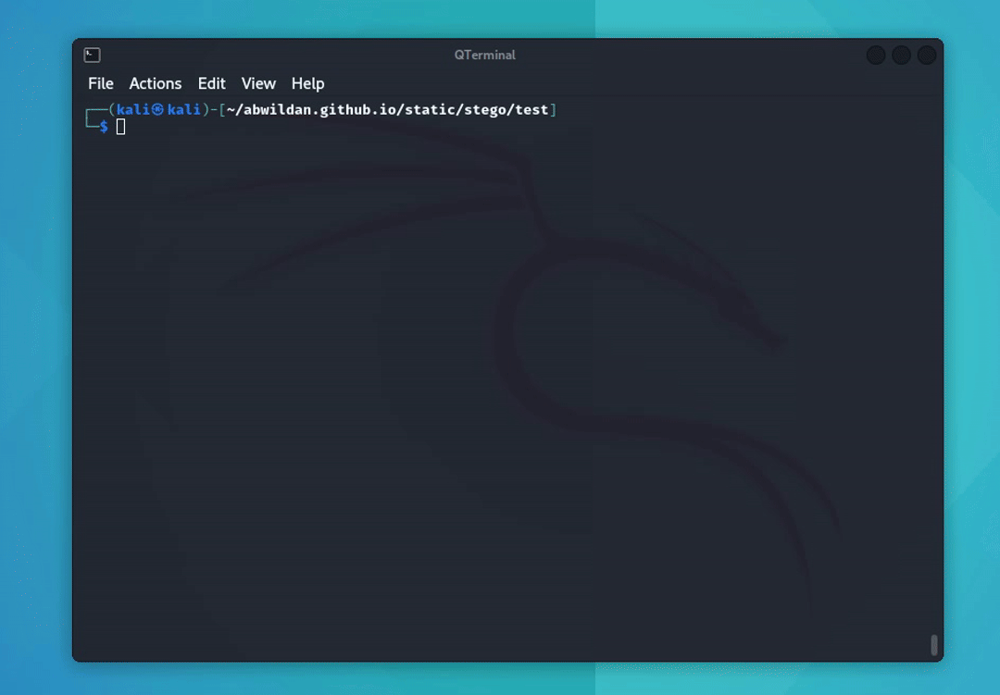

Setelah prosesnya selesai, kita mendapat satu folder / direktori baru, "results".
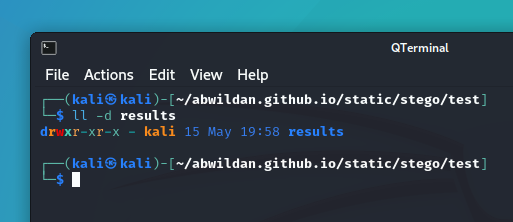

Di dalamnya, terdapat banyak file QR Code dengan warna baru hasil dari ekstraksi oleh stegoveritas tadi...
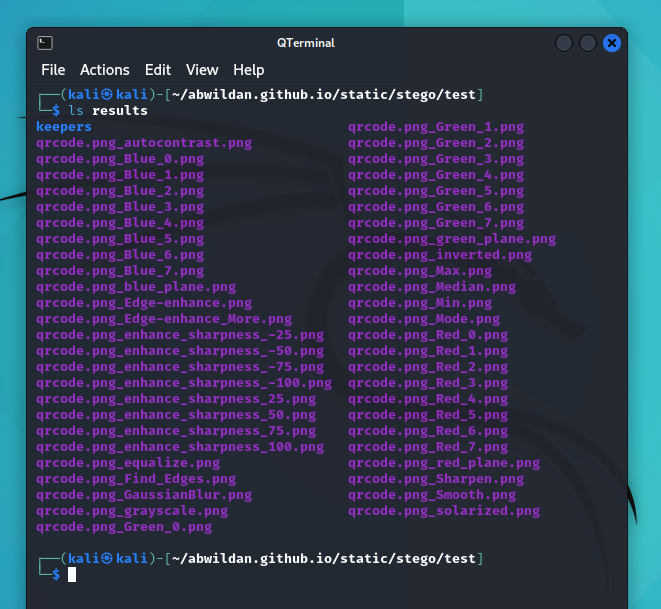

Kita hanya perlu mencari file dengan gambar QR Code yang paling jelas, yaitu warna hitam putih dan tentu saja bisa di-*scan*.

Setelah mencoba satu-satu, saya akhirnya mendapatkan saya file QR Code original, yaitu file dengan nama **qrcode.png_Blue_2.png**:
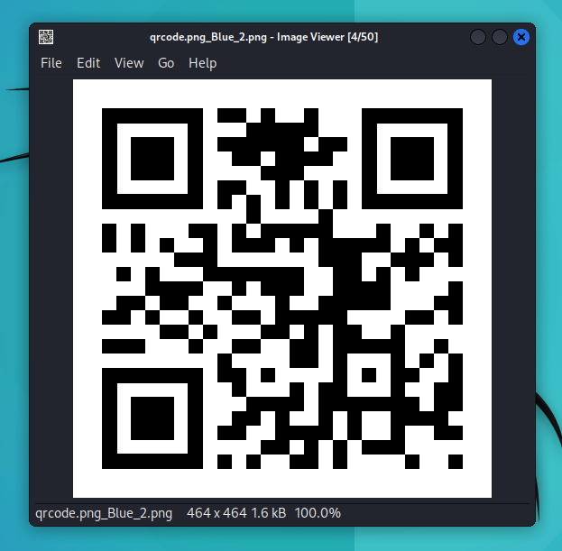

Scan, atau kalau tidak bisa scan, kita bisa menggunakan bantuan website [Web QR](https://webqr.com):
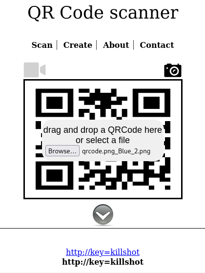

EAASYY!!

Berarti Key File3: **killshot**

Okey, sekian dulu pembahasan tentang steganography kali ini. Sampai ketemu di artikel saya yang lain ya!!

Byee~

[^1]: https://en.wikipedia.org/wiki/Steganography
[^2]: https://dosen.perbanas.id/sejarah-steganografi/?print=print
[^3]: https://teknokrat.ac.id/opini-sejarah-perkembangan-steganografi/
[^4]: https://www.researchgate.net/publication/316665366_Design_of_Reconfigurable_Architectures_for_Steganography_System
[^5]: http://ijses.com/wp-content/uploads/2021/03/117-IJSES-V4N12.pdf
[^6]: https://www.proofpoint.com/us/blog/threat-insight/serpent-no-swiping-new-backdoor-targets-french-entities-unique-attack-chain
[^7]: https://nordvpn.com/blog/what-is-steganography/
[^8]: https://www.researchgate.net/publication/347680043_High-Capacity_Image_Steganography_Based_on_Improved_Xception
[^9]: https://www.researchgate.net/publication/320124080_Audio_Steganography_Techniques_A_Survey  
[^10]: https://link.springer.com/article/10.1007/s11042-023-14844-w
[^11]: https://www.researchgate.net/publication/228623052_Information_hiding_A_new_approach_in_text_steganography
