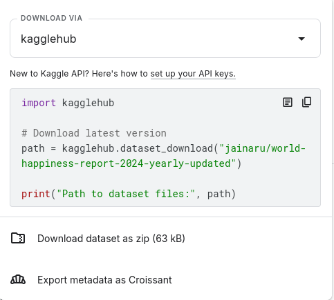
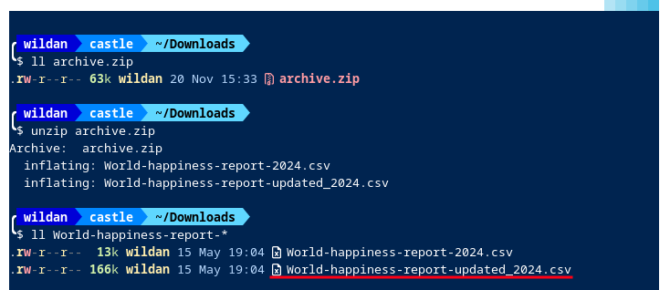
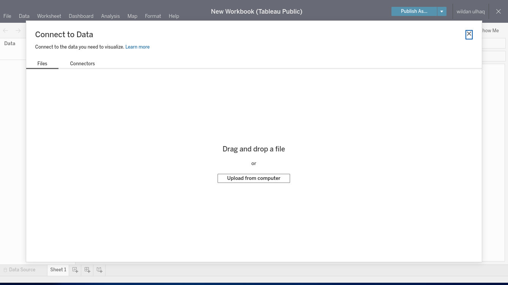
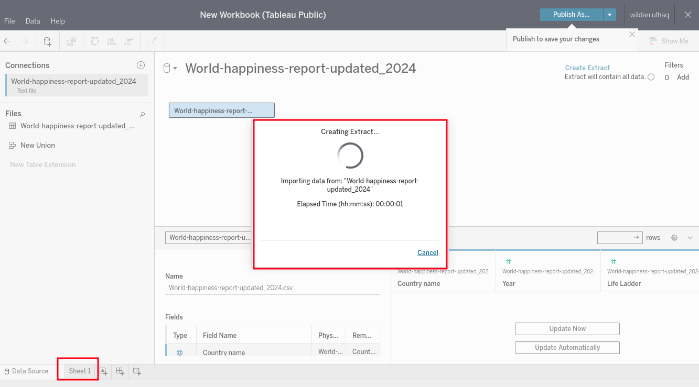
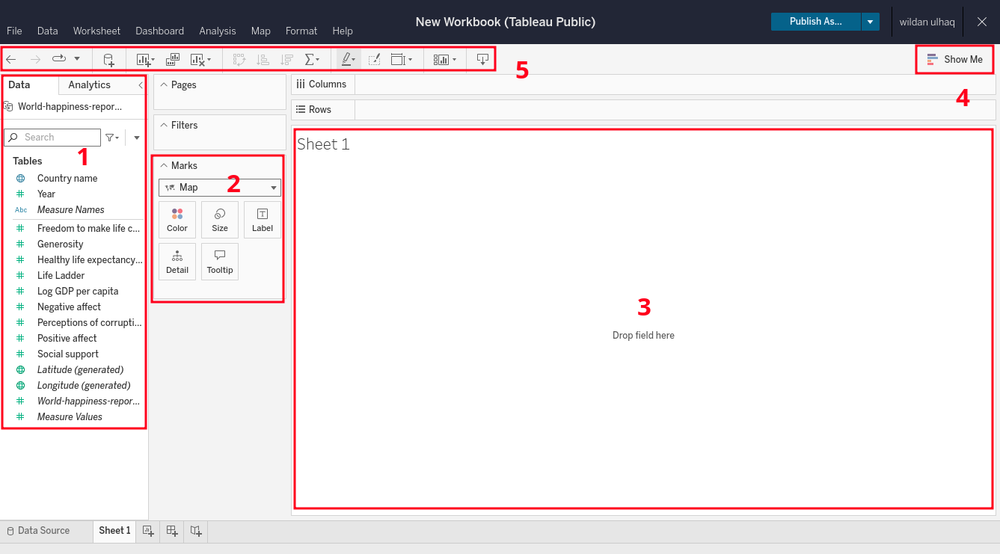
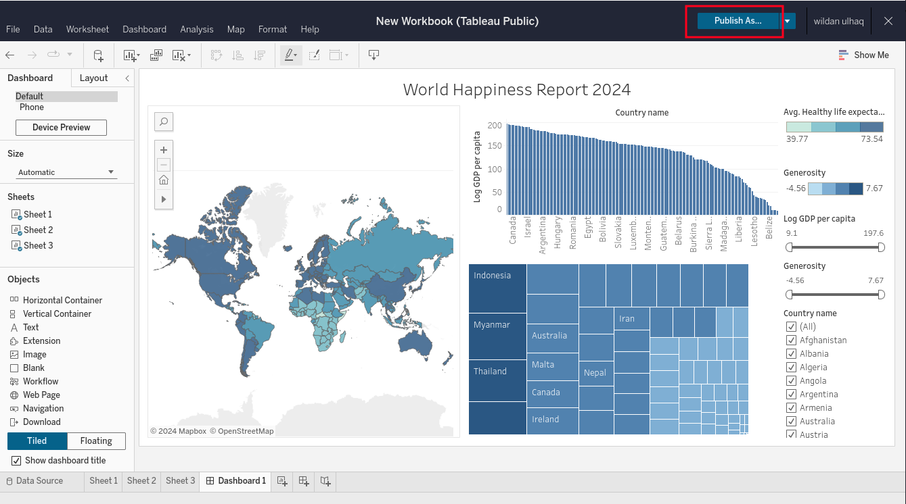

Kali ini, kita akan belajar cara membuat **"*executive dashboard*"** di Tableau. Tapi, sebelum itu, kita terlebih dahulu akan berkenalan dengan 2 istilah, yaitu **dashboard** & **tableau**.

## Apa itu Dashboard?

Dalam *data analytics*, dashboard adalah visualisasi data yang menyajikan data yang komprehensif sehingga memudahkan penggunanya untuk membaca dan menganalisisnya dengan cepat.[^1] Jadi, fungsi utama dashboard / executive dashboard pada dasarnya adalah untuk "merangkum" data-data penting yang dibutuhkan ke dalam satu tampilan visualisasi saja. Dengan demikian, dashboard tersebut memudahkan penggunanya untuk membaca, menganalisis, menggali *insight*, dan pada akhirnya membuat keputusan.

Berikut adalah contoh dashboard **"World Happiness Report 2024"** yang menunjukkan negara paling bahagia berdasarkan tiga parameter, yaitu ***healthy life expectancy***, ***gdp per capita***, dan ***generosity***.

<noscript></noscript><object class='tableauViz'  style='display:none;'><param name='host_url' value='https%3A%2F%2Fpublic.tableau.com%2F' /> <param name='embed_code_version' value='3' /> <param name='site_root' value='' /><param name='name' value='WorldHappinessReport_17330268109590&#47;Dashboard1' /><param name='tabs' value='no' /><param name='toolbar' value='yes' /><param name='static_image' value='https:&#47;&#47;public.tableau.com&#47;static&#47;images&#47;Wo&#47;WorldHappinessReport_17330268109590&#47;Dashboard1&#47;1.png' /> <param name='animate_transition' value='yes' /><param name='display_static_image' value='yes' /><param name='display_spinner' value='yes' /><param name='display_overlay' value='yes' /><param name='display_count' value='yes' /><param name='language' value='en-US' /></object>
                

> **Note:**  
> Fyi, artikel ini akan men-demo-kan cara membuat dashboard tersebut via Tableau.

Contoh dashboard lain:
- https://public.tableau.com/app/discover

## Apa itu Tableau?

Tableau adalah *platform*, *software*, atau *tool* yang digunakan untuk membuat analisis dan visualisasi data. Sebetulnya, alat untuk membuat analisis dan visualisasi data ada banyak, misalnya seperti Power BI, Google Charts, dan lain sebagainya. Tapi, Tableau adalah salah satu yang terbaik diantaranya. Tableau punya software gratis dan berbayar. Nah, diantara versi gratis yang dapat digunakan ada **tableau desktop**, **tableau server & online**, dan **tableau public**. Kita akan menggunakan tableau public untuk membuat dashboard dalam tutorial ini.

## Cara Membuat Dashboard dengan Tableau

### Mengunduh dan Meng-*install* Tableau 

Sebelum mengunduh tableau public, kita perlu membuat akun tableau terlebih dahulu di sini:

https://public.tableau.com/public/apis/auth/signup

Setelah itu, *sofrware*-nya bisa diunduh di tautan berikut:

https://www.tableau.com/products/public/download

> **Note:**  
> Software Tableau hanya kompatibel dengan sistem operasi Windows dan Mac saja. Jadi, tidak ada versi Linux-nya. Bagi pengguna Linux, alternatifnya adalah dengan menggunakan Tableau versi online. 

### Mengunduh Dataset

Dataset yang akan digunakan dalam tutorial ini adalah dataset **World Happiness Report 2024** dari [Kaggle](https://www.kaggle.com/) berikut ini:

https://www.kaggle.com/datasets/jainaru/world-happiness-report-2024-yearly-updated

> Note:  
> Kita perlu login dulu ke Kaggle untuk bisa mengunduh dataset tersebut.

Untuk memudahkan pengunduhan, pilih **"Download dataset as zip"**. Setelah terunduh, silakan di-*extract*.

### Meng-input Dataset ke Tableau

Setelah selesai mengunduh dataset, extract file **`.csv`**-nya, ada 2 file di sana, pilih file **"World-happiness-report-updated_2024.csv"**.

Kemudian upload dataset-nya ke Tableau.

Tampilan awalnya kira-kira akan seperti ini, tapi kita hanya perlu berpindah ke **Sheet 1** dengan mengklik bagian *sheet* tersebut di sebelah bawah kiri, dan akan muncul *pop-up* *loading* seperti ini:

Tunggu beberapa saat hingga terlihat tampilan *Worksheet* dari Tableau seperti berikut:

Untuk sementara, kita hanya perlu familiar dengan 5 bagian yang saya tandai tersebut karena kita hanya akan aktif menggunakan kelima bagian tersebut saja.

Berikut adalah penjelasan singkat setiap bagian tersebut:

1. Tabel-tabel yang terdapat dalam dataset.
2. Manipulasi data / membuat hubungan antar kolom (dengan warna, ukuran huruf, dan lainnya).
3. *Sheet* untuk menampilkan data dalam bentuk visual.
4. Pilihan grafik/chart yang dapat digunakan untuk menampilkan atau memvisualisasi data.
5. *Shortcut tools* untuk memanipulasi sheet dan visualisasi data dalam sheet tersebut.

### Worksheet 1: Membuat Visualisasi "Healthy Life Expectancy"

Sekarang, kita akan mulai membuat dashboard-nya. Untuk bisa menampilkan **Dashboard World Happiness Report** dengan data yang beragam, dalam hal ini, data yang akan ditampilkan adalah data terkait  **"Healthy Life Expectancy"**,  **"GDP per Capita"**, dan  **"Generosity"**, kita perlu membuatnya satu persatu di *worksheet* yang berbeda. Dengan kata lain, kita akan membuat visualisasi data **Healthy Life Expectancy** di *worksheet* pertama, kemudian visualisasi data **GDP per Capita** di *worksheet* kedua, dan visualisasi **Generosity** di *worksheet* ketiga.

Berikut adalah langkah-langkah membuat visualisasi **Healthy life expectancy**:

1. *Drag and drop* tabel **Country name** ke dalam *sheet*.
2. *Drag and drop* tabel **Healthy life expectancy** ke dalam *sheet*.
3. Ubah mode visualisasi menjadi ***maps*** di bagian 4 (Show me).
4. Ubah *parameter* / *measurement* **Healthy life expectancy** dari **"SUM"** ke **"AVG"** di bagian 2.
5. Ubah tingkat gradasi warna menjadi hanya 4 tingkatan dengan klik **"Edit Colors"** di bagian legenda di sebelah kanan *sheet*.

Berikut video tutorialnya:

<iframe
  src="https://player.cloudinary.com/embed/?cloud_name=dpvtbnqf7&public_id=tablue-basic1_lxhmct"
  width="640"
  height="360" 
  style="height: auto; width: 100%; aspect-ratio: 640 / 360;"
  allow="autoplay; fullscreen; encrypted-media; picture-in-picture"
  allowfullscreen
  frameborder="0"
></iframe>

Selesai.

### Worksheet 2: Membuat Visualisasi "GDP per Capita"

Selanjutnya, kita akan membuat visualisasi berdasarkan data **GDP per Capita** di *sheet* yang baru. Untuk membuat *sheet* baru, kita hanya perlu meng-klik icon *sheet* baru (*New Worksheet*) di sebelah **Sheet 1** di bagian bawah sebelah kiri.

Berikut adalah langkah-langkah membuat visualisasi **GDP per Capita**:

1. *Drag and drop* tabel **Country name** ke dalam *sheet*.
2. *Drag and drop* tabel **Log GDP per capita** ke dalam *sheet*.
3. Di bagian 4 (Show me), ganti visualisasi ke dalam bentuk ***bar chart*** atau diagram batang.
4. Klik *shortcut tool* **"Swap Rows and Columns"** di bagian 5 untuk mengubah posisi baris dan kolom *bar chart*-nya.
5. Klik *shortcut tool* **"Short descending ..."** di bagian 5 untuk mengurutkan tampilan data dari yang nilai GDP per Capita tertinggi ke terendah.

Berikut video tutorialnya:

<iframe
  src="https://player.cloudinary.com/embed/?cloud_name=dpvtbnqf7&public_id=tablue-basic2_cjho9z"
  width="640"
  height="360" 
  style="height: auto; width: 100%; aspect-ratio: 640 / 360;"
  allow="autoplay; fullscreen; encrypted-media; picture-in-picture"
  allowfullscreen
  frameborder="0"
></iframe>

Selesai.

### Worksheet 3: Membuat Visualisasi "Generosity"

Sekarang, kita akan membuat visualisasi data **Generosity** di *sheet* yang baru. Langkah-langkahnya hampir mirip dengan langkah-langkah membuat visualisasi sebelumnya, hanya saja kita perlu menyesuaikan visualisasinya.

Berikut adalah langkah-langkah membuat visualisasi **Generosity**:

1. *Drag and drop* tabel **Country name** ke dalam *sheet*.
2. *Drag and drop* tabel **Generosity** ke dalam *sheet*.
3. Di bagian 4 (Show me), ganti visualisasi ke dalam bentuk ***treemaps***.
4. Edit warna legendanya agar hanya memiliki 4 tingkat gradasi berwarna biru.

Berikut video tutorialnya:

<iframe
  src="https://player.cloudinary.com/embed/?cloud_name=dpvtbnqf7&public_id=tablue-basic3_fuvqp3"
  width="640"
  height="360" 
  style="height: auto; width: 100%; aspect-ratio: 640 / 360;"
  allow="autoplay; fullscreen; encrypted-media; picture-in-picture"
  allowfullscreen
  frameborder="0"
></iframe>

:::tip[[Opsional]: Menambahkan Filter 💡]

Untuk keperluan estetika, kita hanya akan menampilkan negara-negara dengan skor **Generosity** yang tinggi (>= 2.5). Berikut adalah langkah-langkah untuk mem-*filter*-nya:

1. Di bagian 2 pada **Country name**, **pilih Filter -> Condition -> By field**.
2. Ganti simbol **Comparison**-nya menjadi lebih dari sama dengan (**>=**) dan ubah **Value**-nya menjadi **2.5**.

:::

Selesai.

### Membuat Dashboard "World Happiness Report"

Pembuatan dashboard adalah bagian paling mudah karena kita hanya akan "mengkompilasi" *worksheet-worksheet* yang sudah kita buat sebelumnya. Nah, kita bisa memilih salah satu dari dua opsi *layout* dashboard, yaitu *layout* **"Tiled"** dan **"Floating"**. Perbedaannya, kalau *layout* Tiled *sheet-sheet* yang ada di dashboard akan otomatis tersusun otomatis sesuai dengan *grid*/*container* yang ada (*vertical* & *horizontal container*). Sementara *layout* Floating membebaskan kita untuk mengatur sendiri *layout* dari dashboard yang ingin ditampilkan. Jadi, tinggal pilih sesuai kebutuhan saja.

Untuk keperluan tutorial ini, saya akan memilih *layout* Tiled agar lebih mudah dan cepat jadi.

Berikut adalah langkah-langkah membuat dashboard **"World Happiness Report 2024"**.
1. Klik menu **Dashboard** -> **New Dashboard**.
2. Ubah ukuran dashboardnya dengan klik bagian **Size**, kemudian ganti "Fixed size" ke **"Automatic"**. 
3. *Drag and drop* 3 *sheets* yang sudah dibuat sebelumnya ke dalam *sheet* dashboard.
4. Hilangkan judul setiap *sheet* dengan cara *un-check* bagian **Title** di opsi masing-masing *sheet*.
5. Tampilkan filter berdasarkan **"nilai"** untuk *sheet* **Log GDP Percapita** & **Generosity**, dan tampilkan filter berdasarkan **"nama negara"** untuk *sheet* **Healthy Life Expectancy**.
6. Tambahkan judul dashboard dengan cara *checklist* **"Show dashboard title"** di bagian bawah sebelah kiri dashboard.

Berikut video tutorialnya:

<iframe
  src="https://player.cloudinary.com/embed/?cloud_name=dpvtbnqf7&public_id=tablue-basic4_mhz9ej"
  width="640"
  height="360" 
  style="height: auto; width: 100%; aspect-ratio: 640 / 360;"
  allow="autoplay; fullscreen; encrypted-media; picture-in-picture"
  allowfullscreen
  frameborder="0"
></iframe>

Selesai.

:::tip[[Opsional]:** Menambahkan Filter *Slicing* 💡]

Berikut adalah langkah-langkah membuat filter *slicing*[^2]:
1. Klik menu **Dashboard** -> **Actions**.
2. Pilih **Add Action** -> **Filter**.
3. Beri nama **Slicing** dan pilih **"Select"** pada bagian **Run action on**.
4. Klik **Ok**.

Berikut video tutorialnya:

<iframe
  src="https://player.cloudinary.com/embed/?cloud_name=dpvtbnqf7&public_id=tablue-basic5_sjraqh"
  width="640"
  height="360" 
  style="height: auto; width: 100%; aspect-ratio: 640 / 360;"
  allow="autoplay; fullscreen; encrypted-media; picture-in-picture"
  allowfullscreen
  frameborder="0"
></iframe>
Selesai

:::

### Publish Dahsboard

Terakhir, jangan lupa klik **Publish** agar dashboardnya tersimpan sekaligus terpublikasi secara online sehingga orang lain juga dapat melihat dashboard yang sudah kalian buat!

Demikian tutorial membuat dashboard menggunakan Tableau!

Terima kasih sudah mampir. Sampai ketemu di artikel-artikal saya yang lain!

[^1]: https://blog.bismart.com/en/what-is-a-dashboard-in-data-analytics-and-business-intelligence
[^2]: https://www.youtube.com/watch?v=d_J2fWqCKgM

