## About `tmux`

`tmux` adalah akronim dari Terminal Multiplexer, yang sebetulnya sudah sangat _self-explanatory_. `tmux` juga merupakan program berbasis CLI (_command line interface_) yang gratis, open source yang memungkinkan penggunanya untuk membuat, mengatur, dan menjaga sesi terminal dari satu layar terminal saja.[^1] 

Cara kerja tmux adalah dengan membuat arsitektur **server-client**. Artinya, ketika kita menjalankan `tmux`, `tmux` akan membuat _background process_ sendiri sebagai server sehingga terminal kita akan terhubung ke `tmux` sebagai client. Karena server-nya berjalan secara independen, _session_ `tmux` akan bertahan (akan tetap ada) meskipun kita menutup terminal kita (seperti kitty, alacritty, ghostty, dll) atau kehilangan koneksi SSH. Untuk terhubung kembali ke tmux, kita hanya perlu _reconnect_ dan _reattach_.

Selain itu, di dalam tmux, ada 3 level hirarki: **Session > Window > Pane**. Sebuah sesi mengelompokkan satu atau lebih window, dan setiap window menempati seluruh layar terminal dan dapat di-_split_ ke banyak pane. Setiap pane akan menjalankan proses shell-nya masing-masing.

Perhatikan ilustrasi berikut agar lebih mudah memahami ketiga level hirarti `tmux` tersebut:

[![tmux 3 level hierarchy. Created with: [excalidraw.com]](../images/tmux/ss1.png)](https://excalidraw.com/?element=twqINaXD8M_8laytnaTKd)

Dalam kenyataannya, nanti bentuk `tmux` adalah seperti ini [**click image to enlage**]:

[![Session, Window, and Pane on tmux. Created with: [excalidraw.com]](../images/tmux/ss13.png)](https://excalidraw.com/?element=6mrlXJCaZFXZBwSftgzXb)

Website dokumentasi resmi `tmux`: https://tmux.app/ 

Repository Github resmi `tmux`:

::github{repo="tmux/tmux"}

## Installation 

Berikut adalah cara meng-_install_ `tmux` di beberapa sistem operasi UNIX/Linux:

|       Distro      |                  Command          |
|       ---         |                   ---             |
| **Debian/Ubuntu** | **`sudo apt install -y tmux`**     |
| **Arch Linux**    | **`sudo pacman -Sy tmux`**         |
| **Fedora**        | **`sudo dnf install tmux`**        |
| **Opensuse**      | **`sudo zypper install tmux`**     |
| **FreeBSD**       | **`sudo pkg install tmux`**        |

:::note

**NixOS:**  
Masukkan baris berikut di file konfigurasi (`/etc/nixos/configuration.nix`):

```nix
  environment.systemPackages = [
    pkgs.tmux
  ];
```

Atau jika menggunakan `nix-shell`:

```shell
nix-shell -p tmux   
```

:::

## Usage

Berikut adalah cara menggunakan `tmux`.

:::info

`Ctrl+b` adalah tombol pemicu utama (_prefix_) di `tmux`.

:::

### Quickstart

#### Starting `tmux`

Untuk menjalankan `tmux`, kita hanya perlu mengetikkan perintah:

```shell
tmux
```

Maka, `tmux` akan membuat sesi baru dengan default nama sesuai urutan angka. Jika kita pertama kali membuka `tmux`, maka `tmux` akan membuat sesi pertama dengan nama 0.

> Kita dapat melihat sesi tmux yang aktif (berikut dengan jumlah window-nya) dengan perintah:
> ```shell
> tmux ls
> ```

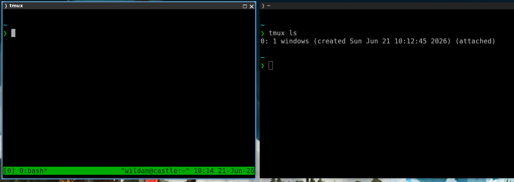

Atau jika kita ingin membuka `tmux` dengan nama sesi yang kita tentukan sendiri:

```shell
tmux new -s nama-sesi
```

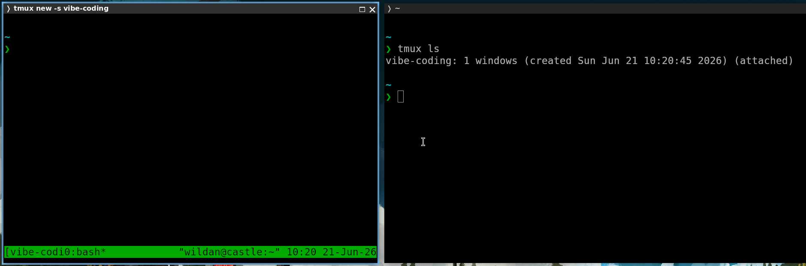

Atau misalnya kita ingin membuat sesi baru `tmux`, tanpa langsung memasukinya:

```shell
tmux new -d # untuk membuat sesi baru dengan nama default (menggunakan angka)
tmux new -s nama-sesi -d # untuk membuat sesi baru dengan nama custom
```

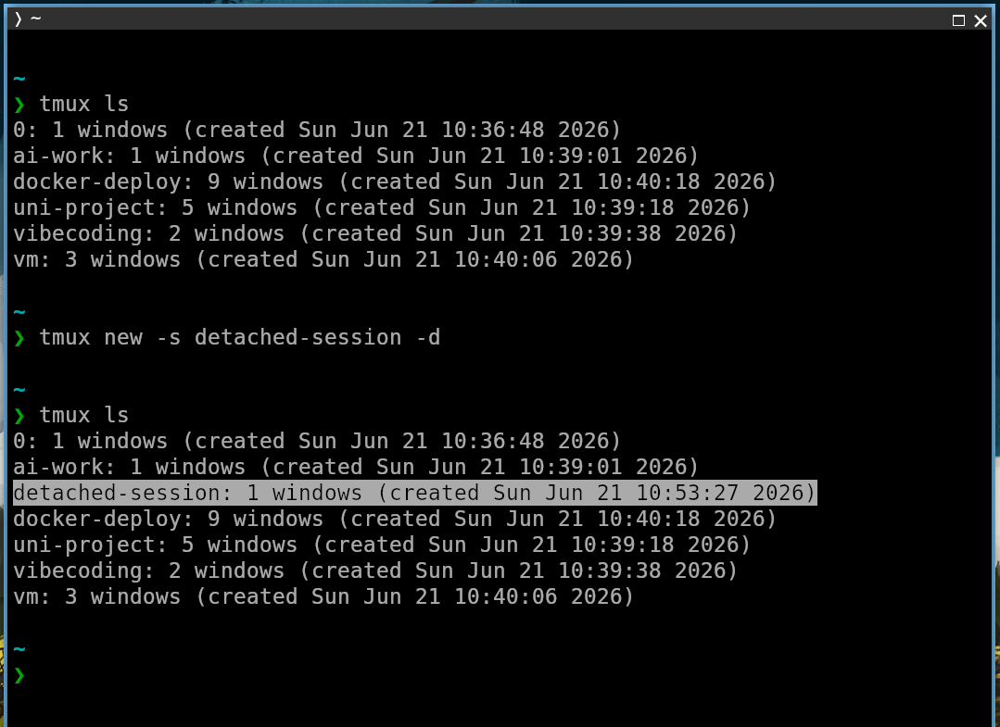

#### Splitting Window

2 cara men-_split_ window atau membuat panes di `tmux`: **vertikal** dan **horizontal**.

**1. Split vertically**

Berikut adalah _keybinding_ untuk men-_split_ window `tmux` secara vertikal.

```shell
Ctrl+b %
```

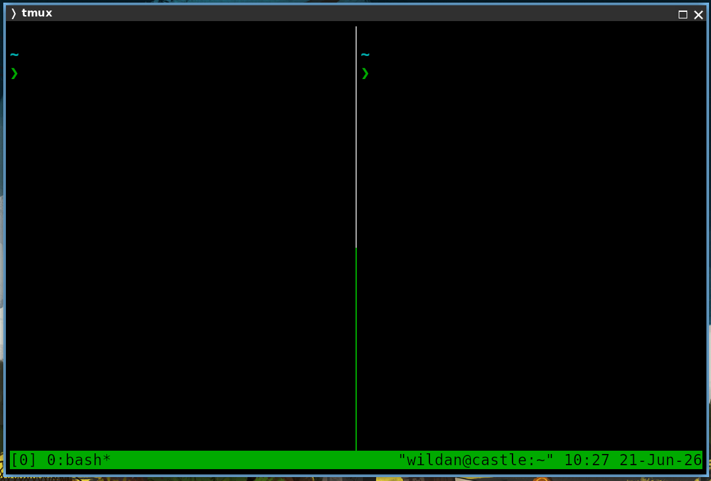

**2. Split horizontally**

Berikut adalah _keybinding_ untuk men-_split_ window `tmux` secara horizontal.

```shell
Ctrl+b "
```

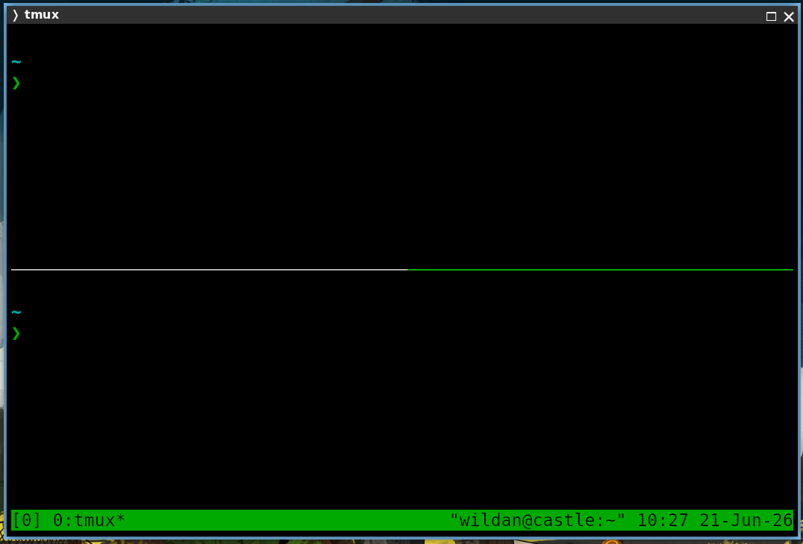

#### Panes Navigation

Cara berpindah antar panes:

```shell
Ctrl+b → # ke pane yang ada di kanan
Ctrl+b ← # ke pane yang ada di kiri
Ctrl+b ↑  # ke pane yang ada di atas
Ctrl+b ↓ # ke pane yang ada di bawah
```

#### Detaching Session

Ketika `detach` (keluar dari `tmux`), sesi `tmux` yang kita tinggalkan akan tetap ada.

```shell
Ctrl+b d
```

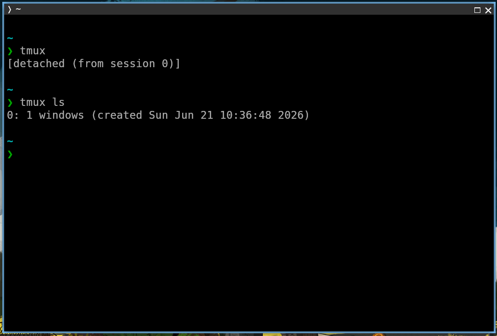

#### Listing Sessions

Kita juga bisa melihat daftar `tmux` _session_ yang aktif dengan perintah berikut:

```shell
tmux ls
```

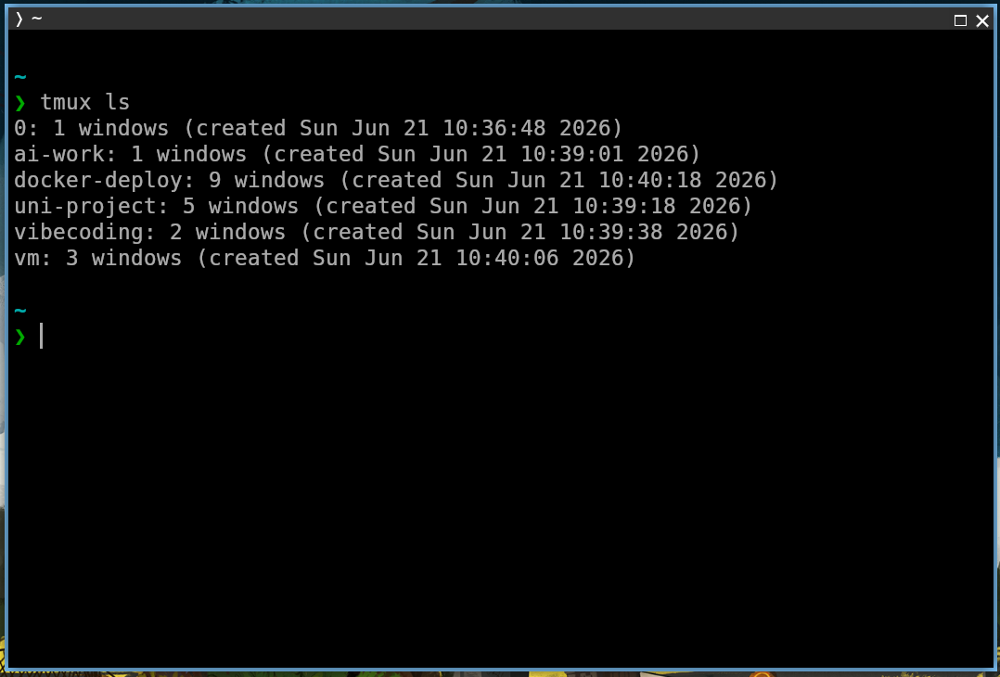

#### Attaching Session

Ketika sudah _detach_, dan kita ingin masuk lagi ke sesi `tmux` tertentu, gunakan perintah:

```shell
tmux attach -t nama-sesi
```

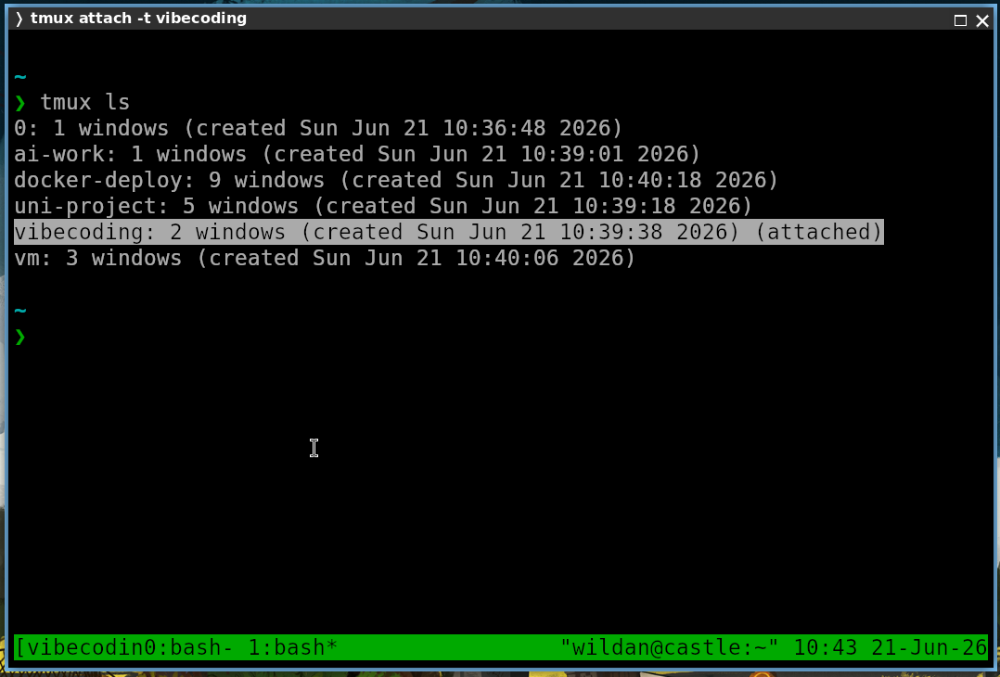

#### Renaming Session

Kita juga bisa mengganti nama sesi `tmux` yang sudah kita buat sebelumnya:

```shell
tmux rename session -t nama-lama nama-baru
```

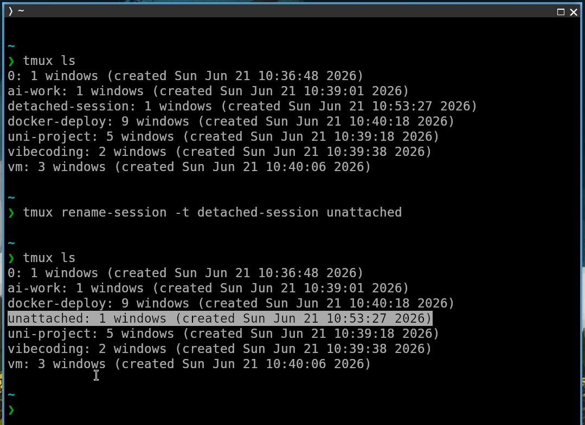

#### Deleting Session

Untuk menghapus sesi tertentu:

```shell
tmux kill-session -t nama-sesi
```

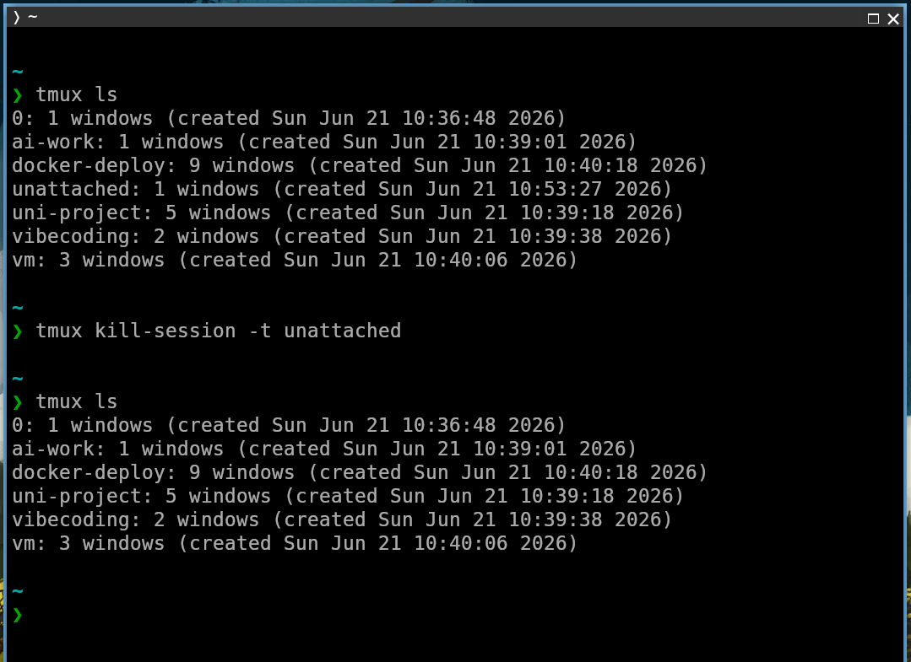

#### Kill All

Untuk menghapus semua sesi `tmux`:

```shell
tmux kill-server
```

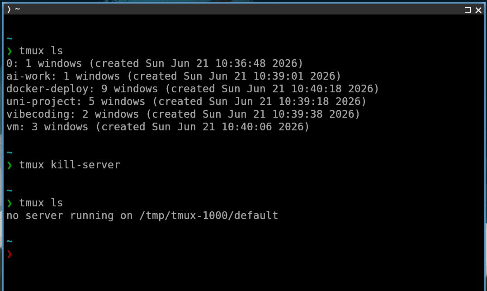

### Extra

Berikut adalah penggunaan `tmux` yang lebih lanjut (_advanced_).

#### Creating Window

Di dalam `tmux`, kita dapat membuat window baru:

```shell
Ctrl+b c
```

#### Renaming Window

Kita juga bisa mengganti nama window di `tmux`:

```shell
Ctrl+b ,
```

#### Window Chooser

Jika kita punya banyak window dan ingin berpindah-pindah window, kita bisa memilihnya dengan perintah:

```shell
Ctrl+b w
```

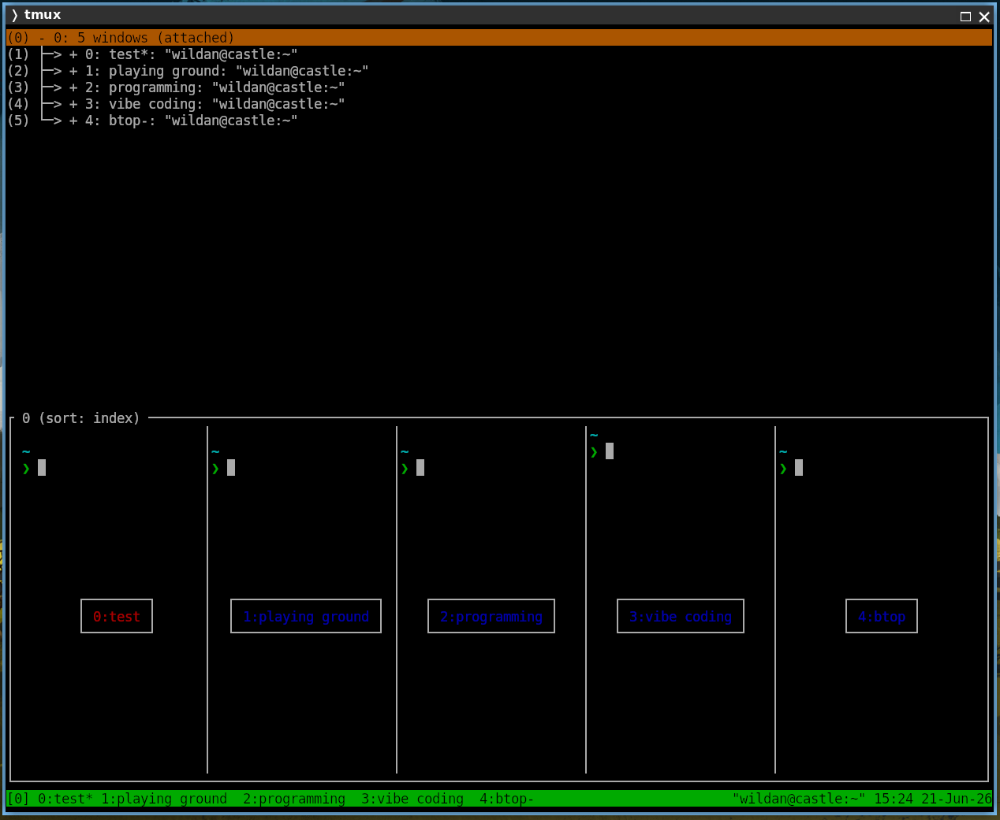

Atau langsung dengan nomor identifikasi masing-masing window-nya:

```shell
Ctrl+b 0-9
```

#### Panes Numbering

Jika kita punya banyak panes, kita bisa melihat atau mengidentifikasi setiap pane dengan nomornya:

```shell
Ctrl+b q
```

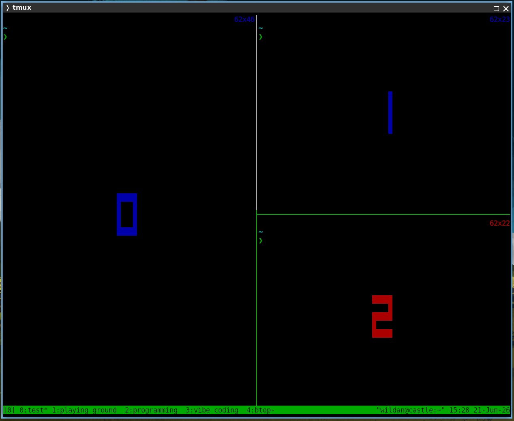

#### Panes Resizing

Kita juga bisa mengatur ukuran setiap pane secara manual:

```shell
Ctrl+b → # `Ctrl+b` sambil ditahan, untuk memperbesar pane ke kanan
Ctrl+b ← # `Ctrl+b` sambil ditahan, untuk memperbesar pane ke kiri
Ctrl+b ↑ # `Ctrl+b` sambil ditahan, untuk memperbesar pane ke atas
Ctrl+b ↓ # `Ctrl+b` sambil ditahan, untuk memperbesar pane ke bawah
```

#### Pane Zooming

Terkadang, jika jumlah pane terlalu banyak, maka ukurannya akan semakin kecil. Kita dapat memperbesar (membuatnya jadi sebesar layar terminal) dengan perintah berikut:

```shell
Ctrl+b z
```

Untuk mengembalikannya ke ukuran semula, kita dapat menggunakan perintah yang sama.

#### Panes Layouting

Kita juga bisa mengganti-ganti layout pane:

```shell
Ctrl+b [Space]
```

#### Copy Mode

Kita bisa memasuki **copy mode** di `tmux`, dan ini adalah mode yang sangat bermanfaat bagi pengguna `tmux`, karena kita dapat melakukan banyak hal di mode ini, seperti _scrolling_, _copy selection_, paste, _search_, dan lain-lain. 

Mengapa hal-hal tersebut (yang terdengar biasa aja) jadi spesial? Karena di tmux, pada dasarnya, kita tidak bisa melakukan semua itu kecuali jika kita masuk ke **copy mode**.

Untuk masuk ke **copy mode**:

```shell
Ctrl+b [
```

Sekarang, kita dapat melakukan banyak hal berikut:

**1. Navigasi / _Scrolling_**

Kita bisa menggerakkan kursos di mode ini melalui tombol-tombol berikut di keyboard:

```shell
h # ke kiri
l # ke kanan
j # ke bawah
k # ke atas
```

Atau bisa juga dengan tombol arrow di keyboard.

Jika kita ingin _scrolling_ yang lebih cepat:

```shell
PgUp # scroll ke atas
PgDown # scroll ke bawah
```

**2. Selecting**

Untuk mulai menyeleksi teks:

```shell
v
```

**3. Copying**

Untuk meng-_copy_ teks yang sudah terseleksi:

```shell
[Enter]
```

**4. Pasting**

Untuk mem-_paste_ teks yang sudah tercopy:

```shell
Ctrl+b ]
```

**5. Searching**

Kita juga bisa mencari keyword tertentu yang ada di dalam pane pada mode ini:

```shell
/ # search forward
? # search backward
```

:::info

Untuk keluar dari **copy mode**, tekan tombol **`q`** di keyboard.

:::

#### Pop-up Window

Kita juga bisa menampilkan pop-up window di tengah-tengah workflow `tmux` kita.[^2]  
Caranya, kita masuk ke mode perintah terlebih dahulu:

```shell
Ctrl+b :
```

Kemudian masukkan baris berikut:

```shell
display-popup
```

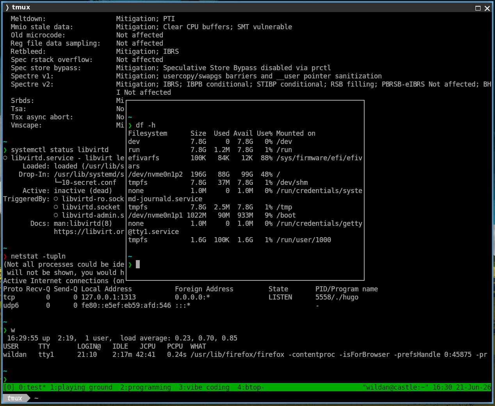

### Config File

File konfigurasi `tmux` biasanya ada di home folder (`~/.tmux.conf`).  
Kita bisa isi dengan berbagai konfigurasi yang kita inginkan. Misalnya, berikut ini adalah isi file konfigurasi `tmux` saya:

```shell
# Mengubah warna latar belakang dan teks status bar
set -g status-bg green    # Warna latar belakang status bar (gunakan kode warna atau nama warna)
set -g status-fg black    # Warna teks di status bar

set -g status-style "bold"

#set -g status-right "%H:%M"  # Hanya menampilkan waktu
set -g status-right "#(whoami)@#H | #(pwd) " 

set-option -g pane-active-border-style "fg=blue" # Warna garis pembatas aktif

bind-key T display-popup -E
```

:::note

Artikel ini belum membahas `tmux` secara komprehensif, masih banyak fitur `tmux` yang tidak di-_cover_ dalam artikel ini. Oleh karena itu, jika kalian tertarik untuk mengetahui `tmux` lebih dalam, silakan kunjungi dokumentasi official mereka. Semua catatan tentang `tmux` dapat kalian explorasi lebih lanjut di:

> https://tmux.app/doc/

:::

Terima kasih sudah mampir.  
Ada kritik dan saran untuk artikel ini atau web ini secara keseluruhan? Tinggalkan komentar di bawah ya!


[^1]: https://tmux.app/doc/
[^2]: https://tmuxai.dev/tmux-popup/