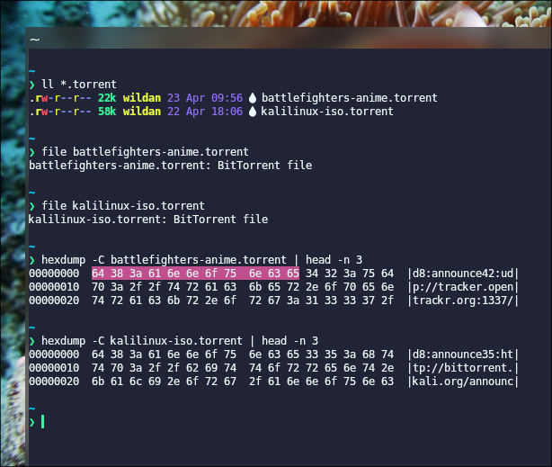
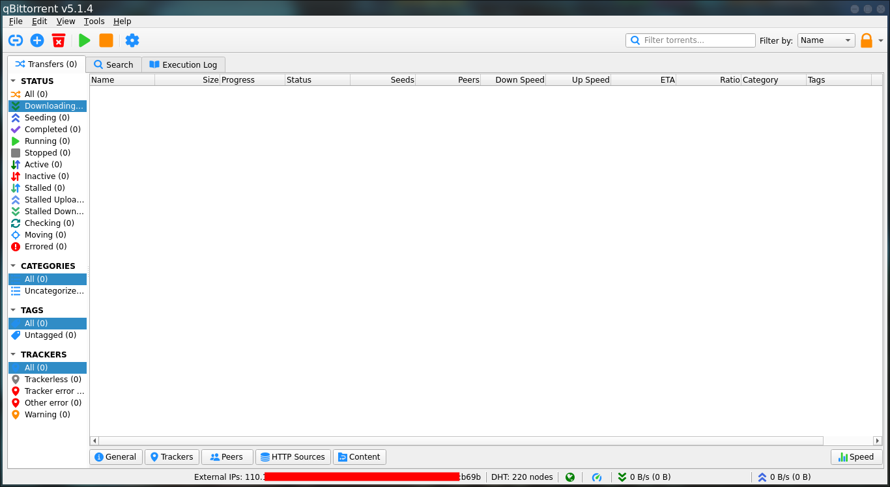
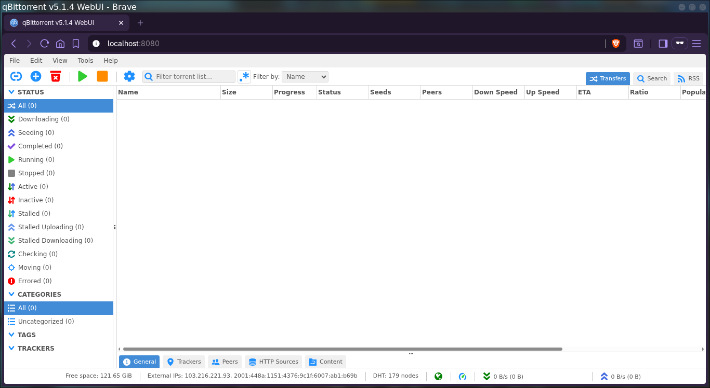
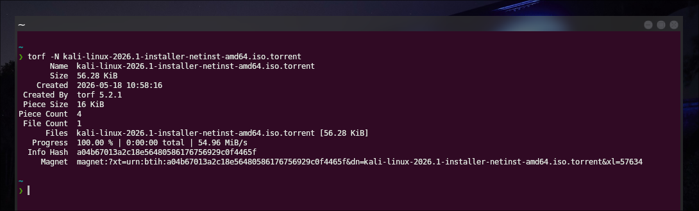
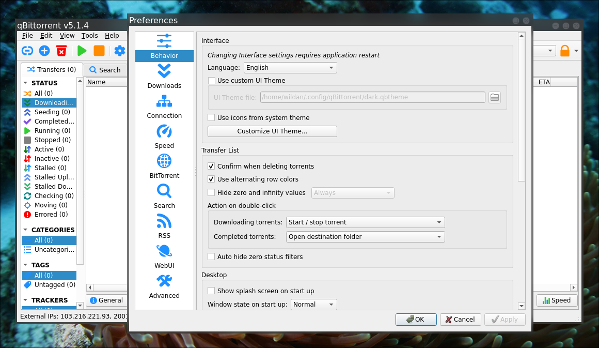
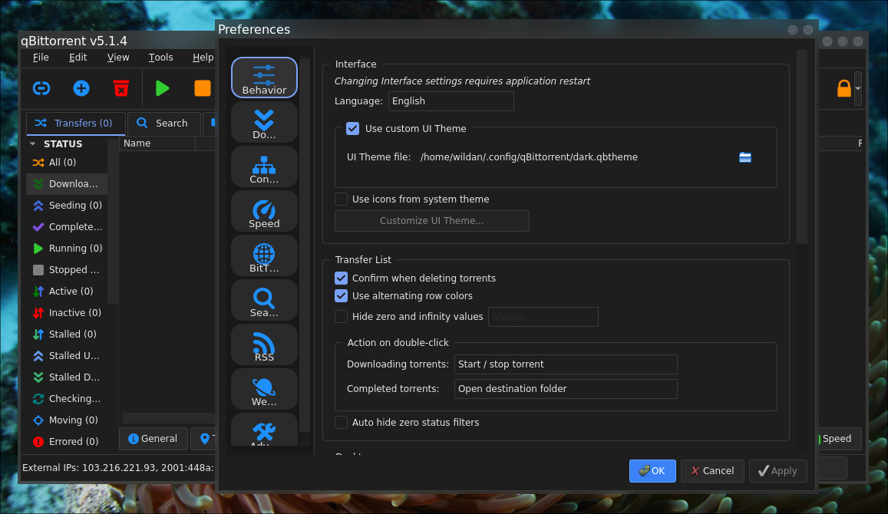
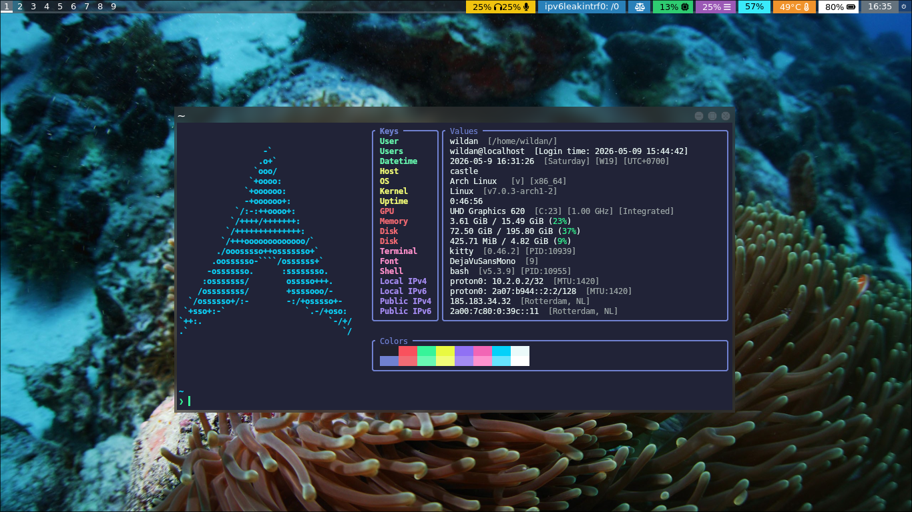

## Getting to Know

### Preface

Pernahkah kalian menyadari bahwa sebetulnya, banyak hal di internet dapat dipahami dengan men-simplifikasi cara kerjanya dengan melihatnya sebagai **server-client**. Analoginya mirip seperti ketika kita ingin membeli makanan: Penjual makanannya adalah **_server_** dan kita sebagai pelanggan atau pembelinya adalah **_client_**. Begitupula ketika kita berselancar di internet, misalnya ketika akan menonton video Youtube, membacara artikel, termasuk men-_download_ file.

Ketika akan mengunduh suatu file dari internet, katakanlah file artikel jurnal, maka mekanisme server-client akan bekerja. Server-nya adalah website jurnal itu sendiri, sementara client-nya adalah kita (atau secara teknis, browser yang kita gunakan untuk membuka website tersebut). Mekanisme tersebut adalah mekanisme yang paling populer digunakan di internet hingga saat ini. 

Namun, seiring berjalannya waktu, ukuran file semakin besar, terutama file video, image (iso), dan lain sebagainya. Di saat yang sama, peningkatan ukuran file tersebut tidak selalu diimbangi oleh peningkatan kecepatan internet, setidaknya di beberapa wilayah. Apalagi, pertumbuhan jumlah pengguna internet juga semakin banyak. Oleh karena itu, dalam konteks tersebut, mekanisme server-client mulai dianggap tidak efisien dan efektif sehingga orang-orang mulai mencari mekanisme lain yang dianggap lebih baik: **P2P _network_**.


### What is Torrent(ing)?

_Torrenting_ adalah cara untuk men-_download_ (dan disaat yang sama juga mendistribusikan) file melalui jaringan P2P (_peer-to-peer_) menggunakan **file torrent** (.torrent) atau **magnet links**. File torrent itu semacam catatan alamat (metadata) yang menunjukkan dimana file atau bagian-bagian file tersebut berada di dalam jaringan. Sementara itu, magnet link adalah tautan yang langsung berisi hash (identitas unik file) untuk mencari data di jaringan. Dengan mengunduh dari dari "peer" lain yang ada di jaringan tersebut, proses _download_ file berukuran besar akan menjadi lebih cepat.[^1] 

:::info

**Torrent file (.torrent) signature:**[^2] 
`64 38 3A 61 6E 6E 6F 75 6E 63 65`  
Beberapa contoh file signature **.torrent**:  


:::

Saya sudah menulis tentang "file signature" di artikel berikut:  

[[/tech/filesig/]]  

#### P2P Network

Sebelum melangkah lebih jauh, alangkah lebih baiknya jika kita berkenalan dengan jaringan P2P terlebih dahulu. P2P Network atau Jaringan Peer-To-Peer adalah mekanisme/metode/model lain yang digunakan oleh komputer untuk dapat terhubung dengan komputer lainnya. Seperti yang sudah saya singgung di bagian "Preface" artikel ini, jaringan komputer yang cukup populer adalah **Server-Client**. Namun, ada jenis model jaringan komputer yang lain, yaitu **P2P**. 

Pada dasarnya, perbedaan utama antara model server-client dengan P2P dapat terlihat dari kedudukan suatu perangkat terhadap perangkat lainnya di dalam jaringan. Jika model server-client memiliki pusat kontrol (server), maka model P2P tidak memiliki pusat kontrol karena setiap perangkat dapat berperan sebagai penyedia layanan (_server_) dan pengguna layanan (_client_) di saat yang bersamaan. Dengan kata lain, model server-client dibangun berdasarkan ide **sentralisasi**, sementara model P2P dibangun atas ide **desentralisasi**.[^3]

Berikut ilustrasi perbedaan keduanya:

[![Server-Client model vs P2P model. Source: [systemdesignschool.io]](../images/torrent/ss2.png)]()

Seperti kita ketahui, banyak protokol (aturan komunikasi) yang terdapat dalam jaringan server-client (seperti SSH, HTTP/S, SMB, etc). Begitupula dalam jaringan P2P, terdapat banyak protokol yang tersedia, salah satunya adalah protokol **BitTorrent**.

> **Daftar protokol P2P**: https://en.wikipedia.org/wiki/List_of_P2P_protocols

#### BitTorrent Protocol

BitTorrent adalah adalah salah satu protokol di jaringan P2P yang ditujukan untuk mentrasfer file.[^4] Beberapa terminologi dasar yang diperlukan untuk memahami cara kerja protokol ini, antara lain:[^5]

- **Web Server:** Server penyedia file torrent (.torrent) atau magnet link (seperti [PirateBay](https://thepiratebay.org/index.html), [1337x](https://www.1377x.to/), [LimeTorrents](https://www.limetorrents.fun/), dan lain sebagainya). 
- **Tracker:** Server yang mengkoordinasikan _peers_ di dalam jaringan (tidak ada kaitannya dengan file/folder yang akan didistribusikan).  
- **Peers:** Seluruh perangkat atau komputer yang terdapat di dalam jaringan, dapat berupa _leechers_ atau _seeders_.
    - **Leechers:** Perangkat atau komputer di dalam jaringan yang mengunduh file (atau bagian-bagian file).
    - **Seeders:** Perangkat atau komputer yang di dalam jaringan yang memiliki file utuh.

Artinya, semakin banyak _seeders_ (pemilik file utuh/penyedia file) di dalam jaringan, maka semakin cepat proses _download_ file yang dilakukan oleh _leechers_.

:::info

Secara spesifik, berikut adalah diagram struktur dan alur kerja perangkat atau komputer pada protokol BitTorrent:

[![BitTorrent Protocol. Source: [ResearchGate]](../images/torrent/ss3.png)](https://www.researchgate.net/publication/225633414_Modeling_energy_efficiency_of_file_sharing)

Keterangan: 
1. **_Leecher_** men-_download_ file torrent (.torrent) dari **_Web Server_**.
2. Dalam proses pencarian file, **_Leecher_** akan menghubungi **_Tracker_**. 
3. **_Tracker_** akan  memberi daftar **_Peers_** di dalam jaringan.
4. **_Leecher_** mulai men-_download_ file dari **_Peers_** yang menyediakan file-nya (**_Seeders_**)

:::

### Legality

Meskipun aktivitas _torrenting_ memang erat kaitannya dengan tindakan ilegal karena membagikan konten curian. Namun, pada dasarnya, seperti yang sudah diterangkan pada bagian sebelumnya, BitTorrent hanyalah sebuah protokol yang dibuat untuk menyelesaikan masalah transfer file, terutama yang berukuran lebih besar sehingga prosesnya menjadi lebih cepat dan efisien. Oleh karena itu, tidak semua file yang didistrisikan di BitTorrent adalah konten ilegal (tidak resmi). Misalnya, banyak file image (.iso) Linux didistribusikan secara P2P melalui BitTorrent. 

[![KaliLinux .iso is available in .torrent file. **Source:** [Kali Linux Official Website]](../images/torrent/ss4.png)](https://www.kali.org/get-kali/#kali-installer-images)

Bagaimana cara mengidentifikasi apakah file tersebut resmi atau tidak? Tentu saja cara yang paling mudah adalah dengan melihat lisensi file tersebut. Secara umum, misalnya, file-file video seperti film, buku, dan sejenisnya adalah jenis file yang ber-copyright alias ilegal jika didistribusikan tanpa izin resmi. Namun, seperti yang saya singgung sebelumnya, file-file image (.iso) Linux umumnya memang bebas disebarluaskan karena Linux sendiri berlisensi _open source_.

Jadi, **_torrenting_ adalah aktivitas legal**, selama tidak digunakan untuk men-_download_ konten-konten atau file-file yang ber-_copyright_ atau melanggar hukum.[^1]

### Privacy & Security

Beberapa efek samping dari melakukan kegiatan _torrenting_ di internet, terutama yang terkait dengan privasi dan keamanan digital antara lain:

1. ISP (_Internet Service Provider_) dapat melihat aktivitas _torrenting_ kita.
2. _Peers_ dalam jaringan dapat melihat IP Address kita.
3. File yang diunduh bisa saja mengandung virus atau _malware_.

Ketika ISP tau kita sedang melakukan _torrenting_, yang mana memerlukan _bandwith_ yang besar, bisa saja mereka membatasi kecepatan internetnya sehingga proses _download_-nya menjadi lambat. Selain itu, mereka juga dapat merekam data terkait aktivitas _torrenting_ kita, yang dapat kapan saja diberikan kepada pihak berwajib nanti jika diperlukan.

Peers (baik _leechers_ maupun _seeders_) juga dapat melihat _IP Adress_ kita. Hal ini menjadi berbahaya karena kita tidak pernah tahu apakah ada orang-orang yang mengintai kita di balik layar sana. Jika mereka adalah orang jahat, maka kita bisa saja menjadi target serangan kemanan digital di internet.

Mengunduh file yang disusupi virus atau _malware_ tentu saja juga perlu menjadi perhatian agar kita lebih berhati-hati dalam _torrenting_. Jika file yang kita unduh sudah disusupi _malware_, maka besar kemungkinan komputer kita sudah dimiliki oleh orang lain (di-_hack_).

#### Solution

Salah satu solusi yang paling praktis untuk mengamankan privasi kita adalah dengan menggunakan VPN. Tapi, kita juga perlu memilah-memilih VPN yang akan kita gunakan, sebab, tidak sedikit VPN yang hari ini juga mencuri data pelanggannya.

Saya sendiri menggunakan `proton-vpn-cli`.  
Untuk instalasi dan penggunaannya, silakan baca di sini:
  
[[/tech/protonvpn/]]

## Installation

Beberapa _software_ yang dapat digunakan untuk melakukan _torrenting_:[^6]

1. **qbittorrent:** https://www.qbittorrent.org/  
::github{repo="qbittorrent/qBittorrent"}

2. **transmission:** 
- Official Website: https://transmissionbt.com/
::github{repo="transmission/transmission"}

3. **deluge:** 
- Official Website: https://deluge-torrent.org/
::github{repo="deluge-torrent/deluge"}

Ketiganya adalah _software_ _open source_ dan gratis serta tidak mengandung iklan di dalamnya. Saya pribadi menggunakan **qbittorrent**, karena menurut saya itulah BitTorrent _software_ yang paling populer saat ini. Salah satu keunggulannya menurut saya dibandingkan yang lain adalah dia memiliki banyak fitur yang berguna. Kita akan bahas di bagian berikutnya.

Berikut adalah cara meng-_install_ `qbittorrent` di beberapa sistem operasi Linux:

|       Distro      |                  Command                                  |
|       ---         |                   ---                                     |
| **Debian/Ubuntu** | **`sudo apt install -y qbittorrent qbittorrent-nox`**     |
| **Arch Linux**    | **`sudo pacman -Sy qbittorrent qbittorrent-nox`**         |
| **Fedora**        | **`sudo dnf install qbittorrent`**                        |
| **Opensuse**      | **`sudo zypper install qbittorrent qbittorrent-nox`**     |

:::note

**NixOS:**  
Masukkan baris berikut di file konfigurasi (`/etc/nixos/configuration.nix`):

```nix
  environment.systemPackages = [
    pkgs.qbittorrent 
    pkgs.qbittorrent-nox
  ];
```

Atau jika menggunakan `nix-shell`:

```shell
nix-shell -p qbittorrent qbittorrent-nox
```

:::

> **Notes:**  
> `qbittorent` adalah package untuk QBitTorrent versi GUI.  
> `qbittorrent-nox` adalah package untuk QBitTorrent versi Web.  

## Usage

### `qbittorent` UI

Berikut adalah penampakan `qbittorrent`:



Seperti terlihat, setidaknya ada 3 bagian penting yang ingin saya _highlight_ pada UI (_User Interface_) `qbittorrent` ini:

1. **Menu bar**: Berada di bagian paling atas (File, Edit, View, Tools, Help). 
2. **Tool bar**: Berada di bawah Menu bar, terdapat icon-icon unik yang berwarna.
3. **Dashboard**: Bagian paling besar di tengah. Ada 3 menu utama:
    - **Transfers**: Menampilkan informasi mengenai proses _downloading_ dan _seeding_. Beberapa menu lain dalam bagian ini bisa kita lihat dan eksplorasi ada di bagian kiri (Status, Categories, Tags, Trackers) dan bagian bawah (General, Trackers, Peers, HTTP Source, Content, Speed).
    - **Search**: Menampilkan hasil pencarian file torrent. Perlu _install_ plugin.
    - **Execution Log**: Menampilkan log (catatan proses operasi yang terjadi di `qbittorrent`).

Selain itu, di bagian bawah, aplikasi ini juga menampilkan _IP Address_ kalian (baik IPv4 maupun IPv6), berikut dengan kecepatan internet yang kalian miliki (_upload_ & _download_).

Menurut saya, fitur paling menarik dari `qbittorrent` versi desktop ini adalah fitur **"lock"**-nya. Melalui fitur tersebut, kita dapat mengunci aplikasi `qbittorrent` desktop ini. Nanti, window-nya akan ter-_minimize_ sehingga kalau kita ingin membukanya kembali, kita akan diminta _password_. Tentu saja, sebelum menggunakan fitur ini, kita perlu membuat password-nya terlebih dahulu. Berikut demonstrasi penggunaan fitur ini:

<script src="https://fast.wistia.com/player.js" async></script><script src="https://fast.wistia.com/embed/i2544ncu2k.js" async type="module"></script><style>wistia-player[media-id='i2544ncu2k']:not(:defined) { background: center / contain no-repeat url('https://fast.wistia.com/embed/medias/i2544ncu2k/swatch'); display: block; filter: blur(5px); padding-top:56.04%; }</style> <wistia-player media-id="i2544ncu2k" seo="false" aspect="1.7843866171003717"></wistia-player>

### `qbittorent-nox` UI

Berikut adalah penampakan `qbittorrent-nox`:



`qbittorrent-nox` adalah versi `qbittorrent` yang diakses melalui Web. Oleh karena itu, seperti teman-teman lihat, saya membukanya melalui web browser ([Brave](https://brave.com/)). Secara default, `qbittorrent-nox` dapat diakses di port 8080, dengan _username_ & _password_ yang disediakan ketika kita menjalankannya melalui terminal. Berikut adalah demonstrasi penggunaan `qbittorrent-nox`:

<script src="https://fast.wistia.com/player.js" async></script><script src="https://fast.wistia.com/embed/0ywqdxtqzk.js" async type="module"></script><style>wistia-player[media-id='0ywqdxtqzk']:not(:defined) { background: center / contain no-repeat url('https://fast.wistia.com/embed/medias/0ywqdxtqzk/swatch'); display: block; filter: blur(5px); padding-top:56.04%; }</style> <wistia-player media-id="0ywqdxtqzk" seo="false" aspect="1.7843866171003717"></wistia-player>

Secara fungsi tidak ada bedanya dengan `qbittorrent` versi desktop. Hanya saja, terdapat fitur yang secara kasat mata bisa langsung kita identifikasi tidak ada di `qbittorrent-nox`, tapi ada di `qbittorrent` biasa, yaitu fitur **"lock"**-nya. Itulah mengapa tadi saya sempat katakan bahwa fitur tersebut adalah fitur yang menarik. Namun, keunggulan `bittorrent-nox` adalah, dia dapat diakses melalui web, artinya, kita bisa berbagi aplikasi ini kepada orang-orang yang kita inginkan di dalam jaringan, dan tetap aman, karena memerlukan akses ke kredensial (_username_ & _password_) ketika ingin membukanya.

### Torrenting

Sekarang, saya akan mendemonstrasikan cara menggunakan `qbittorrent` untuk _torrenting_, baik menggunakan file torrent (.torrent) maupun dengan magnet link. 

#### Torrent File (.torrent )

Untuk file torrent (.torrent) yang akan saya gunakan adalah file torrent iso Kali Linux yang saya dapatkan dari Website Resmi Kali Linux di alamat ini: 

https://cdimage.kali.org/kali-2026.1/kali-linux-2026.1-installer-netinst-amd64.iso.torrent

:::note

Sebetulnya, kita bisa inspeksi isi file torrent (.torrent) tersebut dengan _tool_ [`torf-cli`](https://github.com/rndusr/torf-cli). Dengan perintah tersebut, kita dapat mengetahui bahwa file torrent (.torrent) mengandung informasi penting, seperti **hash** dan juga sebetulnya ada **manget link**-nya.

Perintahnya: 

`torf -N https://cdimage.kali.org/kali-2026.1/kali-linux-2026.1-installer-netinst-amd64.iso.torrent`

Outputnya:  

  

:::

> **Notes:**  Untuk alasan kemudahan, saya akan gunakan `qbittorrent`.

Berikut langkah-langkahnya:
1. Buka aplikasi `qbittorrent`.
2. Klik icon "Plus" (Add Torrent File) untuk menambahkan file torrent.
3. Pilih file torrent (.torrent) yang sudah di-_download_ sebelumnya. Klik "Open".
4. Muncul Window baru. Perhatikan lokasi tempat file-nya akan disimpan. Klik "Ok".

Berikut demonstrasinya:

<script src="https://fast.wistia.com/player.js" async></script><script src="https://fast.wistia.com/embed/x33i2chukg.js" async type="module"></script><style>wistia-player[media-id='x33i2chukg']:not(:defined) { background: center / contain no-repeat url('https://fast.wistia.com/embed/medias/x33i2chukg/swatch'); display: block; filter: blur(5px); padding-top:56.04%; }</style> <wistia-player media-id="x33i2chukg" seo="false" aspect="1.7843866171003717"></wistia-player>

Perhatikan, ketika proses _download_ sedang berjalan, kita bisa melihat-lihat informasi dari menu-menu yang ada, terutama di bagian bawah:
- **General:** Menampilkan informasi tentang file yang di-_hover_. 
- **Trackers**: Menampilkan informasi tentang Trackers di jaringan.
- **Peers**: Menampilkan informasi _peers_ (_leechers_ & _seeders_) di jaringan.
- **HTTP Sources**: Menampilkan informasi sumber filenya.
- **Content**: Menampilkan informasi progress file yang sedang di-_download_.
- **Speed**: Menampilkan informasi mengenai kecepatan internet kita (_upload_ & _download_).    


:::warning[Perhatikan!]

Ketika menampilkan menu **Peers**, di sana terlihat beberapa informasi peers (_seeders_ & _leechers_) yang terkait dengan file iso Kali Linux yang sedang kita unduh ini. Informasi yang ditampilkan bahkan cukup detail, mulai dari:
- Asal negara
- IP _address_ & port
- Koneksi yang digunakan
- Software yang digunakan
- etc

Oleh karena itu, agar IP _address_ kita tidak mudah diketahui oleh _peers_, alangkah baiknya kita menggunakan VPN terlebih dahulu sebelum melakukan _torrenting_. 

:::

#### Magnet Link

Untuk magnet link yang akan saya gunakan adalah magnet link iso Arch Linux yang saya dapatkan dari Website Resmi Arch Linux di alamat ini: 

magnet:?xt=urn:btih:157e0a57e1af0e1cfd46258ba6c62938c21b6ee8&dn=archlinux-2026.04.01-x86_64.iso

:::note

Untuk alasan kemudahan, saya akan gunakan `qbittorrent`.

:::

Berikut langkah-langkahnya:
1. Buka aplikasi `qbittorrent`.
2. Klik icon "Link" (Add Torrent Link) untuk menambahkan magnet link.
3. Paste-kan magnet link Arch Linux iso yang ada di atas. Klik "Download".
4. Muncul Window baru. Perhatikan lokasi tempat file-nya akan disimpan. Klik "Ok".

Berikut demonstrasinya:

<script src="https://fast.wistia.com/player.js" async></script><script src="https://fast.wistia.com/embed/d0bny47yta.js" async type="module"></script><style>wistia-player[media-id='d0bny47yta']:not(:defined) { background: center / contain no-repeat url('https://fast.wistia.com/embed/medias/d0bny47yta/swatch'); display: block; filter: blur(5px); padding-top:56.04%; }</style> <wistia-player media-id="d0bny47yta" seo="false" aspect="1.7843866171003717"></wistia-player>

Selebihnya, tidak ada perbedaan yang signifikan. Perbedaan utama antara torrent file dan magnet link hanya ada cara mulai men-_download_-nya saja.

### Custom Theme

Untuk keperluan estetika, kita juga dapat mengkustomisasi tampilan warna (_theme_) dari `qbittorrent`. Misalnya, di tutorial ini, saya akan mengganti tema-nya dari default ke warna hitam.

Berikut adalah langkah-langkahnya:

1. Cari tema `qbittorrent` yang tersedia di internet.
2. Simpan file tema-nya (.qbtheme) di direktori `~/.config/qBittorrent`.
3. Buka qbittorrent > Tools > Preferences.
4. Ceklis "Use Custom UI Theme". Cari file (.qbtheme) yang sudah di-_download_ tadi.
5. Klik "Apply. Klik "Ok".

> **Notes:**  
> Daftar tema `qbittorrent` yang bisa digunakan bisa dilihat di sini:  
> https://github.com/qbittorrent/qBittorrent/wiki/List-of-known-qBittorrent-themes

Ini adalah `qbittorrent` saya dengan tema default:



Ini adalah `qbittorrent` saya dengan tema black:



Demikian.  
Semoga bermanfaat.  
Terima kasih.

---

Artikel ini ditulis di Archlinux dengan kombinasi Wayfire + Waybar: (_click to enlarge_)

[grid]


[/grid]


[^1]: https://protonvpn.com/blog/ultimate-guide-to-torrenting
[^2]: https://filesignature.org/torrent
[^3]: https://jakarta.telkomuniversity.ac.id/jaringan-peer-to-peer-p2p-pengertian-dan-cara-kerja/
[^4]: https://wiki.wireshark.org/BitTorrent
[^5]: https://medium.com/@abhinavcv007/bittorrent-part-1-the-engineering-behind-the-bittorrent-protocol-04e70ee01d58
[^6]: https://www.privacytools.io/open-source-torrent-clients