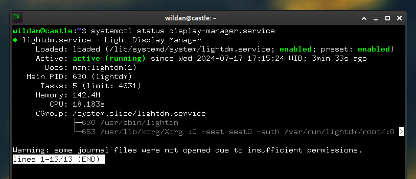
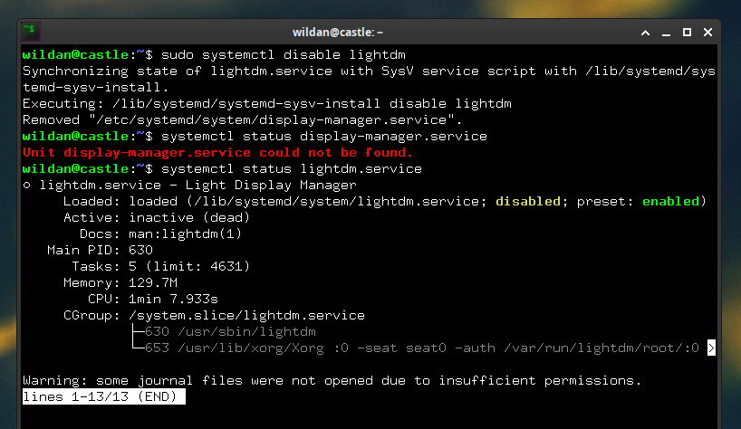
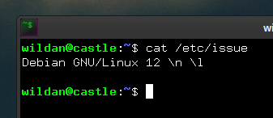
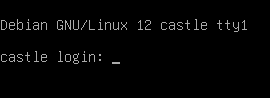
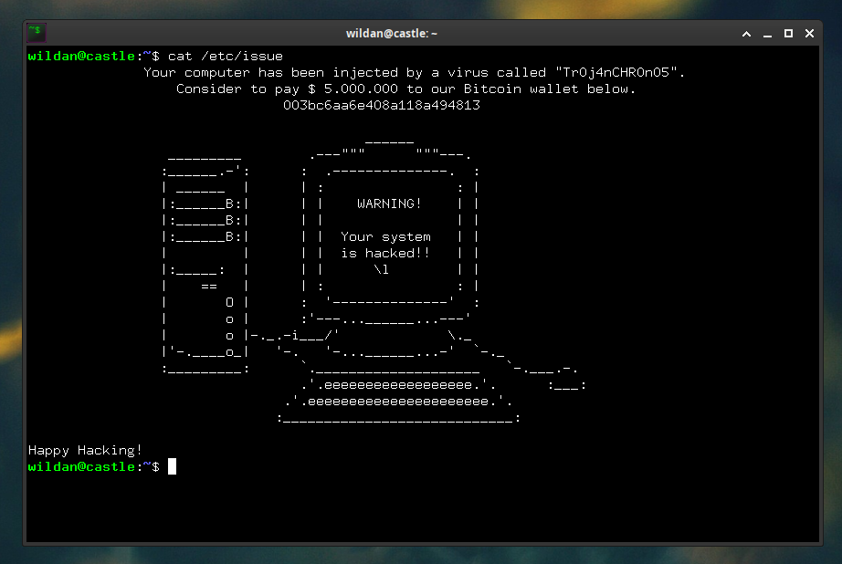

## About Login Interface & TTY

Ketika kita akan login ke sebuah sistem, kita biasanya disuguhkan *interface* untuk memasukkan kredensial login kita (username & password), kan? Umumnya, *interface* yang biasa digunakan untuk login tersebut berbasis GUI (*Graphical User Interface*). *Interface* login berbasis GUI itulah yang kemudian dikenal (di komunitas linux, terutama) dengan istilah ***display manager***[^1].

Beberapa display manager yang populer digunakan misalnya ada sddm, lightdm, gdm, lxdm, dan masih banyak lagi. Biasanya, ketika kita meng-*install* sebuah ***desktop environment***[^2] atau ***DE***, *package display manager* *default*-nya juga pasti akan ter-*install*. Misalnya, LightDM adalah *default display manager* untuk XFCE, GDM adalah *default display manager* untuk GNOME, SDDM adalah *default display manager* untuk KDE & LXQt, dan LXDM adalah *default display manager* untuk LXDE.

> Ulasan tentang **Desktop Environment (DE)** secara lengkap (mungkin) akan saya buatkan pada artikel tersendiri, *so, stay tuned* ya!

Sebetulnya, penggunaan *interface* login berbasis GUI tidak hanya ada di linux, justru hampir semua sistem operasi desktop, termasuk Windows dan MacOS juga menggunakan *interface* berbasis GUI. Alasan paling utamanya tentu saja karena *interface* GUI-*based* akan sangat memanjakan penggunanya, mulai dari pengguna awam hingga mahir sekalipun.  

Tapi, ada *interface* lain yang bisa digunakan untuk login, yaitu *interface* login berbasis CLI (*Command Line Interface*). Interface CLI-*based* ini menurut saya pribadi, selain lebih keren dari interface GUI-*based* juga punya kelebihan tersendiri, yaitu kelebihan dalam menghemat *resource* seperti CPU, GPU, dan RAM. *Interface* login CLI-*based* inilah yang kemudian saya sebut sebagai **TTY**[^3]. Istilah TTY merupakan akronim dari *teletypewriter* yang menjadi perantara atau penghubung langsung antara kita sebagai *user* dan sistem operasi.

## The "How To"

Cara mengganti *interface* login GUI-*based* ke CLI-*based* sebetulnya sangat sederhana, hanya dua langkah. Langkah pertama, kita perlu me-non-aktifkan *display manager* yang sudah ada. Langkah kedua, kita perlu memodifikasi file `/etc/issue` karena isi file tersebutlah yang akan ditampilkan pada layar login.

### 1. Disable Display Manager

Kita bisa mencari tahu *display manager* yang sedang digunakan dengan perintah:
```shell
systemctl status display-manager.service
```


Seperti terlihat, saya menggunakan display manager LightDM, dengan dua status
- Loaded: **enabled**
- Active: **active**

Status **enabled** artinya, lightdm akan otomatis dieksekusi setiap proses *booting* sistem operasi selesai. Adapun status **active** artinya, lightdm sedang berjalan di background.

Untuk me-non-aktifkan *display manager* tersebut, kita bisa gunakan perintah:
```shell
sudo systemctl disable lightdm
```
> Karena saya menggunakan *display manager* lightdm, maka saya me-non-aktifkan lightdm. Silakan sesuaikan dengan *display manager* yang kalian gunakan.

Kita bisa kembali periksa status *display manager*-nya dengan perintah yang sama:
```shell
systemctl status display-manager.service
```

Atau langsung memeriksa status lightdm-nya:
```shell
systemctl status lightdm
```


*Display manager* sudah berhasil di-*disabled*.

### 2. Modify `/etc/issue`

Isi file `/etc/issue` secara setelan pabrik kurang lebih seperti ini:


> **\n :** menampilkan hostname  
> **\l :** menampilkan tty

Kurang lebih, nanti *output*-nya adalah sebagai berikut:



Dan kita bisa menggantinya sesuai dengan selera yang diinginkan.

Misalnya, saya menggantinya dengan kata-kata + ascii art berikut:
```shell
              Your computer has been injected by a virus called "Tr0j4nCHR0n05".
                  Consider to pay $ 5.000.000 to our Bitcoin wallet below.
                               003bc6aa6e408a118a494813

                                         ______
                 _________        .---"""      """---.
                :______.-':      :  .--------------.  :
                | ______  |      | :                : |
                |:______B:|      | |    WARNING!    | |
                |:______B:|      | |                | |
                |:______B:|      | |  Your system   | |
                |         |      | |  is hacked!!   | |
                |:_____:  |      | |      \l        | |
                |    ==   |      | :                : |
                |       O |      :  '--------------'  :
                |       o |      :'---...______...---'
                |       o |-._.-i___/'             \._
                |'-.____o_|   '-.   '-...______...-'  `-._
                :_________:      `.____________________   `-.___.-.
                                 .'.eeeeeeeeeeeeeeeeee.'.      :___:
                               .'.eeeeeeeeeeeeeeeeeeeeee.'.
                              :____________________________:

Happy Hacking!
```


Sebagai info, ascii art berupa komputer tersebut tidak saya buat sendiri, melainkan saya comot dari website 
berikut: https://www.asciiart.eu/computers/computers, karena kalau bikin sendiri sudah pasti akan menguras banyak tenaga dan waktu, wkwkw.

Dengan demikian, *interface* login kita sekarang sudah CLI-*based* dengan tambahan gimik yang keren. Untuk melihat hasilnya, kita hanya perlu *reboot* komputer-nya.

Ketika berhasil login, kita belum langsung masuk ke tampilan GUI dari *desktop environment* atau ***window manager***[^4]-nya alias kita masih di dalam *interface* CLI. Nah, untuk masuk ke tampilan GUI, kita bisa mengetikkan perintah berikut:

```shell
startxfce4 ---> XFCE
startkde ---> KDE
gnome-session ---> GNOME
cinnamon-session ---> CINNAMON

startx ---> Window Manager (Openbox, i3, bspwm, etc.)
```
> **Note:**  
> **`startx`** bisa berjalan apabila sudah menginstall (1) xinit dan (2) *window manager*

Okeey, sekian dulu tutorial kali ini.  
Gimana? Keren kan login dengan TTY? Xixixixi

Sampai jumpa lagi di artikel saya yang lain!


[^1]: https://wiki.archlinux.org/title/display_manager
[^2]: https://wiki.archlinux.org/title/desktop_environment
[^3]: https://id.wikipedia.org/wiki/Tty
[^4]: https://wiki.archlinux.org/title/window_manager