## Typst?

Pernah dengar [**typst**](https://typst.app/)? Saya akan berbagi sedikit tentang typst di artikel ini, mulai dari apa itu typst hingga ke cara menggunakannya.  

### What is it?

<iframe
  src="https://player.cloudinary.com/embed/?cloud_name=dpvtbnqf7&public_id=typst_jfq9zc"
  width="640"
  height="360" 
  style="height: auto; width: 100%; aspect-ratio: 640 / 360;"
  allow="autoplay; fullscreen; encrypted-media; picture-in-picture"
  allowfullscreen
  frameborder="0"
></iframe>

Secara sederhana, [**typst**](https://typst.app/) adalah "_typesetting system_" yang berbasis "_markup_".[^1] _Typesetting_, yang kalau diterjemahkan bebas ke bahasa Indonesia artinya "penataan huruf", merupakan proses pengaturan huruf, angka, dan karakter dalam suatu naskah atau dokumen.[^2] _Markup_ (atau bahasa markup) sendiri merupakan "sistem anotasi" pada dokumen digital yang memungkinkan komputer memahami struktur dokumen tersebut.[^3]

Beberapa contoh bahasa markup antara lain:[^4]
1. **HTML (_Hypertext Markup Language_)**: Digunakan untuk mengatur tampilan teks (judul, ketebalan, tautan, dst) pada web. 

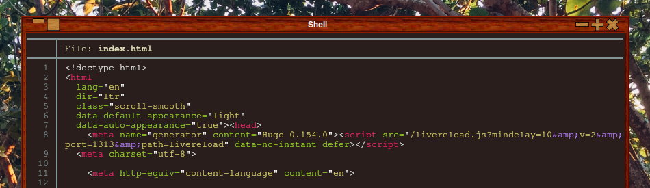

2. **XML (_Extensible Markup Language_)**: Digunakan untuk menyimpan dan memindahkan data.

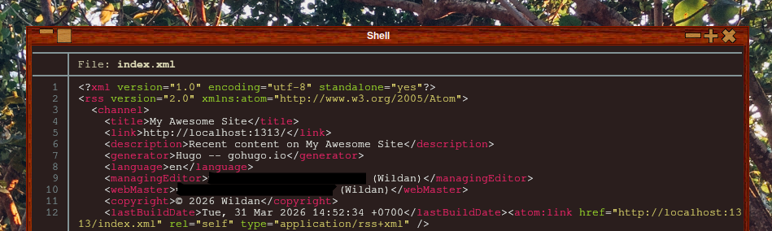

3. **SVG (_Scalable Vector Graphics_)**: Digunakan untuk mendeskripsikan gambar vector (gambar yang dibuat dari persamaan matematis). 

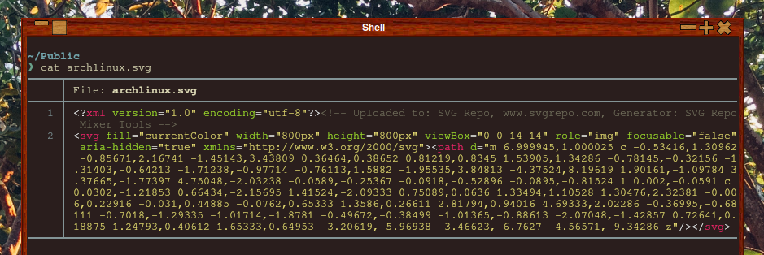

4. **Markdown**: Digunakan untuk memformat teks di plain-text editor menggunakan simbol-simbol tertentu.

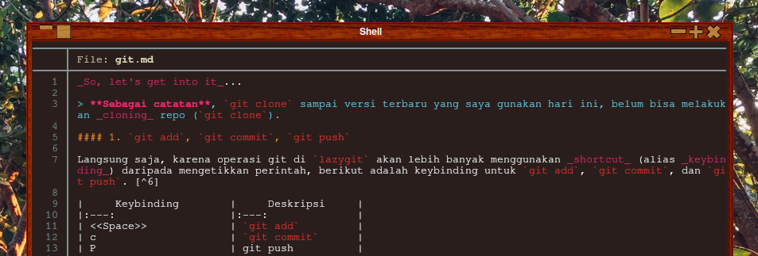

5. **LaTex**: Digunakan untuk menulis _paper_ ilmiah, artikel penelitian, dan konten matematis (biasanya dalam format PDF).

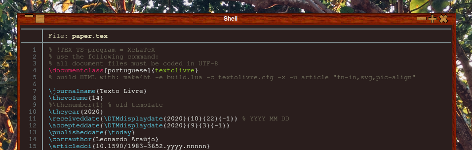

Nah, typst adalah salah satu dari contoh-contoh program berbahasa markup tersebut, tapi lebih ditujukan untuk dokumen sehingga kalau dibandingkan dengan keempat contoh di atas, typst lebih mirip dengan [**LaTex**](https://www.latex-project.org/).

Boleh dibilang, typst adalah "adik" dari LaTex. Sebab, LaTex sudah lebih dahulu ada sejak kira-kira 42 tahun yang lalu (1984),[^5] sementara typst baru saja muncul sekitar 3 tahunan yang lalu (2023).

:::info

**Markup Language vs Programming Language**

Meskipun sama-sama merupakan bahasa komputer yang digunakan untuk men-strukturisasi, menampilkan, dan memanipulasi konten atau data, _markup language_ dan _programming language_ tidaklah sama.

_Programming language_ memberikan _logic_ yang dapat dieksekusi oleh komputer. Artinya, membuat program dengan bahasa pemrograman memungkinkan adanya "input", "kalkulasi", dan "penyelesaian masalah". Sementara itu, _markup language_ hanya membuat struktur elemen dan tampilan suatu dokumen ketika dibuka. 

:::

Typst adalah program berbasis [***open-source***](https://opensource.com/resources/what-open-source). Berikut adalah tautan _repository_ Github-nya, berikut dengan websitenya.

::github{repo="typst/typst"}

**Website:**  https://typst.app/

### Its Capabilities

Typst merupakan program yang dapat digunakan untuk:

1. Menulis Buku.
2. Menyusun CV (Curriculum Vitae).
3. Menulis Surat.
4. Membuat Invoice.
5. Menulis Proposal.
6. Membuat Website (in preview).
7. Menyusun Standardisasi.
8. Membuat Laporan.
9. Menyusun Tesis.
10. Membuat Presenrasi.
11. Menulis Paper.
12. Catatan Perkuliahan.
13. Dokumen Transaksi.

Oleh karena dapat digunakan untuk tujuan yang sangat beragam, typst juga memiliki banyak kemampuan. Berikut adalah kemampuan-kemampuan typst:

1. Membuat Visualisasi.
2. Menulis Rumus Matematika.
3. Menggambar Grafik dan Diagram.
4. Membuat Table.
5. Menulis Kode.
6. Membuat Bibliografi.
7. Membuat Slides.

Selain itu, kita juga dapat berpindah (re: mengedit) dari dokumen-dokumen seperti Word dan Google Docs, LaTex, dan Markdown ke Typst! 

Keren, bukan?

### Typst vs LaTex

Berikut adalah beberapa perbedaan LaTex dan Typst:[^6]

> Sengaja dalam bahasa Inggris karena 2 alasan: (1) biar sambil belajar bahasa Inggris, (2) biar lebih ringkas jumlah katanya

| **Feature**       | **Typst**                         | **LaTex**                             |
| :---              | :---                              | :---                                  |
| First Release     | 2023                              | 1984                                  |
| Compilation Speed | Near Instant (<1s for changes)    | Slow (10-90s for large docs)          |
| Syntax Complexity | Much simpler, Rust-inspired       | Steep learning curve                  |
| Error Message     | Clear and actionable              | Often cryptic                         |
| Package Ecosystem | Growing (100+ packages)           | Massive (thousands of packages)       |
| Journal Acceptance| Limited (PDF ok, .tex required)   | Universal                             |
| Collaboration     | Built-in on [typst.app](https://typst.app/play/)             | Via [Overleaf](https://www.overleaf.com/) |
| Math Notation     | Good with shortcuts               | Comprehensive                         |
| AI Tool Support   | Limited third-party support       | Extensive (Underleaf, Writefull, etc) |
| Citation Styles   | CSL (80+ built-in styles)         | BibTeX (thousands of styles)          |
| Cost              | Free (open source)                | Free (open source)                    |

Sebagai contoh, berikut adalah perbandingan [_syntax_](https://bif.telkomuniversity.ac.id/en/syntax-is/) di Typst dan LaTeX:[^7]

[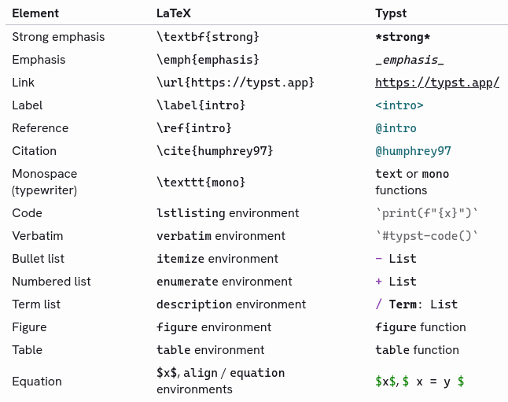](https://typst.app/docs/guides/for-latex-users/)

Jadi, mana yang lebih baik?  
Jawabannya akan selalu seperti ini:

_**Software**_ yang terbaik adalah yang fitur-fiturnya memenuhi keperluan dan kebutuhan kalian.

Artinya, kalian memang harus tahu kebutuhan kalian terlebih dahulu, kemudian disesuaikan dengan fitur-fitur yang ada di masing-masing program tersebut. Setelah itu, barulah kalian bisa menyimpulkan mana yang terbaik.

## How to?

Berikutnya, kita akan mempelajari teknis penggunaan typst, mulai dari melakukan instalasi hingga menggunakan template.

### Installing Typst

Berikut adalah cara meng-_install_ `typst` di beberapa sistem operasi Linux:

|       Distro      |                  Command                           |
|       ---         |                   ---                              |
| **Arch Linux**    | **`sudo pacman -Sy typst`**                        |
| **Opensuse**      | **`sudo zypper install typst`**                    |

> [!TIP]
> Untuk distro **Debian/Ubuntu** dapat meng-_install_ typst melalui [snap](https://snapcraft.io/typst). Sementara untuk **Fedora**, bisa langsung ambil _binary_-nya langsung atau _compile_ sendiri dari _source code_ typst di [Github](https://github.com/typst/typst/).

:::note

**NixOS:**  
Masukkan baris berikut di file konfigurasi (`/etc/nixos/configuration.nix`):

```nix
  environment.systemPackages = [
    pkgs.typst
  ];
```

Atau jika menggunakan `nix-shell`:

```shell
nix-shell -p typst
```

:::

### Writing in Typst

Menulis dengan typst berarti kita perlu mengetahui _syntax-syntax_ yang terdapat di typst terlebih dahulu. Beruntungnya, typst sendiri sudah menyediakan daftar syntax yang tersedia di websitenya.

> **Typst syntax cheatsheet:** https://typst.app/docs/reference/syntax/

Ketika sudah meng-_install_ typst, kita dapat memulai membuat dokumen typst dengan perintah:

```shell
touch file.typ
typst compile file.typ
```

Setelah itu, akan muncul file **`file.pdf`** di direktori yang sama. Kita dapat mulai meng-_edit_ file `file.typ` kemudian melihat hasilnya di file `file.pdf`. Kita juga dapat melihat perubahan secara _realtime_ dengan menjalankan perintah:

```shell
typst watch file.typ
```

sambil membuka file pdf-nya. Nanti, begitu kita menyimpan perubahan yang ada di file `file.typ`, maka perubahan tersebut juga akan muncul langsung di file `file.pdf` yang sedang terbuka.

Berikut sebagai ilustrasi:

<iframe
  src="https://player.cloudinary.com/embed/?cloud_name=dpvtbnqf7&public_id=typst_fdzhmu"
  width="640"
  height="360" 
  style="height: auto; width: 100%; aspect-ratio: 640 / 360;"
  allow="autoplay; fullscreen; encrypted-media; picture-in-picture"
  allowfullscreen
  frameborder="0"
></iframe>

Sebagai pemula, cara paling mudah udah mempelajari hal baru adalah dengan melihat contoh yang sudah ada. Nah, sekarang, perhatikan konten file `file.typ` saya ini, dan lihat hasilnya di `file.pdf` yang akan saya lampirkan berikutnya. Dengan demikian, baris-baris _sytanx_ yang ada di file typst tersebut akan terlihat masuk akal dan mudah untuk dipahami.

```typst
#set heading(numbering: "1.")

#show link: set text(fill: blue, weight: 700)
#show link: underline


= Typst Introduction

*Website* _typst_: https://typst.app

Cara instalasi _typst_ di Archlinux:
+ `sudo pacman -Sy typst`
+ `typst compile file.typ`
+ mulai tulis dengan syntax typst

Tujuan penggunaan _typst_:
- Menulis paper
- Membuat CV
- Menyusun presentasi

= Typst Advanced

== Package

Cara meng-_import_ package:

`#import "@preview/example:0.1.0": add
#add(2, 7)`

Outputnya:

#import "@preview/example:0.1.0": add
#add(2, 7)

== Math
{ let x = 1; x + 2 }

$#rect(width: 1cm)$ $arrow.r.long$ $#rect(width: 1cm)$ 

-------------\

*Glossary*

/ typst: markup typesetting system
/ template: created document for 'spesific purpose'

// Ini komentar.
```

Berikut adalah file pdf-nya:

<iframe 
  src="/assets/pdf/typst/file.pdf" 
  width="100%" 
  height="800px"
  style="border: none;">
</iframe>

Atau, jika kalian ingin yang lebih praktis, typst juga menyediakan "***playground***" unttuk mencoba typst juga. 

Berikut tautannya: **https://typst.app/play/**

Selain itu, typst juga menyediakan ***tutorial*** penggunaan typst:
1. **Menulis di typst:** Cara menulis teks, menambahkan gambar, persamaan, dan komponen lainnya. 
2. **Membuat format:** Cara menyesuaikan format dokumen: ukuran font, heading, dan lainnya.
3. **Membuat layout:** Cara membuat layout halaman yang lebih kompleks untuk keperluan paper ilmiah.
4. **Membuat template:** Cara membuat template yang dapat digunakan kembali untuk keperluan yang sama. 

Berikut tautannya: **https://typst.app/docs/tutorial/**

### Playing with packages & templates

***Packages*** adalah kumpulan file typst yang dapat di-_import_ sebagai unit terpisah untuk menambahkan fungsionalitas, gaya, dan juga otomatisasi di dokumen kita.[^8] ***Templates*** adalah bagian dari _packages_ yang dibuat untuk tujuan _template_ dokumen, artinya kita dapat menggunakan struktur dan _layout_ dokumen yang sudah dibuat untuk keperluan tertentu, seperti _template_ laporan, _template_ paper, _template_ CV, dan yang lainnya.

Kita akan lihat perbedaan implementasi penggunaan _package_ dan _template_ berikut ini.

#### How to use package

Daftar _package_ yang tersedia dapat dilihat di: 

> **https://typst.app/universe/search/?kind=packages**

Ada banyak _package_ yang dapat kita gunakan. Kita tidak perlu menggunakan atau meng-_import_ semua _package_. Gunakanlah _package-package_ yang relevan dan memang kita perlukan untuk membuuat dokumen yang kita ingin buat.

Saya akan mendemonstrasikan cara meng-_import_ salah satu _package_, dan _package_ pilihan saya jatuh kepada [`gentle-clues`](https://typst.app/universe/package/gentle-clues).

[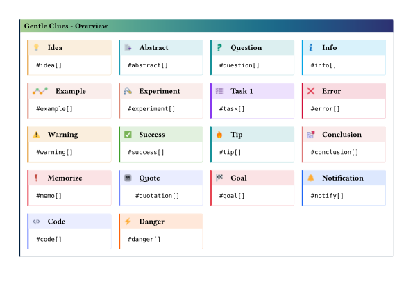](https://typst.app/universe/package/gentle-clues)

Cara meng-_import_-nya:
1. Buka dokumen typst.
2. Tambahkan baris berisi perintah _import package_ di bagian awal dokumen.
3. Tambahkan elemen dari package di dalam dokumen.

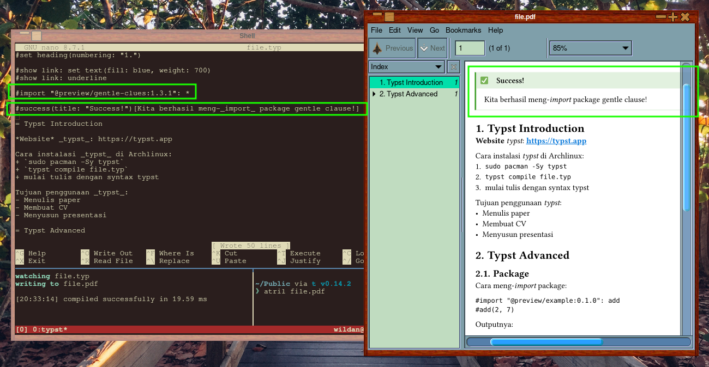

Berikut adalah parameter dalam menggunakan _package_ ini:

```typst
#example[Your text here...]
```

Nanti, akan di-_render_ menjadi:

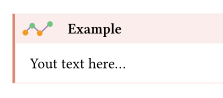

Tapi, kita juga dapat mengganti beberapa parameter seperti "_heading_" & "_title_"-nya:

```typst
#experiment[Percobaan _package_ gentle clues.]
#quote(title: "Quotes")[Doubt kills more dreams than failure ever will.]
```

_Output_-nya:

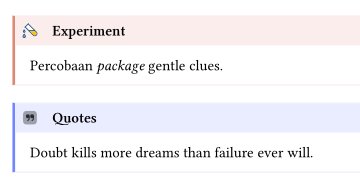

#### How to use template

Daftar _package_ yang tersedia dapat dilihat di: 

> **https://typst.app/universe/search/?kind=templates**

Seperti juga _package_, ada banyak _template_ yang dapat kita gunakan. Kita tidak perlu menggunakan atau meng-_import_ semua _template_. Gunakanlah _template_ yang relevan dan memang kita perlukan untuk membuuat dokumen yang kita ingin buat.

Saya akan mendemonstrasikan cara menggunakan salah satu _template_, dan _template_ pilihan saya jatuh kepada [`brillian-cv`](https://typst.app/universe/package/brilliant-cv).

[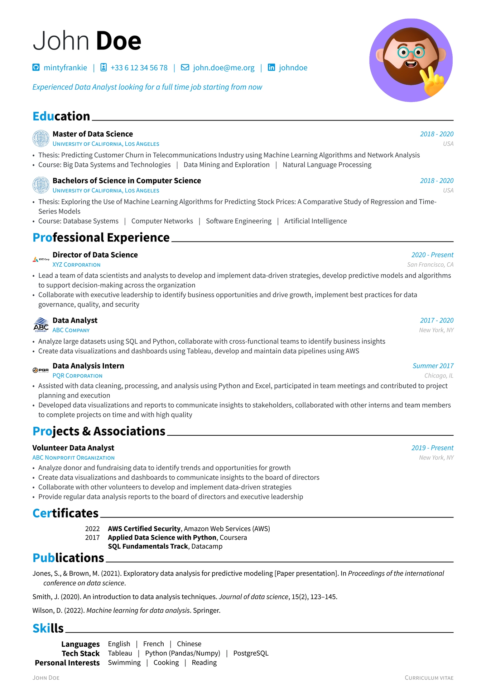](https://typst.app/universe/package/brilliant-cv)

Cara menggunakannya: 
1. Inisialisasi dan unduh templatenya.
2. Edit file **metadata.toml** untuk men-_setting_ _persoal detail_ kita.
3. Compile file `.typ` ke `.pdf`.

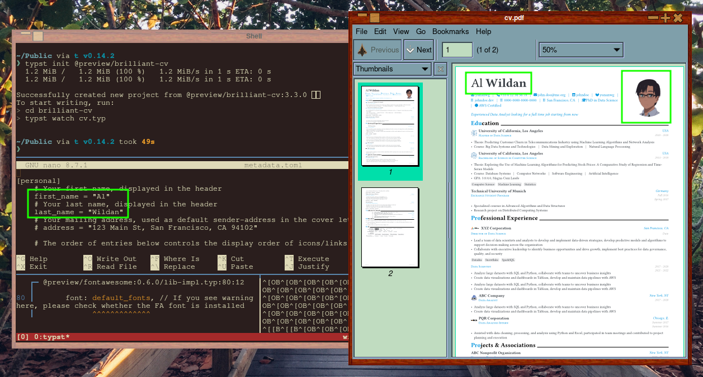

:::note

1. Beberapa template mungkin saja menggunakan _font_ yang tidak ter-_install_ di komputer kita. Oleh karena itu, kita perlu mengunduhnya terlebih dahulu agar tampila _font_-nya tampak lebih sesuai.
2. Untuk _template_ `brilliant-cv` ini, file konfigurasi utamanya adalah **metadata.toml**, sebab, di sanalah kita menuliskan konten cv tersebut. Akan tetapi, beberapa pengaturan juga perlu dilakukan di file yang lain, seperti `cv.typ`. Contohnya, kita perlu meng-_edit_ file `cv.typ` untuk mengganti foto profil. 

:::

Demikian tutorial singkat mengenai typst kali ini!  
Semoga bermanfaat!


[^1]: https://typst.app/
[^2]: https://glints.com/id/lowongan/typesetting-adalah/
[^3]: https://medium.com/@hrishikesh.salway19/markup-languages-1b510aa3b6e
[^4]: https://www.semrush.com/blog/markup-language/
[^5]: https://id.wikipedia.org/wiki/LaTeX
[^6]: https://www.underleaf.ai/blog/typst-vs-latex
[^7]: https://typst.app/docs/guides/for-latex-users/
[^8]: https://github.com../images/typst/packages/blob/main/README.md
