Saya akan mendemonstrasikan instalasi Ubuntu Server sebagai _virtual machine_ (VM). Versi Ubuntu yang saat ini saya gunakan adalah versi terbaru (setidaknya pada saat artikel ini ditulis), yaitu Ubuntu 24.04. Sebagai tambahan informasi, saya akan meng-_install_ Ubuntu ini sebagai VM di [**Virt-manager**](https://abwildan.github.io/tech/virt-manager/). Namun, tidak akan ada perbedaan yang signifikan jika di-install di ***hypervisor*** yang lain, seperti [Virtualbox](https://www.virtualbox.org/) atau [VMWare](https://www.vmware.com/). Jadi, silakan mengikuti tutorial... 😃

## Prerequisites

Beberapa persyaratan:

1. Sudah meng-_install_ salah satu ***hypervisor***, baik Virt-manager, Virtualbox, VMWare, atau yang lain.
2. Terhubung ke jaringan internet.
3. Sudah mengunduh file ".iso" Ubuntu Server.
4. Sudah membuat _virtual machine_ (VM) di ***hypervisor*** yang dimiliki.
5. Memiliki pengetahuan yang cukup tentang jaringan internet.

Kelima persyaratan pendahuluan tersebut harus sudah dilakukan sebelum mengikuti tutorial ini, sebab kelima hal tersebut tidak akan dibahas dalam penjelasan instalasi Ubuntu Server di artikel ini. 

Oiya, berikut adalah konfigurasi RAM, Storage, dan Network yang saya buat untuk VM Ubuntu Server ini:
- **RAM:** 4 GB  
- **Storage:** 20 GB  
- **Network:** NAT (virtio)  

Satu lagi _disclaimer_ yang saya kira cukup penting, yaitu bahwa instalasi Ubuntu Server ini akan sedikit berbeda dibandingkan dengan instalasi Ubuntu Desktop, karena instalasi ini lebih banyak menggumakan CLI (_Command Line Interface_) dibandingkan GUI (_Graphical User Interface_) seperti yang terdapat di Ubuntu Desktop. Jadi, bila belum terbiasa dengan tampilan CLI, tidak perlu khawatir, kalian hanya perlu mengikuti panduan ini dengan baik agar proses instalasinya berjalan dengan lancar. 

## Installation

### 1. Selecting Language

Ketika pertama kali menjalankan VM, akan muncul _interface_ "default" linux, yaitu GRUB seperti gambar di bawah ini. 

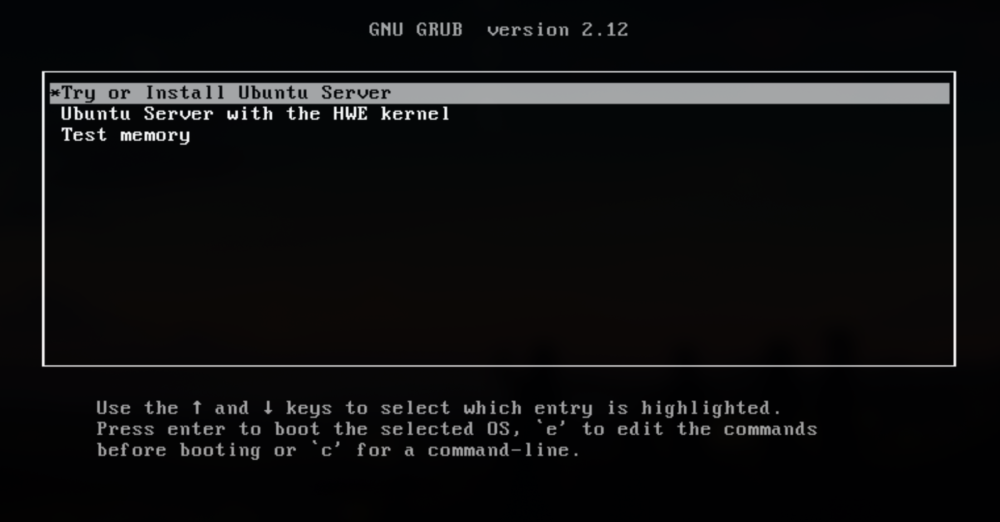

Pilih opsi yang paling atas, "Try or Install Ubuntu Server".

Kemudian, biarkan beberapa proses berjalan hingga muncul tampilan baru untuk memilih bahasa seperti berikut:

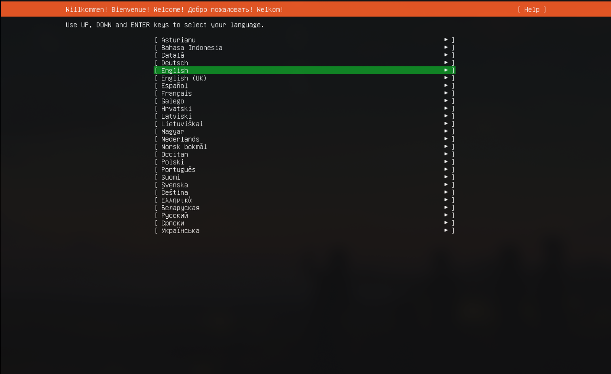

Silakan dipilih berdasarkan preferensi masing-masing dengan cara menekan "Enter" pada bahasa yang diinginkan. Saya akan memilih bahasa Inggris (English).

### 2. Keyboard Config

Kemudian, kita harus memilih jenis _layout_ _keyboard_. 

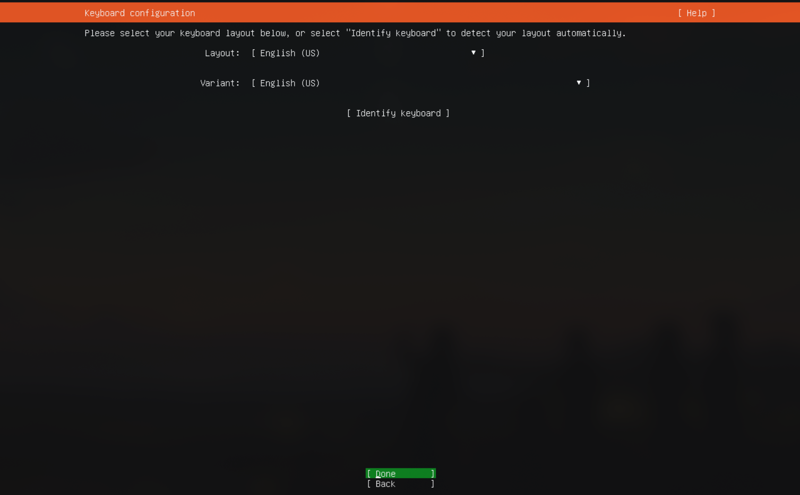

Bagian ini dapat dibiarkan "default" seperti apa adanya.  
Untuk melanjutkan, tekan "Enter".

### 3. Installation Type

Berikutnya, kita perlu memilih jenis instalasi yang ingin dilakukan.  
Ada 2 jenis instalasi yang ditawarkan pada Ubuntu versi 24.04 ini, yaitu:
1. Ubuntu Server 
2. Ubuntu Server (minimized)

Perbedaan keduanya terletak pada jumlah aplikasi yang akan di-_install_ nanti oleh Ubuntu. Jika memilih opsi pertama, maka jumlah aplikasi atau paket yang di-_install_ akan lumayan banyak, namun, jika memilih opsi kedua, maka jumlah paket yang akan di-_install_ akan lebih sedikit.

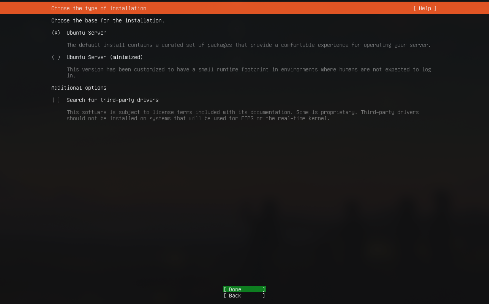

Biarkan "default". Tekan "Enter" untuk melanjutkan.

### 4. Network Configuration

Langkah selanjutnya adalah mengkonfigurasi jaringan internet.  
Jika kita sudah mengkonfigurasi jaringan VM ini sebelumnya di ***hypervisor***, maka, opsi "default" pada bagian _network configuration_ ini akan mengikuti konfigurasi sebelumnya tersebut.

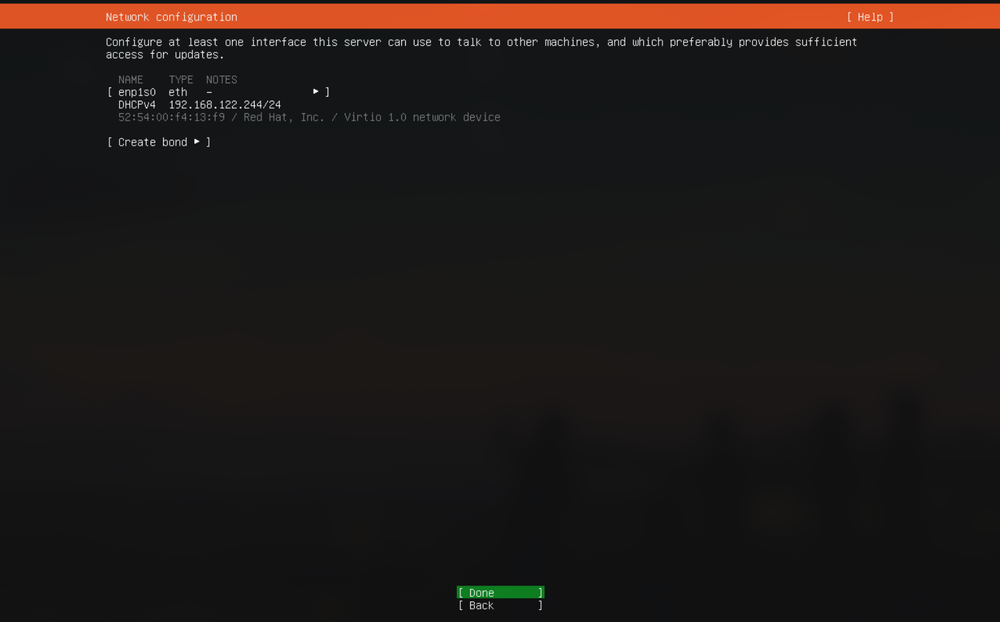

Seperti terlihat pada gambar, jaringan internet pada VM saya ini akan menggunakan _interface_ **eth0** (yang mana adalah _interface_ NAT) dengan _ip address_ seperti terlihat. 

Jadi, biarkan "default". Tekan "Enter" untuk melanjutkan.

### 5. Proxy Configuration

Selanjutnya, kita diarahkan pada pengaturan proxy.

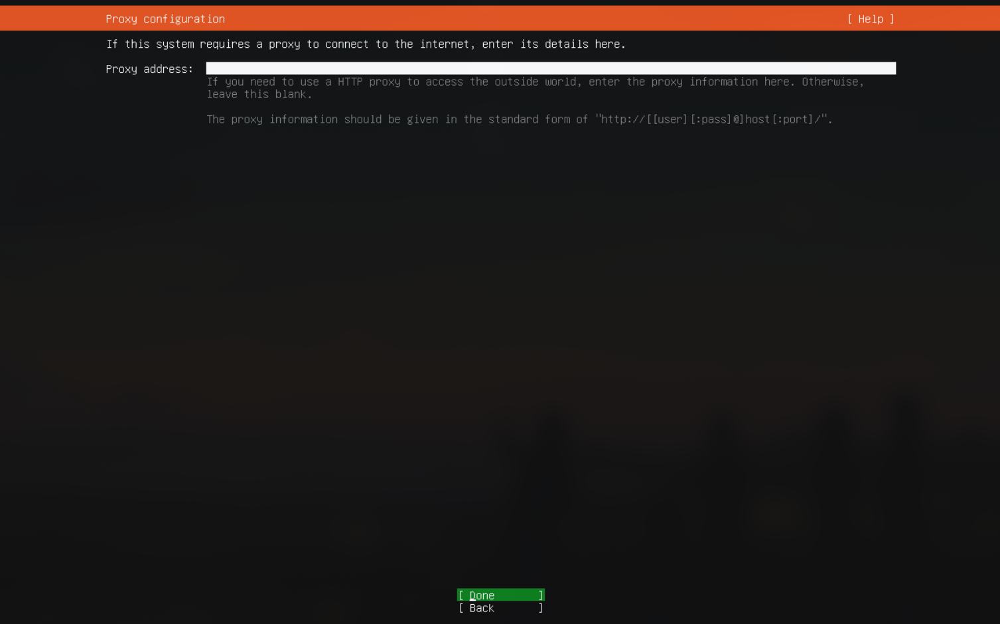

Kita bisa biarkan kosong (default), dan melanjutkan ke tahap berikutnya.

### 6. Mirror Configuration

Ini adalah bagian yang tidak kalah penting: mengkonfigurasi _repository mirror_ Ubuntu.  
Bagian ini penting karena _repository_ atau biasa disingkat "repo" adalah tempat Ubuntu Server kita merujuk ketika ingin meng-_install_ paket/aplikasi/software atau ingin meng-_update_-nya. Jadi, pastikan kalian memilih **"repo" yang dapat diandalkan**, dalam artian:
- "repo" tersebut _up-to-date_ dan sering meng-_update_ paket-paket-nya.  
- "repo" tersebut "dekat" sehingga memperlancar akses internet kalian.  

Secara "default", Ubuntu akan memberikan alamat "repo" berikut:

```shell
http://archive.ubuntu.com/ubuntu/
```

Tapi, seperti terlihat pada gambar di bawah, saya sudah mengganti "repo"-nya ke mirror di UGM:

```shell
http://repo.ugm.ac.id/ubuntu/
```

Untuk menggantinya, kalian cukup menghapus alamat "repo" sebelumnya dan menggantinya dengan alamat yang baru pada kolom putih tersebut, kemudian, tekan "Enter"  di kolom tersebut agar Ubuntu dapat memastikan ketersediaan "repo" tersebut.

Beberapa opsi "repo" lain yang ada di Indonesia dapat dicari pada tautan berikut: `http://mirrors.ubuntu.com/ID.txt`
Atau saya lampirkan saja langsung isi file tersebut pada saat artikel ini dibuat:

```shell
http://mirror.biznetgio.com/ubuntu/
http://kartolo.sby.datautama.net.id/ubuntu/
http://suro.ubaya.ac.id/ubuntu/
https://mirror.faizuladib.com/ubuntu/
https://mirror.repository.id/ubuntu/
https://mirror.amscloud.co.id/ubuntu/
http://mirror.poliwangi.ac.id/ubuntu/
https://mirror.nevacloud.com/ubuntu/ubuntu-archive/
http://repo.ugm.ac.id/ubuntu/
https://mirror.citrahost.com/ubuntu/
http://mirror.cepatcloud.id/ubuntu/
https://mr.heru.id/ubuntu/
http://dl2.foss-id.web.id/ubuntu/
http://mirror.deace.id/ubuntu/
https://mirror.dewabiz.com/ubuntu/
https://mirror.unair.ac.id/ubuntu/
https://mirror-gw.elastis.id/ubuntu/
http://kebo.pens.ac.id/ubuntu/
https://mirror.gi.co.id/ubuntu/
https://mirror.papua.go.id/ubuntu/
http://kebo.vlsm.org/ubuntu/
https://linux.domainesia.com/ubuntu/ubuntu-archive/
http://archive.ubuntu.com/ubuntu/
```

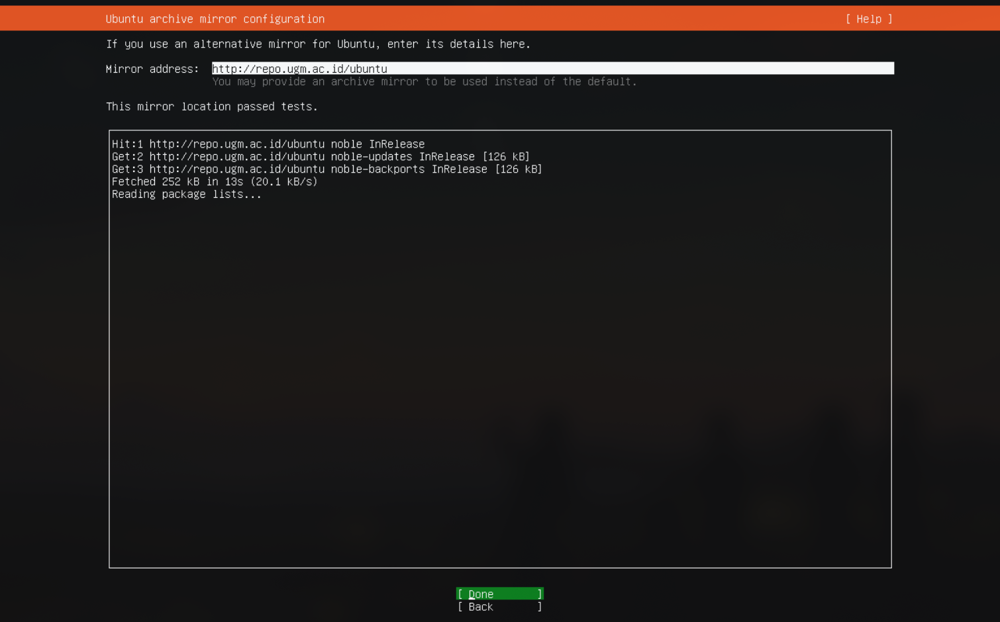

Untuk melanjutkan tekan "Enter" pada opsi "Done" di bawah.

### 7. Storage Configuration 

Setelah itu, kita akan diarahkan pada konfigurasi penyimpanan (_storage_).  
Seperti terlihat pada gambar di bawah ini, terdapat 2 pilihan konfigurasi penyimpanan di sana:  
1. _Use an entire disk_
2. _Custom storage layout_

Pada pilihan pertama, akan memakai seluruh "disk" atau "virtual disk" untuk meng-_install_ VM Ubuntu Server ini, dan membiarkan VM ini sendiri yang mengatur partisinya, seperti besaran partisi untuk "boot", partisi untuk "swap", dan partisi untuk penyimpanan. Umumnya, jika dibiarkan "default" alias memilih opsi pertama ini, nanti direktori atau folder home root `/root` juga dan direktori user `/home/user` akan berada di partisi yang sama. Selain itu, seperti terlihat juga pada tangkapan layar di bawah ini, kita juga dapat mengenkripsi _storage_ kita pada opsi pertama ini.

Pada pilihan kedua, kita dapat lebih leluasa mengatur partisi-partisi yang diinginkan, misalnya seperti memisahkan partisi root dengan partisi user. Tentu saja hal ini memerlukan pengetahuan tentang partisi di Linux. Artinya, sebagai pemula atau pengguna linux yang tidak terlalu peduli dengan partisi ini, pilihan pertama sudah cukup.

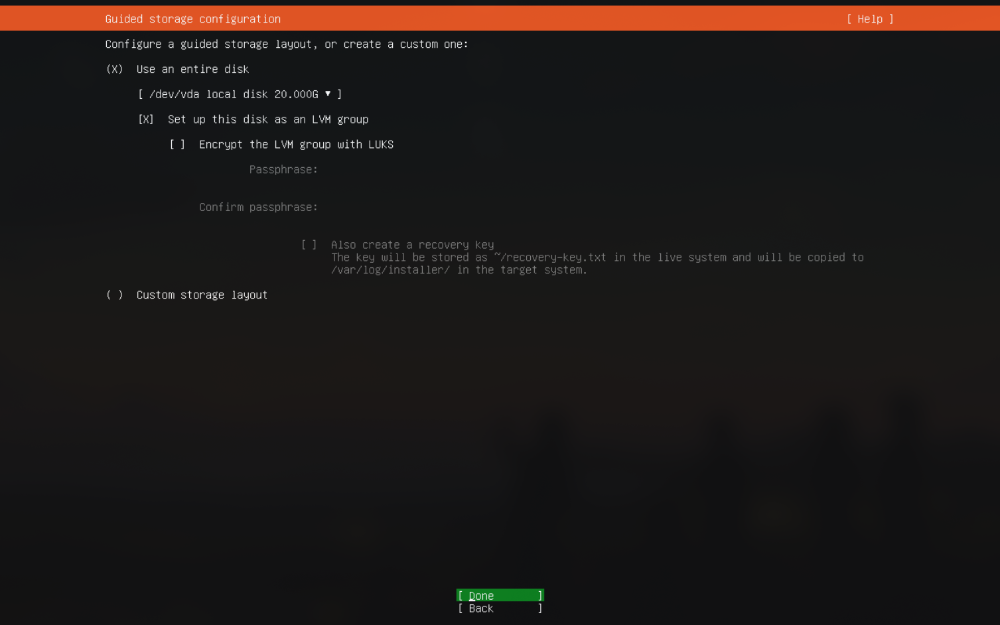

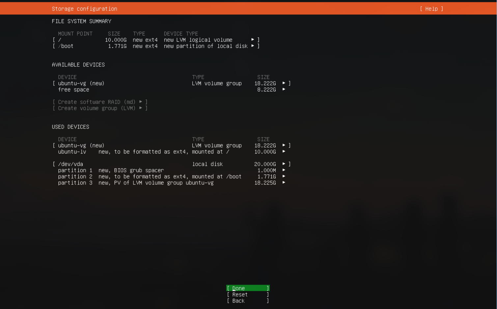

Biarkan "default". Untuk melanjutkan, tekan "Enter" pada setiap tahap di atas.

Akan muncul _pop-up_ window konfirmasi untuk melanjutkan ke proses instalasi. Pastikan tulisan tersebut dibaca dan diperhatikan.  

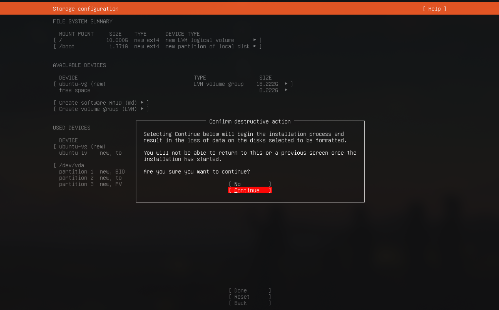

Pilih "continue", lalu tekan "Enter".

### 8. Profile Configuration

Berikutnya, kita akan mengkonfigurasi "profile", seperti **username** & **password**, dan **hostname**.  
Isi kolom-kolom tersebut sesuai prefensi masing-masing. 

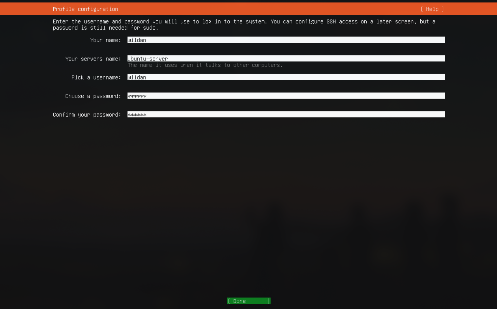

Jika sudah selesai diisi, tekan "Enter" pada bagian "Done" di bawah, untuk melanjutkan.

### 9. Upgrade Ubuntu Pro

Tahap selanjutnya menawarkan kita opsi upgrade ke Ubuntu Pro. 

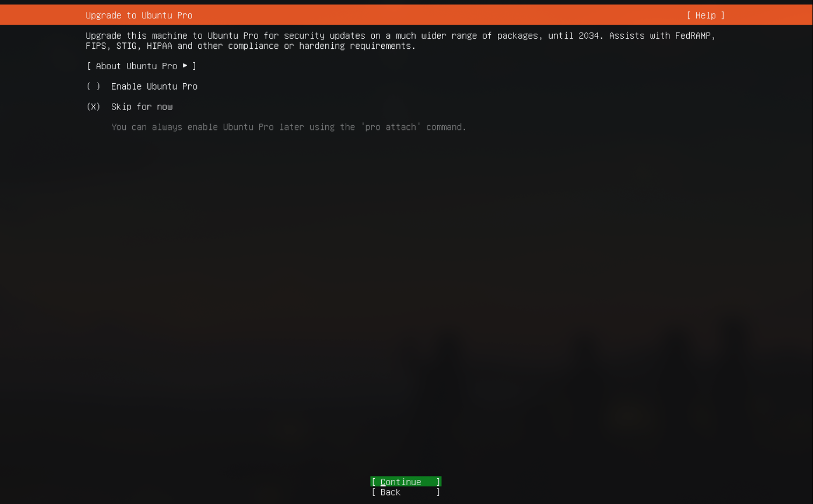

Karena Ubuntu Pro berbayar, maka saya akan biarkan "default" (_Skip for now_) pada bagian ini.

### 10. SSH Configuration

Tahap kesepuluh adalah mengkonfigurasi SSH (Secure Shell).  
Untuk mengaktifkan SSH Server seperti yang saya lakukan dan terlihat juga pada gambar di bawah ini, kita bisa menekan tombol spasi "Space" di keyboard pada opsi "Install OpenSSH Server".

Jika ingin meng-_import_ SSH keys, kita juga dapat melakukannya karena fitur tersebut disediakan oleh Ubuntu. Tapi, jika tidak ada, biarkan apa adanya.

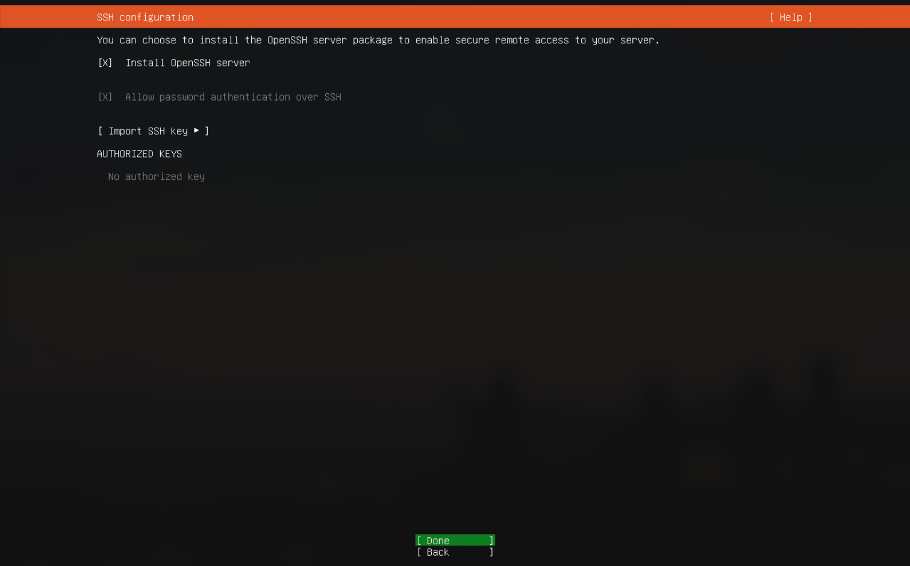

Untuk melanjutkan, tekan "Enter".

### 11. Featured Snaps

Selanjutnya, kita dipersilakan untuk memilih paket yang ingin di-_install_ ke server.  
Untuk memilihnya, sama seperti mengaktifkan SSH pada tahap sebelumnya, kita hanya perlu menekan tombol spasi "Space" di keyboard pada pilihan paket yang ingin di-_install_.

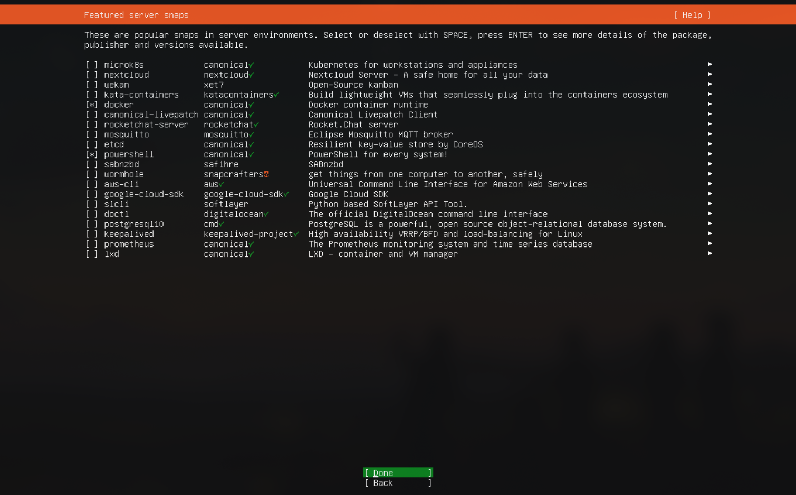

Untuk lanjut, tekan "Enter".

Kemudian, proses instalasi akan mulai berlangsung, tunggu beberapa saat karena proses ini sangat bergantung pada _resource_ yang digunakan berikut juga dengan kecepatan koneksi internet.

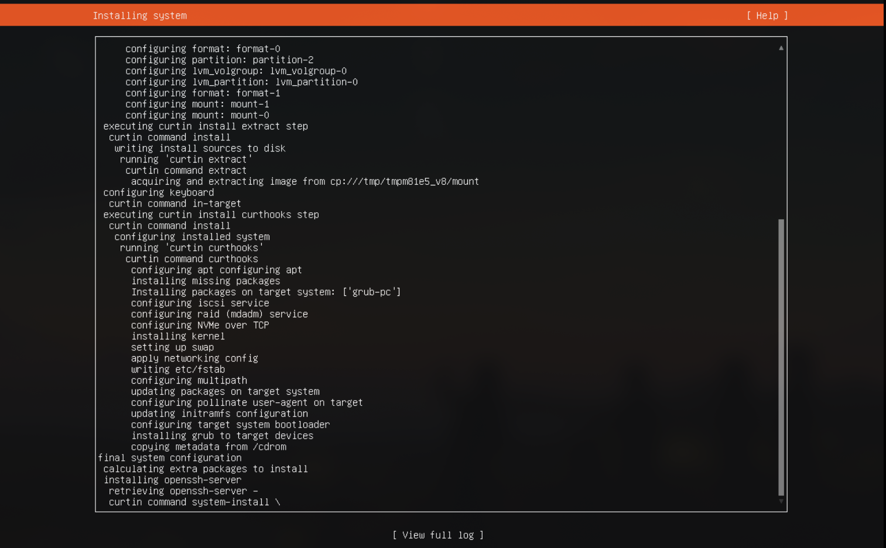

## After Installation

Ketika proses instalasi sudah selesai, silakan _restart_ _virtual machine_ (VM) Ubuntu Server tersebut.

### Login

Setelah VM di-_restart_, interface yang muncul akan berupa CLI lagi, seperti gambar berikut ini:

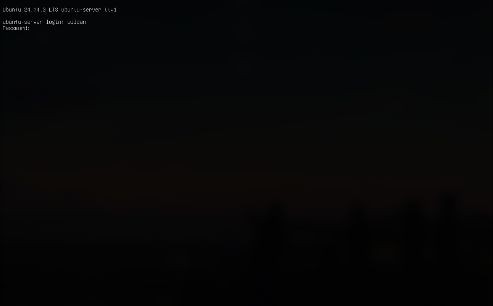

Silakan masukkan "username" yang sudah dibuat sebelumnya pada _prompt_ "**login:**" dan masukkan "password" juga yang sudah kita buat pada saat instalasi tadi di _prompt_ "**Password:**".

Berikut adalah tampilan ketika kita sudah berada di dalam server:

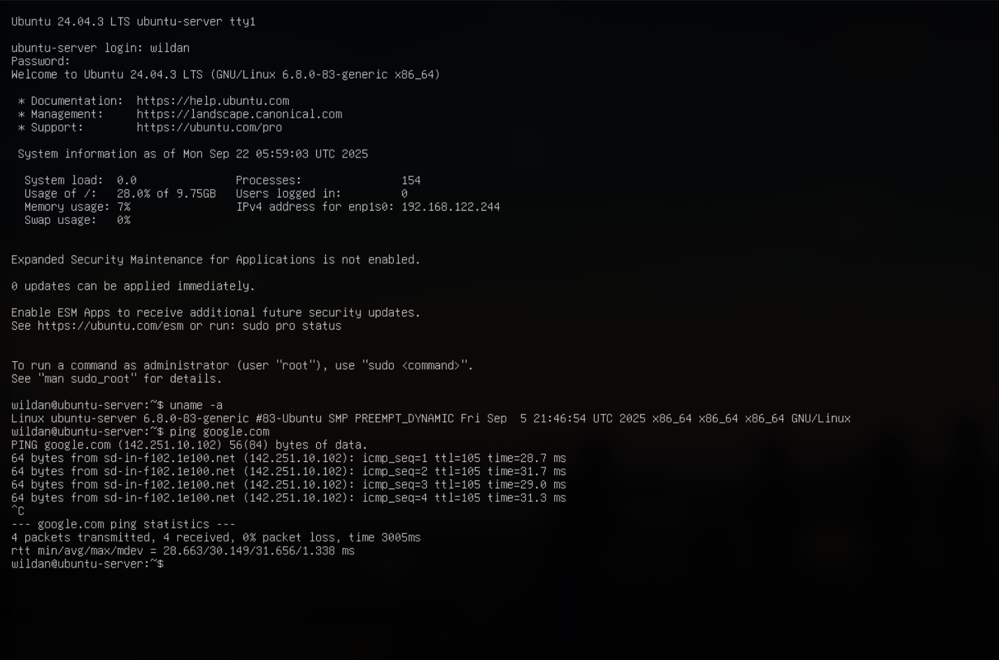

Demikian, semoga bermanfaat.  
😃🤓😎


---

Artikel ini ditulis di **Archlinux - Hyprland**!

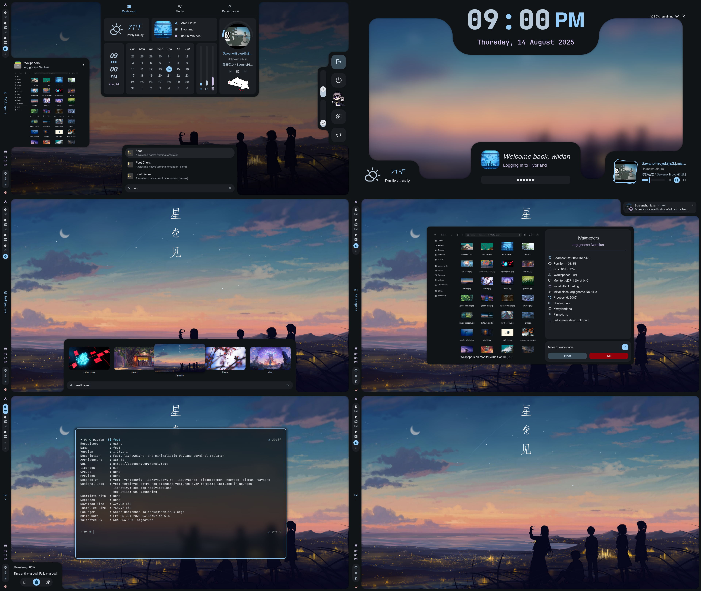


