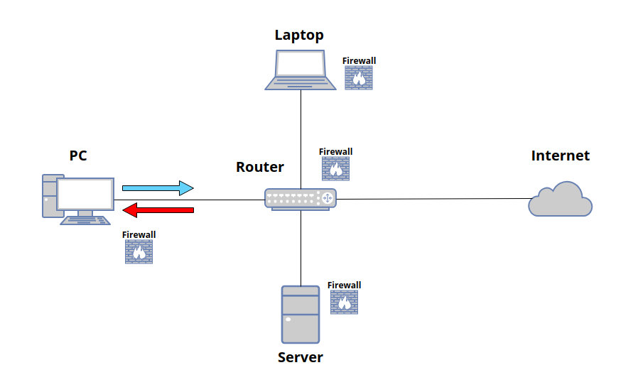

**UFW** adalah singkatan bahasa Inggris dari **Uncomplicated Firewall**. Boleh dibilang, `ufw` merupakan *replacement* dari program manajemen firewall yang lebih "senior" (dan tentu saja -sedikit- lebih kompleks), yaitu [iptables](https://www.exabytes.co.id/blog/apa-itu-iptables-adalah/). Nah, karena UFW adalah tool yang berbasis *command line interface* (CLI), jadi, GUFW adalah versi *graphical user interface* (GUI) dari UFW. Singkatnya, GUFW adalah singkatan dari **GUI UFW**.

Sebentar, lalu apa itu <u> firewall</u>?

Mari sejenak melihat definisi dari kamus bahasa Inggris _online_ yang cukup populer, Merriam Webster berikut:

> **Firewall:** "_computer hardware or software that prevents unauthorized access to private data (as on a company's local area network or intranet) by outside computer users (as of the Internet)._"[^1]

Definisinya sudah benar, tapi belum lengkap. Jadi, mari kembali lihat definisi lain, misalnya seperti yang dikatakan oleh Kaspersky di laman websitenya yang saya kutip berikut:

> **Firewall:** "_a computer network security system that restricts internet traffic in to, out of, or within a private network._"[^2]

Nah, dari referensi kedua definisi tersebut, saya menyimpulkan definisi firewall sebagai "_software komputer yang digunakan untuk mencegah atau membatasi lalu lintas internet **ke luar jaringan**, **ke dalam jaringan**, maupun **di dalam jaringan**_".


## Instalasi

Seperti biasa, `ufw` sebagai _tool standard_, dapat di-_install_ di setiap distro linux via _package manager_-nya masing-masing.

|       Distro      |                  Command                  |
|       ---         |                   ---                     |
| **Debian/Ubuntu** | **`sudo apt install ufw`**                |
| **Arch Linux**    | **`sudo pacman -Sy ufw`**                 |
| **Fedora**        | **`sudo dnf install ufw`**                |
| **Opensuse**      | **`sudo zypper install ufw`**             |

## Penggunaan

Sebelum ke penggunaan, ada beberapa hal penting yang perlu diketahui terlebih dahulu[^3].  



- Firewall seperti **`ufw`** bisa dipasang di perangkat apapun, seperti PC, laptop, dan server (khususnya yang bersistem operasi Linux).
- Aturan utama firewall umumnya hanya 2: **deny** & **allow**.
- Traffic yang dilarang (*deny*) atau diizinkan (*allow*) juga hanya ada 2 tipe: ***incoming*** & ***outgoing***. 
- Ada traffic khusus pada perangkat yang biasa digunakan sebagai router misalnya, yaitu ***routed***.  (Tidak dibahas dalam artikel ini).

### Perintah Umum

Berikut adalah _commands_ atau perintah-perintah untuk **mengaktifkan**, **mematikan**, dan **melihat status** `ufw`.

#### Enable

**`ufw`** tidak otomatis berjalan setelah instalasi selesai. Jadi, untuk menjalankan firewall via **`ufw`** kita perlu mengetikkan perintah berikut:

```bash
sudo ufw enable
```

Outputnya:

```
Firewall is active and enabled on system startup
```

#### Disable

Untuk menon-aktifkan **`ufw`**,

```bash
sudo ufw disable
```

Outputnya:

```
Firewall stopped and disabled on system startup
```

#### Status

Jika ingin melihat status ufw saat ini, gunakan perintah:

```bash
sudo ufw status
```

Outputnya, jika **`ufw`** sedang aktif:

```
Status: active
```

Dan jika sedang tidak aktif:

```
Status: inactive
```

:::info[Status Numbered] 

Kita juga bisa melihat rule yang sudah ditambahkan ke `ufw` berdasarkan nomor urutnya:

```bash
sudo ufw status numbered
```

Outputnya:

```
Status: active

     To                         Action      From
     --                         ------      ----
[ 1] Anywhere                   DENY IN     192.168.0.101             
[ 2] Anywhere                   DENY IN     192.168.0.0/24            
[ 3] 80                         ALLOW IN    Anywhere                  
[ 4] 443                        ALLOW IN    Anywhere                  
[ 5] 22                         ALLOW IN    Anywhere                  
[ 6] 80 (v6)                    ALLOW IN    Anywhere (v6)             
[ 7] 443 (v6)                   ALLOW IN    Anywhere (v6)             
[ 8] 22 (v6)                    ALLOW IN    Anywhere (v6) 
```

> Terlihat bahwa rule untuk memblokir subnet ditambahkan pada urutan ke dua di `ufw`. **Artinya, setiap rule baru yang dibuat, akan ditambahkan di urutan berikutnya. Selain itu, `ufw` sebagai firewall membaca dan memprioritaskan rule berdasarkan urutan nomor yang paling rendah terlebih dahulu (0,1,2,3,...dst)**.

Berdasarkan status `ufw` tersebut, kita tahu bahwa aturan atau rule `ufw` sangat sederhana, dia hanya mencatat 3 hal:
- tujuan paketnya (**from**) 
- apa yang harus diperbuat (**action**), dan 
- sumber paketnya (**to**).

:::

#### Delete

Kita juga bisa menghapus rule yang sudah dibuat. Setidaknya, ada 2 cara untuk menghapus rule di `ufw`:
1. Rule dihapus berdasarkan **nomor urutnya**.

Caranya, 
- lihat nomor rule yang akan dihapus dengan perintah `sudo ufw status numbered`.
- hapus rule yang diinginkan dengan perintah:

```bash
sudo ufw delete 6
```

Outputnya:

```
Deleting:
 deny 22
Proceed with operation (y|n)? y

Rule deleted (v6)
```

2. Rule dihapus berdasarkan **rule itu sendiri**.

Caranya, 
- lihat nomor rule yang akan dihapus dengan perintah `sudo ufw status numbered`.
- hapus rule yang diinginkan dengan perintah:

```bash
sudo ufw delete deny ssh
```

Output:

```
Rule deleted
Rule deleted (v6)
```

#### Reset

Perintah `reset` mirip dengan perintah `delete`. Namun, perintah `reset` lebih "bar-bar" karena akan menghapus seluruh rule yang sudah dibuat dan mengubahnya ke default. Perintahnya:

```bash
sudo ufw reset
```

Output:

```
Resetting all rules to installed defaults. Proceed with operation (y|n)? y
```

### Deny

Kita akan memblokir _traffic/packet/access_ menggunakan perintah **deny** di **`ufw`**. 

#### Ip Address

Gunakan perintah berikut untuk memblokir _ip address_. Dengan perintah tersebut, semua paket dari (_incoming_) dan ke (_outgoing_) _ip address_ tersebut akan diblokir.

```bash
sudo ufw deny from 192.168.0.101
```

Outputnya:

```
Rule added
```

Kita bisa memastikan bahwa rule tersebut sudah ditambahkan ke dalam `ufw` melalui perintah `sudo ufw status`, yang outputnya:

```
Status: active

To                         Action      From
--                         ------      ----
Anywhere                   DENY        192.168.0.101 
```

#### Subnet

Kita juga bisa memblokir subnet tertentu, melalui perintah:

```bash
sudo ufw deny from 192.168.0.0/24
```

Outputnya:

```
Rule added
```

Dengan rule ini, paket-paket yang berasal dari subnet 192.168.0.0/24 akan diblok.

Lagi, kita bisa gunakan perintah `sudo ufw status` untuk melihat rule yang sudah dibuat:

```
Status: active

To                         Action      From
--                         ------      ----
Anywhere                   DENY        192.168.0.101             
Anywhere                   DENY        192.168.0.0/24
```

#### Interface

Kita juga bisa memblokir paket yang datang (_incoming_) di _interface_ tertentu. Misalnya, saya memblokir paket yang masuk melalui interface enp0s3:

```bash
sudo ufw deny in on enp0s3
```

Outputnya:

```
Rule added
Rule added (v6)
```

Dengan rule ini, paket apapun yang datang ke interface enp0s3 akan diblok.  
Di outputnya, terlihat ada 2 rule yang ditambahkan,
- **Rule added:** untuk ipv4
- **Rule added:** untuk ipv6


Statusnya rule `ufw` sekarang:

```
Status: active

To                         Action      From
--                         ------      ----
Anywhere                   DENY        192.168.0.101             
Anywhere                   DENY        192.168.0.0/24            
Anywhere on enp0s3         DENY        Anywhere                  
Anywhere (v6) on enp0s3    DENY        Anywhere (v6)
```

> Kita juga bisa memvariasikan rule ini pada opsi yang lain, misalnya untuk ip address atau subnet yang spesifik.

#### Apps

Kita juga bisa memblokir koneksi dari atau ke spesifik aplikasi (ssh, http, ftp, etc) dengan perintah:

```bash
sudo ufw deny ssh
```

Outputnya:

```
Rule added
Rule added (v6)
```

Dengan rule ini, akses **ssh** dari manapun akan ditolak / diblok.

Status:

```
Status: active

To                         Action      From
--                         ------      ----
Anywhere                   DENY        192.168.0.101             
Anywhere                   DENY        192.168.0.0/24            
Anywhere on enp0s3         DENY        Anywhere                  
22                         DENY        Anywhere                  
Anywhere (v6) on enp0s3    DENY        Anywhere (v6)             
22 (v6)                    DENY        Anywhere (v6)
```

:::info[Apps List] 

Kita juga bisa melihat apa saja applikasi yang tersedia di `ufw` dengan perintah:

```bash
sudo ufw app list
```

Output:

```
Available applications:
  AIM
  Bonjour
  CIFS
  DNS
  Deluge
  IMAP
  IMAPS
  IPP
  KTorrent
  Kerberos Admin
  Kerberos Full
  Kerberos KDC
  Kerberos Password
  LDAP
  LDAPS
  LPD
  MSN
  MSN SSL
  Mail submission
  NFS
  POP3
  POP3S
  PeopleNearby
  SMTP
  SSH
  Socks
  Telnet
  Transmission
  Transparent Proxy
  VNC
  WWW
  WWW Cache
  WWW Full
  WWW Secure
  XMPP
  Yahoo
  qBittorrent
  svnserve
```

:::

#### Port

Kalau kita ingin memblokir akses ke port tertentu, kita bisa gunakan perintah:

```bash
sudo ufw deny 21
```

Output:

```
Rule added
Rule added (v6)
```

Dengan rule ini, akses ke port **21** dari manapun akan ditolak / diblok.

Status:

```
Status: active

To                         Action      From
--                         ------      ----
Anywhere                   DENY        192.168.0.101             
Anywhere                   DENY        192.168.0.0/24            
Anywhere on enp0s3         DENY        Anywhere                  
22                         DENY        Anywhere                  
21                         DENY        Anywhere                  
Anywhere (v6) on enp0s3    DENY        Anywhere (v6)             
22 (v6)                    DENY        Anywhere (v6)             
21 (v6)                    DENY        Anywhere (v6)
```

### Allow

Kita akan mengizinkan _traffic/packet/access_ menggunakan perintah **allow** di **`ufw`**. _Mostly_, perintahnya sama dengan yang ada di bagian "deny". Bedanya, kita mengganti perintah deny dengan **allow**.

#### Ip Address

Kita bisa mengizinkan akses dari _ip address_ dengan perintah:

```bash
sudo ufw allow from 192.168.0.101
```

Output:

```
Rule added
```

Dengan perintah ini, akses dari _ip address_ 192.168.0.101 akan diizinkan ke komputer kita. 

Status:

```
Status: active

To                         Action      From
--                         ------      ----
Anywhere                   ALLOW       192.168.0.101
```

#### Subnet

Untuk mengizinkan paket yang datang dari subnet tertentu, gunakan perintah:

```bash
sudo ufw allow from 192.168.0.0/24
```

Output:

```
Rule added
```

Dengan perintah ini, akses dari _ip address_ berapapun dari subnet 192.168.0.0/24 akan diizinkan ke komputer kita. 

Status:

```
Status: active

To                         Action      From
--                         ------      ----
Anywhere                   ALLOW       192.168.0.101             
Anywhere                   ALLOW       192.168.0.0/24
```

#### Interface

Jika kita ingin mengizinkan akses ke _interface_ di komputer kita, perintahnya adalah:

```bash
sudo ufw allow in on enp0s3
```

Output:

```
Rule added
Rule added (v6)
```

Dengan perintah ini, akses dari manapun akan diizinkan ke interface enp0s3.

Status:

```
Status: active

To                         Action      From
--                         ------      ----
Anywhere                   ALLOW       192.168.0.101             
Anywhere                   ALLOW       192.168.0.0/24            
Anywhere on enp0s3         ALLOW       Anywhere                  
Anywhere (v6) on enp0s3    ALLOW       Anywhere (v6)
```

> Kita juga bisa memvariasikan rule ini pada opsi yang lain, misalnya untuk ip address atau subnet yang spesifik.

#### Apps 

Beberapa aplikasi juga dapat diizinkan aksesnya via `ufw`, dengan perintah:

```bash
sudo ufw allow ssh
```

Output:

```
Rule added
Rule added (v6)
```

Dengan perintah ini, komputer manapun dapat mengakses **ssh** di komputer kita. 

Status:

```
Status: active

To                         Action      From
--                         ------      ----
Anywhere                   ALLOW       192.168.0.101             
Anywhere                   ALLOW       192.168.0.0/24            
Anywhere on enp0s3         ALLOW       Anywhere                  
22                         ALLOW       Anywhere                  
Anywhere (v6) on enp0s3    ALLOW       Anywhere (v6)             
22 (v6)                    ALLOW       Anywhere (v6)
```

:::info[Apps List] 

Kita juga bisa melihat apa saja applikasi yang tersedia di `ufw` dengan perintah:

```bash
sudo ufw app list
```

Output:

```
Available applications:
  AIM
  Bonjour
  CIFS
  DNS
  Deluge
  IMAP
  IMAPS
  IPP
  KTorrent
  Kerberos Admin
  Kerberos Full
  Kerberos KDC
  Kerberos Password
  LDAP
  LDAPS
  LPD
  MSN
  MSN SSL
  Mail submission
  NFS
  POP3
  POP3S
  PeopleNearby
  SMTP
  SSH
  Socks
  Telnet
  Transmission
  Transparent Proxy
  VNC
  WWW
  WWW Cache
  WWW Full
  WWW Secure
  XMPP
  Yahoo
  qBittorrent
  svnserve
```

:::

#### Port

Port tertentu di komputer kita juga dapat dibuka izin aksesnya dengan perintah:

```bash
sudo ufw allow 21
```

Output:

```
Rule added
Rule added (v6)
```

Dengan perintah ini, kita memberikan izin kepada siapapun untuk dapat mengakses port **21** di komputer kita.

Status:

```
Status: active

To                         Action      From
--                         ------      ----
Anywhere                   ALLOW       192.168.0.101             
Anywhere                   ALLOW       192.168.0.0/24            
Anywhere on enp0s3         ALLOW       Anywhere                  
22                         ALLOW       Anywhere                  
21                         ALLOW       Anywhere                  
Anywhere (v6) on enp0s3    ALLOW       Anywhere (v6)             
22 (v6)                    ALLOW       Anywhere (v6)             
21 (v6)                    ALLOW       Anywhere (v6)
```

### Help

Seperti _tools_ CLI yang lainnya, jika kita bingung bagaimana cara menggunakan `ufw` atau perintah apa saja yang tersedia di `ufw`, kita bisa gunakan perintah berikut untuk mencari bantuan:

```bash
ufw --help
```

Atau 

```bash
ufw -h
```


[^1]: https://www.merriam-webster.com/dictionary/firewall
[^2]: https://www.kaspersky.com/resource-center/definitions/firewall
[^3]: https://www.digitalocean.com/community/tutorials/ufw-essentials-common-firewall-rules-and-commands#block-an-ip-address