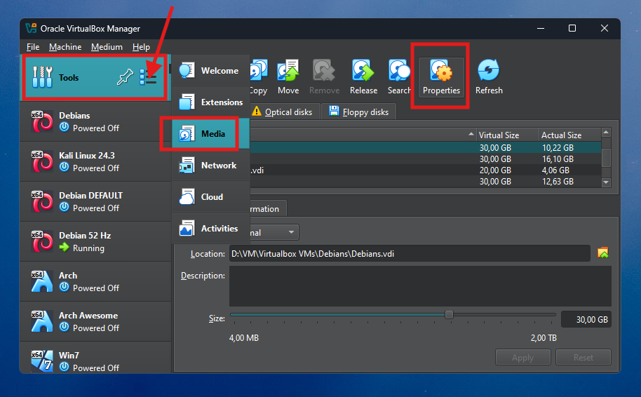
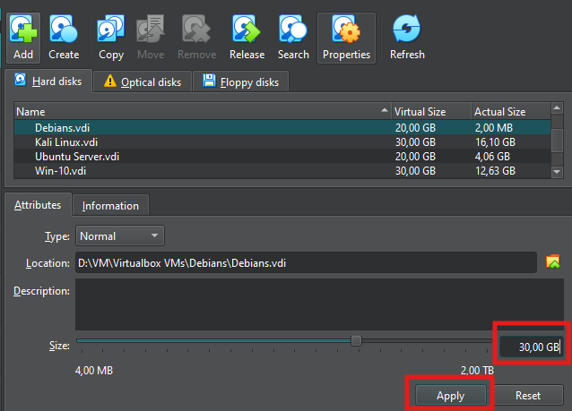
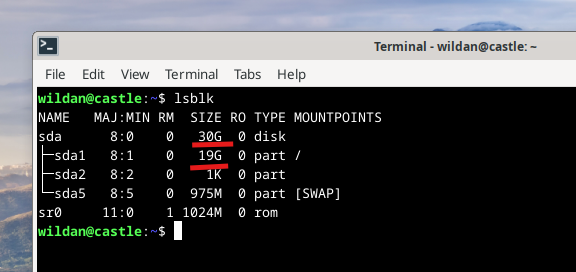
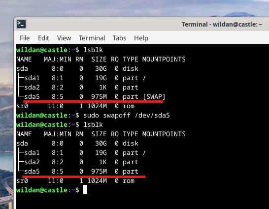
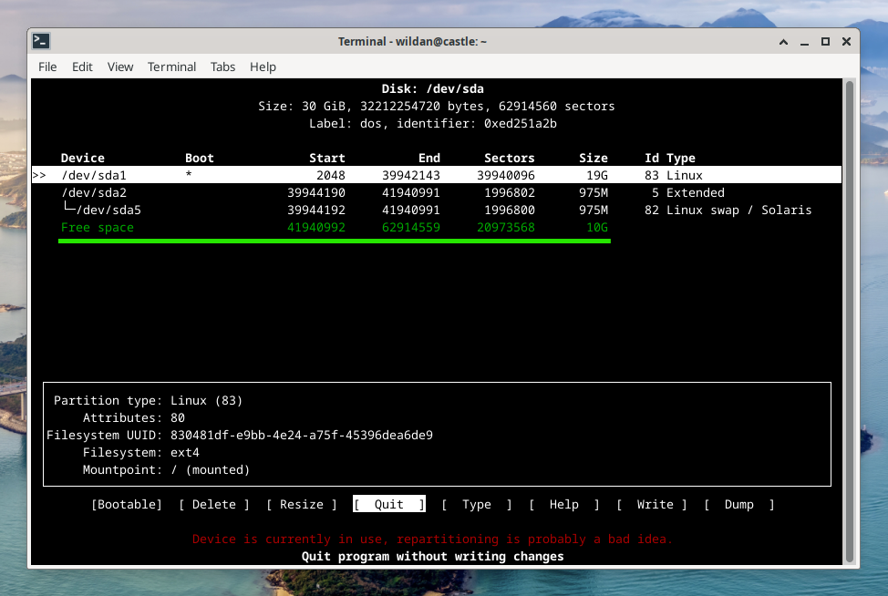
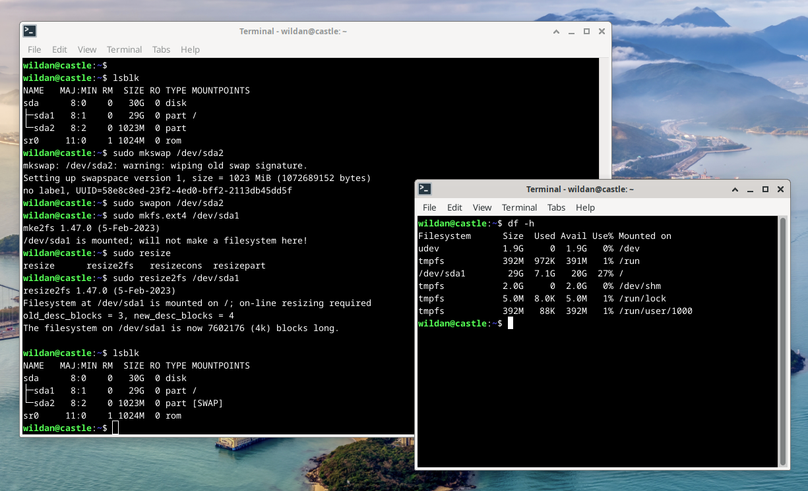
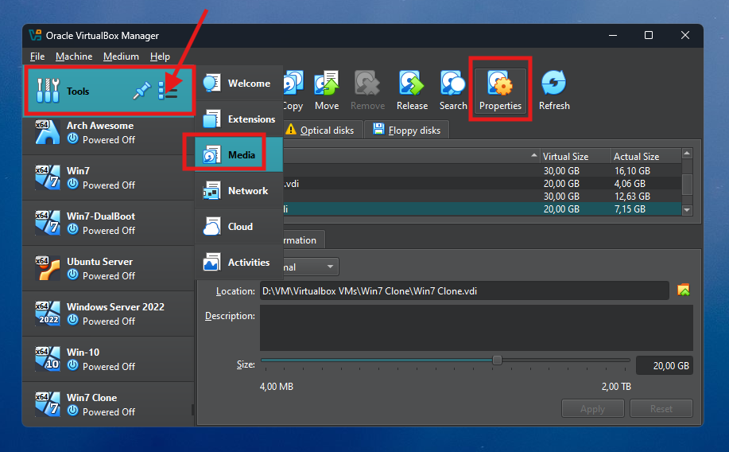
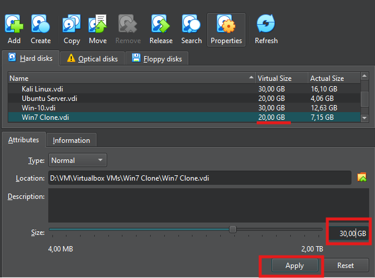
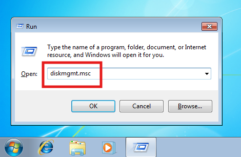
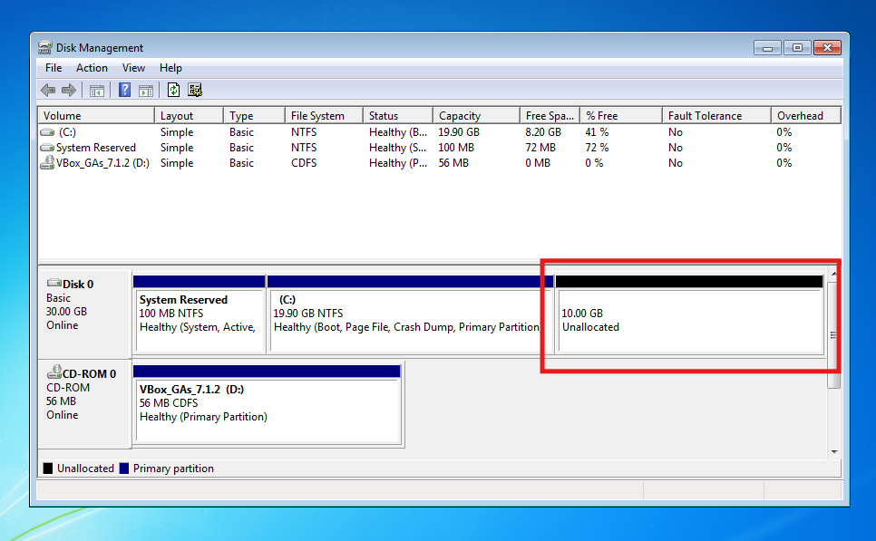

Secara *default*, biasanya saya akan mengatur ukuran *virtual disk* untuk VM saya di Virtualbox di sekitar 20 GB. Dulu, ketika VM tersebut sudah mulai terisi penuh *disk size*-nya sementara saya masih memerlukan *space* atau ruang kosong, biasanya yang saya lakukan adalah meng-*install* ulang VM tersebut atau menambah ukuran disk-nya. Sayangnya, saat itu, tutorial menambah VM *disk size* yang saya jumpai di internet adalah tutorial menambah VM disk size di virtualbox berbasis CLI via command prompt / powershell. 

Nah, kali ini, saya sudah menemukan cara yang relatif lebih awam-*friendly* (baca: mudah dipahami) karena kita hanya perlu mengutak-atik GUI dari virtualbox itu sendiri. Jadi, di tutorial ini, saya akan berbagi cara menambah ukuran disk *virtual machine* (VM) di Virtualbox, baik VM Linux maupun VM windows. Nah, untuk skema tutorial ini, saya memiliki sebuah VM Debian dengan *disk size* 20 GB yang akan saya tambahkan 10 GB sehingga nanti ukuran disk-nya akan menjadi 30 GB. 

:::warning

Sebelum melakukan langkah-langkah di bawah ini, pastikan data (yang dianggap penting) sudah di-*backup* terlebih dahulu karena meskipun (sejauh saya praktek) harusnya tidak ada data yang hilang ketika melakukan langkah-langkah di bawah ini, kita harus tetap berjaga-jaga untuk mengantisipasi kemungkinan terburuk.

:::      

## Linux

Secara detail, ukuran disk 20 GB yang saya punya saat ini di Linux terbagi menjadi 2 partisi utama, yaitu 19 GB di **`/dev/sda1`** dengan *file system* ext4, 1 GB di **`/dev/sda5`** dengan *file system* SWAP. Nah, nanti, saya akan tambahkan 10 GB sehingga total disk-nya akan menjadi 30 GB dengan rincian partisi 29 GB untuk *file system* ext4 dan 1 GB untuk *file system* SWAP.[^1] 

> **Note:** Saya tidak akan membahas secara rinci mengenai file system, baik ext4 maupun SWAP di artikel ini. Jika ingin mengetahui lebih dalam tentang file system di linux, bisa merujuk ke tautan berikut: [File System](https://wiki.archlinux.org/title/File_systems) & [SWAP](https://wiki.archlinux.org/title/Swap).  

### 1. Properties di Virtualbox

Pertama, pergi ke **"Virtualbox -> Tools -> Media -> Properties"**, kemudian klik file ***.vdi** yang ingin ditambah ukuran disk-nya. Di sini saya pilih VM yang sudah saya siapkan, yaitu VM Debian (Debians.vdi).



### 2. Menambah VM *disk size*

Selanjutnya, untuk menambah ukuran disk VM-nya kita hanya perlu menggeser garis di bagian **"Size"** di bawah tersebut atau langsung mengetikkan ukuran yang diinginkan. Di sini saya akan menambahkan 10 GB dari 20 GB, jadi saya akan langsung ketikkan 30 GB di kolom tersebut. Kemudian klik **Apply**. 

> **Note:** Pastikan disk utama (SSD atau Hardisk) yang digunakan sebagai "host" untuk Virtualbox memiliki kapasitas ukuran yang memadai. 



### 3. Login ke VM

Berikutnya, kita perlu masuk ke VM untuk mengkonfigurasi disk yang baru saja ditambahkan tadi. Nah, untuk melihat ukuran disk VM-nya, gunakan perintah:

```shell
lsblk
```



Terlihat ukuran **`/dev/sda`** sudah 30 GB, tapi partisinya masih sama seperti ketika masih 20 GB, yaitu 19 GB ext4 dan 1 GB SWAP. Hal yang wajar, karena memang 10 GB yang baru saja ditambahkan masih berupa disk kosong yang belum dialokasikan dan belum diformat. Oleh sebab itu, langkah-langkah berikutnya akan terkait dengan pengalokasian ulang disk dan kemudian pem-format-an disk.

### 4. Non-aktifkan SWAP

Langkah pertama untuk mulai mengatur ulang dan memformat disk, kita mula-mula perlu me-non-aktifkan SWAP dengan perintah:

```shell
sudo swapoff /dev/sda5
```



> **Note:** Perhatikan bahwa saya me-non-aktifkan SWAP di **`/dev/sda5`** karena memang disitulah file SWAP saya dijalankan. Kalian perlu menyesuaikannya dengan kondisi.

### 5. Menggunakan `cfdisk`

Pada tahap ini, kita akan mulai mengatur dan memformat ulang partisi yang sudah ada. Itu artinya, kita akan mulai menghapus partisi yang sudah ada, kemudian nanti membuat partisi baru lagi, dan dilanjutkan dengan memformat partisi baru tersebut. Untuk memulai proses ini, kita akan menggunakan *utility* [**`cfdisk`**](https://en.wikipedia.org/wiki/Cfdisk).

```shell
sudo cfdisk
```



Terlihat bahwa terdapat partisi *free space* 10 GB yang tampak di **`cfdisk`**. Itulah partisi yang baru saja ditambahkan di awal.

:::info[Instalasi cfdisk]

Secara umum, di linux **`cfdisk`** *by default* sudah ter-*install* bersamaan dengan instalasi OS-nya pertama kali. Jadi, tidak perlu melakukan instalasi lagi. Tapi, *just in case* **`cfdisk`** belum ada di distro linux kalian, **`cfdisk`** bisa di-*install* dengan *package manager* masing-masing distro:

|       Distro      |                  Command                  |
|       ---         |                   ---                     |
| **Debian**        | **`sudo apt install fdisk`**              |
| **Arch Linux**    | **`sudo pacman -Sy util-linux`**          |
| **Fedora**        | **`sudo dnf install fdisk`**              |
| **Opensuse**      | **`sudo zypper install fdisk`**           |

:::

### 6. Menghapus & memformat ulang partisi

Sekarang adalah masa-masa yang paling krusial karena kita akan melakukan proses inti dari tujuan artikel ini, yaitu menambahkan partisi baru ke disk yang ada di VM kita menggunakan utility **`cfdisk`** tadi. Berikut adalah *step by step* langkahnya:

**1. Hapus seluruh partisi yang ada.**   

   Kita akan menghapus partisi ext4 (**`/dev/sda1`**) dan juga partisi SWAP (**`/dev/sda2`** & **`/dev/sda5`**). Hal ini dilakukan agar partisi ext4 sekarang yang hanya 19 GB dapat di-*extend* ke partisi baru yang 10 GB sehingga nanti akan menjadi 29 GB. Kita tidak bisa melakukan *extend* partisi ext4 yang sekarang 19 GB ke partisi baru 10 GB secara langsung sekarang karena terhalang oleh partisi SWAP di tengah (partisi SWAP **`/dev/sda5`** ada diantara partisi ext4 **`/dev/sda1`** dan partisi *free space*) sehingga kita perlu menghapus partisi SWAP terlebih dahulu supaya nanti partisi SWAP-nya bisa diatur kembali agar posisinya berada di belakang / di akhir. 

   Cara menghapusnya, kita hanya perlu meletakkan *highlight* kursornya yang berwarna putih ke partisi yang akan dihapus dengan menggunakan *arrow key* *up* dan *down* di keyboard. Kemudian, kita arahkan *highlight* kursor di bagian bawah ke **"Delete"** menggunakan *arrow key* *right* dan *left* di keyboard. Lalu tekan Enter. Lakukan ke semua partisi yang terdaftar hingga semua partisi menjadi satu partisi *free space*.

**2. Buat partisi baru.**

   Buat minimal 2 partisi baru. Saya akan buat dua partisi, yang pertama untuk ext4 di **`/dev/sda1`** dengan size 29 GB dan partisi kedua 1 GB untuk SWAP di **`/dev/sda2`**. 
   
   Caranya, pilih **"New"** pada partisi *free space* tadi (di saya 30 GB), kemudian sesuaikan ukuran untuk membuat partisi pertama, yaitu ext4, saya akan buat 29 GB, lalu Enter, dan pilih **"primary"**. Nanti akan ada sisa satu partisi kosong (*free space*) yang akan kita gunakan sebagai SWAP. Caranya, arahkan *highlight* kursor-nya ke partisi kosong tersebut, pilih **"New"**, biarkan *partition size*-nya *default*, lalu berikutnya pilih **"primary"**. 

   Sekarang, sudah ada 2 partisi baru, tapi partisi SWAP (yang 1 GB) masih belum diganti file system-nya ke SWAP. Jadi, kita perlu menggantinya terlebih dahulu. Caranya, arahkan highlight kursos ke partisi SWAP, kemudian pilih **"Type"**, pilih **"82 Linux swap / Solaris"**.

   Terakhir, pilih **"Write"** untuk menuliskan perubahan partisi yang baru saja kita lakukan ke disk dan ketik **yes** jika ada pesan konfirmasi. Setelah itu, kita bisa keluar **`cfdik`** dengan memilih **"Quit"** di menu di bawah atau menekan tombol **q** di keyboard. Untuk melihat dan memastikan partisi baru kita sudah berhasil dibuat, kita bisa kembali menggunakan **`lsblk`**.

   Berikut video untuk menghapus & membuat partisi baru dengan **`cfdisk`**:

<iframe
  src="https://player.cloudinary.com/embed/?cloud_name=dpvtbnqf7&public_id=updisk1_mub148"
  width="640"
  height="360" 
  style="height: auto; width: 100%; aspect-ratio: 640 / 360;"
  allow="autoplay; fullscreen; encrypted-media; picture-in-picture"
  allowfullscreen
  frameborder="0"
></iframe>

**3. Memformat partisi baru**   

   Memformat partisi **`/dev/sda2`** ke SWAP:
   
   ```shell
   sudo mkswap /dev/sda2
   sudo swapon /dev/sda2
   ```
   Memformat partisi **`/dev/sda1`** ke ext4 sekaligus *extend* ukurannya ke 29 GB:

   ```shell
   sudo mkfs.ext4 /dev/sda1
   sudo resize2fs /dev/sda1
   ```



Selesai! 

Kita sudah berhasil menyelesaikan proses penambahan ukuran disk ke VM di linux (Debian). Jika kalian menggunakan distro linux atau UNIX yang lain, silakan disesuaikan karena pada dasarnya perintah dan langkah-langkahnya relatif sama saja, hanya akan beda di *package manager* saja (itupun kalau memerlukan *package manager*).

## Windows

Saya juga punya sebuah VM Windows 7 dengan ukuran disk 20 GB yang terdaftar sebagai drive **C:\** yang akan saya tambahkan 10 GB. Walaupun pada tutorial ini saya menggunakan Windows 7, akan tetapi, cara menambahkan ukuran disk di Windows di bawah ini dapat dipraktekkan juga untuk versi-versi Windows lainnya, seperti Windows 10 dan Windows 11.[^2] 

### Properties di Virtualbox

Seperti biasa, untuk meng-*increase* VM *disk size*- VM Windows-nya, di Virtualbox kita bisa menujuk **"Tools -> Media -> Properties"**, kemudian klik file **.vdi** yang ingin ditambahkan ukuran disk-nya. Di sini saya akan pilih VM Windows 7 saya (Windows7 Clone). 



### Menambahkan VM disk size

Tinggal tambahkan berapa jumlah tambahan disk-nya. Seperti rencana awal, saya akan menambahkan 10 GB ke disk Windows 7 saya yang 20 GB. Berarti, saya akan tulis / ketik jumlah total ukuran disk-nya, yaitu 30 GB. Klik **"Apply"**.



### Login ke VM 

Selanjutnya, kita perlu login ke VM yang baru saja kita tambahkan ukuran disk-nya. Untuk melihat jumlah disk dan partisinya di Windows, kita perlu pergi ke **"Disk Management"**. Salah satu cara untuk membuka aplikasi **Disk Management** di Windows adalah dengan menggunakan *shortcut* **"Ctrl+r"**, kemudian akan muncul *prompt* **Run** yang akan kita isi dengan **diskmgmt.msc**.



Sekarang, kita bisa melihat ada 10 GB disk baru (*unallocated*):



### Extend disk size

Nah, di sini, saya akan menambahkan 10 GB tersebut ke drive **(C:)** yang saat ini disk-nya berukuran 20 GB sehingga nanti drive **(C:)** akan menjadi 30 GB ukuran disk-nya:

Caranya, 
1. klik kanan di drive **(C:)**, pilih **"Extend Volume"**, 
2. pada bagian "Welcome ..." di window "Extend Volume Wizard" klik **"Next"**, 
3. kemudian pastikan jumlah *space* yang ingin ditambahkan pada kolom "Select the amount of space in MB" sudah sesuai dengan "Maximum available space in MB" karena kita akan menambahkan seluruh *free space* tadi (10 GB) ke drive **(C:)**, klik **"Next"**, 
4. dan klik **"Finish"**.  

Untuk memperjelas, berikut adalah video *extend disk size* di Windows:

<iframe
  src="https://player.cloudinary.com/embed/?cloud_name=dpvtbnqf7&public_id=updisk2_mi6olo"
  width="640"
  height="360" 
  style="height: auto; width: 100%; aspect-ratio: 640 / 360;"
  allow="autoplay; fullscreen; encrypted-media; picture-in-picture"
  allowfullscreen
  frameborder="0"
></iframe>

Selesai!

Kita sudah berhasil menambahkan *disk size* untuk VM Windows di Virtualbox. Untuk memastikannya, kita bisa membuka "File Explorer" dan melihat ukuran drive **(C:)** -nya.


[^1]: www.chatgpt.com/
[^2]: https://www.youtube.com/watch?v=pVjDFBdBQ7I


