## Virt-manager?

[**Virt-manager**](https://virt-manager.org/) atau ***"Virtual Machine Manager"*** adalah _software_ untuk melakukan manajemen mesin virtual, seperti 2 _software_ populer lainnya, yaitu [Virtualbox](https://www.virtualbox.org/) dan [VMWare](https://www.vmware.com/).[^1] Perbedaan signifikan antara Virt-manager dengan 2 _hypervisor_ lainnya terletak pada penggunaan **KVM (Kernel-based Virtual Machine)** sebagai teknologi virtualisasinya, dimana KVM ini hanya ada di Linux saja.[^2] Dengan kata lain, Virt-manager adalah _hypervisor_ tipe 1 (_baremetal_), sementara Virtualbox dan VMWare adalah _hypervisor_ tipe 2 (_hosted_). Oleh karena itu, performa VM (_Virtual Machine_) di Virt-manager dinilai relatif lebih baik dibandingkan dengan Virtualbox atau VMWare. 

> **Hypervisor** adalah sebuah program untuk menjalankan dan me-*manage* satu atau lebih mesin virtual di komputer.[^3] Hypervisor tipe 1 (_baremetal_) adalah hypervisor yang langsung berjalan di atas hardware dari host-nya untuk melakukan manajemen VM. Sementara hypervisor tipe 2 (_hosted_) adalah hypervisor yang berjalan sebagai aplikasi dari sistem operasi host-nya.[^4]

## Installation

Berikut adalah cara meng-install Virt-manager di beberapa distro Linux populer:

|       Distro      |                  Command                           |
|       ---         |                   ---                              |
| **Debian/Ubuntu** | **`sudo apt install virt-manager`**                |
| **Arch Linux**    | **`sudo pacman -Sy virt-manager`**                 |
| **Opensuse**      | **`sudo zypper install virt-manager`**             |
| **Fedora**        | **`sudo dnf install virt-manager`**     			     |

Selain itu, terdapat beberapa paket tambahan yang juga perlu di-_install_, diantaranya adalah sebagai berikut:

```shell
sudo pacman -Sy --needed virt-manager qemu-full libvirt dnsmasq ebtables
```

Kemudian, kita perlu mengaktifkan **libvirt daemon**-nya.

```shell
sudo systemctl start libvirtd
sudo systemctl status libvirtd # untuk melihat status libvirtd
```

:::note

**NixOS:**  
Masukkan baris berikut di file konfigurasi (`/etc/nixos/configuration.nix`):

```nix
  environment.systemPackages = [
    pkgs.virt-manager
  ];
```

Atau jika menggunakan `nix-shell`:

```shell
nix-shell -p virt-manager
```

:::

## The Interface

Berikut adalah tampilan Virt-manager.

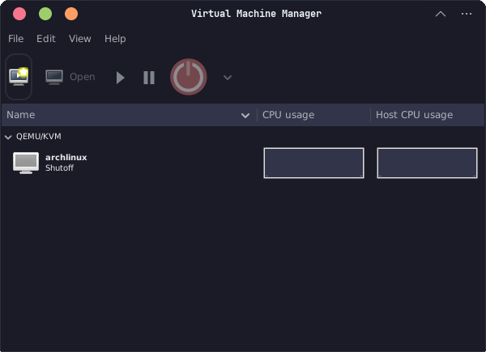

Seperti terlihat pada gambar, ada beberapa menu seperti "File", "Edit", "View", "Help" di bagian atas jendela Virt-manager. Kemudian, di bawahnya, terdapat beberapa tombol yang langsung berkaitan dengan VM yang terpasang, dari paling kiri:
- Create a new virtual machine
- Show the virtual machine console and details
- Power on the virtual machine
- Pause the virtual machine
- Shut down the virtual machine
    - Reboot
    - Shutdown 
    - Force reset
    - Force off
    - Save

Selain itu, di bagian utamanya, kita dapat melihat VM yang sudah terpasang, berikut dengan status kondisinya (apakah sedang "Running" atau "Shutoff"). Di sampingnya, terdapat informasi mengenai penggunaan CPU-nya.

## VM Management

Sekarang, kita akan mulai membahas inti dari artikel ini, yaitu "Pengelolaan VM".

### Creating VM

Sekarang, kita akan membuat sebuah VM di Virt-manager. VM ini dapat berupa sistem operasi apapun (Linux, Windows, Mac). Yang kita perlukan hanya sebuah file image-nya saja (biasanya berekstensi ".iso").

:::note

Kita akan banyak menggunakan salah satu dari dua "opsi" perintah berikut untuk melakukan manajemen VM. Berikut adalah perbedaannya:

1. **qemu:///system**: connect to "system" libvirtd instance.
2. **qemu:///session**: connect to "session" libvirtd instance.

Silakan dipilih berdasarkan preferensi masing-masing. Pada tutorial ini, saya akan menggunakan opsi yang pertama, yaitu `qemu:///system`.

Selengkapnya:  
https://blog.wikichoon.com/2016/01/qemusystem-vs-qemusession.html

:::

Untuk membuat sebuah VM:

```shell
virt-manager --connect qemu:///system --show-domain-creator
```

**1. Step 1**

Akan muncul jendela "New VM", pilih "Local install media (ISO image or CDROM)". Klik "Forward".

**2. Step 2**

Cari file ISO yang ingin dibuatkan VM-nya. Klik "Forward".

**3. Step 3**

Alokasikan "_Memory_ (RAM)" dan "CPU" untuk VM tersebut. Klik "Forward".

**4. Step 4**

Alokasikan penyimpanan (_storage_) untuk VM tersebut. Saran saya, alokasikan minimal 20 GB untuk VM Linux atau 40 GB untuk VM Windows. Klik "Forward".

**5. Step 5**

Pada bagian ini, kita dapat melihat informasi terkait VM yang akan dibuat seperti nama, alokasi _memory_ & CPU, _storage_, serta _network_. Buatkan nama untuk VM yang akan dibuat. Nama ini yang nanti akan muncul di tampilan Virt-manager. Untuk bagian "Network selection", biarkan default (NAT). Klik "Finish".

:::info

Jika menjalankan Virt-manager sebagai ***system*** (`qemu:///system`), maka file VM biasanya akan disimpan di:

```
/var/lib/libvirt/images
```

:::

VM berhasil dibuat.

### Listing Network

Sebelum memulai VM, pastikan _networking_-nya sudah jalan.  
Untuk mengecek kondisi _networking_ yang tersedia, dan apakah sudah jalan atau belum:

```shell
sudo virsh net-list --all
```

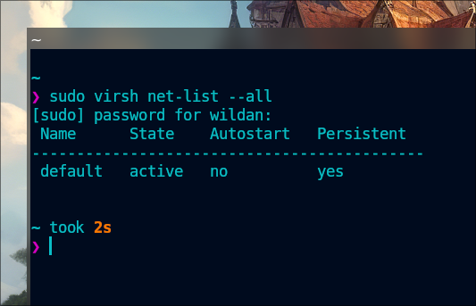

### Starting Network

Untuk menjalankan _networking_ (jika belum jalan):

```shell
sudo virsh net-start <network_name>
```

Atau jika ingin agar _network_ langsung otomatis jalan begitu komputer _booting_:

```shell
sudo virsh net-autostart <network_name>
```

### Inspecting Network

Untuk melihat informasi yang lebih detail tentang suatu _network_ (jaringan):

```shell
sudo virsh net-info <network_name>
```

### Stopping Network

Jika ingin mematikan _network_:

```shell
sudo virsh net-destroy <network_name>
```

### Starting VM

Untuk memulai VM:

```shell
virsh --connect qemu:///system start <vm-name>
```

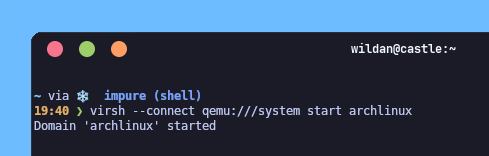

### Listing VM

Untuk melihat daftar VM berikut status-nya:

```shell
virsh --connect qemu:///system list --all
```

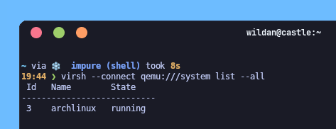

### Showing VM info

Jika kita ingin melihat informasi detail pada suatu VM:

```shell
virsh --connect qemu:///system dominfo <vm-name>
```

### Showing VM ip address

Jika kita ingin melihat informasi ip address pada suatu VM:

```shell
virsh --connect qemu:///system domifaddr <vm-name>
```

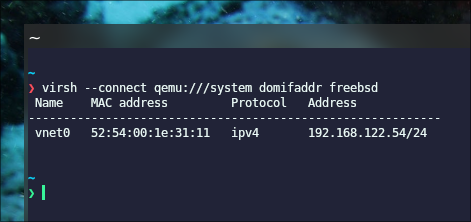

### Shutting down VM

Ada 2 cara untuk mematikan sebuah VM:

1. **shutdown** (cara normal)

Disebut "cara normal", karena cara ini sama seperti kita mematikan sistem operasi sebagaimana normalnya, misalnya di Windows, kita pergi ke menu "Start", kemudian meng-klik bagian "Shutdown".

```shell
virsh --connect qemu:///system shutdown <vm-name>
```

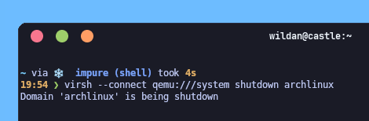

2. **destroy** (cara paksa)

Disebut "cara paksa", karena memang kita memaksa VM kita untuk langsung mati, seperti menekan tombol power di komputer fisik kita.

```shell
virsh --connect qemu:///system destroy <vm-name>
```

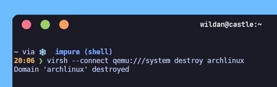

### Suspending VM

Kita juga dapat men-*suspend* (seperti _sleep_) VM kita:

```shell
virsh --connect qemu:///system suspend <vm-name>
```

Untuk melanjutkannya (membangunkan VM dari mode _suspend_):

```shell
virsh --connect qemu:///system resume <vm-name>
```

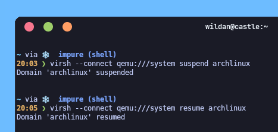

### VM Graphical Console

Jika kita memerlukan tampilan grafis dari VM yang sedang berjalan,

- menggunakan `virt-manager`:

```shell
virt-manager --connect qemu:///system --show-domain-console <vm-name>
```

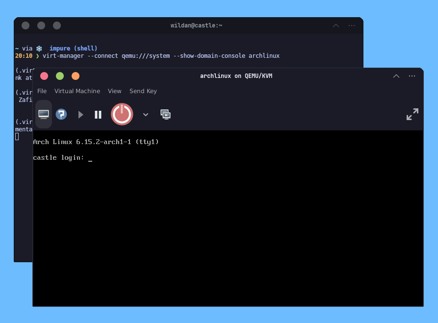

- menggunakan `spicy`:

```shell
spicy -h 127.0.0.1 -p <vm-port>
```

Untuk mengetahui port dari VM yang sedang berjalan:

```shell
virsh --connect qemu:///system domdisplay <vm-name>
```

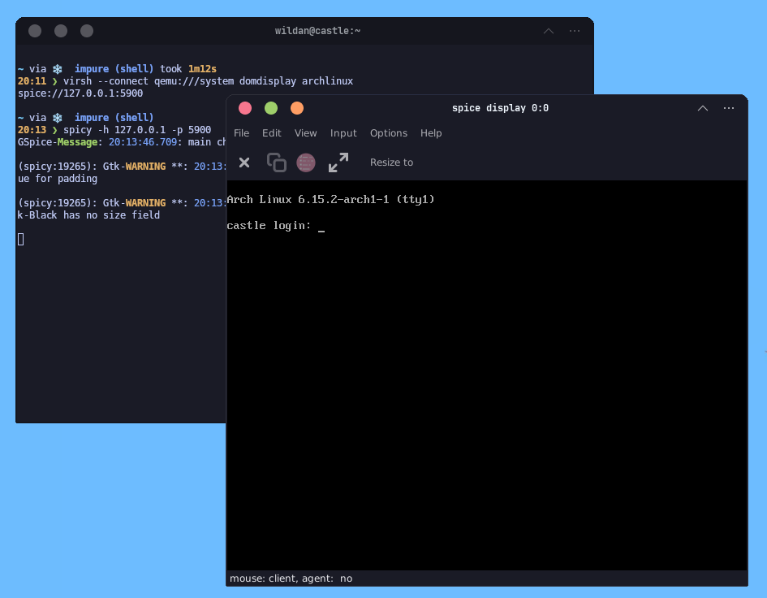

### Deleting VM

Untuk menghapus VM:

```shell
virsh --connect qemu:///system undefine <vm_name> # atau
virsh --connect qemu:///system undefine --domain <vm_name> 
```

Kemudian, kita juga perlu menghapus _file storage_-nya juga secara manual:

```shell
sudo rm -r /var/lib/libvirt/images/<vm_name>.qcow2
```

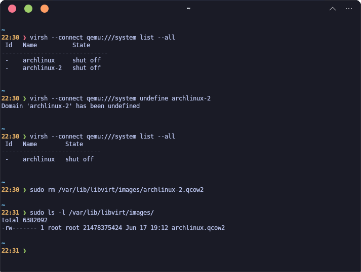

Sekian.  
Semoga bermanfaat.

---

_Since I played "Virt-manager" at the first time, I knew this hypervisor has been outrageously captivating_... Saya bahkan bisa menjalankan [hyprland](https://hypr.land/) dengan relatif lancar, berbanding jauh dengan Virtualbox & VMWare yang _laggy_ parah..

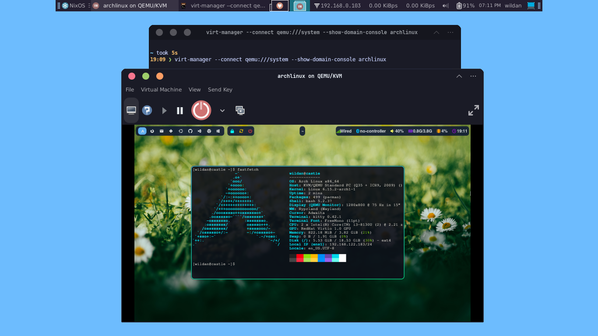


[^1]: https://virt-manager.org/
[^2]: https://www.redhat.com/en/topics/virtualization/what-is-KVM
[^3]: https://www.vmware.com/topics/hypervisor
[^4]: https://aws.amazon.com/compare/the-difference-between-type-1-and-type-2-hypervisors/?nc1=h_ls


