## Overview

[Virustotal](https://www.virustotal.com/gui/home/url) adalah salah satu website terbaik untuk melakukan identifikasi terhadap suatu file/software/aplikasi dan url, apakah mengandung virus atau malware (*malicious software*) atau tidak. Dengan kata lain, melalui bantuan website ini, kita dapat mengecek suatu file/software/aplikasi maupun suatu link/url apakah berbahaya atau tidak sebelum kita menginstallnya di device kita masing-masing.

Virustotal[^1] menjadi salah satu website penyedia jasa *scanning* virus terbaik karena website tersebut melakukan *scanning* dengan menggunakan **lebih dari 50 vendor antivirus**, termasuk diantaranya adalah Avira, BitDefender, dan Kaspersky.

Pada halaman utama website-nya, Virustotal memiliki 3 opsi *scanning*, yaitu opsi **File**, opsi **URL**, dan opsi **Search**. 

### 1. Opsi File 
Opsi **File** digunakan untuk melakukan *scanning* terhadap suatu file, apapun format filenya. File yang dimaksud dapat berupa file office (doc, ppt, xlsx, pdf), file program apapun sistem operasinya (exe, apk, sh, dll), dan file-file lainnya. Sebagai catatan, file yang diunggah ke Virustotal dibatasi ukurannya hingga **maksimal 650 MB**. Artinya, file dengan ukuran lebih besar dari 650 MB tidak dapat diunggah ke website tersebut.
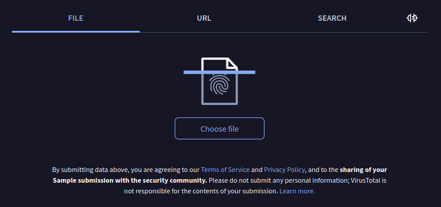

### 2. Opsi URL 
Opsi **URL** digunakan untuk melakukan *scanning* terhadap suatu link atau URL (*Uniform Resource Locator*). Semua link (yang kita anggap berbahaya atau memiliki virus) dapat di-*copy-paste* di menu ini.
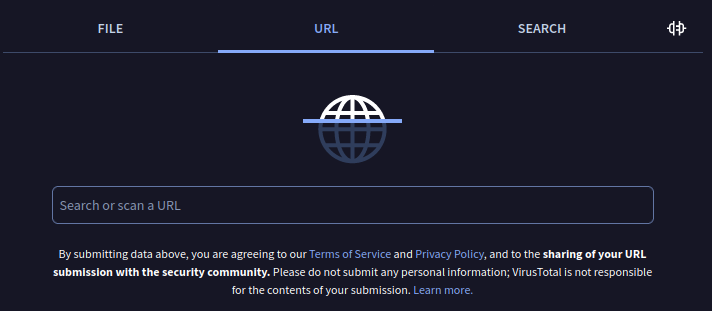

### 3. Opsi Search
Opsi **Search** sebetulnya mirip dengan opsi **URL**, namun, secara lebih luas, opsi ini dapat digunakan untuk melakukan *scanning* terhadap sebuah domain, *IP Address*, dan juga file hash.
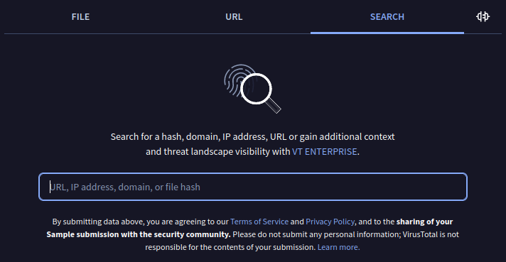

## Demo

Pada demo kali ini, saya akan melakukan *scanning* pada setiap opsi yang ada di Virustotal, mulai dari opsi file, opsi url, dan opsi search. Setiap demo akan terdiri dari 2 skenario, yaitu **skenario bersih** (non-virus) dan **skenario kotor** (virus).

### 1. Opsi File

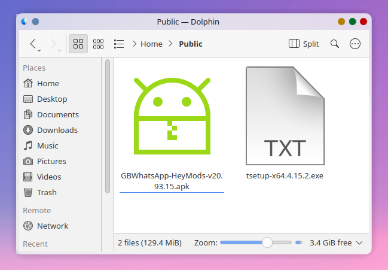
Seperti terlihat pada *screenshot* tersebut, saya sudah memiliki 2 file:

- file ***installer*** Whatsapp GB untuk Android (dapat dilihat ekstensi filenya .apk), yang merupakan file (yang saya asumsikan) bervirus karena saya mendapatkannya tidak dari website resmi alias Playstore, melainkan dari website bajakan berikut: https://android62.com/download/gb-whatsapp/. 

- file ***installer*** Telegram untuk Windows (dapat dilihat ekstensi filenya .exe), yang merupakan file (yang saya asumsikan) tidak bervirus karena saya mengunduhnya langsung dari website resmi telegram di: https://desktop.telegram.org/.

#### Skenario Bersih
Pada skenario bersih, saya akan menggunakan file *installer* Telegram. Cara untuk melakukan *upload*-nya cukup sederhana, yaitu kita tinggal meng-klik tombol **choose file**, kemudian pilih file yang akan diunggah.

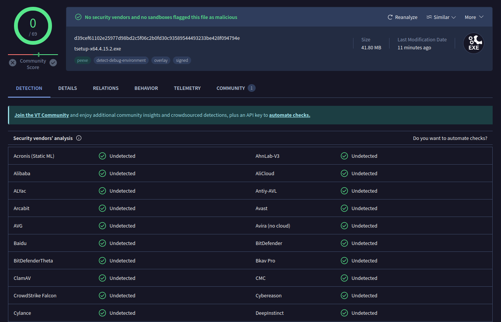
Berdasarkan *screenshot* tersebut, dapat terlihat kesimpulannya, yaitu 0/69 dengan warna hijau total, yang artinya, 69 antivirus yang sudah melakukan *scanning* tidak mendapatkan tanda-tanda file *installer* Telegram tersebut mengandung virus. 

Beberapa informasi lainnya yang tampak, misalnya **Last Modification Date 11 Minutes ago** artinya, seseorang sudah lebih dulu melakukan upload file serupa ke Virustotal 11 menit yang lalu.

#### Skenario Kotor
Pada skenario kotor, saya akan menggunakan file *installer* Whatsapp GB.

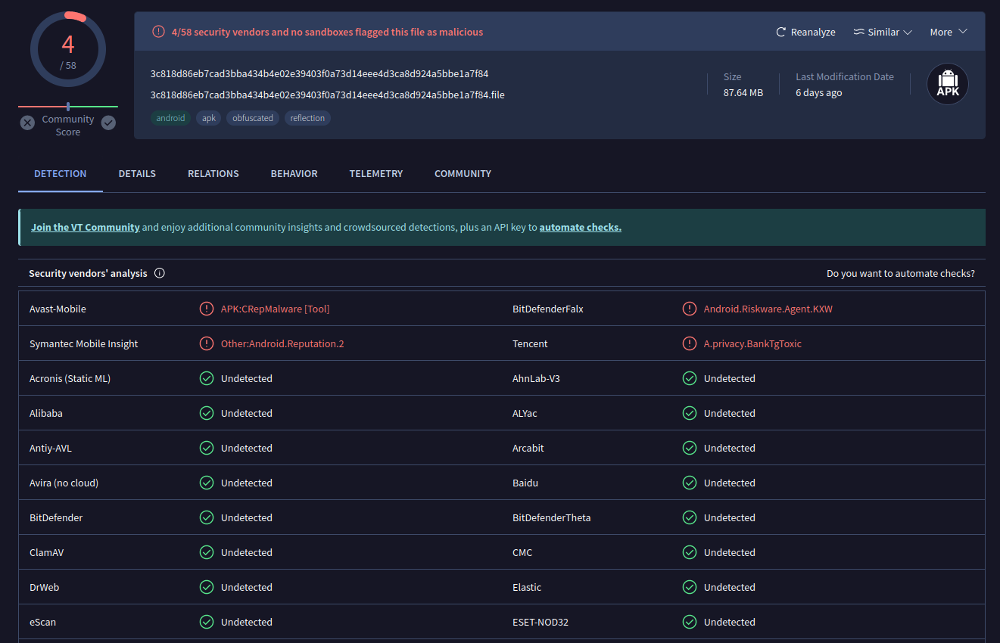
Berdasarkan *screenshot* tersebut, dapat dilihat kesimpulannya, yaitu 4/58 vendor antivirus mengatakan bahwa file *installer* Whatsapp GB tersebut mengandung virus. Adapun vendor yang dimaksud ada **Avast-Mobile**, **Symantec Mobile Insight**, **BitDefenderFalx**, dan **Tencet**. Melihat **Last Modification Date**-nya, kita juga tahu bahwa file ini sudah pernah diunggah ke Virustotal 6 hari yang lalu.

Dengan melihat laporan Virustotal tersebut, sudah selayaknya kita tidak menggunakan file *installer* tersebut untuk di-*install* di *smartphone* Android kita.

### 2. Opsi URL

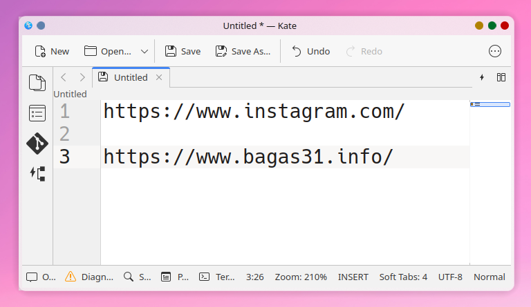
Seperti terlihat pada *screenshot* tersebut, saya sudah memiliki 2 target URL yang akan diuji coba:

- URL https://www.instagram.com yang (saya asumsikan) bersih karena memang umum digunakan oleh banyak orang.

- URL https://www.bagas31.info yang sebetulnya adalah website software bajakan yang saya cari random di internet sehingga website tersebut (saya anggap) kotor.

Mari kita uji coba...

#### Skenario Bersih
Pada skenario bersih, saya akan mencoba menginputkan link url dari Instagram: 

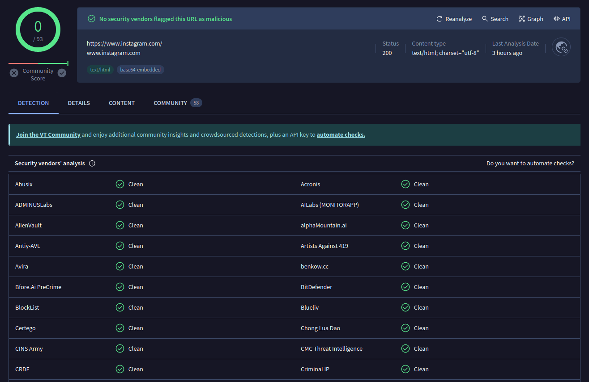
Bersih, 0/93 vendor tidak ada yang mengatakan link tersebut mengandung virus atau malware. Seseorang juga baru mengecek link tersebut sekitar 3 jam yang lalu.

#### Skenario Kotor
Pada skenario kotor, saya akan menginputkan link kedua, yaitu link software bajakan:

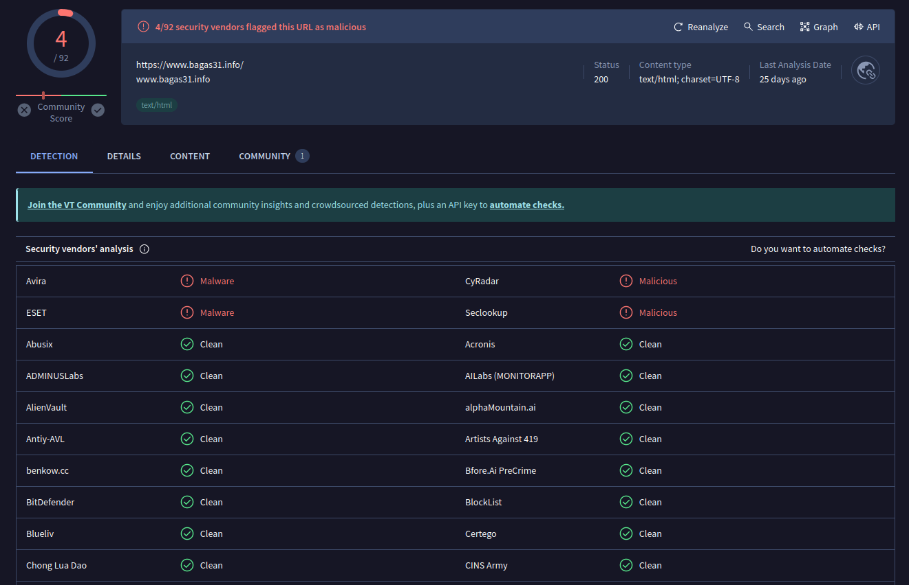
Kotor, karena setidaknya ada 4/92 vendor antivirus bilang bahwa link tersebut mengandung virus. Seseorang ternyata ada yang sudah lebih dahulu menganalisis link tersebut sejak kira-kira 25 hari yang lalu.

### 3. Opsi Search

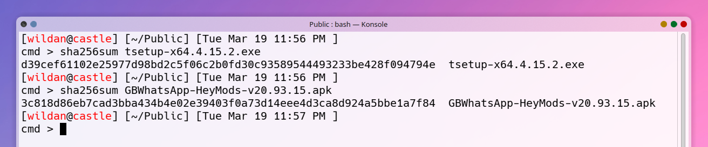
Seperti terlihat pada *screenshot*, saya akan menggunakan 2 aplikasi yang saya gunakan sebelumnya di Opsi File, yaitu file *installer* Telegram dan *installer* Whatsapp GB. Hanya saja, kali ini, yang akan saya gunakan adalah hash dari kedua file tersebut. Dengan kata lain, melalui hash (algoritma **sha 256**) file tersebut, saya dapat mengetahui apakah file tersebut mengandung bersih atau kotor.

**Hash file (SHA 256)** *installer* Telegram: d39cef61102e25977d98bd2c5f06c2b0fd30c93589544493233be428f094794e

**Hash file (SHA256)** *installer* Whatsapp GB: 3c818d86eb7cad3bba434b4e02e39403f0a73d14eee4d3ca8d924a5bbe1a7f84

#### Skenario Bersih
Pada skenario bersih, saya akan menggunakan hash file *installer* Telegram.

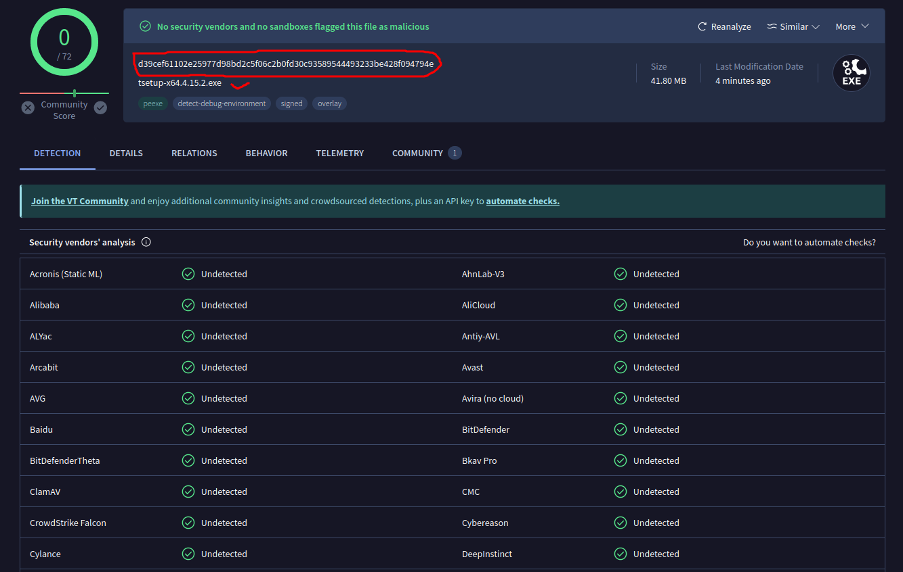
Bersih,...

#### Skenario Kotor
Pada skenario kotor, saya akan menggunakan hash file *installer* Whatsapp GB.

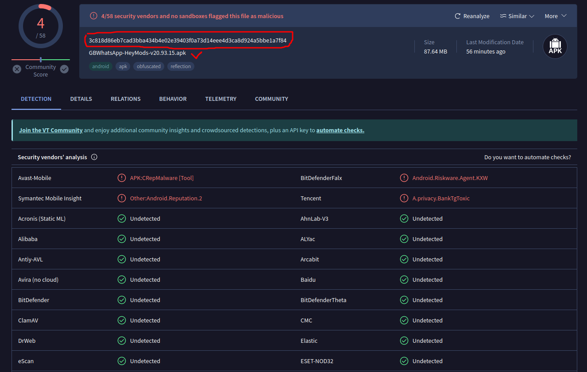
Kotor,...

## Catatan-catatan

- Website Virustotal ini akan sangat membantu untuk memutuskan apakah suatu file mengandung virus atau tidak. Jika suatu program atau aplikasi (seperti aplikasi Whatsapp GB yang sudah saya uji tadi) diketahui memiliki virus, maka, kita secara bijak dapat memutuskan untuk tidak menginstall program tersebut di device kita. Atau jika kita mengetahui suatu link dikatakan mengandung virus, kita juga akan hati-hati untuk mengunjungi link tersebut.

- File ataupun link yang sudah diunggah atau diupload ke Virustotal akan tersimpan di database Virustotal. Dengan kata lain, jika kita sedang melakukan pembuatan atau pengembangan malware untuk keperluan Cyber Security, atau alasan lainnya yang mengharuskan file atau program tersebut untuk tidak ter-detect sebagai malware, maka sebaiknya tidak mengupload file atau program tersebut ke Virustotal.

- Tidak ada hasil karya manusia yang sempurna, tidak terkecuali Virustotal ini. Artinya, silakan gunakan website ini dengan sebaik-baiknya sebagai alat pembantu membuat keputusan terhadap suatu file atau link, tetapi jangan terlalu bergantung pada Virustotal. Jika Anda dapat melakukan analisis malware sendiri, saya kira itu akan lebih baik. Satu lagi yang penting, **saya tidak disponsori oleh Virustotal**, jadi, sekali lagi, silakan gunakan website Virustotal sesuai fungsinya tapi jangan bergantung padanya!

Salam damai,
Sampai jumpa lagi!

😄

[^1]: https://www.virustotal.com/gui/home/url