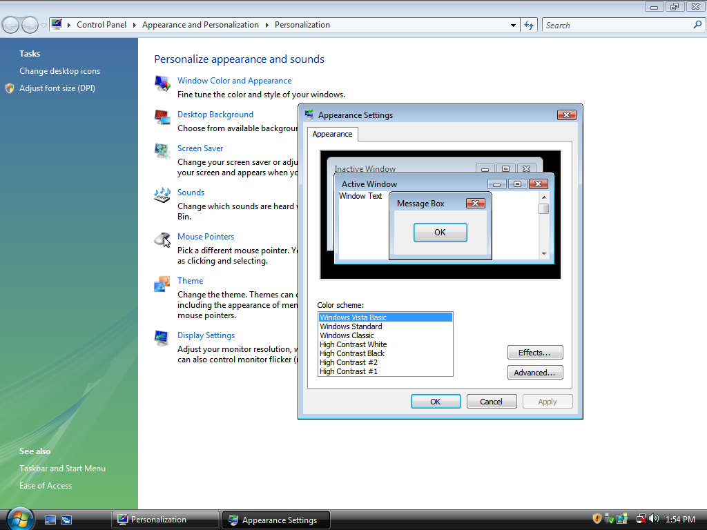
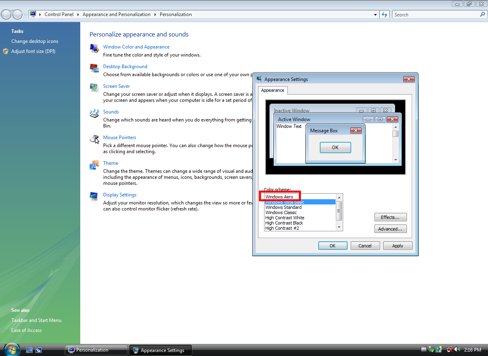
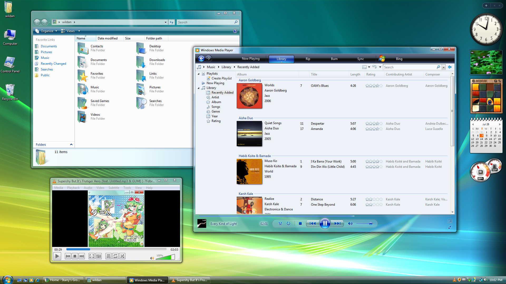
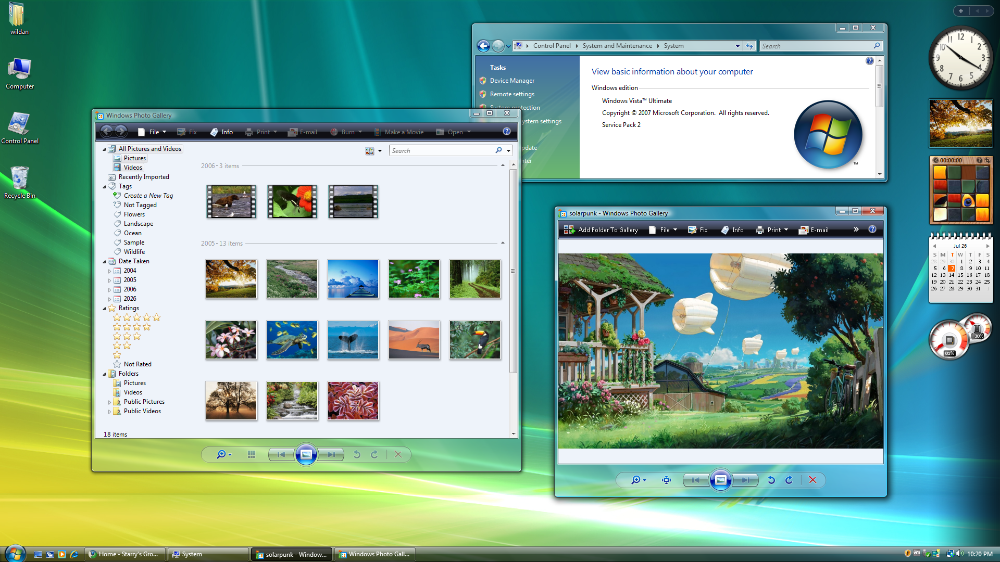
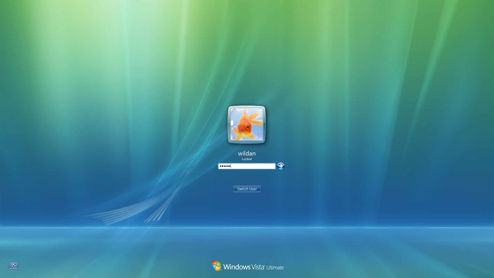
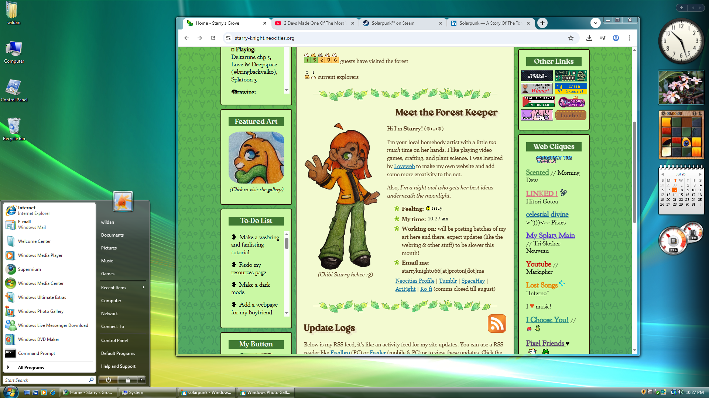

## Appetizer

### Purpose & Justification

Kenapa harus _install_ Windows Vista?  
Memang Windows Vista masih bisa dipakai untuk kerjaan?  
Kenapa gak _install_ Windows terbaru aja (Win10 / Win11)?

_Well_, ini _pure_ hobi. Jadi, kalau ada orang meng-_install_ Windows lawas (termasuk Windows Vista), dipastikan tujuannya bukan hal-hal yang "pragmatis" seperti menyelesaikan pekerjaan, dsb, tapi lebih ke alasan pribadi seperti nostalgia misalnya. 

### Prerequisites

Seperti terlihat pada judul artikel ini, kita tidak hanya sekadar meng-_install_ Windows Vista saja, tetapi juga memastikan semua fungsionalitasnya berjalan dengan normal, seperti audio, internet, dan tentu saja yang paling penting, "Aero Theme"-nya bisa berjalan. Sebab, kita juga bisa saja meng-_install_ Windows Vista di `virt-manager`, tetapi tema Aero-nya tidak berjalan karena memang ada persyaratan khusus untuk membangkitkan tema tersebut.

Jadi, berikut adalah persyaratan utama yang perlu dipenuhi:

#### 1. VMWare Workstation Pro

Hypervisor ini perlu kita _install_ terlebih dahulu, tentu saja. Saya sudah membuatkan artikel khusus yang membahas cara memasang WMWare Workstation Pro di Archlinux:



#### 2. Windows Vista ISO

File ISO Windows Vista dapat di-_download_ di sumber-sumber berikut:



#### 3. VMWare Tools 10.x

Agar Aero Theme-nya dapat berjalan, kita nanti akan memerlukan VMWare Tools versi 10.x. Berdasarkan pengalaman saya, versi 10.2.5 juga sudah cukup untuk memunculkan tema Aero. Kalian bisa mendapatkan file ISO VMWare Tools versi 10.2.5-nya dari tautan berikut:

https://packages.vmware.com/tools/esx/6.0latest/windows/

Atau jika ternyata tidak ditemukan, saya punya _backup_ file-nya di sini:

https://drive.google.com/file/d/1O-W7RuR1t7fYVA-bKe3yuk74zwWT4puX/view?usp=sharing

## Main Course

### Creating A VM

Kita perlu membuat _virtual machine_ di VMWare terlebih dahulu. Berikut adalah langkah-langkah membuatnya secara ringkas:

:::note

Saya asumsikan komputer host teman-teman berasitektur 64 bit (x64), sebab tutorial ini hanya akan menjelaskan instalasi Vista dengan arsitektur 64 bit saja. Sila cek arsitektur komputer kalian dengan perintah:

```shell
uname -m
# output 
x86_64 # 64 bit
```

:::

1. Create a New Virtual Machine / File > New Virtual Machine  
2. Custom (advanced)  
3. **Hardware Compatibility: Workstation 15.x**  
4. Use ISO image: Windows Vista ISO
5. Guest OS: Windows Vista x64 Edition  
6. Name: Windows Vista, Location: (default)  
7. Firmware Type: BIOS  
8. Number of processors: 2  
9. Memory: 4 (8 recommended)  
10. Use network address translation (NAT)  
11. SCSI controller: LSI Logic (Recommended)  
12. Virtual Disk Type: SCSI (Recommended)  
13. Disk: Create a new virtual disk  
14. Disk Size (in GB): 30 GB (40 Recommended), Store virtual disk as a single file  
15. File name: (default)  
16. Finish

Perhatikan tahap ke-3 yang saya **bold**. Opsi tersebut wajib dipilih agar Windows Vista dapat berjalan, sebab, kalau kita memilih opsi Workstation yang lebih baru (apalagi yang terbaru), kemungkinan Vista gagal ter-_install_ semakin besar (bahkan hingga pasti tidak mungkin ter-_install_).

Berdasarkan tahap-tahap pembuatan VM tersebut jugalah, kita paham secara tersirat bahwa minimal spesifikasi komputer kita adalah sebagai berikut:
1. CPU: 4 core (minimal).  
2. Storage: 60 GB (minimal).  
3. RAM: 4 GM (minimal).

Setelah proses pembuatan _virtual machine_ (VM) berhasil, kita bisa menjalankan VM tersebut dengan klik **[start]** atau VM biasanya akan langsung jalan jika _setting_ _autostart_-nya diceklis.

### Installing Windows Vista

Berikut adalah tahapan instalasi Windows Vista sebagai _virtual machine_:

:::info

Berdasarkan pengalaman saya, proses instalasi Vista ini **tidak** memerlukan koneksi internet sama sekali karena dilakukan secara offline (lagipula, apa yang perlu diambil dari internet jika Windows Vista itu sendiri sudah tidak lagi di-support Microsoft, kan). Jadi, tidak perlu khawatir kuota internet kalian akan tersedot habis.

Jika mau lebih aman, kalian bisa mematikan wifi atau internet terlebih dahulu sebelum melakukan instalasi Windows Vista ini, atau tidak menyambungkan internet ke VMWare.

```shell
# mematikan jaringan internet di vmware
sudo systemctl stop vmware-network.service 

# melihat status koneksi jaringan internet di vmware
sudo systemctl status vmware-network.service 
```

:::

1. Language, Time & Currency, Keyboard: English  
2. Install Now  
3. Un-check "Automatically activate Windows when I'm online" > Next > No  
4. **Windows Vista Ultimate**, check "I have selected the edition of Windows that I purchase" 
5. Check "I accept the license terms"  
6. Custom (advanced)  
7. Disk 0 Unallocated Space (30 GB)  
8. Wait for "Copying Files, Expanding files, Installing Features, Installing Updates, and Completing Installation" Processes  
9. Create Username & Password (& Profile Picture) account  
10. Create computer name.  
11. Help protect Windows automatically > Ask me later  
12. Time zone > Jakarta (GMT +7)  
13. Start

Sampai sini, kita berhasil meng-_install_ Windows Vista di VMWare.

Perhatikan langkah ke-4 yang saya **bold**. Opsi "Windows Vista Ultimate" itu perlu kita pilih agar kita pasti bisa mendapatkan tema Aero yang sudah kita niatkan dari awal tadi. 

Sekarang, di desktop Windows Vista, kalau kita pergi ke "Control Panel > Appearance and Personalization > Window Color and Appearance", dipastikan belum ada opsi **Aero _Color Scheme_** di sana.



### Installing VMWare Tools

Agar **Aero _color scheme_** tersebut bisa muncul, kita perlu meng-_install_ VMWare Tools yang sudah kita _download_ sebelumnya tadi (VMWare Tools versi 10.2.5).

Berikut langkah-langkahnya.

1. Pastikan VM Windows Vista dalam keadaan mati (_shutdown_).  
2. Settings > CD/DVD (SATA) > Ganti ISO Windows Vista dengan ISO VMWare Tools tersebut. 
3. Hidupkan kembali VM Windows Vista-nya.  
4. Buka File Manager > Computer > Klik dua kali ke DVD VMWare Tools-nya.  
5. Jalankan aplikasi "**setup64**" > UAC: Allow.  
6. Akan muncul Window VMWare Tools-nya.  
7. Setup type: Typical > Install > Wait hingga Finish.  
8. Restart Windows Vista.  

Sekarang, kalau kita pergi lagi ke "Control Panel > Appearance and Personalization > Window Color and Appearance" di Desktop Windows Vista, kita sudah bisa melihat **Aero _color scheme_** di sana.



Sekarang, kita bisa aktifkan dengan langkah-langkah berikut:
1. Pilih "Windows Aero" pada menu Color scheme.  
2. Klik Apply > OK.  

Selesai.  
Kita baru saja berhasil meng-_install_ Windows Vista dengan tema Aero di VMWare!

Oiya, sebelum saya lupa, saya merasa perlu berterima kasih kepada video Youtube berikut yang sudah memberitahu cara mendapatkan Aero di Windows Vista:

<iframe width="100%" height="468"
  src="https://www.youtube.com/embed/eHu8MKYVavc"
  title="How to Install Windows Vista + Aero on VMWare"
  frameborder="0" allowfullscreen>
</iframe>

## Dessert 

Berikut adalah penampakan Windows Vista + Aero _color scheme_ saya!  
Saya beri judul showcase ini: **Frutiger Aero - Solarpunk**!

[click to enlage!]  

[grid]


[/grid]

[grid]


[/grid]


